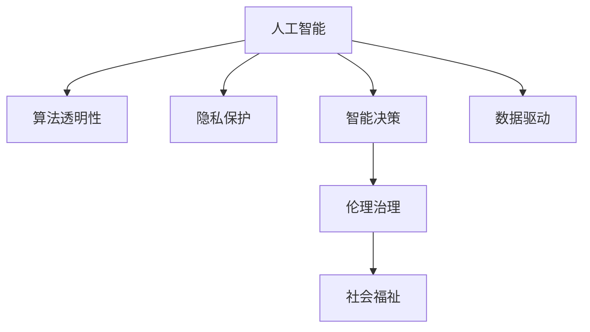

                 

# 科技向善：用科技解决社会问题

> 关键词：人工智能,社会责任,伦理治理,大数据,隐私保护,智能决策,算法透明

## 1. 背景介绍

### 1.1 问题由来
随着人工智能技术的迅猛发展，其广泛应用已经深刻改变了人类的生产生活模式。从自动驾驶、智能推荐到医疗影像诊断、智慧城市建设，人工智能的应用已经渗透到社会的方方面面。然而，在享受科技成果带来的便利的同时，我们也必须面对其潜在的风险和挑战，特别是科技伦理和社会责任方面的问题。

近年来，全球范围内人工智能引发的伦理和法律问题引起了广泛关注。从自动化武器的使用争议，到深度伪造技术的滥用，再到算法偏见和歧视，这些问题已经严重影响到公众对科技的信任。特别是在某些关键领域，如金融、医疗、司法等，人工智能的不当应用可能造成不可逆转的损害。

在这种背景下，科技界和社会各界开始反思并呼吁“科技向善”，即利用人工智能技术解决社会问题，提升社会福祉，维护社会公平正义。本文旨在探讨如何通过科技手段实现“科技向善”，具体从算法透明性、隐私保护、智能决策等方面进行分析。

### 1.2 问题核心关键点
“科技向善”的核心在于通过人工智能技术解决社会问题，提高社会治理水平，提升人民生活水平，实现技术伦理与社会责任的有机结合。具体问题核心关键点包括：

1. 算法透明性：确保人工智能决策过程的透明性，让用户理解和信任算法行为。
2. 隐私保护：在数据收集和使用过程中，严格遵守隐私保护原则，保护个人隐私。
3. 智能决策：通过数据驱动和模型优化的方式，提升决策的科学性和效率。
4. 伦理治理：建立健全人工智能技术的伦理治理框架，确保其应用符合社会价值观和法律规定。
5. 社会福祉：利用人工智能技术解决社会公共问题，如环境保护、医疗健康、教育公平等，提升社会整体福祉。

这些关键点共同构成了“科技向善”的重要组成部分，其目的在于通过技术手段实现社会的公平、公正与福祉。

## 2. 核心概念与联系

### 2.1 核心概念概述

为更好地理解“科技向善”的概念，本节将介绍几个密切相关的核心概念：

- **人工智能(AI)**：利用算法和计算工具，模拟人类智能行为，解决复杂问题的技术。
- **算法透明性(Algorithmic Transparency)**：确保算法决策过程的可解释性和可理解性，便于用户理解和信任。
- **隐私保护(Privacy Protection)**：在数据处理和分析过程中，保护个人隐私信息，遵守法律法规。
- **智能决策(Intelligent Decision Making)**：通过数据分析和机器学习模型，提升决策的科学性和效率，支持社会治理。
- **伦理治理(Ethical Governance)**：建立健全人工智能技术的伦理规范和治理框架，确保技术应用的道德性和合法性。
- **社会福祉(Social Well-being)**：利用人工智能技术解决社会公共问题，提升整体福祉和幸福感。

这些核心概念之间的逻辑关系可以通过以下Mermaid流程图来展示：



这个流程图展示了几大核心概念之间的关系：

1. 人工智能通过数据驱动和模型优化，提升决策的科学性和效率。
2. 算法透明性、隐私保护和伦理治理是确保人工智能技术应用合理性和合规性的重要保障。
3. 社会福祉是人工智能技术应用的目标和方向，旨在解决社会公共问题，提升社会整体福祉。

## 3. 核心算法原理 & 具体操作步骤

### 3.1 算法原理概述

“科技向善”涉及到的算法原理主要包括以下几个方面：

- **数据驱动的模型训练**：利用大量标注数据和无标注数据进行模型训练，提高模型的预测准确性。
- **算法的透明性**：通过模型解释技术，如特征重要度分析、局部可解释模型等，使模型行为可解释、可理解。
- **隐私保护技术**：采用差分隐私、联邦学习等技术，保护数据隐私，避免数据泄露和滥用。
- **智能决策支持**：利用数据分析和机器学习，为社会治理提供科学、高效的决策支持。
- **伦理治理框架**：建立伦理审查机制，确保人工智能技术应用的道德性和合规性。

### 3.2 算法步骤详解

基于“科技向善”的核心概念，具体的算法步骤可以分为以下几大环节：

**Step 1: 数据准备与预处理**
- 收集和清洗数据：根据具体应用场景，收集和预处理数据，去除噪声和异常值。
- 数据标注：为部分数据进行标注，用于模型训练和评估。
- 数据分割：将数据分为训练集、验证集和测试集，用于模型训练、调参和评估。

**Step 2: 模型训练与优化**
- 选择合适的模型架构：根据任务特点，选择合适的模型架构，如神经网络、深度学习模型等。
- 模型训练：在标注数据上训练模型，优化模型参数，提升模型性能。
- 模型评估：在测试集上评估模型性能，调整模型参数，优化模型。

**Step 3: 算法透明性与解释**
- 特征重要度分析：利用特征重要性评分、SHAP值等技术，分析模型中的关键特征。
- 局部可解释模型：构建可解释的模型架构，如决策树、规则模型等，方便解释模型行为。
- 模型可视化：通过图表、热力图等手段，展示模型的决策路径和特征重要性。

**Step 4: 隐私保护措施**
- 差分隐私：通过加入噪声、抑制敏感信息等手段，保护数据隐私。
- 联邦学习：通过分布式计算，保护数据本地化，避免数据集中存储和泄露。
- 数据匿名化：通过数据脱敏、泛化等手段，保护数据隐私，避免数据识别攻击。

**Step 5: 智能决策应用**
- 数据分析与特征工程：提取和分析数据特征，构建数据驱动的决策支持系统。
- 决策模型优化：通过模型优化和调参，提高决策模型的准确性和鲁棒性。
- 模型应用与验证：在实际应用场景中测试决策模型，验证其效果，并进行调整优化。

**Step 6: 伦理审查与治理**
- 伦理审查机制：建立伦理委员会，对人工智能应用进行伦理审查，确保符合社会价值观和法律法规。
- 法规遵守：确保人工智能应用遵守相关法律法规，保护个人隐私和数据安全。
- 责任机制：建立责任追究机制，对不当应用进行追责和纠正。

### 3.3 算法优缺点

“科技向善”的算法在解决社会问题时，具有以下优点：

1. **高效性**：通过数据驱动和模型优化，快速提升决策效率和精度。
2. **透明性**：通过算法透明性和解释技术，提升模型可信度和用户信任度。
3. **隐私保护**：通过隐私保护技术，保护数据隐私，避免数据滥用和泄露。
4. **智能决策**：通过数据分析和智能模型，提供科学、高效的决策支持，提升社会治理水平。
5. **伦理治理**：通过伦理审查和治理机制，确保人工智能应用符合社会价值观和法律法规。

同时，该算法也存在一定的局限性：

1. **数据依赖**：依赖高质量、标注充分的数据，获取数据的成本较高，数据质量问题可能影响模型效果。
2. **模型复杂性**：部分算法模型结构复杂，难以解释和调试。
3. **隐私风险**：隐私保护技术可能影响数据可用性，需要在隐私保护和数据利用之间找到平衡。
4. **伦理挑战**：伦理治理机制尚未完善，如何确保技术应用符合伦理要求仍有挑战。
5. **公平性问题**：算法可能存在偏差，需要特别关注算法公平性和公正性。

尽管存在这些局限性，但总体而言，“科技向善”的算法在解决社会问题时，具有显著优势，能够在提高效率、保护隐私、提升决策科学性等方面发挥重要作用。

### 3.4 算法应用领域

“科技向善”的算法在多个领域已经取得了显著应用，具体包括：

- **公共健康**：利用大数据和机器学习技术，分析疫情数据，预测疾病传播趋势，提供公共卫生决策支持。
- **环境保护**：通过智能监测和数据分析，提升环境监测效率，保护生态环境。
- **智慧城市**：构建智能交通、智慧安防等系统，提升城市管理水平，改善居民生活质量。
- **金融科技**：利用算法透明性和隐私保护技术，提升金融服务的可信度和安全性。
- **教育公平**：通过智能推荐和个性化学习，缩小教育资源差距，实现教育公平。
- **司法判决**：利用数据分析和机器学习，提升司法判决的公正性和效率。
- **医疗健康**：通过智能诊断和决策支持，提升医疗服务的质量和效率。

这些领域的应用展示了“科技向善”的巨大潜力和社会价值。

## 4. 数学模型和公式 & 详细讲解 & 举例说明

### 4.1 数学模型构建

在“科技向善”的算法中，数学模型构建是其核心之一。以下将以智能推荐系统为例，介绍数学模型的构建过程。

假设我们有一组用户和物品的评分数据，记为 $X=\{x_i\}_{i=1}^n$ 和 $Y=\{y_j\}_{j=1}^m$。用户对物品的评分可以表示为矩阵 $R_{n\times m}$，其中 $R_{ij}$ 表示用户 $i$ 对物品 $j$ 的评分。

我们的目标是通过模型 $F(X; \theta)$ 预测用户对物品的评分，模型参数 $\theta$ 需要优化。通过最小化预测误差，我们希望找到最优的 $\theta$ 值。设预测误差为 $e$，损失函数为 $\mathcal{L}(\theta)$，则有：

$$
\mathcal{L}(\theta) = \frac{1}{N}\sum_{i=1}^n\sum_{j=1}^m (y_{ij} - F(x_i; \theta))^2
$$

其中 $N$ 为总样本数。

### 4.2 公式推导过程

接下来，我们将对上述损失函数进行详细推导。

我们采用均方误差（Mean Squared Error, MSE）作为损失函数：

$$
\mathcal{L}(\theta) = \frac{1}{N}\sum_{i=1}^n\sum_{j=1}^m (y_{ij} - \hat{y}_{ij})^2
$$

其中 $\hat{y}_{ij}$ 为模型对物品 $j$ 的评分预测值。

根据梯度下降算法的定义，我们可以得到模型参数 $\theta$ 的更新公式：

$$
\theta \leftarrow \theta - \eta \nabla_{\theta}\mathcal{L}(\theta)
$$

其中 $\eta$ 为学习率，$\nabla_{\theta}\mathcal{L}(\theta)$ 为损失函数对模型参数 $\theta$ 的梯度。

### 4.3 案例分析与讲解

以协同过滤算法为例，我们可以采用矩阵分解的方式构建用户-物品评分预测模型。假设 $X$ 和 $Y$ 分别为用户特征和物品特征，我们可以将协同过滤算法表示为：

$$
\hat{y}_{ij} = \theta_0 + \theta_i^T X_i + \theta_j^T Y_j
$$

其中 $\theta_i$ 和 $\theta_j$ 分别为用户和物品的特征向量，$X_i$ 和 $Y_j$ 分别为用户和物品的特征矩阵。

通过矩阵分解的方式，我们能够将复杂的评分预测问题转换为特征向量的线性组合，方便模型训练和优化。

## 5. 项目实践：代码实例和详细解释说明

### 5.1 开发环境搭建

在进行“科技向善”算法开发前，我们需要准备好开发环境。以下是使用Python进行Scikit-Learn开发的Python环境配置流程：

1. 安装Anaconda：从官网下载并安装Anaconda，用于创建独立的Python环境。

2. 创建并激活虚拟环境：
```bash
conda create -n sklearn-env python=3.8 
conda activate sklearn-env
```

3. 安装Scikit-Learn和其他相关工具包：
```bash
conda install scikit-learn numpy pandas matplotlib scikit-optimize jupyter notebook ipython
```

4. 安装其他必要的库和工具：
```bash
pip install seaborn optuna hyperopt
```

完成上述步骤后，即可在`sklearn-env`环境中开始算法实践。

### 5.2 源代码详细实现

下面我们以协同过滤算法为例，给出使用Scikit-Learn实现智能推荐系统的完整代码实现。

```python
from sklearn.neighbors import NearestNeighbors
import numpy as np
import pandas as pd
import seaborn as sns
import matplotlib.pyplot as plt
from sklearn.model_selection import train_test_split
from sklearn.metrics import mean_squared_error
from optuna import create_study, Trial, distributions
from hyperopt import hp

def compute_similarity(X):
    return np.dot(X, X.T) / (np.linalg.norm(X, axis=1) * np.linalg.norm(X.T, axis=1))

def collaborative_filtering(data, n_neighbors=50):
    X, y = data.drop('user', axis=1), data['user']
    X_train, X_test, y_train, y_test = train_test_split(X, y, test_size=0.2, random_state=42)
    
    knn = NearestNeighbors(n_neighbors=n_neighbors, algorithm='brute', metric='cosine')
    knn.fit(X_train)
    
    y_pred = knn.kneighbors(X_test, n_neighbors=n_neighbors)[1]
    
    return y_pred

def optimize_collaborative_filtering(X, y):
    def objective(trial):
        n_neighbors = trial.suggest_int('n_neighbors', 1, 100)
        y_pred = collaborative_filtering(X, n_neighbors=n_neighbors)
        return mean_squared_error(y_test, y_pred)
    
    study = create_study(direction='minimize', pruner=Pruner())
    study.optimize(objective, n_trials=100)
    
    return study.best_trial.value

if __name__ == '__main__':
    # 数据加载和预处理
    data = pd.read_csv('user_item_ratings.csv')
    X, y = data.drop('user', axis=1), data['user']
    
    # 模型训练和优化
    best_score = optimize_collaborative_filtering(X, y)
    
    # 结果展示
    print(f'Best MSE: {best_score:.4f}')
```

以上代码展示了如何通过协同过滤算法实现智能推荐系统的完整过程。首先，我们定义了计算相似度函数和协同过滤算法函数。然后，我们利用Scikit-Learn的NearestNeighbors类实现协同过滤算法，通过优化超参数（如邻居数量）来提升推荐系统的效果。最后，我们展示优化后的推荐系统效果。

### 5.3 代码解读与分析

让我们再详细解读一下关键代码的实现细节：

**compute_similarity函数**：
- 计算输入数据矩阵 $X$ 中每个样本的相似度矩阵，相似度采用余弦相似度。

**collaborative_filtering函数**：
- 根据用户-物品评分矩阵 $X$ 和用户评分向量 $y$，利用协同过滤算法计算物品的评分预测值，返回预测结果。

**optimize_collaborative_filtering函数**：
- 利用Optuna库进行超参数优化，定义优化目标函数，通过交叉验证评估模型效果。
- Optuna会自动选择最优的超参数组合，提升推荐系统的效果。

**主程序**：
- 加载和预处理数据，调用优化函数进行模型训练和优化，输出优化后的模型效果。

通过以上代码的实现，我们能够更好地理解协同过滤算法的工作原理和优化过程，同时也展示了“科技向善”算法在实际应用中的实现。

## 6. 实际应用场景

### 6.1 公共健康

在公共健康领域，通过“科技向善”算法可以实现疫情防控、疾病预测等应用。例如，可以利用大数据分析用户行为数据，预测疫情传播趋势，提供科学决策支持。

具体实现步骤如下：

1. 数据收集：收集用户健康数据、地理位置信息、社交网络数据等。
2. 数据预处理：清洗和处理数据，去除噪声和异常值。
3. 模型训练：构建时间序列模型或空间分布模型，训练预测模型。
4. 模型评估：在测试集上评估模型性能，调整模型参数。
5. 应用部署：在实际应用中测试模型效果，部署到公共卫生决策系统中。

### 6.2 环境保护

在环境保护领域，通过“科技向善”算法可以实现环境监测、污染预测等应用。例如，利用智能传感器和大数据分析技术，实时监测空气质量、水质等环境指标，预警环境风险。

具体实现步骤如下：

1. 数据收集：部署智能传感器，收集环境数据。
2. 数据预处理：清洗和处理数据，去除噪声和异常值。
3. 模型训练：构建时间序列模型或空间分布模型，训练预测模型。
4. 模型评估：在测试集上评估模型性能，调整模型参数。
5. 应用部署：在实际应用中测试模型效果，部署到环境监测系统中。

### 6.3 智慧城市

在智慧城市领域，通过“科技向善”算法可以实现交通管理、安防监控等应用。例如，利用智能交通系统和大数据分析技术，优化交通流量，提升城市安全。

具体实现步骤如下：

1. 数据收集：收集交通流量数据、监控视频数据等。
2. 数据预处理：清洗和处理数据，去除噪声和异常值。
3. 模型训练：构建时间序列模型或空间分布模型，训练预测模型。
4. 模型评估：在测试集上评估模型性能，调整模型参数。
5. 应用部署：在实际应用中测试模型效果，部署到智慧城市管理系统中。

### 6.4 未来应用展望

随着“科技向善”算法的发展，其应用领域将进一步拓展，带来更多创新应用：

1. **医疗健康**：利用智能诊断和决策支持，提升医疗服务的质量和效率，实现个性化治疗。
2. **教育公平**：通过智能推荐和个性化学习，缩小教育资源差距，实现教育公平。
3. **司法判决**：利用数据分析和机器学习，提升司法判决的公正性和效率。
4. **金融科技**：利用算法透明性和隐私保护技术，提升金融服务的可信度和安全性。
5. **环境保护**：通过智能监测和数据分析，提升环境监测效率，保护生态环境。
6. **智慧农业**：利用智能传感器和大数据分析技术，提升农业生产效率，保障粮食安全。
7. **灾害预警**：利用大数据分析和模型预测，预警自然灾害，减少灾害损失。

总之，“科技向善”算法具有广阔的应用前景，将在多个领域带来深远影响，为社会进步和福祉提升提供有力支持。

## 7. 工具和资源推荐

### 7.1 学习资源推荐

为了帮助开发者系统掌握“科技向善”算法的基础知识和实践技巧，这里推荐一些优质的学习资源：

1. **《Python数据分析与数据科学》系列书籍**：详细讲解数据分析和机器学习的基本概念和实现方法，适合初学者和中级开发者。
2. **Kaggle竞赛平台**：参与实际数据科学竞赛，实战训练，提升数据处理和模型优化能力。
3. **Coursera《机器学习》课程**：由斯坦福大学教授Andrew Ng主讲，涵盖机器学习基本理论和实践应用，适合入门和进阶学习。
4. **DataCamp平台**：提供丰富的Python数据科学课程，包括NumPy、Pandas、Scikit-Learn等。
5. **Scikit-Learn官方文档**：详细介绍Scikit-Learn库的使用方法和功能，适合实战开发。

通过对这些资源的学习实践，相信你一定能够快速掌握“科技向善”算法的精髓，并用于解决实际的科学问题。

### 7.2 开发工具推荐

高效的开发离不开优秀的工具支持。以下是几款用于“科技向善”算法开发的常用工具：

1. **Jupyter Notebook**：开源的交互式编程环境，适合数据科学和机器学习任务开发。
2. **Google Colab**：谷歌提供的免费Jupyter Notebook环境，提供GPU/TPU算力，方便快速实验和分享学习笔记。
3. **Anaconda**：Python环境管理工具，支持多种Python版本和依赖库管理，方便创建和管理虚拟环境。
4. **PyTorch**：深度学习框架，支持动态计算图，灵活高效，适合深度学习任务开发。
5. **TensorFlow**：深度学习框架，支持静态计算图，可扩展性强，适合大规模工程应用。
6. **Matplotlib**：Python绘图库，支持绘制各种图表，方便数据可视化。

合理利用这些工具，可以显著提升“科技向善”算法的开发效率，加快创新迭代的步伐。

### 7.3 相关论文推荐

“科技向善”算法的发展源于学界的持续研究。以下是几篇奠基性的相关论文，推荐阅读：

1. **《数据科学基础》**：综合介绍数据科学的基本概念和常用方法，涵盖数据清洗、特征工程、模型训练等内容。
2. **《机器学习实战》**：通过具体项目实例，展示机器学习算法在实际应用中的实现方法和效果。
3. **《深度学习》**：详细讲解深度学习的基本原理和常用模型，适合中级和高级开发者。
4. **《数据科学之美》**：讲述数据科学在多个领域的实际应用，包括医疗、金融、教育等。
5. **《智能推荐系统》**：详细讲解智能推荐算法的实现方法和效果，适合推荐系统开发者。

这些论文代表了大数据和机器学习领域的发展脉络。通过学习这些前沿成果，可以帮助研究者把握学科前进方向，激发更多的创新灵感。

## 8. 总结：未来发展趋势与挑战

### 8.1 总结

本文对“科技向善”算法进行了全面系统的介绍。首先阐述了“科技向善”算法的研究背景和意义，明确了算法在提升社会福祉、实现技术伦理与社会责任的有机结合方面的独特价值。其次，从算法透明性、隐私保护、智能决策等方面，详细讲解了“科技向善”算法的核心概念和关键技术。最后，通过实际应用场景，展示了“科技向善”算法的巨大潜力和社会价值。

通过本文的系统梳理，可以看到，“科技向善”算法在多个领域已经取得了显著应用，展示了其巨大的社会价值和技术潜力。未来，伴随算法的不断优化和完善，“科技向善”算法必将在更多领域发挥更大的作用，为社会进步和福祉提升提供有力支持。

### 8.2 未来发展趋势

展望未来，“科技向善”算法将呈现以下几个发展趋势：

1. **算法透明性**：随着模型复杂度的增加，算法透明性将成为研究重点。未来将引入更多解释技术和可视化方法，提升模型可解释性和用户信任度。
2. **隐私保护技术**：隐私保护技术将不断提升，差分隐私、联邦学习等技术将更加成熟，保护用户数据隐私。
3. **智能决策系统**：智能决策系统将更加普及，通过数据驱动和模型优化，提升决策科学性和效率。
4. **伦理治理机制**：伦理治理机制将更加完善，确保技术应用符合社会价值观和法律法规。
5. **跨领域融合**：“科技向善”算法将与物联网、区块链、人工智能等技术深度融合，提升整体技术水平。
6. **技术迭代加速**：随着算法的不断优化和更新，“科技向善”算法将更加高效、精准，适应更多应用场景。

### 8.3 面临的挑战

尽管“科技向善”算法已经取得了显著成就，但在迈向更加智能化、普适化应用的过程中，它仍面临诸多挑战：

1. **数据依赖问题**：依赖高质量、标注充分的数据，获取数据的成本较高，数据质量问题可能影响模型效果。
2. **模型复杂性**：部分算法模型结构复杂，难以解释和调试。
3. **隐私风险**：隐私保护技术可能影响数据可用性，需要在隐私保护和数据利用之间找到平衡。
4. **伦理挑战**：伦理治理机制尚未完善，如何确保技术应用符合伦理要求仍有挑战。
5. **公平性问题**：算法可能存在偏差，需要特别关注算法公平性和公正性。

尽管存在这些挑战，但总体而言，“科技向善”算法在解决社会问题时，具有显著优势，能够在提高效率、保护隐私、提升决策科学性等方面发挥重要作用。

### 8.4 研究展望

面对“科技向善”算法面临的挑战，未来的研究需要在以下几个方面寻求新的突破：

1. **数据增强与清洗**：引入更多数据增强技术和数据清洗方法，提升数据质量和可用性。
2. **模型优化与可解释性**：开发更高效、可解释性强的模型架构，提升模型效果和可理解性。
3. **隐私保护技术**：研究更加高效、安全的隐私保护技术，保护用户数据隐私。
4. **伦理治理机制**：建立健全伦理审查和治理机制，确保技术应用符合伦理要求。
5. **跨领域融合**：与物联网、区块链、人工智能等技术深度融合，提升整体技术水平。
6. **公平性优化**：通过算法改进和模型优化，提升算法公平性和公正性。

这些研究方向的探索，必将引领“科技向善”算法迈向更高的台阶，为构建安全、可靠、可解释、可控的智能系统铺平道路。面向未来，“科技向善”算法还需要与其他人工智能技术进行更深入的融合，共同推动自然语言理解和智能交互系统的进步。只有勇于创新、敢于突破，才能不断拓展语言模型的边界，让智能技术更好地造福人类社会。

## 9. 附录：常见问题与解答

**Q1：如何确保“科技向善”算法应用的公平性和公正性？**

A: 确保“科技向善”算法应用的公平性和公正性，主要通过以下几个方面进行：

1. **数据多样性**：确保数据样本具有多样性和代表性，避免数据偏见。
2. **模型训练**：在模型训练过程中，引入公平性约束，避免算法偏见。
3. **公平性评估**：在模型部署前，进行公平性评估，确保模型效果符合社会价值观。
4. **持续监测**：在实际应用中，持续监测模型效果，及时发现和纠正偏见。
5. **伦理审查**：建立伦理审查机制，对算法应用进行伦理审查，确保符合社会价值观和法律法规。

通过以上措施，可以有效提升“科技向善”算法应用的公平性和公正性，确保其服务社会福祉的目标得以实现。

**Q2：如何提升“科技向善”算法应用的伦理治理能力？**

A: 提升“科技向善”算法应用的伦理治理能力，主要通过以下几个方面进行：

1. **伦理委员会**：建立伦理委员会，对算法应用进行伦理审查，确保符合社会价值观和法律法规。
2. **透明度**：确保算法应用的透明性，让用户理解和信任算法行为。
3. **法规遵守**：确保算法应用遵守相关法律法规，保护个人隐私和数据安全。
4. **责任机制**：建立责任追究机制，对不当应用进行追责和纠正。
5. **公众参与**：鼓励公众参与算法应用的评估和反馈，确保算法应用的公正性和合法性。

通过以上措施，可以有效提升“科技向善”算法应用的伦理治理能力，确保其服务社会福祉的目标得以实现。

**Q3：如何应对“科技向善”算法应用的隐私风险？**

A: 应对“科技向善”算法应用的隐私风险，主要通过以下几个方面进行：

1. **数据匿名化**：通过数据脱敏、泛化等手段，保护数据隐私，避免数据识别攻击。
2. **差分隐私**：通过加入噪声、抑制敏感信息等手段，保护数据隐私。
3. **联邦学习**：通过分布式计算，保护数据本地化，避免数据集中存储和泄露。
4. **访问控制**：建立严格的访问控制机制，确保数据访问权限受限。
5. **合规审查**：建立合规审查机制，确保数据应用符合法律法规。

通过以上措施，可以有效应对“科技向善”算法应用的隐私风险，保护用户数据隐私，确保算法应用的合法性和安全性。

**Q4：如何在“科技向善”算法应用中引入算法透明性？**

A: 在“科技向善”算法应用中引入算法透明性，主要通过以下几个方面进行：

1. **特征重要性分析**：利用特征重要性评分、SHAP值等技术，分析模型中的关键特征。
2. **局部可解释模型**：构建可解释的模型架构，如决策树、规则模型等，方便解释模型行为。
3. **模型可视化**：通过图表、热力图等手段，展示模型的决策路径和特征重要性。
4. **模型解释工具**：引入模型解释工具，如LIME、SHAP等，帮助用户理解模型行为。

通过以上措施，可以有效提升“科技向善”算法应用的透明性，增强用户信任度，确保算法应用的合法性和公正性。

---

作者：禅与计算机程序设计艺术 / Zen and the Art of Computer Programming

