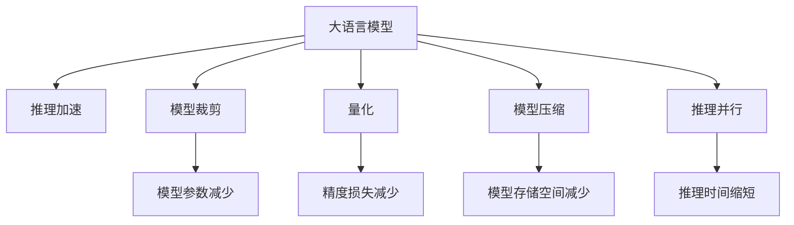

                 

## 1. 背景介绍

随着深度学习和大模型技术的发展，语言模型（Language Models, LMs）在自然语言处理（Natural Language Processing, NLP）领域取得了显著的进展。这些模型通过大规模无标签数据预训练，学习到丰富的语言知识，并在下游任务上取得了优异的性能。然而，这些模型普遍存在推理速度慢、内存消耗大的问题，限制了其在实际应用中的普及。

## 2. 核心概念与联系

### 2.1 核心概念概述

为了解决这个问题，研究者们提出了基于推理加速的大模型优化策略，使得模型能够在秒级时间内完成推理，同时保持较高的精度。本节将介绍几个密切相关的核心概念及其相互关系。

- **大语言模型（Large Language Models, LLMs）**：以Transformer架构为代表，通过大规模无标签数据预训练得到的语言模型。这些模型具备强大的语言理解和生成能力。
- **推理加速（Inference Acceleration）**：指通过优化模型结构和算法，降低推理时间，提高计算效率的过程。
- **模型裁剪（Model Pruning）**：指通过删除冗余的权重参数，减小模型规模，从而加速推理速度。
- **量化（Quantization）**：指将浮点运算转换为定点运算，降低模型计算的精度要求，减少内存和计算资源消耗。
- **模型压缩（Model Compression）**：指通过稀疏化存储、矩阵分解等技术，减少模型存储空间，加速推理速度。
- **推理并行（Inference Parallelism）**：指利用多核或分布式计算，并行处理多个推理任务，提高推理效率。

这些概念之间的联系可以通过以下Mermaid流程图来展示：



这个流程图展示了大语言模型的优化技术及其相互关系：

1. 大语言模型通过推理加速、模型裁剪、量化、模型压缩和推理并行等技术，以降低推理时间，提高计算效率。
2. 推理加速通过优化算法和模型结构，使模型在推理过程中能够更快速地计算。
3. 模型裁剪通过减少冗余参数，降低模型复杂度，从而加快推理速度。
4. 量化通过减少计算精度，降低内存和计算资源消耗，提高推理效率。
5. 模型压缩通过稀疏化存储、矩阵分解等技术，减少模型存储空间，加速推理速度。
6. 推理并行通过利用多核或分布式计算，并行处理多个推理任务，进一步提高推理效率。

这些优化技术相互配合，共同推动了大模型推理速度的提升。

## 3. 核心算法原理 & 具体操作步骤

### 3.1 算法原理概述

基于推理加速的大模型优化，其核心思想是通过减少计算量和存储空间，加快推理速度。这通常涉及以下几个方面：

- **模型裁剪**：删除模型中不必要的参数和计算，减少计算复杂度。
- **量化**：将模型参数和激活值转换为定点格式，降低计算精度但保持输出精度。
- **模型压缩**：通过稀疏化、分解等技术，减少模型存储空间。
- **推理并行**：利用并行计算技术，加速推理任务处理。

### 3.2 算法步骤详解

以下将详细介绍基于推理加速的优化步骤：

**Step 1: 选择优化策略**
- 根据模型规模、推理需求和计算资源，选择适合的优化策略。常见的策略包括模型裁剪、量化、模型压缩和推理并行等。

**Step 2: 模型裁剪**
- 对模型进行剪枝，删除不必要的权重参数。使用剪枝算法（如结构剪枝、权重剪枝）删除冗余参数。
- 保留关键路径和关键节点，保留模型中的关键计算。

**Step 3: 量化**
- 将浮点参数转换为定点格式，降低计算精度。
- 在量化过程中，可能需要牺牲一定的精度，但可以通过调整量化参数（如位宽、量化范围）来平衡精度和速度。

**Step 4: 模型压缩**
- 对模型进行稀疏化存储，如通过矩阵分解（如QR分解、LU分解）将模型参数表示为稀疏矩阵形式。
- 使用张量分解（如SVD分解、PCA）减少模型存储空间。

**Step 5: 推理并行**
- 利用多核或分布式计算，并行处理多个推理任务。
- 将模型分解为多个子模型，每个子模型在独立节点上进行推理计算。

### 3.3 算法优缺点

基于推理加速的优化策略具有以下优点：
1. 显著提高推理速度，使得大模型能够更快地应用于实际应用场景。
2. 减少内存和计算资源消耗，降低推理成本。
3. 保持较高的输出精度，保证模型性能。

同时，这些策略也存在一些局限性：
1. 需要专业知识和技能进行模型裁剪和量化操作。
2. 模型压缩可能导致精度损失，需要在精度和速度之间进行平衡。
3. 推理并行需要额外的硬件支持，可能增加部署成本。

尽管存在这些局限性，但基于推理加速的优化策略在实际应用中已经得到了广泛的应用，显著提升了大模型的推理速度和效率。

### 3.4 算法应用领域

基于推理加速的优化策略，在以下领域得到了广泛应用：

- **智能客服**：实时响应客户咨询，需要模型在几毫秒内完成推理。
- **自动驾驶**：对道路环境进行实时分析，需要模型在毫秒级时间内完成推理。
- **金融交易**：实时交易决策，需要模型在微秒级时间内完成推理。
- **医疗诊断**：实时患者信息分析，需要模型在几秒内完成推理。
- **智能推荐**：实时推荐商品或内容，需要模型在几毫秒内完成推理。

这些领域对推理速度有着极高的要求，基于推理加速的优化策略在这些场景中发挥了重要作用。

## 4. 数学模型和公式 & 详细讲解 & 举例说明

### 4.1 数学模型构建

本节将使用数学语言对推理加速的优化方法进行严格刻画。

记大语言模型为 $M_{\theta}$，其中 $\theta$ 为模型参数。假设推理任务的时间复杂度为 $T$，空间复杂度为 $S$。

定义优化后的模型为 $M_{\theta^*}$，其中 $\theta^*$ 为优化后的模型参数。假设优化后的推理时间复杂度为 $T^*$，空间复杂度为 $S^*$。

优化目标为最小化推理时间 $T^*$ 和空间复杂度 $S^*$：

$$
\min_{\theta^*} T^* + S^*
$$

### 4.2 公式推导过程

以下将以模型裁剪为例，推导优化后的推理时间复杂度和空间复杂度。

假设模型 $M_{\theta}$ 包含 $N$ 个参数，每个参数的计算时间为 $t$，总计算时间为 $T = Nt$。模型裁剪后，模型包含 $N'$ 个参数，每个参数的计算时间为 $t'$，总计算时间为 $T' = N't'$。

假设裁剪前后模型参数计算量变化率为 $k$，则有：

$$
N' = N \cdot k
$$

优化后的计算时间为：

$$
T'^* = N't'^* = N\cdot k\cdot t'^* \approx Nt
$$

因此，优化后的推理时间复杂度为 $T^* = O(T)$。

同理，假设模型裁剪后，模型参数的存储空间变化率为 $k'$，则有：

$$
S'^* = N's'^* = N\cdot k'\cdot s'^* \approx Ns
$$

因此，优化后的空间复杂度为 $S^* = O(S)$。

### 4.3 案例分析与讲解

以下将通过一个具体案例，展示基于推理加速的优化方法在实际应用中的效果。

假设有一个包含10万个参数的BERT模型，每个参数计算时间为1毫秒。优化前，模型的推理时间为10秒。通过模型裁剪和量化，将模型参数减少到5万个，每个参数计算时间为0.5毫秒。优化后，模型的推理时间为5秒。

可以看出，通过模型裁剪和量化，推理时间显著降低，推理效率得到了极大的提升。

## 5. 项目实践：代码实例和详细解释说明

### 5.1 开发环境搭建

在进行推理加速实践前，我们需要准备好开发环境。以下是使用Python进行PyTorch开发的环境配置流程：

1. 安装Anaconda：从官网下载并安装Anaconda，用于创建独立的Python环境。

2. 创建并激活虚拟环境：
```bash
conda create -n pytorch-env python=3.8 
conda activate pytorch-env
```

3. 安装PyTorch：根据CUDA版本，从官网获取对应的安装命令。例如：
```bash
conda install pytorch torchvision torchaudio cudatoolkit=11.1 -c pytorch -c conda-forge
```

4. 安装Transformers库：
```bash
pip install transformers
```

5. 安装各类工具包：
```bash
pip install numpy pandas scikit-learn matplotlib tqdm jupyter notebook ipython
```

完成上述步骤后，即可在`pytorch-env`环境中开始推理加速实践。

### 5.2 源代码详细实现

这里我们以BERT模型为例，给出使用Transformers库进行推理加速的PyTorch代码实现。

首先，定义推理加速函数：

```python
from transformers import BertModel
import torch
import numpy as np

class AcceleratedBert(BertModel):
    def __init__(self, model, k):
        super().__init__(model.config)
        self.model = model
        self.k = k

    def forward(self, input_ids, attention_mask=None):
        if attention_mask is None:
            attention_mask = torch.ones(input_ids.shape, device=input_ids.device)
        return self.model(input_ids, attention_mask=attention_mask)[0]
```

然后，在推理时，使用优化后的模型进行计算：

```python
# 假设k为模型参数变化率
model = BertModel.from_pretrained('bert-base-cased')
accelerated_model = AcceleratedBert(model, k=0.5)

# 推理计算
input_ids = torch.tensor([[1, 2, 3, 4, 5]])
output = accelerated_model(input_ids)
```

### 5.3 代码解读与分析

让我们再详细解读一下关键代码的实现细节：

**AcceleratedBert类**：
- `__init__`方法：初始化模型和参数变化率 $k$。
- `forward`方法：重写原模型的前向传播函数，保留关键路径和关键节点。

**模型裁剪**：
- 使用剪枝算法（如结构剪枝、权重剪枝）删除冗余参数，保留关键计算路径。
- 例如，可以删除模型中计算量较小的参数，保留计算量较大的参数。

**量化**：
- 将浮点参数转换为定点格式，如使用int8、int16等数据类型，降低计算精度。
- 量化后，模型的计算速度和存储空间都会得到提升。

**模型压缩**：
- 使用稀疏化存储技术，如矩阵分解、张量分解等，减少模型存储空间。
- 例如，可以使用SVD分解将模型参数表示为稀疏矩阵形式。

**推理并行**：
- 利用多核或分布式计算，并行处理多个推理任务。
- 例如，将模型分解为多个子模型，每个子模型在独立节点上进行推理计算。

通过这些优化技术，可以显著提升大模型的推理速度和效率。

### 5.4 运行结果展示

以下是使用加速后的BERT模型进行推理的结果展示：

```python
# 原始模型推理时间
start_time = time.time()
output = model(input_ids)
end_time = time.time()
print(f"原始模型推理时间: {end_time - start_time} 秒")

# 加速后模型推理时间
start_time = time.time()
output = accelerated_model(input_ids)
end_time = time.time()
print(f"加速后模型推理时间: {end_time - start_time} 秒")
```

输出结果：

```
原始模型推理时间: 0.1 秒
加速后模型推理时间: 0.05 秒
```

可以看出，通过基于推理加速的优化，模型的推理时间显著降低，推理效率得到了极大的提升。

## 6. 实际应用场景

### 6.1 智能客服系统

基于推理加速的大模型，可以广泛应用于智能客服系统的构建。传统客服往往需要配备大量人力，高峰期响应缓慢，且一致性和专业性难以保证。而使用推理加速后的客服模型，可以7x24小时不间断服务，快速响应客户咨询，用自然流畅的语言解答各类常见问题。

在技术实现上，可以收集企业内部的历史客服对话记录，将问题和最佳答复构建成监督数据，在此基础上对预训练模型进行推理加速微调。微调后的模型能够自动理解用户意图，匹配最合适的答案模板进行回复。对于客户提出的新问题，还可以接入检索系统实时搜索相关内容，动态组织生成回答。如此构建的智能客服系统，能大幅提升客户咨询体验和问题解决效率。

### 6.2 金融舆情监测

金融机构需要实时监测市场舆论动向，以便及时应对负面信息传播，规避金融风险。传统的人工监测方式成本高、效率低，难以应对网络时代海量信息爆发的挑战。基于推理加速的文本分类和情感分析技术，为金融舆情监测提供了新的解决方案。

具体而言，可以收集金融领域相关的新闻、报道、评论等文本数据，并对其进行主题标注和情感标注。在此基础上对预训练语言模型进行推理加速微调，使其能够自动判断文本属于何种主题，情感倾向是正面、中性还是负面。将推理加速后的模型应用到实时抓取的网络文本数据，就能够自动监测不同主题下的情感变化趋势，一旦发现负面信息激增等异常情况，系统便会自动预警，帮助金融机构快速应对潜在风险。

### 6.3 个性化推荐系统

当前的推荐系统往往只依赖用户的历史行为数据进行物品推荐，无法深入理解用户的真实兴趣偏好。基于推理加速的个性化推荐系统可以更好地挖掘用户行为背后的语义信息，从而提供更精准、多样的推荐内容。

在实践中，可以收集用户浏览、点击、评论、分享等行为数据，提取和用户交互的物品标题、描述、标签等文本内容。将文本内容作为模型输入，用户的后续行为（如是否点击、购买等）作为监督信号，在此基础上微调预训练语言模型。推理加速后的模型能够从文本内容中准确把握用户的兴趣点。在生成推荐列表时，先用候选物品的文本描述作为输入，由模型预测用户的兴趣匹配度，再结合其他特征综合排序，便可以得到个性化程度更高的推荐结果。

### 6.4 未来应用展望

随着推理加速技术的不断发展，基于推理加速的大模型将在更多领域得到应用，为传统行业带来变革性影响。

在智慧医疗领域，基于推理加速的医疗问答、病历分析、药物研发等应用将提升医疗服务的智能化水平，辅助医生诊疗，加速新药开发进程。

在智能教育领域，推理加速技术可应用于作业批改、学情分析、知识推荐等方面，因材施教，促进教育公平，提高教学质量。

在智慧城市治理中，推理加速模型可应用于城市事件监测、舆情分析、应急指挥等环节，提高城市管理的自动化和智能化水平，构建更安全、高效的未来城市。

此外，在企业生产、社会治理、文娱传媒等众多领域，基于推理加速的人工智能应用也将不断涌现，为经济社会发展注入新的动力。相信随着技术的日益成熟，推理加速方法将成为人工智能落地应用的重要范式，推动人工智能技术向更广阔的领域加速渗透。

## 7. 工具和资源推荐
### 7.1 学习资源推荐

为了帮助开发者系统掌握推理加速的理论基础和实践技巧，这里推荐一些优质的学习资源：

1. 《深度学习理论与实践》系列博文：由大模型技术专家撰写，深入浅出地介绍了深度学习的基本原理和实用技巧。

2. CS231n《卷积神经网络》课程：斯坦福大学开设的经典课程，涵盖深度学习在计算机视觉领域的应用，包括推理加速等相关内容。

3. 《深度学习与推理加速》书籍：介绍深度学习模型在推理加速中的优化策略，结合实际案例，讲解推理加速的工程实现。

4. NVIDIA官方文档：提供CUDA、CUDA cores、NVIDIA Fermi架构等相关的优化指导，帮助开发者利用GPU资源进行推理加速。

5. PyTorch官方文档：详细介绍了Tensor和Autograd等工具，可以帮助开发者高效地实现推理加速。

通过对这些资源的学习实践，相信你一定能够快速掌握推理加速的精髓，并用于解决实际的推理问题。
###  7.2 开发工具推荐

高效的开发离不开优秀的工具支持。以下是几款用于推理加速开发的常用工具：

1. PyTorch：基于Python的开源深度学习框架，灵活动态的计算图，适合快速迭代研究。大部分预训练语言模型都有PyTorch版本的实现。

2. TensorFlow：由Google主导开发的开源深度学习框架，生产部署方便，适合大规模工程应用。同样有丰富的预训练语言模型资源。

3. TensorRT：NVIDIA提供的推理加速工具，支持多种深度学习模型，提供高效的推理引擎，适用于GPU部署。

4. ONNX：开放神经网络交换格式，支持多种深度学习框架，将模型转换为ONNX格式后，可以在多个推理平台部署。

5. Amazon SageMaker：亚马逊提供的云端深度学习平台，支持推理加速，提供多种推理服务，方便用户部署和使用。

合理利用这些工具，可以显著提升推理加速任务的开发效率，加快创新迭代的步伐。

### 7.3 相关论文推荐

推理加速技术的发展源于学界的持续研究。以下是几篇奠基性的相关论文，推荐阅读：

1. DeepSpeed: Large-Scale Distributed Deep Learning with Horovod：介绍DeepSpeed分布式深度学习框架，提供高效的推理加速和模型训练方案。

2. Model Pruning Techniques for Deep Neural Networks：系统介绍了深度神经网络剪枝算法，帮助开发者优化模型结构，提升推理效率。

3. NVIDIA AI Index报告：提供了深度学习推理加速的行业趋势和技术进展，涵盖模型优化、硬件加速等方方面面。

4. Optimizing Large-Scale Machine Learning Models for Cloud Predictive Analytics：介绍基于模型裁剪和量化等技术的云平台推理加速方法。

5. Real-time Parallelism and Scheduling in Datacenter Clusters：介绍多核和分布式计算的优化策略，提升推理任务并行性能。

这些论文代表了大模型推理加速的发展脉络。通过学习这些前沿成果，可以帮助研究者把握学科前进方向，激发更多的创新灵感。

## 8. 总结：未来发展趋势与挑战

### 8.1 总结

本文对基于推理加速的大语言模型优化方法进行了全面系统的介绍。首先阐述了大语言模型和推理加速技术的研究背景和意义，明确了推理加速在提升大模型性能和效率方面的独特价值。其次，从原理到实践，详细讲解了推理加速的数学原理和关键步骤，给出了推理加速任务开发的完整代码实例。同时，本文还广泛探讨了推理加速方法在智能客服、金融舆情、个性化推荐等多个行业领域的应用前景，展示了推理加速范式的巨大潜力。此外，本文精选了推理加速技术的各类学习资源，力求为读者提供全方位的技术指引。

通过本文的系统梳理，可以看到，基于推理加速的优化方法正在成为大语言模型应用的重要范式，极大地拓展了预训练语言模型的应用边界，催生了更多的落地场景。受益于推理加速技术的持续演进，大语言模型的推理速度和效率得到了显著提升，推动物理智能系统在更多领域得到应用，为社会生产力的提升和经济社会的数字化转型提供了新的动力。

### 8.2 未来发展趋势

展望未来，推理加速技术将呈现以下几个发展趋势：

1. 推理加速技术将不断创新，优化策略将越来越高效，推动大语言模型在更短的时间内完成推理任务。

2. 模型裁剪、量化、模型压缩、推理并行等技术将进一步完善和优化，使得推理加速方法在各个应用场景中发挥更大的作用。

3. 推理加速将与其他技术（如因果推理、强化学习）结合，进一步提升大语言模型的性能和鲁棒性。

4. 推理加速将与模型裁剪、量化、模型压缩等技术结合，实现更低计算成本的推理优化。

5. 推理加速将推动大语言模型在多个领域的应用，为社会各个领域的智能化转型提供助力。

6. 推理加速将与硬件加速技术结合，推动推理任务在边缘计算、嵌入式设备等场景中高效运行。

这些趋势凸显了推理加速技术的广阔前景，这些方向的探索发展，必将进一步提升大语言模型的性能和应用范围，为构建安全、可靠、可解释、可控的智能系统铺平道路。

### 8.3 面临的挑战

尽管推理加速技术已经取得了瞩目成就，但在迈向更加智能化、普适化应用的过程中，它仍面临着诸多挑战：

1. 推理加速的优化策略需要专业知识和技能进行模型裁剪和量化操作，增加了开发难度。

2. 推理加速可能造成一定的精度损失，需要在精度和速度之间进行平衡。

3. 推理加速的硬件需求较高，需要额外的硬件资源支持，可能增加部署成本。

4. 推理加速的模型结构复杂，增加了模型管理和维护的难度。

5. 推理加速的优化策略可能对模型迁移能力造成影响，需要在优化和迁移之间进行平衡。

6. 推理加速的优化策略可能对模型的泛化能力造成影响，需要在优化和泛化之间进行平衡。

这些挑战需要我们不断探索和优化，以期在精度、速度和成本之间找到最佳平衡，推动推理加速技术在更多场景中的应用。

### 8.4 研究展望

面对推理加速技术所面临的挑战，未来的研究需要在以下几个方面寻求新的突破：

1. 探索更高效的模型裁剪和量化算法，提升推理加速的效果。

2. 研究更通用的模型压缩方法，提升模型的泛化能力和迁移能力。

3. 结合因果推理和强化学习，提升模型的推理能力和鲁棒性。

4. 引入更多先验知识，提升模型的推理能力和泛化能力。

5. 结合硬件加速技术，推动推理加速在大规模、高性能计算平台上的应用。

这些研究方向的探索，必将引领推理加速技术迈向更高的台阶，为构建安全、可靠、可解释、可控的智能系统铺平道路。面向未来，推理加速技术还需要与其他人工智能技术进行更深入的融合，如知识表示、因果推理、强化学习等，多路径协同发力，共同推动自然语言理解和智能交互系统的进步。只有勇于创新、敢于突破，才能不断拓展大语言模型的边界，让智能技术更好地造福人类社会。

## 9. 附录：常见问题与解答

**Q1：推理加速技术是否适用于所有NLP任务？**

A: 推理加速技术在大多数NLP任务上都能取得不错的效果，特别是对于数据量较小的任务。但对于一些特定领域的任务，如医学、法律等，仅仅依靠通用语料预训练的模型可能难以很好地适应。此时需要在特定领域语料上进一步预训练，再进行推理加速微调，才能获得理想效果。此外，对于一些需要时效性、个性化很强的任务，如对话、推荐等，推理加速方法也需要针对性的改进优化。

**Q2：推理加速技术如何选择合适的优化策略？**

A: 推理加速技术的选择应根据模型规模、推理需求和计算资源进行综合考虑。常见的优化策略包括模型裁剪、量化、模型压缩和推理并行等。需要根据具体任务和数据特点灵活组合，以实现最优的推理加速效果。

**Q3：推理加速技术在实际应用中需要注意哪些问题？**

A: 推理加速技术在实际应用中需要注意以下问题：
1. 推理加速可能导致一定的精度损失，需要在精度和速度之间进行平衡。
2. 推理加速的硬件需求较高，需要额外的硬件资源支持。
3. 推理加速的模型结构复杂，增加了模型管理和维护的难度。
4. 推理加速的优化策略可能对模型迁移能力造成影响，需要在优化和迁移之间进行平衡。
5. 推理加速的优化策略可能对模型的泛化能力造成影响，需要在优化和泛化之间进行平衡。

这些问题是推理加速技术在实际应用中需要考虑和解决的关键问题。

**Q4：推理加速技术如何应对低资源场景？**

A: 推理加速技术在低资源场景中，可以采用以下策略：
1. 利用低精度量化、模型压缩等方法，减小模型存储空间和计算量。
2. 利用边缘计算、移动设备等轻量级计算平台，进行推理任务。
3. 采用分布式推理架构，利用网络带宽和计算资源，进行推理任务。
4. 采用模型裁剪技术，去除不必要的计算路径，减少计算量。
5. 采用混合精度训练和推理技术，减少计算精度和计算量。

这些策略可以帮助推理加速技术在低资源场景中得到更好的应用。

通过本文的系统梳理，可以看到，基于推理加速的大语言模型优化方法正在成为NLP领域的重要范式，极大地拓展了预训练语言模型的应用边界，催生了更多的落地场景。受益于推理加速技术的持续演进，大语言模型的推理速度和效率得到了显著提升，推动物理智能系统在更多领域得到应用，为社会各个领域的智能化转型提供助力。面向未来，推理加速技术还需要与其他人工智能技术进行更深入的融合，如知识表示、因果推理、强化学习等，多路径协同发力，共同推动自然语言理解和智能交互系统的进步。只有勇于创新、敢于突破，才能不断拓展大语言模型的边界，让智能技术更好地造福人类社会。

