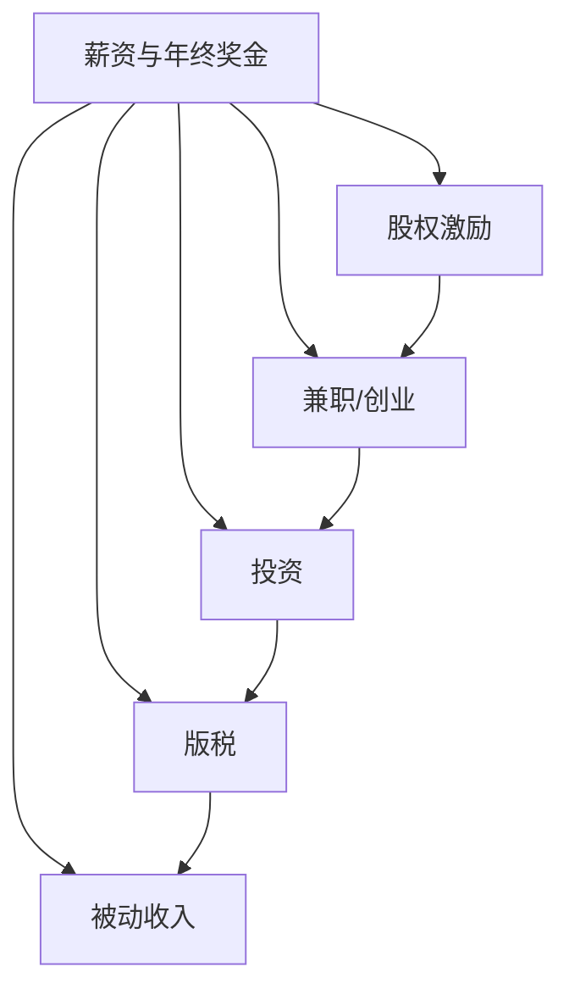

                 

# 程序员如何建立多元化收入结构

## 1. 背景介绍

随着科技行业的快速发展，程序员作为技术创新的主力军，其收入结构也经历了从单一薪资到多元化收入的转变。从传统的“固定工资+年终奖金”到“工资+股权+兼职/创业+投资+版税”等，多元化的收入结构不仅体现了程序员职业价值的提升，也为他们的经济独立和职业发展提供了更多可能性。

### 1.1 问题由来

在过去的十年中，互联网和人工智能的崛起为程序员带来了前所未有的机会。然而，仅仅依靠传统的固定工资收入，已经难以应对快速变化的市场需求和不断上涨的生活成本。特别是高技能、高经验的程序员，更需要通过多元化收入结构来提升自身财务健康和职业竞争力。

### 1.2 问题核心关键点

- **收入来源多样化**：如何利用自身技术优势，拓展收入渠道，包括薪资、股权激励、兼职/创业、投资、版税等。
- **风险管理**：如何在多元化收入结构中平衡风险与收益，确保长期的财务稳定。
- **持续学习**：如何在不断变化的科技行业中，持续提升自身价值，获得新的收入增长点。
- **时间管理**：如何在繁忙的工作中，合理安排时间，既保证全职工作质量，又不错过其他收入机会。

## 2. 核心概念与联系

### 2.1 核心概念概述

为更好地理解如何建立多元化收入结构，本节将介绍几个核心概念：

- **薪资与年终奖金**：基本工资和年度奖金，是程序员最主要的收入来源之一。
- **股权激励**：通过持有公司股份或期权，获取公司成长带来的收益。
- **兼职/创业**：利用业余时间或离职后，创办自己的项目或为其他公司提供技术咨询。
- **投资**：通过股票、债券、基金、房地产等金融工具，实现资产增值。
- **版税**：通过书籍、课程、软件授权等形式，获取知识产权收益。
- **被动收入**：通过构建能够持续产生收入的资产（如网站、应用、广告），实现财务自由。

这些核心概念之间的逻辑关系可以通过以下Mermaid流程图来展示：



这个流程图展示了你能够如何利用核心收入概念构建多元化收入结构。

## 3. 核心算法原理 & 具体操作步骤
### 3.1 算法原理概述

建立多元化收入结构，本质上是一种多元化的财务规划和资产配置策略。其核心思想是通过分散风险、优化资产组合，实现收入来源的丰富化和收入结构的优化。

具体而言，可以从以下几个方面入手：

1. **收入来源的增加**：通过提升现有技能、拓展兼职、创业、投资等方式增加收入渠道。
2. **风险分散**：通过多样化资产配置，分散单一收入渠道的风险。
3. **现金流管理**：通过合理的现金流规划，保证收入与支出的匹配，避免财务困境。
4. **长期规划**：通过合理的财务规划，实现财务目标，包括储蓄、投资、退休等。

### 3.2 算法步骤详解

建立一个多元化的收入结构，通常包括以下几个关键步骤：

**Step 1: 评估当前收入状况**
- 计算月度收入，包括工资、奖金、投资收益等。
- 分析收入来源的稳定性和增长潜力。
- 识别当前收入结构中的薄弱环节。

**Step 2: 确定财务目标**
- 设定短期（1-3年）、中期（3-10年）和长期（10年以上）的财务目标，如购房、购车、子女教育、退休储蓄等。
- 根据目标，确定总资产规模和风险承受能力。

**Step 3: 多元化收入渠道**
- 提升现有技能，争取薪资和股权激励。
- 利用业余时间或离职后，开展兼职或创业项目。
- 根据风险偏好，选择合适的投资工具，包括股票、债券、基金等。
- 通过写作、编程、教育等形式，获取版税和被动收入。

**Step 4: 资产配置与风险管理**
- 根据财务目标和风险承受能力，合理配置资产，实现收益与风险的平衡。
- 采用多元化投资策略，分散单一投资的风险。
- 使用定期投资、再平衡等策略，持续优化资产组合。

**Step 5: 现金流规划**
- 制定详细的现金流预算，确保收入与支出相匹配。
- 设立紧急储备基金，应对突发事件。
- 优化税务规划，减少税务负担。

**Step 6: 持续学习与适应**
- 不断学习新技术、新市场，保持竞争力。
- 根据市场变化，灵活调整收入结构和资产配置。
- 关注政策变化，确保合规性。

### 3.3 算法优缺点

多元化收入结构具有以下优点：
1. **分散风险**：多种收入来源分散了单一收入渠道的风险，降低财务波动性。
2. **提升财务稳定性**：通过多渠道收入，确保在某一收入来源不稳定时，其他渠道可以弥补。
3. **增加收入潜力**：通过兼职、创业、投资等方式，增加收入的增长点。
4. **实现财务目标**：通过合理的财务规划，更容易实现短期和长期的财务目标。

同时，该策略也存在一定的局限性：
1. **时间和精力成本**：维护多种收入渠道需要投入更多的时间和精力。
2. **学习成本**：需要不断学习新技能，保持竞争力。
3. **心理压力**：多渠道的收入可能增加心理压力，担心某一渠道收入不稳定。
4. **机会成本**：同时投入多个项目，可能错过其他更高回报的机会。

尽管存在这些局限性，但多元化的收入结构依然是程序员应对财务不确定性的重要策略。

### 3.4 算法应用领域

多元化收入结构的应用领域广泛，涵盖了金融、科技、教育等多个行业。具体而言，以下领域尤为适合应用该策略：

- **金融行业**：程序员在金融数据分析、算法交易、量化投资等领域，可以利用自身技术优势，获取高收入。
- **科技行业**：互联网、人工智能、大数据等领域，程序员可以通过兼职、创业、技术咨询等方式，增加收入来源。
- **教育行业**：通过在线教育、编程培训等，程序员可以传播知识，获取版税和教学收入。
- **医疗健康**：利用人工智能、大数据等技术，参与医疗健康创业项目，获取高收益。

## 4. 数学模型和公式 & 详细讲解 & 举例说明

### 4.1 数学模型构建

假设某程序员的月度收入由工资、奖金、投资收益、兼职收入、创业收入、版税等构成。设：

- $W$：月度工资
- $B$：月度奖金
- $I$：月度投资收益
- $C$：月度兼职收入
- $E$：月度创业收入
- $R$：月度版税

则其月度总收入 $I_{\text{monthly}}$ 可以表示为：

$$
I_{\text{monthly}} = W + B + I + C + E + R
$$

**Step 1: 评估当前收入状况**

设该程序员的月度总收入为 $I_{\text{monthly}}$，总收入减去总支出（包括生活开销、债务偿还等）得到月度净收入 $N_{\text{monthly}}$：

$$
N_{\text{monthly}} = I_{\text{monthly}} - E_{\text{monthly}}
$$

其中 $E_{\text{monthly}}$ 为月度总支出。

**Step 2: 确定财务目标**

假设该程序员设定了以下财务目标：
- 1年内购房首付 $S_1$，3年内购车 $S_2$，5年内子女教育费用 $S_3$，10年内退休储蓄 $S_4$。

设总资产规模为 $A$，风险承受能力为 $R$，则根据目标，可以计算出总资产规模和风险承受能力的关系：

$$
A = S_1 + S_2 + S_3 + S_4
$$

**Step 3: 多元化收入渠道**

假设该程序员决定通过以下方式增加收入：
- 每月兼职收入 $C = 5000$ 元
- 每月投资收益 $I = 2000$ 元
- 每月创业收入 $E = 3000$ 元
- 每月版税收入 $R = 1000$ 元

则月度总收入为：

$$
I_{\text{monthly}} = W + B + C + E + R
$$

假设工资、奖金、投资收益、创业收入等参数已知，则可以通过调整版税收入 $R$，实现财务目标。

### 4.2 公式推导过程

通过设定财务目标，可以将财务规划转化为数学模型。以购房首付 $S_1$ 为例，假设需要3年时间，每月还款 $M_1$，则每月净收入需满足：

$$
N_{\text{monthly}} \geq M_1
$$

将上述财务目标带入总收入和总支出的表达式，可以计算出每月需支付的净收入 $N_{\text{monthly}}$，并根据 $N_{\text{monthly}}$ 调整版税收入 $R$，确保实现财务目标。

### 4.3 案例分析与讲解

假设某程序员当前的月度收入为 $I_{\text{monthly}} = 20000$ 元，每月支出 $E_{\text{monthly}} = 15000$ 元。其设定的财务目标为：1年内购房首付 $S_1 = 500000$ 元，3年内购车 $S_2 = 200000$ 元，5年内子女教育费用 $S_3 = 100000$ 元，10年内退休储蓄 $S_4 = 2000000$ 元。

设该程序员每月工资 $W = 15000$ 元，奖金 $B = 5000$ 元，投资收益 $I = 2000$ 元，兼职收入 $C = 5000$ 元，创业收入 $E = 3000$ 元，版税收入 $R = 1000$ 元。

则总资产规模和风险承受能力为：

$$
A = S_1 + S_2 + S_3 + S_4 = 500000 + 200000 + 100000 + 2000000 = 2750000
$$

每月净收入为：

$$
N_{\text{monthly}} = I_{\text{monthly}} - E_{\text{monthly}} = 20000 - 15000 = 5000
$$

为了实现购房首付，假设每月需支付 $M_1 = 10000$ 元，则每月版税收入需满足：

$$
R \geq M_1 - (W + B + C + E) = 10000 - (15000 + 5000 + 5000 + 3000) = -11000
$$

这意味着，每月版税收入需至少为 11000 元，即需每月发布一定量的内容，以获取版税收入。

## 5. 项目实践：代码实例和详细解释说明

### 5.1 开发环境搭建

在进行财务规划和收入管理时，我们需要准备好开发环境。以下是使用Python进行财务管理和投资模拟的环境配置流程：

1. 安装Anaconda：从官网下载并安装Anaconda，用于创建独立的Python环境。

2. 创建并激活虚拟环境：
```bash
conda create -n finance-env python=3.8 
conda activate finance-env
```

3. 安装Python库：
```bash
conda install pandas numpy matplotlib
```

4. 安装Risk Management库：
```bash
conda install risklib
```

5. 安装Optimization库：
```bash
conda install scipy
```

完成上述步骤后，即可在`finance-env`环境中开始财务管理和投资模拟的实践。

### 5.2 源代码详细实现

接下来，我们将通过一个简单的Python脚本，实现对多元收入结构的模拟和管理。假设我们的收入来源为工资、投资、兼职和版税，将使用 Pandas 和 Risklib 库来进行财务规划和投资模拟。

首先，定义收入和支出数据：

```python
import pandas as pd

# 定义收入和支出数据
income_data = pd.DataFrame({
    'Month': ['2023-01', '2023-02', '2023-03', '2023-04', '2023-05'],
    'Total_Income': [20000, 21000, 22000, 23000, 24000],
    'Expense': [15000, 15200, 15400, 15600, 15800],
    'Salary': [15000, 15000, 15000, 15000, 15000],
    'Bonus': [5000, 5000, 5000, 5000, 5000],
    'Investment': [2000, 2000, 2000, 2000, 2000],
    'Part-time_Job': [5000, 5000, 5000, 5000, 5000],
    'Entrepreneurship': [3000, 3000, 3000, 3000, 3000],
    'Royalty': [1000, 1000, 1000, 1000, 1000]
})

# 计算净收入
income_data['Net_Income'] = income_data['Total_Income'] - income_data['Expense']
```

然后，进行财务目标的设定和模拟：

```python
from risklib import RiskManagement

# 定义财务目标
targets = {
    'Home_Buying_Deposit': 500000,
    'Car_Purchase': 200000,
    'Child_Education': 100000,
    'Retirement_Savings': 2000000
}

# 创建RiskManagement对象
rm = RiskManagement()

# 添加收入和支出数据
rm.add_income_data(income_data)
rm.add_expense_data(income_data)

# 设定财务目标
rm.set_finance_goals(targets)

# 进行财务规划和投资模拟
rm.calculate_portfolio(0.7, 0.3)  # 70% 用于投资，30% 用于储蓄
```

最后，进行模拟结果的展示：

```python
# 输出模拟结果
print(rm.get_income_data())
print(rm.get_finance_goals())
print(rm.get_portfolio())
```

这就是一个简单的Python代码实例，展示了如何通过Pandas和Risklib库进行财务规划和投资模拟。

### 5.3 代码解读与分析

让我们再详细解读一下关键代码的实现细节：

**Income and Expense Data**：
- 定义了月度收入和支出数据，包括工资、奖金、投资收益、兼职收入、创业收入和版税收入。

**Risk Management**：
- 使用Risklib库，创建RiskManagement对象，用于进行财务规划和投资模拟。
- 添加收入和支出数据，设定财务目标，使用70%的收入进行投资，30%进行储蓄。

**模拟结果**：
- 通过调用Risklib库的方法，输出收入数据、财务目标和投资组合。

可以看到，通过Python和Risklib库，我们可以较为简单地实现对多元收入结构的模拟和管理，帮助程序员更好地进行财务规划和投资决策。

## 6. 实际应用场景

### 6.1 职业规划与转行

多元化收入结构可以帮助程序员更好地进行职业规划和转行。通过兼职、创业和投资等方式，程序员可以获取额外的收入来源，减少对单一工资的依赖。同时，通过学习和掌握新的技能，程序员可以进入更具挑战性和发展潜力的领域。

### 6.2 创业与投资

对于有创业梦想的程序员，多元化收入结构提供了重要的财务支持。通过兼职、版税和投资等方式，程序员可以获取稳定的现金流，用于支持创业项目。同时，通过合理配置资产，程序员可以降低投资风险，实现财务自由。

### 6.3 财务自由与退休规划

多元化的收入结构有助于程序员实现财务自由和退休规划。通过多种收入渠道的组合，程序员可以逐步积累财富，实现购房、购车、子女教育等财务目标，最终实现财务自由。同时，通过合理的资产配置和风险管理，程序员可以确保在退休后仍然拥有稳定的财务支持。

### 6.4 未来应用展望

随着技术的发展和市场的变化，多元化收入结构的应用将更加广泛。未来，以下是一些可能的趋势：

1. **区块链和加密货币**：程序员可以通过参与区块链项目和加密货币投资，获取高收益。
2. **元宇宙和虚拟现实**：随着元宇宙和虚拟现实技术的发展，程序员可以参与相关项目，获取新的收入来源。
3. **数据科学和人工智能**：在大数据和人工智能的推动下，程序员可以通过参与相关项目，获取高额版税和投资收益。
4. **共享经济**：通过参与共享经济项目，程序员可以灵活利用闲置资源，获取额外的收入。

## 7. 工具和资源推荐

### 7.1 学习资源推荐

为了帮助程序员系统掌握多元收入结构，这里推荐一些优质的学习资源：

1. **《财务自由之路》系列书籍**：介绍如何通过兼职、投资、创业等方式实现财务自由，提供了详细的财务规划和投资策略。
2. **《Python数据分析实战》**：使用Python进行数据分析和财务建模，提供了实用的代码示例和案例分析。
3. **Coursera和Udacity的财务规划课程**：提供了系统化的财务规划和投资管理课程，适合初学者和进阶学习者。
4. **《The Intelligent Investor》**：经典投资书籍，介绍了价值投资和长期投资策略，适合程序员进行深入学习。
5. **《区块链技术入门与实战》**：介绍区块链和加密货币的基本知识和实战技巧，适合有志于进入区块链领域的程序员。

### 7.2 开发工具推荐

高效的开发离不开优秀的工具支持。以下是几款用于财务管理和投资模拟开发的常用工具：

1. **Python**：基于Python的财务管理和投资模拟，简单易用，灵活性强。
2. **Risklib**：Python的财务风险管理库，提供了详细的风险评估和管理工具。
3. **QuantConnect**：Python的算法交易平台，支持量化投资策略的开发和测试。
4. **StockData**：Python的数据处理和分析库，支持金融数据的导入和分析。
5. **Alpha Vantage**：提供实时和历史金融数据的API，支持Python等编程语言。

### 7.3 相关论文推荐

多元收入结构的探索源于学界的持续研究。以下是几篇奠基性的相关论文，推荐阅读：

1. **《风险管理理论》**：介绍了风险评估和管理的基本方法和工具，为财务规划提供了理论基础。
2. **《资产配置与组合优化》**：介绍了资产配置和组合优化的基本策略，为投资管理提供了实用工具。
3. **《区块链技术及其应用》**：介绍了区块链技术和加密货币的基本概念和应用，为程序员提供了技术支持。
4. **《大数据和人工智能的应用》**：介绍了大数据和人工智能在金融、医疗、教育等领域的应用，为程序员提供了市场机会。

这些论文代表了大语言模型微调技术的发展脉络。通过学习这些前沿成果，可以帮助程序员把握行业发展方向，激发更多的创新灵感。

## 8. 总结：未来发展趋势与挑战

### 8.1 总结

本文对程序员如何建立多元化收入结构进行了全面系统的介绍。首先阐述了多元化收入结构的重要性和构建方法，明确了如何通过提升现有技能、拓展兼职/创业、投资等方式增加收入渠道，并介绍了风险管理和现金流规划等关键步骤。

通过本文的系统梳理，可以看到，多元化的收入结构不仅提升了程序员的经济独立和职业竞争力，也为他们在不断变化的科技行业中提供了更多的可能性。未来，随着技术的进步和市场的变化，多元化的收入结构将成为程序员应对财务不确定性的重要策略，为他们在职业发展的道路上提供强有力的支持。

### 8.2 未来发展趋势

展望未来，多元收入结构的发展趋势主要体现在以下几个方面：

1. **自动化和智能化**：随着人工智能和自动化技术的发展，财务规划和投资模拟将变得更加智能化和自动化。
2. **个性化和定制化**：根据程序员的个性化需求，提供定制化的财务规划和投资策略，满足不同人群的需求。
3. **跨界融合**：金融、科技、教育等领域的跨界融合，将为程序员提供更多元的收入机会。
4. **全球化**：随着全球化的推进，程序员可以参与国际市场，获取更多的投资和创业机会。

这些趋势将进一步提升多元收入结构的实用性和灵活性，为程序员提供更加多样化的收入渠道和财务保障。

### 8.3 面临的挑战

尽管多元收入结构为程序员带来了许多机会，但在实施过程中，仍然面临一些挑战：

1. **时间管理**：多种收入渠道的维护需要更多的时间和精力，容易影响全职工作质量。
2. **学习成本**：需要不断学习新技能，保持竞争力，增加了学习成本。
3. **市场风险**：多种收入渠道的存在，增加了市场风险，需要灵活应对。
4. **税务问题**：不同收入渠道的税务处理方式不同，需要合理规划，避免税务风险。

尽管存在这些挑战，但通过持续学习和实践，程序员可以逐步克服这些困难，实现财务自由和职业发展。

### 8.4 研究展望

未来，多元收入结构的研究方向将聚焦于以下几个方面：

1. **自动化与智能化的财务规划**：利用人工智能和机器学习技术，提供更加智能化的财务规划和投资模拟。
2. **个性化与定制化的收入管理**：根据程序员的个性化需求，提供定制化的财务规划和投资策略。
3. **跨界融合的收入机会**：探索金融、科技、教育等领域的跨界融合，提供更多元的收入机会。
4. **全球化与市场拓展**：参与国际市场，获取更多的投资和创业机会，提升全球化竞争力。

这些研究方向将为程序员提供更多的财务保障和职业发展机会，助力他们在不断变化的科技行业中实现职业目标和财务自由。

## 9. 附录：常见问题与解答

**Q1：程序员如何平衡全职工作与兼职/创业？**

A: 合理安排时间，优先保证全职工作的质量。可以通过制定详细的日程表，明确全职工作和兼职/创业的时间分配，确保两者不相互干扰。此外，使用时间管理工具如Trello、Notion等，可以更好地跟踪和管理时间。

**Q2：多元化收入结构是否适合所有程序员？**

A: 多元化收入结构适合有一定技术和经验积累的程序员，特别是在技术领域有一定的知名度和影响力。对于初入职场的新手，建议先专注于全职工作的提升和技能积累，再逐步拓展其他收入渠道。

**Q3：如何选择合适的投资工具？**

A: 根据自身的风险承受能力和投资目标，选择合适的投资工具。一般来说，股票和基金风险较大，适合有一定投资经验和技术背景的程序员；债券和货币基金风险较低，适合风险承受能力较低的程序员。同时，利用金融分析工具如Alpha Vantage等，可以更好地了解市场动态，做出更明智的投资决策。

**Q4：如何管理多渠道的现金流？**

A: 使用财务规划工具如Excel、Google Sheets等，制定详细的现金流预算，确保收入与支出相匹配。定期进行现金流分析，调整收入和支出计划，避免财务困境。此外，设立紧急储备基金，可以应对突发事件，保证财务稳定。

**Q5：多元化收入结构是否会影响职业发展？**

A: 多元化收入结构可以提升程序员的经济独立和职业竞争力，但也需要注意平衡全职工作与兼职/创业的时间。合理规划时间，利用技术优势，可以拓展职业发展的空间，但需要避免过度分散注意力，影响全职工作的质量。

通过本文的系统梳理，可以看到，多元化收入结构不仅为程序员提供了更多的财务保障和职业发展机会，也为他们在不断变化的科技行业中实现职业目标和财务自由提供了强有力的支持。未来，随着技术的进步和市场的变化，多元化的收入结构将成为程序员应对财务不确定性的重要策略，为他们在职业发展的道路上提供强有力的支持。

