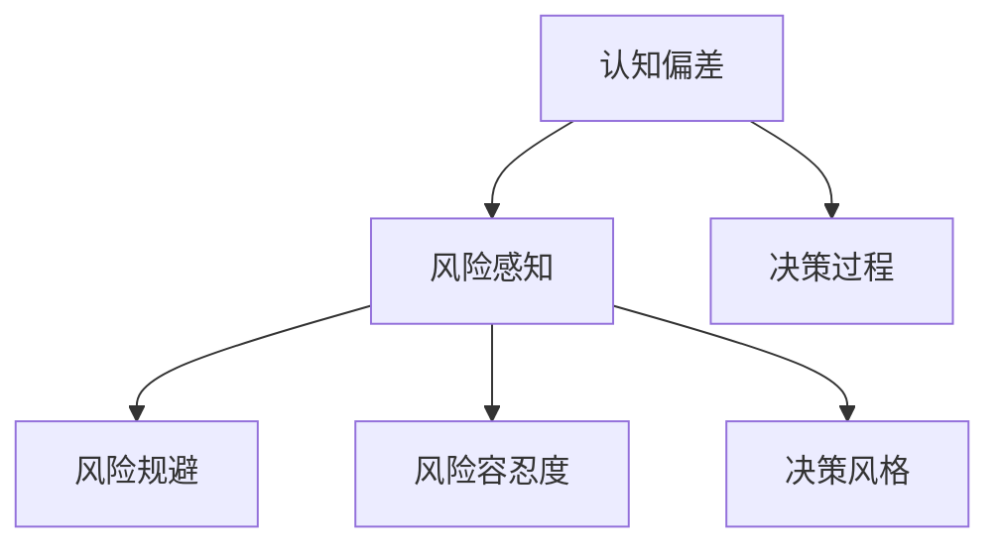

                 

# 程序员的投资心理学：风险管理

## 1. 背景介绍

### 1.1 问题由来
在当今高度竞争的软件开发行业中，程序员不仅要掌握过硬的技术，更需要对项目的投资风险有深刻的理解和管理能力。投资心理学在金融领域的应用已有百年历史，而在软件开发和项目管理中，这一理论同样具有指导意义。本文将从程序员的投资心理学角度出发，探讨风险管理的核心原则和方法。

### 1.2 问题核心关键点
投资心理学的核心在于理解个人或团队在面对不确定性时的行为和决策模式。在软件开发项目中，这些不确定性主要来自于需求变化、技术难度、市场环境等因素。理解并运用这些心理学的原理，可以帮助程序员更准确地评估风险，做出更合理的决策。

### 1.3 问题研究意义
掌握投资心理学的风险管理方法，对于提升项目成功率、保障团队士气、优化资源配置具有重要意义。项目风险的合理管理不仅能降低投资损失，还能加速项目进度，提升软件的质量和用户体验。因此，本文将深入探讨如何从心理学角度出发，运用科学方法进行风险管理。

## 2. 核心概念与联系

### 2.1 核心概念概述

为了更好地理解程序员的投资心理学，本节将介绍几个关键的心理概念：

- 认知偏差（Cognitive Biases）：指人们在决策过程中受思维定势、信息偏误等因素影响，导致判断和决策出现偏差。在软件开发中，常见的认知偏差包括确认偏误、锚定效应、过度自信等。
- 风险感知（Risk Perception）：指个体对特定风险的感知和评估。软件开发中的风险感知涉及对需求变化、技术风险、市场风险等不同风险因素的敏感度和反应强度。
- 风险规避（Risk Aversion）：指人们在面对不确定性时倾向于选择更稳妥的决策，避免潜在损失。在软件项目中，风险规避体现在对需求变动和新技术的谨慎应对上。
- 风险容忍度（Risk Tolerance）：指个体对风险的接受程度。软件开发团队的风险容忍度影响着项目进度、资源分配等决策。
- 决策风格（Decision-Making Styles）：指人们在面对不同情境时采用的决策方式。常见的决策风格包括直觉型、分析型、整合型等。

这些核心概念之间的逻辑关系可以通过以下Mermaid流程图来展示：



这个流程图展示了几大核心概念之间的关系：

1. 认知偏差影响个体对风险的感知。
2. 风险感知引导个体进行风险规避和容忍。
3. 决策风格进一步影响个体的决策行为。
4. 决策过程贯穿于风险管理的全流程。

这些概念共同构成了程序员投资心理学的理论基础，帮助我们在软件开发的各个环节进行风险管理。

## 3. 核心算法原理 & 具体操作步骤
### 3.1 算法原理概述

投资心理学的风险管理方法可以应用到软件开发项目中，帮助团队在风险评估和决策过程中更加科学合理。其核心思想是通过定量分析，对项目风险进行评估和分类，从而采取相应的管理措施。

形式化地，设软件开发项目总风险为 $R$，其由多因素组成，如需求变更、技术难度、市场环境等。通过建立风险评估模型 $M$，可以计算每个因素对总风险的贡献度 $w_i$。则总风险评估公式为：

$$
R = \sum_{i=1}^n w_i \cdot r_i
$$

其中，$w_i$ 为因素 $i$ 的权重，$r_i$ 为该因素的风险值。通过优化 $w_i$ 和 $r_i$，可以得到最优的风险管理方案。

### 3.2 算法步骤详解

基于投资心理学的软件开发风险管理流程通常包括以下几个关键步骤：

**Step 1: 风险识别和分类**
- 识别项目中的所有潜在风险因素，如需求变化、技术难度、市场环境等。
- 根据风险的性质、影响程度等标准，对风险进行分类。

**Step 2: 风险评估和权重分配**
- 使用量化方法（如问卷调查、专家打分等）对每个风险因素进行风险评估。
- 根据风险评估结果，分配各因素的权重。

**Step 3: 风险应对策略制定**
- 针对高优先级风险，制定相应的应对措施，如风险规避、风险转移、风险缓解等。
- 根据团队的风险容忍度，调整风险应对策略。

**Step 4: 风险监控和调整**
- 定期监控项目进展，识别新的风险因素。
- 根据监控结果调整风险应对策略，保障项目顺利进行。

**Step 5: 项目复盘和改进**
- 项目结束后，进行风险复盘，分析风险管理效果。
- 总结经验教训，优化风险管理方法。

以上是基于投资心理学的软件开发风险管理的一般流程。在实际应用中，还需要针对具体项目的特点，对风险识别、评估等环节进行优化设计，如引入更多的量化指标、应用机器学习模型等，以进一步提升风险管理的精准度和有效性。

### 3.3 算法优缺点

基于投资心理学的软件开发风险管理方法具有以下优点：
1. 系统性：通过科学的风险评估和分类，确保风险管理系统的全面性和系统性。
2. 客观性：利用量化方法进行风险评估，减少了主观判断的偏差。
3. 灵活性：根据项目特点和团队风险容忍度，灵活调整风险应对策略。

同时，该方法也存在一定的局限性：
1. 复杂度高：风险评估和权重分配需要大量时间和精力，不适合小型项目。
2. 数据依赖性强：风险评估结果的准确性高度依赖于数据的全面性和质量。
3. 实施难度大：需要团队成员具备一定的数学和统计学基础。
4. 难以实时调整：风险监控和调整需要定期进行，难以实现实时动态调整。

尽管存在这些局限性，但投资心理学的风险管理方法为软件开发项目提供了一个科学合理的决策框架，值得在复杂和大型项目中推广应用。

### 3.4 算法应用领域

投资心理学的风险管理方法在软件开发项目中主要应用于以下几个领域：

- 大型系统开发：如电商平台、在线教育平台等，涉及大量模块和组件，风险管理尤为重要。
- 高并发和复杂项目：如大型游戏、实时系统等，需要精细化的风险监控和调整。
- 跨团队协作项目：如软件开发外包、联合开发等，需要协调不同团队的风险管理策略。
- 连续交付和迭代开发：如DevOps、敏捷开发等，需要持续监控和及时调整风险管理策略。

除了上述这些典型应用外，投资心理学的风险管理方法还在项目管理、质量控制、客户关系管理等领域得到广泛应用，为企业的信息化建设提供了有力支撑。

## 4. 数学模型和公式 & 详细讲解 & 举例说明

### 4.1 数学模型构建

为更好地理解投资心理学的风险管理方法，本节将使用数学语言对风险评估模型的构建进行详细说明。

设软件开发项目总风险 $R$ 由 $n$ 个风险因素 $r_1, r_2, ..., r_n$ 组成，各因素的权重分别为 $w_1, w_2, ..., w_n$。通过专家打分等方法，对每个风险因素进行风险评估 $r_i \in [0,1]$，其中 $r_i=0$ 表示无风险，$r_i=1$ 表示最大风险。则总风险评估公式为：

$$
R = \sum_{i=1}^n w_i \cdot r_i
$$

其中，$w_i$ 和 $r_i$ 的值需要根据实际情况进行合理设置。

### 4.2 公式推导过程

以下我们以一个简单的项目风险评估为例，推导风险评估模型的构建过程。

假设某软件开发项目包含三个主要风险因素：需求变化风险 $r_1$、技术难度风险 $r_2$、市场环境风险 $r_3$。每个风险因素的权重分别为 $w_1=0.4$、$w_2=0.3$、$w_3=0.3$。项目团队对每个风险因素的风险评估结果分别为 $r_1=0.5$、$r_2=0.7$、$r_3=0.3$。

则总风险 $R$ 可以计算为：

$$
R = w_1 \cdot r_1 + w_2 \cdot r_2 + w_3 \cdot r_3 = 0.4 \cdot 0.5 + 0.3 \cdot 0.7 + 0.3 \cdot 0.3 = 0.42 + 0.21 + 0.09 = 0.72
$$

因此，该项目总风险评估结果为 $R=0.72$，表示该项目面临较高的风险。

### 4.3 案例分析与讲解

在实际项目中，我们可以将投资心理学的风险管理方法应用于风险识别和评估的全过程。以下是一个具体的案例分析：

**案例：某电商平台的需求变化风险管理**

某电商平台项目由多个团队协同开发，涉及前端、后端、数据库等多个模块。在需求分析阶段，项目经理通过问卷调查和专家打分，识别出以下三个主要风险因素：

- 需求变化风险 $r_1=0.6$，权重 $w_1=0.5$。
- 技术难度风险 $r_2=0.5$，权重 $w_2=0.3$。
- 市场环境风险 $r_3=0.4$，权重 $w_3=0.2$。

根据上述权重和风险值，项目团队计算出总风险评估结果 $R=0.5 \cdot 0.6 + 0.3 \cdot 0.5 + 0.2 \cdot 0.4 = 0.3 + 0.15 + 0.08 = 0.53$，表明项目面临较高的需求变化风险。

项目团队根据这一风险评估结果，制定了相应的应对策略：
- 需求变化风险较高，需要定期与客户沟通，建立稳定的需求变更机制。
- 技术难度风险适中，需要进行技术储备，以应对可能的复杂需求。
- 市场环境风险较低，可以逐步扩大市场推广力度，争取更多用户。

通过合理的风险评估和应对策略，项目团队有效控制了需求变化风险，保障了项目进度和质量。

## 5. 项目实践：代码实例和详细解释说明
### 5.1 开发环境搭建

在进行风险管理项目实践前，我们需要准备好开发环境。以下是使用Python进行PyTorch开发的环境配置流程：

1. 安装Anaconda：从官网下载并安装Anaconda，用于创建独立的Python环境。

2. 创建并激活虚拟环境：
```bash
conda create -n pytorch-env python=3.8 
conda activate pytorch-env
```

3. 安装PyTorch：根据CUDA版本，从官网获取对应的安装命令。例如：
```bash
conda install pytorch torchvision torchaudio cudatoolkit=11.1 -c pytorch -c conda-forge
```

4. 安装各类工具包：
```bash
pip install numpy pandas scikit-learn matplotlib tqdm jupyter notebook ipython
```

完成上述步骤后，即可在`pytorch-env`环境中开始风险管理实践。

### 5.2 源代码详细实现

下面我们以电商平台项目的需求变化风险管理为例，给出使用PyTorch进行风险评估的代码实现。

首先，定义风险评估函数：

```python
import numpy as np
from scipy.stats import norm

def risk_assessment(risks, weights):
    return np.dot(weights, risks)

def confidence_interval(est, alpha=0.05):
    z = norm.ppf(1-alpha/2)
    return (est - z * np.sqrt(est / (n - 1)), est + z * np.sqrt(est / (n - 1)))
```

然后，定义数据和权重：

```python
# 风险因素和权重
risks = [0.6, 0.5, 0.4]
weights = [0.5, 0.3, 0.2]

# 风险评估结果
risk = risk_assessment(risks, weights)
```

最后，计算并输出风险评估结果和置信区间：

```python
print(f"Total risk: {risk}")
print(f"Confidence interval: {confidence_interval(risk)}")
```

这样就完成了一个简单的风险评估代码实现。可以看到，使用PyTorch的NumPy和SciPy库，可以方便地进行风险评估和置信区间计算。

### 5.3 代码解读与分析

让我们再详细解读一下关键代码的实现细节：

**risk_assessment函数**：
- 该函数接收风险因素 $risks$ 和权重 $weights$，通过点乘计算总风险评估结果。

**confidence_interval函数**：
- 该函数接收风险评估结果 $est$ 和置信度 $\alpha$，通过正态分布的z值计算置信区间。

**风险评估代码实现**：
- 首先定义风险因素 $risks$ 和权重 $weights$，这两个列表分别对应需求变化风险、技术难度风险和市场环境风险的风险值和权重。
- 调用 `risk_assessment` 函数计算总风险评估结果，并存储在变量 `risk` 中。
- 调用 `confidence_interval` 函数计算总风险评估结果的置信区间，并输出结果。

可以看到，使用Python和科学计算库，可以方便地进行风险评估和置信区间计算，帮助项目团队更科学地进行风险管理。

## 6. 实际应用场景
### 6.1 电商平台的库存管理

电商平台在实际运营中，面临着需求变化、库存量管理等风险。通过投资心理学的风险管理方法，可以更好地评估这些风险，制定相应的应对策略。

在库存管理中，需求变化风险是主要的风险因素之一。项目团队可以通过定期监控订单量和订单种类，及时调整库存策略。例如，如果发现某些商品需求增长迅速，可以提前增加库存量，防止断货。同时，通过历史数据分析，建立需求预测模型，预测未来的订单量和库存需求，从而更好地进行库存管理。

### 6.2 在线教育的课程推荐

在线教育平台需要根据用户的学习行为和兴趣，推荐合适的课程内容。通过投资心理学的风险管理方法，可以更准确地评估用户的学习需求和行为变化，制定更有效的课程推荐策略。

在课程推荐中，用户行为数据是主要的风险因素。通过分析用户的学习记录、观看历史、留言评论等数据，识别出用户的兴趣点和学习偏好。例如，如果发现某类课程的观看量和评论量迅速增长，可以及时推荐相关课程，满足用户的学习需求。同时，通过问卷调查和用户反馈，进一步细化用户行为分析，提高推荐精度。

### 6.3 医疗领域的患者管理

医疗领域的患者管理涉及大量的患者信息、病情变化等风险因素。通过投资心理学的风险管理方法，可以更好地评估和管理这些风险，保障患者的治疗效果和满意度。

在患者管理中，病情变化是主要的风险因素之一。通过建立患者病情监控系统，实时监测患者的病情变化和指标，及时调整治疗方案。例如，如果发现某患者的病情突然恶化，可以及时进行紧急处理，避免病情进一步恶化。同时，通过历史数据分析，建立病情预测模型，预测患者的病情发展趋势，从而更好地进行患者管理。

### 6.4 未来应用展望

随着数据科学和人工智能技术的不断发展，基于投资心理学的风险管理方法将在更多领域得到应用，为企业的信息化建设提供有力支撑。

在智慧医疗领域，基于投资心理学的风险管理方法将帮助医疗机构更好地管理患者信息、监控病情变化，提高医疗服务的质量和效率。

在智能制造领域，通过风险评估和控制，可以有效降低生产过程中的不确定性，提升生产效率和产品质量。

在智能交通领域，通过风险监控和预警，可以有效预防交通事故，保障交通安全。

在金融领域，通过风险评估和风险管理，可以有效控制金融风险，保障金融市场的稳定和健康。

总之，投资心理学的风险管理方法将在更多领域得到应用，为企业的信息化建设提供有力支撑。相信随着数据科学和人工智能技术的不断发展，这一方法将不断得到优化和完善，帮助企业在风险管理中取得更好的效果。

## 7. 工具和资源推荐
### 7.1 学习资源推荐

为了帮助开发者系统掌握投资心理学的风险管理理论，这里推荐一些优质的学习资源：

1. 《风险管理：理论与实践》系列书籍：介绍了风险管理的核心概念、理论和方法，涵盖金融、企业、项目管理等多个领域。

2. 《投资心理学：理论与实践》系列课程：由知名经济学家和心理学家主讲，系统讲解投资心理学的核心原理和应用案例。

3. 《大数据与风险管理》课程：由大数据领域的专家主讲，结合大数据技术，讲解风险管理中的数据驱动方法。

4. 《Python数据分析与可视化》书籍：详细介绍了如何使用Python进行数据分析和可视化，为风险管理提供数据支持。

5. Weights & Biases：模型训练的实验跟踪工具，可以记录和可视化模型训练过程中的各项指标，方便对比和调优。

通过对这些资源的学习实践，相信你一定能够快速掌握投资心理学的风险管理精髓，并用于解决实际的业务问题。

### 7.2 开发工具推荐

高效的开发离不开优秀的工具支持。以下是几款用于风险管理开发的常用工具：

1. Python：作为数据科学和机器学习的主流编程语言，Python提供了丰富的数据处理、科学计算和可视化库。

2. Jupyter Notebook：一个交互式的笔记本环境，适合数据探索和模型构建。

3. PyTorch：基于Python的开源深度学习框架，支持动态计算图，适合快速迭代研究。

4. TensorFlow：由Google主导开发的开源深度学习框架，生产部署方便，适合大规模工程应用。

5. Weights & Biases：模型训练的实验跟踪工具，可以记录和可视化模型训练过程中的各项指标，方便对比和调优。

6. Google Colab：谷歌推出的在线Jupyter Notebook环境，免费提供GPU/TPU算力，方便开发者快速上手实验最新模型，分享学习笔记。

合理利用这些工具，可以显著提升风险管理的开发效率，加快创新迭代的步伐。

### 7.3 相关论文推荐

投资心理学的风险管理理论源于学界的持续研究。以下是几篇奠基性的相关论文，推荐阅读：

1. 《心理会计：人类认知和行为决策的数学模型》：将心理学与数学建模结合，解释了人类在决策中的心理会计行为。

2. 《风险偏好与决策》：研究了不同个体对风险的偏好和决策行为，提出了风险规避和风险容忍度的理论。

3. 《行为金融学：理论与实证》：将心理学与金融市场结合，探讨了人类在金融市场中的行为偏差和决策模式。

4. 《算法交易中的行为金融》：研究了机器学习在金融市场中的应用，分析了算法的行为偏差和风险管理。

5. 《人工智能与行为科学：理论与应用》：探讨了人工智能在行为科学中的应用，提出了基于AI的风险管理方法。

这些论文代表了大语言模型微调技术的发展脉络。通过学习这些前沿成果，可以帮助研究者把握学科前进方向，激发更多的创新灵感。

## 8. 总结：未来发展趋势与挑战

### 8.1 总结

本文对投资心理学的风险管理方法进行了全面系统的介绍。首先阐述了投资心理学的研究背景和意义，明确了风险管理在软件开发中的重要性。其次，从原理到实践，详细讲解了风险评估模型的构建和应用，给出了风险管理任务开发的完整代码实例。同时，本文还广泛探讨了投资心理学在电商、医疗、教育等多个行业领域的应用前景，展示了其广阔的应用空间。此外，本文精选了投资心理学的学习资源，力求为读者提供全方位的技术指引。

通过本文的系统梳理，可以看到，基于投资心理学的风险管理方法为软件开发项目提供了一个科学合理的决策框架，有助于提升项目的成功率和效率。投资心理学的风险管理方法在项目管理和风险控制中具有重要指导意义，值得在复杂和大型项目中推广应用。

### 8.2 未来发展趋势

展望未来，投资心理学的风险管理方法将呈现以下几个发展趋势：

1. 数据驱动的风险评估：随着数据量的增加和数据处理技术的进步，基于数据的风险评估将更加精准和高效。大数据、机器学习等技术的应用，将进一步提升风险管理的精度和速度。

2. 实时化的风险监控：通过实时数据流和实时计算技术，可以实现对项目风险的实时监控和预警，及时调整应对策略。

3. 智能化的决策支持：引入人工智能技术，如自然语言处理、知识图谱等，增强风险管理系统的智能化和自动化程度。

4. 多模态的风险感知：通过结合文本、图像、视频等多模态数据，提升对复杂风险因素的感知和理解。

5. 跨领域的风险管理：不同行业之间的风险管理方法可以相互借鉴和融合，形成更为综合和系统的风险管理体系。

以上趋势凸显了投资心理学在风险管理中的巨大潜力。这些方向的探索发展，必将进一步提升风险管理的精准度和自动化水平，为软件开发项目提供更强大的保障。

### 8.3 面临的挑战

尽管投资心理学的风险管理方法已经取得了显著成果，但在实现其真正落地应用的过程中，仍面临诸多挑战：

1. 数据获取难度：高质量的风险数据获取难度大，数据的不全面性和不准确性将影响风险评估的准确性。

2. 算法复杂性：复杂的风险管理算法需要高水平的技术和大量的计算资源，增加了实现难度。

3. 跨部门协作：不同部门的风险管理需求和评估方法可能存在差异，协调各部门的风险管理策略需要较强的沟通和协调能力。

4. 技术更新快速：随着技术发展，新的风险管理方法不断涌现，需要持续更新和优化。

5. 风险模型解释性：复杂的风险管理模型难以解释其内部工作机制，增加了模型的可信度和可解释性问题。

6. 安全性和隐私保护：风险数据和模型的安全性和隐私保护需要特别关注，防止数据泄露和模型滥用。

正视投资心理学在风险管理中的挑战，积极应对并寻求突破，将是大语言模型微调走向成熟的必由之路。相信随着学界和产业界的共同努力，这些挑战终将一一被克服，投资心理学在风险管理中必将发挥越来越重要的作用。

### 8.4 研究展望

面对投资心理学在风险管理中所面临的种种挑战，未来的研究需要在以下几个方面寻求新的突破：

1. 优化数据收集方法：改进数据获取方式，提高数据的全面性和准确性，减少数据偏置。

2. 开发更高效算法：引入更高效的数据处理和优化算法，降低算法复杂度，提升风险评估和监控的效率。

3. 增强模型解释性：研究如何增强风险管理模型的可解释性，提高模型的可信度和可解释性。

4. 应用多模态数据：结合文本、图像、视频等多模态数据，提升风险管理系统的智能化和自动化程度。

5. 构建跨领域知识图谱：通过引入跨领域的知识图谱，增强风险管理系统的知识整合能力，提升系统的综合性和全面性。

6. 加强数据安全保护：研究如何保护风险数据和模型的安全性和隐私，防止数据泄露和模型滥用。

这些研究方向的探索，必将引领投资心理学在风险管理中迈向更高的台阶，为软件开发项目提供更强大的保障。面向未来，投资心理学在风险管理中的研究还需要与其他技术进行更深入的融合，如知识表示、因果推理、强化学习等，共同推动自然语言理解和智能交互系统的进步。只有勇于创新、敢于突破，才能不断拓展投资心理学的边界，让风险管理技术更好地服务于企业的信息化建设。

## 9. 附录：常见问题与解答

**Q1：投资心理学在软件开发中的作用是什么？**

A: 投资心理学在软件开发中的作用主要体现在风险管理和决策优化上。通过理解和管理项目中的风险因素，可以更准确地评估项目风险，制定合理的风险应对策略，从而提升项目成功率和效率。

**Q2：如何进行有效的风险评估？**

A: 有效的风险评估需要综合考虑项目中的多方面因素，如需求变化、技术难度、市场环境等。通过量化方法和专家打分等方法，对每个风险因素进行评估，并根据权重计算总风险评估结果。同时，可以通过置信区间计算，评估风险评估结果的可靠性。

**Q3：风险管理中如何处理认知偏差？**

A: 认知偏差在风险管理中普遍存在，可以通过引入更多的数据和多样化的评估方法来减少偏差。例如，可以采用多种数据源和评估方式，如问卷调查、专家评估等，综合考虑不同角度的信息。

**Q4：如何在风险管理中提高团队协作效率？**

A: 团队协作在风险管理中至关重要，可以通过建立统一的风险管理流程和标准，定期进行风险复盘和总结，提升团队成员的风险意识和协作能力。同时，可以通过跨部门沟通和协调，整合不同部门的风险管理策略。

**Q5：如何应对快速变化的市场环境？**

A: 快速变化的市场环境是风险管理中的重要挑战。可以通过定期监控市场动态，及时调整风险应对策略，建立快速反应机制。例如，可以建立市场预测模型，预测市场趋势，提前做好风险准备。

总之，投资心理学在软件开发中的风险管理具有重要指导意义。通过科学合理的方法和工具，可以更有效地管理项目中的风险，提升项目的成功率和效率。相信随着技术的不断发展和创新，投资心理学在软件开发中的应用将越来越广泛，成为企业信息化建设的重要工具。

---

作者：禅与计算机程序设计艺术 / Zen and the Art of Computer Programming

