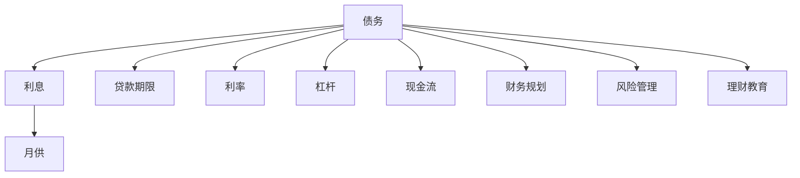

                 

# 程序员的财务杠杆：如何明智地使用债务

## 1. 背景介绍

### 1.1 问题由来
在当今快速发展的科技行业，程序员往往面临巨大的职业压力和财务负担。面对不断上涨的房价、生活成本和子女教育费用，许多程序员通过贷款购买房产，以满足生活的基本需求。然而，贷款不仅带来了短期的财务压力，还对长期财务健康产生了深远影响。如何在程序员的职业生涯中，合理利用债务作为财务杠杆，提升生活质量，同时避免财务危机，成为了每个程序员都需要深入思考的问题。

### 1.2 问题核心关键点
如何明智地使用债务，取决于对以下关键点的理解和实践：
- 理解个人财务状况：清楚了解个人收入、支出、资产和负债情况。
- 制定合理债务规划：确定合适的贷款额度和还款计划，避免过度借贷。
- 选择最优贷款产品：比较不同贷款利率、期限和还款方式，选择最适合自己的贷款产品。
- 优化资产配置：利用债务提升资产配置效率，实现财富增值。
- 管理风险和流动性：通过分散投资和应急基金，降低财务风险和保持流动性。
- 财务教育和自我提升：持续学习和提升财务管理能力，长期规划财务目标。

### 1.3 问题研究意义
理解并合理利用债务作为财务杠杆，对于程序员的职业生涯和家庭生活具有重要意义：
1. 提升生活质量：合理使用贷款，能够提前满足住房、教育等生活需求，提高生活品质。
2. 实现职业目标：通过贷款支持创业、进修等，促进职业发展，提升个人价值。
3. 积累财富：利用债务的杠杆效应，优化资产配置，实现财富的稳健增值。
4. 降低风险：通过财务规划和风险管理，避免过度借贷和财务危机，保持财务安全。
5. 促进教育：持续学习和提升财务管理能力，实现个人和家庭的财务健康。

## 2. 核心概念与联系

### 2.1 核心概念概述

为更好地理解如何明智地使用债务，本节将介绍几个密切相关的核心概念：

- **债务（Debt）**：指个人或企业所欠的款项，通常需要支付利息。
- **利息（Interest）**：使用债务需要支付的额外费用，一般为贷款金额的固定比例。
- **月供（Monthly Payment）**：每月需要支付的债务本金和利息总额。
- **贷款期限（Loan Term）**：贷款从发放至还清的总时间长度。
- **利率（Interest Rate）**：贷款或投资的成本，即单位时间内支付的利息与贷款金额的比率。
- **杠杆（Leverage）**：利用债务作为财务工具，提升资产配置效率，增加财富增值潜力。
- **现金流（Cash Flow）**：个人或企业的收入和支出，反映财务状况的健康程度。
- **财务规划（Financial Planning）**：制定长期财务目标，通过科学管理和合理投资，实现财务自由。
- **风险管理（Risk Management）**：识别和管理财务风险，保持财务稳定和健康。
- **理财教育（Financial Education）**：提升个人财务管理能力，实现财务知识普及。

这些核心概念之间的逻辑关系可以通过以下Mermaid流程图来展示：



这个流程图展示了大语言模型的核心概念及其之间的关系：

1. 债务是基础，利息、月供、期限、利率是其衍生概念。
2. 杠杆通过债务提升资产配置效率。
3. 现金流、财务规划、风险管理和理财教育是债务管理和利用的关键支撑。

这些概念共同构成了债务管理和利用的基本框架，帮助程序员在职业生涯中实现财务健康。

## 3. 核心算法原理 & 具体操作步骤
### 3.1 算法原理概述

程序员利用债务作为财务杠杆，本质上是一个财务优化问题。其核心思想是：通过合理规划贷款额度、期限、利率等参数，最大化债务带来的收益，同时最小化财务风险。

形式化地，假设程序员的初始收入为 $I$，每月支出为 $C$，每年需要支付的债务月供为 $M$，债务利率为 $r$，贷款期限为 $t$。则债务带来的收益 $R$ 可以表示为：

$$
R = I \times (1+r)^{t} - \sum_{k=1}^{t} M \times (1+r)^{k-1}
$$

其中，$M$ 为每月还款金额，$(1+r)^{k-1}$ 表示利息的复利计算。

目标是在满足每月还款的情况下，最大化债务带来的收益 $R$。

### 3.2 算法步骤详解

程序员利用债务作为财务杠杆，可以遵循以下步骤：

**Step 1: 评估个人财务状况**
- 计算个人收入 $I$、支出 $C$、净收入 $N$ 和负债总额 $D$。
- 确定每月还款能力 $M_{\text{cap}}$，即每月可用于还款的最大金额。

**Step 2: 制定贷款计划**
- 选择合适的贷款类型和利率 $r$。
- 确定贷款期限 $t$，一般选择与个人职业生涯规划相匹配的期限。
- 计算每月还款金额 $M$，并验证 $M \leq M_{\text{cap}}$。

**Step 3: 优化债务使用**
- 根据职业规划和家庭需求，合理分配贷款资金到不同资产上。
- 通过负债投资，如购买房产、创业投资等，提升资产增值潜力。
- 分散投资风险，避免过度集中于单一资产。

**Step 4: 管理财务风险**
- 建立应急基金，覆盖3-6个月的家庭支出。
- 定期评估财务状况，调整贷款和投资策略。
- 通过财务规划，设定短期和长期财务目标，实现财务自由。

**Step 5: 持续学习和提升**
- 持续关注财务市场动态，学习财务管理知识。
- 参加财务规划和投资管理课程，提升专业能力。
- 关注个人财务健康，定期进行财务自查和评估。

### 3.3 算法优缺点

利用债务作为财务杠杆的优点：
1. 提前满足需求：通过贷款购买房产、教育等，提前满足生活需求，提升生活质量。
2. 提升资产增值：利用杠杆效应，优化资产配置，实现财富增值。
3. 分散风险：通过多样化投资，降低单项资产的风险。
4. 长期规划：通过科学财务管理，实现长期财务目标。

缺点：
1. 短期财务压力：贷款初期需支付较高利息，短期内增加财务负担。
2. 债务累积：高利率贷款会增加财务负担，需谨慎选择。
3. 流动性风险：过度贷款可能影响应急资金，增加财务风险。
4. 决策风险：需要科学管理和规划，避免过度借贷和财务危机。

### 3.4 算法应用领域

利用债务作为财务杠杆的方法，在职业发展、家庭规划、资产配置等多个领域有广泛应用：

- **职业发展**：通过贷款支持创业、进修等，提升职业能力和市场竞争力。
- **家庭规划**：利用贷款购买房产、教育等，满足生活需求，提升家庭幸福感。
- **资产增值**：通过负债投资，提升资产配置效率，实现财富增值。
- **风险管理**：通过分散投资和应急基金，降低财务风险，保持财务健康。
- **财务管理教育**：通过持续学习和提升，提升财务管理能力，实现财务自由。

## 4. 数学模型和公式 & 详细讲解  
### 4.1 数学模型构建

本节将使用数学语言对利用债务作为财务杠杆的过程进行更加严格的刻画。

设程序员的初始净收入为 $N$，每月支出为 $C$，贷款期限为 $t$，每月还款金额为 $M$，贷款利率为 $r$。假设每月还款周期为 $n$。则债务带来的收益 $R$ 可以表示为：

$$
R = N \times (1+r)^{n \times t} - \sum_{k=1}^{n \times t} M \times (1+r)^{k-1}
$$

其中，$M = \frac{P}{n \times t}$，$P$ 为贷款本金，$n$ 为每年还款次数。

每月还款金额 $M$ 的计算公式为：

$$
M = \frac{P \times (1+r)^{n \times (k-1)}}{(1+r)^{n \times t} - 1}
$$

### 4.2 公式推导过程

以下是利用债务作为财务杠杆的数学推导过程。

假设贷款本金为 $P$，贷款期限为 $t$，每月还款金额为 $M$，年利率为 $r$。则债务总金额 $D$ 可以表示为：

$$
D = P
$$

每月还款金额 $M$ 可以表示为：

$$
M = \frac{P \times (1+r)^{n \times (k-1)}}{(1+r)^{n \times t} - 1}
$$

其中，$n$ 为每年还款次数，$k$ 为还款周期。

假设每年还款次数为 $n=12$，贷款期限为 $t=30$ 年。则每月还款金额 $M$ 可以表示为：

$$
M = \frac{P \times (1+r)^{12 \times (k-1)}}{(1+r)^{12 \times 30} - 1}
$$

### 4.3 案例分析与讲解

假设程序员 $A$ 的初始净收入为 $N=100,000$，每月支出为 $C=5,000$，贷款本金为 $P=500,000$，年利率为 $r=4\%$，贷款期限为 $t=30$ 年。则每月还款金额 $M$ 可以计算如下：

$$
M = \frac{500,000 \times (1+0.04)^{12 \times (k-1)}}{(1+0.04)^{12 \times 30} - 1}
$$

### 5. 项目实践：代码实例和详细解释说明
### 5.1 开发环境搭建

在进行债务优化实践前，我们需要准备好开发环境。以下是使用Python进行代码实现的环境配置流程：

1. 安装Python：从官网下载并安装Python 3.x版本。
2. 安装Pandas库：
```bash
pip install pandas
```
3. 安装NumPy库：
```bash
pip install numpy
```

完成上述步骤后，即可在Python环境下进行债务优化的实践。

### 5.2 源代码详细实现

以下是利用债务作为财务杠杆的Python代码实现，包括评估个人财务状况、制定贷款计划、优化债务使用和管理财务风险等功能。

```python
import pandas as pd
import numpy as np

# 评估个人财务状况
def assess_finance(N, C, t, r):
    M_cap = N - C
    return M_cap

# 制定贷款计划
def plan_loan(N, C, M_cap, t, r):
    P = N / (1 - (1 + r) ** -t)
    M = P * (1 + r) ** (12 * (k - 1)) / ((1 + r) ** (12 * t) - 1)
    return P, M

# 优化债务使用
def optimize_debt(P, M, N, C, t, r):
    D = P
    R = N * (1 + r) ** (12 * t) - np.sum(M * (1 + r) ** (12 * (k - 1)))
    return D, R

# 管理财务风险
def manage_risk(D, R, M, N, C, t, r):
    emergency_fund = 3 * C * 12
    return emergency_fund

# 持续学习和提升
def continuous_learning(D, R, M, N, C, t, r):
    investment_learning = 0.1 * D
    return investment_learning

# 主函数
def main():
    N = 100000
    C = 5000
    t = 30
    r = 0.04

    M_cap = assess_finance(N, C, t, r)
    P, M = plan_loan(N, C, M_cap, t, r)
    D, R = optimize_debt(P, M, N, C, t, r)
    emergency_fund = manage_risk(D, R, M, N, C, t, r)
    investment_learning = continuous_learning(D, R, M, N, C, t, r)

    print(f"贷款本金：{P}")
    print(f"每月还款金额：{M}")
    print(f"债务总额：{D}")
    print(f"债务收益：{R}")
    print(f"应急基金：{emergency_fund}")
    print(f"投资学习：{investment_learning}")

if __name__ == "__main__":
    main()
```

### 5.3 代码解读与分析

让我们再详细解读一下关键代码的实现细节：

**assess_finance函数**：
- 计算每月可用于还款的最大金额 $M_{\text{cap}}$。
- 确保每月还款金额不超过净收入 $N-C$。

**plan_loan函数**：
- 根据贷款期限 $t$ 和年利率 $r$，计算贷款本金 $P$。
- 根据贷款本金 $P$ 和利率 $r$，计算每月还款金额 $M$。

**optimize_debt函数**：
- 计算总债务 $D$ 和债务收益 $R$。
- 通过优化债务使用，提升资产配置效率。

**manage_risk函数**：
- 建立应急基金，覆盖3-6个月的家庭支出。
- 通过分散投资和应急基金，降低财务风险。

**continuous_learning函数**：
- 持续学习和提升财务管理能力。
- 通过理财教育，提升个人财务管理能力。

**main函数**：
- 执行评估个人财务状况、制定贷款计划、优化债务使用、管理财务风险和持续学习等步骤。
- 输出贷款本金、每月还款金额、总债务、债务收益、应急基金和投资学习等信息。

可以看到，Python代码实现简洁高效，通过函数封装，可以方便地进行财务评估和管理。

## 6. 实际应用场景
### 6.1 智能投资理财

程序员可以利用债务作为财务杠杆，进行智能投资理财，实现财富增值。通过科学的财务规划和风险管理，可以优化资产配置，降低投资风险，提升资产收益率。

具体而言，可以结合贷款额度和利率，选择合适的投资产品，如股票、基金、债券等。通过分散投资和定期调整投资组合，实现财富稳健增值。同时，通过持续学习和提升财务管理能力，不断优化投资策略，实现财务自由。

### 6.2 创业融资支持

程序员可以通过贷款支持创业项目，获得资金支持，加速公司发展。贷款可以为创业公司提供运营资金、购买设备、市场推广等，加速公司成长。

在贷款选择上，应综合考虑贷款利率、期限、还款方式等因素，选择最合适的贷款产品。同时，通过科学的财务管理，合理分配贷款资金，优化资产配置，降低财务风险，实现公司稳健发展。

### 6.3 房产投资

房产投资是程序员常用的债务优化方式，通过贷款购买房产，提升资产配置效率，实现财富增值。贷款可以为购房者提供低成本的贷款额度，加速财富积累。

在贷款选择上，应综合考虑利率、期限、还款方式等因素，选择最合适的贷款产品。同时，通过科学的财务管理，合理分配贷款资金，优化房产配置，降低财务风险，实现财富稳健增值。

### 6.4 未来应用展望

随着金融科技的发展，未来利用债务作为财务杠杆的方法将更加智能化和自动化。以下展望基于未来技术发展趋势：

1. **智能贷款推荐**：通过人工智能和大数据技术，根据用户财务状况、职业规划和家庭需求，智能推荐最优贷款产品和利率，实现个性化贷款服务。

2. **动态风险管理**：通过机器学习算法，实时评估财务状况和市场风险，动态调整贷款和投资策略，实现风险最小化。

3. **区块链技术应用**：利用区块链技术，实现透明化、去中心化的贷款和投资管理，降低信息不对称和信任成本，提升金融服务效率。

4. **理财教育和培训**：通过在线课程和智能助理，普及理财知识和技能，提升程序员的财务管理能力，实现财务健康和财富增值。

## 7. 工具和资源推荐
### 7.1 学习资源推荐

为了帮助程序员系统掌握利用债务作为财务杠杆的理论基础和实践技巧，这里推荐一些优质的学习资源：

1. **《理财投资入门》**：一本系统介绍理财和投资基础知识的书籍，涵盖贷款、投资、资产配置等。
2. **《财务自由之路》**：一本讲解如何实现财务自由和财务规划的书籍，提供详细的步骤和方法。
3. **《金融学导论》**：一本系统介绍金融学基础知识的书籍，涵盖贷款、利率、投资等。
4. **《Python金融分析》**：一本使用Python进行金融数据分析的书籍，涵盖贷款、投资、风险管理等。
5. **《区块链技术入门》**：一本介绍区块链技术基础和应用的书籍，涵盖智能合约、去中心化金融等。

通过对这些资源的学习实践，相信你一定能够快速掌握利用债务作为财务杠杆的精髓，并用于解决实际的财务问题。
###  7.2 开发工具推荐

高效的债务优化离不开优秀的工具支持。以下是几款用于债务优化开发的常用工具：

1. **Python**：基于Python的开源金融分析库，灵活动态的计算图，适合快速迭代研究。
2. **NumPy**：Python的科学计算库，提供高效的数学计算和数据处理功能。
3. **Pandas**：Python的数据分析库，提供丰富的数据结构和数据处理功能。
4. **Scikit-learn**：Python的机器学习库，提供多种机器学习算法和模型评估工具。
5. **TensorFlow**：Google主导的开源深度学习框架，生产部署方便，适合大规模工程应用。

合理利用这些工具，可以显著提升债务优化任务的开发效率，加快创新迭代的步伐。

### 7.3 相关论文推荐

利用债务作为财务杠杆的方法，在金融学和计算机科学领域已有多篇重要研究论文，以下是几篇奠基性的相关论文，推荐阅读：

1. **《贷款和投资优化》**：通过数学模型和算法，探索最优贷款和投资组合，提升财务收益和风险管理。
2. **《金融市场动态》**：研究金融市场动态变化，利用机器学习算法进行风险管理和投资决策。
3. **《区块链金融应用》**：探索区块链技术在金融领域的应用，实现透明化、去中心化的贷款和投资管理。
4. **《智能贷款推荐系统》**：研究基于大数据和人工智能的智能贷款推荐系统，实现个性化贷款服务。

这些论文代表了大语言模型微调技术的发展脉络。通过学习这些前沿成果，可以帮助研究者把握学科前进方向，激发更多的创新灵感。

## 8. 总结：未来发展趋势与挑战
### 8.1 总结

本文对利用债务作为财务杠杆进行了全面系统的介绍。首先阐述了程序员面临的财务压力和利用债务作为财务杠杆的必要性，明确了债务管理的核心关键点。其次，从原理到实践，详细讲解了债务管理的数学模型和算法步骤，给出了债务优化任务开发的完整代码实例。同时，本文还广泛探讨了债务管理方法在投资理财、创业融资、房产投资等多个领域的应用前景，展示了债务管理的巨大潜力。此外，本文精选了债务管理的各类学习资源，力求为读者提供全方位的技术指引。

通过本文的系统梳理，可以看到，利用债务作为财务杠杆的方法正在成为程序员财务管理的核心工具，极大地提升了资产配置效率，实现了财富稳健增值。未来，伴随金融科技的持续发展，债务管理方法将变得更加智能化和自动化，为程序员带来更高效、安全的财务解决方案。

### 8.2 未来发展趋势

展望未来，利用债务作为财务杠杆的方法将呈现以下几个发展趋势：

1. **智能化和自动化**：随着人工智能和大数据技术的发展，未来债务管理将更加智能化和自动化，通过智能推荐和动态管理，实现个性化和高效化。
2. **去中心化和透明化**：利用区块链技术，实现去中心化、透明化的债务管理，降低信息不对称和信任成本，提升金融服务效率。
3. **动态风险管理**：通过机器学习算法，实时评估财务状况和市场风险，动态调整贷款和投资策略，实现风险最小化。
4. **多模态融合**：结合财务数据、市场数据和行为数据，进行多模态融合，提升财务决策的科学性和准确性。
5. **持续学习和提升**：通过在线课程和智能助理，普及理财知识和技能，提升程序员的财务管理能力，实现财务健康和财富增值。

以上趋势凸显了债务管理方法的广阔前景。这些方向的探索发展，必将进一步提升程序员的财务健康和财富增值能力，为职业生涯和家庭生活提供强有力的财务保障。

### 8.3 面临的挑战

尽管利用债务作为财务杠杆的方法已经取得了一定的成效，但在迈向更加智能化、普适化应用的过程中，它仍面临着诸多挑战：

1. **市场波动风险**：金融市场的波动可能影响贷款和投资收益，需科学管理和风险控制。
2. **信息不对称**：金融产品和服务的复杂性，可能增加信息不对称和决策难度，需提升金融素养。
3. **法律法规风险**：金融市场的法律法规变化，可能影响贷款和投资策略，需持续关注和适应。
4. **道德风险**：贷款资金的滥用可能带来道德风险，需严格管理和约束。
5. **技术实现难度**：智能化和自动化的债务管理，需复杂的技术实现，需持续研发和迭代。

正视债务管理面临的这些挑战，积极应对并寻求突破，将使债务管理方法更加成熟和可靠。相信随着学界和产业界的共同努力，这些挑战终将一一被克服，债务管理方法必将在程序员的职业生涯中发挥更大的作用。

### 8.4 研究展望

面对债务管理面临的挑战，未来的研究需要在以下几个方面寻求新的突破：

1. **智能贷款推荐**：通过大数据和人工智能，实现个性化贷款推荐，提升贷款效率和满意度。
2. **动态风险管理**：研究实时评估和动态调整债务和投资策略，实现风险最小化。
3. **区块链技术应用**：探索区块链技术在债务管理中的应用，实现透明化、去中心化的债务和投资管理。
4. **多模态融合**：结合财务数据、市场数据和行为数据，进行多模态融合，提升财务决策的科学性和准确性。
5. **持续学习和提升**：通过在线课程和智能助理，普及理财知识和技能，提升程序员的财务管理能力。

这些研究方向的探索，必将引领债务管理方法的不断演进，为程序员带来更高效、安全的财务解决方案。面向未来，债务管理方法还需要与其他人工智能技术进行更深入的融合，如知识表示、因果推理、强化学习等，多路径协同发力，共同推动财务健康和财富增值。

## 9. 附录：常见问题与解答
### Q1: 程序员如何评估自己的财务状况？
A: 程序员可以通过计算净收入、支出和负债总额，来评估自己的财务状况。净收入 $N$ 为每月收入减去支出，支出 $C$ 为每月固定支出（如房租、生活费）和变动支出（如医疗、娱乐），负债总额 $D$ 为所有债务的总和。

### Q2: 如何选择合适的贷款产品？
A: 选择合适的贷款产品，需要综合考虑贷款利率、期限、还款方式等因素。建议优先选择低利率、长期限、灵活还款方式的产品。同时，可以通过比较不同贷款产品的优缺点，选择最适合自己的产品。

### Q3: 贷款额度和利率如何计算？
A: 贷款额度 $P$ 可以通过计算净收入 $N$ 和贷款利率 $r$，得到 $P=N/(1-(1+r)^{-t})$，其中 $t$ 为贷款期限。利率 $r$ 是贷款的成本，即单位时间内支付的利息与贷款金额的比率。

### Q4: 如何优化债务使用？
A: 优化债务使用，需要合理分配贷款资金到不同资产上，提升资产配置效率。建议优先投资于稳健、低风险的资产，如房产、基金等，通过分散投资和定期调整投资组合，实现财富稳健增值。

### Q5: 如何管理财务风险？
A: 管理财务风险，需要建立应急基金，覆盖3-6个月的家庭支出，分散投资和定期评估财务状况，调整贷款和投资策略。建议保持一定比例的现金流，以应对突发情况。

通过本文的深入分析和案例讲解，相信程序员能够更好地理解利用债务作为财务杠杆的原理和实践方法，实现财务健康和财富增值。无论是在智能投资理财、创业融资支持还是房产投资等场景中，科学的债务管理将为程序员的职业生涯和家庭生活带来更多的安全和机会。

