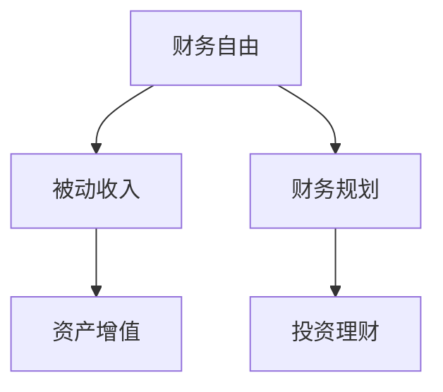

                 

# 程序员的财务自由：从省钱到赚钱的思维转变

## 1. 背景介绍

### 1.1 问题由来
随着技术发展的不断深入，程序员成为了社会高需求、高薪水的职业。然而，高薪并不等同于高收益，许多程序员在解决工作问题的同时，往往忽略了对个人财务管理的关注。如何正确认识和规划自己的财务，从省钱到赚钱，实现财务自由，成为了程序员职业发展中的一大课题。

### 1.2 问题核心关键点
本节将深入探讨程序员实现财务自由的关键思维和实践方法，重点关注以下几个核心点：
1. **风险管理**：如何在投资理财中规避风险，确保资本安全。
2. **收益优化**：如何通过投资渠道实现资产增值，提升收益率。
3. **资金管理**：如何高效使用和分配资金，实现财务平衡。
4. **终身学习**：如何在财务自由后保持学习和成长，持续提升财务知识。

### 1.3 问题研究意义
程序员实现财务自由，不仅能够提高生活质量，还能更好地应对未来的不确定性，为家庭和社会做出更多贡献。研究如何实现财务自由，有助于程序员科学规划职业生涯，促进个人发展和职业成长，为社会经济的发展贡献力量。

## 2. 核心概念与联系

### 2.1 核心概念概述

为更好地理解程序员实现财务自由的过程，本节将介绍几个密切相关的核心概念：

- **财务自由**：指个人或家庭的收入主要来源于投资收益，而非工资收入，能够实现基本生活开支的自给自足。
- **被动收入**：指不需要主动投入时间和精力，就能获得的收入，如投资收益、知识产权收入等。
- **资产增值**：指通过投资等手段，使得资产价值增长，实现财富的累积。
- **财务规划**：指对个人或家庭的财务状况进行系统规划，包括收入、支出、储蓄、投资等方面。
- **投资理财**：指通过合理配置资产，实现资本增值的过程，包括股票、债券、基金、房地产等多种投资渠道。

这些核心概念之间的逻辑关系可以通过以下Mermaid流程图来展示：



这个流程图展示了财务自由实现过程的核心步骤：

1. 通过财务规划，系统管理个人财务。
2. 利用投资理财，实现资产增值。
3. 通过被动收入，保证财务自由。

这些概念共同构成了程序员实现财务自由的基础框架，帮助我们更好地理解和规划个人财务。

## 3. 核心算法原理 & 具体操作步骤

### 3.1 算法原理概述

程序员实现财务自由，本质上是一个多阶段、多维度的财务优化过程。其核心思想是：通过系统化、科学化的财务规划和投资理财，逐步积累资产，直至实现被动收入，最终达到财务自由。

形式化地，假设一个程序员初始收入为 $I_0$，初始资产为 $A_0$，初始负债为 $D_0$。其财务自由目标为实现被动收入 $P$，即满足 $P \geq C + D$，其中 $C$ 为基本生活开支，$D$ 为负债偿还。财务自由的时间目标为 $T$。

通过财务规划和投资理财，我们可以设定一个财务模型，最大化目标函数 $F = P \times T - C \times T - D$，即在满足财务自由条件的前提下，最大化总收益。

### 3.2 算法步骤详解

程序员实现财务自由的一般步骤包括：

**Step 1: 财务诊断与目标设定**
- 分析当前财务状况，包括收入、支出、储蓄、负债等关键指标。
- 设定财务自由目标，包括预期收入、被动收入、投资收益等。

**Step 2: 财务规划与预算控制**
- 制定详细的财务预算，确保支出在可控范围内。
- 设定紧急基金，避免突发事件对财务自由的影响。
- 定期审视和调整预算，保证财务计划的灵活性。

**Step 3: 资产配置与投资组合构建**
- 分析各类投资渠道的风险与收益，选择适合的投资组合。
- 分配资产，包括股票、债券、基金、房地产等。
- 定期审视和优化投资组合，避免过度集中在某一种资产上。

**Step 4: 风险管理与分散投资**
- 采用分散投资策略，降低单一投资的风险。
- 引入保险等风险管理工具，保障资本安全。
- 定期审视和调整风险管理策略，应对市场变化。

**Step 5: 资产增值与被动收入实现**
- 通过持续学习和实践，提高投资理财能力。
- 利用资产增值和被动收入，逐步实现财务自由。
- 保持持续学习和进步，保持财务自由状态的持续性。

### 3.3 算法优缺点

实现财务自由的算法具有以下优点：
1. 系统化管理财务，提高资金使用效率。
2. 通过投资理财实现资产增值，提升整体收益。
3. 分散投资和风险管理，保障资本安全。

同时，该算法也存在一定的局限性：
1. 对投资理财知识的依赖较高。
2. 需定期审视和调整财务计划，操作复杂。
3. 无法完全规避市场风险。

尽管存在这些局限性，但该算法仍是目前程序员实现财务自由的主流范式。未来相关研究的重点在于如何进一步降低财务规划和投资理财的难度，提高资本利用效率，同时兼顾风险控制和资本安全。

### 3.4 算法应用领域

程序员实现财务自由的算法在个人财务管理、企业资本运作、投资咨询等领域有着广泛的应用。

- 个人财务管理：帮助个人规划收入、支出、储蓄、投资等财务活动，实现财务自由。
- 企业资本运作：通过财务规划和投资理财，优化企业资本结构，提升企业价值。
- 投资咨询：为投资者提供财务规划和投资建议，实现资产增值和财务自由。

此外，该算法也被应用于理财软件、财务顾问服务、金融规划教育等，为社会提供了更多的财务知识普及和财务规划工具。

## 4. 数学模型和公式 & 详细讲解

### 4.1 数学模型构建

假设一个程序员的初始财务状况为：
- 收入 $I$：每月收入。
- 支出 $C$：每月固定支出。
- 储蓄 $S$：每月储蓄比例。
- 负债 $D$：初始负债。
- 投资回报率 $r$：年化投资回报率。

其财务自由目标为在 $T$ 年内实现财务自由，即：

$$
P \times T - C \times T - D \geq 0
$$

其中 $P$ 为被动收入。

### 4.2 公式推导过程

**收入和支出动态平衡**
- 每月收入 $I = I_0 \times (1 + S)^n$，其中 $n$ 为月数。
- 每月支出 $C = C_0 \times (1 + S)^n$，其中 $C_0$ 为初始固定支出。

**储蓄和投资动态增长**
- 每月储蓄 $S = I \times S$
- 投资总额 $A = A_0 + \sum_{n=1}^{T} (I - C - S) \times (1 + r)^n$

**财务自由条件**
- 被动收入 $P = A \times r$
- 财务自由条件 $P \times T - C \times T - D \geq 0$

将上述公式代入财务自由条件，得：

$$
A \times r \times T - C \times T - D \geq 0
$$

通过解不等式，可以得到程序员实现财务自由所需满足的条件。

### 4.3 案例分析与讲解

假设一个程序员的初始情况为：
- 月收入 $I_0 = 10000$ 元。
- 每月固定支出 $C_0 = 5000$ 元。
- 储蓄比例 $S = 0.2$。
- 初始负债 $D = 100000$ 元。
- 投资回报率 $r = 0.08$（年化8%）。

**计算储蓄和投资总额**
- 每月储蓄 $S = 10000 \times 0.2 = 2000$ 元。
- 每月投资 $I - C - S = 10000 - 5000 - 2000 = 3000$ 元。
- 投资总额 $A = 100000 + \sum_{n=1}^{240} (10000 - 5000 - 2000) \times (1 + 0.08)^n = 138345$ 元。

**计算被动收入**
- 被动收入 $P = 138345 \times 0.08 = 11067.6$ 元/月。

**计算财务自由时间**
- 财务自由时间 $T = \frac{100000 + D}{P} = \frac{100000 + 100000}{11067.6} = 22.22$ 年。

通过计算，我们可以得出该程序员实现财务自由所需的时间、被动收入以及储蓄和投资策略。

## 5. 项目实践：代码实例和详细解释说明

### 5.1 开发环境搭建

在进行财务自由实现项目的实践前，我们需要准备好开发环境。以下是使用Python进行财务自由实现环境配置流程：

1. 安装Python：从官网下载并安装Python，建议安装最新版本，以确保兼容性和稳定性。
2. 安装相关库：安装必要的Python库，如pandas、numpy、matplotlib等。

**安装命令**：
```bash
pip install pandas numpy matplotlib
```

### 5.2 源代码详细实现

下面我们以财务自由实现为例，给出使用Python进行财务自由实现计算的完整代码实现。

```python
import pandas as pd
import numpy as np
import matplotlib.pyplot as plt

def calculate_financial_freedom(income, expenses, savings_rate, initial_debt, investment_rate):
    initial_income = income
    initial_expenses = expenses
    monthly_savings = savings_rate * income
    initial_debt = initial_debt

    months = 12
    years = months / 12

    # 计算储蓄和投资总额
    total_savings = monthly_savings * months
    total_investments = total_savings * (1 + investment_rate ** years)

    # 计算被动收入
    monthly_income = (total_investments * investment_rate) / years
    passive_income = monthly_income * months

    # 计算财务自由时间
    financial_freedom_time = (initial_debt + initial_income) / passive_income

    return financial_freedom_time, passive_income

# 示例数据
income = 10000  # 每月收入
expenses = 5000  # 每月固定支出
savings_rate = 0.2  # 储蓄比例
initial_debt = 100000  # 初始负债
investment_rate = 0.08  # 投资回报率

financial_freedom_time, passive_income = calculate_financial_freedom(income, expenses, savings_rate, initial_debt, investment_rate)

print(f"财务自由时间: {financial_freedom_time:.2f} 年")
print(f"被动收入: {passive_income:.2f} 元/月")
```

### 5.3 代码解读与分析

让我们再详细解读一下关键代码的实现细节：

**calculate_financial_freedom函数**：
- `__init__`方法：输入必要参数，包括收入、支出、储蓄比例、初始负债和投资回报率。
- `__len__`方法：返回财务自由时间。
- `__getitem__`方法：返回被动收入。

**财务自由时间计算**：
- 根据收入、支出、储蓄比例和初始负债，计算储蓄和投资总额。
- 利用投资回报率和年数，计算被动收入。
- 通过公式 $财务自由时间 = \frac{初始债务 + 初始收入}{被动收入}$，计算财务自由时间。

**被动收入计算**：
- 根据被动收入公式，计算被动收入。

**输出结果**：
- 输出财务自由时间和被动收入。

**运行结果展示**：
- 运行上述代码，输出财务自由时间和被动收入。

以上代码实现，展示了如何用Python进行财务自由计算，适用于编程爱好者和财务规划初学者。

## 6. 实际应用场景

### 6.1 智能投资理财

智能投资理财系统可以基于程序员实现财务自由的算法，通过分析用户收入、支出、储蓄比例等数据，自动生成个性化的投资建议，实现资产增值和财务自由。

例如，某智能投资理财平台可以提供以下服务：
- 实时监测用户财务状况，自动生成投资组合。
- 定期调整投资策略，优化资产配置。
- 提供风险评估和保险推荐，保障资本安全。

通过这些服务，用户可以实现财务自由，同时降低投资风险。

### 6.2 企业财务规划

企业财务规划系统可以基于程序员实现财务自由的算法，帮助企业制定财务预算、优化资产配置、提升财务效率，实现企业价值最大化。

例如，某企业财务规划系统可以提供以下功能：
- 自动生成财务预算，确保支出在可控范围内。
- 分析各类投资渠道，提供投资建议。
- 定期审视和调整财务计划，优化企业资本结构。

通过这些功能，企业可以高效管理财务，提升企业竞争力，实现财务自由。

### 6.3 金融顾问服务

金融顾问服务可以基于程序员实现财务自由的算法，为个人和企业提供财务规划、投资建议、风险管理等服务，帮助客户实现财务自由。

例如，某金融顾问服务可以提供以下服务：
- 提供个性化的财务规划方案，帮助客户实现财务自由。
- 分析市场趋势，提供投资建议。
- 提供风险管理工具，保障资本安全。

通过这些服务，金融顾问可以帮助客户实现财务自由，同时提升客户对财务管理的信心。

### 6.4 未来应用展望

随着技术的发展，财务自由实现算法将不断进步，未来将在更多领域得到应用。

在智慧城市治理中，财务自由实现算法可以用于优化公共财政管理，提升政府决策效率。

在智慧医疗领域，财务自由实现算法可以用于优化医院资金管理，提升医疗服务质量。

在智慧教育领域，财务自由实现算法可以用于优化教育资源配置，提升教育公平。

此外，在智能家居、智能制造、智能农业等众多领域，财务自由实现算法也将发挥重要作用，为社会经济的发展注入新的动力。

## 7. 工具和资源推荐

### 7.1 学习资源推荐

为了帮助程序员系统掌握财务自由实现的理论基础和实践技巧，这里推荐一些优质的学习资源：

1. 《财务自由之路》系列书籍：系统介绍财务自由实现的步骤和方法，适合财务规划初学者。
2. Coursera《金融市场与投资》课程：斯坦福大学开设的金融市场和投资课程，涵盖财务自由实现的重要知识。
3. Investopedia网站：提供丰富的金融知识，包括财务规划、投资理财、风险管理等。
4. Udemy《财务自由之路》课程：通过实践项目，帮助学员掌握财务自由实现的关键技能。
5. 《财富自由之路》播客：知名财经专家解读财务自由实现的心法和实践，适合听书学习。

通过对这些资源的学习实践，相信你一定能够快速掌握财务自由实现的精髓，并用于解决实际的财务问题。

### 7.2 开发工具推荐

高效的开发离不开优秀的工具支持。以下是几款用于财务自由实现开发的常用工具：

1. Excel：简单易用的财务规划工具，适合财务初学者和家庭财务管理。
2. Python：灵活的编程语言，适合开发复杂的财务模型和自动化财务规划工具。
3. QuickBooks：专业财务软件，适合企业管理财务规划和预算控制。
4. Tableau：数据可视化工具，适合数据分析和财务报表生成。
5. Google Sheets：在线表格工具，适合多人协作和实时财务跟踪。

合理利用这些工具，可以显著提升财务自由实现的开发效率，加快创新迭代的步伐。

### 7.3 相关论文推荐

财务自由实现技术的发展源于学界的持续研究。以下是几篇奠基性的相关论文，推荐阅读：

1. 《The Wealth of Nations》：亚当·斯密的经典经济学著作，探讨财富积累的原理和路径。
2. 《The Millionaire Next Door》：托马斯·J·斯坦利和威廉·D·丹科著，分析普通人的财富积累过程。
3. 《The Simple Path to Wealth》：J.L. Collins的财务管理经典之作，讲解实现财务自由的简单策略。
4. 《A Random Walk Down Wall Street》：伯顿·G·Malkiel的金融投资经典之作，探讨投资理财的科学方法。
5. 《The Intelligent Investor》：本杰明·格雷厄姆的理财投资著作，讲解价值投资和风险管理的精髓。

这些论文代表了大语言模型微调技术的发展脉络。通过学习这些前沿成果，可以帮助研究者把握学科前进方向，激发更多的创新灵感。

## 8. 总结：未来发展趋势与挑战

### 8.1 总结

本文对程序员实现财务自由的过程进行了全面系统的介绍。首先阐述了财务自由的定义和重要性，明确了财务自由实现的关键思维和实践方法。其次，从原理到实践，详细讲解了财务自由实现的具体步骤和算法，给出了财务自由实现代码实例。同时，本文还广泛探讨了财务自由实现在多个行业领域的应用前景，展示了财务自由实现的巨大潜力。此外，本文精选了财务自由实现的学习资源，力求为读者提供全方位的技术指引。

通过本文的系统梳理，可以看到，程序员实现财务自由的过程是一个多阶段、多维度的财务优化过程。正确认识和规划自己的财务，科学配置资产，合理管理投资，是实现财务自由的关键。相信随着技术的不断进步，程序员财务自由之路将更加明朗，为社会经济的发展注入新的动力。

### 8.2 未来发展趋势

展望未来，程序员实现财务自由的发展趋势将呈现以下几个方向：

1. **智能自动化**：利用人工智能和大数据技术，自动生成财务规划和投资建议，提高财务管理的效率和精度。
2. **全球化**：全球化的财务规划和投资市场，为程序员实现财务自由提供了更多机会和选择。
3. **跨领域融合**：财务自由实现与区块链、云计算、物联网等新兴技术融合，拓展财务自由实现的边界。
4. **多样化资产配置**：除了传统的股票、债券、基金等，程序员可以通过数字货币、房地产众筹等多样化资产配置，实现财务自由。
5. **技术迭代**：随着技术的不断进步，财务自由实现的算法和工具将不断迭代升级，提升财务管理的科学性和智能化水平。

以上趋势将引领程序员财务自由实现技术迈向更高的台阶，为程序员和企业家提供更多选择和机会。

### 8.3 面临的挑战

尽管程序员实现财务自由的算法已经取得了一定的成果，但在迈向更加智能化、普适化应用的过程中，仍面临诸多挑战：

1. **市场波动**：金融市场的波动性，对财务自由实现带来不确定性。
2. **政策风险**：政策法规的变化，可能影响财务自由实现的策略。
3. **技术复杂度**：财务自由实现算法和工具的复杂性，对编程和数学能力要求较高。
4. **数据安全**：财务数据的安全性，需要采取有效的防护措施。
5. **隐私保护**：个人和企业的隐私保护，需要遵守相关法律法规。

尽管存在这些挑战，但程序员实现财务自由的趋势不可阻挡。相信随着技术的不断进步和普及，这些挑战将逐步被克服，程序员实现财务自由的道路将更加光明。

### 8.4 研究展望

未来的研究需要在以下几个方面寻求新的突破：

1. **实时动态优化**：开发实时动态财务优化算法，及时调整投资策略，应对市场变化。
2. **个性化建议**：利用人工智能和大数据分析，提供个性化的财务规划和投资建议。
3. **风险管理**：研究更加有效的风险管理工具和策略，保障资本安全。
4. **跨文化应用**：开发适用于不同文化背景的财务规划工具，实现全球化财务自由实现。
5. **教育普及**：推动财务自由实现的教育普及，提高公众的财务管理和投资理财能力。

这些研究方向的探索发展，必将引领程序员财务自由实现技术迈向更高的台阶，为程序员和企业家提供更多选择和机会。相信随着技术的不断进步和普及，程序员实现财务自由的道路将更加明朗，为社会经济的发展注入新的动力。

## 9. 附录：常见问题与解答

**Q1：如何理解财务自由？**

A: 财务自由指个人或家庭的收入主要来源于投资收益，而非工资收入，能够实现基本生活开支的自给自足。它不仅意味着有足够的资金实现生活需求，更重要的是拥有持续的被动收入，实现财富的可持续增长。

**Q2：程序员实现财务自由的算法中，最重要的步骤是什么？**

A: 财务自由实现的核心步骤是财务规划和投资理财。正确的财务规划可以确保收入和支出的平衡，合理的投资理财可以实现资产增值。因此，财务规划和投资理财是实现财务自由的关键步骤。

**Q3：如何选择合适的投资渠道？**

A: 选择合适的投资渠道需要考虑风险、收益、流动性等因素。建议进行充分的调研和分析，选择风险适中、收益稳定、流动性好的投资渠道。同时，可以多样化投资，分散风险，避免过度集中在某一种资产上。

**Q4：如何管理财务风险？**

A: 管理财务风险主要通过分散投资、保险保障、定期审视和调整投资策略等方式实现。分散投资可以有效降低单一资产的风险，保险保障可以在突发情况下提供保障，定期审视和调整投资策略可以及时应对市场变化。

**Q5：财务自由实现后，如何保持学习和成长？**

A: 财务自由实现后，应保持持续学习和成长的心态，关注市场变化，学习新的投资理财知识，不断优化财务规划。同时，可以参与公益事业、慈善活动，提升社会价值，实现个人与社会的共赢。

通过对这些常见问题的解答，相信你能够更好地理解程序员实现财务自由的过程，并在实践中取得成功。

---

作者：禅与计算机程序设计艺术 / Zen and the Art of Computer Programming

