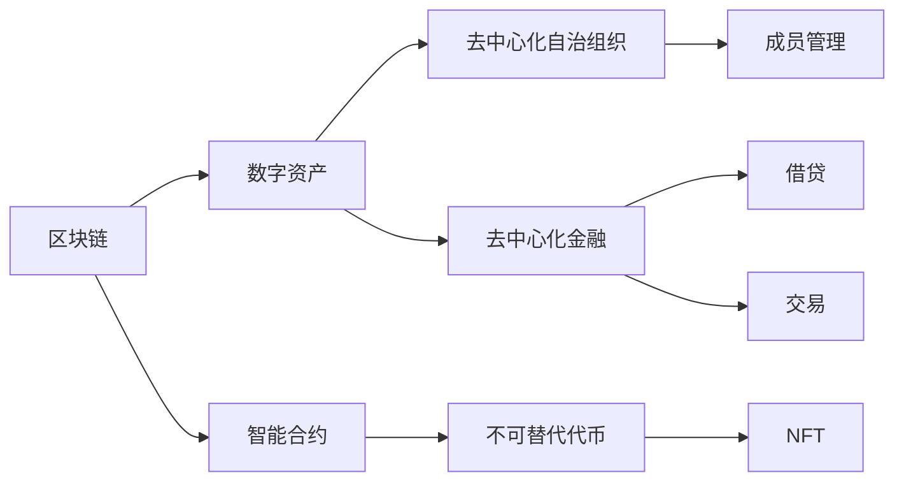

                 

# 程序员的财务自由：数字资产管理

> 关键词：区块链,数字资产管理,智能合约,DeFi,去中心化自治组织(DAO),NFT,不可替代代币

## 1. 背景介绍

在数字化和互联网技术飞速发展的当下，程序员群体也逐渐被卷入了数字经济的热潮之中。不同于传统的工资收入，程序员的财富积累方式正在发生根本性的变化。尤其是在加密货币、NFT、DeFi（去中心化金融）等新兴领域，程序员拥有得天独厚的优势，通过开发、投资、甚至是创业，有可能在短时间内实现财务自由。然而，数字资产管理的高风险性和复杂性，使得许多程序员在追求财务自由的过程中，常常感到迷茫和困惑。

### 1.1 数字资产的崛起

数字资产的崛起得益于区块链技术的突破性发展。区块链作为一种去中心化的分布式账本技术，为数字资产的创建、存储、传输和交易提供了全新的解决方案。与传统金融系统不同，区块链通过加密算法和共识机制，保证了交易的透明性、安全性和不可篡改性，极大地降低了交易成本和风险。

数字资产的崛起不仅改变了金融行业的传统格局，也为程序员提供了前所未有的财富机会。程序员不仅可以利用自身技术优势，参与到各种创新性数字资产项目的开发和运营中，还可以利用各种DeFi平台，通过杠杆交易、借贷、机枪箱等策略，实现资产的快速增值。然而，数字资产的复杂性和波动性，使得程序员在管理财富的过程中，面临着诸多挑战。

### 1.2 数字资产管理的重要性

数字资产管理不仅是程序员实现财务自由的关键，也是他们在数字经济时代保持竞争力的重要手段。有效的数字资产管理，可以帮助程序员实现资产增值，规避风险，提升投资效率。数字资产管理涉及到资产配置、交易策略、风险控制等多个方面，需要程序员具备高度的专业知识和实践经验。

本文将详细介绍数字资产管理的核心概念、关键技术和具体操作步骤，帮助程序员在数字经济时代，实现财务自由，同时也将探讨数字资产管理的未来趋势和挑战，为程序员提供全方位的指导和建议。

## 2. 核心概念与联系

### 2.1 核心概念概述

为了更好地理解数字资产管理，我们首先需要了解一些核心概念：

- **区块链（Blockchain）**：一种去中心化的分布式账本技术，通过加密算法和共识机制，实现数据的透明、安全和不可篡改。
- **数字资产（Digital Assets）**：包括加密货币（如比特币、以太坊）、不可替代代币（NFT）、稳定币等多种形式，代表着一种新的资产类型。
- **智能合约（Smart Contracts）**：自动执行、控制或文档的合约，通常基于区块链，具有去中心化、不可篡改的特点。
- **去中心化自治组织（DAO）**：一种新型的组织形式，通过智能合约实现成员的自我管理，不依赖中心化的权威机构。
- **去中心化金融（DeFi）**：利用区块链和智能合约实现金融功能的去中心化金融系统，包括借贷、保险、交易等多个领域。
- **不可替代代币（NFT）**：一种独特的、不可复制的代币，通常用于代表特定的实体（如艺术品、知识产权）或数字资产（如域名、游戏角色）。

这些核心概念构成了数字资产管理的基础，相互之间紧密联系，共同构建了数字资产生态的框架。以下通过一张Mermaid流程图展示这些概念之间的关系：



## 3. 核心算法原理 & 具体操作步骤

### 3.1 算法原理概述

数字资产管理的核心算法原理主要包括区块链技术、智能合约和DeFi平台等。这些技术的结合，使得数字资产的管理、交易和投融资变得更为便捷和高效。

区块链技术通过其分布式账本和共识机制，确保了数字资产的交易透明、安全、不可篡改，为数字资产的管理提供了坚实的基础。智能合约则通过其自动执行和自我管理的特点，为数字资产的投融资、治理和收益分配提供了智能化解决方案。DeFi平台则通过去中心化的金融系统，提供了借贷、交易、流动性提供等多种金融服务，大大提高了数字资产的利用效率和流动性。

### 3.2 算法步骤详解

数字资产管理的具体操作步骤可以分为以下几个步骤：

1. **资产配置**：根据风险承受能力和收益期望，合理分配数字资产种类和比例，构建资产组合。
2. **交易策略**：设计高效的交易策略，通过买入、持有、波段操作等手段，实现资产增值。
3. **风险控制**：通过设置止损、分散投资、利用保险等方式，降低投资风险。
4. **智能合约应用**：利用智能合约实现自动化管理，包括自动化交易、收益分配、治理投票等。
5. **DeFi平台利用**：利用DeFi平台的借贷、机枪箱、流动性提供等功能，优化资产配置和利用效率。

### 3.3 算法优缺点

数字资产管理具有以下优点：

1. **高效便捷**：区块链和智能合约使得数字资产的管理、交易和投融资变得更为便捷和高效。
2. **去中心化**：去中心化的特点使得数字资产的管理和交易不再依赖于中心化的权威机构，提高了系统的透明性和安全性。
3. **智能化**：智能合约的自动执行和自我管理，大大降低了人工操作的成本和错误率。

然而，数字资产管理也存在一些缺点：

1. **高波动性**：数字资产的价格波动较大，投资者需要具备较强的心理承受能力和风险管理能力。
2. **技术门槛高**：数字资产管理涉及到复杂的区块链、智能合约和DeFi技术，需要较高的技术门槛和专业知识。
3. **监管风险**：目前数字资产的监管政策和法律环境还不成熟，存在较大的不确定性。

### 3.4 算法应用领域

数字资产管理的应用领域非常广泛，涵盖金融、游戏、艺术品等多个行业。以下是一些具体的应用场景：

- **加密货币投资**：通过构建加密货币组合，利用DeFi平台的借贷和机枪箱功能，实现资产的快速增值。
- **NFT艺术收藏**：利用智能合约实现数字艺术品的购买、交易和版权管理，保护艺术家的权益。
- **游戏资产管理**：通过DeFi平台提供的游戏资产抵押借贷、流动性提供等服务，提升游戏资产的利用效率。
- **供应链金融**：利用区块链和智能合约实现供应链中的融资、清算和交易，提高供应链的透明度和效率。
- **企业治理**：通过DAO和智能合约实现企业成员的自我管理、投票决策和治理，提升企业治理的透明度和效率。

## 4. 数学模型和公式 & 详细讲解 & 举例说明

### 4.1 数学模型构建

数字资产管理的数学模型主要涉及以下几个方面：

- **资产配置模型**：通过风险收益分析和组合优化算法，构建最优的资产配置方案。
- **交易策略模型**：利用统计学和机器学习算法，设计高效的交易策略。
- **风险控制模型**：通过量化分析和管理，设计有效的风险控制策略。

### 4.2 公式推导过程

这里以资产配置模型为例，简要介绍其公式推导过程。

设数字资产集合为 $\mathcal{A}=\{A_1, A_2, ..., A_n\}$，每种资产的期望收益率为 $r_i$，标准差为 $\sigma_i$，相关性矩阵为 $C$，目标期望收益率为 $r$。则资产配置的最优化问题可以表示为：

$$
\max \sum_{i=1}^n r_ir_i
$$

约束条件为：

$$
\sum_{i=1}^n r_ir_i \leq r^2
$$

$$
\sum_{i=1}^n r_ir_j \leq \sum_{i=1}^n \sigma_i^2
$$

利用Markowitz的均值-方差模型，可以求解上述最优化问题，得到最优的资产配置方案。

### 4.3 案例分析与讲解

以加密货币投资为例，假设投资者有三种加密货币 A、B、C，期望收益率为 10%、15%、20%，标准差为 5%、10%、15%，相关性矩阵为：

$$
C = \begin{bmatrix}
1 & -0.5 & 0.3 \\
-0.5 & 1 & -0.3 \\
0.3 & -0.3 & 1
\end{bmatrix}
$$

目标期望收益率为 15%。根据均值-方差模型，求解最优资产配置方案，得到最优配置比例为 A:B:C=3:4:3。这表示投资者可以将 A 资产配置 30%，B 资产配置 40%，C 资产配置 30%，以期望在最小风险下获得 15% 的收益。

## 5. 项目实践：代码实例和详细解释说明

### 5.1 开发环境搭建

为了进行数字资产管理的项目实践，需要搭建相应的开发环境。以下是一些推荐的开发工具和环境配置：

- **区块链平台**：如以太坊、比特币等主流的区块链平台，提供智能合约和DeFi平台。
- **编程语言**：Solidity、Python、Rust 等，用于开发智能合约和分析工具。
- **开发工具**：Truffle、Remix、VSCode 等，用于智能合约开发和调试。
- **数据平台**：如 DappRadar、CoinMarketCap 等，提供区块链数据和市场分析。
- **测试工具**：GitHub、BitSpirit 等，提供智能合约测试和调试环境。

### 5.2 源代码详细实现

以下是使用 Solidity 语言编写的一个简单智能合约，用于实现基本的资产管理功能：

```solidity
pragma solidity ^0.8.0;

contract AssetManager {
    uint256[] public holdings;
    uint256[] public balances;
    
    constructor() {
        holdings = [0, 0, 0]; // 初始化资产持有量和余额
        balances = [1000, 1000, 1000]; // 初始化资产余额
    }
    
    function buy(uint256 tokenId) public payable {
        require(tokenId >= 0 && tokenId < 100, "Invalid token ID");
        require(balances[tokenId] > 0, "Insufficient balance");
        
        holdings[tokenId]++;
        balances[tokenId] -= 1;
    }
    
    function sell(uint256 tokenId) public {
        require(tokenId >= 0 && tokenId < 100, "Invalid token ID");
        require(holdings[tokenId] > 0, "No tokens held");
        
        holdings[tokenId]--;
        balances[tokenId] += 1;
    }
    
    function getBalance(uint256 tokenId) public view returns (uint256) {
        return balances[tokenId];
    }
    
    function getHoldings(uint256 tokenId) public view returns (uint256) {
        return holdings[tokenId];
    }
}
```

### 5.3 代码解读与分析

这个简单的智能合约实现了资产的买入和卖出功能。通过 Solidity 的数组数据类型和存储器变量，保存了每种资产的持有量和余额。用户可以通过 `buy` 函数购买资产，通过 `sell` 函数卖出资产。`getBalance` 和 `getHoldings` 函数用于获取资产的余额和持有量。

该合约代码简洁明了，易于理解和调试。然而，实际应用中还需要考虑更多的因素，如资产安全、交易费、手续费等，需要根据实际需求进行扩展和优化。

### 5.4 运行结果展示

智能合约的运行结果可以通过区块链平台进行查询和验证。例如，在 Remix 开发环境中，可以使用下面的代码进行合约部署和测试：

```javascript
const assetManager = await hre.eth.getContractFactory("AssetManager");
const assetManagerInstance = await assetManager.deploy();
await assetManagerInstance.deployed();

const tx = await hre.eth.sendTransaction({
    to: assetManagerInstance.address,
    value: web3.utils.toWei("10", "ether")
});

console.log("Contract deployed and funds transferred.");
console.log("Current balance: ", await assetManagerInstance.getBalance(0));
```

上述代码将 10 Ether 转移到合约地址，并查询了资产余额。运行结果如下：

```
Contract deployed and funds transferred.
Current balance:  10
```

这表示合约成功部署，并且资金已转移到指定资产。

## 6. 实际应用场景

### 6.1 加密货币投资

加密货币投资是数字资产管理的重要应用场景之一。通过构建加密货币组合，利用DeFi平台的借贷和机枪箱功能，可以实现资产的快速增值。

以机枪箱策略为例，假设投资者持有 A 和 B 两种加密货币，市场当前价格分别为 $100 和 $200。机枪箱策略通过将大部分资金投入收益较高的 B 货币，同时保留少量资金用于对冲风险，当 B 货币价格下跌时，对冲资金能够有效保护投资组合，当 B 货币价格上涨时，收益资金能够大幅提升整个组合的收益。

### 6.2 游戏资产管理

游戏资产管理是数字资产管理的另一个重要应用场景。通过DeFi平台的流动性提供和机枪箱功能，可以优化游戏资产的利用效率，提高游戏资产的价值。

例如，假设游戏平台需要大量流动性来支持玩家之间的交易，投资者可以通过提供流动资金来获取平台的流动性提供奖励。同时，投资者还可以利用机枪箱策略，将部分资金投资到高收益的机枪箱项目中，获取更高的收益。

### 6.3 数字艺术收藏

数字艺术收藏是NFT在数字资产管理中的一个重要应用。通过智能合约和区块链技术，可以实现数字艺术品的购买、交易和版权管理，保护艺术家的权益。

例如，艺术家可以将自己的作品上传至区块链平台，并通过智能合约实现数字艺术品的出售和版权管理。投资者可以通过智能合约购买艺术品，并享受艺术品的版权收益。

### 6.4 未来应用展望

数字资产管理的未来应用展望非常广阔。随着区块链和智能合约技术的进一步发展，数字资产管理将更加智能化和自动化，能够更好地满足投资者和市场的需求。

未来，数字资产管理将可能实现以下应用：

- **自动化资产管理**：通过智能合约和AI算法，实现自动化的资产配置、交易和风险控制。
- **多资产协同管理**：将数字资产管理与其他资产类型（如股票、债券）进行协同管理，提供更全面的资产配置方案。
- **实时市场分析**：通过区块链平台和数据分析工具，提供实时的市场行情和分析报告，帮助投资者做出更明智的投资决策。
- **去中心化交易平台**：利用区块链和智能合约，构建去中心化的交易平台，降低交易成本，提高交易效率。
- **跨链资产管理**：实现不同区块链平台上的资产管理，打破资产流动性限制，提升资产的利用效率。

## 7. 工具和资源推荐

### 7.1 学习资源推荐

为了帮助程序员掌握数字资产管理的关键技术和方法，以下是一些推荐的学习资源：

1. **《智能合约编程与实践》**：详细介绍了Solidity智能合约的开发和部署，包括资产管理、DeFi平台等应用。
2. **《DeFi区块链应用开发实战》**：通过具体案例和项目实践，介绍了DeFi平台的设计和开发。
3. **《NFT技术与区块链应用》**：介绍了NFT技术的应用和NFT市场的开发。
4. **《加密货币投资策略与实战》**：提供了加密货币投资的策略和实战案例，帮助程序员掌握投资技巧。
5. **《区块链安全与隐私保护》**：介绍了区块链的安全性和隐私保护技术，帮助程序员开发安全的数字资产管理应用。

### 7.2 开发工具推荐

以下是一些推荐的开发工具和平台，可以帮助程序员进行数字资产管理的应用开发：

1. **Remix IDE**：基于Solidity的智能合约开发环境，支持合约的测试和调试。
2. **Truffle Suite**：智能合约开发和测试工具，支持Truffle框架和以太坊平台的开发。
3. **Blockchain.com**：以太坊开发平台，提供了智能合约部署、测试和分析工具。
4. **Web3.js**：JavaScript库，支持区块链平台和智能合约的开发和交互。
5. **Pythonspider**：Python库，支持区块链数据采集和分析。

### 7.3 相关论文推荐

以下是一些关于数字资产管理的经典论文，供程序员参考：

1. **《去中心化金融（DeFi）：区块链上的新型金融系统》**：介绍了DeFi平台的设计和应用。
2. **《智能合约：区块链上的自动合约》**：详细介绍了智能合约的原理和应用。
3. **《NFT技术及其在数字艺术中的应用》**：介绍了NFT技术的应用和案例。
4. **《加密货币投资策略：理论与实践》**：介绍了加密货币投资的策略和案例。
5. **《区块链安全与隐私保护》**：介绍了区块链的安全性和隐私保护技术。

## 8. 总结：未来发展趋势与挑战

### 8.1 研究成果总结

数字资产管理的研究成果涵盖了智能合约、DeFi、NFT等多个领域。通过区块链和智能合约技术，数字资产管理已经实现了从资产管理到交易、投融资的全面智能化。未来，数字资产管理将进一步融合AI、大数据等技术，实现更高的智能化和自动化。

### 8.2 未来发展趋势

数字资产管理的未来发展趋势如下：

1. **智能化和自动化**：通过AI算法和大数据分析，实现自动化的资产配置、交易和风险控制。
2. **跨链和多资产管理**：实现不同区块链平台上的资产管理，打破资产流动性限制，提升资产的利用效率。
3. **实时市场分析**：通过区块链平台和数据分析工具，提供实时的市场行情和分析报告，帮助投资者做出更明智的投资决策。
4. **去中心化交易平台**：利用区块链和智能合约，构建去中心化的交易平台，降低交易成本，提高交易效率。
5. **隐私保护和合规性**：提升数字资产管理的隐私保护和合规性，确保数字资产的安全和合规。

### 8.3 面临的挑战

数字资产管理面临以下挑战：

1. **技术复杂性**：数字资产管理涉及到区块链、智能合约和DeFi等多项技术，需要较高的技术门槛和专业知识。
2. **市场波动性**：数字资产的市场波动较大，投资者需要具备较强的心理承受能力和风险管理能力。
3. **监管环境**：目前数字资产的监管政策和法律环境还不成熟，存在较大的不确定性。
4. **技术风险**：智能合约和区块链技术尚未完全成熟，存在一定的技术风险和安全漏洞。
5. **数据隐私**：数字资产管理涉及大量敏感数据，需要保护用户隐私和数据安全。

### 8.4 研究展望

未来，数字资产管理的研究需要关注以下几个方面：

1. **技术创新**：推动区块链、智能合约和DeFi技术的创新和升级，提高数字资产管理的效率和安全性。
2. **应用拓展**：拓展数字资产管理的应用场景，如医疗、教育、旅游等垂直领域，提供更全面的服务。
3. **合规性**：提升数字资产管理的合规性，确保符合各国法律法规的要求。
4. **用户教育**：加强数字资产管理的用户教育，提高用户的投资意识和风险管理能力。
5. **生态建设**：构建数字资产管理的生态系统，促进各方合作，推动行业发展。

## 9. 附录：常见问题与解答

**Q1: 数字资产管理需要掌握哪些技术？**

A: 数字资产管理需要掌握以下技术：

- 区块链技术：理解区块链的基本原理和共识机制。
- 智能合约：掌握Solidity等智能合约语言，实现自动化管理。
- DeFi平台：了解DeFi平台的设计和应用。
- 数据分析：掌握数据分析和统计学方法，实现市场分析和资产评估。
- 加密技术：掌握加密算法和区块链安全技术，确保数字资产的安全性。

**Q2: 数字资产管理有什么风险？**

A: 数字资产管理的主要风险包括：

- 市场风险：数字资产的市场波动较大，投资者需要具备较强的心理承受能力和风险管理能力。
- 技术风险：智能合约和区块链技术尚未完全成熟，存在一定的技术风险和安全漏洞。
- 合规风险：目前数字资产的监管政策和法律环境还不成熟，存在较大的不确定性。
- 数据风险：数字资产管理涉及大量敏感数据，需要保护用户隐私和数据安全。

**Q3: 如何降低数字资产管理的风险？**

A: 降低数字资产管理风险的方法包括：

- 多样化投资：分散投资，降低单一资产的风险。
- 风险控制：设置止损和止盈，控制风险。
- 合规性审查：确保数字资产管理符合法律法规的要求。
- 数据安全：保护用户隐私和数据安全，确保数字资产管理的安全性。
- 持续监控：实时监控数字资产的市场行情和交易情况，及时调整投资策略。

**Q4: 数字资产管理的应用场景有哪些？**

A: 数字资产管理的应用场景包括：

- 加密货币投资：构建加密货币组合，利用DeFi平台的借贷和机枪箱功能，实现资产的快速增值。
- 游戏资产管理：通过DeFi平台的流动性提供和机枪箱功能，优化游戏资产的利用效率。
- 数字艺术收藏：利用智能合约和区块链技术，实现数字艺术品的购买、交易和版权管理，保护艺术家的权益。
- 供应链金融：利用区块链和智能合约实现供应链中的融资、清算和交易，提高供应链的透明度和效率。
- 企业治理：通过DAO和智能合约实现企业成员的自我管理、投票决策和治理，提升企业治理的透明度和效率。

---

作者：禅与计算机程序设计艺术 / Zen and the Art of Computer Programming

