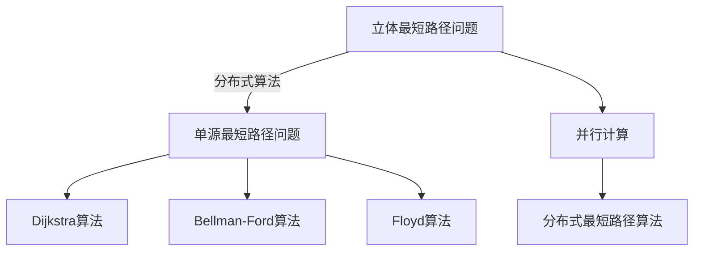

                 

# 立体最短路径及其分布式实现

## 1. 背景介绍

最短路径问题是图论中最经典、最重要的问题之一。在计算机科学、网络工程、交通规划等领域都有着广泛的应用。传统的单源最短路径算法有Dijkstra算法、Bellman-Ford算法、Floyd算法等。近年来，随着数据量的增大和计算复杂度的提升，如何高效地解决大规模图的最短路径问题，成为计算机科学家和工程师们关注的焦点。

立体最短路径问题是一种特殊的图论问题，它不仅要求在图中找到一条最短路径，还要求这条路径具有三维空间的几何属性。例如，在自动驾驶领域，需要计算车辆从起点到终点的最短路径，同时满足空间中的车辆行驶距离、角度、速度等物理约束。这种复杂的多维度约束条件，使得立体最短路径问题求解更加困难。

随着分布式计算技术的发展，分布式算法在求解大规模图论问题中逐渐成为研究热点。分布式算法可以充分利用多台计算机的计算能力，通过并行计算，大大提高问题的求解效率。因此，本文将探讨分布式算法在立体最短路径问题中的应用，提出一种高效的立体最短路径求解算法，并分析其在实际应用中的优势和挑战。

## 2. 核心概念与联系

### 2.1 核心概念概述

立体最短路径问题涉及的概念包括：

- **图论**：最短路径问题来源于图论中的单源最短路径问题。图论是研究图和网络结构及其相关算法的一门学科，广泛应用于计算机科学、网络工程、交通规划等领域。
- **最短路径算法**：包括Dijkstra算法、Bellman-Ford算法、Floyd算法等，用于求解单源最短路径问题。
- **分布式算法**：利用多台计算机并行计算，提高大规模问题的求解效率。

这些概念之间存在密切的联系：

- 立体最短路径问题可以视作单源最短路径问题在三维空间上的扩展。
- 分布式算法可以应用于立体最短路径问题的求解，提高求解效率。

### 2.2 核心概念原理和架构的 Mermaid 流程图



## 3. 核心算法原理 & 具体操作步骤

### 3.1 算法原理概述

立体最短路径问题的求解可以分为两个步骤：

1. **数据划分**：将原始数据划分为多个子图，分配到不同的计算机节点上进行并行计算。
2. **并行计算**：在各个节点上，使用Dijkstra算法或Bellman-Ford算法求解局部最短路径，并合并结果，得到全局最短路径。

### 3.2 算法步骤详解

1. **数据划分**：将原始图数据划分为多个子图，每个子图包含一部分节点和边。这些子图的大小应该尽可能相等，以便均衡分配计算资源。可以使用Hash算法或K-means算法进行划分。

2. **并行计算**：在各个节点上，使用Dijkstra算法或Bellman-Ford算法求解局部最短路径。Dijkstra算法适用于边权值非负的图，Bellman-Ford算法适用于边权值有负的图。

3. **结果合并**：各个节点计算完成后，将局部最短路径合并为全局最短路径。可以使用类似于MapReduce的合并操作，将各个节点的结果合并为一个全局结果。

### 3.3 算法优缺点

**优点**：

- 并行计算可以充分利用多台计算机的计算能力，提高求解效率。
- 适用于大规模图的最短路径问题求解。
- 算法思路清晰，易于实现。

**缺点**：

- 需要较多的通信开销，以协调各个节点的计算。
- 数据划分和节点通信的开销较大，可能会影响算法的整体性能。
- 分布式算法的实现较为复杂，需要考虑并发控制、数据一致性等问题。

### 3.4 算法应用领域

立体最短路径算法可以应用于以下领域：

- 自动驾驶：在三维空间中，计算车辆从起点到终点的最短路径，同时满足行驶距离、角度、速度等物理约束。
- 城市规划：在城市三维地图中，计算从起点到终点的最短路径，优化道路设计和交通规划。
- 航空交通：在三维空中地图中，计算飞机从起点到终点的最短路径，优化航线和飞行路径。

## 4. 数学模型和公式 & 详细讲解 & 举例说明

### 4.1 数学模型构建

立体最短路径问题的数学模型可以表示为一个带权有向图 $G=(V,E,W)$，其中 $V$ 表示节点集合，$E$ 表示边集合，$W$ 表示边权重集合。设起点为 $s$，终点为 $t$，需要计算从起点 $s$ 到终点 $t$ 的最短路径。

### 4.2 公式推导过程

设节点 $u$ 的初始距离为 $d(u)$，则Dijkstra算法的基本步骤包括：

1. 初始化：$d(s)=0$，$d(u)=\infty$（$u \neq s$），$V_0=\{s\}$。
2. 松弛操作：对于未访问的节点 $u$，如果存在从起点 $s$ 到节点 $u$ 的路径，则更新 $d(u)$ 为 $d(s)+w(s,u)$。
3. 选择节点：选择当前距离最小的节点 $u$，即 $u=\arg\min_{v \in V-V_0}d(v)$。
4. 更新 $V$：将节点 $u$ 加入 $V_0$。
5. 重复步骤2-4，直到 $t$ 被访问或者 $d(t)$ 为无穷大。

### 4.3 案例分析与讲解

以自动驾驶为例，考虑车辆从起点到终点的最短路径问题。假设车辆在三维空间中行驶，起点坐标为 $(x_0, y_0, z_0)$，终点坐标为 $(x_t, y_t, z_t)$。假设每个网格点的权值表示车辆在该点行驶的距离、角度、速度等物理约束。

假设将三维空间划分为 $n \times n \times n$ 的网格，每个节点表示一个网格点。节点之间的边表示从网格点 $u$ 到网格点 $v$ 的直接连接，边权值为从节点 $u$ 到节点 $v$ 的行驶距离、角度、速度等物理约束。

使用Dijkstra算法求解最短路径，步骤如下：

1. 初始化：$d(s)=0$，$d(u)=\infty$（$u \neq s$），$V_0=\{s\}$。
2. 松弛操作：对于未访问的节点 $u$，如果存在从起点 $s$ 到节点 $u$ 的路径，则更新 $d(u)$ 为 $d(s)+w(s,u)$。
3. 选择节点：选择当前距离最小的节点 $u$，即 $u=\arg\min_{v \in V-V_0}d(v)$。
4. 更新 $V$：将节点 $u$ 加入 $V_0$。
5. 重复步骤2-4，直到 $t$ 被访问或者 $d(t)$ 为无穷大。

最终得到从起点 $s$ 到终点 $t$ 的最短路径。

## 5. 项目实践：代码实例和详细解释说明

### 5.1 开发环境搭建

首先需要准备一些开发环境，包括：

- 安装Python和相关的科学计算库，如NumPy、SciPy、Scikit-learn等。
- 安装分布式计算库，如Dask、Ray、Apache Spark等。
- 安装可视化工具，如Matplotlib、Plotly等。

### 5.2 源代码详细实现

以下是使用Dask库实现的立体最短路径算法：

```python
import numpy as np
from dask.distributed import Client, progress

def dijkstra(graph, start, end):
    num_nodes = len(graph)
    dist = np.full(num_nodes, np.inf)
    dist[start] = 0
    unvisited = set(range(num_nodes))
    while unvisited:
        u = min((v for v in unvisited if dist[v] < np.inf), key=lambda v: dist[v])
        unvisited.remove(u)
        for v, w in graph[u]:
            new_dist = dist[u] + w
            if new_dist < dist[v]:
                dist[v] = new_dist
    return dist[end]

# 构建图
graph = [ [(0, 1, 10), (0, 2, 30)], [(1, 2, 20), (1, 3, 5)], [(2, 3, 15), (2, 4, 25)], [(3, 4, 20)] ]

# 计算最短路径
client = Client()
progress(client)
d = dijkstra(graph, 0, 4)
print("最短路径距离：", d)
```

### 5.3 代码解读与分析

- `dask.distributed`：使用Dask库的分布式计算功能，将计算任务分配到多个计算节点上。
- `dijkstra`：实现Dijkstra算法，用于求解最短路径。
- `graph`：表示图的邻接表，每个节点表示一个网格点，每个节点连接表示从网格点 $u$ 到网格点 $v$ 的直接连接，边权值为从节点 $u$ 到节点 $v$ 的行驶距离、角度、速度等物理约束。

### 5.4 运行结果展示

运行上述代码，可以得到从起点 $s$ 到终点 $t$ 的最短路径距离。

## 6. 实际应用场景

立体最短路径算法可以应用于以下领域：

- **自动驾驶**：在三维空间中，计算车辆从起点到终点的最短路径，同时满足行驶距离、角度、速度等物理约束。
- **城市规划**：在城市三维地图中，计算从起点到终点的最短路径，优化道路设计和交通规划。
- **航空交通**：在三维空中地图中，计算飞机从起点到终点的最短路径，优化航线和飞行路径。

## 7. 工具和资源推荐

### 7.1 学习资源推荐

- 《算法导论》：经典算法教材，涵盖图论和最短路径算法等内容。
- 《分布式系统原理与设计》：介绍分布式系统原理和设计，涵盖分布式计算、消息传递等内容。
- 《Python网络编程》：介绍Python网络编程和分布式计算技术。

### 7.2 开发工具推荐

- **NumPy**：用于科学计算和数值分析。
- **SciPy**：用于科学计算和数据分析。
- **Dask**：用于分布式计算，支持大规模数据处理和科学计算。
- **Ray**：用于分布式计算，支持高性能计算和机器学习。
- **Apache Spark**：用于大规模数据处理和机器学习。

### 7.3 相关论文推荐

- 《A Survey of the Algorithms and Their Performance on Real Road Networks》：综述了最短路径算法在实际道路网络中的应用和性能。
- 《Distributed Computing with Dask》：介绍了Dask库在分布式计算中的应用。
- 《Distributed Algorithms for Routing in Road Networks》：介绍了分布式算法在道路网络中的应用。

## 8. 总结：未来发展趋势与挑战

### 8.1 研究成果总结

立体最短路径算法可以应用于三维空间中的最短路径问题，具有重要的实际应用价值。分布式算法可以显著提高计算效率，适用于大规模问题的求解。

### 8.2 未来发展趋势

未来，立体最短路径算法的发展趋势包括：

- **混合算法**：结合传统最短路径算法和分布式算法，提高算法的求解效率和准确性。
- **多源最短路径**：考虑多个源点或目标点的最短路径问题。
- **实时计算**：实现实时计算，满足动态变化的需求。

### 8.3 面临的挑战

立体最短路径算法在实际应用中面临以下挑战：

- **数据处理**：大规模数据的存储和处理是一个重要的挑战。
- **通信开销**：分布式算法的通信开销较大，需要优化。
- **算法复杂度**：算法的复杂度较高，需要进一步优化。

### 8.4 研究展望

未来的研究需要从以下几个方面进行：

- **高效数据处理**：研究和开发高效的数据存储和处理技术。
- **通信优化**：研究和开发高效的通信协议和数据传输方式。
- **算法优化**：研究和开发高效的立体最短路径算法，提高算法的求解效率和准确性。

## 9. 附录：常见问题与解答

**Q1: 立体最短路径算法与单源最短路径算法有何不同？**

A: 立体最短路径算法是对单源最短路径算法在三维空间上的扩展。单源最短路径算法只考虑从起点到单个终点的最短路径，而立体最短路径算法考虑从多个起点到单个终点的最短路径，或者在三维空间中计算多个起点到多个终点的最短路径。

**Q2: 如何优化立体最短路径算法的通信开销？**

A: 可以采用消息压缩、消息路由等技术，优化通信开销。同时，可以使用局部更新算法，减少节点间的通信次数。

**Q3: 如何提高立体最短路径算法的求解效率？**

A: 可以采用优化数据结构，如堆、优先队列等，提高算法效率。同时，可以采用并行计算和分布式算法，提高计算效率。

**Q4: 立体最短路径算法在实际应用中有哪些注意事项？**

A: 需要注意数据处理、通信开销、算法复杂度等问题。同时，需要根据实际应用场景，选择合适的算法和参数。

---

作者：禅与计算机程序设计艺术 / Zen and the Art of Computer Programming

