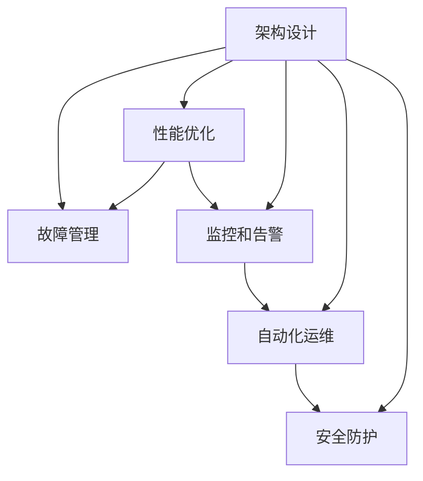

                 

## 1. 背景介绍

### 1.1 问题由来

随着互联网业务的蓬勃发展，站点系统日趋复杂化，面临的可靠性挑战也越发严峻。从Web服务、云存储到移动应用，站点系统承载了数以亿计的用户请求，对系统的稳定性和可用性提出了极高的要求。如何构建可靠、高效、可扩展的站点系统，是每一位开发者和系统架构师都必须面对的重要课题。

站点可靠性工程，即通过对系统的架构设计、实现和运维进行全面优化，实现系统稳定运行、高效处理、及时反馈和快速恢复，成为保障站点服务质量的关键。本文将围绕站点可靠性工程的核心概念、关键技术、最佳实践和未来发展趋势展开探讨。

### 1.2 问题核心关键点

站点可靠性工程的核心在于构建一个能够自适应、自修复、自优化的稳定系统。其关键点包括以下几个方面：

- **架构设计**：确定合理的系统架构，划分组件和服务，确保系统可扩展、可维护。
- **故障管理**：建立健全的故障检测、定位和恢复机制，及时处理系统故障。
- **性能优化**：通过负载均衡、缓存、异步处理等手段提升系统响应速度和吞吐量。
- **监控和告警**：构建完善的监控和告警系统，实时监测系统状态，及时发现和响应异常。
- **自动化运维**：实现自动化部署、升级和回滚，减少人为干预，提升运维效率。
- **安全防护**：设计多重安全机制，保障系统安全稳定，防止外部攻击和内部滥用。

本文将从这些关键点出发，详细解析站点可靠性工程的方法和实践。

## 2. 核心概念与联系

### 2.1 核心概念概述

站点可靠性工程涉及诸多概念，以下是几个核心概念及其相互联系的概述：

- **架构设计**：站点系统的整体结构设计，包括服务分层、组件划分、数据存储等。
- **故障管理**：对系统故障进行检测、定位、恢复的机制和工具。
- **性能优化**：通过优化算法和配置，提升系统的响应速度和吞吐量。
- **监控和告警**：系统状态的实时监控和异常预警系统。
- **自动化运维**：自动化部署、升级和回滚等运维流程，提升运维效率和准确性。
- **安全防护**：防止系统攻击和滥用，保障系统安全稳定。

这些概念之间的关系可以通过以下Mermaid流程图来展示：



这个流程图展示了各个概念之间的联系：架构设计是基础，性能优化和监控告警作为支撑，自动化运维和故障管理确保系统稳定运行，安全防护则保障系统的安全。这些概念相辅相成，共同构成了站点可靠性工程的实践框架。

## 3. 核心算法原理 & 具体操作步骤

### 3.1 算法原理概述

站点可靠性工程的算法原理，可以概括为以下几个核心步骤：

1. **架构设计**：构建合理的微服务架构，分离功能组件和服务，确保系统可扩展性和高可用性。
2. **故障管理**：通过心跳检测、日志记录等手段实现故障检测和定位，采用容错机制和自动恢复策略保障系统可靠性。
3. **性能优化**：通过负载均衡、缓存、异步处理等手段，提升系统的响应速度和吞吐量。
4. **监控和告警**：实时监测系统状态，通过告警系统及时发现和响应异常情况。
5. **自动化运维**：实现自动化部署、升级和回滚，提高运维效率和减少人为错误。
6. **安全防护**：采用多层次的安全措施，防止系统攻击和滥用，保障系统安全。

### 3.2 算法步骤详解

以下是详细的算法步骤：

#### 3.2.1 架构设计

1. **服务分层**：将系统功能分为服务层、业务层、数据层等，不同层之间通过接口通信。
2. **组件划分**：将服务进一步细分为微服务，每个微服务独立部署，降低系统耦合度。
3. **数据存储**：设计合理的数据库架构，确保数据一致性和可靠性。

#### 3.2.2 故障管理

1. **心跳检测**：通过定期的心跳信息，检测服务状态，及时发现异常。
2. **日志记录**：记录系统日志，便于故障分析和问题定位。
3. **容错机制**：设计熔断器、重试机制等容错策略，防止服务过载和故障扩散。
4. **自动恢复**：实现服务自动重启、负载均衡和故障切换，保障系统稳定运行。

#### 3.2.3 性能优化

1. **负载均衡**：通过负载均衡器将请求分配到多个节点上，提升系统的吞吐量。
2. **缓存技术**：利用缓存技术，减少数据库访问次数，提升响应速度。
3. **异步处理**：通过异步任务队列等手段，处理耗时操作，减少系统延迟。

#### 3.2.4 监控和告警

1. **实时监控**：通过监控工具采集系统指标，如CPU、内存、网络等。
2. **告警系统**：根据预设的告警阈值，当指标异常时，自动触发告警。
3. **告警分类**：根据告警的紧急程度，设置不同等级的告警通知方式。

#### 3.2.5 自动化运维

1. **自动化部署**：编写自动化脚本，实现服务的快速部署和回滚。
2. **配置管理**：使用配置管理工具，统一管理系统配置项，确保配置一致性。
3. **环境管理**：通过容器化技术，实现快速搭建和扩展环境。

#### 3.2.6 安全防护

1. **网络安全**：部署防火墙、入侵检测等网络安全措施。
2. **数据安全**：采用数据加密、访问控制等手段，保障数据安全。
3. **身份认证**：实现用户身份认证和权限控制，防止非法访问。

### 3.3 算法优缺点

站点可靠性工程在提升系统稳定性和可扩展性方面具有显著优势，但也存在一些局限性：

#### 3.3.1 优点

1. **系统可扩展**：架构设计合理，系统易于扩展和升级。
2. **故障恢复快**：故障管理机制完备，系统能快速恢复。
3. **性能优化**：通过负载均衡和缓存等手段，提升系统响应速度。
4. **自动化运维**：减少人工干预，提高运维效率。
5. **安全保障**：多层次的安全防护措施，保障系统安全。

#### 3.3.2 缺点

1. **复杂度高**：架构设计和实现较为复杂，需要较高的技术水平。
2. **初期成本高**：实施站点可靠性工程需要较高的初期投资。
3. **维护难度大**：系统复杂性增加，维护难度和复杂度也随之上升。
4. **资源消耗高**：部分优化手段如负载均衡、缓存等，可能增加系统资源消耗。

### 3.4 算法应用领域

站点可靠性工程在各个领域都有广泛应用，例如：

- **Web服务**：通过构建微服务架构、实现自动恢复和监控告警，保障服务稳定运行。
- **云存储**：通过多节点冗余、数据备份等手段，提升存储系统的可靠性。
- **移动应用**：通过异步处理和缓存技术，提升应用的响应速度和用户体验。
- **物联网**：通过数据流控制和异常检测，保障物联网设备的稳定连接和数据传输。
- **大数据平台**：通过数据分区和故障转移，提升大数据处理的可靠性和效率。

以上只是几个典型应用场景，实际上，站点可靠性工程可以应用于各种规模和类型的系统。

## 4. 数学模型和公式 & 详细讲解 & 举例说明

### 4.1 数学模型构建

假设有一个分布式系统，包含n个节点，每个节点处理请求的响应时间为t。系统的平均响应时间为T。

设每个节点的响应时间为独立同分布的随机变量X，其分布为F(x)。系统的平均响应时间T可以表示为：

$$
T = \frac{1}{n}\sum_{i=1}^{n} \mathbb{E}[X]
$$

系统的平均响应时间与节点数和节点响应时间有关。

### 4.2 公式推导过程

设每个节点的响应时间为t，系统总处理时间为T，则：

$$
T = \frac{1}{n} \sum_{i=1}^{n} t_i
$$

其中t_i为第i个节点的响应时间，t_i = X_i + E_i。X_i为节点处理请求的实际时间，E_i为网络延迟等额外时间。

通过期望公式，有：

$$
\mathbb{E}[T] = \frac{1}{n} \sum_{i=1}^{n} \mathbb{E}[X_i + E_i] = \frac{1}{n} \sum_{i=1}^{n} (\mathbb{E}[X_i] + \mathbb{E}[E_i])
$$

令 \mathbb{E}[X_i] = \mu，\mathbb{E}[E_i] = \varepsilon，则：

$$
\mathbb{E}[T] = \frac{1}{n} \sum_{i=1}^{n} (\mu + \varepsilon)
$$

系统总处理时间与单个节点处理时间和网络延迟有关。

### 4.3 案例分析与讲解

假设有一个包含5个节点的系统，每个节点处理请求的平均响应时间为10ms，网络延迟的平均时间为5ms。系统总处理时间T可以计算为：

$$
T = \frac{1}{5} \times (10 + 5) = 3ms
$$

通过优化节点响应时间和网络延迟，可以进一步提升系统的平均响应时间。

## 5. 项目实践：代码实例和详细解释说明

### 5.1 开发环境搭建

1. **安装依赖**：安装Java、Maven、Kubernetes等工具和库。

2. **配置环境**：设置JDK路径、Maven配置文件等环境变量。

3. **搭建集群**：使用Kubernetes搭建多节点集群，配置服务发现、负载均衡、监控告警等。

### 5.2 源代码详细实现

以下是一个简单的Spring Boot应用的代码实现：

```java
@SpringBootApplication
public class Application {
    public static void main(String[] args) {
        SpringApplication.run(Application.class, args);
    }
}
```

### 5.3 代码解读与分析

该代码实现了Spring Boot应用的启动。Spring Boot提供了自动配置和依赖注入等功能，简化了应用开发。

### 5.4 运行结果展示

运行应用后，可以通过Spring Boot的Actuator接口进行监控和调试。例如，访问http://localhost:8080/actuator/health，获取系统的健康状态。

## 6. 实际应用场景

### 6.1 Web服务

Web服务是站点可靠性工程的主要应用场景之一。通过构建微服务架构，将服务分层、组件划分，实现服务的灵活部署和快速升级。

### 6.2 云存储

云存储系统需要处理海量数据的读写，通过多节点冗余、数据备份等手段，确保数据的高可用性和一致性。

### 6.3 移动应用

移动应用通过异步处理和缓存技术，提升应用的响应速度和用户体验。

### 6.4 物联网

物联网设备通过数据流控制和异常检测，保障设备稳定连接和数据传输。

### 6.5 大数据平台

大数据平台通过数据分区和故障转移，提升大数据处理的可靠性和效率。

## 7. 工具和资源推荐

### 7.1 学习资源推荐

1. **《站点可靠性工程》**：书籍介绍站点可靠性工程的原理和实践，涵盖微服务、故障管理、性能优化等多个方面。
2. **《微服务架构设计》**：讲解微服务架构的设计原则和实现方法，适合构建高可扩展、高可靠的系统。
3. **《分布式系统原理与设计》**：介绍分布式系统的基本原理和设计模式，适合理解分布式系统的核心机制。
4. **Kubernetes官方文档**：详细说明Kubernetes的安装、配置和操作，是构建大规模分布式系统的必备资源。

### 7.2 开发工具推荐

1. **Spring Boot**：轻量级的开发框架，支持快速开发和部署Web应用。
2. **Kubernetes**：开源容器编排系统，支持大规模分布式系统部署和管理。
3. **Prometheus**：开源监控系统，实时监测系统状态，支持告警和报警。
4. **Elastic Stack**：开源搜索引擎和分析工具，支持数据存储和查询。

### 7.3 相关论文推荐

1. **《站点可靠性工程：原理与实践》**：学术论文介绍了站点可靠性工程的基本概念和关键技术。
2. **《大规模分布式系统设计》**：介绍大规模分布式系统的设计原则和实现方法。
3. **《微服务架构设计模式》**：讲解微服务架构的设计模式和实现方法。

## 8. 总结：未来发展趋势与挑战

### 8.1 研究成果总结

站点可靠性工程在提升系统稳定性和可扩展性方面取得了显著成效，已成为现代IT系统建设的重要基石。其主要成果包括：

- **微服务架构**：通过微服务设计，提升系统的可扩展性和维护性。
- **故障管理**：通过完善的故障检测和恢复机制，保障系统的可靠性和鲁棒性。
- **性能优化**：通过负载均衡、缓存、异步处理等手段，提升系统性能。
- **监控和告警**：通过实时监控和告警系统，及时发现和处理系统异常。
- **自动化运维**：通过自动化部署、升级和回滚等手段，提高运维效率。
- **安全防护**：通过多层次的安全防护措施，保障系统的安全性。

### 8.2 未来发展趋势

未来站点可靠性工程将呈现以下几个发展趋势：

1. **智能运维**：通过人工智能和大数据分析技术，提升运维效率和问题处理能力。
2. **自适应系统**：通过自适应算法，动态调整系统配置，优化资源使用。
3. **全栈自动化**：实现从开发、测试到运维的全栈自动化，提升开发效率和系统稳定性。
4. **云原生架构**：采用云原生架构，实现资源的灵活部署和弹性扩展。
5. **零信任安全**：采用零信任安全模型，确保系统安全性和数据隐私。

### 8.3 面临的挑战

尽管站点可靠性工程取得了显著进展，但在发展过程中仍面临诸多挑战：

1. **复杂性增加**：随着系统规模的扩大，系统复杂性增加，维护难度上升。
2. **成本高昂**：实施站点可靠性工程需要较高的初期投资和运维成本。
3. **数据安全**：大规模数据处理带来数据安全和隐私保护的挑战。
4. **技术门槛高**：需要掌握多种技术和工具，对技术水平要求较高。
5. **性能瓶颈**：部分优化手段可能带来新的性能瓶颈，需要综合考虑。

### 8.4 研究展望

未来站点可靠性工程的研究方向包括：

1. **智能运维技术**：利用人工智能和大数据分析技术，提升运维效率和问题处理能力。
2. **自适应算法**：设计自适应算法，动态调整系统配置，优化资源使用。
3. **全栈自动化**：实现从开发、测试到运维的全栈自动化，提升开发效率和系统稳定性。
4. **云原生架构**：采用云原生架构，实现资源的灵活部署和弹性扩展。
5. **零信任安全**：采用零信任安全模型，确保系统安全性和数据隐私。

## 9. 附录：常见问题与解答

### 9.1 Q1: 什么是站点可靠性工程？

A: 站点可靠性工程是构建可靠、高效、可扩展的站点系统的一门学科。主要通过架构设计、故障管理、性能优化、监控告警、自动化运维和安全防护等手段，提升系统稳定性和可扩展性。

### 9.2 Q2: 什么是微服务架构？

A: 微服务架构是一种系统架构设计模式，将系统拆分为多个独立的、松耦合的服务，每个服务独立部署、扩展和升级。

### 9.3 Q3: 什么是故障管理？

A: 故障管理是站点可靠性工程的重要组成部分，包括故障检测、定位和恢复等手段，保障系统稳定运行。

### 9.4 Q4: 什么是性能优化？

A: 性能优化是通过负载均衡、缓存、异步处理等手段，提升系统的响应速度和吞吐量。

### 9.5 Q5: 什么是自动化运维？

A: 自动化运维是通过编写自动化脚本，实现服务的快速部署、升级和回滚，提高运维效率和减少人为错误。

---

作者：禅与计算机程序设计艺术 / Zen and the Art of Computer Programming

