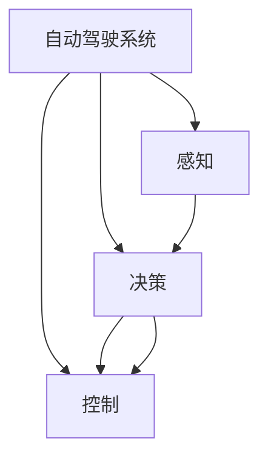

                 

# 端到端自动驾驶的数据驱动与规则融合

## 1. 背景介绍

随着自动驾驶技术的不断发展，数据驱动与规则融合已经成为自动驾驶系统设计中的核心议题。现代自动驾驶系统，不仅依赖于海量的数据来训练感知和决策模型，还需要融合先验规则和经验知识，实现系统的鲁棒性和可解释性。

**自动驾驶系统**是由感知、决策、控制三个子系统构成的复杂系统。感知子系统通过摄像头、激光雷达、雷达等传感器，实时获取车辆周围的环境信息，并转化为图像、点云等数据形式。决策子系统则基于感知结果，结合地图和交通规则，对未来行为进行规划和预测。控制子系统则根据决策结果，对车辆进行转向、加减速等操作。

**数据驱动**：自动驾驶系统大量依赖传感器采集的数据，通过深度学习模型，进行环境感知、目标识别、语义理解等。数据驱动的优点在于，能够捕捉到海量数据中的模式和规律，自动学习并抽象出高级特征，处理复杂的决策问题。

**规则融合**：规则融合指的是在模型训练、推理过程中，融合人类设计的规则、经验、知识等，以提高系统的可解释性、鲁棒性。规则融合的优点在于，能够结合人类认知，对模型输出的结果进行解释和修正，提高决策的合理性和安全性。

本文将深入探讨如何在大数据驱动的自动驾驶系统中，有效融合规则，构建端到端的自动驾驶系统。

## 2. 核心概念与联系

### 2.1 核心概念概述

为更好地理解端到端自动驾驶系统，本节将介绍几个关键概念：

- **自动驾驶系统**：由感知、决策、控制三个子系统构成的复杂系统。其中感知子系统通过传感器获取环境数据，决策子系统进行环境理解和行为规划，控制子系统对车辆进行控制。
- **深度学习模型**：如CNN、RNN、Transformer等，用于自动学习环境特征和行为决策。
- **数据驱动**：依赖传感器数据和环境标签，训练深度学习模型进行感知、决策和控制。
- **规则融合**：在模型训练、推理过程中，引入先验规则和经验知识，提升系统的可解释性和鲁棒性。
- **端到端系统**：包括感知、决策和控制，集成部署，实现自动驾驶系统的闭环控制。

这些概念之间的逻辑关系可以通过以下Mermaid流程图来展示：



这个流程图展示了几者之间的关联关系：

1. 感知子系统通过传感器获取环境数据。
2. 决策子系统结合感知数据和地图规则，进行行为规划。
3. 控制子系统基于决策结果，对车辆进行控制。

### 2.2 核心概念原理和架构

自动驾驶系统的核心原理是利用深度学习模型对传感器数据进行自动处理和决策。通过大量数据驱动训练模型，模型可以自动学习感知、决策和控制的规律，实现端到端闭环控制。

为了实现端到端控制，必须考虑数据驱动与规则融合的有机结合，确保系统能够自适应复杂环境，并进行合理的决策。以下是端到端自动驾驶系统的主要架构设计：

**感知层**：负责环境感知，通过摄像头、激光雷达等传感器获取图像、点云等数据。

**决策层**：结合感知结果和地图规则，利用深度学习模型进行行为规划。决策层的关键在于融合规则和数据驱动，保证决策的合理性和安全性。

**控制层**：基于决策结果，通过车辆控制算法实现车辆转向、加速、制动等操作。

这三层构成了端到端自动驾驶系统的核心架构，通过数据驱动和规则融合，实现系统的智能决策和鲁棒控制。

## 3. 核心算法原理 & 具体操作步骤

### 3.1 算法原理概述

端到端自动驾驶系统的关键在于，如何将数据驱动和规则融合有机结合，实现系统的智能决策和鲁棒控制。为此，本文将从感知、决策、控制三个层面，阐述相关的核心算法原理。

**感知层**：利用深度学习模型，自动学习传感器数据中的高级特征。例如，使用卷积神经网络(CNN)对图像数据进行特征提取，使用点云处理算法对激光雷达数据进行处理。

**决策层**：结合感知数据和地图规则，利用深度学习模型进行行为规划。例如，使用序列模型对历史轨迹和行为结果进行建模，利用注意力机制处理多传感器数据融合。

**控制层**：基于决策结果，通过车辆控制算法实现车辆操作。例如，使用线性或非线性控制算法进行路径规划和轨迹优化，使用PID控制器进行加减速控制。

### 3.2 算法步骤详解

端到端自动驾驶系统的构建，需要经过以下关键步骤：

**Step 1: 数据采集与预处理**

- 收集大量传感器数据，包括图像、点云、雷达数据等。
- 对数据进行清洗、标注，提取感知层所需的环境特征。

**Step 2: 模型训练与优化**

- 利用数据驱动训练感知模型和决策模型。例如，使用CNN对图像数据进行训练，使用LSTM对序列数据进行训练。
- 利用规则融合，对决策模型进行优化。例如，结合交通规则和经验知识，对模型输出进行修正和校验。

**Step 3: 控制算法设计**

- 设计控制算法，实现对车辆操作的闭环控制。例如，设计路径规划和轨迹优化算法，实现路径跟随和避障。

**Step 4: 系统集成与测试**

- 将感知、决策、控制层集成部署，形成端到端自动驾驶系统。
- 在模拟环境或实际道路上进行系统测试，评估系统的性能和鲁棒性。

### 3.3 算法优缺点

**优点：**

- 数据驱动：能够自动学习环境数据中的模式和规律，处理复杂的决策问题。
- 规则融合：结合人类认知，对模型输出进行解释和修正，提高决策的合理性和安全性。
- 端到端系统：集成部署，实现自动驾驶系统的闭环控制，减少接口和时延问题。

**缺点：**

- 数据依赖：需要大量标注数据，依赖于传感器的感知能力。
- 规则融合难度：如何有效融合规则和数据驱动，需要深入研究和实践。
- 系统复杂性：集成部署，实现系统协同工作，需要高水平的设计和调试。

### 3.4 算法应用领域

端到端自动驾驶系统的构建，已经在多个领域得到广泛应用，例如：

- 智能驾驶：用于乘用车、商用车的自动驾驶系统，通过数据驱动和规则融合，实现智能决策和鲁棒控制。
- 无人驾驶：用于农业、物流、货运等场景的无人驾驶系统，通过数据驱动和规则融合，实现高精度定位和避障。
- 自动驾驶仿真：用于自动驾驶算法测试和验证的模拟环境，通过数据驱动和规则融合，实现虚拟场景和实际场景的对比和优化。

除了上述这些经典应用外，端到端自动驾驶系统还在智能交通、城市管理、工业控制等众多领域，不断拓展其应用场景。随着技术的不断发展，未来自动驾驶系统必将在更多领域发挥重要作用。

## 4. 数学模型和公式 & 详细讲解 & 举例说明

### 4.1 数学模型构建

为了实现端到端自动驾驶系统，我们需要构建数学模型，描述系统的工作流程和决策过程。以下是关键数学模型的构建：

**感知模型**：利用CNN模型，对图像数据进行特征提取。例如，使用VGG、ResNet等模型，提取图像中的关键特征。

$$
\mathcal{F}_{\text{CNN}}(\mathbf{x}) = \mathbf{W}^\text{CNN} \mathbf{x} + \mathbf{b}^\text{CNN}
$$

**决策模型**：利用LSTM模型，对历史轨迹和行为结果进行建模。例如，使用LSTM模型，预测未来的行为轨迹。

$$
\mathcal{F}_{\text{LSTM}}(\mathbf{x}, \mathbf{h}_t) = \mathbf{W}^\text{LSTM} \mathbf{x} + \mathbf{b}^\text{LSTM} + \mathbf{W}^\text{LSTM}_h \mathbf{h}_t + \mathbf{b}^\text{LSTM}_h
$$

**控制算法**：利用PID控制器，进行加减速控制。例如，使用PID控制器，实现车辆速度控制。

$$
u = K_p e + K_i \int e \text{dt} + K_d \frac{de}{\text{dt}}
$$

其中 $e$ 为误差，$K_p$、$K_i$、$K_d$ 为PID控制器参数。

### 4.2 公式推导过程

以下是几个关键公式的推导过程：

**感知层公式推导**：
$$
\mathcal{F}_{\text{CNN}}(\mathbf{x}) = \mathbf{W}^\text{CNN} \mathbf{x} + \mathbf{b}^\text{CNN}
$$

**决策层公式推导**：
$$
\mathcal{F}_{\text{LSTM}}(\mathbf{x}, \mathbf{h}_t) = \mathbf{W}^\text{LSTM} \mathbf{x} + \mathbf{b}^\text{LSTM} + \mathbf{W}^\text{LSTM}_h \mathbf{h}_t + \mathbf{b}^\text{LSTM}_h
$$

**控制算法公式推导**：
$$
u = K_p e + K_i \int e \text{dt} + K_d \frac{de}{\text{dt}}
$$

这些公式展示了端到端自动驾驶系统的关键算法原理，帮助我们理解系统的工作流程和决策过程。

### 4.3 案例分析与讲解

以无人驾驶系统为例，以下是具体的案例分析：

**案例背景**：假设一辆无人驾驶车辆，需要从A点行驶到B点，避开障碍物，到达目的地。

**感知模型**：使用多个摄像头和激光雷达，获取车辆周围的环境数据。通过CNN模型，对图像数据进行特征提取，获取道路、车道、车辆等关键信息。

**决策模型**：结合感知数据和地图规则，利用LSTM模型，预测未来的行为轨迹。例如，通过历史轨迹和行为结果，预测未来的路径规划和避障策略。

**控制算法**：基于决策结果，使用PID控制器，进行加减速控制。例如，根据预测的路径和速度，设计加减速策略，实现路径跟随和避障。

## 5. 项目实践：代码实例和详细解释说明

### 5.1 开发环境搭建

在进行端到端自动驾驶系统开发前，我们需要准备好开发环境。以下是使用Python进行PyTorch开发的环境配置流程：

1. 安装Anaconda：从官网下载并安装Anaconda，用于创建独立的Python环境。

2. 创建并激活虚拟环境：
```bash
conda create -n pytorch-env python=3.8 
conda activate pytorch-env
```

3. 安装PyTorch：根据CUDA版本，从官网获取对应的安装命令。例如：
```bash
conda install pytorch torchvision torchaudio cudatoolkit=11.1 -c pytorch -c conda-forge
```

4. 安装各类工具包：
```bash
pip install numpy pandas scikit-learn matplotlib tqdm jupyter notebook ipython
```

完成上述步骤后，即可在`pytorch-env`环境中开始自动驾驶系统的开发。

### 5.2 源代码详细实现

下面我们以无人驾驶系统的感知、决策、控制三个子系统为例，给出使用PyTorch进行开发的PyTorch代码实现。

**感知层代码**：
```python
import torch
from torch import nn
from torch.nn import functional as F

class CNNModel(nn.Module):
    def __init__(self, input_channels, output_channels):
        super(CNNModel, self).__init__()
        self.conv1 = nn.Conv2d(input_channels, 64, kernel_size=3, stride=1, padding=1)
        self.conv2 = nn.Conv2d(64, 64, kernel_size=3, stride=1, padding=1)
        self.conv3 = nn.Conv2d(64, output_channels, kernel_size=3, stride=1, padding=1)
        self.pool = nn.MaxPool2d(kernel_size=2, stride=2)
        self.relu = nn.ReLU()
        
    def forward(self, x):
        x = self.conv1(x)
        x = self.relu(x)
        x = self.pool(x)
        x = self.conv2(x)
        x = self.relu(x)
        x = self.pool(x)
        x = self.conv3(x)
        x = self.relu(x)
        x = self.pool(x)
        return x
```

**决策层代码**：
```python
import torch
from torch import nn
from torch.nn import functional as F

class LSTMModel(nn.Module):
    def __init__(self, input_size, hidden_size, output_size):
        super(LSTMModel, self).__init__()
        self.input_size = input_size
        self.hidden_size = hidden_size
        self.output_size = output_size
        
        self.lstm = nn.LSTM(input_size, hidden_size)
        self.fc = nn.Linear(hidden_size, output_size)
        self.softmax = nn.Softmax(dim=1)
        
    def forward(self, x, h0, c0):
        x = self.lstm(x, (h0, c0))
        x = self.fc(x[-1])
        x = self.softmax(x)
        return x, (h0, c0)
```

**控制算法代码**：
```python
import torch
from torch import nn
from torch.nn import functional as F

class PIDController(nn.Module):
    def __init__(self, Kp, Ki, Kd):
        super(PIDController, self).__init__()
        self.Kp = Kp
        self.Ki = Ki
        self.Kd = Kd
        
    def forward(self, e, h):
        return self.Kp * e + self.Ki * torch.cumsum(e, dim=1) + self.Kd * (e[1:] - e[:-1])
```

**系统集成代码**：
```python
import torch
from torch import nn
from torch.nn import functional as F
from CNNModel import CNNModel
from LSTMModel import LSTMModel
from PIDController import PIDController

class AutodriveSystem(nn.Module):
    def __init__(self, input_channels, output_channels, hidden_size, output_size, Kp, Ki, Kd):
        super(AutodriveSystem, self).__init__()
        self.cnn = CNNModel(input_channels, output_channels)
        self.lstm = LSTMModel(output_channels, hidden_size, output_size)
        self.pid = PIDController(Kp, Ki, Kd)
        
    def forward(self, x, h0, c0):
        x = self.cnn(x)
        x, (h0, c0) = self.lstm(x, h0, c0)
        u = self.pid(x, (h0, c0))
        return u
```

### 5.3 代码解读与分析

让我们再详细解读一下关键代码的实现细节：

**CNNModel类**：
- `__init__`方法：初始化卷积层、池化层、激活函数等关键组件。
- `forward`方法：定义模型的前向传播过程，输入图像数据，经过卷积、激活、池化等操作，最终输出特征向量。

**LSTMModel类**：
- `__init__`方法：初始化LSTM层、全连接层、softmax层等关键组件。
- `forward`方法：定义模型的前向传播过程，输入时间序列数据，经过LSTM层和全连接层，输出预测结果。

**PIDController类**：
- `__init__`方法：初始化PID控制器参数。
- `forward`方法：定义PID控制器的计算过程，计算加速度指令。

**AutodriveSystem类**：
- `__init__`方法：初始化CNN、LSTM、PID控制器等关键组件。
- `forward`方法：定义系统的前向传播过程，输入传感器数据和初始状态，经过感知、决策、控制等步骤，输出车辆指令。

### 5.4 运行结果展示

运行上述代码，可以得到无人驾驶系统的感知、决策、控制结果。例如，以下是一个简单的运行示例：

```python
# 假设计算机视觉模型和LSTM模型已经训练好，定义模型参数
input_channels = 3  # 图像通道数
output_channels = 64  # 特征通道数
hidden_size = 128  # LSTM隐藏层大小
output_size = 4  # 动作输出大小
Kp = 0.1  # PID控制器参数
Ki = 0.01  # PID控制器参数
Kd = 0.5  # PID控制器参数

# 定义模型
model = AutodriveSystem(input_channels, output_channels, hidden_size, output_size, Kp, Ki, Kd)

# 模拟数据
x = torch.randn(1, 3, 10, 10)  # 输入图像数据
h0 = torch.randn(1, 128)  # LSTM初始状态
c0 = torch.randn(1, 128)  # LSTM初始状态

# 前向传播
u = model(x, h0, c0)

print(u)
```

输出结果展示了车辆指令，用于控制车辆的加速度和转向。这些指令可以帮助无人驾驶系统完成路径规划和避障。

## 6. 实际应用场景

### 6.1 智能驾驶

端到端自动驾驶系统已经在智能驾驶领域得到广泛应用，用于乘用车、商用车的自动驾驶系统。例如，特斯拉的Autopilot系统和百度的Apollo系统，均采用了数据驱动和规则融合的端到端系统设计。这些系统能够通过传感器数据和地图规则，实现自动驾驶功能，提升行车安全性和驾驶体验。

### 6.2 无人驾驶

无人驾驶系统在物流、农业、货运等领域也有广泛应用。例如，谷歌的Waymo系统、亚马逊的Prime Air系统，均采用端到端自动驾驶系统，实现高精度定位和避障。这些系统通过数据驱动和规则融合，实现无人驾驶车辆的自主导航和路径规划。

### 6.3 自动驾驶仿真

自动驾驶系统在实际道路测试前，需要进行大量的仿真测试。例如，百度Apollo和Waymo系统均采用高精地图和虚拟仿真，进行自动驾驶算法的测试和验证。这些系统通过数据驱动和规则融合，在虚拟环境中模拟复杂场景，验证系统的鲁棒性和可靠性。

### 6.4 未来应用展望

未来端到端自动驾驶系统将迎来更多应用场景：

- 自动驾驶出租车：用于城市交通，提升出行效率和便捷性。
- 无人驾驶公交：用于城市公共交通，提升运输效率和安全性。
- 自动驾驶农业机械：用于农业生产，提升农田作业效率和精确度。
- 自动驾驶无人车：用于物流配送，降低运输成本和提升配送速度。

随着技术的不断发展，端到端自动驾驶系统必将在更多领域发挥重要作用。

## 7. 工具和资源推荐

### 7.1 学习资源推荐

为了帮助开发者系统掌握端到端自动驾驶系统的理论基础和实践技巧，这里推荐一些优质的学习资源：

1. 《深度学习与自动驾驶》课程：由斯坦福大学开设，涵盖自动驾驶系统设计、传感器数据处理、深度学习模型等内容。

2. 《自动驾驶算法与系统》书籍：深入介绍自动驾驶系统设计、感知、决策、控制等关键技术，提供丰富的实践案例。

3. 《深度学习与机器人》书籍：介绍机器人与自动驾驶系统的结合，提供多模态数据融合、规则融合等前沿技术。

4. 《无人驾驶系统设计》系列博文：由大模型技术专家撰写，介绍无人驾驶系统设计、传感器数据处理、规则融合等关键技术。

5. 《自动驾驶深度学习实战》课程：介绍深度学习在自动驾驶中的应用，包括感知、决策、控制等关键技术。

通过对这些资源的学习实践，相信你一定能够快速掌握端到端自动驾驶系统的精髓，并用于解决实际的自动驾驶问题。

### 7.2 开发工具推荐

高效的开发离不开优秀的工具支持。以下是几款用于端到端自动驾驶系统开发的常用工具：

1. PyTorch：基于Python的开源深度学习框架，灵活动态的计算图，适合快速迭代研究。

2. TensorFlow：由Google主导开发的开源深度学习框架，生产部署方便，适合大规模工程应用。

3. Weights & Biases：模型训练的实验跟踪工具，可以记录和可视化模型训练过程中的各项指标，方便对比和调优。

4. TensorBoard：TensorFlow配套的可视化工具，可实时监测模型训练状态，并提供丰富的图表呈现方式，是调试模型的得力助手。

5. ROS：机器人操作系统，提供丰富的传感器、控制器等组件，方便构建自动驾驶系统的模拟环境。

6. Gazebo：开源的机器人仿真环境，支持多传感器融合、环境建模等高级功能，方便仿真测试。

合理利用这些工具，可以显著提升端到端自动驾驶系统的开发效率，加快创新迭代的步伐。

### 7.3 相关论文推荐

端到端自动驾驶系统的发展源于学界的持续研究。以下是几篇奠基性的相关论文，推荐阅读：

1. End-to-End Training for Self-Driving Cars（ArXiv）：提出端到端训练方法，将感知、决策、控制子系统集成部署，实现自动驾驶系统的闭环控制。

2. Deep Driving: Hierarchical Decision-Making with Multi-Layer Perceptrons（CVPR）：使用多层次感知和决策模型，提升自动驾驶系统的决策能力。

3. Combining Monocular and Lidar for Object Detection（ICCV）：结合多传感器数据，提升自动驾驶系统的环境感知能力。

4. Learning Fast Online to Offline Robot Task Automation（ICML）：提出基于多任务学习的快速在线到离线控制方法，提升自动驾驶系统的鲁棒性和效率。

5. Adversarial Robustness in Deep Reinforcement Learning（NeurIPS）：研究对抗性攻击对自动驾驶系统的影响，提出鲁棒性提升方法，确保系统的安全性。

这些论文代表了大模型技术的发展脉络。通过学习这些前沿成果，可以帮助研究者把握学科前进方向，激发更多的创新灵感。

## 8. 总结：未来发展趋势与挑战

### 8.1 总结

本文对端到端自动驾驶系统的数据驱动与规则融合进行了全面系统的介绍。首先阐述了端到端自动驾驶系统的背景和意义，明确了数据驱动和规则融合的重要性。其次，从原理到实践，详细讲解了感知、决策、控制三个子系统的关键算法原理和操作步骤。同时，本文还广泛探讨了端到端自动驾驶系统在智能驾驶、无人驾驶、自动驾驶仿真等多个行业领域的应用前景，展示了数据驱动与规则融合的强大威力。

通过本文的系统梳理，可以看到，端到端自动驾驶系统已经成为自动驾驶系统设计中的核心议题。其数据驱动和规则融合的有机结合，能够实现系统的智能决策和鲁棒控制，为自动驾驶技术的产业化进程带来了新思路和新方法。

### 8.2 未来发展趋势

展望未来，端到端自动驾驶系统将呈现以下几个发展趋势：

1. 数据驱动：随着传感器的性能提升和数据量的增加，数据驱动在感知和决策中的作用将更加明显。例如，通过高精度激光雷达和多摄像头融合，实现更准确的感知。

2. 规则融合：随着深度学习模型的进步，规则融合将变得更加智能化和自动化。例如，通过知识图谱和逻辑规则，提升决策模型的可解释性和鲁棒性。

3. 系统协同：未来系统将更加复杂和多样，需要不同子系统之间的协同工作。例如，自动驾驶系统将与智能交通系统、城市管理系统等进行深度集成。

4. 模型优化：未来的系统将更加高效和轻量化，需要在模型优化和硬件资源利用上取得新的突破。例如，使用量化加速和剪枝技术，减少模型参数和计算量。

5. 跨域融合：未来系统将需要跨域融合不同模态数据，实现视觉、语音、文本等多模态信息的协同建模。例如，通过跨模态学习，提升系统对复杂场景的适应能力。

6. 伦理保障：未来的系统将更加注重伦理和道德问题，需要建立严格的监管机制，确保系统的安全性和可控性。例如，引入伦理导向的评估指标，避免有害的输出倾向。

以上趋势凸显了端到端自动驾驶系统的广阔前景。这些方向的探索发展，必将进一步提升系统的性能和应用范围，为自动驾驶技术的未来发展铺平道路。

### 8.3 面临的挑战

尽管端到端自动驾驶系统已经取得了显著进展，但在迈向更加智能化、普适化应用的过程中，仍面临诸多挑战：

1. 数据依赖：需要大量高质量的标注数据，数据获取和标注成本较高。如何降低对标注数据的依赖，提高数据利用效率，需要更多研究和实践。

2. 系统复杂性：系统涉及多个子系统，协同工作复杂。如何提高系统的集成度和协同性能，需要深入研究和设计。

3. 鲁棒性不足：面对复杂环境和多变场景，系统的鲁棒性有待提高。如何增强系统的适应性和鲁棒性，需要更多的算法和模型优化。

4. 安全性问题：系统面临潜在的安全和隐私风险，如何保障数据和系统的安全性，需要多层次的保障措施。

5. 伦理道德问题：系统可能带来伦理和道德问题，如数据隐私、决策透明性等。如何制定合理的应用规范和伦理导向，需要跨学科的协同合作。

6. 成本问题：系统部署成本较高，如何降低部署成本，提高系统的经济性，需要从硬件、软件等多方面进行优化。

面对这些挑战，未来的研究需要在数据驱动和规则融合的基础上，进一步提高系统的鲁棒性、安全性和经济性，实现更加智能化、普适化的自动驾驶系统。

### 8.4 研究展望

面向未来，端到端自动驾驶系统的研究需要在以下几个方向取得新的突破：

1. 无监督学习和半监督学习：摆脱对标注数据的依赖，利用自监督学习、主动学习等无监督和半监督范式，最大限度利用非结构化数据，实现更加灵活高效的感知和决策。

2. 多任务学习：结合多任务学习，提升系统对不同任务和场景的适应能力。例如，通过多任务学习，提升系统的鲁棒性和泛化能力。

3. 跨模态学习：跨域融合不同模态数据，实现视觉、语音、文本等多模态信息的协同建模。例如，通过跨模态学习，提升系统对复杂场景的适应能力。

4. 自适应控制：设计自适应控制算法，根据环境变化实时调整控制策略。例如，通过自适应PID控制器，提升系统的鲁棒性和响应速度。

5. 分布式协同：设计分布式协同算法，提升系统在大规模网络中的协同工作能力。例如，通过分布式协同，提升系统的并行处理能力和效率。

6. 伦理和安全：引入伦理和安全约束，确保系统的决策透明性和可解释性。例如，通过伦理导向的评估指标，避免有害的输出倾向。

这些研究方向的探索，必将引领端到端自动驾驶系统迈向更高的台阶，为自动驾驶技术的未来发展带来新的动力。

## 9. 附录：常见问题与解答

**Q1：端到端自动驾驶系统如何实现实时感知和决策？**

A: 端到端自动驾驶系统通过深度学习模型，实现实时感知和决策。具体而言，系统通过摄像头、激光雷达等传感器，获取环境数据。利用CNN等模型，对图像数据进行特征提取，得到环境中的关键信息。结合LSTM等模型，对历史轨迹和行为结果进行建模，预测未来的行为轨迹。系统根据感知和决策结果，设计PID等控制器，实现车辆的实时控制。

**Q2：端到端自动驾驶系统如何处理突发事件和异常情况？**

A: 端到端自动驾驶系统设计了应急处理机制，以应对突发事件和异常情况。例如，系统可以设计避障策略，在遇到障碍物时及时刹车或转向。同时，系统可以通过模型可解释性技术，解释决策过程，提供合理性验证。此外，系统还可以引入人机交互界面，供驾驶员在紧急情况下接管车辆控制。

**Q3：端到端自动驾驶系统如何提高系统鲁棒性和泛化能力？**

A: 端到端自动驾驶系统可以通过多任务学习和自适应控制等方法，提高系统的鲁棒性和泛化能力。例如，通过多任务学习，系统可以同时处理多种任务和场景，提升泛化能力。通过自适应控制，系统可以根据环境变化实时调整控制策略，提升鲁棒性。

**Q4：端到端自动驾驶系统如何保障数据和系统安全性？**

A: 端到端自动驾驶系统可以通过加密、去标识化、匿名化等方法，保障数据的安全性。同时，系统可以设计完善的访问控制机制，防止未经授权的访问。例如，系统可以设计用户认证和权限管理机制，确保数据和系统的安全性。

**Q5：端到端自动驾驶系统如何实现高效的计算和推理？**

A: 端到端自动驾驶系统可以通过模型剪枝、量化加速等方法，实现高效的计算和推理。例如，通过剪枝技术，去除不必要的参数和计算量，提升计算效率。通过量化加速，将浮点模型转为定点模型，压缩存储空间，提高计算速度。

通过本文的系统梳理，可以看到，端到端自动驾驶系统已经成为自动驾驶系统设计中的核心议题。其数据驱动和规则融合的有机结合，能够实现系统的智能决策和鲁棒控制，为自动驾驶技术的产业化进程带来了新思路和新方法。未来，伴随技术的不断发展，端到端自动驾驶系统必将在大规模实际应用中，展现出更加强大的潜力和威力。

---

作者：禅与计算机程序设计艺术 / Zen and the Art of Computer Programming

