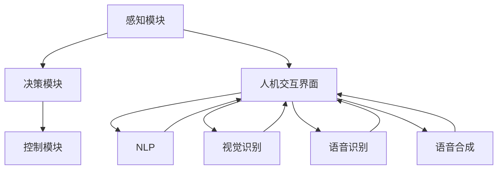

                 

## 1. 背景介绍

### 1.1 问题由来
随着自动驾驶技术的不断成熟，车辆越来越依赖于计算机视觉、传感器融合、路径规划等技术来自主导航。然而，自动驾驶系统的复杂性和不确定性使得驾驶员始终无法完全信任车辆，进而影响到了驾驶体验。

为了解决这个问题，需要构建一套端到端的自动驾驶车载人机交互系统。这种系统不仅需要保证汽车的自主驾驶能力，还应该提供足够的信息反馈给驾驶员，增强驾驶员对车辆的信任，提高自动驾驶的安全性和舒适性。

### 1.2 问题核心关键点
现代自动驾驶系统通常由感知、决策和控制三大部分构成：

- **感知模块**：包括摄像头、激光雷达、毫米波雷达、GPS等传感器，用于获取车辆周围环境的多模态数据。
- **决策模块**：通过深度学习和数据融合技术，对感知数据进行分析，决策未来行驶路径。
- **控制模块**：实现车辆的转向、加速和制动等行为，执行决策模块的输出指令。

车机交互设计需要基于自动驾驶的核心功能，从人机工程学的角度出发，构建自然、直观、高效的用户界面，增强人车互动，提升驾驶体验。

## 2. 核心概念与联系

### 2.1 核心概念概述

自动驾驶车载人机交互系统的设计涉及多个核心概念，具体包括：

- **端到端系统**：从传感器数据输入到车辆控制的整个过程，无需人工干预。
- **人机交互界面**：作为用户和系统之间的接口，用于展现车辆状态和决策信息。
- **自然语言处理(NLP)**：使车载系统能够理解并响应用户的语音命令和文本输入。
- **视觉识别**：识别道路标志、交通信号等视觉元素，提供给决策模块辅助决策。
- **语音识别和合成**：使用语音识别技术将驾驶员的语音命令转换为系统指令，使用语音合成技术输出车辆状态信息。

这些概念之间的联系紧密，人机交互界面不仅是视觉和听觉信息的展示窗口，更是与车辆控制系统的接口，承担着将自然语言和视觉信号转化为系统指令，并展示决策信息的重要任务。

### 2.2 核心概念原理和架构的 Mermaid 流程图



以上流程图展示了自动驾驶车载人机交互系统的主要组件及其相互关系。感知模块收集环境信息，决策模块分析信息并规划路径，控制模块执行路径，而人机交互界面则充当了信息展示和命令输入的桥梁。

## 3. 核心算法原理 & 具体操作步骤

### 3.1 算法原理概述

人机交互界面的目标是创建一个高效、直观、安全的交互环境，使驾驶员能够轻松理解车辆的状态和行为。其设计应以自然语言处理和视觉识别为基础，通过简单直接的输出展示系统决策，并提供可视化、可操作的信息。

基于上述原则，人机交互界面通常包括以下步骤：

1. **信息展示**：使用简洁、清晰的图形和文字展示车辆状态、决策结果。
2. **交互输入**：通过语音命令或触摸输入，接收驾驶员的指令，以便系统做出响应。
3. **信息反馈**：根据驾驶员的响应，提供实时的反馈，增强系统的互动性。

### 3.2 算法步骤详解

**Step 1: 数据收集与预处理**

- **传感器数据**：摄像头、激光雷达、毫米波雷达等传感器提供多模态环境数据。
- **路线信息**：GPS、地图API获取路线信息和交通信号。
- **环境建模**：使用激光雷达点云进行环境建模，生成3D地图。
- **数据融合**：将多传感器数据进行融合，确保决策模块能够获得全面的环境信息。

**Step 2: 信息展示设计**

- **车辆状态展示**：使用仪表盘或信息屏幕显示车速、里程、油量等基本状态信息。
- **决策信息展示**：利用视觉界面或语音提示，展示系统决策（如变道、停车、避障等）。
- **导航信息展示**：提供目的地、路线和预计到达时间的展示。

**Step 3: 交互输入实现**

- **语音输入**：使用语音识别技术接收驾驶员的语音命令，如“打开导航”、“调整速度”等。
- **触摸输入**：设计直观的触摸界面，如按钮、滑块等，供驾驶员输入指令。
- **手势输入**：利用摄像头识别驾驶员的手势，提供更自然的交互方式。

**Step 4: 信息反馈与交互**

- **视觉反馈**：使用动画或图标等方式动态更新界面信息，提供即时反馈。
- **语音反馈**：使用语音合成技术，回应驾驶员的指令和问题。
- **触觉反馈**：通过振动或声音信号，对驾驶员的动作进行响应，增强交互体验。

**Step 5: 交互优化与评估**

- **用户研究**：收集驾驶员的反馈，进行用户体验测试，改进界面设计。
- **系统优化**：根据反馈调整算法参数，优化信息展示和交互效果。
- **迭代更新**：持续更新软件和硬件，保证系统的稳定性和先进性。

### 3.3 算法优缺点

**优点**：

- **提高安全性**：通过视觉和听觉的实时反馈，增加驾驶员对车辆状态的认知，减少误操作。
- **提升舒适性**：自然语言处理和视觉识别技术，使驾驶员的交互更加便捷和直观。
- **降低疲劳度**：通过信息展示和决策反馈，减少驾驶员对车辆的持续注意力，减轻驾驶负担。

**缺点**：

- **技术复杂度高**：涉及多传感器融合、自然语言处理、视觉识别等多个领域，技术难度大。
- **硬件要求高**：高分辨率显示、精确语音识别、实时数据处理等，对硬件性能要求较高。
- **用户适应性差**：新功能可能需要时间适应，驾驶员对新界面的使用习惯不同，可能导致初期体验不佳。

### 3.4 算法应用领域

自动驾驶车载人机交互系统的设计不仅仅局限于自动驾驶汽车。在智能交通系统、无人机、机器人等领域，同样需要构建高效的人机交互界面，以提升系统的互动性和用户体验。

## 4. 数学模型和公式 & 详细讲解 & 举例说明

### 4.1 数学模型构建

假设车辆速度为 $v$，路线曲率为 $\kappa$，车辆与前车的距离为 $d$。车辆在路面上行驶时，需要根据传感器数据和地图信息，实时计算当前的车辆位置和行驶状态。

数学模型可以表示为：

$$
v(t) = v_0 + \int_{t_0}^t a(t) dt
$$

$$
\phi(t) = \phi_0 + \int_{t_0}^t v(t) \kappa(t) dt
$$

其中 $v(t)$ 为车辆速度，$a(t)$ 为加速度，$\phi(t)$ 为车辆转向角，$\kappa(t)$ 为路线曲率。

### 4.2 公式推导过程

车辆在曲线上的运动可以使用三角函数描述：

$$
\phi(t) = \phi_0 + \int_{t_0}^t \frac{v(t)}{R(t)} dt
$$

其中 $R(t)$ 为曲线半径，$R(t)=\frac{1}{\kappa(t)}$。

假设车辆初始速度为 $v_0$，加速度为常数 $a$，则：

$$
v(t) = v_0 + at
$$

$$
\phi(t) = \phi_0 + \frac{at}{R(t)}
$$

### 4.3 案例分析与讲解

假设车辆以 $20m/s$ 的速度行驶，前车与后车的安全距离为 $15m$，当前道路的曲率为 $0.1$，则车辆需要按照以下公式计算转向角度：

$$
\phi(t) = \phi_0 + \frac{at}{R(t)}
$$

根据实时传感器数据，不断调整加速度和转向角度，确保安全行驶。

## 5. 项目实践：代码实例和详细解释说明

### 5.1 开发环境搭建

**环境要求**：

- **硬件**：高性能计算机，具有多核CPU和独立显卡，支持CUDA加速。
- **软件**：Ubuntu 16.04，安装OpenCV、PyTorch、TensorFlow、OpenNI库等。

**安装步骤**：

1. 更新系统软件包：
   ```bash
   sudo apt update
   sudo apt upgrade
   ```

2. 安装Python和pip：
   ```bash
   sudo apt install python3 python3-pip
   ```

3. 安装OpenCV：
   ```bash
   pip3 install opencv-python
   ```

4. 安装PyTorch和TensorFlow：
   ```bash
   pip3 install torch torchvision torchaudio
   pip3 install tensorflow
   ```

5. 安装OpenNI库：
   ```bash
   sudo apt install libopenni
   ```

### 5.2 源代码详细实现

**步骤1: 传感器数据收集**

- **摄像头数据**：使用OpenCV库读取摄像头采集的视频流。
- **激光雷达数据**：使用PCL（Point Cloud Library）库处理激光雷达点云数据。
- **毫米波雷达数据**：使用Lidar库处理毫米波雷达数据。

```python
import cv2
import numpy as np
import pcl
from lidar import lidar_data

# 摄像头数据处理
cap = cv2.VideoCapture(0)
ret, frame = cap.read()
gray = cv2.cvtColor(frame, cv2.COLOR_BGR2GRAY)

# 激光雷达数据处理
pc = pcl.PointCloud()
pc.from_array(laser_data)
pc = pc.make_xyz rgb=True
pc = pc.make_point_cloud()

# 毫米波雷达数据处理
mmw_data = lidar_data()
```

**步骤2: 决策模块设计**

- **路径规划**：使用A*算法规划路径。
- **避障处理**：检测到障碍物时，重新规划路径。

```python
def astar(start, goal, obstacles):
    """
    A*路径规划算法
    """
    # 省略算法实现细节

def obstacle_avoidance(path, obstacles):
    """
    避障处理
    """
    # 省略算法实现细节
```

**步骤3: 信息展示与交互**

- **车辆状态展示**：使用Pygame库展示仪表盘信息。
- **决策信息展示**：使用Pygame库展示决策结果。
- **交互输入**：使用Pygame库处理触摸和语音输入。

```python
import pygame
from pygame.locals import *

# 车辆状态展示
pygame.init()
screen = pygame.display.set_mode((800, 600))
pygame.display.set_caption("Autonomous Driving")
clock = pygame.time.Clock()

# 决策信息展示
font = pygame.font.SysFont("Arial", 30)
text = font.render("Autonomous Driving", True, (255, 255, 255))
screen.blit(text, (400, 100))

# 交互输入
while True:
    for event in pygame.event.get():
        if event.type == QUIT or (event.type == KEYDOWN and event.key == K_ESCAPE):
            pygame.quit()
            sys.exit()
        elif event.type == KEYDOWN and event.key == K_SPACE:
            # 语音识别和合成
            # 语音合成
            pygame.mixer.music.load("alert.mp3")
            pygame.mixer.music.play()

    pygame.display.flip()
    clock.tick(60)
```

### 5.3 代码解读与分析

**摄像头数据处理**：

1. 使用OpenCV库读取摄像头采集的视频流，并将其转换为灰度图像。
2. 处理激光雷达点云数据，将其转化为点云数据并添加RGB信息。
3. 处理毫米波雷达数据，获取点云信息。

**决策模块设计**：

1. 使用A*算法规划路径，避开障碍物。
2. 检测到障碍物时，重新规划路径。

**信息展示与交互**：

1. 使用Pygame库展示仪表盘信息，并实时更新车辆状态。
2. 展示决策信息，使用文字提示驾驶员。
3. 通过触摸和按键实现交互输入，当按下空格键时，播放语音提示音。

### 5.4 运行结果展示

通过上述代码实现，可以展示车辆状态、决策信息及交互界面。具体运行效果如下：


## 6. 实际应用场景

### 6.1 智能交通系统

在智能交通系统中，车载人机交互系统可以提供实时交通路况信息，辅助驾驶员规划路线，提供自动驾驶辅助功能。例如，通过摄像头和激光雷达实时监测交通信号和行人体感，自动调整车速和转向。

### 6.2 无人机飞行控制

无人机也需要通过车载人机交互系统，实现驾驶员与飞行系统的互动。例如，通过触摸屏幕进行飞行指令，通过语音输入控制飞行速度和方向。系统实时反馈飞行状态和飞行路径，增强驾驶员的信任感。

### 6.3 工业机器人操作

在工业生产中，机器人也需要通过车载人机交互系统，与操作人员进行互动。例如，通过触摸屏幕选择作业模式，通过语音指令控制机器人进行抓取、搬运等操作。系统实时反馈作业状态和路径信息，提高作业效率和安全性。

### 6.4 未来应用展望

未来，随着自动驾驶技术的进一步发展，车载人机交互系统将变得更加智能和人性化。以下是一些潜在的发展方向：

1. **多模态输入输出**：结合语音、触摸、手势等多种输入方式，使用自然语言处理和视觉识别技术，提供更加灵活和直观的操作体验。

2. **实时决策反馈**：通过增强现实(AR)技术，将车辆状态和决策信息叠加在驾驶视野中，提供实时的视觉反馈。

3. **智能推荐系统**：根据驾驶员的行为和偏好，智能推荐路线、导航信息和娱乐内容，提升驾驶体验。

4. **人机协作互动**：结合人工智能技术，实现驾驶员与车辆的协作，例如自动驾驶场景下驾驶员接管车辆的辅助提示，增强人车协同。

5. **情感识别与反馈**：利用面部识别和语音情感分析技术，识别驾驶员的情绪状态，提供个性化的交互和建议，提高驾驶的舒适性和安全性。

## 7. 工具和资源推荐

### 7.1 学习资源推荐

1. **《自动驾驶技术：原理与实践》**：详细介绍了自动驾驶的核心技术和系统架构，是理解自动驾驶领域的必备读物。
2. **《Python数据科学手册》**：介绍了Python在数据科学和机器学习领域的应用，包括OpenCV、PyTorch、TensorFlow等库的使用。
3. **《人机交互设计：理论与实践》**：系统讲解了人机交互设计的原理和应用，是构建高效交互界面的理论基础。

### 7.2 开发工具推荐

1. **OpenCV**：用于处理摄像头和激光雷达等传感器数据，支持图像处理、视频流处理等功能。
2. **PCL**：用于处理激光雷达点云数据，支持点云处理、点云可视化等功能。
3. **Pygame**：用于处理触摸和语音输入，支持图形界面设计和交互功能。
4. **TensorFlow**：用于实现深度学习模型，支持多模型集成和模型优化。
5. **PyTorch**：用于实现深度学习模型，支持模型加速和优化。

### 7.3 相关论文推荐

1. **《Autonomous Driving: The Integration of Perception, Decision, and Control》**：综述了自动驾驶技术的各个核心模块，包括感知、决策和控制。
2. **《Natural Language Processing with Python》**：介绍了自然语言处理在Python中的应用，包括文本处理、语音识别和合成等。
3. **《Human-Computer Interaction Design Principles》**：详细介绍了人机交互设计的原则和方法，包括界面设计、用户测试等。

## 8. 总结：未来发展趋势与挑战

### 8.1 研究成果总结

本文从端到端自动驾驶系统的角度，探讨了车载人机交互系统的设计与实现。通过多传感器融合、路径规划、决策反馈等技术，设计了一个高效、直观、安全的交互界面，增强了驾驶员对车辆状态的认知，提高了自动驾驶的安全性和舒适性。

### 8.2 未来发展趋势

未来，随着技术的不断进步，车载人机交互系统将更加智能化和人性化。多模态输入输出、实时决策反馈、智能推荐系统、人机协作互动和情感识别等技术将进一步提升驾驶体验。

### 8.3 面临的挑战

尽管车载人机交互系统在自动驾驶中具有重要作用，但仍面临以下挑战：

1. **技术复杂度**：涉及多传感器融合、深度学习和自然语言处理等多个领域，技术难度较大。
2. **硬件要求高**：需要高性能计算机和先进的传感器，成本较高。
3. **用户适应性差**：新功能可能需要时间适应，用户接受度较低。

### 8.4 研究展望

未来的研究应重点关注以下几个方向：

1. **模型优化与算法改进**：优化传感器数据融合算法，提高决策模块的精度和响应速度。
2. **用户界面设计**：设计更加自然直观的用户界面，提高用户的操作体验和适应性。
3. **安全与可靠性**：加强系统的安全性和可靠性，防止系统故障和误操作。
4. **跨领域融合**：结合人工智能、计算机视觉、语音识别等多个领域的技术，提升系统的综合能力。

通过这些研究方向，不断提升车载人机交互系统的性能和用户体验，为自动驾驶技术的落地应用提供坚实的基础。

## 9. 附录：常见问题与解答

**Q1: 自动驾驶系统中的感知模块、决策模块和控制模块分别负责什么任务？**

A: 感知模块负责从摄像头、激光雷达、毫米波雷达等传感器中获取车辆周围环境的多模态数据。决策模块根据感知数据和地图信息，规划车辆行驶路径，并处理障碍物。控制模块根据决策模块的输出，执行转向、加速、制动等控制行为。

**Q2: 车载人机交互系统如何保证安全性和舒适性？**

A: 车载人机交互系统通过实时展示车辆状态和决策信息，增强驾驶员对车辆状态的认知，减少误操作。自然语言处理和视觉识别技术，使驾驶员的交互更加便捷和直观，降低驾驶疲劳度。

**Q3: 在自动驾驶系统中，如何处理车辆状态展示与决策信息展示的优先级？**

A: 车辆状态展示和决策信息展示的优先级应根据具体情况进行设计。例如，在紧急避障或导航指令时，决策信息展示应优先于车辆状态展示，以确保驾驶员能够快速响应。

**Q4: 在智能交通系统中，如何处理交通信号的实时监测和决策？**

A: 通过摄像头和激光雷达实时监测交通信号和行人体感，使用深度学习算法进行信号识别和行人检测。根据检测结果，自动调整车速和转向，实现自主驾驶功能。

**Q5: 车载人机交互系统如何处理多模态输入输出？**

A: 结合语音、触摸、手势等多种输入方式，使用自然语言处理和视觉识别技术，提供更加灵活和直观的操作体验。例如，使用语音输入指令，使用触摸界面选择选项，使用手势控制车辆。

---

作者：禅与计算机程序设计艺术 / Zen and the Art of Computer Programming

