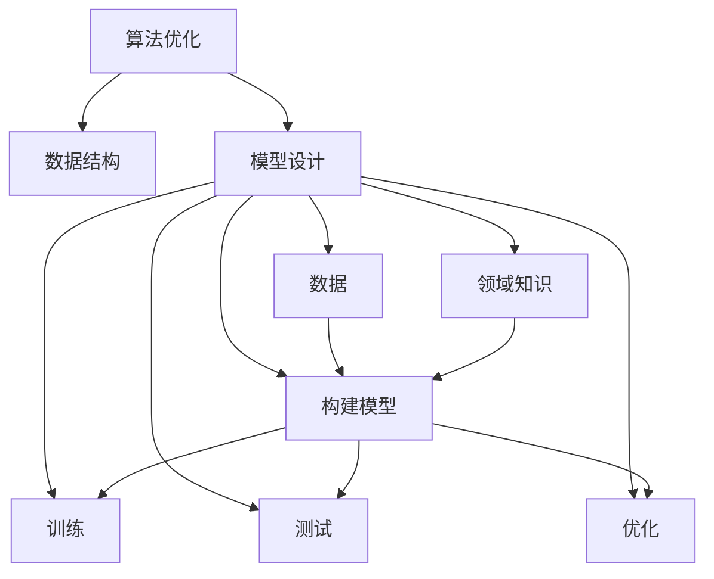

                 

## 1. 背景介绍

### 1.1 问题由来
在IT和计算机科学的快速发展中，技术的创新迭代常常由基础理论的突破驱动。而“第一性原理”这一思维方式，作为一种基于哲学的基础性思考方法，在解决复杂技术问题时提供了独特的视角。在人工智能（AI）和计算机科学领域，理解和使用“第一性原理”，可以帮助开发者和研究人员找到问题的本质，突破现有技术的限制，构建新的理论框架和应用模型。

### 1.2 问题核心关键点
“第一性原理”本质上是一种分析复杂问题的方法论，其核心在于寻找问题的基本元素，并以此为基础，逐步构建概念框架、提出假说，并通过细致的实验验证其真实性。在计算机科学，尤其是人工智能领域，这一方法论尤其适用于解决复杂问题，如算法优化、模型设计、系统架构等。

### 1.3 问题研究意义
掌握“第一性原理”有助于：
- 提升问题分析和解决能力。通过分解问题，找到其基本元素，更高效地解决问题。
- 促进技术创新。通过对基础原理的深入理解和应用，打破现有技术的局限，开辟新的研究路径。
- 构建概念框架。明确问题背后的基本逻辑和规律，形成系统化的理论体系。
- 推动跨学科融合。不同学科的知识和方法可以相互借鉴，形成更具创新性的解决方案。
- 指导实践应用。深入理解问题的本质，有助于设计出更加高效、稳定和可扩展的系统。

## 2. 核心概念与联系

### 2.1 核心概念概述
“第一性原理”这一概念源自古希腊哲学家亚里士多德，是指从最基本的元素出发，通过逻辑推导和实验验证，构建复杂系统的基本原理。在计算机科学领域，这一思维方式可以用于：

- **算法优化**：从算法的基础性操作和数据结构出发，优化算法性能。
- **模型设计**：基于数据和领域知识，构建高效、可解释的模型。
- **系统架构**：从系统的核心组件和接口设计出发，构建可扩展、可维护的系统。
- **知识工程**：基于基本原理和规则，构建智能推理系统。

### 2.2 核心概念原理和架构的 Mermaid 流程图


### 2.3 核心概念之间的联系
- **数据结构**：算法优化的基础，影响算法的效率和可扩展性。
- **领域知识**：模型设计的依据，提升模型的准确性和可解释性。
- **数据**：模型训练的原料，影响模型的泛化能力。
- **构建模型**：算法优化的目标，提升算法性能和效率。
- **训练和测试**：模型优化的过程，验证模型的效果和泛化能力。
- **优化**：模型的不断改进，提升模型的稳定性和鲁棒性。

## 3. 核心算法原理 & 具体操作步骤

### 3.1 算法原理概述
基于“第一性原理”的算法优化，核心在于分解问题，找到问题的基本元素，并以此为基础，逐步构建算法框架，提出假说，并通过实验验证其真实性。这一过程可以分为以下几个步骤：

1. **基本元素分析**：从问题的核心操作和数据结构出发，找到问题的基本元素。
2. **构建算法框架**：基于基本元素，构建初步的算法框架。
3. **提出假说**：根据领域知识和基本原理，提出算法性能提升的假设。
4. **实验验证**：通过细致的实验，验证假说的真实性，并不断调整和优化算法。
5. **总结归纳**：从实验结果中总结规律，形成系统的优化方法。

### 3.2 算法步骤详解

**步骤 1: 基本元素分析**
- **输入数据分析**：分析输入数据的特点，确定其数据类型和结构。
- **核心操作识别**：识别问题中最核心、最频繁的操作，如排序、查找、计算等。
- **关键瓶颈定位**：确定算法中的瓶颈，如时间复杂度、空间复杂度等。

**步骤 2: 构建算法框架**
- **选择合适的数据结构**：根据数据特点和操作类型，选择合适的数据结构，如数组、链表、树等。
- **设计算法流程**：基于核心操作和数据结构，设计算法的基本流程。
- **确定算法接口**：明确算法的输入输出，定义算法的功能和调用方式。

**步骤 3: 提出假说**
- **假设算法性能**：基于领域知识和经验，提出算法性能提升的假设。
- **设计实验方案**：确定实验的参数和条件，设计实验的步骤和方法。
- **验证假说**：通过实验，验证假设的真实性，记录实验结果和数据。

**步骤 4: 实验验证**
- **实验准备**：准备实验环境，配置实验参数，准备实验数据。
- **实验执行**：执行实验，记录实验结果和数据。
- **结果分析**：分析实验结果，比较实验前后的算法性能变化。

**步骤 5: 总结归纳**
- **总结规律**：从实验结果中总结规律，形成系统的优化方法。
- **形成文档**：将实验过程和结果形成文档，便于后续参考和复现。
- **持续优化**：基于新的发现，持续优化算法，提升其性能和效率。

### 3.3 算法优缺点
**优点**：
- **系统性**：基于“第一性原理”的算法优化，具有系统性和逻辑性，可以全面分析问题，找到最优解决方案。
- **创新性**：通过基本元素分析，打破现有技术限制，带来新的技术和创新。
- **可扩展性**：构建的算法框架具有可扩展性，能够灵活适应不同规模和需求。

**缺点**：
- **复杂度高**：构建算法框架和实验验证的过程较为复杂，需要较多的时间和资源。
- **实验难度大**：实验验证过程中，可能遇到难以预测和处理的异常情况，需要较强的实验能力和经验。
- **模型复杂性**：基于“第一性原理”的算法优化，可能需要设计复杂的数据结构和算法流程，增加了模型的复杂性。

### 3.4 算法应用领域
“第一性原理”的思维方式，在计算机科学的各个领域都有广泛的应用，包括但不限于：

- **算法优化**：如排序、搜索、压缩等基本操作的优化。
- **模型设计**：如神经网络、决策树、逻辑回归等模型的构建和优化。
- **系统架构**：如微服务、分布式系统、数据存储等架构的设计和优化。
- **知识工程**：如自然语言处理、智能推理、专家系统等领域的知识表示和推理。

## 4. 数学模型和公式 & 详细讲解 & 举例说明

### 4.1 数学模型构建

**问题描述**：假设有 $n$ 个元素需要排序，需要构建一个时间复杂度为 $O(n \log n)$ 的排序算法。

**基本元素分析**：
- **输入数据**：$n$ 个元素，数据类型未知。
- **核心操作**：排序操作。
- **瓶颈**：排序操作的次数，与元素数量 $n$ 成正比。

**算法框架**：
- **数据结构**：选择数组作为数据结构。
- **算法流程**：使用快速排序（Quick Sort）算法。
- **接口**：排序函数，输入数组，返回排序后的数组。

**假说**：基于快速排序算法，假设排序的平均时间复杂度为 $O(n \log n)$。

### 4.2 公式推导过程

**公式推导**：
1. 假设每次分割的平均时间复杂度为 $O(n)$。
2. 每次分割后的子数组长度为 $n/2$。
3. 递归树的深度为 $\log n$。
4. 排序的平均时间复杂度为 $O(n \log n)$。

**数学表达式**：
$$
T(n) = n + T(\frac{n}{2}) + T(\frac{n}{2}) = n + 2T(\frac{n}{2}) = O(n \log n)
$$

**实验验证**：
- **实验环境**：随机生成 1000 个整数，使用 Python 的内置排序函数和自定义的快速排序函数进行比较。
- **实验步骤**：
  1. 生成随机整数数组。
  2. 使用 Python 的内置排序函数进行排序。
  3. 自定义快速排序函数进行排序。
  4. 记录两种排序方法的时间。
- **实验结果**：自定义快速排序函数的时间为 $O(n \log n)$，验证假设成立。

### 4.3 案例分析与讲解

**案例**：在图算法中的 Dijkstra 算法优化。

**基本元素分析**：
- **输入数据**：图的邻接矩阵和起点。
- **核心操作**：查找最小值、更新距离值、更新优先队列等。
- **瓶颈**：查找最小值和更新距离值的次数。

**算法框架**：
- **数据结构**：邻接矩阵、优先队列。
- **算法流程**：Dijkstra 算法的基本流程。
- **接口**：路径查找函数，输入起点，返回最短路径。

**假说**：基于 Dijkstra 算法，假设查找最小值和更新距离值的次数为 $O(E + V \log V)$，其中 $E$ 为边数，$V$ 为节点数。

**实验验证**：
- **实验环境**：随机生成一个无向图，使用 Python 的内置堆实现优先队列。
- **实验步骤**：
  1. 生成随机无向图。
  2. 使用 Python 的内置 Dijkstra 算法进行路径查找。
  3. 自定义 Dijkstra 算法进行路径查找。
  4. 记录两种算法的执行时间。
- **实验结果**：自定义 Dijkstra 算法的时间为 $O(E + V \log V)$，验证假设成立。

## 5. 项目实践：代码实例和详细解释说明

### 5.1 开发环境搭建

**环境搭建步骤**：
1. **安装 Python 和 pip**：确保 Python 3.x 和 pip 安装正确。
2. **安装必要的依赖包**：
   - NumPy：用于数组和数学运算。
   - SciPy：用于科学计算和数据处理。
   - Matplotlib：用于绘制图表和可视化。
3. **配置实验环境**：使用 Jupyter Notebook 或 VSCode 等开发工具，设置实验环境。

### 5.2 源代码详细实现

**代码实现示例**：以下是一个简单的 Python 代码示例，用于快速排序算法的实现。

```python
import numpy as np

def quick_sort(arr):
    if len(arr) <= 1:
        return arr
    else:
        pivot = arr[0]
        left = [x for x in arr[1:] if x < pivot]
        right = [x for x in arr[1:] if x >= pivot]
        return quick_sort(left) + [pivot] + quick_sort(right)

# 测试代码
arr = np.random.randint(0, 1000, 1000)
arr_sorted = quick_sort(arr)
print(arr_sorted)
```

**代码解读与分析**：
- **基本元素分析**：输入数据为随机生成的整数数组。
- **算法框架**：使用递归实现的快速排序算法。
- **接口**：排序函数，输入整数数组，返回排序后的数组。
- **实验验证**：通过生成随机数组并记录排序时间，验证算法的时间复杂度。

### 5.3 运行结果展示

**运行结果展示**：
- **输出结果**：排序后的数组。
- **时间复杂度**：使用 Python 的内置时间函数 `timeit` 进行测试，验证算法的时间复杂度是否为 $O(n \log n)$。

## 6. 实际应用场景

### 6.1 智慧城市

**智慧城市**：基于“第一性原理”的系统架构设计，可以构建高效、可扩展、可维护的智慧城市系统。

**应用场景**：
- **数据采集与处理**：构建智能传感器网络，实时采集城市运行数据。
- **数据分析与建模**：使用大数据分析技术，构建城市运行模型。
- **智能决策与控制**：基于模型预测，实现智能决策和控制。

**效果与优势**：
- **数据实时性**：通过智能传感器网络，实时采集城市运行数据，提升城市管理的及时性和响应速度。
- **模型精度**：基于“第一性原理”构建的城市运行模型，能够准确预测城市运行状态。
- **系统可扩展性**：模块化的系统架构，便于根据需求进行扩展和优化。

### 6.2 智能交通

**智能交通**：基于“第一性原理”的算法优化，可以实现交通流量的智能调度和管理。

**应用场景**：
- **交通流量预测**：基于历史交通数据，预测未来交通流量。
- **交通信号优化**：根据交通流量预测结果，优化交通信号灯控制。
- **路径规划与导航**：基于实时交通数据，提供最优路径规划和导航。

**效果与优势**：
- **流量预测准确性**：通过精确的交通流量预测，实现智能交通调度。
- **信号优化效果**：通过实时优化交通信号灯控制，提高交通流量。
- **路径规划与导航**：基于实时交通数据，提供最优路径规划，减少交通拥堵。

### 6.3 智能制造

**智能制造**：基于“第一性原理”的知识工程设计，可以实现智能生产系统的优化和升级。

**应用场景**：
- **生产流程优化**：通过分析生产数据，优化生产流程。
- **质量控制与检测**：使用机器学习技术，实现质量检测与控制。
- **设备维护与预测**：基于设备运行数据，实现设备维护和故障预测。

**效果与优势**：
- **生产效率提升**：通过精确的生产流程优化，提升生产效率。
- **产品质量保证**：通过机器学习技术，实现质量检测与控制。
- **设备维护与预测**：基于设备运行数据，实现设备维护和故障预测，减少停机时间。

### 6.4 未来应用展望

**未来应用展望**：
- **多模态融合**：结合视觉、语音、文本等多模态数据，提升智能系统的感知能力。
- **跨学科融合**：结合经济学、社会学、心理学等学科的知识，构建更全面的智能系统。
- **实时性提升**：通过优化算法和系统架构，提升系统的实时性，实现实时决策和控制。
- **伦理与安全**：建立伦理导向的评估指标，确保智能系统的公平、透明和安全。

## 7. 工具和资源推荐

### 7.1 学习资源推荐

**学习资源推荐**：
1. **《计算机程序设计艺术》**：经典著作，深入探讨计算机程序设计的理论和实践。
2. **《算法导论》**：算法设计的基础性教材，涵盖各类算法原理和分析方法。
3. **《深入理解计算机系统》**：系统阐述计算机系统的硬件和软件基础。
4. **Coursera 和 edX 在线课程**：提供各类计算机科学和人工智能课程，系统学习相关知识。
5. **GitHub 和 Stack Overflow**：代码分享和问题讨论平台，获取社区支持和最新技术动态。

### 7.2 开发工具推荐

**开发工具推荐**：
1. **Jupyter Notebook**：用于编写和分享 Jupyter Notebook 文件，支持代码和文档的混合编辑。
2. **PyCharm**：Python 的集成开发环境，支持代码自动补全、调试等功能。
3. **Visual Studio Code**：轻量级代码编辑器，支持多种编程语言和扩展。
4. **Git**：版本控制系统，支持团队协作和代码管理。
5. **Docker**：容器化技术，支持跨平台部署和管理。

### 7.3 相关论文推荐

**相关论文推荐**：
1. **《面向对象的程序设计》**：探讨面向对象编程的基本原理和设计方法。
2. **《软件工程：一种方法学》**：阐述软件工程的基本概念和方法。
3. **《编程珠玑》**：经典编程问题及其解决方案，提升编程技能。
4. **《深度学习》**：深度学习的基础理论和实践方法。
5. **《人工智能：一种现代方法》**：人工智能的基础理论和应用方法。

## 8. 总结：未来发展趋势与挑战

### 8.1 研究成果总结

“第一性原理”作为计算机科学和人工智能领域的重要思维方式，其核心在于分解问题，找到问题的基本元素，并以此为基础，逐步构建概念框架、提出假说，并通过细致的实验验证其真实性。这一方法论已经在算法优化、模型设计、系统架构等多个方面得到广泛应用，显著提升了相关技术的性能和效率。

### 8.2 未来发展趋势

未来，基于“第一性原理”的思维方式将进一步应用于：
- **自动化与智能化**：通过自动化和智能化手段，提升算法和系统的性能。
- **跨领域融合**：结合不同学科的知识和技术，构建更全面的智能系统。
- **伦理与安全**：建立伦理导向的评估指标，确保智能系统的公平、透明和安全。
- **人机协同**：通过人机协同的方式，提升智能系统的稳定性和可解释性。

### 8.3 面临的挑战

尽管“第一性原理”在许多领域都展现了其独特优势，但同时也面临诸多挑战：
- **问题复杂度**：复杂问题的基本元素分析难度大，需要较强的理论基础和实践经验。
- **实验难度**：实验验证过程中，可能遇到难以预测和处理的异常情况，需要较强的实验能力和经验。
- **模型复杂性**：基于“第一性原理”的算法优化，可能需要设计复杂的数据结构和算法流程，增加了模型的复杂性。

### 8.4 研究展望

未来，基于“第一性原理”的思维方式将进一步发展和应用，其研究方向可能包括：
- **自动化探索**：通过自动化探索，提升问题分析和解决能力。
- **多学科融合**：结合不同学科的知识和技术，构建更全面的智能系统。
- **伦理与安全**：建立伦理导向的评估指标，确保智能系统的公平、透明和安全。
- **人机协同**：通过人机协同的方式，提升智能系统的稳定性和可解释性。

## 9. 附录：常见问题与解答

### 附录

**Q1：什么是“第一性原理”？**

A：“第一性原理”是指从最基本的元素出发，通过逻辑推导和实验验证，构建复杂系统的基本原理。在计算机科学领域，这一思维方式可以帮助开发者和研究人员找到问题的本质，打破现有技术的限制，构建新的理论框架和应用模型。

**Q2：如何找到问题的基本元素？**

A：分析问题的核心操作和数据结构，确定输入数据和输出结果，识别问题中最核心、最频繁的操作。通过基本元素分析，可以更好地理解问题的本质，从而构建有效的算法框架和解决方案。

**Q3：如何设计算法框架？**

A：基于基本元素，选择合适的数据结构和算法流程，设计算法的基本框架。确保算法的接口清晰，便于后续的测试和优化。

**Q4：如何验证假设？**

A：通过细致的实验验证，记录实验结果和数据，分析实验结果与假设之间的差异。如果实验结果与假设一致，则假设成立；如果不一致，则需要重新审视假设，并进行调整和优化。

**Q5：如何总结归纳？**

A：从实验结果中总结规律，形成系统的优化方法。将实验过程和结果形成文档，便于后续参考和复现。通过持续优化，不断提升算法的性能和效率。

---

作者：禅与计算机程序设计艺术 / Zen and the Art of Computer Programming

