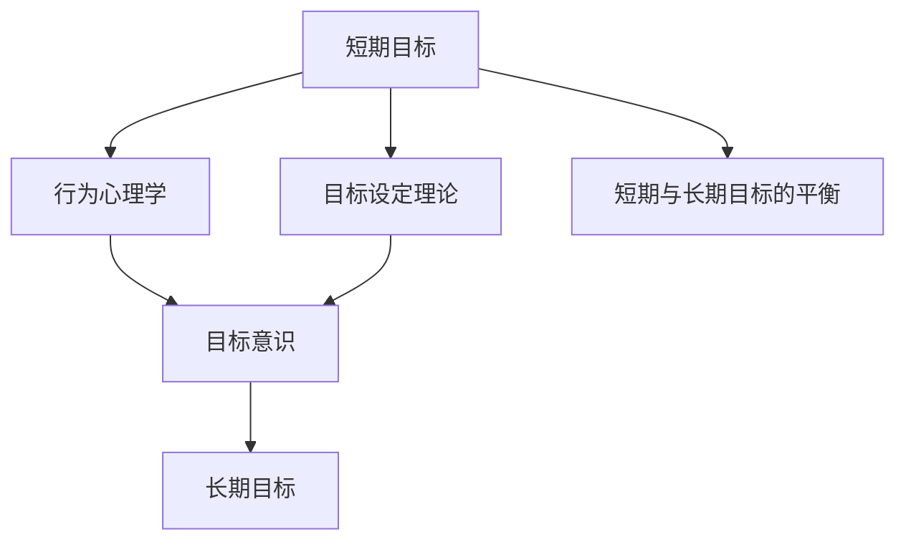

                 

# 管理短期目标与长期目标的意识机制

> 关键词：短期目标管理,长期目标规划,意识机制,行为心理学,目标设定理论

## 1. 背景介绍

### 1.1 问题由来
在复杂多变的环境中，个人和企业面临着各种短期和长期目标的挑战。如何高效管理这些目标，使其互相促进，共同驱动组织和个人的发展，是一个亟需解决的问题。

> 目标管理已成为现代管理学的重要组成部分，有助于提高组织效率和员工满意度。然而，实际操作中，常遇到目标不一致、短期利益和长期利益冲突等问题，导致目标管理的效果大打折扣。

### 1.2 问题核心关键点
核心在于找到一种意识机制，使个人和企业能够清晰地认识到短期目标和长期目标之间的内在联系，制定合适的策略，促进两者的协调与统一。

> 核心问题在于如何在组织和个人的决策过程中，不断强化对短期和长期目标的意识，从而实现目标的良性互动。

### 1.3 问题研究意义
研究短期目标与长期目标的意识机制，对组织和个人的目标管理具有重要意义：

1. **提升目标一致性**：通过强化短期和长期目标的意识，减少目标之间的冲突，提高目标一致性。
2. **增强战略执行**：通过合理规划短期目标和长期目标，确保战略得到有效执行。
3. **优化资源配置**：通过短期和长期目标的协同管理，更科学地配置和利用资源。
4. **促进持续成长**：通过短期和长期目标的平衡，实现可持续发展和持续创新。

## 2. 核心概念与联系

### 2.1 核心概念概述

为更好地理解目标管理中短期与长期目标的意识机制，本节将介绍几个关键概念：

- **短期目标（Short-term Goals）**：在一定时期内，能够直接产生效果的行动计划，通常具有可衡量性和可操作性。
- **长期目标（Long-term Goals）**：从长远角度考虑，具有战略性和方向性的目标，可能涉及几年或几十年的规划。
- **目标意识（Goal Awareness）**：个人或组织对自身目标的认识和理解，包括短期目标和长期目标的认知和规划。
- **行为心理学（Behavioral Psychology）**：研究人类行为背后的心理动因，揭示目标设定和行为之间的关系。
- **目标设定理论（Goal Setting Theory）**：描述目标设定对行为的影响及其心理过程的理论。

这些概念之间的逻辑关系可以通过以下Mermaid流程图来展示：



这个流程图展示了几者之间的联系：

1. 短期目标在行为心理学和目标设定理论的作用下，影响目标意识。
2. 目标意识通过对短期目标和长期目标的认识，促进两者的平衡与协调。
3. 长期目标与短期目标的平衡，是目标意识的核心，影响组织的整体战略和长期发展。

## 3. 核心算法原理 & 具体操作步骤

### 3.1 算法原理概述

短期目标与长期目标的意识机制的核心原理在于目标的**协同与平衡**，即通过合理规划和执行，使得短期目标与长期目标在资源、时间和行为上形成良性互动，共同推动组织或个人的发展。

形式化地，假设组织或个人的短期目标为 $G_s$，长期目标为 $G_l$，行为策略为 $A$，其协同作用可以表示为：

$$
G_l = f(G_s, A)
$$

其中 $f$ 为策略函数，描述短期目标和长期目标之间的关系。

### 3.2 算法步骤详解

基于目标协同与平衡的意识机制，目标管理通常包括以下几个关键步骤：

**Step 1: 目标定义与识别**
- 定义组织的短期目标和长期目标，明确具体、可量化的目标描述。
- 识别和区分短期目标和长期目标，确定二者之间的联系和优先级。

**Step 2: 目标分解与分配**
- 将长期目标分解为多个短期目标，形成可操作的任务清单。
- 根据资源、能力等因素，合理分配任务给相应的团队或个人。

**Step 3: 目标设定与反馈**
- 设定具体的、可衡量的目标，以SMART原则（Specific、Measurable、Achievable、Relevant、Time-bound）为指导。
- 定期进行目标检查和反馈，根据实际进展进行调整，确保短期目标和长期目标的一致性。

**Step 4: 目标执行与监控**
- 制定详细的执行计划，确保每个短期目标都有明确的执行步骤和时间节点。
- 实时监控执行情况，及时发现问题并进行调整，确保短期目标的顺利完成。

**Step 5: 目标评估与调整**
- 根据短期目标的完成情况，评估其对长期目标的贡献和影响。
- 基于评估结果，调整短期目标和长期目标的关系，确保组织和个人的持续成长。

### 3.3 算法优缺点

短期目标与长期目标的意识机制具有以下优点：

1. **提高目标一致性**：通过明确短期目标和长期目标的关系，减少二者之间的冲突。
2. **优化资源配置**：合理规划短期和长期目标，更科学地利用资源。
3. **增强战略执行**：确保短期目标和长期目标的协同，提高战略执行效果。

同时，该机制也存在一定的局限性：

1. **实现难度高**：目标协同与平衡需要在复杂的组织环境中进行，实现难度较大。
2. **时间延迟长**：短期目标的完成可能需要较长时间，难以快速看到效果。
3. **个体差异大**：不同个体的动机和行为差异可能导致目标管理的效果不同。

尽管存在这些局限性，但基于目标协同与平衡的意识机制仍然是目标管理的重要指导原则。

### 3.4 算法应用领域

基于目标协同与平衡的意识机制，在组织和个人目标管理中有着广泛的应用，例如：

- **企业战略规划**：通过明确短期和长期目标，制定全面的企业战略，实现持续增长。
- **项目进度管理**：在项目管理中，通过目标设定和执行，确保项目按时完成并达到预期效果。
- **个人职业发展**：通过设定短期和长期职业目标，实现个人能力的提升和职业成长。
- **团队协作管理**：在团队管理中，通过协同目标，提升团队协作效率和成员满意度。
- **教育培训机构**：在教育培训中，通过设定短期和长期教学目标，实现课程内容和教学方法的持续改进。

## 4. 数学模型和公式 & 详细讲解 & 举例说明

### 4.1 数学模型构建

为了更深入地理解短期目标与长期目标的意识机制，我们可以使用数学模型进行建模。假设组织的短期目标为 $G_s$，长期目标为 $G_l$，行为策略为 $A$，目标协同函数为 $f$，则目标管理过程可以建模为：

$$
G_l = f(G_s, A)
$$

其中 $f$ 为策略函数，可以表示为：

$$
f = k_1 \times G_s + k_2 \times \text{Decomposition}(G_s) + k_3 \times \text{Allocation}(G_s, A) + k_4 \times \text{Feedback}(G_s)
$$

其中：
- $k_1$ 为短期目标权重，表示短期目标对长期目标的影响。
- $k_2$ 为分解权重，表示将长期目标分解为短期目标的程度。
- $k_3$ 为分配权重，表示资源分配的合理性。
- $k_4$ 为反馈权重，表示目标检查和调整的频率。

### 4.2 公式推导过程

以下我们以一个简单的例子来推导目标协同函数的计算方法：

假设一个公司希望在未来五年内进入全球市场（长期目标 $G_l$），具体分为每年提升市场份额 10%（短期目标 $G_s$）。为了实现这一目标，公司决定进行广告投入、市场调研和产品改进等行为策略 $A$。

1. **目标分解**：将五年内进入全球市场的目标分解为每年提升市场份额 10%的短期目标。

2. **资源分配**：将广告投入、市场调研和产品改进等资源合理分配给相应的团队或个人。

3. **目标设定**：设定具体的广告预算、市场调研计划和产品改进方案，确保短期目标的实现。

4. **目标执行与监控**：定期检查广告投入、市场调研和产品改进的效果，及时调整策略。

5. **目标评估与调整**：根据市场份额的提升情况，评估广告投入、市场调研和产品改进的贡献，调整下一步行动计划。

通过以上步骤，可以构建一个简单的目标协同模型，如下所示：

$$
G_l = k_1 \times G_s + k_2 \times \text{Decomposition}(G_s) + k_3 \times \text{Allocation}(G_s, A) + k_4 \times \text{Feedback}(G_s)
$$

其中 $k_1=0.8$，$k_2=0.2$，$k_3=0.6$，$k_4=0.5$。

### 4.3 案例分析与讲解

以下以一个具体的企业战略规划案例，进一步解释目标协同模型的实际应用。

**案例背景**：一家科技公司希望在三年内推出一款革命性的新产品，进入市场领先地位。

**目标设定**：
- 短期目标（第一年）：完成产品原型设计，进行市场调研，并完成产品测试。
- 长期目标（第三年）：产品成功上市，市场份额达到 20%。

**目标分解与分配**：
- 将长期目标分解为三个短期目标，分别为第一年、第二年、第三年的具体目标。
- 分配研发团队、市场团队、质量控制团队等资源，确保每个阶段的任务顺利完成。

**目标设定与反馈**：
- 设定明确的产品设计、市场调研、产品测试的执行计划，并进行定期检查。
- 根据反馈结果，及时调整产品设计方案和市场策略。

**目标执行与监控**：
- 制定详细的执行时间表，确保每个短期目标都有明确的执行步骤和时间节点。
- 实时监控执行情况，确保资源合理利用。

**目标评估与调整**：
- 根据产品测试结果和市场调研数据，评估短期目标的完成情况。
- 基于评估结果，调整产品设计方案和市场策略，确保长期目标的实现。

通过以上步骤，企业能够有效地管理短期和长期目标，确保新产品成功上市。

## 5. 项目实践：代码实例和详细解释说明

### 5.1 开发环境搭建

在进行目标管理系统的开发前，我们需要准备好开发环境。以下是使用Python进行目标管理系统的开发环境配置流程：

1. 安装Python：从官网下载并安装Python，确保版本为3.6或以上。
2. 安装Pip：确保Pip已经安装，用于管理Python包。
3. 安装开发工具：安装PyCharm等IDE，以及所需的各种开发库，如SQLAlchemy、Flask等。

### 5.2 源代码详细实现

以下是一个简单的目标管理系统的源代码实现：

```python
# 目标管理系统的代码实现
class Goal:
    def __init__(self, name, description, target_date):
        self.name = name
        self.description = description
        self.target_date = target_date
        self.status = 'In Progress'
        self.delegate = None
        self.reports = []

    def set_delegate(self, delegate):
        self.delegate = delegate

    def get_reports(self):
        return self.reports

    def update_status(self, status):
        self.status = status

# 项目管理的代码实现
class Project:
    def __init__(self, name, goals):
        self.name = name
        self.goals = goals

    def add_goal(self, goal):
        self.goals.append(goal)

    def get_goals(self):
        return self.goals

# 创建目标实例
goal1 = Goal('产品设计', '完成产品原型设计', '2023-12-31')
goal2 = Goal('市场调研', '完成市场调研', '2023-12-31')
goal3 = Goal('产品测试', '完成产品测试', '2024-04-30')

# 创建项目实例
project = Project('新产品开发', [goal1, goal2, goal3])

# 添加目标实例到项目
project.add_goal(goal1)
project.add_goal(goal2)
project.add_goal(goal3)

# 输出项目目标列表
for goal in project.get_goals():
    print(f"Goal: {goal.name}, Description: {goal.description}, Target Date: {goal.target_date}")
```

### 5.3 代码解读与分析

让我们再详细解读一下关键代码的实现细节：

**Goal类**：
- `__init__`方法：初始化目标的名称、描述、截止日期、状态、负责人以及报告列表。
- `set_delegate`方法：设置目标的负责人。
- `get_reports`方法：获取目标的报告列表。
- `update_status`方法：更新目标的状态。

**Project类**：
- `__init__`方法：初始化项目名称和目标列表。
- `add_goal`方法：将目标添加到项目中。
- `get_goals`方法：获取项目的目标列表。

**目标管理系统的实现**：
- 首先，创建三个目标实例，并添加到项目中。
- 然后，输出项目的目标列表，包括目标的名称、描述和截止日期。

## 6. 实际应用场景

### 6.1 企业管理

在企业管理中，目标管理可以帮助企业制定和执行战略目标，提升组织效率和绩效。例如，一家公司希望在未来五年内进入全球市场，通过目标协同与平衡的意识机制，可以有效规划和执行短期和长期目标。

### 6.2 项目管理

在项目管理中，目标管理可以确保项目按时完成并达到预期效果。通过目标设定、执行、监控和调整，项目团队可以高效协调资源，提高项目成功率。

### 6.3 个人发展

在个人职业发展中，目标管理可以帮助个人设定明确的目标，提升职业能力和发展速度。通过设定短期和长期职业目标，个人可以更有针对性地进行学习和提升。

### 6.4 教育培训

在教育培训中，目标管理可以确保课程内容和教学方法的持续改进。通过设定短期和长期教学目标，教育机构可以更好地评估和调整教学策略，提升教学质量。

### 6.5 医疗卫生

在医疗卫生领域，目标管理可以帮助医院制定和执行医疗服务目标，提升医疗服务质量和患者满意度。通过设定短期和长期医疗目标，医院可以更有效地管理医疗资源和提高服务水平。

## 7. 工具和资源推荐

### 7.1 学习资源推荐

为了帮助开发者系统掌握目标管理理论，这里推荐一些优质的学习资源：

1. **《管理学原理》**：全面介绍管理学基础理论和实践方法，包括目标管理等经典管理理论。
2. **《目标管理：企业成功的关键》**：介绍目标管理的理论、方法和实践，帮助企业实现目标管理。
3. **《SMART目标设定：实现高效目标管理》**：深入讲解SMART目标设定的具体方法，帮助个人和企业设定可实现的短期和长期目标。
4. **《行为心理学》**：介绍行为心理学的基本理论和应用，揭示目标设定和行为之间的关系。

通过对这些资源的学习实践，相信你一定能够系统掌握目标管理的理论基础和实践技巧。

### 7.2 开发工具推荐

高效的开发离不开优秀的工具支持。以下是几款用于目标管理系统的常用工具：

1. **Trello**：一个强大的项目管理工具，支持目标设定、执行和监控，适合个人和团队使用。
2. **JIRA**：一个专业的项目管理工具，支持复杂的项目管理和目标协同。
3. **Asana**：一个灵活的项目管理工具，支持目标设定和任务分配，适合团队协作。
4. **Monday.com**：一个全功能的项目管理工具，支持目标设定、执行和监控，适合各种规模的企业使用。

合理利用这些工具，可以显著提升目标管理的开发效率，加快创新迭代的步伐。

### 7.3 相关论文推荐

目标管理已成为管理学的重要研究方向。以下是几篇奠基性的相关论文，推荐阅读：

1. **《目标管理：一个现代组织发展理论》**：介绍了目标管理的理论基础和实践方法。
2. **《目标管理的理论与实践》**：全面介绍目标管理的理论、方法和实践，帮助企业实现目标管理。
3. **《目标设定的心理学研究》**：深入研究目标设定对行为的影响及其心理过程，揭示目标管理的心理基础。
4. **《基于SMART原则的目标设定研究》**：介绍SMART目标设定的具体方法，帮助个人和企业设定可实现的短期和长期目标。

这些论文代表了大目标管理理论的发展脉络。通过学习这些前沿成果，可以帮助研究者把握学科前进方向，激发更多的创新灵感。

## 8. 总结：未来发展趋势与挑战

### 8.1 总结

本文对目标协同与平衡的意识机制进行了全面系统的介绍。首先阐述了目标管理的重要性，明确了目标一致性、战略执行和资源配置等关键问题。其次，从原理到实践，详细讲解了目标协同与平衡的数学模型和操作流程，给出了目标管理任务开发的完整代码实例。同时，本文还广泛探讨了目标管理在企业管理、项目管理、个人发展、教育培训等多个领域的应用前景，展示了目标管理范式的广泛应用。此外，本文精选了目标管理的各类学习资源，力求为读者提供全方位的技术指引。

通过本文的系统梳理，可以看到，目标协同与平衡的意识机制在目标管理中扮演着关键角色，能够有效提升组织的效率和绩效。未来，伴随技术的发展和理论的演进，目标管理还将继续发展和优化，为组织和个人的发展提供更强的支持和保障。

### 8.2 未来发展趋势

展望未来，目标管理将呈现以下几个发展趋势：

1. **数字化转型**：随着信息技术的发展，目标管理将越来越多地采用数字化工具，实现目标的智能化管理和实时监控。
2. **跨领域应用**：目标管理将跨越多领域，如医疗、教育、政府等，实现更广泛的覆盖和应用。
3. **全球化管理**：目标管理将拓展到全球化管理，帮助跨国企业实现全球战略目标。
4. **个性化定制**：目标管理将根据不同组织和个人的特点，进行个性化定制，提升管理效果。
5. **人工智能融合**：目标管理将与人工智能技术进行深度融合，实现目标设定的自动化和智能化。

这些趋势凸显了目标管理的前景和潜力，必将推动目标管理在更广阔的领域得到应用和发展。

### 8.3 面临的挑战

尽管目标管理取得了显著成就，但在迈向更加智能化、普适化应用的过程中，它仍面临着诸多挑战：

1. **数据质量问题**：目标管理需要大量的数据支持，数据质量直接影响到目标管理的准确性和效果。
2. **组织文化差异**：不同组织和企业的文化背景不同，目标管理的效果可能因文化差异而有所不同。
3. **人员素质差异**：目标管理的效果也受到组织内部人员素质和能力的影响。
4. **执行偏差**：在目标执行过程中，目标管理可能存在偏差，影响目标的实现。
5. **复杂性高**：目标管理涉及多个环节和因素，实施难度较大。

尽管存在这些挑战，但通过不断优化目标管理的方法和工具，提升目标管理的准确性和效果，这些挑战终将得到克服。

### 8.4 研究展望

面向未来，目标管理需要在以下几个方面进行探索：

1. **数据质量提升**：通过引入大数据、人工智能等技术，提升目标管理所需的数据质量。
2. **组织文化融合**：探索不同文化背景下的目标管理方法，实现跨文化管理。
3. **人员素质提升**：通过培训和教育，提升组织内部人员的目标管理能力。
4. **执行偏差纠正**：通过建立科学的评估和反馈机制，及时发现和纠正目标管理的偏差。
5. **智能管理工具**：开发更加智能的目标管理工具，实现目标设定的自动化和智能化。

这些研究方向和探索将推动目标管理的发展，为组织和个人的目标管理提供更强的支持和保障。总之，目标协同与平衡的意识机制需要在实践中不断优化和完善，才能真正实现目标管理的理想效果。

## 9. 附录：常见问题与解答

**Q1: 目标管理中的短期目标和长期目标如何平衡？**

A: 短期目标和长期目标的平衡需要根据具体环境和任务进行灵活调整。一般而言，可以采用以下策略：
1. **阶段划分**：将长期目标划分为多个阶段，每个阶段设定相应的短期目标。
2. **权重分配**：根据不同阶段的重要性和紧迫性，合理分配短期目标和长期目标的权重。
3. **反馈机制**：定期评估短期目标的完成情况，根据反馈结果调整长期目标和短期目标的关系。

**Q2: 目标管理的数学模型有哪些？**

A: 目标管理的数学模型有多种，常用的包括：
1. **层次分析法（AHP）**：通过层次结构来确定目标之间的优先级。
2. **决策树**：通过树形结构来描述目标的逻辑关系和决策过程。
3. **网络模型**：通过网络图来表示目标之间的依赖关系和协同机制。
4. **模糊数学**：通过模糊集合来处理目标的不确定性和模糊性。

**Q3: 目标管理与项目管理有哪些区别？**

A: 目标管理与项目管理虽有相似之处，但侧重点有所不同：
1. **范围不同**：项目管理主要关注项目范围和任务执行，目标管理关注组织和个人的目标设定与实现。
2. **方法不同**：项目管理主要采用计划、执行、监控等方法，目标管理主要采用目标设定、反馈、调整等方法。
3. **目标性质不同**：项目管理的目标具有可控性和阶段性，目标管理的目标具有战略性和长期性。

**Q4: 目标管理中的行为心理学有哪些应用？**

A: 行为心理学在目标管理中的应用主要体现在以下几个方面：
1. **动机理论**：研究目标设定的动机机制，揭示目标对行为的影响。
2. **行为模型**：通过行为模型来预测和解释目标设定的行为反应。
3. **行为干预**：通过行为干预技术，帮助目标管理者提升目标设定的效果。

**Q5: 目标管理系统的开发流程是什么？**

A: 目标管理系统的开发流程通常包括以下步骤：
1. **需求分析**：明确目标管理系统的功能需求和用户需求。
2. **系统设计**：设计目标管理系统的架构和功能模块。
3. **数据设计**：设计目标管理系统的数据模型和数据存储方案。
4. **开发实现**：编写目标管理系统的代码，实现系统功能。
5. **测试部署**：进行系统测试和部署，确保系统稳定运行。

通过以上步骤，可以构建一个高效、可靠的目标管理系统，帮助组织和个人实现目标管理。

---

作者：禅与计算机程序设计艺术 / Zen and the Art of Computer Programming

