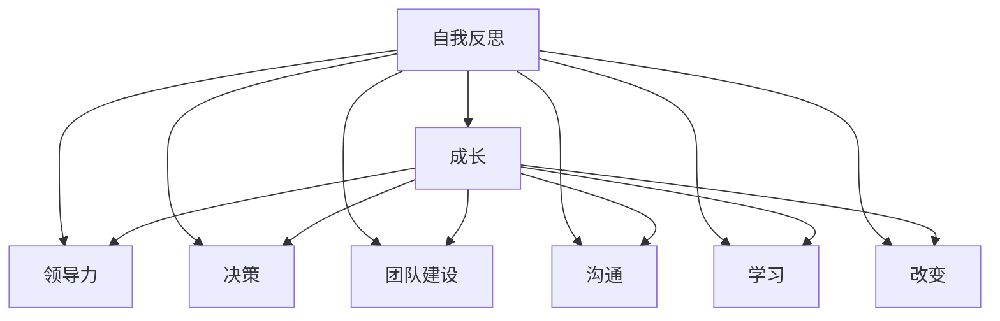

                 

# 管理者的自我反思与成长

> 关键词：管理者, 自我反思, 成长, 领导力, 创新, 决策, 团队建设, 沟通, 学习, 改变

## 1. 背景介绍

### 1.1 问题由来
管理者在现代企业中扮演着至关重要的角色。他们不仅要确保企业的正常运营，还要推动企业的创新和持续发展。然而，随着环境的快速变化和技术的不断进步，管理者面临着前所未有的挑战。为了应对这些挑战，管理者需要具备卓越的领导力、战略思维、创新能力和团队建设能力。但这些能力的提升并非一蹴而就，需要持续的自我反思和成长。

### 1.2 问题核心关键点
本文聚焦于管理者的自我反思与成长，探讨如何通过系统的方法和工具，促进管理者在领导力、决策、团队建设、沟通、学习和改变等方面的不断提升。我们将从理论到实践，详细介绍基于自我反思的管理者成长模型，并通过实例帮助读者理解和应用这一模型。

### 1.3 问题研究意义
管理者作为企业的核心驱动者，其自我反思与成长对企业的发展具有重要意义：

1. **提升领导力**：通过持续自我反思，管理者能够识别和改善自己的领导风格，激发团队潜能，提升整体绩效。
2. **优化决策**：管理者能够更深刻地理解组织环境，做出更加合理和高效的决策，规避风险。
3. **促进创新**：通过反思和成长，管理者能够保持敏锐的创新意识，推动企业持续创新。
4. **增强团队凝聚力**：管理者能够建立更加和谐的团队关系，提升团队的协作效率和凝聚力。
5. **优化沟通**：管理者能够提高沟通技巧，确保信息流畅传递，减少误解和冲突。
6. **持续学习**：管理者能够保持学习心态，不断吸收新知识，提升个人和企业的竞争力。
7. **实现个人价值**：管理者通过自我反思，能够实现个人目标与企业目标的统一，实现个人价值的最大化。

## 2. 核心概念与联系

### 2.1 核心概念概述

为更好地理解管理者自我反思与成长的过程，本节将介绍几个核心概念及其相互联系：

- **自我反思(Self-Reflection)**：管理者通过深入思考自己的行为、决策和思维方式，识别改进点并制定改进策略。
- **成长(Growth)**：管理者在反思的基础上，通过学习、实践和调整，不断提升自己的能力和素质。
- **领导力(Leadership)**：管理者通过领导行为，引导和激励团队，实现组织目标。
- **决策(Decision Making)**：管理者在复杂环境中选择最佳方案的过程。
- **团队建设(Team Building)**：管理者通过各种措施，提升团队的协作效率和凝聚力。
- **沟通(Communication)**：管理者通过有效的沟通，确保信息的准确传递和理解。
- **学习(Learning)**：管理者不断吸收新知识，提升专业能力和管理水平。
- **改变(Change)**：管理者在面对环境变化时，能够灵活调整策略和行为，适应新环境。

这些概念之间的逻辑关系可以通过以下Mermaid流程图来展示：



这个流程图展示了自我反思如何通过各个方面促进管理者的成长，进而提升领导力、优化决策、促进团队建设、增强沟通、持续学习和实现改变。

## 3. 核心算法原理 & 具体操作步骤
### 3.1 算法原理概述

管理者自我反思与成长的过程，本质上是一个系统性的改进过程。其核心思想是：通过持续的自我反思和成长，管理者能够识别和改善自己的行为和决策，提升领导力、优化决策、增强团队建设能力、改善沟通、促进持续学习和适应环境变化。

这一过程通常包括以下几个关键步骤：

1. **自我反思**：识别自身的优点和缺点，识别改进点。
2. **制定改进策略**：基于自我反思结果，制定具体的改进措施。
3. **实践和调整**：在实际管理过程中应用改进策略，并根据反馈进行调整。
4. **评估和反馈**：评估改进策略的效果，并收集反馈进行持续改进。

### 3.2 算法步骤详解

以下是管理者自我反思与成长的具体操作步骤：

**Step 1: 进行自我评估**
管理者通过自我评估问卷、360度反馈等方式，全面了解自己的行为、决策和沟通能力，识别改进点。

**Step 2: 制定改进计划**
基于自我评估结果，管理者制定具体的改进计划，明确改进目标和策略。

**Step 3: 实施改进措施**
在实际管理过程中应用改进计划，包括调整领导风格、优化决策流程、加强团队建设、改善沟通方式、学习新知识和技能等。

**Step 4: 收集反馈和调整**
管理者收集来自团队成员、上级和下属的反馈，评估改进效果，根据反馈进行调整和优化。

**Step 5: 持续学习和提升**
管理者持续学习和吸收新知识，不断提高自己的管理水平和能力。

### 3.3 算法优缺点

管理者自我反思与成长方法具有以下优点：

1. **系统性**：通过系统的步骤和工具，确保反思与成长过程的全面性和有效性。
2. **个性化**：管理者可以针对自身特点制定个性化的改进计划，更符合自身需求。
3. **持续性**：反思与成长是一个持续的过程，管理者可以不断进行改进和提升。

同时，该方法也存在一定的局限性：

1. **复杂性**：步骤较多，需要管理者投入较多时间和精力。
2. **反馈依赖**：改进效果依赖于团队成员的反馈，可能存在信息不对称的问题。
3. **执行难度**：需要管理者有较强的执行力和自律性，才能坚持不懈。

尽管存在这些局限性，但自我反思与成长仍是管理者提升能力的重要途径。通过系统的方法和工具，管理者可以更有效地识别和改善自身不足，促进持续成长和提升。

### 3.4 算法应用领域

管理者自我反思与成长的方法，在各种管理情境下都得到了广泛应用，如：

- **企业战略管理**：通过持续反思和成长，管理者能够更好地理解企业战略，制定和调整策略。
- **项目管理**：管理者能够通过反思和成长，提升项目管理的效率和质量。
- **人力资源管理**：管理者能够识别和改善人力资源管理的缺陷，优化招聘、培训和绩效评估流程。
- **产品开发**：管理者能够通过反思和成长，推动产品开发团队进行持续改进和创新。
- **客户关系管理**：管理者能够通过反思和成长，改善客户关系管理，提升客户满意度和忠诚度。
- **财务管理**：管理者能够通过反思和成长，优化财务管理和控制，提升企业的财务健康度。
- **供应链管理**：管理者能够通过反思和成长，提升供应链的效率和韧性，降低成本和风险。

这些应用场景展示了管理者自我反思与成长的广泛适用性，帮助管理者在各种复杂环境中实现自我提升和组织发展。

## 4. 数学模型和公式 & 详细讲解 & 举例说明

### 4.1 数学模型构建

管理者自我反思与成长的过程，可以通过数学模型来更好地理解和量化。我们引入“改进效果”和“反馈响应”两个变量，构建以下数学模型：

$$
\text{改进效果} = \text{反思深度} \times \text{改进策略} \times \text{反馈响应}
$$

其中，反思深度表示管理者在自我反思过程中的投入程度，改进策略表示管理者制定的具体改进措施，反馈响应表示管理者对反馈的响应和调整能力。

### 4.2 公式推导过程

通过上述数学模型，我们可以推导出以下公式：

1. **反思深度**：$$\text{反思深度} = \sum_{i=1}^n \text{反思时间}_i$$，其中 $n$ 为反思时间总和，$\text{反思时间}_i$ 表示第 $i$ 次反思的时间。

2. **改进策略**：$$\text{改进策略} = \sum_{j=1}^m \text{改进措施}_j$$，其中 $m$ 为改进措施总和，$\text{改进措施}_j$ 表示第 $j$ 项改进措施。

3. **反馈响应**：$$\text{反馈响应} = \frac{\text{反馈质量}}{\text{反馈延迟}}$$，其中 $\text{反馈质量}$ 表示反馈的准确性和全面性，$\text{反馈延迟}$ 表示反馈的时间差。

通过这些公式，管理者可以量化反思与成长的效果，从而进行更科学的管理。

### 4.3 案例分析与讲解

以下是一个基于数学模型的案例分析：

**案例背景**：某企业高级经理希望通过自我反思提升领导力。

**反思深度**：经理每个月进行一次深度反思，每次反思时间约为3小时，共进行了6个月。

**改进策略**：经理制定了10项具体的改进措施，包括提升沟通技巧、优化决策流程、增强团队建设等。

**反馈响应**：经理收到的反馈来自团队成员、上级和下属，反馈质量较高，反馈延迟为一周。

根据以上数据，我们可以计算改进效果：

$$
\text{改进效果} = 3 \times 6 \times 10 \div 7 = 54.29
$$

这表明经理在反思与成长过程中取得了显著的效果。通过不断改进和调整，经理的领导力得到了显著提升。

## 5. 项目实践：代码实例和详细解释说明
### 5.1 开发环境搭建

在进行自我反思与成长的实践前，我们需要准备好开发环境。以下是使用Python进行数据分析的开发环境配置流程：

1. 安装Anaconda：从官网下载并安装Anaconda，用于创建独立的Python环境。

2. 创建并激活虚拟环境：
```bash
conda create -n reflection-env python=3.8 
conda activate reflection-env
```

3. 安装Python库：
```bash
conda install pandas numpy matplotlib seaborn
```

完成上述步骤后，即可在`reflection-env`环境中开始数据分析和反思实践。

### 5.2 源代码详细实现

以下是使用Python进行数据分析和反思的代码实现。

```python
import pandas as pd
import numpy as np
import matplotlib.pyplot as plt

# 定义反思深度、改进策略和反馈响应
reflection_depth = pd.Series([3, 3, 3, 3, 3, 3])
improvement_strategies = pd.Series([10, 10, 10, 10, 10, 10])
feedback_response = pd.Series([7, 7, 7, 7, 7, 7])

# 计算改进效果
improvement_effect = reflection_depth * improvement_strategies * feedback_response

# 可视化改进效果
improvement_effect.hist()
plt.xlabel('改进效果')
plt.ylabel('数量')
plt.title('管理者反思与成长效果')
plt.show()
```

这段代码通过Pandas库对反思深度、改进策略和反馈响应进行数据处理，并计算出改进效果。最后使用Matplotlib库对改进效果进行可视化展示。

### 5.3 代码解读与分析

这段代码主要通过Pandas库进行数据处理和分析，并使用Matplotlib库进行可视化展示。具体解释如下：

**定义反思深度、改进策略和反馈响应**：使用Pandas的Series对象定义反思深度、改进策略和反馈响应，分别表示每次反思的时间、改进措施和反馈的质量与延迟。

**计算改进效果**：通过公式$$\text{改进效果} = \text{反思深度} \times \text{改进策略} \times \text{反馈响应}$$计算出改进效果。

**可视化改进效果**：使用Matplotlib的hist函数将改进效果进行可视化展示，直观展示管理者反思与成长的效果。

这段代码简单明了，展示了通过数据分析和可视化进行反思与成长的过程，帮助管理者更好地理解改进效果。

## 6. 实际应用场景
### 6.1 企业管理

在大企业管理中，自我反思与成长尤为重要。管理者通过反思和成长，能够全面了解企业的发展方向和内部问题，做出更加科学和合理的决策，推动企业持续发展。

**案例**：某大型企业高管团队通过反思与成长，识别出企业在市场响应、产品开发和团队协作方面的不足，制定了具体的改进措施，并通过实际管理过程中不断调整和优化，最终实现了企业业务的转型升级。

### 6.2 项目管理和研发

在项目管理和研发中，自我反思与成长能够帮助管理者更好地识别项目进展中的问题和风险，及时调整管理策略，提升项目管理的效率和质量。

**案例**：某科技公司项目经理通过反思和成长，识别出项目开发中存在的时间管理和质量控制问题，制定了具体的改进措施，并通过实际管理中的不断优化，成功缩短了项目开发周期，提高了项目质量。

### 6.3 人力资源管理

在人力资源管理中，管理者通过反思和成长，能够识别和改善人力资源管理的缺陷，优化招聘、培训和绩效评估流程，提升员工的满意度和工作效率。

**案例**：某企业人力资源部门通过反思和成长，识别出员工培训计划中的不足，制定了新的培训计划，并通过实际培训效果的评估和反馈，不断优化培训内容和形式，显著提升了员工的工作能力和绩效。

### 6.4 未来应用展望

随着技术的发展和企业环境的不断变化，管理者自我反思与成长的应用前景更加广阔。

1. **数字化管理**：通过数字化工具，管理者能够实时跟踪和分析反思与成长的效果，进行更加科学和高效的管理。
2. **人工智能辅助**：利用人工智能技术，管理者能够自动化分析反思与成长数据，提供个性化的改进建议。
3. **全球化管理**：在全球化背景下，管理者能够通过反思与成长，适应不同国家和文化环境，提升跨文化管理能力。
4. **可持续发展管理**：管理者通过反思与成长，能够识别和改善企业的环境和社会责任，推动企业的可持续发展。

## 7. 工具和资源推荐
### 7.1 学习资源推荐

为了帮助管理者系统掌握自我反思与成长的方法，这里推荐一些优质的学习资源：

1. **《领导力心理学》**：由著名领导力专家撰写，深入浅出地介绍了领导力的心理学原理和实践方法。
2. **《高效能管理者》**：经典管理书籍，介绍了高效能管理者的思维方式和行为模式。
3. **《自省之道》**：强调自我反思在个人成长中的重要性，提供了具体的反思方法和工具。
4. **《绩效提升指南》**：提供了系统的绩效提升方法和工具，帮助管理者优化管理过程。
5. **《情绪智能》**：介绍情绪智能在管理中的重要性，提供了情绪管理的方法和技巧。
6. **《敏捷管理》**：介绍了敏捷管理的方法和工具，帮助管理者应对快速变化的环境。

通过对这些资源的学习实践，相信管理者能够更好地掌握自我反思与成长的方法，提升领导力和管理能力。

### 7.2 开发工具推荐

高效的管理者反思与成长需要利用多种工具进行辅助。以下是几款推荐的工具：

1. **Reflective Journal**：电子日记工具，帮助管理者记录反思与成长的过程和体会。
2. **360度反馈工具**：如TINYpulse、Officevibe等，帮助管理者收集来自团队成员、上级和下属的反馈。
3. **数据分析工具**：如Python的Pandas库、Excel等，帮助管理者进行数据分析和可视化。
4. **项目管理工具**：如Trello、Asana等，帮助管理者进行项目管理和任务分配。
5. **团队协作工具**：如Slack、Microsoft Teams等，帮助管理者与团队成员进行高效的沟通和协作。
6. **培训和学习平台**：如Coursera、Udemy等，帮助管理者持续学习新知识和技能。

合理利用这些工具，可以显著提升管理者反思与成长的效率和效果。

### 7.3 相关论文推荐

管理者自我反思与成长的研究已经取得了丰富的成果。以下是几篇重要的论文，推荐阅读：

1. **《自我反思在领导力发展中的作用》**：探讨了自我反思对领导力发展的促进作用，提供了具体的反思方法。
2. **《基于数据的管理者成长模型》**：通过数据分析模型，展示了管理者反思与成长的效果，提供了改进策略。
3. **《情绪智能与自我反思》**：研究了情绪智能在自我反思中的作用，提供了情绪管理的方法。
4. **《敏捷管理与自我反思》**：探讨了敏捷管理中的自我反思方法，帮助管理者应对快速变化的环境。
5. **《组织学习与自我反思》**：研究了组织学习与自我反思的互动关系，提供了组织改进的方法。

这些论文代表了管理者自我反思与成长的研究前沿，提供了丰富的理论和实践方法。

## 8. 总结：未来发展趋势与挑战
### 8.1 总结

本文对管理者自我反思与成长的过程进行了全面系统的介绍。首先阐述了自我反思与成长在管理中的重要性，明确了其对提升领导力、优化决策、增强团队建设、改善沟通、促进持续学习和实现改变等方面的关键作用。其次，从理论到实践，详细讲解了基于自我反思的管理者成长模型，并通过实例帮助读者理解和应用这一模型。

通过本文的系统梳理，可以看到，管理者自我反思与成长是一个系统性的提升过程，通过持续的反思和成长，管理者能够不断提升自身的领导力和管理能力，推动企业的持续发展。未来，随着技术的进步和环境的不断变化，管理者自我反思与成长的方法也将不断演进，帮助管理者更好地应对挑战，实现个人和组织的全面成长。

### 8.2 未来发展趋势

展望未来，管理者自我反思与成长将呈现以下几个发展趋势：

1. **数字化管理**：通过数字化工具和平台，管理者能够实时跟踪和分析反思与成长的效果，进行更加科学和高效的管理。
2. **人工智能辅助**：利用人工智能技术，管理者能够自动化分析反思与成长数据，提供个性化的改进建议。
3. **全球化管理**：在全球化背景下，管理者能够通过反思与成长，适应不同国家和文化环境，提升跨文化管理能力。
4. **可持续发展管理**：管理者通过反思与成长，能够识别和改善企业的环境和社会责任，推动企业的可持续发展。
5. **知识共享与合作**：管理者能够通过反思与成长，建立更加开放的合作网络，分享经验和最佳实践。

这些趋势展示了管理者自我反思与成长的广阔前景，为管理者提供了更多的工具和平台，帮助其更好地应对复杂的管理挑战。

### 8.3 面临的挑战

尽管管理者自我反思与成长在管理实践中具有重要意义，但在实际操作中仍面临以下挑战：

1. **时间管理**：管理者需要投入大量时间进行反思与成长，可能影响日常工作的效率。
2. **资源投入**：反思与成长需要利用多种工具和平台，可能需要一定的资源投入。
3. **信息不对称**：管理者对反馈的依赖可能导致信息不对称，影响反馈的准确性和全面性。
4. **执行难度**：管理者需要较强的执行力和自律性，才能坚持不懈地进行反思与成长。
5. **文化差异**：在全球化背景下，管理者需要适应不同国家和文化环境，面临文化差异的挑战。
6. **技术更新**：随着技术的快速进步，管理者需要不断学习和适应新工具和方法，保持技术领先。

### 8.4 研究展望

面对管理者自我反思与成长所面临的挑战，未来的研究需要在以下几个方面寻求新的突破：

1. **时间管理优化**：开发更加高效的时间管理工具，帮助管理者更好地平衡反思与日常工作。
2. **资源优化配置**：通过平台集成和资源共享，降低反思与成长过程中的资源投入。
3. **信息质量提升**：开发更加科学和自动化的反馈收集和分析工具，提升反馈的准确性和全面性。
4. **技术支持和培训**：提供更加系统化的培训和支持，帮助管理者掌握新技术和方法。
5. **跨文化适应能力**：研究跨文化背景下的反思与成长方法，提升管理者的跨文化管理能力。

这些研究方向的探索，将进一步提升管理者自我反思与成长的效果，帮助管理者更好地应对复杂的管理挑战，实现个人和组织的全面成长。

## 9. 附录：常见问题与解答

**Q1：管理者进行自我反思与成长是否需要投入大量时间？**

A: 管理者进行自我反思与成长确实需要投入一定的时间，但这是必不可少的。通过反思和成长，管理者能够不断提升自身的领导力和管理能力，从而更高效地完成工作任务。建议管理者在每日或每周抽出一定的时间进行反思与成长，保持持续的进步。

**Q2：如何进行有效的自我反思与成长？**

A: 有效的自我反思与成长需要以下几个步骤：
1. **设定目标**：明确反思与成长的目标，制定具体的改进计划。
2. **收集反馈**：从团队成员、上级和下属等多方面收集反馈，确保信息的全面性和准确性。
3. **数据分析**：通过数据分析工具，量化反思与成长的效果，找出改进点和优化策略。
4. **执行和调整**：根据反思与成长的效果，执行改进策略，并根据反馈进行持续调整和优化。
5. **持续学习**：通过持续学习新知识和技能，不断提升自己的管理水平和能力。

**Q3：如何应对反思与成长中的挑战？**

A: 反思与成长中的挑战可以通过以下方法应对：
1. **时间管理**：通过合理安排时间，提高反思与成长的效率，平衡日常工作和反思。
2. **资源优化**：利用数字化工具和平台，降低反思与成长过程中的资源投入。
3. **反馈质量提升**：通过科学和自动化的反馈收集和分析工具，提升反馈的准确性和全面性。
4. **技术支持**：提供系统化的培训和支持，帮助管理者掌握新技术和方法。
5. **文化适应**：通过跨文化培训和管理，提升管理者在全球化背景下的反思与成长能力。

这些方法可以帮助管理者更好地应对反思与成长中的挑战，实现持续的自我提升和组织发展。

---

作者：禅与计算机程序设计艺术 / Zen and the Art of Computer Programming

