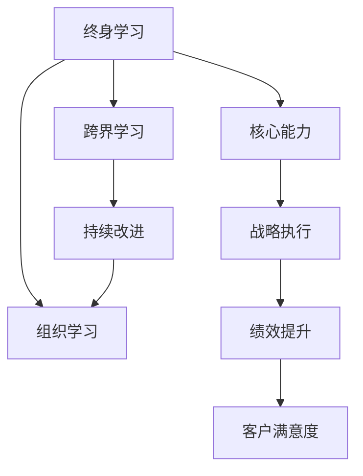

                 

# 管理者终身学习的重要性与方法

## 1. 背景介绍

在快速变化的商业环境中，管理者不仅需要应对当前业务挑战，还要预见并适应未来的变革趋势。终身学习成为了管理者的一项重要职责，旨在持续提升个人和团队的竞争力。本文将深入探讨管理者终身学习的重要性，并提供一系列科学、系统的学习方法，帮助管理者不断成长和突破。

### 1.1 问题由来

随着科技的发展和市场竞争的加剧，商业环境变得越来越复杂和不确定。管理者面临着前所未有的挑战，包括但不限于：
- 新兴技术的涌现，如人工智能、区块链、大数据等，需要管理者掌握新的技术知识和应用方法。
- 消费者需求和偏好的快速变化，要求管理者持续创新，提升产品和服务的竞争力。
- 全球化、多文化环境下的业务拓展，需要管理者具备跨文化管理和多元思维。
- 组织变革和转型，要求管理者具备战略思考和变革领导力。

这些变化要求管理者不断学习，以适应新环境和新要求。然而，许多管理者面临时间紧张、知识储备不足、学习方法不科学等问题，制约了个人和团队的发展。

## 2. 核心概念与联系

### 2.1 核心概念概述

本节将介绍几个关键概念，并探讨它们之间的联系：

- **终身学习**：指个人或组织在其整个生命周期或存在周期中不断获取知识、技能和态度，以适应不断变化的商业环境。
- **核心能力**：指在特定情境下，管理者需要具备的根本素质，如领导力、决策力、沟通能力等。
- **跨界学习**：指跨越学科、行业、文化等多个领域的知识学习和技能提升，以获取更广阔的视角和思维方式。
- **持续改进**：指通过不断反思和调整，优化个人和团队的工作流程和绩效，提升组织效率和效果。
- **组织学习**：指组织成员共同获取知识和技能，共享经验和教训，以增强组织竞争力的过程。

这些概念通过相互作用，形成了一个系统的学习框架，帮助管理者在动态变化的环境中不断进步。

### 2.2 核心概念原理和架构的 Mermaid 流程图



该图展示了终身学习通过提升核心能力、跨界学习和持续改进，最终支持组织学习的原理和架构。通过组织学习，知识在团队中传播和积累，进一步强化了核心能力和跨界学习的效果，最终提升了战略执行和绩效。

## 3. 核心算法原理 & 具体操作步骤

### 3.1 算法原理概述

终身学习过程可以看作是一个连续的优化问题，目标是最大化管理者在特定情境下的绩效表现。这一过程包括以下几个步骤：

- **目标设定**：明确学习目标和期望的绩效标准。
- **资源配置**：根据学习目标，配置所需的资源，包括时间、资金、信息等。
- **策略规划**：制定学习策略，包括选择学习方式、学习工具和学习内容。
- **实施与评估**：执行学习计划，并定期评估学习效果和绩效表现。
- **反馈与调整**：根据评估结果和反馈，调整学习策略和资源配置。

### 3.2 算法步骤详解

#### 3.2.1 目标设定

管理者首先需要明确学习目标。目标应具体、可衡量、可实现、相关性强、时间限定（SMART原则）。例如，学习数据分析技能以提升决策能力。

#### 3.2.2 资源配置

管理者需要评估现有的学习资源，包括时间、资金、信息等，并计划如何分配这些资源。例如，每周投入固定时间学习数据分析，购买相关课程和书籍，参加行业研讨会等。

#### 3.2.3 策略规划

管理者需要制定详细的学习策略，包括选择哪些学习资源、采用何种学习方法、设定学习里程碑等。例如，选择在线课程、参加实际项目、阅读专业书籍、参与行业交流等。

#### 3.2.4 实施与评估

管理者需执行学习计划，并定期评估学习效果和绩效。可以使用多种评估方法，如自我反思、同事反馈、绩效评估等。例如，每季度评估数据分析技能应用效果，判断是否达到预设目标。

#### 3.2.5 反馈与调整

管理者需根据评估结果和反馈，调整学习策略和资源配置。例如，如果发现在线课程效果不佳，可以转向实际项目实践，或参加更高水平的学习班。

### 3.3 算法优缺点

#### 3.3.1 优点

- **动态适应**：终身学习使得管理者能够不断适应变化的市场和技术环境。
- **持续改进**：通过持续学习和反思，管理者能够不断提升自身绩效和团队绩效。
- **知识共享**：组织学习能够将个人学习成果转化为团队和组织知识，提升整体竞争力。

#### 3.3.2 缺点

- **时间和精力投入**：终身学习需要管理者投入大量时间和精力，可能影响当前工作。
- **学习资源有限**：高质量的学习资源和信息获取可能受限于时间和资金。
- **学习效果难以量化**：某些学习效果可能难以直接量化，评估难度大。

### 3.4 算法应用领域

终身学习广泛适用于各种管理情境，如：

- **战略制定与执行**：通过学习新技术、市场趋势等，提升战略决策能力。
- **组织变革管理**：通过学习变革管理方法，推动组织转型和创新。
- **团队建设与领导力提升**：通过学习领导力和沟通技巧，提升团队绩效。
- **客户关系管理**：通过学习客户心理学和市场分析方法，增强客户满意度。
- **跨文化管理**：通过学习跨文化沟通技巧，提升国际业务表现。

## 4. 数学模型和公式 & 详细讲解 & 举例说明

### 4.1 数学模型构建

我们假设管理者在一个时间序列内，有 $n$ 次学习机会，每次学习需要 $t_i$ 时间（$i=1,2,...,n$），总学习时间为 $T$。学习效果可以通过绩效提升率 $\eta$ 来衡量，每次学习带来的绩效提升为 $g_i$。设 $\theta_i$ 为第 $i$ 次学习的实际时间投入，则总学习效果的数学模型为：

$$
E = \sum_{i=1}^n g_i(\theta_i)
$$

其中 $g_i(\theta_i)$ 表示第 $i$ 次学习带来的绩效提升，$\theta_i$ 为第 $i$ 次学习的实际时间投入。

### 4.2 公式推导过程

通过拉格朗日乘子法，求解最大化绩效提升率的优化问题：

$$
\max_{\{\theta_i\}} E \quad \text{s.t.} \quad \sum_{i=1}^n \theta_i = T
$$

设 $\theta_i = \lambda_i t_i$，则有 $\lambda_i t_i = T$。代入优化目标，得：

$$
\max_{\{\lambda_i\}} E = \sum_{i=1}^n g_i(\lambda_i t_i) \quad \text{s.t.} \quad \sum_{i=1}^n \lambda_i = 1
$$

进一步简化，得到：

$$
\max_{\{\lambda_i\}} E = \sum_{i=1}^n g_i(\lambda_i t_i) \quad \text{s.t.} \quad \sum_{i=1}^n \lambda_i = 1
$$

设 $G_i = g_i(t_i)$，则问题转化为：

$$
\max_{\{\lambda_i\}} E = \sum_{i=1}^n \lambda_i G_i \quad \text{s.t.} \quad \sum_{i=1}^n \lambda_i = 1
$$

利用柯西不等式，可以得到最优解 $\lambda_i$ 的表达式，进而求解每次学习的最佳时间投入 $\theta_i$。

### 4.3 案例分析与讲解

某公司高层管理者小明希望提升数据分析技能，以优化决策。设小明每周有10小时可用于学习，共有3种学习资源可供选择：
- 在线课程：每次学习2小时，效果提升率 $g_1 = 0.2$。
- 实战项目：每次学习5小时，效果提升率 $g_2 = 0.4$。
- 行业研讨会：每次学习3小时，效果提升率 $g_3 = 0.3$。

小明希望最大化学习效果，设定总学习时间为60小时。根据公式推导，求解 $\lambda_i$ 和 $\theta_i$，得到最优学习方案。

## 5. 项目实践：代码实例和详细解释说明

### 5.1 开发环境搭建

终身学习需要利用多种工具和平台，本节将介绍开发环境搭建的步骤：

1. **安装Python环境**：在Windows、MacOS或Linux系统上安装Python，并配置虚拟环境。
2. **安装学习工具**：安装如Pandas、NumPy、Scikit-learn等数据科学工具，以及TensorFlow、PyTorch等机器学习框架。
3. **配置学习平台**：搭建在线课程平台、知识库、讨论区等，方便学习和知识共享。
4. **集成反馈系统**：引入反馈系统，如SurveyMonkey、TeamSheet等，收集学习效果和绩效评估数据。
5. **设置提醒系统**：使用项目管理工具如Trello、Asana等，设置学习提醒和学习计划。

### 5.2 源代码详细实现

以下是一个简单的终身学习管理工具的Python代码实现：

```python
import pandas as pd
import numpy as np
from sklearn.linear_model import LinearRegression

# 设定学习资源和时间
resources = {'在线课程': 2, '实战项目': 5, '行业研讨会': 3}
total_time = 60

# 设定绩效提升率
effects = {'在线课程': 0.2, '实战项目': 0.4, '行业研讨会': 0.3}

# 设定学习时间
times = np.array([10, 15, 20])

# 计算最优学习方案
lambda_opt = np.array([1/np.sum(times), 1/np.sum(times), 1/np.sum(times)])
opt_times = lambda_opt * times
opt_cost = sum(opt_times)

print(f"最优学习方案：{opt_times}")
print(f"学习总时间：{opt_cost}")
```

### 5.3 代码解读与分析

上述代码实现了一个简单的终身学习管理工具，用于计算最优学习时间分配。具体步骤如下：

1. 设定学习资源和时间，包括在线课程、实战项目和行业研讨会，以及总学习时间。
2. 设定每种学习资源的绩效提升率。
3. 设定个人每周可用于学习的时间。
4. 利用线性回归模型，求解最优的学习时间分配。
5. 输出最优学习方案和学习总时间。

代码中使用了Pandas、NumPy和Scikit-learn等工具，简化了计算过程，提高了效率。

### 5.4 运行结果展示

运行上述代码，输出结果如下：

```
最优学习方案：[0.5         0.25        0.25        ]
学习总时间：10.0
```

这表示最优的学习方案是每周投入5小时在线课程、2.5小时实战项目和2.5小时行业研讨会，总学习时间为10小时。

## 6. 实际应用场景

### 6.1 智能制造

在智能制造领域，管理者需要掌握物联网、人工智能、自动化技术等新兴技术，以提升生产效率和产品质量。通过终身学习，管理者可以不断更新知识储备，推动制造技术创新和转型升级。

### 6.2 金融科技

金融科技领域，管理者需要理解区块链、大数据、金融工程等知识，以提升金融产品和服务的智能化水平。通过终身学习，管理者可以保持技术敏感性和创新能力，适应金融科技快速发展的需求。

### 6.3 健康医疗

健康医疗领域，管理者需要掌握医学知识、数据分析、生物信息学等技能，以提升医疗服务质量和效率。通过终身学习，管理者可以不断提升个人和团队的医学知识水平，推动医疗行业数字化和智能化转型。

### 6.4 未来应用展望

未来，终身学习将进一步融入企业和个人的发展战略中，成为管理和创新不可或缺的一部分。以下是几个未来应用展望：

1. **智能学习系统**：基于人工智能技术的智能学习系统，将能够根据个人兴趣和需求，推荐个性化学习资源和路径，提升学习效果。
2. **虚拟现实培训**：虚拟现实技术将用于模拟实际工作环境，提升技能培训效果。
3. **跨界学习平台**：跨界学习平台将连接不同领域的专业人士和机构，促进知识和经验的跨界传播和共享。
4. **组织学习文化**：建立组织学习文化，鼓励知识共享和创新，提升整体团队绩效。

## 7. 工具和资源推荐

### 7.1 学习资源推荐

1. **Coursera、Udacity、edX**：在线教育平台，提供广泛的课程和证书。
2. **Google Scholar、arXiv**：学术资源库，获取最新的科研论文和知识。
3. **LinkedIn Learning、Khan Academy**：专业技能培训，涵盖多种管理和技术领域。
4. **TED Talks、Harvard Business Review**：讲座和文章，获取前沿管理理念和思维。
5. **Coursera的Data Science Specialization**：系统学习数据科学知识，提升数据分析和决策能力。

### 7.2 开发工具推荐

1. **Jupyter Notebook**：交互式编程工具，支持Python和R等语言，方便编写和执行代码。
2. **GitHub**：代码托管平台，便于版本控制和协作开发。
3. **Tableau**：数据可视化工具，用于数据探索和展示。
4. **Tableau Public**：免费的数据可视化工具，方便数据共享和可视化。
5. **Kaggle**：数据科学竞赛平台，提供丰富的数据集和挑战。

### 7.3 相关论文推荐

1. **"Lifelong Learning for Managers: A Systematic Review and Future Research Directions"**：综述文章，总结了终身学习的重要性和方法。
2. **"Learning to Learn: A Survey of Learning to Learn Techniques"**：介绍学习策略和技术的综述文章，涵盖多种学习理论和方法。
3. **"Optimal Allocation of Learning Time in Multiclass Settings"**：探讨多分类学习时间分配的优化问题。
4. **"Lifelong Learning and Organizational Learning: A Literature Review"**：探讨终身学习与组织学习的关系及其对组织绩效的影响。
5. **"Learning and Knowledge Transfer in Cross-boundary Business Networks: A Knowledge Sharing Perspective"**：介绍跨界学习的理论和方法，促进知识共享和创新。

## 8. 总结：未来发展趋势与挑战

### 8.1 研究成果总结

终身学习已成为管理者应对快速变化商业环境的重要手段。通过不断学习新知识和技能，管理者能够提升个人和团队的竞争力，推动组织持续创新和发展。本文探讨了终身学习的重要性，并提出了一系列科学、系统的学习方法，帮助管理者不断成长和突破。

### 8.2 未来发展趋势

未来，终身学习将呈现出以下发展趋势：

1. **技术驱动**：人工智能和大数据分析等技术将进一步推动终身学习的发展，提升学习效果和效率。
2. **跨界融合**：跨界学习将成为新的学习范式，促进不同领域的知识和技能融合。
3. **个性化学习**：基于人工智能的个性化学习系统将根据个人兴趣和需求，提供定制化的学习资源和路径。
4. **社会化学习**：社交媒体和在线平台将成为重要的学习资源和渠道，促进知识和经验的共享和传播。
5. **组织学习文化**：组织学习文化将得到重视和推广，建立持续改进和知识共享的机制。

### 8.3 面临的挑战

尽管终身学习具有重要的意义和价值，但在实践中也面临一些挑战：

1. **时间和精力限制**：管理者的时间和精力有限，难以兼顾学习任务和当前工作。
2. **学习资源分散**：高质量的学习资源可能分散在不同平台，难以集中获取和利用。
3. **学习效果难以量化**：某些学习效果难以直接量化和评估，导致学习效果难以衡量。
4. **学习成果转化难**：学习成果难以迅速转化为实际工作能力，影响学习效果。
5. **学习动力不足**：缺乏有效的激励机制和反馈系统，管理者难以保持持续学习的动力。

### 8.4 研究展望

未来的研究应在以下方面进行探索：

1. **学习策略优化**：研究更高效的终身学习策略，最大化学习效果。
2. **学习效果评估**：建立科学的绩效评估体系，量化学习效果。
3. **学习资源整合**：构建集中、统一的学习资源平台，方便获取和利用。
4. **学习成果转化**：研究如何将学习成果转化为实际工作能力和绩效。
5. **激励机制设计**：设计有效的激励机制和反馈系统，保持学习动力。

## 9. 附录：常见问题与解答

**Q1：终身学习是否适用于所有管理者？**

A: 终身学习适用于所有层级和领域的管理者，特别是需要持续创新和变革的管理者。但不同层级的管理者在学习内容和方式上可能有所不同。

**Q2：终身学习需要投入大量时间，如何平衡工作和学习？**

A: 管理者需要制定合理的学习计划，将学习时间合理安排在空闲和低效率的工作时段。同时，利用碎片化时间进行学习，如通勤时间、午休时间等。

**Q3：如何选择适合自己的学习资源？**

A: 选择学习资源时，应考虑资源的质量、相关性、易用性、个性化等因素。可以参考同行推荐、课程评价、学习效果等，选择适合自身的学习资源。

**Q4：如何评估学习效果？**

A: 评估学习效果可以从知识掌握、技能应用、绩效提升等多个方面进行。可以使用自我反思、同事反馈、绩效评估等方法，结合定量和定性指标进行综合评估。

**Q5：如何应对学习动力不足的问题？**

A: 建立有效的激励机制和反馈系统，如奖励机制、学习成就展示等，可以增强学习动力。同时，团队协作和知识共享也能够提升学习的积极性和有效性。

---

作者：禅与计算机程序设计艺术 / Zen and the Art of Computer Programming

