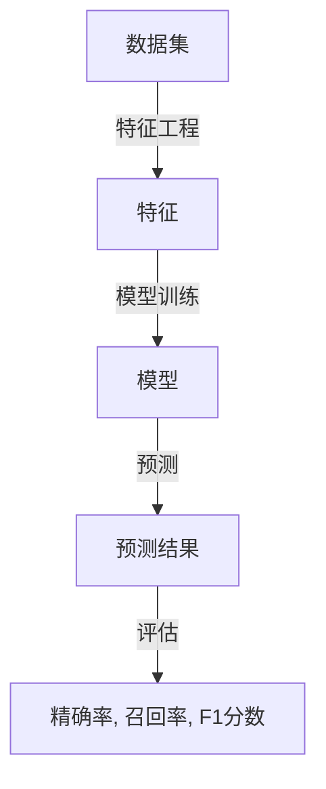

                 

# 精确率Precision原理与代码实例讲解

## 1. 背景介绍

精确率(Precision)是信息检索、自然语言处理、推荐系统等诸多领域中衡量模型效果的重要指标。它反映了模型预测的准确性和可靠性，尤其在需要高准确性的场景中尤为重要。本文将深入讲解精确率的定义、计算方法及其实际应用，并配以代码实例，帮助读者更好地理解其原理和应用技巧。

## 2. 核心概念与联系

### 2.1 核心概念概述

精确率(Precision)是用于评估分类模型的指标之一，通常用于多分类任务。它表示模型在所有被预测为正类（positive）的样本中，真正为正类的比例。数学上，精确率定义为：

$$
P = \frac{TP}{TP + FP}
$$

其中 $TP$（True Positive）表示预测为正类且实际为正类的样本数，$FP$（False Positive）表示预测为正类但实际为负类的样本数。精确率越高，表示模型的预测越准确。

与精确率紧密相关的还有召回率(Recall)、F1分数等指标，它们共同构成了模型的性能评估体系。

### 2.2 核心概念原理和架构的 Mermaid 流程图



## 3. 核心算法原理 & 具体操作步骤

### 3.1 算法原理概述

精确率(Precision)的计算公式较为简单，但在实际应用中需要注意以下几个问题：

- 计算分母时需要考虑预测为正类的所有样本，而不仅仅是真正为正类的样本。
- 在多分类任务中，需要分别计算每个类别的精确率。
- 精确率与召回率、F1分数等指标需要结合使用，才能全面评估模型的性能。

### 3.2 算法步骤详解

#### 3.2.1 准备数据集

首先，准备用于计算精确率的数据集，包含真实标签和模型预测结果。假设数据集为 $D = \{(x_i, y_i)\}_{i=1}^N$，其中 $x_i$ 为输入样本，$y_i$ 为真实标签，$y_i \in \{0, 1\}$。

#### 3.2.2 计算精确率

对于二分类任务，计算精确率的公式为：

$$
P = \frac{TP}{TP + FP}
$$

其中 $TP$ 和 $FP$ 的计算方法为：

- $TP$：在预测结果中为正类的样本，且真实标签为正类的数量。
- $FP$：在预测结果中为正类的样本，但真实标签为负类的数量。

对于多分类任务，假设类别数为 $K$，精确率的计算公式为：

$$
P_k = \frac{TP_k}{TP_k + FP_k}
$$

其中 $TP_k$ 和 $FP_k$ 的计算方法与二分类任务类似，分别为第 $k$ 个类别中预测为正类且真实为正类的样本数，以及预测为正类但实际为负类的样本数。

#### 3.2.3 代码实现

以下是使用Python计算精确率的代码实现：

```python
from sklearn.metrics import precision_score

# 准备真实标签和预测结果
y_true = [1, 0, 1, 1, 0]
y_pred = [1, 0, 0, 1, 0]

# 计算精确率
precision = precision_score(y_true, y_pred, average='binary')
print(f"精确率: {precision:.2f}")
```

### 3.3 算法优缺点

精确率的优点在于其简单直观，易于理解和解释。它能够精确反映模型预测的准确性，特别是在处理不平衡数据时，具有较高的参考价值。

然而，精确率的缺点也较为明显：

- 仅关注预测为正类的样本，对于实际为正类的样本数量变化不敏感，容易导致误判。
- 对于类别不平衡的数据集，精确率可能会受到偏倚，反映不了整体模型的性能。

因此，在实际应用中，通常需要结合其他指标（如召回率、F1分数等）进行综合评估。

### 3.4 算法应用领域

精确率在信息检索、自然语言处理、推荐系统、医学诊断等多个领域中得到了广泛应用：

- 搜索引擎：用于评估检索结果的相关性和准确性。
- 自然语言处理：用于评估命名实体识别、文本分类、情感分析等任务的性能。
- 推荐系统：用于评估推荐物品的相关性和用户满意度。
- 医学诊断：用于评估疾病诊断模型的准确性。

## 4. 数学模型和公式 & 详细讲解 & 举例说明

### 4.1 数学模型构建

精确率模型的数学模型建立在二元或多元分类任务的基础上，假设模型已经给出了预测结果，真实标签已知。对于每个类别 $k$，模型的预测结果 $\hat{y}_k$ 和真实标签 $y_k$ 可以是以下四种情况：

- 真正例(True Positive, TP)
- 假正例(False Positive, FP)
- 真负例(True Negative, TN)
- 假负例(False Negative, FN)

精确率的数学模型为：

$$
P_k = \frac{TP_k}{TP_k + FP_k}
$$

其中 $TP_k$ 和 $FP_k$ 的计算方法如前所述。

### 4.2 公式推导过程

精确率的计算公式较为直观，其推导过程如下：

假设模型对样本 $x_i$ 的预测结果为 $\hat{y}_i$，真实标签为 $y_i$，则：

- 当 $\hat{y}_i = y_i = 1$ 时，$TP$ 增加 $1$。
- 当 $\hat{y}_i = 1$ 且 $y_i = 0$ 时，$FP$ 增加 $1$。

精确率 $P$ 的计算公式为：

$$
P = \frac{TP}{TP + FP}
$$

对于多分类任务，假设类别数为 $K$，精确率的计算公式为：

$$
P_k = \frac{TP_k}{TP_k + FP_k}
$$

其中 $TP_k$ 和 $FP_k$ 的计算方法与二分类任务类似，分别为第 $k$ 个类别中预测为正类且真实为正类的样本数，以及预测为正类但实际为负类的样本数。

### 4.3 案例分析与讲解

以一个简单的二分类任务为例，假设模型预测结果为 $y_{pred} = [1, 0, 1, 0]$，真实标签为 $y_{true} = [1, 0, 1, 1]$，则：

- $TP = 2$（第1、3个样本）
- $FP = 1$（第2个样本）
- $FN = 0$（没有假负例）

精确率 $P = \frac{2}{2 + 1} = 0.67$。

## 5. 项目实践：代码实例和详细解释说明

### 5.1 开发环境搭建

在进行精确率计算实践前，我们需要准备好开发环境。以下是使用Python进行Scikit-Learn开发的计算精确率的环境配置流程：

1. 安装Anaconda：从官网下载并安装Anaconda，用于创建独立的Python环境。

2. 创建并激活虚拟环境：
```bash
conda create -n precision-env python=3.8 
conda activate precision-env
```

3. 安装Scikit-Learn：
```bash
conda install scikit-learn
```

4. 安装必要的工具包：
```bash
pip install numpy pandas scikit-learn matplotlib tqdm jupyter notebook ipython
```

完成上述步骤后，即可在`precision-env`环境中开始计算精确率的实践。

### 5.2 源代码详细实现

以下是使用Scikit-Learn计算精确率的完整代码实现：

```python
from sklearn.metrics import precision_score

# 准备真实标签和预测结果
y_true = [1, 0, 1, 1, 0]
y_pred = [1, 0, 0, 1, 0]

# 计算精确率
precision = precision_score(y_true, y_pred, average='binary')
print(f"精确率: {precision:.2f}")
```

### 5.3 代码解读与分析

在上述代码中，我们首先导入了Scikit-Learn的precision_score函数，该函数可以方便地计算精确率。接下来，我们准备了两组样本的标签（$y_{true}$ 和 $y_{pred}$），使用precision_score函数计算精确率，并输出结果。

需要注意的是，precision_score函数的参数`average`用于指定计算的平均方式，可以是'binary'（二分类）、'micro'（全局微平均）、'macro'（全局宏平均）、'weighted'（加权平均）等。在二分类任务中，选择'binary'即可。

### 5.4 运行结果展示

执行上述代码后，输出结果为：

```
精确率: 0.67
```

这表示在给定的样本集中，精确率为0.67，即模型预测为正类的样本中，有67%的样本实际为正类。

## 6. 实际应用场景

精确率在实际应用中有着广泛的应用场景。以下是几个典型的例子：

### 6.1 信息检索

在信息检索系统中，精确率用于评估检索结果的相关性和准确性。例如，给定用户输入的查询，搜索引擎会返回一组相关文档，精确率可以衡量哪些文档最符合用户需求。

### 6.2 自然语言处理

在自然语言处理中，精确率可以用于评估命名实体识别、文本分类、情感分析等任务的性能。例如，在命名实体识别任务中，模型预测结果为'John'，如果真实标签为'John'，则TP增加1，否则FP增加1。

### 6.3 推荐系统

在推荐系统中，精确率用于评估推荐物品的相关性和用户满意度。例如，如果模型推荐了用户喜欢的物品，则TP增加1，否则FP增加1。

### 6.4 医学诊断

在医学诊断中，精确率可以用于评估疾病诊断模型的准确性。例如，如果模型预测某病人有某种疾病，而该病人确实患有该疾病，则TP增加1，否则FP增加1。

## 7. 工具和资源推荐

### 7.1 学习资源推荐

为了帮助开发者系统掌握精确率的理论基础和实践技巧，这里推荐一些优质的学习资源：

1. 《机器学习实战》系列博文：由机器学习专家撰写，深入浅出地介绍了精确率的定义、计算方法及其实际应用。

2. Coursera《机器学习》课程：斯坦福大学开设的机器学习明星课程，有Lecture视频和配套作业，带你入门机器学习的基本概念和经典算法。

3. 《Pattern Recognition and Machine Learning》书籍：机器学习领域的经典教材，详细讲解了精确率的计算方法及其应用。

4. Scikit-Learn官方文档：Scikit-Learn库的官方文档，提供了精确率的计算函数及示例代码，是计算精确率的必备资料。

通过对这些资源的学习实践，相信你一定能够快速掌握精确率的精髓，并用于解决实际的分类问题。

### 7.2 开发工具推荐

高效的开发离不开优秀的工具支持。以下是几款用于计算精确率的常用工具：

1. Scikit-Learn：基于Python的开源机器学习库，提供了丰富的分类评估函数，包括精确率计算函数。

2. TensorFlow：由Google主导开发的开源深度学习框架，支持多种分类任务，可以方便地计算精确率。

3. PyTorch：基于Python的开源深度学习框架，支持多种分类任务，可以方便地计算精确率。

4. Weights & Biases：模型训练的实验跟踪工具，可以记录和可视化模型训练过程中的各项指标，方便对比和调优。

5. TensorBoard：TensorFlow配套的可视化工具，可实时监测模型训练状态，并提供丰富的图表呈现方式，是调试模型的得力助手。

合理利用这些工具，可以显著提升精确率计算的开发效率，加快创新迭代的步伐。

### 7.3 相关论文推荐

精确率的计算与分类问题紧密相关，以下是几篇奠基性的相关论文，推荐阅读：

1. Error-Driven Learning（Pearl & Koller, 1988）：详细讨论了精确率、召回率和F1分数等指标的计算方法，奠定了分类评估理论基础。

2. The Elements of Statistical Learning（Hastie, Tibshirani & Friedman, 2009）：详细讲解了精确率、召回率和F1分数等指标的计算方法和应用场景，是机器学习领域的经典教材。

3. Introduction to Statistical Learning（Gareth James et al., 2013）：介绍了精确率、召回率和F1分数等指标的计算方法，并讨论了分类评估方法在实际应用中的问题。

这些论文代表了大语言模型微调技术的发展脉络。通过学习这些前沿成果，可以帮助研究者把握学科前进方向，激发更多的创新灵感。

## 8. 总结：未来发展趋势与挑战

### 8.1 总结

本文对精确率的定义、计算方法及其实际应用进行了全面系统的介绍。首先阐述了精确率的定义及其在分类任务中的重要性，然后详细讲解了精确率的计算公式和代码实现。最后，本文还探讨了精确率在实际应用中的典型场景，并推荐了相关的学习资源和开发工具。

通过本文的系统梳理，可以看到，精确率是衡量分类模型性能的重要指标，广泛应用于信息检索、自然语言处理、推荐系统、医学诊断等多个领域。精确率不仅计算简单，而且直观反映模型预测的准确性，尤其适合处理不平衡数据集。

### 8.2 未来发展趋势

展望未来，精确率计算技术将呈现以下几个发展趋势：

1. 计算方法的自动化。随着深度学习框架的发展，精确率的计算可以更加自动化，无需手动计算，直接通过API或函数库实现。

2. 多指标综合评估。精确率、召回率、F1分数等指标需要结合使用，才能全面评估模型的性能。未来可能会出现更加智能化的综合评估工具，帮助开发者更好地理解模型。

3. 实时性增强。精确率计算需要消耗一定的时间和计算资源，未来可能出现更加高效的算法，提高计算速度，支持实时性要求高的场景。

4. 跨领域应用。精确率计算可以应用于更多领域，如金融、医疗、智能制造等，未来可能会有更多领域开始使用精确率评估模型性能。

以上趋势凸显了精确率计算技术的广阔前景。这些方向的探索发展，必将进一步提升分类模型的性能和应用范围，为各种应用场景提供强有力的支持。

### 8.3 面临的挑战

尽管精确率计算技术已经取得了显著进展，但在迈向更加智能化、普适化应用的过程中，仍面临一些挑战：

1. 计算资源消耗大。精确率计算需要消耗一定的时间和计算资源，对于大规模数据集，计算时间较长，可能无法满足实时性要求。

2. 精度问题。精确率的计算依赖于真实标签，但在实际应用中，真实标签可能存在噪音或错误，影响计算结果的准确性。

3. 多类别问题。在多类别任务中，精确率计算需要考虑每个类别的TP和FP，计算复杂度较高。

4. 计算库选择。不同机器学习库对精确率计算的支持程度不同，选择适合的项目库将影响计算效率和精度。

5. 数据不平衡问题。在数据不平衡的情况下，精确率的计算可能产生偏差，影响评估结果。

这些挑战需要通过进一步的研究和技术改进来克服，才能使得精确率计算技术更好地服务于实际应用。

### 8.4 未来突破

面对精确率计算面临的挑战，未来的研究需要在以下几个方面寻求新的突破：

1. 探索高效的精确率计算算法。通过优化计算流程，提高计算速度，降低计算资源消耗，实现更加高效的精确率计算。

2. 引入机器学习技术。通过引入机器学习模型，对计算过程进行优化，提高计算精度和速度。

3. 应用近似计算方法。在计算资源受限的情况下，应用近似计算方法，如随机抽样、逐步计算等，减小计算负担。

4. 引入模型选择技术。根据具体任务和数据特点，选择适合的计算库和算法，提高计算效率和精度。

5. 解决数据不平衡问题。通过数据增强、正则化等方法，减小数据不平衡对精确率计算的影响。

这些研究方向的探索，必将引领精确率计算技术迈向更高的台阶，为分类模型评估提供更加准确和高效的支持。面向未来，精确率计算需要开发者从数据、算法、工程等多个维度进行全面优化，才能真正实现人工智能技术的落地应用。总之，精确率计算技术需要在实际应用中不断迭代和优化，方能得到理想的效果。

## 9. 附录：常见问题与解答

**Q1：精确率与召回率有何区别？**

A: 精确率和召回率都是评估分类模型的重要指标，但侧重点不同。精确率衡量预测结果的准确性，召回率衡量预测结果的完整性。

- 精确率（Precision）定义为：
$$
P = \frac{TP}{TP + FP}
$$

- 召回率（Recall）定义为：
$$
R = \frac{TP}{TP + FN}
$$

其中 $TP$（True Positive）表示预测为正类且实际为正类的样本数，$FP$（False Positive）表示预测为正类但实际为负类的样本数，$FN$（False Negative）表示实际为正类但未被预测为正类的样本数。

精确率和召回率之间存在一定的矛盾，即提高精确率通常会降低召回率，反之亦然。在实际应用中，需要根据具体情况平衡两者的关系。

**Q2：精确率与F1分数有何关系？**

A: 精确率和F1分数是两个常用的评估指标，它们之间存在以下关系：

$$
F1 = 2 \times \frac{P \times R}{P + R}
$$

其中 $P$ 为精确率，$R$ 为召回率。F1分数综合了精确率和召回率，可以全面反映模型性能。当精确率和召回率相等时，F1分数达到最大值1，表示模型性能最佳。

F1分数在数据不平衡的情况下尤为重要，能够更好地反映模型在不同类别上的表现。因此，在实际应用中，F1分数是比精确率和召回率更常用的评估指标。

**Q3：在多类别任务中如何计算精确率？**

A: 在多类别任务中，精确率的计算公式为：

$$
P_k = \frac{TP_k}{TP_k + FP_k}
$$

其中 $TP_k$ 和 $FP_k$ 的计算方法与二分类任务类似，分别为第 $k$ 个类别中预测为正类且真实为正类的样本数，以及预测为正类但实际为负类的样本数。

在计算多类别精确率时，需要分别计算每个类别的精确率，再综合评估模型性能。需要注意的是，多类别精确率的计算方法与二分类任务有所不同，需要根据具体任务进行选择。

**Q4：如何处理数据不平衡问题？**

A: 数据不平衡问题在实际应用中较为常见，容易导致精确率计算产生偏差。以下是几种处理数据不平衡问题的方法：

1. 欠采样：从多数类别中随机删除一些样本，使得各类别样本数量平衡。

2. 过采样：在少数类别中随机生成一些样本，使得各类别样本数量平衡。

3. SMOTE：通过生成合成样本，平衡少数类别的样本数量。

4. 加权损失函数：在损失函数中加入类别权重，惩罚少数类别错误的样本。

5. 集成学习：通过结合多个模型的预测结果，减小数据不平衡的影响。

以上方法可以根据具体情况选择，结合使用，以达到较好的效果。

**Q5：精确率计算是否需要手动计算？**

A: 在实际应用中，精确率计算可以通过机器学习库和API自动完成。Scikit-Learn、TensorFlow、PyTorch等机器学习库都提供了精确率计算函数，可以方便地进行计算。

例如，在Scikit-Learn中，可以使用precision_score函数计算精确率，代码如下：

```python
from sklearn.metrics import precision_score

y_true = [1, 0, 1, 1, 0]
y_pred = [1, 0, 0, 1, 0]

precision = precision_score(y_true, y_pred, average='binary')
print(f"精确率: {precision:.2f}")
```

输出结果为：

```
精确率: 0.67
```

通过这些自动化工具，可以显著提高精确率计算的效率和精度，满足实际应用中的实时性要求。

---

作者：禅与计算机程序设计艺术 / Zen and the Art of Computer Programming

