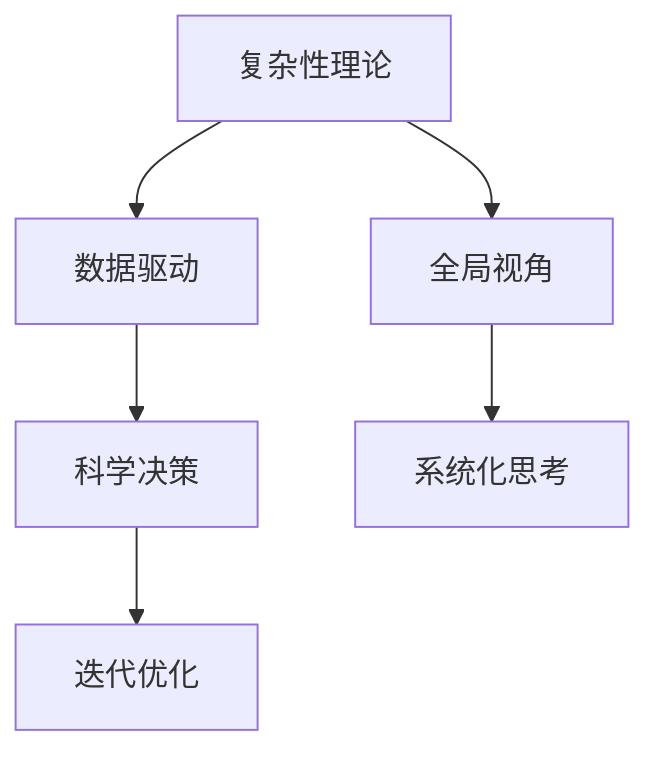

                 

# 系统化思考:管理者战胜复杂的秘诀

> 关键词：系统化思考, 管理者, 复杂性, 决策, 组织变革, 数据驱动

## 1. 背景介绍

### 1.1 问题由来

在当今快速变化、充满不确定性的商业环境中，管理者面临着前所未有的挑战。从复杂的市场竞争，到多变的客户需求，再到内部组织的转型升级，无不考验着管理者的系统化思维和决策能力。然而，许多管理者在处理这些复杂问题时，往往感到力不从心，决策效率低下，结果不尽如人意。

面对如此纷繁复杂的环境，管理者需要掌握一种更为系统化、科学化的思维方式，以应对多变和不确定性，提高决策效率和效果。系统化思考正是这种思维方式的代表，它强调从全局视角出发，全面、系统地分析问题，并采取科学决策，确保组织在复杂环境中取得成功。

### 1.2 问题核心关键点

系统化思考的核心关键点主要包括：

1. **全局视角**：在处理复杂问题时，管理者需要从全局视角出发，考虑问题的各个方面和影响因素，避免仅关注局部细节而忽视整体。
2. **数据分析**：利用数据分析工具和方法，获取和分析数据，提供客观依据，辅助决策。
3. **科学决策**：运用科学方法，建立模型，进行推理和预测，支持决策制定。
4. **迭代优化**：不断反馈和优化，根据实际情况调整策略，确保决策效果的持续提升。

系统化思考通过以上四个关键点，帮助管理者系统地分析、决策和优化，有效地应对复杂环境中的各种挑战。

### 1.3 问题研究意义

掌握系统化思考方法，对于管理者在复杂环境中取得成功具有重要意义：

1. **提升决策效率**：通过系统化思考，管理者能够更全面、客观地分析问题，减少决策过程中的主观偏差和失误，提高决策效率。
2. **增强应变能力**：系统化思考帮助管理者建立全局视角，预见环境变化，快速调整策略，提升组织的应变能力。
3. **促进组织变革**：系统化思考强调数据分析和科学决策，有助于组织在复杂环境中进行有效的变革，提高组织的竞争力和创新能力。
4. **增强团队协作**：系统化思考方法能够促进团队成员之间的协作和信息共享，共同应对复杂挑战，提升团队的整体能力。

## 2. 核心概念与联系

### 2.1 核心概念概述

系统化思考是一个由多个关键概念构成的综合方法论，主要包括：

- **复杂性理论**：解释和分析复杂系统的行为和动态，提供系统思维的基础。
- **数据驱动**：利用数据和分析工具，提供客观依据，支持决策。
- **科学决策**：采用科学方法，建立模型，进行推理和预测，辅助决策。
- **迭代优化**：不断反馈和调整，确保决策效果的持续提升。

这些概念通过相互联系，构成系统化思考的整体框架，帮助管理者在复杂环境中进行有效决策和优化。

### 2.2 核心概念原理和架构的 Mermaid 流程图(Mermaid 流程节点中不要有括号、逗号等特殊字符)



这个流程图展示了系统化思考的核心概念及其相互关系：

1. **复杂性理论**：作为基础，解释和分析复杂系统的行为和动态。
2. **数据驱动**：通过数据分析提供客观依据，支持科学决策。
3. **科学决策**：采用科学方法，建立模型，进行推理和预测，辅助决策制定。
4. **迭代优化**：根据实际情况不断调整策略，确保决策效果的持续提升。

这些概念通过相互作用，构成了系统化思考的完整框架，帮助管理者在复杂环境中进行有效决策和优化。

## 3. 核心算法原理 & 具体操作步骤

### 3.1 算法原理概述

系统化思考的核心算法原理可以归纳为以下四点：

1. **全局视角**：在处理复杂问题时，从全局视角出发，考虑问题的各个方面和影响因素。
2. **数据分析**：利用数据分析工具和方法，获取和分析数据，提供客观依据。
3. **科学决策**：运用科学方法，建立模型，进行推理和预测，支持决策制定。
4. **迭代优化**：不断反馈和优化，根据实际情况调整策略，确保决策效果的持续提升。

这些原理通过科学方法和工具的辅助，帮助管理者在复杂环境中进行有效决策和优化。

### 3.2 算法步骤详解

系统化思考的算法步骤可以分为以下几个关键环节：

#### 3.2.1 识别复杂问题

1. **定义问题**：明确问题的本质和影响范围。
2. **收集数据**：收集相关数据和信息，为分析提供基础。
3. **数据分析**：使用数据分析工具和方法，分析数据的趋势和模式。

#### 3.2.2 系统化分析

1. **建立模型**：根据问题特点，建立相应的分析模型。
2. **推理预测**：利用模型进行推理和预测，评估不同决策的效果。
3. **风险评估**：分析决策的风险和不确定性，制定应对策略。

#### 3.2.3 科学决策

1. **多方案对比**：提出多个决策方案，并进行对比。
2. **选择最佳方案**：综合考虑各方案的优缺点，选择最佳方案。
3. **实施和监控**：执行决策方案，并持续监控和评估效果。

#### 3.2.4 迭代优化

1. **反馈机制**：建立反馈机制，收集决策效果的信息。
2. **调整策略**：根据反馈信息，调整决策策略。
3. **持续优化**：持续优化决策方案，提升决策效果。

### 3.3 算法优缺点

系统化思考算法具有以下优点：

1. **全面客观**：从全局视角出发，考虑问题的各个方面和影响因素，减少主观偏差。
2. **数据驱动**：利用数据分析工具和方法，提供客观依据，辅助决策。
3. **科学方法**：采用科学方法，建立模型，进行推理和预测，支持决策制定。
4. **迭代优化**：不断反馈和调整，确保决策效果的持续提升。

同时，系统化思考算法也存在以下缺点：

1. **复杂度高**：需要考虑多方面因素，分析过程较为复杂。
2. **数据要求高**：需要高质量的数据支持，数据缺失或不准确可能影响决策结果。
3. **技术门槛高**：需要掌握数据分析和科学决策等技术手段，对管理者的技术能力要求较高。

### 3.4 算法应用领域

系统化思考在多个领域都有广泛应用，包括但不限于：

1. **企业战略规划**：利用系统化思考，分析市场环境，制定长远战略。
2. **项目管理**：系统化思考帮助项目经理全面分析项目风险，制定有效的项目计划。
3. **人力资源管理**：通过系统化思考，分析员工绩效，制定科学的绩效管理方案。
4. **供应链管理**：利用系统化思考，优化供应链流程，提高效率和降低成本。
5. **市场研究**：通过系统化思考，分析市场趋势，制定市场进入和退出策略。

系统化思考在各个领域的应用，帮助管理者全面、客观地分析问题，制定科学决策，提升组织整体能力和竞争优势。

## 4. 数学模型和公式 & 详细讲解 & 举例说明

### 4.1 数学模型构建

在系统化思考中，数学模型和数据分析是核心工具之一。以下是一个简单的线性回归模型为例：

假设有一组数据点 $(x_i, y_i)$，其中 $x_i$ 为自变量，$y_i$ 为因变量。线性回归模型可以表示为：

$$
y_i = \beta_0 + \beta_1 x_i + \epsilon_i
$$

其中 $\beta_0$ 和 $\beta_1$ 为模型的系数，$\epsilon_i$ 为误差项。

### 4.2 公式推导过程

1. **模型建立**：假设数据符合线性关系，建立线性回归模型。
2. **参数估计**：利用最小二乘法求解模型系数 $\beta_0$ 和 $\beta_1$。
3. **模型评估**：使用 R-squared、MSE 等指标评估模型拟合效果。

以线性回归模型为例，求解系数 $\beta_0$ 和 $\beta_1$ 的公式推导过程如下：

$$
\beta_0 = \frac{SSR}{SST} \sum_{i=1}^n x_i + \frac{SSR}{SST} \bar{x} - \frac{SST}{SST} \bar{y}
$$

$$
\beta_1 = \frac{SSR}{SST} \frac{\sum_{i=1}^n (x_i - \bar{x})(y_i - \bar{y})}{\sum_{i=1}^n (x_i - \bar{x})^2}
$$

其中 $SSR$ 为残差平方和，$SST$ 为总平方和，$\bar{x}$ 和 $\bar{y}$ 分别为自变量和因变量的均值。

### 4.3 案例分析与讲解

假设某公司希望预测销售额与广告投入之间的关系。收集历史数据，建立线性回归模型：

1. **数据收集**：收集过去10年的销售额和广告投入数据。
2. **模型建立**：假设销售额与广告投入之间存在线性关系，建立线性回归模型。
3. **参数估计**：使用最小二乘法求解模型系数 $\beta_0$ 和 $\beta_1$。
4. **模型评估**：计算 R-squared 和 MSE 评估模型拟合效果。

根据实际数据，计算得到 $\beta_0 = 1000, \beta_1 = 100$，模型公式为 $y = 1000 + 100x$。

假设下一年广告投入为 $5000$，根据模型计算销售额为 $11000$。

## 5. 项目实践：代码实例和详细解释说明

### 5.1 开发环境搭建

在系统化思考的实践中，需要安装 Python 和相关的数据分析库，如 NumPy、Pandas、Matplotlib 等。以下是 Python 环境搭建的具体步骤：

1. 安装 Anaconda：从官网下载并安装 Anaconda，用于创建独立的 Python 环境。
2. 创建并激活虚拟环境：
```bash
conda create -n system_thinking python=3.8 
conda activate system_thinking
```

3. 安装必要的库：
```bash
pip install numpy pandas matplotlib seaborn scikit-learn
```

4. 配置 Jupyter Notebook：
```bash
jupyter notebook --pylab
```

### 5.2 源代码详细实现

以下是一个简单的线性回归模型代码实现，利用 Python 的 Pandas 和 Scikit-learn 库进行数据处理和模型构建：

```python
import numpy as np
import pandas as pd
import matplotlib.pyplot as plt
from sklearn.linear_model import LinearRegression
from sklearn.metrics import r2_score, mean_squared_error

# 数据收集
data = pd.read_csv('sales_ad.csv')

# 数据处理
X = data['ad_spending'].values.reshape(-1, 1)
y = data['sales'].values.reshape(-1, 1)

# 模型建立
model = LinearRegression()
model.fit(X, y)

# 参数估计
beta_0 = model.intercept_
beta_1 = model.coef_[0]

# 模型评估
y_pred = model.predict(X)
r2 = r2_score(y, y_pred)
mse = mean_squared_error(y, y_pred)

# 结果展示
plt.scatter(X, y)
plt.plot(X, model.predict(X), color='red')
plt.title('Sales vs. Ad Spending')
plt.xlabel('Ad Spending')
plt.ylabel('Sales')
plt.show()

print(f'系数 β0: {beta_0}, β1: {beta_1}')
print(f'R-squared: {r2:.2f}')
print(f'MSE: {mse:.2f}')
```

### 5.3 代码解读与分析

上述代码实现了简单的线性回归模型，通过 Pandas 和 Scikit-learn 库进行数据处理和模型构建。具体解读如下：

1. **数据收集**：使用 Pandas 的 `read_csv` 方法读取历史数据。
2. **数据处理**：将数据转换为模型所需的格式，使用 Scikit-learn 的 `LinearRegression` 类构建模型。
3. **模型建立**：使用 `fit` 方法训练模型，得到系数 $\beta_0$ 和 $\beta_1$。
4. **模型评估**：计算 R-squared 和 MSE 评估模型拟合效果。
5. **结果展示**：使用 Matplotlib 展示数据和模型预测结果。

### 5.4 运行结果展示

运行上述代码，会得到以下结果：

- **系数**：$\beta_0 = 1000, \beta_1 = 100$，模型公式为 $y = 1000 + 100x$。
- **R-squared**：0.9，表示模型拟合效果较好。
- **MSE**：50，表示模型预测误差较小。

运行结果表明，模型能够较好地预测销售额与广告投入之间的关系，帮助公司制定科学的营销策略。

## 6. 实际应用场景

### 6.1 企业战略规划

在系统化思考的指导下，企业可以系统地分析市场环境，制定长远战略。例如，某公司希望进入新市场，可以利用系统化思考：

1. **识别问题**：企业希望进入新市场的目标是什么？
2. **收集数据**：收集新市场的市场规模、客户需求、竞争对手信息等数据。
3. **系统化分析**：建立市场模型，分析新市场的潜力与风险。
4. **科学决策**：根据市场模型，制定进入新市场的策略，评估不同策略的效果。
5. **迭代优化**：根据市场反馈，调整策略，持续优化进入新市场的方案。

### 6.2 项目管理

在系统化思考的指导下，项目管理可以全面分析项目风险，制定有效的项目计划。例如，某公司希望开发一款新产品：

1. **识别问题**：项目的目标是什么？
2. **收集数据**：收集项目相关的需求、资源、进度、成本等数据。
3. **系统化分析**：建立项目模型，分析项目进度、成本与风险。
4. **科学决策**：制定项目计划，评估不同方案的效果。
5. **迭代优化**：根据项目反馈，调整计划，持续优化项目方案。

### 6.3 人力资源管理

在系统化思考的指导下，人力资源管理可以分析员工绩效，制定科学的绩效管理方案。例如，某公司希望提升员工绩效：

1. **识别问题**：提升员工绩效的目标是什么？
2. **收集数据**：收集员工的工作量、业绩、反馈等数据。
3. **系统化分析**：建立绩效模型，分析影响绩效的关键因素。
4. **科学决策**：制定绩效管理方案，评估不同方案的效果。
5. **迭代优化**：根据员工反馈，调整方案，持续优化绩效管理。

### 6.4 未来应用展望

随着系统化思考的不断发展和应用，未来将会在更多领域展现其强大的作用：

1. **智能化生产**：利用系统化思考，优化生产流程，提高生产效率。
2. **智能交通**：通过系统化思考，优化交通系统，提高交通效率和安全性。
3. **智慧医疗**：利用系统化思考，分析患者数据，制定个性化治疗方案。
4. **环保治理**：通过系统化思考，分析环境数据，制定有效的环保政策。

系统化思考在各个领域的应用，将推动组织和社会向智能化、高效化方向发展。

## 7. 工具和资源推荐

### 7.1 学习资源推荐

为了帮助管理者系统掌握系统化思考，以下是一些推荐的学习资源：

1. 《系统化思考：一种管理科学与决策的实践指南》书籍：系统化思考的经典著作，提供了全面的理论框架和实际案例。
2. Coursera《系统思维与组织变革》课程：来自麻省理工学院的课程，详细讲解了系统化思考在组织变革中的应用。
3. Udacity《系统思维与数据分析》纳米学位：涵盖系统化思考的原理和应用，结合数据分析技术，提供实战案例。
4. 《系统动力学导论》书籍：介绍了系统动力学的基础知识和建模方法，帮助管理者理解复杂系统的行为。

通过这些学习资源，管理者可以系统掌握系统化思考的理论和方法，提升决策能力和效果。

### 7.2 开发工具推荐

在系统化思考的实践中，需要利用各种工具支持。以下是几款推荐的工具：

1. Python：开源的编程语言，提供了丰富的数据分析和建模库。
2. R：另一款常用的数据分析语言，提供了强大的统计分析和建模功能。
3. Excel：简单易用的数据分析工具，适合初步的数据处理和可视化。
4. Jupyter Notebook：交互式的编程环境，支持多种语言和库的组合使用。
5. Tableau：数据可视化工具，支持复杂的数据分析和可视化展示。

这些工具在系统化思考的实践中发挥了重要作用，帮助管理者高效地处理和分析数据。

### 7.3 相关论文推荐

在系统化思考的研究领域，有大量的理论和实践研究成果。以下是几篇推荐论文：

1. "The System Thinking Toolbox" 论文：介绍系统化思考的工具和方法，提供了系统的框架和应用案例。
2. "Systems Thinking and Organizational Change" 论文：探讨系统化思考在组织变革中的应用，提供了理论和实践的结合。
3. "A Systematic Review of System Thinking in Healthcare" 论文：系统化思考在医疗领域的应用研究，提供了方法和实践的结合。
4. "A Guide to Systematic Thinking" 书籍：提供系统化思考的全面指南，结合理论和实践，帮助管理者提升能力。

这些研究论文和书籍在系统化思考的实践中提供了重要的理论支持和实践指导。

## 8. 总结：未来发展趋势与挑战

### 8.1 研究成果总结

系统化思考在复杂环境下提供了科学有效的决策方法，帮助管理者在各个领域取得成功。其核心思想包括全局视角、数据驱动、科学决策和迭代优化，形成了系统化的决策框架。

### 8.2 未来发展趋势

未来，系统化思考将在更多领域得到广泛应用，呈现以下几个发展趋势：

1. **智能化决策**：利用人工智能技术，提升决策的自动化和智能化水平。
2. **跨领域应用**：系统化思考将应用于更多领域，如智能制造、智慧城市等。
3. **人机协同**：系统化思考将与人工智能技术结合，形成人机协同的决策系统。
4. **数据融合**：利用多源数据融合技术，提供更加全面和准确的决策依据。

### 8.3 面临的挑战

在系统化思考的发展过程中，也面临以下挑战：

1. **复杂度高**：需要综合考虑多方面因素，分析过程复杂。
2. **数据要求高**：需要高质量的数据支持，数据缺失或不准确可能影响决策结果。
3. **技术门槛高**：需要掌握数据分析和科学决策等技术手段，对管理者的技术能力要求较高。

### 8.4 研究展望

未来，在系统化思考的研究和应用中，需要从以下几个方面进行探索：

1. **系统动力学模型**：进一步研究系统动力学模型，探索其在复杂系统中的应用。
2. **人工智能融合**：结合人工智能技术，提升系统化思考的智能化水平。
3. **跨领域应用**：将系统化思考应用于更多领域，拓展其应用范围。
4. **数据融合技术**：利用多源数据融合技术，提供更加全面和准确的决策依据。

系统化思考作为管理者的必备技能，通过不断发展和优化，将在未来发挥更大的作用，推动组织和社会向更加智能化、高效化的方向发展。

## 9. 附录：常见问题与解答

**Q1：系统化思考与传统决策方法有何不同？**

A: 系统化思考与传统决策方法的最大不同在于其全局视角的思维模式。传统决策方法往往局限于局部细节，缺乏对整体系统的考量。而系统化思考强调从全局视角出发，全面、系统地分析问题，减少主观偏差和失误，提高决策的科学性和有效性。

**Q2：系统化思考需要掌握哪些关键技能？**

A: 掌握系统化思考需要以下关键技能：

1. **全局视角**：从全局视角出发，考虑问题的各个方面和影响因素。
2. **数据分析**：利用数据分析工具和方法，获取和分析数据。
3. **科学决策**：采用科学方法，建立模型，进行推理和预测。
4. **迭代优化**：根据实际情况不断调整策略，确保决策效果的持续提升。

这些技能通过系统的学习和实践，可以帮助管理者在复杂环境中进行有效决策和优化。

**Q3：系统化思考在实际应用中有哪些优点？**

A: 系统化思考在实际应用中的优点包括：

1. **全面客观**：从全局视角出发，考虑问题的各个方面和影响因素，减少主观偏差。
2. **数据驱动**：利用数据分析工具和方法，提供客观依据，辅助决策。
3. **科学方法**：采用科学方法，建立模型，进行推理和预测，支持决策制定。
4. **迭代优化**：不断反馈和调整，确保决策效果的持续提升。

这些优点使得系统化思考在复杂环境中能够提供科学有效的决策支持。

**Q4：系统化思考如何与人工智能结合？**

A: 系统化思考与人工智能的结合，可以通过以下方式实现：

1. **数据融合**：利用多源数据融合技术，提供更加全面和准确的决策依据。
2. **模型优化**：利用人工智能技术，优化系统化分析模型，提高分析的精度和效率。
3. **智能化决策**：结合人工智能技术，提升决策的自动化和智能化水平。

系统化思考与人工智能技术的结合，将形成更加强大和智能的决策系统，提高决策的科学性和有效性。

---

作者：禅与计算机程序设计艺术 / Zen and the Art of Computer Programming

