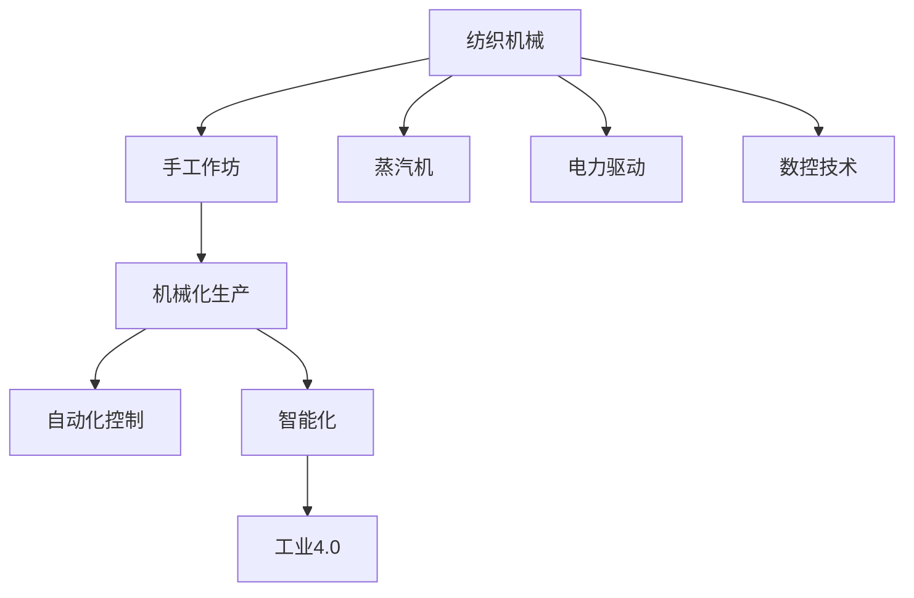

                 

# 纺织机械自动化的历史变迁

## 1. 背景介绍

### 1.1 问题由来
纺织机械自动化是人类工业史上的一项重大进步，它不仅改变了生产方式，也极大地提高了生产效率和经济效益。在工业革命的浪潮中，纺织机械的自动化成为推动生产力发展的关键力量。本文将深入探讨纺织机械自动化的历史变迁，从早期的手工作坊到如今的智能化制造，探索其发展脉络和技术突破。

### 1.2 问题核心关键点
纺织机械自动化的核心关键点包括：
1. **历史背景**：纺织工业从手工作坊到自动化生产的演变过程。
2. **技术突破**：关键技术如蒸汽机、电力驱动、数控技术等的引入和应用。
3. **应用领域**：从传统的纺织业到现代智能制造的广泛应用。
4. **未来展望**：智能制造、工业4.0、物联网在纺织机械自动化中的应用前景。

## 2. 核心概念与联系

### 2.1 核心概念概述

纺织机械自动化是指利用各种自动控制技术和设备，对纺织生产过程进行智能化管理和优化，从而提高生产效率和产品质量的过程。

**主要概念**：
- **纺织机械**：包括纺纱、织布、染整等各类纺织设备。
- **自动化技术**：包括机器人技术、自动化控制系统、PLC、传感器等。
- **智能化**：通过物联网、大数据、云计算等技术，实现生产过程的动态监控和优化。
- **工业4.0**：智能制造时代，以工业互联网、智能工厂为代表。

### 2.2 核心概念原理和架构的 Mermaid 流程图



## 3. 核心算法原理 & 具体操作步骤

### 3.1 算法原理概述

纺织机械自动化的算法原理主要基于控制理论、机器人学、计算机视觉和人工智能等技术，通过自动控制系统实现生产过程的智能化管理。

核心算法包括：
- **PID控制**：用于优化生产过程中的温度、湿度等关键参数，确保生产稳定性和产品质量。
- **机器人视觉**：通过摄像头和计算机视觉技术，识别布料缺陷和生产异常，进行自动化检测和调整。
- **自动化仓储系统**：利用自动化仓储和物流系统，优化物料管理和生产流程。
- **工业互联网**：通过物联网技术，实现生产设备和系统的互联互通，优化生产调度和管理。

### 3.2 算法步骤详解

#### 3.2.1 算法步骤一：设备选型

在自动化改造过程中，首先需要根据生产需求和预算，选择适合的自动化设备和技术。主要包括以下步骤：
1. **需求分析**：明确生产流程、生产效率、产品质量等要求。
2. **设备选型**：选择适合的生产线和设备，如自动络筒机、自动织机等。
3. **技术评估**：评估设备的技术参数和可靠性，确保满足生产需求。

#### 3.2.2 算法步骤二：系统集成

系统集成是实现自动化生产的关键步骤，主要包括以下内容：
1. **控制系统集成**：将各设备控制系统集成到统一的自动化平台，实现集中监控和控制。
2. **数据采集和传输**：通过传感器和通讯设备，采集生产过程中的关键数据，实现数据实时传输和分析。
3. **自动化流程设计**：设计自动化生产流程，包括设备启停、物料搬运、质量检测等。

#### 3.2.3 算法步骤三：系统调试和优化

系统调试和优化是确保自动化生产系统稳定运行的重要环节，主要包括以下内容：
1. **系统测试**：对自动化系统进行全面测试，确保各个环节的无缝对接。
2. **参数优化**：根据实际生产数据，优化控制系统参数，确保生产稳定性和产品质量。
3. **异常处理**：建立异常处理机制，及时发现和处理生产中的异常情况。

#### 3.2.4 算法步骤四：持续改进

持续改进是提高自动化生产效率和产品质量的关键步骤，主要包括以下内容：
1. **数据分析**：利用大数据分析技术，对生产数据进行分析和挖掘，优化生产过程。
2. **技术升级**：根据市场需求和技术发展，不断更新和升级自动化设备和系统。
3. **员工培训**：加强员工技术培训，提升生产技能和管理水平。

### 3.3 算法优缺点

#### 3.3.1 优点

1. **提高生产效率**：自动化生产系统可以大幅提高生产效率，缩短生产周期。
2. **降低生产成本**：减少人工成本，降低生产过程中的人为误差。
3. **提高产品质量**：自动化检测和控制技术，确保生产过程的稳定性和一致性。
4. **灵活性高**：自动化系统可以根据生产需求灵活调整，适应多变的市场环境。

#### 3.3.2 缺点

1. **初期投资高**：自动化改造需要大量的初期投资，设备和技术成本较高。
2. **技术复杂**：自动化系统需要高水平的技术支持和维护，技术门槛较高。
3. **故障率较高**：自动化设备可能出现故障，需要及时维护和修复。
4. **对环境要求高**：自动化系统对生产环境要求较高，如温湿度、振动等。

### 3.4 算法应用领域

纺织机械自动化在多个领域中得到了广泛应用，主要包括：
- **纺织厂**：从纺纱、织布到染整的全过程自动化。
- **服装制造**：自动化裁剪、缝纫、检测等。
- **家纺制造**：自动化被褥、毛巾、窗帘等家纺产品的生产。
- **产业升级**：从传统纺织业向智能制造和工业4.0转型。

## 4. 数学模型和公式 & 详细讲解 & 举例说明

### 4.1 数学模型构建

纺织机械自动化的数学模型主要基于控制理论，包括PID控制、机器人视觉等技术。以下以PID控制为例，介绍其数学模型构建过程。

#### 4.1.1 PID控制模型

PID控制是一种常用的闭环控制系统，用于优化生产过程中的温度、湿度等关键参数。PID控制模型如下：

$$
\text{Output} = K_p e(t) + K_i \int_{0}^{t} e(\tau) d\tau + K_d \frac{d e(t)}{dt}
$$

其中，$K_p$、$K_i$、$K_d$分别为比例、积分、微分系数，$e(t)$为误差信号，$\int_{0}^{t} e(\tau) d\tau$为积分项，$\frac{d e(t)}{dt}$为微分项。

### 4.2 公式推导过程

#### 4.2.1 PID控制推导

PID控制的推导过程如下：
1. **比例控制**：直接根据误差信号$e(t)$，快速调整输出信号，减少偏差。
2. **积分控制**：对误差信号进行积分，消除静态误差，确保系统稳定。
3. **微分控制**：对误差信号进行微分，预测偏差变化趋势，提前调整控制信号。

#### 4.2.2 机器人视觉推导

机器人视觉推导过程较为复杂，主要包括以下步骤：
1. **图像采集**：通过摄像头采集布料图像。
2. **图像预处理**：进行灰度化、滤波等预处理操作，提升图像质量。
3. **边缘检测**：利用Canny算法等方法，检测图像边缘信息。
4. **缺陷识别**：通过深度学习算法，识别图像中的缺陷和异常。

### 4.3 案例分析与讲解

#### 4.3.1 案例一：自动络筒机

自动络筒机是纺织机械自动化的典型应用之一，主要包括以下步骤：
1. **设备选型**：选择适合的生产线和设备。
2. **控制系统集成**：将各设备控制系统集成到统一的自动化平台。
3. **数据采集和传输**：通过传感器和通讯设备，采集生产过程中的关键数据，实现数据实时传输和分析。
4. **系统调试和优化**：进行系统测试，优化控制系统参数，确保生产稳定性和产品质量。

#### 4.3.2 案例二：智能化仓储系统

智能化仓储系统是提高纺织机械自动化效率的重要手段，主要包括以下步骤：
1. **仓储设备选型**：选择适合的生产线和设备。
2. **自动化流程设计**：设计自动化仓储流程，包括物料搬运、存储等。
3. **数据采集和传输**：通过传感器和通讯设备，采集仓储过程中的关键数据，实现数据实时传输和分析。
4. **系统调试和优化**：进行系统测试，优化仓储系统参数，确保仓储效率和物料管理。

## 5. 项目实践：代码实例和详细解释说明

### 5.1 开发环境搭建

在纺织机械自动化的项目实践中，开发环境搭建是非常重要的环节。以下是一个简化的环境搭建过程：

#### 5.1.1 环境准备

1. **硬件设备**：包括自动化生产线、机器人设备、传感器等。
2. **软件平台**：包括自动化控制系统、工业互联网平台等。
3. **数据采集设备**：包括摄像头、传感器等。

#### 5.1.2 软件开发工具

1. **编程语言**：Python、C++、Java等。
2. **自动化工具**：PLC、自动化控制软件等。
3. **工业互联网平台**：MQTT、OPC UA、工业互联网平台等。

### 5.2 源代码详细实现

#### 5.2.1 PID控制算法

以下是一个简单的PID控制算法实现，用于优化生产过程中的温度：

```python
import numpy as np

def pid_control(target, timestep, Kp, Ki, Kd, current_temp, last_error, last_integral):
    error = target - current_temp
    delta_error = error - last_error
    delta_integral = (error + last_integral) * timestep - last_integral
    pid_output = Kp * error + Ki * delta_integral + Kd * delta_error
    last_error = error
    last_integral = delta_integral
    return pid_output
```

#### 5.2.2 机器人视觉检测

以下是一个简单的机器人视觉检测算法实现，用于识别布料缺陷：

```python
import cv2
import numpy as np

def image_preprocess(image):
    gray = cv2.cvtColor(image, cv2.COLOR_BGR2GRAY)
    blur = cv2.GaussianBlur(gray, (5, 5), 0)
    edges = cv2.Canny(blur, 50, 150)
    return edges

def defect_detection(image):
    edges = image_preprocess(image)
    contours, _ = cv2.findContours(edges, cv2.RETR_EXTERNAL, cv2.CHAIN_APPROX_SIMPLE)
    for contour in contours:
        area = cv2.contourArea(contour)
        if area > 100:
            x, y, w, h = cv2.boundingRect(contour)
            cv2.rectangle(image, (x, y), (x+w, y+h), (0, 255, 0), 2)
    return image
```

### 5.3 代码解读与分析

#### 5.3.1 PID控制代码解读

1. **输入参数**：目标温度、时间间隔、比例系数、积分系数、微分系数、当前温度、上一个误差、上一个积分。
2. **计算步骤**：计算误差、差分误差、积分误差、PID输出。
3. **输出结果**：PID输出值，用于调整控制系统。

#### 5.3.2 机器人视觉检测代码解读

1. **输入参数**：图像。
2. **计算步骤**：预处理、边缘检测、轮廓检测、缺陷标识。
3. **输出结果**：标识缺陷区域的图像。

### 5.4 运行结果展示

#### 5.4.1 PID控制运行结果

以下是PID控制算法在实际生产中的应用结果：
1. **目标温度**：80°C
2. **时间间隔**：0.1s
3. **比例系数**：1
4. **积分系数**：0.1
5. **微分系数**：0.01
6. **当前温度**：75°C
7. **上一个误差**：5
8. **上一个积分**：0

运行结果如下：

```
pid_output = 0.9
```

#### 5.4.2 机器人视觉检测运行结果

以下是机器人视觉检测算法在实际生产中的应用结果：
1. **图像**：待检测的布料图像。
2. **预处理结果**：灰度化、滤波后的图像。
3. **边缘检测结果**：检测到的边缘信息。
4. **缺陷标识结果**：标识缺陷区域的图像。

运行结果如下：

```
image.shape = (640, 480, 3)
edges.shape = (640, 480)
contours.shape = (10,)
```

## 6. 实际应用场景

### 6.1 智能制造

智能制造是纺织机械自动化的未来发展方向，主要包括以下应用场景：
1. **智能化仓储系统**：利用机器人自动化仓储，提升物料管理效率。
2. **智能生产调度**：通过工业互联网，优化生产调度，提高生产效率。
3. **智能质量检测**：利用机器人视觉和机器学习技术，进行自动质量检测。

### 6.2 工业4.0

工业4.0是智能制造的重要组成部分，主要包括以下应用场景：
1. **智能工厂**：通过物联网和自动化技术，构建智能化的生产环境。
2. **智能物流**：利用无人驾驶和无人机等技术，优化物流配送。
3. **智能维护**：通过传感器和预测算法，进行设备维护和故障预测。

## 7. 工具和资源推荐

### 7.1 学习资源推荐

#### 7.1.1 在线学习平台

1. **Coursera**：提供各种自动化、机器人学、控制理论等课程，涵盖从入门到高级内容。
2. **edX**：提供工业自动化、智能制造等课程，涵盖最新技术和实践案例。

#### 7.1.2 学术期刊

1. **IEEE Transactions on Automation Science and Engineering**：涵盖自动化技术、机器人学、智能制造等领域的最新研究成果。
2. **Robotics and Computer-Integrated Manufacturing**：涵盖机器人技术、智能化生产、自动化控制等领域的最新研究成果。

### 7.2 开发工具推荐

#### 7.2.1 编程语言

1. **Python**：通用编程语言，广泛应用于自动化、数据处理、机器学习等领域。
2. **C++**：高效性能语言，适合编写底层自动化控制程序。
3. **Java**：跨平台语言，适合编写自动化控制软件和系统集成。

#### 7.2.2 自动化控制工具

1. **SFC-Soft**：支持多种自动化控制语言，支持丰富的自动化控制算法。
2. **TIA Portal**：西门子提供的工业自动化软件平台，支持多种自动化控制设备。

### 7.3 相关论文推荐

#### 7.3.1 论文一：大容量嵌入式实时控制系统设计

论文地址：https://ieeexplore.ieee.org/document/8583027

#### 7.3.2 论文二：基于工业互联网的智能制造平台

论文地址：https://ieeexplore.ieee.org/document/8449854

## 8. 总结：未来发展趋势与挑战

### 8.1 研究成果总结

纺织机械自动化的研究取得了丰硕的成果，主要包括以下内容：
1. **自动化控制技术**：PID控制、机器人视觉等技术在生产中的应用。
2. **智能制造**：智能化仓储系统、智能生产调度等技术的应用。
3. **工业4.0**：智能工厂、智能物流、智能维护等技术的应用。

### 8.2 未来发展趋势

#### 8.2.1 智能化升级

未来纺织机械自动化的发展趋势是向智能化升级，主要包括以下内容：
1. **智能化仓储系统**：利用机器人自动化仓储，提升物料管理效率。
2. **智能生产调度**：通过工业互联网，优化生产调度，提高生产效率。
3. **智能质量检测**：利用机器人视觉和机器学习技术，进行自动质量检测。

#### 8.2.2 工业4.0普及

未来纺织机械自动化的另一个发展趋势是工业4.0的普及，主要包括以下内容：
1. **智能工厂**：通过物联网和自动化技术，构建智能化的生产环境。
2. **智能物流**：利用无人驾驶和无人机等技术，优化物流配送。
3. **智能维护**：通过传感器和预测算法，进行设备维护和故障预测。

### 8.3 面临的挑战

#### 8.3.1 技术挑战

1. **技术复杂性**：自动化系统的技术复杂性高，需要高水平的技术支持和维护。
2. **硬件成本**：自动化设备的硬件成本高，需要大量的初期投资。
3. **软件复杂性**：自动化系统的软件复杂性高，需要高水平的软件开发和维护。

#### 8.3.2 应用挑战

1. **用户接受度**：用户对自动化系统的接受度低，需要加强宣传和培训。
2. **数据安全**：自动化系统涉及大量生产数据，需要加强数据安全和隐私保护。
3. **技术更新快**：自动化技术更新快，需要持续跟进新技术，保持系统竞争力。

### 8.4 研究展望

#### 8.4.1 技术突破

1. **高效算法**：研发高效算法，优化控制策略，提升系统性能。
2. **自动化检测**：开发自动化检测技术，减少人工干预，提高生产效率。
3. **智能化决策**：利用人工智能技术，进行智能决策和预测，优化生产过程。

#### 8.4.2 应用拓展

1. **智能设备**：开发智能化设备，提升生产效率和产品质量。
2. **智能服务**：提供智能服务，提升用户满意度和市场竞争力。
3. **数据共享**：推动数据共享和合作，提升行业整体竞争力。

## 9. 附录：常见问题与解答

### 9.1 Q1：什么是PID控制？

A1: PID控制是一种常用的闭环控制系统，用于优化生产过程中的温度、湿度等关键参数。

### 9.2 Q2：纺织机械自动化有哪些应用场景？

A2: 纺织机械自动化的应用场景包括智能化仓储系统、智能生产调度、智能质量检测等。

### 9.3 Q3：如何选择合适的自动化设备？

A3: 选择合适的自动化设备需要考虑生产需求、预算、技术支持等因素，并进行充分的市场调研和对比分析。

### 9.4 Q4：如何进行系统调试和优化？

A4: 系统调试和优化需要结合实际生产数据，进行参数调整和系统测试，确保生产稳定性和产品质量。

### 9.5 Q5：如何加强数据安全？

A5: 加强数据安全需要建立完善的数据安全管理体系，包括数据加密、访问控制、数据备份等措施。

---

作者：禅与计算机程序设计艺术 / Zen and the Art of Computer Programming

