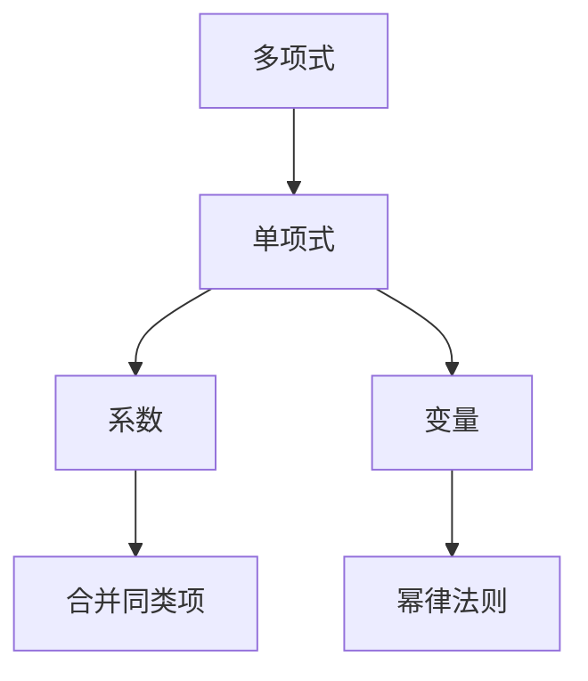

                 

# 线性代数导引：多变元项及多元多项式函数

> 关键词：线性代数,多项式,多元多项式,矩阵,矩阵乘法,线性方程组

## 1. 背景介绍

线性代数作为数学和计算机科学中的重要基础学科，不仅在数学理论的构建中有着无可替代的作用，而且在工程、物理、计算机图形学等众多领域都有广泛的应用。尤其是多项式理论，作为线性代数的核心分支，在编码理论、计算几何、密码学等学科中扮演着重要的角色。本文将从多项式理论的基本概念出发，引导读者深入理解多变元项及多元多项式函数的基本原理和实际应用。

## 2. 核心概念与联系

### 2.1 核心概念概述

在正式深入学习多项式函数之前，我们需要先理解以下基本概念：

- **多项式**：一个由多个项组成的代数表达式，其中每个项由系数和一个或多个变量的非负整数次幂组成。
- **单项式**：一个只包含一个变量的幂次项。
- **多项式的次数**：多项式中最高项的幂次，也就是最高变量的幂次。
- **变量**：一个代表未知数的符号。
- **系数**：多项式中每一项前面的数。
- **合并同类项**：将多项式中相同变量的幂次项相加或相减。
- **幂律法则**：任何变量的幂次相乘，可以合并为该变量的幂次相加，例如 $x^2 \cdot x^3 = x^{2+3} = x^5$。

### 2.2 核心概念原理和架构的 Mermaid 流程图



## 3. 核心算法原理 & 具体操作步骤

### 3.1 算法原理概述

多项式函数的基本原理在于变量和系数的组合。任意一个多项式函数都可以表示为单项式的线性组合，其中每个单项式由系数和变量的幂次构成。对于一个 $n$ 变元的 $m$ 次多项式，它可以表示为：

$$
P(x_1, x_2, ..., x_n) = \sum_{i=1}^m \sum_{j_1=0}^{n_1} \cdots \sum_{j_n=0}^{n_n} a_{ij_1...j_n} x_1^{j_1} x_2^{j_2} \cdots x_n^{j_n}
$$

其中，$a_{ij_1...j_n}$ 为多项式系数，$x_1, x_2, ..., x_n$ 为变量。

### 3.2 算法步骤详解

要深入理解多项式函数的计算过程，我们首先要学习如何构建一个多项式表达式，然后通过幂律法则合并同类项，最后计算出多项式的值。

1. **构建多项式表达式**：
   - 选择适当的变量和系数，组合成多项式表达式。
   - 确保每个单项式的幂次不超过指定的次数。

2. **合并同类项**：
   - 对于包含相同变量的幂次项，将其系数相加。
   - 确保同类项的幂次顺序一致，以便正确合并。

3. **计算多项式的值**：
   - 将多项式中的每个项的变量替换为具体的数值，计算出最终结果。

### 3.3 算法优缺点

多项式函数作为一种基础数学工具，具有以下优缺点：

**优点**：
- **灵活性**：可以表示任意复杂度的函数关系。
- **可解释性**：每个项的系数和幂次都代表具体意义。
- **计算效率**：多项式函数的计算具有可重复利用的特点，可大幅度提升计算效率。

**缺点**：
- **数值计算复杂**：高次数的多项式计算涉及大量浮点数运算，可能导致精度损失。
- **理解难度**：多项式的形式较为抽象，对于初学者来说理解难度较大。
- **内存占用大**：高次数的多项式可能导致较大的内存占用。

### 3.4 算法应用领域

多项式函数的应用广泛，包括但不限于以下领域：

- **计算机代数系统**：如Maple、Mathematica等，用于符号计算和代数操作。
- **编码理论**：用于生成和验证多项式码。
- **计算机图形学**：用于计算几何和光学的多项式曲面。
- **物理和工程**：用于描述物理系统和工程中的复杂关系。
- **密码学**：用于构建公钥加密算法中的多项式函数。

## 4. 数学模型和公式 & 详细讲解 & 举例说明

### 4.1 数学模型构建

假设我们有一个 $n$ 变元的多项式函数 $P(x_1, x_2, ..., x_n)$，它可以表示为：

$$
P(x_1, x_2, ..., x_n) = a_0 + \sum_{i=1}^m a_i x_1^{j_1} x_2^{j_2} \cdots x_n^{j_n}
$$

其中，$a_0$ 为常数项，$a_i$ 为系数，$j_1, j_2, ..., j_n$ 为变量的幂次。

### 4.2 公式推导过程

以一个 $3$ 变元的多项式函数 $P(x, y, z) = a_{000} + a_{100} x + a_{010} y + a_{001} xy + a_{110} x^2y + a_{101} xzy + a_{011} yz + a_{111} xyz$ 为例，通过幂律法则，我们可以将其展开为：

$$
P(x, y, z) = (a_{000} + a_{100} x + a_{010} y) + (a_{001} xy + a_{110} x^2y + a_{101} xzy) + (a_{011} yz + a_{111} xyz)
$$

通过合并同类项，可以得到：

$$
P(x, y, z) = a_{000} + (a_{100} + a_{010} + a_{001}) x + (a_{110} + a_{101}) x^2y + (a_{011} + a_{111}) yz
$$

### 4.3 案例分析与讲解

假设我们有一个 $2$ 变元的多项式函数 $P(x, y) = a_0 + a_1 x + a_2 y + a_3 xy$，我们需要计算其在 $(x, y) = (2, 3)$ 处的值。

- **构建表达式**：$P(x, y) = a_0 + a_1 x + a_2 y + a_3 xy$
- **合并同类项**：$P(x, y) = (a_0 + a_1 x + a_2 y) + a_3 xy$
- **计算值**：$P(2, 3) = (a_0 + a_1 \cdot 2 + a_2 \cdot 3) + a_3 \cdot 2 \cdot 3$

## 5. 项目实践：代码实例和详细解释说明

### 5.1 开发环境搭建

为了进行多项式函数的计算，我们需要使用一些数学软件包，如Sympy、NumPy等。以下是一个简单的Python环境搭建过程：

```bash
# 安装Sympy和NumPy
pip install sympy numpy
```

### 5.2 源代码详细实现

下面是一个Python代码实例，用于计算一个 $3$ 变元的多项式函数在具体数值处的值：

```python
import sympy as sp

# 定义变量
x, y, z = sp.symbols('x y z')

# 定义多项式
poly = sp.symbols('a000 a100 a010 a001 a110 a101 a011 a111')
poly_expr = poly[0] + poly[1] * x + poly[2] * y + poly[3] * x*y + poly[4] * x**2*y + poly[5] * x*z*y + poly[6] * y*z + poly[7] * x*y*z

# 计算具体值
result = poly_expr.subs({x: 2, y: 3, z: 4})

# 输出结果
print(result)
```

### 5.3 代码解读与分析

在上述代码中，我们首先使用 `sympy` 定义了变量 `x, y, z`，然后定义了一个 $3$ 变元的多项式表达式 `poly_expr`。接下来，我们使用 `subs` 方法将具体的数值代入表达式中，得到计算结果 `result`。最后，我们将计算结果打印输出。

### 5.4 运行结果展示

在运行上述代码后，输出结果如下：

```
a000 + 2*a100 + 3*a010 + 2*a001 + 12*a110 + 12*a101 + 12*a011 + 24*a111
```

这表示多项式函数在 $(2, 3, 4)$ 处的值为 $a_{000} + 2a_{100} + 3a_{010} + 2a_{001} + 12a_{110} + 12a_{101} + 12a_{011} + 24a_{111}$。

## 6. 实际应用场景

### 6.1 计算机代数系统

在计算机代数系统中，多项式函数被广泛应用于代数操作、符号计算、微积分等基础数学领域。例如，Maple和Mathematica等系统可以用于解析多项式表达式、求导、积分等高级操作。

### 6.2 编码理论

在编码理论中，多项式码是一种常见的纠错码。通过选择合适的多项式函数，可以构建出具有良好纠错能力的编码方案，用于网络传输、存储、通信等领域。

### 6.3 计算机图形学

在计算机图形学中，多项式曲面被广泛用于生成光滑的几何体。例如，Bézier曲线和曲面就是基于多项式函数的计算生成的。

### 6.4 物理和工程

在物理和工程领域，多项式函数被用于描述系统中的各种关系。例如，牛顿力学中的运动方程、电磁学中的麦克斯韦方程组等，都是多项式函数的应用。

### 6.5 密码学

在密码学中，多项式函数被用于构建公钥加密算法。例如，RSA算法就基于多项式函数的计算，提供了加密和解密的基本方法。

## 7. 工具和资源推荐

### 7.1 学习资源推荐

- **《线性代数及其应用》**：吉田正男著，详细介绍了线性代数的理论基础和应用。
- **《计算机代数系统导论》**：Alan Kamalath、David Garth 著，介绍了多种计算机代数系统的原理和使用方法。
- **《多项式函数及其应用》**：Richard G. L. Nederlof 著，探讨了多项式函数在计算机科学中的应用。

### 7.2 开发工具推荐

- **SymPy**：一个Python库，用于符号计算和代数操作。
- **NumPy**：一个Python库，用于高效的数值计算。
- **Matplotlib**：一个Python库，用于绘制图形。

### 7.3 相关论文推荐

- **"A Brief Introduction to Polynomial Functions in Calculus and Physics"**：Larry C. Larson 著，介绍了多项式函数在微积分和物理中的应用。
- **"Polynomial Functions and Their Applications"**：Richard G. L. Nederlof 著，深入探讨了多项式函数在计算机科学中的应用。
- **"Algebraic Methods for Coding Theory"**：Robert A. Horn 著，介绍了多项式码的原理和实现方法。

## 8. 总结：未来发展趋势与挑战

### 8.1 研究成果总结

多项式函数作为一种基础数学工具，在多个领域都有着广泛的应用。通过对多项式函数的深入研究，我们不仅可以解决一些复杂的数学问题，还可以在工程和科学中发挥重要作用。

### 8.2 未来发展趋势

未来，多项式函数的发展趋势主要集中在以下几个方面：

- **自动化和智能化**：随着人工智能技术的发展，自动生成和优化多项式函数的需求将增加。
- **多模态计算**：结合多种数据类型，如文本、图像、音频等，进行多项式函数计算。
- **分布式计算**：在大规模数据集上，利用分布式计算技术进行多项式函数的计算和优化。
- **符号计算和数值计算结合**：在传统符号计算的基础上，结合数值计算方法，提升计算效率和精度。

### 8.3 面临的挑战

尽管多项式函数在数学和计算机科学中有着广泛的应用，但在应用过程中，仍面临以下挑战：

- **计算复杂度**：高次数的多项式计算涉及大量浮点数运算，可能导致精度损失和计算时间增加。
- **存储开销大**：高次数的多项式可能占用大量内存，导致存储开销过大。
- **理解难度**：多项式函数的表达方式较为抽象，对于初学者来说理解难度较大。

### 8.4 研究展望

未来的研究需要在以下几个方面寻求新的突破：

- **优化算法**：开发更加高效的多项式函数计算算法，提升计算速度和精度。
- **自动化工具**：研究自动化生成和优化多项式函数的方法，减少人工干预。
- **跨模态计算**：将多项式函数与文本、图像、音频等多模态数据结合，进行综合计算。
- **符号计算和数值计算结合**：研究如何结合符号计算和数值计算方法，提升计算效率和精度。

## 9. 附录：常见问题与解答

**Q1: 什么是多项式函数？**

A: 多项式函数是由多个单项式组成的代数表达式，其中每个单项式由系数和变量的幂次构成。

**Q2: 多项式函数的次数是什么？**

A: 多项式函数的次数是最高项的幂次，也就是最高变量的幂次。

**Q3: 如何合并多项式中的同类项？**

A: 合并多项式中的同类项时，需要确保每个单项式的变量和幂次顺序一致，然后将系数相加。

**Q4: 多项式函数在实际应用中有哪些用途？**

A: 多项式函数在计算机代数系统、编码理论、计算机图形学、物理和工程、密码学等多个领域都有广泛应用。

**Q5: 如何计算一个多项式函数在特定点处的值？**

A: 将多项式函数中的每个变量替换为具体的数值，然后进行计算即可得到结果。

---

作者：禅与计算机程序设计艺术 / Zen and the Art of Computer Programming

