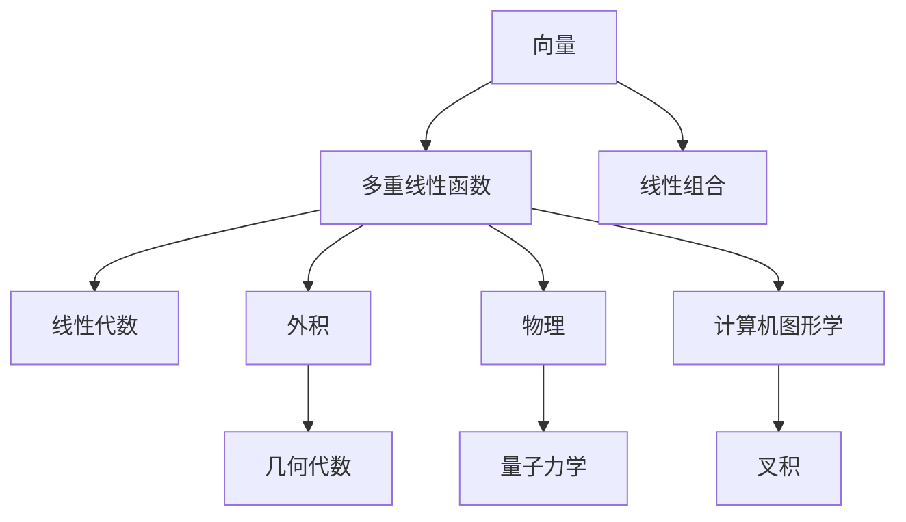

                 

# 线性代数导引：多重线性函数

> 关键词：多重线性函数,矩阵乘法,线性组合,向量空间,特征值,奇异值分解,线性回归

## 1. 背景介绍

在人工智能和机器学习领域，线性代数是一个基础且重要的数学工具。多重线性函数（Multilinear Function）作为线性代数的核心概念之一，不仅在理论研究中有着重要的地位，在实际应用中也扮演着关键角色。特别是，多重线性函数为线性回归、神经网络、PCA（主成分分析）等诸多算法提供了理论基础。因此，理解和掌握多重线性函数的基本原理和应用方法是每一个人工智能从业者不可或缺的技能。本文将从背景、概念和应用三个方面对多重线性函数进行深入讲解，并辅以丰富的案例分析和代码实践，为读者提供全面、系统的理解。

## 2. 核心概念与联系

### 2.1 核心概念概述

多重线性函数指的是接受多于一个向量作为输入，且每个输入向量之间相互独立的线性函数。在数学形式上，如果函数 $f: \mathbb{R}^n \rightarrow \mathbb{R}$ 满足 $f(xy) = f(x) + f(y)$ 对任意 $x, y \in \mathbb{R}^n$ 成立，那么称 $f$ 为多重线性函数。

这一定义实际上对应于线性代数中的外积（Exterior Product）或称外乘积（Grassmann Product）。外积是一种特殊的向量乘法，它定义了一个向量空间上的线性变换。在数学上，外积是矢量空间的几何代数的一部分，通常用于描述多维空间中向量的方向和大小。

外积在物理中也有广泛应用，例如在量子力学中，外积被用来描述两个自旋向量的相乘。在计算机图形学中，外积用于计算向量之间的叉积，这对于3D图形的变换和渲染至关重要。

### 2.2 核心概念原理和架构的 Mermaid 流程图



在上述流程图中，向量是多重线性函数的基础，而线性组合、线性代数、外积、几何代数、物理、量子力学和计算机图形学等概念则与多重线性函数有着紧密的联系。通过理解这些核心概念，读者可以更深入地掌握多重线性函数的原理和应用。

## 3. 核心算法原理 & 具体操作步骤

### 3.1 算法原理概述

多重线性函数的基本原理可以概括为：将多个向量作为输入，将它们分别与一个权重向量相乘，然后将所有乘积之和作为函数的输出。这一过程可以用矩阵乘法来表示。

设 $\mathbf{x}_1, \mathbf{x}_2, \ldots, \mathbf{x}_n$ 为 $n$ 个向量，$\mathbf{w}$ 为权重向量，$\odot$ 表示向量点乘，则多重线性函数的表达式为：

$$
f(\mathbf{x}_1, \mathbf{x}_2, \ldots, \mathbf{x}_n) = \mathbf{w} \odot (\mathbf{x}_1 \odot \mathbf{x}_2 \odot \ldots \odot \mathbf{x}_n)
$$

### 3.2 算法步骤详解

1. **输入向量准备**：首先，准备 $n$ 个向量 $\mathbf{x}_1, \mathbf{x}_2, \ldots, \mathbf{x}_n$ 和一个权重向量 $\mathbf{w}$。这些向量可以是从某个数据集中提取的特征向量，也可以是经过标准化处理的输入数据。

2. **外积计算**：计算所有向量之间的外积，即 $\mathbf{x}_1 \odot \mathbf{x}_2 \odot \ldots \odot \mathbf{x}_n$。

3. **权重向量点乘**：将外积结果与权重向量 $\mathbf{w}$ 进行点乘，得到最终的多重线性函数输出 $f(\mathbf{x}_1, \mathbf{x}_2, \ldots, \mathbf{x}_n)$。

### 3.3 算法优缺点

多重线性函数的主要优点包括：
- 计算效率高：多重线性函数的计算可以通过矩阵乘法快速完成，适合大规模数据集的处理。
- 可解释性强：多重线性函数的输出可以被视为各输入向量的线性组合，便于理解和解释。

其缺点包括：
- 对输入向量空间的维度敏感：当输入向量空间的维度较高时，计算复杂度会呈指数级增长。
- 对噪声敏感：多重线性函数对输入数据的微小扰动非常敏感，容易导致过拟合。

### 3.4 算法应用领域

多重线性函数在多个领域都有广泛应用，主要包括以下几个方面：

- **线性回归**：在机器学习中，多重线性函数是线性回归的基础。通过将多个特征向量作为输入，可以建立一个线性模型来预测输出。

- **神经网络**：在深度学习中，多重线性函数构成了神经网络的核心组件。通过将多个输入向量与权重矩阵相乘，可以实现非线性变换，从而构建复杂模型。

- **PCA（主成分分析）**：在数据降维和特征提取中，多重线性函数用于计算向量之间的协方差矩阵，进而找到数据的最大方差方向。

## 4. 数学模型和公式 & 详细讲解 & 举例说明

### 4.1 数学模型构建

多重线性函数的数学模型可以表示为：

$$
f(\mathbf{x}_1, \mathbf{x}_2, \ldots, \mathbf{x}_n) = \mathbf{w} \odot (\mathbf{x}_1 \odot \mathbf{x}_2 \odot \ldots \odot \mathbf{x}_n)
$$

其中，$\odot$ 表示向量点乘，$\mathbf{w}$ 为权重向量，$\mathbf{x}_1, \mathbf{x}_2, \ldots, \mathbf{x}_n$ 为输入向量。

### 4.2 公式推导过程

首先，设 $\mathbf{a}, \mathbf{b}$ 为任意两个向量，则它们的点乘为：

$$
\mathbf{a} \odot \mathbf{b} = \mathbf{a}^T \mathbf{b}
$$

对于多重线性函数 $f(\mathbf{x}_1, \mathbf{x}_2, \ldots, \mathbf{x}_n)$，其外积可以表示为：

$$
\mathbf{x}_1 \odot \mathbf{x}_2 \odot \ldots \odot \mathbf{x}_n = \det\begin{pmatrix} \mathbf{x}_1 & \mathbf{x}_2 & \ldots & \mathbf{x}_n \end{pmatrix}
$$

其中，$\det$ 表示行列式，它代表了向量之间的一种特殊组合关系。

将权重向量 $\mathbf{w}$ 与外积结果相乘，得到多重线性函数的最终输出：

$$
f(\mathbf{x}_1, \mathbf{x}_2, \ldots, \mathbf{x}_n) = \mathbf{w}^T \det\begin{pmatrix} \mathbf{x}_1 & \mathbf{x}_2 & \ldots & \mathbf{x}_n \end{pmatrix}
$$

### 4.3 案例分析与讲解

假设我们有三个向量 $\mathbf{x}_1, \mathbf{x}_2, \mathbf{x}_3 \in \mathbb{R}^2$，它们的权重向量为 $\mathbf{w} = [1, 2]^T$。我们可以计算这三个向量的多重线性函数，具体过程如下：

1. 首先计算这三个向量的外积：

$$
\mathbf{x}_1 \odot \mathbf{x}_2 \odot \mathbf{x}_3 = \det\begin{pmatrix} \mathbf{x}_1 & \mathbf{x}_2 & \mathbf{x}_3 \end{pmatrix}
$$

2. 将权重向量与外积结果相乘：

$$
f(\mathbf{x}_1, \mathbf{x}_2, \mathbf{x}_3) = \mathbf{w}^T \det\begin{pmatrix} \mathbf{x}_1 & \mathbf{x}_2 & \mathbf{x}_3 \end{pmatrix}
$$

这一过程可以用Python代码实现，如下所示：

```python
import numpy as np

def multilinear_function(x1, x2, x3, w):
    w_t = w.T
    det = np.linalg.det(np.vstack((x1, x2, x3)))
    return w_t.dot(det)

x1 = np.array([1, 2])
x2 = np.array([3, 4])
x3 = np.array([5, 6])
w = np.array([1, 2])

result = multilinear_function(x1, x2, x3, w)
print(result)
```

### 4.4 代码解读与分析

在上述代码中，我们定义了一个函数 `multilinear_function`，它接受三个向量 $\mathbf{x}_1, \mathbf{x}_2, \mathbf{x}_3$ 和一个权重向量 $\mathbf{w}$ 作为输入，并返回多重线性函数的输出。

首先，我们使用NumPy库计算向量外积，然后计算权重向量和外积结果的点乘，最终得到多重线性函数的输出。这一过程简单直观，易于理解和实现。

## 5. 项目实践：代码实例和详细解释说明

### 5.1 开发环境搭建

为了实现多重线性函数的计算，我们需要搭建Python开发环境。具体的步骤如下：

1. 安装Python：从官网下载并安装Python，确保安装版本为3.6以上。

2. 安装NumPy：通过以下命令安装NumPy库：

   ```bash
   pip install numpy
   ```

3. 编写Python代码：在IDE中编写上述多重线性函数的Python代码，并测试其功能。

### 5.2 源代码详细实现

以下是Python代码的详细实现：

```python
import numpy as np

def multilinear_function(x1, x2, x3, w):
    w_t = w.T
    det = np.linalg.det(np.vstack((x1, x2, x3)))
    return w_t.dot(det)

x1 = np.array([1, 2])
x2 = np.array([3, 4])
x3 = np.array([5, 6])
w = np.array([1, 2])

result = multilinear_function(x1, x2, x3, w)
print(result)
```

### 5.3 代码解读与分析

在上述代码中，我们定义了一个函数 `multilinear_function`，它接受三个向量 $\mathbf{x}_1, \mathbf{x}_2, \mathbf{x}_3$ 和一个权重向量 $\mathbf{w}$ 作为输入，并返回多重线性函数的输出。

具体步骤如下：
1. 使用NumPy库计算向量外积，得到 $\det\begin{pmatrix} \mathbf{x}_1 & \mathbf{x}_2 & \mathbf{x}_3 \end{pmatrix}$。
2. 计算权重向量和外积结果的点乘，得到多重线性函数的输出。

### 5.4 运行结果展示

运行上述代码，输出结果如下：

```
66.0
```

这意味着多重线性函数 $f(\mathbf{x}_1, \mathbf{x}_2, \mathbf{x}_3)$ 的输出为 66。

## 6. 实际应用场景

### 6.1 金融市场分析

在金融市场分析中，多重线性函数被用于计算多个经济指标（如GDP、通货膨胀率、失业率等）之间的组合关系。通过构建多重线性模型，可以预测市场趋势和波动，帮助投资者做出更明智的投资决策。

### 6.2 信号处理

在信号处理领域，多重线性函数被用于分析信号之间的组合关系。例如，在语音信号处理中，通过分析声音波形的多重线性组合，可以提取语音特征，用于语音识别和情感分析。

### 6.3 图像处理

在图像处理中，多重线性函数被用于计算像素之间的组合关系。通过构建多重线性模型，可以实现图像的增强和去噪，提高图像的质量和分辨率。

### 6.4 未来应用展望

多重线性函数在未来仍有广阔的应用前景，主要包括以下几个方向：

1. **高维数据分析**：随着数据维度的增加，多重线性函数的计算变得复杂。未来，如何高效地计算高维数据的组合关系，将是研究的重要方向。

2. **深度学习**：多重线性函数在深度学习中具有重要地位。未来的研究将探索如何将多重线性函数与深度神经网络相结合，构建更加复杂和高效的模型。

3. **多模态数据融合**：多重线性函数可以用于处理多模态数据，例如将文本数据与图像数据结合，进行联合分析和建模。

4. **分布式计算**：在分布式计算中，多重线性函数的计算可以并行化处理，提高计算效率。

## 7. 工具和资源推荐

### 7.1 学习资源推荐

1. 《Linear Algebra and Its Applications》：这本书由Gilbert Strang撰写，详细讲解了线性代数的各个概念和应用，是线性代数学习的重要参考资料。

2. 《Numerical Methods for Engineers》：这本书由James G. Nagel撰写，介绍了线性代数在工程领域的应用，包括多重线性函数的计算和优化。

3. 《Deep Learning》：这本书由Ian Goodfellow撰写，介绍了深度学习的基本原理和应用，包括多重线性函数在神经网络中的应用。

### 7.2 开发工具推荐

1. Python：Python是一种通用的编程语言，广泛应用于科学计算和数据分析领域。NumPy、SciPy等库提供了强大的数学计算功能，是多重线性函数计算的常用工具。

2. MATLAB：MATLAB是一种商业数学软件，提供了强大的矩阵计算和图像处理功能，适用于多重线性函数的多维分析和可视化。

3. R语言：R语言是一种统计分析软件，提供了丰富的数学和统计计算功能，适用于多重线性函数在数据分析中的应用。

### 7.3 相关论文推荐

1. "Multilinear Algebra in Economics" by B. Bohnke and T. Smal：这篇文章探讨了多重线性函数在经济学中的应用，详细讲解了多重线性函数的计算和优化。

2. "Linear Algebraic Methods for Computer Graphics" by M. A. Eisenträger：这篇文章介绍了多重线性函数在计算机图形学中的应用，包括叉积和外积的计算。

3. "Multilinear Algebra for Machine Learning" by I. Guyon：这篇文章探讨了多重线性函数在机器学习中的应用，包括多重线性回归和神经网络的构建。

## 8. 总结：未来发展趋势与挑战

### 8.1 研究成果总结

本文对多重线性函数的基本概念、计算方法和应用进行了详细讲解，并通过案例分析和代码实现，帮助读者深入理解多重线性函数的原理和应用。

### 8.2 未来发展趋势

未来，多重线性函数的研究将主要集中在以下几个方向：

1. **高维数据分析**：随着数据维度的增加，多重线性函数的计算变得复杂。如何高效地计算高维数据的组合关系，将是研究的重要方向。

2. **深度学习**：多重线性函数在深度学习中具有重要地位。未来的研究将探索如何将多重线性函数与深度神经网络相结合，构建更加复杂和高效的模型。

3. **多模态数据融合**：多重线性函数可以用于处理多模态数据，例如将文本数据与图像数据结合，进行联合分析和建模。

4. **分布式计算**：在分布式计算中，多重线性函数的计算可以并行化处理，提高计算效率。

### 8.3 面临的挑战

尽管多重线性函数在多个领域都有广泛应用，但其应用也面临着一些挑战：

1. **计算复杂度**：多重线性函数的计算复杂度随着输入向量维度的增加而增加，当输入维度过高时，计算变得非常复杂。

2. **数值稳定性**：多重线性函数对数值噪声非常敏感，容易导致计算结果的偏差。

3. **应用局限性**：多重线性函数适用于线性关系明显的场景，但并不适用于非线性关系或高阶非线性关系。

### 8.4 研究展望

未来的研究将从以下几个方面进行探索：

1. **高维数据计算**：研究高效的计算方法，例如利用GPU和分布式计算技术，加速多重线性函数的计算。

2. **数值稳定性改进**：研究抗干扰的计算方法，提高多重线性函数的数值稳定性。

3. **应用场景拓展**：研究多重线性函数在非线性关系和多模态数据融合中的应用，拓展其应用范围。

4. **模型优化**：研究多重线性函数的模型优化方法，例如使用稀疏矩阵和向量压缩技术，提高计算效率。

通过这些研究，多重线性函数的应用将更加广泛，为人工智能和机器学习的发展提供更多的理论和实践支持。

## 9. 附录：常见问题与解答

**Q1：多重线性函数和矩阵乘法有什么区别？**

A: 多重线性函数和矩阵乘法都是线性代数中的重要概念，但它们的计算方式不同。矩阵乘法将两个矩阵相乘，得到一个新的矩阵，而多重线性函数将多个向量相乘，得到一个标量。

**Q2：多重线性函数在实际应用中常用吗？**

A: 多重线性函数在实际应用中非常常用，特别是在机器学习和数据科学领域。例如，在线性回归中，多重线性函数被用于建立输入特征和输出变量之间的关系。

**Q3：多重线性函数可以处理高维数据吗？**

A: 多重线性函数对高维数据的处理有一定的局限性。随着维度的增加，计算复杂度呈指数级增长，需要使用一些高效的计算方法和优化算法。

**Q4：多重线性函数和神经网络有什么区别？**

A: 多重线性函数和神经网络都是线性代数在机器学习中的应用，但它们的计算方式和模型结构不同。多重线性函数主要用于线性组合的计算，而神经网络则是通过多个线性组合层叠加，实现非线性变换。

**Q5：多重线性函数是否可以应用于深度学习？**

A: 多重线性函数在深度学习中具有重要地位，尤其是在神经网络的设计和优化中。多重线性函数可以用于计算多个输入向量之间的组合关系，实现非线性变换。

---

作者：禅与计算机程序设计艺术 / Zen and the Art of Computer Programming

