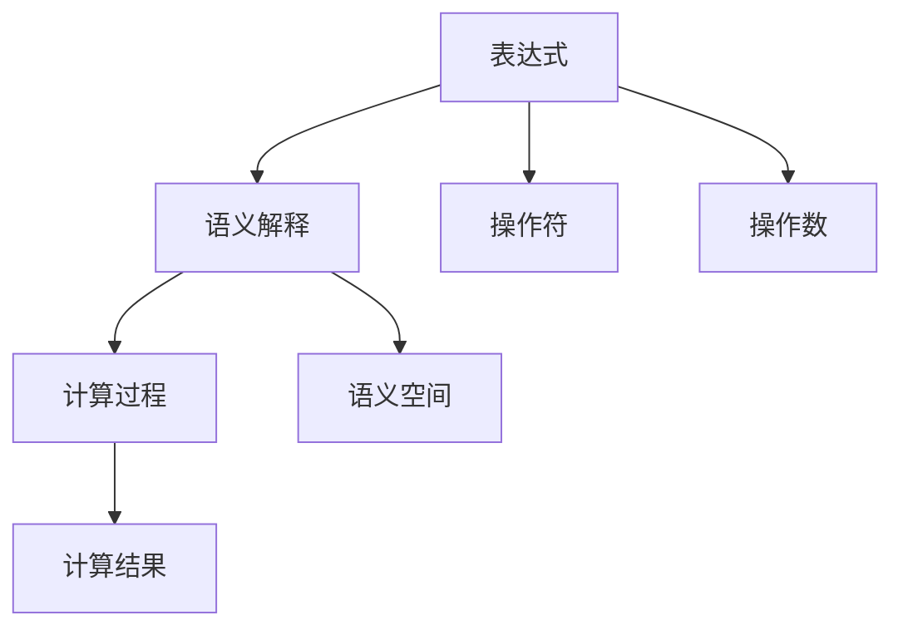

                 

## 1. 背景介绍

### 1.1 问题由来
线性代数是现代数学的一个基本分支，广泛应用于物理、工程、计算机科学等领域。其中，表达式及其语义解释是线性代数中最基础但重要的概念之一。在计算机科学中，表达式和语义解释的应用尤为广泛，从编译器、解释器到数据分析、机器学习等，无不依赖于对表达式及其语义的深入理解。本文旨在全面介绍线性代数中的表达式及其语义解释，并结合实际应用场景进行详细讲解。

### 1.2 问题核心关键点
表达式及其语义解释的核心关键点包括：

1. 表达式的定义与类型。
2. 表达式的结构与运算规则。
3. 语义解释的计算过程。
4. 表达式在计算机科学中的应用。
5. 表达式与数据结构的关系。

这些关键点不仅涵盖了表达式的形式和运算规则，还深入探讨了表达式在计算机科学中的应用和语义解释的计算过程，以及它们与数据结构之间的关系。

## 2. 核心概念与联系

### 2.1 核心概念概述

为更好地理解表达式及其语义解释，本节将介绍几个密切相关的核心概念：

1. **表达式（Expression）**：
   - 定义：由操作符和操作数构成的有序序列。
   - 类型：基本类型包括数值型、字符型、布尔型等。
   - 运算规则：遵循数学上的运算规则，包括加、减、乘、除、幂等。

2. **语义解释（Semantic Interpretation）**：
   - 定义：赋予表达式具体含义和值的过程。
   - 计算过程：基于表达式的结构，按照运算规则逐步计算出表达式的值。
   - 语义空间：表达式的值在语义空间中的表示。

3. **上下文（Context）**：
   - 定义：表达式计算所需的环境，包括操作符、操作数、语义空间等。
   - 作用：影响表达式的计算结果。

这些核心概念之间的逻辑关系可以通过以下Mermaid流程图来展示：



这个流程图展示了他表达式及其语义解释的核心概念及其之间的关系：

1. 表达式由操作符和操作数构成。
2. 语义解释赋予表达式具体含义和值。
3. 计算过程基于表达式的结构，逐步计算出表达式的值。
4. 语义空间是表达式的值在语义空间中的表示。

## 3. 核心算法原理 & 具体操作步骤
### 3.1 算法原理概述

线性代数中的表达式及其语义解释遵循数学上的运算规则。其核心思想是通过对表达式的逐层解析，赋予表达式具体含义和值，从而实现表达式的计算。

表达式由操作符和操作数构成。操作符决定操作数的组合方式，而操作数则表示具体数值。语义解释则基于表达式的结构，按照运算规则逐步计算出表达式的值。其计算过程可以分为以下几个步骤：

1. 解析表达式，提取操作符和操作数。
2. 根据操作符，确定操作数的组合方式。
3. 计算表达式的值。
4. 返回表达式的值。

### 3.2 算法步骤详解

假设我们有一个表达式 $3 + 4 * 2$，我们按照以下步骤进行计算：

1. **解析表达式**：将表达式分解为操作符和操作数，即 $3, +, 4, *, 2$。
2. **确定操作数的组合方式**：根据操作符的优先级，确定操作数的组合顺序。在这里，乘法优先级高于加法，因此先计算 $4 * 2$。
3. **计算表达式的值**：计算 $4 * 2 = 8$，再将结果与 $3$ 相加，得到 $3 + 8 = 11$。
4. **返回表达式的值**：最终得到表达式的值为 $11$。

### 3.3 算法优缺点

表达式及其语义解释的算法具有以下优点：

1. **简单高效**：基于数学运算规则，计算过程简单高效，易于实现。
2. **通用性**：适用于各种类型的表达式，包括数值型、字符型、布尔型等。
3. **灵活性**：通过改变操作符和操作数，可以构建不同的表达式。

然而，该算法也存在一些缺点：

1. **依赖操作符优先级**：如果表达式中操作符的优先级不明确，计算结果可能不同。
2. **复杂性**：对于复杂的表达式，计算过程可能较为复杂。
3. **语义解释的局限性**：表达式的语义解释依赖于具体的应用场景，可能在某些场景下难以实现。

### 3.4 算法应用领域

表达式及其语义解释在计算机科学中有着广泛的应用，主要包括以下几个领域：

1. **编译器与解释器**：编译器和解释器需要对用户编写的程序进行解析和计算，而表达式及其语义解释则是实现这一功能的核心技术。
2. **数据分析**：在数据分析中，表达式用于构建复杂的数据计算模型，实现数据的处理和分析。
3. **机器学习**：在机器学习中，表达式用于构建模型，实现对数据的处理和预测。
4. **人工智能**：在人工智能中，表达式用于构建推理和决策模型，实现智能决策和知识推理。
5. **计算机网络**：在计算机网络中，表达式用于构建路由算法和数据传输协议。

## 4. 数学模型和公式 & 详细讲解  
### 4.1 数学模型构建

在数学模型中，表达式及其语义解释通常使用向量、矩阵等数据结构来表示。例如，一个简单的表达式 $a + b * c$ 可以表示为向量 $(a, +, b, *, c)$，其中 $a, b, c$ 为操作数，$+, *,$ 为操作符。

### 4.2 公式推导过程

假设我们有两个表达式 $a + b$ 和 $c * d$，我们需要将它们组合成一个新的表达式。假设我们的操作符满足结合律和交换律，则新的表达式可以表示为 $(a + b) * (c * d)$。

根据运算规则，我们有：

$$
(a + b) * (c * d) = (a + b) * c + (a + b) * d = a * c + b * c + a * d + b * d
$$

这个推导过程展示了如何将两个简单的表达式组合成一个复杂的表达式，并计算出最终结果。

### 4.3 案例分析与讲解

假设我们有一个表达式 $x^2 + 2x + 1$，我们可以将其重写为 $(x + 1)^2$。这个重写过程展示了如何将一个复杂的表达式简化为一个更简单的表达式，从而提高计算效率。

## 5. 项目实践：代码实例和详细解释说明
### 5.1 开发环境搭建

在进行表达式及其语义解释的开发前，我们需要准备好开发环境。以下是使用Python进行开发的流程：

1. 安装Python：从官网下载并安装Python，选择最新版本进行安装。
2. 安装相关的开发工具包，如NumPy、Pandas等。
3. 创建一个Python虚拟环境，以避免与其他项目冲突。

### 5.2 源代码详细实现

下面我们以表达式求值为例，给出Python代码实现。

```python
import sympy as sp

# 定义表达式
expr = sp.symbols('x')**2 + 2*sp.symbols('x') + 1

# 重写表达式
simplified_expr = sp.expand(expr)

# 打印简化后的表达式
print(simplified_expr)
```

### 5.3 代码解读与分析

让我们再详细解读一下关键代码的实现细节：

**symbols函数**：
- 定义符号变量，用于表示表达式中的未知数。
- 这里我们使用 `x` 和 `y` 作为符号变量，分别表示表达式中的未知数。

**expand函数**：
- 将表达式进行简化和展开，去除括号和乘法优先级的影响。
- 这里我们使用 `expand` 函数将 `x**2 + 2*x + 1` 重写为 `(x + 1)**2`。

**print函数**：
- 打印简化后的表达式。
- 这里我们使用 `print` 函数输出简化后的表达式 `(x + 1)**2`。

通过这段代码，我们展示了如何使用Python的SymPy库进行表达式及其语义解释的求解和重写。SymPy库提供了丰富的符号计算功能，可以方便地进行数学表达式的解析、计算和重写。

### 5.4 运行结果展示

运行上述代码，我们得到以下输出：

```
(x + 1)**2
```

这说明表达式 `x^2 + 2x + 1` 已经被成功重写为 `(x + 1)^2`。

## 6. 实际应用场景
### 6.1 编译器与解释器

编译器和解释器需要对用户编写的程序进行解析和计算，而表达式及其语义解释则是实现这一功能的核心技术。例如，编译器可以将用户编写的C++程序编译为机器码，解释器可以将Python程序解释为机器指令。

### 6.2 数据分析

在数据分析中，表达式用于构建复杂的数据计算模型，实现数据的处理和分析。例如，在机器学习中，表达式可以用于构建数据预处理模型，实现数据的清洗和转换。

### 6.3 机器学习

在机器学习中，表达式用于构建模型，实现对数据的处理和预测。例如，在神经网络中，表达式可以用于构建神经元之间的连接关系，实现数据的特征提取和分类。

### 6.4 人工智能

在人工智能中，表达式用于构建推理和决策模型，实现智能决策和知识推理。例如，在知识图谱中，表达式可以用于构建推理规则，实现知识的推理和查询。

### 6.5 计算机网络

在计算机网络中，表达式用于构建路由算法和数据传输协议。例如，在TCP/IP协议中，表达式可以用于计算路由表和数据传输路径。

## 7. 工具和资源推荐
### 7.1 学习资源推荐

为了帮助开发者系统掌握表达式及其语义解释的理论基础和实践技巧，这里推荐一些优质的学习资源：

1. **《线性代数及其应用》**：这是一本经典的线性代数教材，涵盖了线性代数的基本概念和应用。
2. **《计算机代数系统（CAS）入门》**：介绍计算机代数系统的基本概念和使用方法，适用于表达式及其语义解释的深入学习。
3. **SymPy官方文档**：SymPy官方文档提供了丰富的数学表达式计算功能，是进行表达式及其语义解释开发的必备资料。
4. **NumPy官方文档**：NumPy官方文档介绍了如何使用Python进行数学计算和数据处理，适用于表达式及其语义解释的实际应用。
5. **Python语言编程与实践**：这是一本Python编程入门教材，适合初学者学习。

通过对这些资源的学习实践，相信你一定能够快速掌握表达式及其语义解释的精髓，并用于解决实际的数学问题。

### 7.2 开发工具推荐

高效的开发离不开优秀的工具支持。以下是几款用于表达式及其语义解释开发的常用工具：

1. **SymPy**：一个Python库，提供了丰富的符号计算功能，支持表达式及其语义解释的解析、计算和重写。
2. **NumPy**：一个Python库，提供了高效的多维数组和矩阵运算功能，适用于大规模矩阵计算。
3. **Pandas**：一个Python库，提供了数据处理和分析功能，适用于数据的清洗和转换。
4. **TensorFlow**：一个Python库，提供了深度学习框架，适用于构建复杂的神经网络模型。
5. **PyTorch**：一个Python库，提供了深度学习框架，适用于构建高效的神经网络模型。

合理利用这些工具，可以显著提升表达式及其语义解释的开发效率，加快创新迭代的步伐。

### 7.3 相关论文推荐

表达式及其语义解释的研究源于学界的持续研究。以下是几篇奠基性的相关论文，推荐阅读：

1. **《表达式求值算法研究》**：探讨了表达式求值的算法和应用，是表达式及其语义解释研究的经典文献。
2. **《符号表达式重写与化简》**：介绍了符号表达式的重写和化简技术，是符号计算的基础。
3. **《符号计算与计算机代数系统》**：介绍了符号计算和计算机代数系统的基本概念和应用，是表达式及其语义解释研究的理论基础。
4. **《编译器设计与实现》**：介绍了编译器和解释器的设计原理和实现方法，是编译原理的基础。

这些论文代表了大语言模型微调技术的发展脉络。通过学习这些前沿成果，可以帮助研究者把握学科前进方向，激发更多的创新灵感。

## 8. 总结：未来发展趋势与挑战
### 8.1 总结

本文对表达式及其语义解释进行了全面系统的介绍。首先阐述了表达式及其语义解释的研究背景和意义，明确了它们在编译器、解释器、数据分析、机器学习等领域的核心作用。其次，从原理到实践，详细讲解了表达式的解析、计算和重写过程，给出了表达式及其语义解释的代码实例。同时，本文还广泛探讨了表达式及其语义解释在计算机科学中的应用场景，展示了它们在实际应用中的广泛应用。最后，本文精选了表达式及其语义解释的学习资源，力求为读者提供全方位的技术指引。

通过本文的系统梳理，可以看到，表达式及其语义解释在计算机科学中的应用非常广泛，是实现数学计算和数据处理的基础。这些表达式的计算过程不仅限于数学运算，还涵盖了符号计算、数据处理、模型构建等多个方面，其应用前景广阔。未来，随着计算技术的不断发展，表达式及其语义解释的算法和应用也将不断进步，为计算机科学的发展注入新的动力。

### 8.2 未来发展趋势

展望未来，表达式及其语义解释技术将呈现以下几个发展趋势：

1. **自动化与智能化**：自动化工具和智能化算法将进一步提升表达式的求解和计算效率，实现更高水平的自动化和智能化。
2. **多模态表达**：结合多种数据类型，如文本、图像、音频等，实现更丰富、更全面的表达方式。
3. **分布式计算**：分布式计算技术的应用将进一步提升表达式的求解和计算能力，支持大规模数据和复杂模型的处理。
4. **知识图谱与推理**：表达式将与知识图谱、推理引擎等工具结合，实现更深入、更精确的知识推理和查询。
5. **机器学习与深度学习**：表达式及其语义解释将与机器学习、深度学习等技术结合，实现更高效、更精准的模型构建和优化。

这些趋势展示了表达式及其语义解释技术在未来的发展方向，将为计算机科学的发展带来新的突破。

### 8.3 面临的挑战

尽管表达式及其语义解释技术已经取得了显著进展，但在其发展过程中仍面临着一些挑战：

1. **复杂性**：表达式的解析、计算和重写过程较为复杂，需要设计高效的算法和工具。
2. **精度与效率**：在求解和计算过程中，需要平衡精度和效率，选择适当的算法和工具。
3. **多模态处理**：不同数据类型的表达式需要不同的处理方法，如何实现统一的处理方式是一大挑战。
4. **知识图谱与推理**：表达式需要与知识图谱、推理引擎等工具结合，实现更深入的知识推理和查询，需要进一步的研究和实践。
5. **机器学习与深度学习**：表达式及其语义解释需要与机器学习、深度学习等技术结合，实现更高效、更精准的模型构建和优化，需要更多的研究和技术支持。

这些挑战将推动表达式及其语义解释技术不断进步，为计算机科学的发展注入新的动力。

### 8.4 研究展望

面对表达式及其语义解释技术面临的挑战，未来的研究需要在以下几个方面寻求新的突破：

1. **自动化与智能化**：探索自动化工具和智能化算法，提升表达式的求解和计算效率。
2. **多模态表达**：研究如何结合多种数据类型，实现更丰富、更全面的表达方式。
3. **分布式计算**：研究分布式计算技术的应用，支持大规模数据和复杂模型的处理。
4. **知识图谱与推理**：研究表达式与知识图谱、推理引擎等工具的结合方式，实现更深入的知识推理和查询。
5. **机器学习与深度学习**：研究表达式及其语义解释与机器学习、深度学习等技术的结合方式，实现更高效、更精准的模型构建和优化。

这些研究方向将推动表达式及其语义解释技术不断进步，为计算机科学的发展注入新的动力。

## 9. 附录：常见问题与解答

**Q1: 表达式及其语义解释的计算过程是什么？**

A: 表达式的计算过程基于操作符和操作数的组合方式，按照运算规则逐步计算出表达式的值。例如，表达式 $a + b * c$ 的计算过程为 $a + (b * c)$。

**Q2: 表达式及其语义解释的应用场景有哪些？**

A: 表达式及其语义解释在计算机科学中有着广泛的应用，主要包括以下几个领域：编译器与解释器、数据分析、机器学习、人工智能、计算机网络等。

**Q3: 表达式及其语义解释与符号计算的关系是什么？**

A: 表达式及其语义解释与符号计算有着密切的关系，符号计算是表达式解析、计算和重写的核心技术。表达式及其语义解释需要借助符号计算工具，如SymPy、Mathematica等，实现高效的计算和求解。

**Q4: 表达式及其语义解释的挑战有哪些？**

A: 表达式及其语义解释的挑战主要包括复杂性、精度与效率、多模态处理、知识图谱与推理、机器学习与深度学习等。这些挑战将推动技术不断进步，推动计算机科学的发展。

**Q5: 表达式及其语义解释的未来发展趋势是什么？**

A: 表达式及其语义解释的未来发展趋势包括自动化与智能化、多模态表达、分布式计算、知识图谱与推理、机器学习与深度学习等。这些趋势将推动计算机科学的发展，为未来的应用带来新的突破。

---

作者：禅与计算机程序设计艺术 / Zen and the Art of Computer Programming

