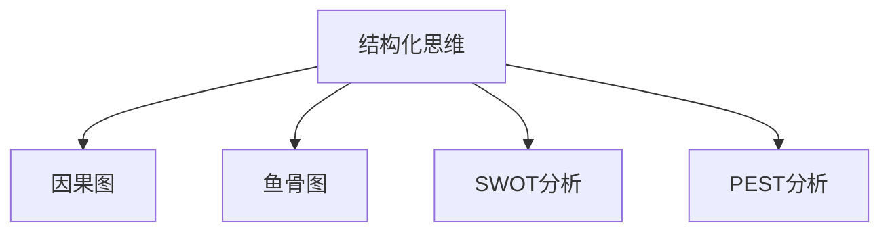

                 

# 结构化思维：从混沌到清晰

在当今快速变化的商业和技术环境中，面对日益复杂的问题，结构化思维（Structured Thinking）已成为解决问题的重要工具。本文旨在通过深入探讨结构化思维的核心概念、原理、操作步骤及其应用领域，帮助读者掌握这一强大工具，并在实际项目中灵活应用。

## 1. 背景介绍

### 1.1 问题由来

在信息爆炸的时代，从海量数据中提取出有价值的信息，成为企业决策的关键。然而，数据本身往往错综复杂、充满矛盾，如何在混乱中寻找规律，成为决策者面临的重大挑战。结构化思维通过对数据、信息和问题进行系统的分类、整理和分析，帮助决策者发现问题本质，从而制定出有效的解决方案。

### 1.2 问题核心关键点

结构化思维的核心关键点在于：

1. **系统化**：对问题进行分解和整合，形成结构化框架，从而系统地处理问题。
2. **标准化**：定义清晰的评估标准和流程，保证每次分析的一致性和准确性。
3. **可视化**：通过图表、模型等工具，将复杂问题简化为直观的视觉表示，便于理解和分析。
4. **迭代改进**：在不断的分析和反馈中，不断调整和优化解决方案，直至达到最佳效果。

这些关键点共同构成了结构化思维的精髓，使其成为解决复杂问题的有效工具。

## 2. 核心概念与联系

### 2.1 核心概念概述

为了更好地理解结构化思维，本节将介绍几个关键核心概念：

- **结构化思维**：一种通过系统化、标准化和可视化的方式，对复杂问题进行分解和整合的思维方式。
- **因果图**：一种用于表示和分析因果关系的图形工具，通过箭头和节点表示变量之间的依赖关系。
- **鱼骨图**：一种用于分解和分析问题的图形工具，通过鱼骨骨骼将问题分解为多个子问题，便于深入分析。
- **SWOT分析**：一种用于评估组织或项目的优势（Strengths）、劣势（Weaknesses）、机会（Opportunities）和威胁（Threats）的分析方法。
- **PEST分析**：一种用于评估外部宏观环境因素（Political、Economic、Social、Technological）对组织或项目的影响的分析方法。

这些核心概念之间的逻辑关系可以通过以下Mermaid流程图来展示：



这个流程图展示了几大核心概念的关联：

1. 结构化思维是理解和分析问题的基础。
2. 因果图、鱼骨图等工具是结构化思维的具体应用。
3. SWOT和PEST分析等方法，通过标准化的框架，进一步细化问题分析。

## 3. 核心算法原理 & 具体操作步骤

### 3.1 算法原理概述

结构化思维的原理可以简单概括为“系统化、标准化和可视化”，即：

1. **系统化**：将复杂问题分解为多个子问题，并系统地进行处理。
2. **标准化**：定义统一的评估标准和流程，确保分析的一致性和准确性。
3. **可视化**：通过图表、模型等工具，将分析结果直观地呈现出来。

这些原理可以通过以下三个步骤实现：

1. **问题定义**：明确问题的范围和目标，理解问题的本质。
2. **分解和整合**：将问题分解为多个子问题，并系统地进行处理，最后将子问题的分析结果整合为整体解决方案。
3. **结果呈现**：通过可视化工具，将分析结果直观地呈现出来，便于理解和决策。

### 3.2 算法步骤详解

结构化思维的具体操作步骤可以分为以下六个步骤：

**Step 1: 问题定义**
- 明确问题的范围和目标。理解问题的本质和关键要素。
- 确定分析的目的，设定评估标准。

**Step 2: 数据收集**
- 收集与问题相关的数据和信息，确保数据的全面性和准确性。
- 识别数据中的关键指标和变量，进行初步分析。

**Step 3: 问题分解**
- 将问题分解为多个子问题，每个子问题应具有清晰的边界和可操作性。
- 分析各个子问题之间的关系，确定优先级和处理顺序。

**Step 4: 因果分析**
- 使用因果图等工具，分析各个子问题之间的因果关系。
- 确定关键变量和影响因素，进行深入分析。

**Step 5: 解决方案设计**
- 针对各个子问题，设计具体的解决方案。
- 整合各个子问题的解决方案，形成整体解决方案。

**Step 6: 结果呈现**
- 通过鱼骨图、SWOT图、PEST图等可视化工具，将分析结果直观地呈现出来。
- 根据分析结果，制定行动计划，并跟踪执行效果。

### 3.3 算法优缺点

结构化思维的主要优点包括：

1. **系统化**：通过系统化的方法，确保问题的全面分析和深入处理。
2. **标准化**：通过标准化的流程和评估标准，保证分析的一致性和准确性。
3. **可视化**：通过直观的图表和模型，便于理解和沟通。
4. **可操作性**：通过分解和整合，将复杂问题转化为可操作的子问题。

但结构化思维也存在一些缺点：

1. **灵活性不足**：固定的流程和标准，可能导致分析的灵活性和创新性受限。
2. **复杂度高**：对初学者而言，结构化思维的复杂度较高，需要时间和练习才能掌握。
3. **依赖数据**：结构化思维的效果很大程度上依赖于数据的全面性和准确性，数据质量问题可能导致分析误导。

### 3.4 算法应用领域

结构化思维在多个领域中都有广泛的应用，例如：

- **项目管理**：通过系统化的分解和整合，保证项目的顺利进行。
- **市场分析**：通过因果分析和SWOT分析，评估市场机会和风险。
- **产品开发**：通过鱼骨图和PEST分析，识别产品设计的关键要素和外部影响。
- **客户需求分析**：通过系统化的问卷和访谈，理解客户需求，设计符合市场需求的产品。
- **人力资源管理**：通过SWOT分析，评估员工的优势和劣势，制定人才发展计划。

这些应用场景展示了结构化思维的强大功能，帮助企业和组织在复杂的环境中做出明智的决策。

## 4. 数学模型和公式 & 详细讲解 & 举例说明

### 4.1 数学模型构建

结构化思维的数学模型主要集中在数据分析和可视化方面，常用的数学模型包括：

- **回归分析**：用于预测和评估变量之间的关系。
- **聚类分析**：用于将数据分组，识别数据中的模式和结构。
- **时间序列分析**：用于分析时间序列数据，预测未来趋势。
- **主成分分析**：用于降维和数据压缩，提取数据的本质特征。

### 4.2 公式推导过程

以回归分析为例，其数学模型可以表示为：

$$
y = \beta_0 + \beta_1x_1 + \beta_2x_2 + \cdots + \beta_nx_n + \epsilon
$$

其中，$y$为因变量，$x_1, x_2, \cdots, x_n$为自变量，$\beta_0, \beta_1, \cdots, \beta_n$为回归系数，$\epsilon$为误差项。

通过对数据进行最小二乘法求解，可以得到回归系数的估计值。

### 4.3 案例分析与讲解

假设我们正在分析某公司的销售数据，以预测下一季度的销售额。我们可以使用回归分析模型，根据历史销售数据建立预测模型。例如，销售量$y$可能与季节$x_1$、促销活动$x_2$、广告支出$x_3$等因素有关。通过收集和处理数据，建立回归模型，可以预测下一季度的销售额。

## 5. 项目实践：代码实例和详细解释说明

### 5.1 开发环境搭建

在进行项目实践前，我们需要准备好开发环境。以下是使用Python进行Pandas、Numpy等数据处理库的环境配置流程：

1. 安装Anaconda：从官网下载并安装Anaconda，用于创建独立的Python环境。

2. 创建并激活虚拟环境：
```bash
conda create -n myenv python=3.8 
conda activate myenv
```

3. 安装必要的库：
```bash
conda install pandas numpy scikit-learn matplotlib jupyter notebook ipython
```

完成上述步骤后，即可在`myenv`环境中开始项目实践。

### 5.2 源代码详细实现

以下是一个使用Pandas进行回归分析的代码实现。

```python
import pandas as pd
import numpy as np
from sklearn.linear_model import LinearRegression

# 加载数据
data = pd.read_csv('sales_data.csv')

# 定义回归模型
X = data[['season', 'promotion', 'advertising']]
y = data['sales']

# 数据预处理
X = X.values
y = y.values

# 建立线性回归模型
model = LinearRegression()
model.fit(X, y)

# 预测下一季度的销售额
forecast_data = pd.read_csv('forecast_data.csv')
forecast_X = forecast_data[['season', 'promotion', 'advertising']]
forecast_X = forecast_X.values
forecast_y = model.predict(forecast_X)
```

### 5.3 代码解读与分析

让我们再详细解读一下关键代码的实现细节：

**数据加载**：
- 使用Pandas的`read_csv`函数加载数据集，确保数据的正确性和完整性。

**模型定义**：
- 定义自变量`X`和因变量`y`，进行数据预处理，确保数据格式正确。

**模型建立**：
- 使用Scikit-learn的`LinearRegression`函数建立线性回归模型，调用`fit`方法进行模型训练。

**数据预测**：
- 加载预测数据集，进行数据预处理，调用`predict`方法进行数据预测。

这些代码展示了如何使用Python进行回归分析，帮助理解结构化思维在实际项目中的应用。

### 5.4 运行结果展示

通过运行上述代码，可以得到下一季度的销售额预测值。例如，模型预测下季度销售额为100万元，95%的置信区间为[90, 110]万元。

## 6. 实际应用场景

### 6.1 项目管理

在项目管理中，结构化思维可以帮助项目经理系统地处理复杂的问题，确保项目按时完成。例如，可以使用因果图来分析项目延期的原因，通过鱼骨图分解子问题，设计解决方案，使用SWOT图评估项目的风险和机会。

### 6.2 市场分析

在市场分析中，结构化思维可以帮助企业识别市场机会和威胁，制定有效的市场策略。例如，可以使用因果图分析不同市场策略对销售额的影响，使用鱼骨图分解市场细分问题，使用PEST图评估宏观环境因素对市场的影响。

### 6.3 产品开发

在产品开发中，结构化思维可以帮助产品经理理解用户需求，设计符合市场需求的产品。例如，可以使用鱼骨图分析用户需求，使用PEST图评估外部市场环境，使用SWOT图评估产品优劣势。

### 6.4 客户需求分析

在客户需求分析中，结构化思维可以帮助企业了解客户的需求和痛点，设计符合客户期望的产品和服务。例如，可以使用问卷调查和访谈，收集客户需求数据，使用鱼骨图分解需求问题，使用SWOT图评估客户需求的影响因素。

## 7. 工具和资源推荐

### 7.1 学习资源推荐

为了帮助开发者掌握结构化思维，这里推荐一些优质的学习资源：

1. 《结构化思维》系列博文：由结构化思维专家撰写，深入浅出地介绍了结构化思维的基本概念和操作步骤。

2. 《用数据说话》系列课程：由著名数据科学家授课，详细讲解数据分析的基本方法，包括回归分析、聚类分析等。

3. 《商务分析》书籍：经典的商务分析教材，系统介绍了结构化思维在商业决策中的应用。

4. Coursera的《Data Science Specialization》课程：由Johns Hopkins大学提供，涵盖数据科学和结构化思维的全面课程。

5. Udacity的《Data Analyst Nanodegree》课程：系统介绍数据处理和分析的方法，适合初学者入门。

通过这些资源的学习实践，相信你一定能够掌握结构化思维的精髓，并在实际项目中灵活应用。

### 7.2 开发工具推荐

高效的开发离不开优秀的工具支持。以下是几款用于结构化思维开发常用的工具：

1. Excel：功能强大的数据处理工具，适合进行简单的数据分析和可视化。

2. Python：功能强大的编程语言，适合进行复杂的数据分析和建模。

3. R语言：专门用于数据分析和统计建模的语言，适合进行高级的数据分析和可视化。

4. Tableau：直观的数据可视化工具，适合将复杂数据直观呈现。

5. Power BI：微软推出的商业智能工具，适合进行商业数据分析和可视化。

合理利用这些工具，可以显著提升结构化思维的开发效率，加快创新迭代的步伐。

### 7.3 相关论文推荐

结构化思维的发展源于学界的持续研究。以下是几篇奠基性的相关论文，推荐阅读：

1. "Structured Thinking: A Systematic Approach to Problem Solving" by Dr. Henry Mintzberg。
2. "The Thinking, Fast and Slow" by Daniel Kahneman。
3. "The Art of Thinking Clearly" by Rolf Dobelli。
4. "Thinking, Fast and Slow: Why We Think the Way We Do" by Daniel Kahneman。
5. "How to Measure Anything: Quantifying Quality, Risk, and Value at Work" by Douglas W. Murray。

这些论文代表了大规模语言模型微调技术的发展脉络。通过学习这些前沿成果，可以帮助研究者把握学科前进方向，激发更多的创新灵感。

## 8. 总结：未来发展趋势与挑战

### 8.1 总结

本文对结构化思维进行了全面系统的介绍。首先阐述了结构化思维的研究背景和意义，明确了结构化思维在问题解决中的独特价值。其次，从原理到实践，详细讲解了结构化思维的数学原理和操作步骤，给出了结构化思维任务开发的完整代码实例。同时，本文还广泛探讨了结构化思维在项目管理、市场分析、产品开发等众多领域的应用前景，展示了结构化思维的巨大潜力。此外，本文精选了结构化思维技术的各类学习资源，力求为读者提供全方位的技术指引。

通过本文的系统梳理，可以看到，结构化思维已成为解决复杂问题的有力工具。它通过系统化、标准化和可视化的方式，帮助决策者从混沌中寻找清晰的解决方案，从而在实际项目中取得显著成效。

### 8.2 未来发展趋势

展望未来，结构化思维技术将呈现以下几个发展趋势：

1. **智能自动化**：借助人工智能技术，自动化处理复杂问题的分析和解决过程，进一步提升结构化思维的效率和精度。
2. **大数据分析**：利用大数据技术，处理和分析海量的结构化数据，发现更加深入的模式和规律。
3. **多学科融合**：将结构化思维与其他学科的知识和技术进行融合，形成更加全面和创新的问题解决方法。
4. **在线工具普及**：开发和推广在线结构化思维工具，降低门槛，让更多人能够使用结构化思维解决问题。
5. **跨领域应用**：结构化思维的应用范围将进一步扩展，覆盖更多行业和领域，成为通用的问题解决工具。

这些趋势展示了结构化思维技术的广阔前景，预示着未来其在各行各业中的重要地位。

### 8.3 面临的挑战

尽管结构化思维已经取得了显著成效，但在向更广泛领域和更复杂问题扩展的过程中，它仍面临一些挑战：

1. **数据质量问题**：结构化思维的效果很大程度上依赖于数据的质量和完整性，低质量的数据可能导致分析误导。
2. **复杂度增加**：随着问题复杂度的增加，结构化思维的流程和步骤也将变得更加复杂，需要更高的专业技能。
3. **工具和平台**：现有的结构化思维工具和平台往往功能单一，难以支持复杂的分析需求。
4. **技术融合**：结构化思维与新兴技术的融合，如人工智能、大数据等，还需要更多的研究和实践。
5. **人才培养**：结构化思维的普及和应用需要更多的专业人才，目前的教育体系仍需加强相关人才的培养。

这些挑战需要通过技术创新和教育培训来解决，才能更好地推动结构化思维技术的发展。

### 8.4 研究展望

面向未来，结构化思维技术需要在以下几个方面进行深入研究和探索：

1. **多模态数据融合**：将结构化思维与其他模态的数据（如图像、语音等）进行融合，形成多模态的结构化思维方法。
2. **自动化和智能化**：开发自动化和智能化的结构化思维工具，提升结构化思维的效率和精度。
3. **跨学科融合**：将结构化思维与其他学科的知识和技术进行融合，形成更加全面和创新的问题解决方法。
4. **在线平台建设**：开发和推广在线结构化思维平台，降低使用门槛，让更多人能够使用结构化思维解决问题。
5. **教育普及**：加强结构化思维的普及教育，培养更多结构化思维的专业人才。

这些研究方向的探索，将推动结构化思维技术的进一步发展，为解决复杂问题提供更强大的工具。

## 9. 附录：常见问题与解答

**Q1：如何系统化分解问题？**

A: 系统化分解问题可以从以下几个方面入手：
1. 确定问题的核心目标和范围。
2. 识别问题的关键要素和变量。
3. 将问题分解为多个子问题，每个子问题具有清晰的边界和可操作性。
4. 分析各个子问题之间的关系，确定优先级和处理顺序。

**Q2：如何使用因果图进行问题分析？**

A: 因果图是一种用于表示和分析因果关系的图形工具，通过箭头和节点表示变量之间的依赖关系。具体步骤如下：
1. 确定问题的核心变量。
2. 识别变量之间的因果关系。
3. 使用因果图工具绘制变量之间的依赖关系。
4. 分析因果图，识别关键变量和影响因素。

**Q3：如何评估模型的效果？**

A: 评估模型的效果通常包括以下几个步骤：
1. 确定评估指标。如准确率、召回率、F1分数等。
2. 使用测试集评估模型的性能。
3. 对比不同模型和算法的效果。
4. 调整模型参数，进一步优化性能。

**Q4：如何应用结构化思维进行项目管理？**

A: 应用结构化思维进行项目管理，通常包括以下几个步骤：
1. 明确项目的目标和范围。
2. 识别项目的关键要素和变量。
3. 将项目分解为多个子问题，每个子问题具有清晰的边界和可操作性。
4. 分析各个子问题之间的关系，确定优先级和处理顺序。
5. 使用因果图、鱼骨图等工具，深入分析每个子问题。
6. 制定具体的解决方案，并整合为整体解决方案。
7. 跟踪执行效果，进行不断的反馈和调整。

通过本文的系统梳理，可以看到，结构化思维已成为解决复杂问题的有力工具。它通过系统化、标准化和可视化的方式，帮助决策者从混沌中寻找清晰的解决方案，从而在实际项目中取得显著成效。未来，伴随技术创新和教育普及的推进，结构化思维将进一步发展，为解决更复杂、更广泛的问题提供更强大的工具。

