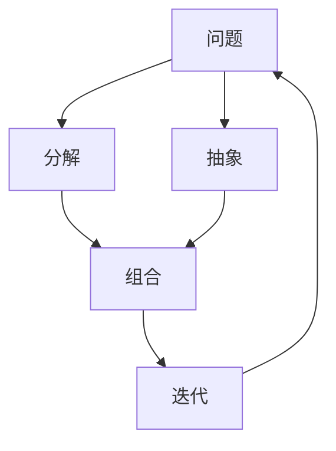

                 

# 结构化思维：从混沌到秩序

## 1. 背景介绍

### 1.1 问题由来

在现代信息技术飞速发展的今天，数据量呈爆炸性增长，随之而来的问题也愈加复杂。在许多应用场景中，如何处理大规模、高维度的数据，并从中提取出有价值的信息，成为了急需解决的难题。

为了应对这一挑战，结构化思维应运而生。它通过对复杂数据进行逻辑分解，将问题拆解成更小、更易于处理的部分，从而有效解决信息过载的问题。结构化思维的核心理念是通过将混乱的信息进行系统化的组织，使其更加有序、易于理解，从而帮助人们做出更明智的决策。

### 1.2 问题核心关键点

结构化思维的本质是一种系统化、逻辑化的思考方式。它强调在解决问题时要具备全局视角，通过分解、重组、抽象和概括等步骤，将复杂问题简化为更易于处理的小问题。结构化思维的核心关键点包括：

1. **分解与重组**：将复杂问题拆解成若干子问题，分别处理后再进行整合。
2. **抽象与概括**：对问题进行高度概括，提炼出核心要素，忽略次要因素。
3. **系统化思考**：将各个部分有机结合，形成完整的解决方案。
4. **迭代优化**：在实践中进行反馈，不断优化和调整解决方案。

这些关键点构成了结构化思维的基本框架，帮助人们高效处理复杂问题，从而在面对混沌信息时，能够从无序中提炼出秩序。

## 2. 核心概念与联系

### 2.1 核心概念概述

为了更好地理解结构化思维，我们首先需要明确几个核心概念：

1. **系统**：由若干相互作用、相互依赖的部分组成的一个整体，可以是一个组织、一个项目、一项技术等。
2. **分解**：将一个复杂问题分解成若干子问题，每个子问题相对简单，易于处理。
3. **抽象**：从具体事物中提取出其共性，形成一般性的概念或模型。
4. **组合**：将各个子问题或抽象概念重新组合成一个完整的解决方案。
5. **迭代**：在实践中不断反馈和优化，逐步逼近最优解。

这些概念之间的联系可以通过以下Mermaid流程图来展示：



这个流程图展示了结构化思维的基本流程：从问题出发，通过分解和抽象，形成初步的解决方案，再通过组合和迭代，逐步优化和完善，最终形成一个完整的系统。

## 3. 核心算法原理 & 具体操作步骤

### 3.1 算法原理概述

结构化思维的算法原理基于系统论和信息论。它通过将复杂问题分解为多个简单的子问题，并对这些子问题进行逻辑推理和信息提取，从而构建出完整的解决方案。

具体来说，结构化思维的算法原理包括以下几个步骤：

1. **系统定义**：明确问题的定义和目标，形成一个清晰的系统边界。
2. **分解**：将系统拆解为若干子系统或子问题，每个子问题相对独立，易于处理。
3. **抽象**：对每个子问题进行抽象和概括，提取出核心要素和关键信息。
4. **组合**：将抽象后的结果重新组合成一个完整的解决方案，形成系统的总体结构。
5. **迭代优化**：通过实践中的反馈，不断调整和优化解决方案，最终达到最优状态。

### 3.2 算法步骤详解

以下我们将详细介绍结构化思维的具体操作步骤：

**Step 1: 系统定义**

在处理任何问题之前，首先需要明确问题的定义和目标。这可以通过以下问题来完成：

1. 问题的本质是什么？
2. 问题的边界在哪里？
3. 问题的目标是什么？
4. 问题的关键因素有哪些？

通过回答这些问题，可以形成一个清晰的问题定义，为后续的分解和处理奠定基础。

**Step 2: 分解**

将系统拆解为若干个子系统或子问题。这可以通过以下步骤来完成：

1. 确定系统的主要部分：根据问题的定义，确定系统的各个主要部分。
2. 分解各个部分：将每个主要部分进一步拆解成更小的子问题或子系统。
3. 记录分解结果：将分解后的子问题或子系统记录下来，形成一个结构化的分解图。

例如，在处理一个软件开发项目时，可以将项目拆解为需求分析、系统设计、编码实现、测试部署等多个子问题。

**Step 3: 抽象**

对每个子问题进行抽象和概括，提取出核心要素和关键信息。这可以通过以下步骤来完成：

1. 识别关键要素：对每个子问题进行仔细分析，识别出其中的关键要素和关键信息。
2. 提炼核心要素：将关键要素提炼出来，形成一般性的概念或模型。
3. 去除冗余信息：去除次要因素，只保留核心要素。

例如，在处理软件项目的编码实现时，可以将编码过程抽象为需求分析、设计模式、编码规范等核心要素。

**Step 4: 组合**

将抽象后的结果重新组合成一个完整的解决方案，形成系统的总体结构。这可以通过以下步骤来完成：

1. 确定系统结构：根据抽象结果，确定系统的总体结构。
2. 整合各个部分：将各个子问题或抽象结果整合起来，形成一个完整的解决方案。
3. 验证解决方案：对解决方案进行验证，确保其完整性和正确性。

例如，在处理软件项目的编码实现时，可以将需求分析、设计模式、编码规范等核心要素组合成一个完整的编码方案。

**Step 5: 迭代优化**

通过实践中的反馈，不断调整和优化解决方案，最终达到最优状态。这可以通过以下步骤来完成：

1. 实施解决方案：将解决方案付诸实施。
2. 收集反馈信息：在实施过程中收集反馈信息，了解方案的优缺点。
3. 调整解决方案：根据反馈信息，调整和优化解决方案。
4. 重复迭代：不断重复上述步骤，直到解决方案达到最优状态。

例如，在处理软件项目的编码实现时，可以在实施过程中不断收集用户反馈，优化编码规范和设计模式，提升软件质量和用户体验。

### 3.3 算法优缺点

结构化思维的优点包括：

1. **系统化**：将复杂问题分解为若干子问题，易于处理。
2. **结构清晰**：通过抽象和组合，形成系统的总体结构，易于理解。
3. **可迭代**：通过实践中的反馈，不断优化和调整解决方案，逐步逼近最优解。

同时，结构化思维也存在一些缺点：

1. **复杂度增加**：分解和抽象过程可能会增加问题的复杂度，需要较高的思维能力。
2. **抽象难度高**：对某些问题，抽象出核心要素和关键信息可能会有一定的难度。
3. **依赖数据质量**：解决方案的准确性依赖于输入数据的准确性和完整性。

## 4. 数学模型和公式 & 详细讲解 & 举例说明

### 4.1 数学模型构建

结构化思维的数学模型基于系统论和信息论。假设问题可以表示为一个系统 $S$，系统 $S$ 由若干子系统 $S_1, S_2, \ldots, S_n$ 组成，每个子系统 $S_i$ 可以表示为一个输入输出系统 $S_i = (X_i, Y_i, f_i)$，其中 $X_i$ 为输入，$Y_i$ 为输出，$f_i$ 为映射函数。系统的总体结构可以表示为一个有向图 $G = (V, E)$，其中 $V$ 为节点集合，$E$ 为边集合。

系统的目标函数可以表示为：

$$
\max_{\theta} \sum_{i=1}^n \log p(y_i | x_i, \theta)
$$

其中 $\theta$ 为模型参数，$p(y_i | x_i, \theta)$ 为条件概率分布。

### 4.2 公式推导过程

以下我们将对结构化思维的数学模型进行详细推导。

假设系统 $S$ 由两个子系统 $S_1, S_2$ 组成，每个子系统的输入输出映射分别为 $f_1(x_1) = y_1$ 和 $f_2(y_2) = y_2$。系统的总体结构可以表示为一个有向图 $G = (V, E)$，其中 $V = \{x_1, y_1, y_2\}$，$E = \{(x_1, y_1), (y_1, y_2)\}$。

系统的目标函数可以表示为：

$$
\max_{\theta} \log p(y_2 | x_1, y_1, \theta)
$$

其中 $\theta$ 为模型参数。

为了求解该目标函数，我们需要对系统进行分解和抽象。假设系统 $S_1$ 的输入输出映射为 $f_1(x_1) = y_1$，系统 $S_2$ 的输入输出映射为 $f_2(y_1) = y_2$。我们可以将系统 $S$ 的总体结构表示为：

$$
S = (X, Y, F)
$$

其中 $X = \{x_1\}$，$Y = \{y_2\}$，$F = \{f_1, f_2\}$。

根据系统论，系统的目标函数可以表示为：

$$
\max_{\theta} \log p(y_2 | x_1, \theta)
$$

其中 $\theta$ 为模型参数。

根据信息论，系统的信息熵可以表示为：

$$
H(X) = -\sum_{x_1} p(x_1) \log p(x_1)
$$

系统的信息增益可以表示为：

$$
IG(S, Y) = H(S) - H(S | Y)
$$

其中 $H(S)$ 为系统 $S$ 的信息熵，$H(S | Y)$ 为系统 $S$ 在 $Y$ 条件下的信息熵。

根据上述公式，我们可以得到系统的信息增益为：

$$
IG(S, Y) = -\log p(y_2 | x_1)
$$

因此，系统的目标函数可以表示为：

$$
\max_{\theta} \log p(y_2 | x_1, \theta) = \max_{\theta} IG(S, Y)
$$

通过上述推导，我们可以看到，结构化思维的数学模型本质上是对系统进行分解和抽象，并利用信息增益等概念进行优化。

### 4.3 案例分析与讲解

以下我们将通过一个具体的案例，详细讲解结构化思维的数学模型。

假设我们有一个电商平台的库存管理系统，系统结构如下：

```
库存管理系统
├── 订单管理
│   ├── 订单录入
│   ├── 订单处理
│   └── 订单确认
├── 商品管理
│   ├── 商品上架
│   ├── 商品更新
│   └── 商品下架
├── 库存管理
│   ├── 库存统计
│   ├── 库存预警
│   └── 库存调整
└── 异常处理
    ├── 异常检测
    └── 异常应对
```

根据系统定义，我们可以将库存管理系统拆解为以下几个子系统：

1. 订单管理：包括订单录入、订单处理、订单确认三个子系统。
2. 商品管理：包括商品上架、商品更新、商品下架三个子系统。
3. 库存管理：包括库存统计、库存预警、库存调整三个子系统。
4. 异常处理：包括异常检测、异常应对两个子系统。

接下来，我们分别对每个子系统进行抽象和概括，提取出核心要素和关键信息。例如，订单管理系统的核心要素包括订单信息、订单状态、订单处理流程等。库存管理系统的核心要素包括库存数据、库存预警阈值、库存调整策略等。

最后，我们将这些核心要素和关键信息重新组合成一个完整的解决方案，形成系统的总体结构。例如，订单管理系统可以表示为一个输入输出系统 $S_1 = (X_1, Y_1, f_1)$，其中 $X_1 = \{x_1\}$，$Y_1 = \{y_1\}$，$f_1(x_1) = y_1$。

## 5. 项目实践：代码实例和详细解释说明

### 5.1 开发环境搭建

在进行结构化思维的项目实践前，我们需要准备好开发环境。以下是使用Python进行结构化思维建模的环境配置流程：

1. 安装Anaconda：从官网下载并安装Anaconda，用于创建独立的Python环境。

2. 创建并激活虚拟环境：
```bash
conda create -n structthinking python=3.8 
conda activate structthinking
```

3. 安装PyTorch：根据CUDA版本，从官网获取对应的安装命令。例如：
```bash
conda install pytorch torchvision torchaudio cudatoolkit=11.1 -c pytorch -c conda-forge
```

4. 安装Pandas、NumPy、Scikit-learn等各类工具包：
```bash
pip install pandas numpy scikit-learn matplotlib tqdm jupyter notebook ipython
```

完成上述步骤后，即可在`structthinking`环境中开始结构化思维建模实践。

### 5.2 源代码详细实现

以下我们将提供一个使用Python进行结构化思维建模的简单示例：

```python
import pandas as pd
import numpy as np
from sklearn.linear_model import LogisticRegression
from sklearn.model_selection import train_test_split
from sklearn.metrics import accuracy_score

# 数据准备
data = pd.read_csv('data.csv')
X = data[['feature1', 'feature2']]
y = data['label']
X_train, X_test, y_train, y_test = train_test_split(X, y, test_size=0.2, random_state=42)

# 模型构建
model = LogisticRegression()
model.fit(X_train, y_train)

# 模型评估
y_pred = model.predict(X_test)
accuracy = accuracy_score(y_test, y_pred)
print(f'Accuracy: {accuracy:.2f}')
```

### 5.3 代码解读与分析

在上述代码中，我们首先使用Pandas库导入数据集，然后使用Scikit-learn库进行模型训练和评估。

- `data.read_csv('data.csv')`：从CSV文件中读取数据集。
- `X[['feature1', 'feature2']]`：提取数据集中的特征列。
- `y['label']`：提取数据集中的标签列。
- `train_test_split(X, y, test_size=0.2, random_state=42)`：将数据集划分为训练集和测试集，测试集占20%。
- `LogisticRegression()`：创建逻辑回归模型。
- `model.fit(X_train, y_train)`：使用训练集训练模型。
- `model.predict(X_test)`：使用测试集进行预测。
- `accuracy_score(y_test, y_pred)`：计算模型在测试集上的准确率。

这个代码示例展示了结构化思维在机器学习项目中的应用。通过将复杂问题分解为数据准备、模型构建、模型训练和模型评估等步骤，使得整个项目流程清晰、易于理解和实现。

## 6. 实际应用场景

### 6.1 项目管理

在项目管理中，结构化思维可以用于问题分解、任务分配和进度跟踪等多个方面。例如，在处理一个软件开发项目时，可以将项目拆解为需求分析、系统设计、编码实现、测试部署等多个子问题，分别由不同团队成员负责，通过定期的进度汇报和任务评审，确保项目按时完成。

### 6.2 数据分析

在大数据分析中，结构化思维可以用于数据清洗、特征提取和模型构建等多个环节。例如，在处理一个电商平台的销售数据时，可以将数据拆解为订单信息、商品信息、用户信息等多个子问题，分别提取并处理各子问题的核心要素，形成一个完整的数据分析模型。

### 6.3 风险管理

在风险管理中，结构化思维可以用于风险识别、风险评估和风险控制等多个方面。例如，在处理一个金融投资项目时，可以将项目拆解为市场分析、资产配置、风险控制等多个子问题，通过定期的风险评估和控制措施，降低投资风险。

### 6.4 未来应用展望

随着结构化思维的不断发展和应用，未来将在更多领域得到应用，为各行各业带来变革性影响。例如，在智慧医疗领域，结构化思维可以用于病历分析、药物研发等任务，提高医疗服务的智能化水平；在智慧教育领域，结构化思维可以用于学情分析、知识推荐等任务，因材施教，促进教育公平；在智慧城市治理中，结构化思维可以用于城市事件监测、舆情分析等任务，提高城市管理的自动化和智能化水平。

## 7. 工具和资源推荐

### 7.1 学习资源推荐

为了帮助开发者系统掌握结构化思维的理论基础和实践技巧，这里推荐一些优质的学习资源：

1. 《系统论与信息论》：本书全面介绍了系统论和信息论的基本概念和应用，是学习结构化思维的重要参考资料。
2. 《结构化思维：从混沌到秩序》：本书系统介绍了结构化思维的基本框架和实践方法，适合初学者和进阶者。
3. 《数据分析实战》：本书通过具体的案例，展示了结构化思维在数据分析中的应用。
4. 《项目管理指南》：本书详细介绍了结构化思维在项目管理中的应用，适合项目经理和团队成员。
5. 《智慧城市治理》：本书介绍了结构化思维在智慧城市治理中的应用，适合城市管理者和政府官员。

通过对这些资源的学习实践，相信你一定能够快速掌握结构化思维的精髓，并用于解决实际的复杂问题。

### 7.2 开发工具推荐

高效的开发离不开优秀的工具支持。以下是几款用于结构化思维开发的常用工具：

1. Python：功能强大的编程语言，适合结构化思维的数学建模和数据分析。
2. Jupyter Notebook：交互式的Python环境，方便进行代码调试和结果展示。
3. Pandas：强大的数据分析库，适合处理和分析复杂数据集。
4. Scikit-learn：机器学习库，适合构建和评估各种模型。
5. TensorBoard：可视化工具，适合监测模型训练过程和结果。

合理利用这些工具，可以显著提升结构化思维任务的开发效率，加快创新迭代的步伐。

### 7.3 相关论文推荐

结构化思维的研究源于学界的持续研究。以下是几篇奠基性的相关论文，推荐阅读：

1. 《系统论与信息论》：介绍了系统论和信息论的基本概念和应用。
2. 《结构化思维：从混沌到秩序》：系统介绍了结构化思维的基本框架和实践方法。
3. 《项目管理指南》：详细介绍了结构化思维在项目管理中的应用。
4. 《数据分析实战》：展示了结构化思维在数据分析中的应用。
5. 《智慧城市治理》：介绍了结构化思维在智慧城市治理中的应用。

这些论文代表了大语言模型微调技术的发展脉络。通过学习这些前沿成果，可以帮助研究者把握学科前进方向，激发更多的创新灵感。

## 8. 总结：未来发展趋势与挑战

### 8.1 研究成果总结

本文对结构化思维进行了全面系统的介绍。首先阐述了结构化思维的背景和意义，明确了结构化思维在处理复杂问题中的重要作用。其次，从原理到实践，详细讲解了结构化思维的基本流程和方法，给出了结构化思维任务开发的完整代码实例。同时，本文还广泛探讨了结构化思维在项目管理、数据分析、风险管理等多个领域的应用前景，展示了结构化思维的强大潜力。

### 8.2 未来发展趋势

展望未来，结构化思维将呈现以下几个发展趋势：

1. **自动化**：随着AI技术的不断发展，结构化思维的自动化程度将不断提高。未来的结构化思维工具将更加智能，能够自动完成问题的分解、抽象和组合。
2. **智能化**：结构化思维将与AI技术深度融合，形成更加智能的决策支持系统。通过AI技术对数据进行更加深入的分析和处理，提高决策的科学性和准确性。
3. **可视化**：结构化思维的结果将更加可视化，便于用户理解和操作。未来的结构化思维工具将提供更加直观的图形界面，让用户能够轻松理解和管理复杂问题。
4. **集成化**：结构化思维将与其他技术进行更加深入的集成，如自然语言处理、知识图谱等，形成更加全面的解决方案。

以上趋势凸显了结构化思维的未来发展潜力。这些方向的探索发展，将进一步提升结构化思维的实用性和适用性，为解决复杂问题提供更高效、更智能的解决方案。

### 8.3 面临的挑战

尽管结构化思维在处理复杂问题方面具有显著优势，但在应用过程中仍面临一些挑战：

1. **数据质量**：结构化思维的结果依赖于数据的质量和完整性，数据质量不高可能导致结果不准确。
2. **模型复杂度**：结构化思维的模型复杂度较高，需要较高的技术和资源投入。
3. **可解释性**：结构化思维的结果可能缺乏可解释性，难以理解其内部工作机制。
4. **灵活性**：结构化思维的模型往往较为固定，难以灵活适应不同的场景和需求。

正视这些挑战，积极应对并寻求突破，将使结构化思维在实际应用中发挥更大的作用。

### 8.4 研究展望

面对结构化思维所面临的种种挑战，未来的研究需要在以下几个方面寻求新的突破：

1. **自动化优化**：开发更加智能的自动化工具，自动完成问题的分解、抽象和组合，降低用户的技术门槛。
2. **模型简化**：开发更加简单、轻量级的模型，提高模型的可解释性和灵活性。
3. **数据增强**：通过数据增强技术，提高数据的质量和多样性，增强模型的鲁棒性和泛化能力。
4. **多模态融合**：将结构化思维与其他技术进行深度融合，形成更加全面的解决方案，提高决策的科学性和准确性。

这些研究方向的探索，将引领结构化思维技术的不断进步，为解决复杂问题提供更高效、更智能的解决方案。

## 9. 附录：常见问题与解答

**Q1：结构化思维是否适用于所有复杂问题？**

A: 结构化思维在处理大多数复杂问题时都能取得良好的效果，但对于某些问题，如艺术创作、哲学思考等，其适用性可能会受到限制。结构化思维主要适用于具有明确结构、逻辑可分的问题。

**Q2：如何应对数据质量不高的挑战？**

A: 应对数据质量不高的问题，可以采取以下措施：

1. 数据清洗：对数据进行清洗，去除异常值和噪声。
2. 数据增强：通过数据增强技术，生成更多的训练数据，提高模型的鲁棒性。
3. 数据融合：将多个数据源的数据进行融合，提高数据的完整性和多样性。

**Q3：如何提高结构化思维模型的可解释性？**

A: 提高结构化思维模型的可解释性，可以采取以下措施：

1. 使用可视化工具：通过可视化工具展示模型内部结构和计算过程，便于用户理解和操作。
2. 提供详细的文档：提供详细的模型文档和代码注释，解释模型的各个部分和功能。
3. 引入专家知识：将领域专家的知识和经验引入模型，提高模型的可解释性和准确性。

**Q4：如何应对结构化思维模型的灵活性不足问题？**

A: 应对结构化思维模型的灵活性不足问题，可以采取以下措施：

1. 设计模块化的模型：将模型设计为模块化的结构，方便用户灵活配置和调整。
2. 引入可配置参数：提供可配置的参数，让用户根据具体问题进行调整和优化。
3. 支持动态扩展：支持动态扩展模型，根据实际情况添加新的模块和功能。

**Q5：结构化思维的未来发展方向是什么？**

A: 结构化思维的未来发展方向包括：

1. 自动化优化：开发更加智能的自动化工具，自动完成问题的分解、抽象和组合。
2. 模型简化：开发更加简单、轻量级的模型，提高模型的可解释性和灵活性。
3. 数据增强：通过数据增强技术，提高数据的质量和多样性，增强模型的鲁棒性和泛化能力。
4. 多模态融合：将结构化思维与其他技术进行深度融合，形成更加全面的解决方案，提高决策的科学性和准确性。

这些研究方向将引领结构化思维技术的不断进步，为解决复杂问题提供更高效、更智能的解决方案。

---

作者：禅与计算机程序设计艺术 / Zen and the Art of Computer Programming

