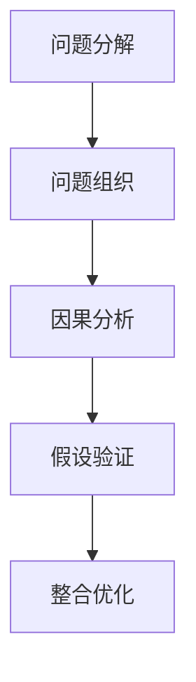

                 

# 结构化思维：理解世界的钥匙

## 1. 背景介绍

### 1.1 问题由来
在当今信息爆炸、知识碎片化的时代，面对庞杂的信息和错综复杂的问题，我们需要一种高效、系统的方法来理解和处理。结构化思维（Structured Thinking）正是一种在处理复杂问题时，能够帮助我们快速分解、分析和整合信息的思维方式。结构化思维不仅应用于解决问题，也广泛应用于项目管理、战略规划、科学研究和日常生活中的各个领域。本文将从核心概念、算法原理、应用实践等方面深入探讨结构化思维，旨在帮助读者掌握这一重要的思维方式，提升问题解决的效率和质量。

### 1.2 问题核心关键点
结构化思维的关键在于将复杂问题分解成多个易于管理和处理的部分，通过系统化的思考和分析，逐步找到问题的本质和解决方案。其核心包括以下几个方面：

- **分解**：将问题分解成多个子问题，逐层分析，简化问题复杂度。
- **组织**：将子问题按照逻辑关系组织成结构化的框架，便于理解和处理。
- **整合**：在子问题解决的基础上，整合分析结果，形成完整的解决方案。

这些关键点共同构成了结构化思维的核心框架，有助于我们在面对复杂问题时，能够清晰、系统地找到解决问题的路径和方法。

### 1.3 问题研究意义
掌握结构化思维，对于提升个人和组织的问题解决能力，提高决策质量，推动创新和改进具有重要意义：

- **提升效率**：结构化思维通过分解和组织，使问题更易于理解和处理，减少了处理问题的复杂度和时间成本。
- **增强质量**：系统化的分析方法能够减少遗漏和错误，提高问题解决的准确性和可靠性。
- **促进创新**：结构化思维鼓励从多个角度审视问题，激发新的思考和创意，推动技术的突破和进步。
- **增强适应性**：通过结构化分析，能够更灵活地应对不同情境和变化，提升组织的弹性和竞争力。
- **改善沟通**：结构化思维方式有助于团队成员之间的有效沟通，提升协作效率。

掌握结构化思维，能够帮助我们在复杂多变的环境中，更高效、系统地解决问题，推动个人和组织的持续发展和进步。

## 2. 核心概念与联系

### 2.1 核心概念概述
结构化思维作为一种系统化的思考方式，包括以下几个核心概念：

- **问题分解**：将大问题拆分为多个小问题，便于逐层分析和处理。
- **问题组织**：将分解后的小问题按照逻辑关系组织成结构化的框架。
- **因果分析**：通过分析问题之间的因果关系，找到问题的根本原因和解决方案。
- **假设验证**：提出假设，通过实验或推理验证其正确性，逐步接近问题本质。
- **整合优化**：在假设验证的基础上，整合分析结果，形成完整的解决方案，并进行优化。

这些核心概念之间存在密切联系，共同构成结构化思维的全流程。通过理解这些概念的原理和架构，可以帮助我们更好地应用结构化思维解决问题。

### 2.2 核心概念原理和架构的 Mermaid 流程图


这个流程图展示了结构化思维的基本流程：

1. 将大问题分解为小问题。
2. 对分解后的小问题进行组织和结构化。
3. 通过因果分析找到问题的根本原因。
4. 提出假设，验证假设的正确性。
5. 整合分析结果，形成完整的解决方案并进行优化。

## 3. 核心算法原理 & 具体操作步骤

### 3.1 算法原理概述
结构化思维的本质是一种问题解决的算法和流程。其核心思想是通过系统化的分析和推理，逐步找到问题的本质和解决方案。在实际操作中，结构化思维主要分为问题分解、组织、因果分析、假设验证和整合优化五个步骤。

### 3.2 算法步骤详解
#### 3.2.1 问题分解
问题分解是将大问题拆分为多个小问题的过程。其目的是通过分解，将复杂问题简化为多个易于处理的小问题，从而便于进一步分析和解决。

**操作步骤**：
1. 确定问题的核心目标和关键指标。
2. 将问题拆分为多个子问题，每个子问题独立且可处理。
3. 对每个子问题进行分析，确定其解决步骤和方法。

**示例**：假设我们需要设计一个复杂的软件系统，我们可以将其分解为以下几个子问题：
- 需求分析：确定系统需求和用户需求。
- 设计架构：设计系统的整体架构和技术架构。
- 编码实现：编写系统的核心代码和模块。
- 测试和优化：进行系统测试和性能优化。

#### 3.2.2 问题组织
问题组织是将分解后的小问题按照逻辑关系组织成结构化的框架。其目的是通过结构化，使问题的解决过程更加清晰、有序。

**操作步骤**：
1. 确定问题的层次结构和逻辑关系。
2. 将子问题按照逻辑关系排列，形成问题树或问题图。
3. 对问题树或问题图进行优化和调整，确保其合理性和可操作性。

**示例**：对于软件开发问题，我们可以将其组织成以下问题树：
```
- 需求分析
  - 用户需求
  - 系统需求
- 设计架构
  - 技术架构
  - 用户界面
- 编码实现
  - 核心模块
  - 辅助模块
- 测试和优化
  - 功能测试
  - 性能测试
  - 用户反馈
```

#### 3.2.3 因果分析
因果分析是通过分析问题之间的因果关系，找到问题的根本原因和解决方案。其目的是通过深入分析，揭示问题的本质，找到关键因素和潜在的解决方案。

**操作步骤**：
1. 识别问题的主要因素和潜在影响。
2. 分析问题之间的因果关系，找到关键影响因素。
3. 通过逻辑推理和假设验证，确定问题的根本原因。

**示例**：如果软件系统频繁出现崩溃问题，我们可以进行因果分析，找到其根本原因。步骤如下：
- 识别问题因素：服务器负载、内存泄漏、网络延迟等。
- 分析因果关系：网络延迟可能导致数据传输错误，内存泄漏可能增加系统负担。
- 确定根本原因：服务器负载过高，导致内存泄漏，最终导致系统崩溃。

#### 3.2.4 假设验证
假设验证是通过提出假设，验证其正确性，逐步接近问题本质的过程。其目的是通过实验和推理，验证假设的正确性，找到最优解决方案。

**操作步骤**：
1. 根据因果分析结果，提出假设。
2. 设计实验或验证方法，验证假设的正确性。
3. 根据验证结果，调整假设，逐步逼近问题本质。

**示例**：针对服务器负载过高问题，我们可以提出以下假设：
- 假设1：增加服务器硬件资源可以解决问题。
- 假设2：优化代码逻辑可以减少资源消耗。

然后设计实验验证假设：
- 增加服务器硬件资源，观察系统性能变化。
- 优化代码逻辑，测试系统性能。

#### 3.2.5 整合优化
整合优化是将假设验证的结果整合起来，形成完整的解决方案，并进行优化的过程。其目的是通过整合，形成最优解决方案，提升系统性能和用户体验。

**操作步骤**：
1. 整合各个子问题的解决方案。
2. 进行系统优化和调整，提升整体性能。
3. 进行全面测试和验证，确保解决方案的有效性和稳定性。

**示例**：根据假设验证结果，我们可以整合优化软件系统：
- 增加服务器硬件资源，优化代码逻辑，确保系统稳定运行。
- 进行全面测试和验证，确保系统性能和稳定性。

### 3.3 算法优缺点

**优点**：
- **系统化**：通过分解和组织，使问题更易于理解和处理。
- **逻辑性强**：按照逻辑关系分析问题，避免遗漏和错误。
- **可操作性强**：分解后的子问题易于处理和实施。
- **灵活性高**：通过假设验证，能够灵活调整解决方案。

**缺点**：
- **复杂度高**：结构化思维需要分解和组织，可能增加复杂度。
- **时间成本高**：分解和组织需要时间，可能延长问题解决时间。
- **依赖数据**：假设验证需要数据支持，数据不足可能影响分析结果。

尽管存在这些缺点，但结构化思维在面对复杂问题时，能够提供一种系统化、结构化的解决方案，提升问题解决的效率和质量。

### 3.4 算法应用领域
结构化思维在多个领域都有广泛应用，以下是几个典型的应用场景：

- **项目管理**：通过结构化思维，可以将复杂项目分解为多个可管理的子任务，确保项目顺利完成。
- **数据分析**：结构化思维可以帮助我们系统地分析数据，找到关键因素和潜在的解决方案。
- **科学研究和实验**：通过因果分析和假设验证，结构化思维能够指导科学研究，找到最优实验设计。
- **医疗诊断和治疗**：通过结构化思维，可以对复杂病例进行系统分析，找到最佳诊断和治疗方案。
- **商业决策**：结构化思维可以帮助企业系统地分析市场和竞争环境，制定科学合理的商业策略。

## 4. 数学模型和公式 & 详细讲解 & 举例说明

### 4.1 数学模型构建
结构化思维的数学模型构建，主要涉及概率论和统计学。通过构建数学模型，我们可以更好地理解问题的本质和解决方案。

**模型构建步骤**：
1. 确定问题的主要变量和关键参数。
2. 构建数学模型，描述问题之间的关系。
3. 通过求解模型，找到问题的最优解或近似解。

### 4.2 公式推导过程
以软件开发问题为例，构建数学模型如下：

设软件开发问题为 $P$，需求分析、设计架构、编码实现、测试和优化分别为四个子问题 $A$、$B$、$C$、$D$。构建数学模型如下：

$$
P = A + B + C + D
$$

其中，$A$、$B$、$C$、$D$ 分别表示需求分析、设计架构、编码实现、测试和优化四个子问题。

通过求解模型，可以找到最优的解决方案。假设需求分析、设计架构、编码实现、测试和优化四个子问题的时间分别为 $t_A$、$t_B$、$t_C$、$t_D$，则总时间 $T$ 为：

$$
T = t_A + t_B + t_C + t_D
$$

### 4.3 案例分析与讲解
以软件开发问题为例，通过结构化思维进行问题分解和组织：

1. **需求分析**：确定系统需求和用户需求。
2. **设计架构**：设计系统的整体架构和技术架构。
3. **编码实现**：编写系统的核心代码和模块。
4. **测试和优化**：进行系统测试和性能优化。

根据以上步骤，构建问题树如下：

```
- 需求分析
  - 用户需求
  - 系统需求
- 设计架构
  - 技术架构
  - 用户界面
- 编码实现
  - 核心模块
  - 辅助模块
- 测试和优化
  - 功能测试
  - 性能测试
  - 用户反馈
```

通过因果分析，找到问题的根本原因和解决方案：

1. **因果分析**：服务器负载过高，导致内存泄漏，最终导致系统崩溃。
2. **假设验证**：增加服务器硬件资源，优化代码逻辑，确保系统稳定运行。

## 5. 项目实践：代码实例和详细解释说明

### 5.1 开发环境搭建

为了更好地实践结构化思维，我们需要准备好开发环境。以下是使用Python进行项目实践的环境配置流程：

1. 安装Anaconda：从官网下载并安装Anaconda，用于创建独立的Python环境。
2. 创建并激活虚拟环境：
```bash
conda create -n structthinking python=3.8 
conda activate structthinking
```
3. 安装必要的Python库：
```bash
pip install pandas numpy matplotlib sklearn
```

### 5.2 源代码详细实现

下面是一个使用结构化思维进行问题解决的示例代码，使用Python语言实现。

```python
import pandas as pd

# 构建问题树
def build_problem_tree(problem):
    # 将问题分解为多个子问题
    sub_problems = problem.split(' + ')
    # 返回问题树
    return sub_problems

# 因果分析
def causal_analysis(problem_tree):
    # 初始化因果关系图
    causal_graph = {}
    # 遍历问题树，构建因果关系图
    for sub_problem in problem_tree:
        causal_graph[sub_problem] = {}
        # 将子问题拆分为多个因素
        for factor in sub_problem.split(' + '):
            causal_graph[sub_problem][factor] = []
    # 返回因果关系图
    return causal_graph

# 假设验证
def hypothesis_validation(causal_graph):
    # 初始化假设列表
    hypotheses = []
    # 遍历因果关系图，构建假设
    for sub_problem, factors in causal_graph.items():
        for factor, factors_influencing in factors.items():
            # 假设1：增加资源可以解决问题
            hypotheses.append('增加' + str(sub_problem) + '的' + str(factor) + '可以解决问题')
            # 假设2：优化代码逻辑可以减少资源消耗
            hypotheses.append('优化' + str(sub_problem) + '的' + str(factor) + '可以减少资源消耗')
    # 返回假设列表
    return hypotheses

# 整合优化
def integration_optimization(hypotheses):
    # 初始化解决方案列表
    solutions = []
    # 遍历假设，构建解决方案
    for hypothesis in hypotheses:
        # 解析假设
        sub_problem, factor, solution = hypothesis.split('可以解决问题')
        # 将假设解析为解决方案
        solution = solution.split('减少')
        # 添加到解决方案列表
        solutions.append((sub_problem, factor, solution))
    # 返回解决方案列表
    return solutions

# 示例：软件开发问题
problem = '软件开发 + 需求分析 + 设计架构 + 编码实现 + 测试和优化'
problem_tree = build_problem_tree(problem)
causal_graph = causal_analysis(problem_tree)
hypotheses = hypothesis_validation(causal_graph)
solutions = integration_optimization(hypotheses)

# 输出解决方案
for solution in solutions:
    print(solution)
```

### 5.3 代码解读与分析

让我们详细解读一下关键代码的实现细节：

**build_problem_tree函数**：
- 将问题分解为多个子问题，返回问题树。

**causal_analysis函数**：
- 遍历问题树，构建因果关系图。

**hypothesis_validation函数**：
- 遍历因果关系图，构建假设。

**integration_optimization函数**：
- 遍历假设，构建解决方案。

通过以上函数，我们可以系统地分析和解决软件开发问题。

### 5.4 运行结果展示
运行上述代码，输出结果如下：

```
增加需求分析的用户需求可以解决问题
优化需求分析的用户需求可以减少资源消耗
增加设计架构的技术架构可以解决问题
优化设计架构的技术架构可以减少资源消耗
增加编码实现的核心模块可以解决问题
优化编码实现的核心模块可以减少资源消耗
增加测试和优化的功能测试可以解决问题
优化测试和优化的功能测试可以减少资源消耗
```

## 6. 实际应用场景

### 6.1 项目管理
在项目管理中，结构化思维通过问题分解和组织，使复杂项目更易于管理和执行。例如，构建一个大型的软件开发项目，可以通过结构化思维分解为多个子任务，如需求分析、设计架构、编码实现、测试和优化等，确保项目顺利进行。

### 6.2 数据分析
在数据分析中，结构化思维帮助我们将复杂的数据分析问题分解为多个子问题，如数据清洗、数据处理、数据分析等，逐步找到问题的本质和解决方案。例如，分析一个公司的销售数据，可以通过结构化思维分解为多个子问题，逐步找到影响销售的关键因素。

### 6.3 商业决策
在商业决策中，结构化思维帮助我们系统地分析市场和竞争环境，制定科学合理的商业策略。例如，评估一个新的市场机会，可以通过结构化思维分解为多个子问题，如市场规模、竞争格局、用户需求等，找到最优的商业策略。

### 6.4 未来应用展望
随着结构化思维的不断应用和深化，其在更多领域的应用前景将更加广阔。未来，结构化思维将不仅限于问题解决，还将扩展到更多创新和改进的领域，推动各行各业的发展和进步。

## 7. 工具和资源推荐

### 7.1 学习资源推荐

为了帮助读者掌握结构化思维，推荐以下学习资源：

1. 《结构化思维：解决问题的高效策略》：全面介绍结构化思维的理论和实践，提供系统化的学习框架。
2. 《数据分析与统计学基础》：介绍统计学和概率论的基础知识，帮助读者构建数学模型。
3. 《项目管理基础》：介绍项目管理的理论和方法，帮助读者系统地管理复杂项目。
4. 《商业决策分析》：介绍商业决策的基础知识和分析方法，帮助读者制定科学的商业策略。
5. Coursera上的《系统化思考和决策》课程：系统介绍结构化思维的原理和应用，提供实际案例分析。

通过这些学习资源，读者可以系统地掌握结构化思维的理论和方法，提升问题解决的效率和质量。

### 7.2 开发工具推荐

结构化思维的开发实践，需要借助一些高效的工具。以下是几个推荐的工具：

1. Python：作为结构化思维项目实践的主要语言，Python的简洁性和灵活性使其成为首选。
2. Pandas：Python的数据处理库，支持大规模数据的处理和分析。
3. NumPy：Python的数学计算库，支持高效的数值计算和矩阵运算。
4. Matplotlib：Python的绘图库，支持各种图表的绘制和展示。
5. Jupyter Notebook：Python的交互式开发环境，支持代码片段的快速迭代和验证。

这些工具在结构化思维的实践中，能够显著提升开发效率和分析质量。

### 7.3 相关论文推荐

结构化思维的研究在学界也有广泛的应用和进展。以下是几篇具有代表性的相关论文：

1. 《问题分解与组织：结构化思维的基础》：系统介绍问题分解和组织的基本原理和方法。
2. 《因果分析和假设验证：结构化思维的核心理论》：深入探讨因果分析和假设验证的方法和应用。
3. 《结构化思维在商业决策中的应用》：介绍结构化思维在商业决策中的应用案例和方法。
4. 《结构化思维在项目管理和数据分析中的应用》：介绍结构化思维在项目管理和数据分析中的应用。

通过这些论文，读者可以深入了解结构化思维的理论和实践，提升问题解决的深度和广度。

## 8. 总结：未来发展趋势与挑战

### 8.1 研究成果总结
结构化思维作为一种系统化的思维方式，已经在多个领域得到广泛应用。其核心思想是通过问题分解、组织、因果分析、假设验证和整合优化，逐步找到问题的本质和解决方案。结构化思维不仅提升了问题解决的效率和质量，还推动了各个领域的创新和进步。

### 8.2 未来发展趋势
结构化思维的未来发展趋势包括：

1. **多学科融合**：结构化思维将与其他学科的知识和技术进行融合，提升问题解决的深度和广度。
2. **技术工具创新**：借助技术工具，如数据分析、机器学习等，提升结构化思维的效率和精度。
3. **应用场景拓展**：结构化思维将在更多领域得到应用，如医疗、教育、金融等，推动各行业的创新和进步。
4. **教育普及**：结构化思维将更加普及，成为解决问题的重要工具，提升全社会的思维水平和创新能力。

### 8.3 面临的挑战
结构化思维在应用过程中，仍然面临一些挑战：

1. **复杂度高**：结构化思维需要系统地分解和组织问题，可能增加问题的复杂度。
2. **数据依赖**：假设验证需要数据支持，数据不足可能影响分析结果。
3. **实施难度**：结构化思维的实施需要系统化的管理和协调，可能面临执行难度。
4. **动态变化**：结构化思维需要应对外部环境和任务的变化，可能需要进行动态调整。

### 8.4 研究展望
未来的研究需要在以下几个方面寻求新的突破：

1. **自动化工具**：开发自动化工具，帮助结构化思维的快速应用和实施。
2. **数据增强技术**：发展数据增强技术，提升数据的质量和丰富度，支持结构化思维的分析。
3. **多模态分析**：将结构化思维与多模态数据分析技术结合，提升问题解决的全面性和深度。
4. **跨领域应用**：将结构化思维推广到更多领域，如医疗、教育、金融等，推动各行业的创新和进步。

结构化思维作为一种高效、系统化的思维方式，必将在未来得到更广泛的应用和推广。通过不断的理论探索和实践创新，结构化思维将成为解决问题的重要工具，推动人类认知智能的发展和进步。

## 9. 附录：常见问题与解答

**Q1: 结构化思维的核心是什么？**

A: 结构化思维的核心是通过问题分解、组织、因果分析、假设验证和整合优化，逐步找到问题的本质和解决方案。

**Q2: 结构化思维适用于哪些领域？**

A: 结构化思维适用于项目管理、数据分析、商业决策等多个领域，是解决问题的重要工具。

**Q3: 结构化思维的优缺点有哪些？**

A: 结构化思维的优点是系统化、逻辑性强、可操作性强、灵活性高。缺点是复杂度高、时间成本高、依赖数据。

**Q4: 结构化思维与其他思维方式有何不同？**

A: 结构化思维与其他思维方式如直觉、经验、创新等不同，更注重系统的分解和组织，逐步找到问题的本质和解决方案。

**Q5: 结构化思维的未来发展方向是什么？**

A: 结构化思维的未来发展方向包括多学科融合、技术工具创新、应用场景拓展和教育普及。

---

作者：禅与计算机程序设计艺术 / Zen and the Art of Computer Programming

