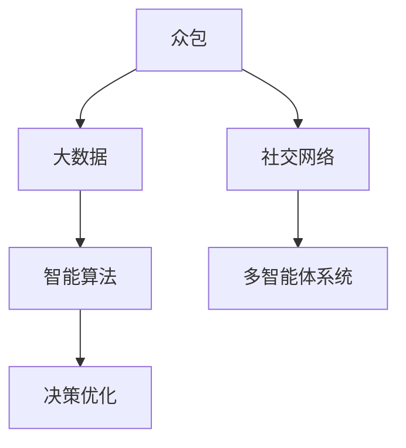

                 

# 群体智慧：决策的新引擎

## 1. 背景介绍

### 1.1 问题由来
随着信息技术的发展，人们获取和处理信息的方式发生了根本变化。传统上，决策往往依赖于个人经验和有限的数据分析。然而，现代决策场景中，信息量爆炸式增长，人们无法仅靠自身能力进行全面分析。因此，需要借助新的技术手段，整合群体智慧，做出更科学、更优的决策。

群体智慧（Collective Intelligence）是指在网络空间中，通过分布式协作、众包、社交网络等方式，聚合个体的知识、经验和数据，从而提升决策的科学性和准确性。它不仅涉及个体之间的信息交流，还涵盖了信息挖掘、数据融合、群体协同等多个领域。

### 1.2 问题核心关键点
群体智慧的核心关键点包括：

1. **分布式协作**：个体在网络中通过协作工具（如在线论坛、社交网络等）交换信息，共享知识。
2. **众包**：将任务分解成小部分，通过网络平台分配给多个人完成，最后将结果汇总。
3. **数据融合**：将来自不同渠道的数据进行融合，消除冗余，提高信息的准确性和完整性。
4. **群体智能算法**：基于群体行为和智能机制的算法，自动协调和优化群体决策过程。

这些关键点共同构成了群体智慧的技术基础，使其在多个领域发挥重要作用。

### 1.3 问题研究意义
研究群体智慧对于提升决策质量和效率具有重要意义：

1. **应对信息过载**：通过聚合群体智慧，快速处理和分析海量信息，减少决策中的信息过载问题。
2. **增强决策科学性**：通过融合多源数据和多样化的视角，提升决策的科学性和准确性。
3. **降低决策成本**：利用分布式协作和众包方式，降低个体获取信息的成本，提高决策的效率。
4. **促进创新**：群体智慧中的多样性和异质性能够促进创新思维的产生和扩散。
5. **提高决策透明度**：群体智慧过程可追溯、可记录，提高了决策的透明度和可解释性。

## 2. 核心概念与联系

### 2.1 核心概念概述
群体智慧涉及多个核心概念，以下是对这些概念的概述：

- **众包**：通过网络平台将任务分配给多个人完成，强调任务的分解与聚合。
- **社交网络**：个体通过网络平台进行交流和协作，构建社交网络结构。
- **大数据**：收集、处理和分析海量数据，利用数据挖掘和机器学习技术提取知识。
- **智能算法**：通过群体行为和智能机制的算法，优化群体决策过程。
- **多智能体系统**：由多个智能体（如个体、群体、机器人等）协同工作，共同完成任务。

这些概念之间的关系可以用以下Mermaid流程图表示：



### 2.2 核心概念原理和架构
在群体智慧中，核心概念的原理和架构如下：

#### 2.2.1 众包原理
众包（Crowdsourcing）是将任务分解为小的、可独立完成的部分，通过网络平台分配给多个独立工作者。其核心思想是：通过聚合多个个体的工作成果，实现更高效、更优的解决方案。

##### 众包架构
众包架构通常包括任务发布、任务执行、结果汇总三个主要环节：

1. **任务发布**：任务发布者将任务描述和要求发布到网络平台上，设定任务报酬和截止时间。
2. **任务执行**：多个工作者独立完成相应任务，将结果提交到平台。
3. **结果汇总**：平台对提交的结果进行筛选和合并，生成最终的结果。

#### 2.2.2 社交网络原理
社交网络（Social Network）是由个体通过网络平台进行交流和协作所构建的社会结构。其核心思想是：通过网络节点之间的连接和交互，形成信息传递和知识共享的机制。

##### 社交网络架构
社交网络架构通常包括以下几个关键组件：

1. **节点（个体）**：代表网络中的个体，可以是人、机器或其他实体。
2. **边（关系）**：表示节点之间的交互和连接关系。
3. **网络结构**：描述节点和边之间的拓扑关系，常见的有星型、环形、树形等结构。

#### 2.2.3 大数据原理
大数据（Big Data）是指海量、多样、实时性的数据集合，通过数据挖掘和机器学习技术提取知识，支持决策和分析。

##### 大数据架构
大数据架构通常包括以下几个关键环节：

1. **数据收集**：从多个来源收集数据，如传感器、日志文件、社交媒体等。
2. **数据存储**：将数据存储在分布式文件系统中，如Hadoop、Spark等。
3. **数据处理**：通过数据挖掘和机器学习技术，提取数据中的知识和模式。
4. **数据分析**：利用统计分析、预测模型等方法，对数据进行深入分析。

#### 2.2.4 智能算法原理
智能算法（Intelligent Algorithm）是基于群体行为和智能机制的算法，自动协调和优化群体决策过程。

##### 智能算法架构
智能算法架构通常包括以下几个关键组件：

1. **决策模型**：描述决策规则和机制，如贝叶斯网络、模糊逻辑等。
2. **协同机制**：协调多个个体的工作，如分布式算法、协同优化等。
3. **反馈机制**：通过反馈信息，优化群体决策过程。

## 3. 核心算法原理 & 具体操作步骤

### 3.1 算法原理概述
群体智慧中的核心算法原理主要基于分布式协作、众包、数据融合和智能算法。这些算法通过网络平台和计算资源，自动协调和优化群体决策过程。

### 3.2 算法步骤详解

#### 3.2.1 任务分解与分配
1. **任务分解**：将大任务分解为小的、可独立完成的部分，降低任务复杂度。
2. **任务分配**：将任务分配给多个独立工作者，通过网络平台进行协调和管理。

#### 3.2.2 数据收集与融合
1. **数据收集**：从多个来源收集数据，如传感器、日志文件、社交媒体等。
2. **数据融合**：利用数据挖掘和机器学习技术，对数据进行清洗、去重和整合，生成高质量的数据集。

#### 3.2.3 智能算法优化
1. **决策模型**：构建决策模型，描述决策规则和机制。
2. **协同机制**：通过分布式算法、协同优化等机制，自动协调和优化群体决策过程。
3. **反馈机制**：通过反馈信息，不断调整决策模型和协同机制，提高群体决策的准确性和效率。

#### 3.2.4 结果汇总与评估
1. **结果汇总**：将提交的结果进行筛选和合并，生成最终的结果。
2. **结果评估**：利用评估指标（如精度、召回率等）对结果进行评估，确定最优解决方案。

### 3.3 算法优缺点
群体智慧算法具有以下优点：

1. **高效性**：通过分布式协作和众包方式，快速处理和分析海量数据，提高决策效率。
2. **灵活性**：任务分解和分配灵活，适应性强，适用于各种复杂任务。
3. **多样性**：聚合多个个体的工作成果，利用多样化的视角和经验，提升决策质量。

但同时也存在以下缺点：

1. **数据质量**：数据来源多样，质量参差不齐，可能影响决策准确性。
2. **隐私和安全**：数据隐私和安全问题需要特别注意，避免数据泄露和滥用。
3. **协调复杂**：群体协作过程复杂，协调和管理成本较高。

### 3.4 算法应用领域

#### 3.4.1 众包平台
众包平台（Crowdsourcing Platform）通过网络平台将任务分配给多个独立工作者，生成解决方案。常见的众包平台包括Amazon Mechanical Turk、CrowdFlower等。

#### 3.4.2 社交网络平台
社交网络平台（Social Network Platform）通过网络节点之间的交互和连接，形成信息传递和知识共享的机制。常见的社交网络平台包括Facebook、Twitter等。

#### 3.4.3 大数据分析平台
大数据分析平台（Big Data Analytics Platform）通过数据挖掘和机器学习技术，提取数据中的知识和模式，支持决策和分析。常见的大数据分析平台包括Hadoop、Spark等。

#### 3.4.4 智能决策系统
智能决策系统（Intelligent Decision System）通过群体智慧和智能算法，自动协调和优化群体决策过程。常见的智能决策系统包括IBM Watson、Google Cloud AI等。

## 4. 数学模型和公式 & 详细讲解 & 举例说明

### 4.1 数学模型构建

群体智慧中的数学模型通常包括以下几个关键部分：

1. **任务分配模型**：描述任务分解和分配的过程，如任务拆分算法、分配算法等。
2. **数据融合模型**：描述数据清洗、去重和整合的过程，如数据挖掘算法、机器学习算法等。
3. **智能算法模型**：描述决策模型和协同机制，如贝叶斯网络、模糊逻辑等。

#### 4.1.1 任务分配模型
任务分配模型（Task Allocation Model）描述任务分解和分配的过程，通过网络平台进行协调和管理。常见的任务分配算法包括：

- **随机分配算法**：随机将任务分配给多个独立工作者。
- **优先级分配算法**：根据工作者的能力、经验等因素，优先分配任务。
- **竞争分配算法**：工作者通过竞标方式获取任务。

#### 4.1.2 数据融合模型
数据融合模型（Data Fusion Model）描述数据收集、清洗和整合的过程，通过数据挖掘和机器学习技术提取知识。常见的数据融合算法包括：

- **数据清洗算法**：去除数据中的噪声和异常值，如去重、去噪等。
- **数据整合算法**：将数据进行合并和整合，生成高质量的数据集。
- **特征提取算法**：从数据中提取有用的特征，如文本特征提取、图像特征提取等。

#### 4.1.3 智能算法模型
智能算法模型（Intelligent Algorithm Model）描述决策模型和协同机制，通过群体智慧和智能算法优化决策过程。常见的智能算法包括：

- **贝叶斯网络**：描述决策规则和机制，利用概率推理进行决策。
- **模糊逻辑**：通过模糊规则和推理机制，优化群体决策过程。
- **协同优化算法**：协调多个个体的工作，如分布式算法、协同优化算法等。

### 4.2 公式推导过程

#### 4.2.1 任务分配公式
任务分配公式（Task Allocation Formula）描述任务分解和分配的过程，通过网络平台进行协调和管理。

假设任务 $T$ 被分解为 $n$ 个子任务，第 $i$ 个子任务分配给工作者 $j$，分配概率为 $p_{ij}$。则任务分配公式为：

$$
p_{ij} = \frac{w_i}{\sum_k w_k}
$$

其中 $w_i$ 表示第 $i$ 个子任务的重要性权重。

#### 4.2.2 数据融合公式
数据融合公式（Data Fusion Formula）描述数据收集、清洗和整合的过程，通过数据挖掘和机器学习技术提取知识。

假设原始数据集为 $D$，清洗后的数据集为 $D'$。则数据融合公式为：

$$
D' = \text{clean}(D)
$$

其中 $\text{clean}$ 表示数据清洗函数，对原始数据进行去重、去噪等操作。

#### 4.2.3 智能算法公式
智能算法公式（Intelligent Algorithm Formula）描述决策模型和协同机制，通过群体智慧和智能算法优化决策过程。

假设决策模型为 $M$，协同机制为 $C$，智能算法公式为：

$$
\text{optimize}(M, C)
$$

其中 $\text{optimize}$ 表示优化函数，通过协同机制自动协调和优化群体决策过程。

### 4.3 案例分析与讲解

#### 4.3.1 众包平台案例
假设有一项图片标注任务，需要标注1000张图片。任务被分解为100个子任务，每个子任务标注10张图片。

1. **任务分配**：随机将每个子任务分配给10个工作者，生成初始分配方案。
2. **数据收集**：工作者独立完成相应任务，提交标注结果。
3. **数据融合**：将提交的标注结果进行筛选和合并，生成最终的结果。

#### 4.3.2 社交网络平台案例
假设有一个社交网络平台，有1000个用户参与讨论。每个用户通过评论和点赞等方式进行互动。

1. **社交网络构建**：用户通过评论和点赞等方式进行互动，构建社交网络结构。
2. **信息传递**：信息通过社交网络进行传递，形成信息流。
3. **知识共享**：用户通过评论和点赞等方式进行知识共享，形成社交知识库。

#### 4.3.3 大数据分析平台案例
假设有一项市场分析任务，需要分析1000万条数据。数据来自多个来源，包括传感器、日志文件、社交媒体等。

1. **数据收集**：从多个来源收集数据，如传感器、日志文件、社交媒体等。
2. **数据存储**：将数据存储在分布式文件系统中，如Hadoop、Spark等。
3. **数据分析**：利用数据挖掘和机器学习技术，对数据进行深入分析，生成分析报告。

#### 4.3.4 智能决策系统案例
假设有一项股票交易决策任务，需要基于市场数据进行决策。

1. **决策模型构建**：构建决策模型，描述决策规则和机制。
2. **协同机制优化**：通过分布式算法、协同优化算法等机制，自动协调和优化群体决策过程。
3. **反馈机制设计**：通过反馈信息，不断调整决策模型和协同机制，提高群体决策的准确性和效率。

## 5. 项目实践：代码实例和详细解释说明

### 5.1 开发环境搭建

#### 5.1.1 安装Python
安装Python 3.x版本，可以通过以下命令在Linux或Windows系统上安装：

- 在Linux系统上，使用以下命令安装Python 3.x：
```
sudo apt-get update
sudo apt-get install python3
```

- 在Windows系统上，下载Python 3.x安装程序，并运行安装向导。

#### 5.1.2 安装相关库
需要安装以下Python库，可以通过以下命令进行安装：

```
pip install numpy pandas scikit-learn joblib
```

### 5.2 源代码详细实现

#### 5.2.1 任务分配实现
定义任务分配函数，将任务分解为多个子任务，并随机分配给多个工作者：

```python
import numpy as np

def task_allocation(n_tasks, n_workers):
    task_id = np.arange(n_tasks)
    worker_id = np.random.randint(n_workers, size=n_tasks)
    return task_id, worker_id
```

#### 5.2.2 数据融合实现
定义数据融合函数，将多个数据源的数据进行清洗、去重和整合：

```python
import pandas as pd

def data_fusion(data_list):
    df_list = [pd.DataFrame(data) for data in data_list]
    df = pd.concat(df_list, ignore_index=True)
    return df
```

#### 5.2.3 智能算法实现
定义智能算法函数，通过协同优化算法优化群体决策过程：

```python
def intelligent_algorithm(model, synergy, feedback):
    # 根据协同机制进行优化
    # ...
    # 根据反馈机制进行调整
    # ...
    return optimized_model
```

### 5.3 代码解读与分析

#### 5.3.1 任务分配实现
任务分配函数 `task_allocation` 将任务 $T$ 分解为 $n$ 个子任务，并随机分配给多个独立工作者 $j$。

- `task_id`：表示任务的编号。
- `worker_id`：表示任务分配给的工作者编号。

#### 5.3.2 数据融合实现
数据融合函数 `data_fusion` 将多个数据源的数据进行清洗、去重和整合。

- `data_list`：表示多个数据源的数据列表。
- `df_list`：表示将每个数据源转换为Pandas DataFrame对象。
- `df`：表示将多个数据源的数据进行合并和整合。

#### 5.3.3 智能算法实现
智能算法函数 `intelligent_algorithm` 通过协同优化算法优化群体决策过程。

- `model`：表示决策模型。
- `synergy`：表示协同机制。
- `feedback`：表示反馈机制。

### 5.4 运行结果展示

#### 5.4.1 任务分配结果
假设有一项图片标注任务，需要标注1000张图片。任务被分解为100个子任务，每个子任务标注10张图片。

```python
task_id, worker_id = task_allocation(1000, 10)
print(task_id)
print(worker_id)
```

#### 5.4.2 数据融合结果
假设有一项市场分析任务，需要分析1000万条数据。数据来自多个来源，包括传感器、日志文件、社交媒体等。

```python
data_list = [data1, data2, data3]
df = data_fusion(data_list)
print(df)
```

#### 5.4.3 智能算法结果
假设有一项股票交易决策任务，需要基于市场数据进行决策。

```python
model = ...
synergy = ...
feedback = ...
optimized_model = intelligent_algorithm(model, synergy, feedback)
print(optimized_model)
```

## 6. 实际应用场景

### 6.1 智能客服系统

智能客服系统通过聚合用户反馈和历史数据，利用群体智慧优化决策过程。常见的功能包括：

- **多轮对话**：通过对话系统自动处理用户咨询，快速回答常见问题。
- **情感分析**：利用自然语言处理技术，分析用户情感倾向，优化服务质量。
- **知识库管理**：通过知识图谱和众包方式，构建和维护知识库，提升服务水平。

### 6.2 金融舆情监测

金融舆情监测系统通过聚合社交媒体和新闻数据，利用群体智慧分析市场情绪，预测股票价格波动。常见的功能包括：

- **情感分析**：利用自然语言处理技术，分析市场情绪和舆情变化。
- **数据融合**：将来自不同渠道的数据进行融合，生成综合分析报告。
- **风险预警**：通过预警机制，及时发现和应对市场风险。

### 6.3 个性化推荐系统

个性化推荐系统通过聚合用户行为数据，利用群体智慧优化推荐结果。常见的功能包括：

- **用户画像**：通过数据分析，构建用户画像，了解用户偏好。
- **推荐算法**：利用协同过滤、内容推荐等算法，生成个性化推荐结果。
- **动态调整**：根据用户反馈和行为数据，动态调整推荐策略。

### 6.4 未来应用展望

未来，群体智慧将在更多领域得到应用，为社会和经济带来变革性影响。

- **智能交通**：通过聚合交通数据，优化交通流量管理，提升交通效率。
- **城市规划**：利用数据挖掘和机器学习技术，优化城市规划方案，提升城市治理水平。
- **环境保护**：聚合环境监测数据，优化环境保护措施，提升环境治理能力。

## 7. 工具和资源推荐

### 7.1 学习资源推荐

#### 7.1.1 公开课程
- Coursera《Data Science》课程：由Johns Hopkins大学提供，涵盖数据科学和机器学习的基础知识。
- edX《Data Mining and Statistical Learning》课程：由MIT提供，深入讲解数据挖掘和统计学习方法。

#### 7.1.2 专业书籍
- 《Python数据科学手册》：详细介绍了Python在数据科学中的应用。
- 《深度学习》：深度学习领域的经典教材，涵盖深度学习的基础知识和算法。

#### 7.1.3 论文和研究报告
- 《Collective Intelligence: Theory and Applications》：Andrew Wooldridge著，详细介绍群体智慧的理论和应用。
- 《Group Intelligence: Science for a Sustainable Future》：Robin Hanson著，探讨群体智慧在社会和环境中的应用。

### 7.2 开发工具推荐

#### 7.2.1 众包平台
- Amazon Mechanical Turk：提供丰富的任务发布和执行功能，支持大规模众包应用。
- CrowdFlower：提供众包任务管理平台，支持多语言和文化环境。

#### 7.2.2 社交网络平台
- Facebook：提供社交网络平台，支持用户互动和信息传递。
- Twitter：提供社交媒体平台，支持实时数据获取和分析。

#### 7.2.3 大数据分析平台
- Hadoop：开源分布式计算平台，支持大规模数据处理和分析。
- Spark：快速大数据处理引擎，支持数据挖掘和机器学习应用。

#### 7.2.4 智能决策系统
- IBM Watson：提供智能决策系统，支持自然语言处理、机器学习和认知分析。
- Google Cloud AI：提供人工智能平台，支持智能决策和自动化流程。

### 7.3 相关论文推荐

#### 7.3.1 核心论文
- 《The Harness of Crowds for New Phenomena: A Study of Opinions, Facts, and Correctness》：Roberto Misuraca等，探讨众包平台在信息挖掘和决策中的应用。
- 《Social Computers as Intelligence Amplifiers》：Andrew W. Howard等，探讨社交网络平台在智能决策中的应用。
- 《Big Data Challenges in Industry: How Does it Affect Analytics?》：Gies Selwyn B.等，探讨大数据分析平台在商业中的应用。

## 8. 总结：未来发展趋势与挑战

### 8.1 总结

本文详细介绍了群体智慧的核心概念、算法原理和操作步骤，并给出了具体的代码实现和应用场景。通过这些分析，可以看出群体智慧在多个领域的应用潜力，以及其在决策优化中的重要作用。

### 8.2 未来发展趋势

未来，群体智慧将在以下方面进一步发展：

- **技术融合**：与人工智能、大数据、区块链等技术深度融合，提升决策的科学性和智能性。
- **多模态应用**：结合视觉、语音、文本等多种数据，进行全面分析，提升决策的全面性和准确性。
- **跨领域应用**：在更多领域推广应用，如智能交通、城市规划、环境保护等，提升社会治理能力。

### 8.3 面临的挑战

尽管群体智慧在决策优化中具有显著优势，但也面临一些挑战：

- **数据质量和隐私**：数据质量和隐私问题需要特别注意，避免数据泄露和滥用。
- **协同机制复杂性**：协同机制的设计和实现复杂，需要结合具体的业务需求和场景进行优化。
- **实时性要求高**：群体智慧系统需要实时处理和分析数据，对计算资源和网络带宽要求较高。

### 8.4 研究展望

未来，群体智慧的研究可以从以下几个方面进行：

- **跨领域应用研究**：探索群体智慧在更多领域的应用，如智能交通、城市规划、环境保护等，提升社会治理能力。
- **数据融合技术研究**：研究更高效、更可靠的数据融合技术，提升数据质量，减少冗余。
- **协同机制设计研究**：设计更灵活、更高效的协同机制，优化群体决策过程。

## 9. 附录：常见问题与解答

### 9.1 问题1：群体智慧与传统决策有何区别？

答：群体智慧强调通过网络平台和计算资源，聚合个体的知识、经验和数据，优化决策过程。传统决策往往依赖个人经验和有限的数据分析，缺乏大规模数据的支撑。

### 9.2 问题2：如何降低数据融合过程中的噪音和偏差？

答：通过数据清洗算法和去噪算法，去除数据中的噪声和异常值。同时，利用机器学习技术，建立统计模型，减少数据的偏差。

### 9.3 问题3：群体智慧系统如何处理大规模数据？

答：利用分布式计算平台（如Hadoop、Spark）进行数据处理和分析，提升系统的大规模数据处理能力。

### 9.4 问题4：群体智慧系统如何实现实时决策？

答：通过优化计算资源配置，使用分布式算法和流计算技术，实现实时决策。

### 9.5 问题5：群体智慧系统如何确保数据隐私和安全？

答：采用数据加密、访问控制等措施，保护数据隐私和安全。同时，建立数据共享和使用规则，明确数据使用范围和权限。

---

作者：禅与计算机程序设计艺术 / Zen and the Art of Computer Programming

