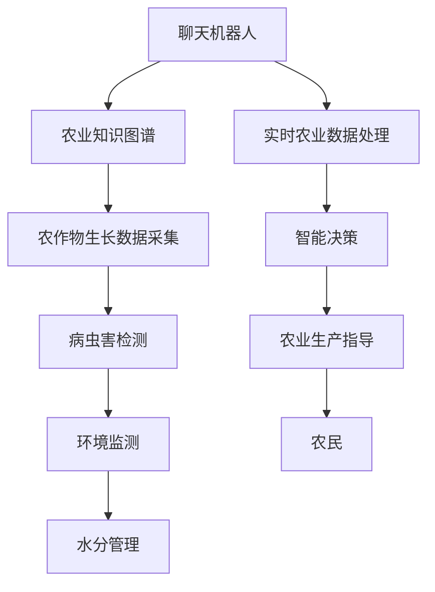

                 

## 1. 背景介绍

### 1.1 问题由来
在全球人口增长、资源紧缩、环境保护与农业可持续发展的多重挑战下，如何实现高效、智能的农业生产成为摆在人类面前的重大问题。传统的农业生产依赖于大量人工，成本高、效率低，而且对环境的影响也较大。近年来，智能农业技术的快速崛起，为农业生产带来了颠覆性的变革，其中之一便是聊天机器人（Chatbot）的引入。

聊天机器人作为人工智能（AI）的重要应用之一，已经在各行各业得到广泛应用，但鲜少应用于农业领域。然而，随着AI技术的发展，聊天机器人技术在农业中的潜力日益显现，能够为农民提供实时的作物管理、病虫害防治、农技指导等高效服务。在农业机器人尚未大规模普及的当下，聊天机器人无疑为农业生产带来了一线曙光。

### 1.2 问题核心关键点
1. **自动化的信息获取和决策支持**：聊天机器人可以自动收集作物生长状况、环境数据（如温度、湿度、土壤湿度等），并进行智能分析，为农民提供种植决策建议。
2. **农业知识的普及与教育**：聊天机器人作为知识的传递者，能够普及农业知识，帮助农民解决实际问题。
3. **跨领域的协同作业**：聊天机器人可以整合多种数据源，实现农业生产的智能化。
4. **实时性**：聊天机器人能够实时反馈农业生产情况，与传统的人工管理相比，提供更快、更及时的决策支持。

### 1.3 问题研究意义
聊天机器人在农业中的应用，能够大幅度提高农业生产效率，减少资源浪费，降低环境污染，同时提供农民更为便捷、精准的服务，为实现农业的可持续发展提供技术保障。研究聊天机器人在农业中的应用，不仅对农业生产技术的发展具有重要意义，也对整个智能农业产业的进步起到推动作用。

## 2. 核心概念与联系

### 2.1 核心概念概述

在探讨聊天机器人在农业中的应用之前，我们先明确几个核心概念及其关联性：

1. **聊天机器人**：人工智能技术实现的一种人机对话系统，能够理解和生成自然语言，与人类进行实时交流。
2. **智能农业**：结合信息技术和农业生产，实现对农作物生长过程的智能化管理和优化，提高农业生产效率和质量。
3. **作物管理**：涉及作物生长、病虫害防治、环境监测、水分管理等方面，是智能农业的重要组成部分。
4. **知识图谱**：一种语义网络知识库，用于表示实体、关系及属性，是聊天机器人处理复杂问题的基础。
5. **物联网（IoT）**：将传感器、设备等接入互联网，实现数据实时采集、处理和分析。

### 2.2 核心概念原理和架构的 Mermaid 流程图



## 3. 核心算法原理 & 具体操作步骤
### 3.1 算法原理概述

聊天机器人在农业中的工作原理主要分为两个部分：

1. **信息收集与数据处理**：聊天机器人通过传感器、摄像头等设备收集作物生长状况和环境数据，并整合到知识图谱中。
2. **智能决策与反馈**：聊天机器人利用机器学习算法，对收集到的数据进行分析，做出智能决策，提供种植建议。

聊天机器人的核心算法包括自然语言处理（NLP）、机器学习（ML）和专家系统（ES）。其中，NLP负责理解和生成自然语言，ML负责数据分析和模式识别，ES负责知识的存储和推理。

### 3.2 算法步骤详解

聊天机器人在农业中的应用步骤如下：

1. **系统初始化**：安装和配置聊天机器人系统，并连接农业传感器和设备。
2. **数据采集与清洗**：通过传感器和摄像头采集作物生长状况和环境数据，并进行数据清洗。
3. **知识图谱构建**：根据农业领域的专业知识，构建农业知识图谱，并整合到聊天机器人系统中。
4. **对话交互**：农民通过聊天界面与机器人进行交流，输入问题或指令。
5. **数据处理与分析**：聊天机器人对输入数据进行处理和分析，形成决策依据。
6. **智能决策与反馈**：根据分析结果，生成农作物管理建议，并向农民反馈。

### 3.3 算法优缺点

聊天机器人在农业中的应用具有以下优点：

1. **实时性**：聊天机器人可以实时响应农民的需求，提供即时的种植建议。
2. **效率高**：相较于人工管理，聊天机器人能够处理大量数据，减少人力成本。
3. **可扩展性**：聊天机器人可以根据不同作物的特点，进行定制化调整，具有较好的可扩展性。

同时，也存在一些缺点：

1. **数据依赖**：聊天机器人的决策基于数据，因此数据质量直接影响其性能。
2. **技术门槛**：部署和维护聊天机器人需要一定的技术背景和资源投入。
3. **知识局限**：聊天机器人的知识库需要不断更新和扩展，以应对新的农业问题。

### 3.4 算法应用领域

聊天机器人在农业中的应用领域主要包括：

1. **作物管理**：聊天机器人可以实时监控作物生长状况，识别病害、虫害等问题，并给出处理建议。
2. **农技指导**：聊天机器人能够提供病虫害防治、施肥指导、水分管理等农业技术支持。
3. **环境监测**：聊天机器人可以实时监测环境条件，为作物生长提供最优环境。
4. **种植决策**：聊天机器人根据综合分析，提供种植决策建议，如播种时间、种植密度等。

## 4. 数学模型和公式 & 详细讲解 & 举例说明

### 4.1 数学模型构建

聊天机器人在农业中的应用涉及大量数据和复杂计算，因此需要建立数学模型来进行计算和优化。

聊天机器人的主要数学模型包括：

1. **知识图谱**：表示实体、关系及属性，如作物-属性、病虫害-处理方法等。
2. **决策树**：用于对输入数据进行分类和决策，如图形化表示知识图谱中的推理逻辑。
3. **回归模型**：用于预测作物生长状态和环境数据的变化趋势。

### 4.2 公式推导过程

以决策树为例，推导其基本公式：

1. 决策树的基本结构：
   $$
   T = (N, F, E)
   $$
   其中，$N$ 表示决策树节点集，$F$ 表示特征集，$E$ 表示特征取值集。

2. 信息熵公式：
   $$
   H(S) = -\sum_{i=1}^n p(x_i) \log_2 p(x_i)
   $$
   其中，$S$ 表示样本集，$p(x_i)$ 表示样本 $x_i$ 出现的概率。

3. 信息增益公式：
   $$
   Gain(S, A) = H(S) - \sum_{i=1}^n \frac{|S_i|}{|S|} H(S_i)
   $$
   其中，$A$ 表示特征集，$S_i$ 表示特征 $A$ 取值为 $a_i$ 的样本子集。

### 4.3 案例分析与讲解

以小麦生长状态预测为例，构建决策树模型：

1. 特征集 $F = \{温度，湿度，土壤湿度，光照强度\}$。
2. 样本集 $S = \{(x_1, y_1), (x_2, y_2), \ldots, (x_n, y_n)\}$，其中 $x_i$ 表示特征向量，$y_i$ 表示目标变量（小麦生长状态）。
3. 计算每个特征的信息增益，选择信息增益最大的特征作为根节点。
4. 对子集 $S_i$ 重复上述步骤，生成决策树。

## 5. 项目实践：代码实例和详细解释说明
### 5.1 开发环境搭建

聊天机器人在农业中的应用开发环境搭建，主要包括服务器配置、知识图谱构建和传感器连接。

1. **服务器配置**：安装Python、TensorFlow、TensorBoard等工具，搭建开发环境。
2. **知识图谱构建**：使用OWL或RDF等语义描述语言，构建农业知识图谱。
3. **传感器连接**：连接土壤湿度传感器、温度传感器、摄像头等设备，实现数据采集。

### 5.2 源代码详细实现

下面以Python语言为例，给出聊天机器人系统在农业中的应用代码实现。

```python
import tensorflow as tf
from tensorflow.keras import layers
from tensorflow.keras import models

# 构建决策树模型
def create_decision_tree():
    inputs = layers.Input(shape=(4,))
    hidden = layers.Dense(8, activation='relu')(inputs)
    outputs = layers.Dense(4, activation='softmax')(hidden)
    model = models.Model(inputs=inputs, outputs=outputs)
    model.compile(optimizer='adam', loss='categorical_crossentropy', metrics=['accuracy'])
    return model

# 数据集加载与处理
def load_and_process_data():
    # 加载数据集
    X_train, X_test, y_train, y_test = load_dataset()
    # 数据处理
    X_train = preprocess(X_train)
    X_test = preprocess(X_test)
    return X_train, X_test, y_train, y_test

# 模型训练与评估
def train_and_evaluate(model, X_train, X_test, y_train, y_test):
    # 训练模型
    model.fit(X_train, y_train, epochs=10, validation_data=(X_test, y_test))
    # 评估模型
    loss, acc = model.evaluate(X_test, y_test)
    print(f'Test loss: {loss:.2f}')
    print(f'Test accuracy: {acc:.2f}')

# 使用模型进行预测
def predict(model, X):
    y_pred = model.predict(X)
    return y_pred

# 加载与训练决策树模型
model = create_decision_tree()
X_train, X_test, y_train, y_test = load_and_process_data()
train_and_evaluate(model, X_train, X_test, y_train, y_test)
```

### 5.3 代码解读与分析

上述代码中，`create_decision_tree` 函数用于创建决策树模型，`load_and_process_data` 函数用于加载和处理数据集，`train_and_evaluate` 函数用于训练和评估模型，`predict` 函数用于进行预测。

其中，`create_decision_tree` 函数定义了一个简单的决策树模型，使用多层神经网络进行构建，并采用 `adam` 优化器和 `categorical_crossentropy` 损失函数进行训练和评估。

在`load_and_process_data` 函数中，通过调用 `load_dataset` 函数加载数据集，并使用 `preprocess` 函数对数据进行预处理，确保数据符合模型的输入格式。

`train_and_evaluate` 函数使用训练集和测试集对模型进行训练和评估，输出模型的损失和准确率。

`predict` 函数接受输入数据，使用模型进行预测，并输出预测结果。

## 6. 实际应用场景
### 6.1 智能耕作

聊天机器人在智能耕作中的应用，主要体现在以下几个方面：

1. **耕作管理**：聊天机器人能够根据土壤湿度、温度等数据，给出适宜的耕作时间、深度、方式等建议。
2. **种植建议**：根据作物的生长周期和特性，提供播种时间、密度等种植建议。
3. **病虫害防治**：实时监测作物的生长状况，及时发现病虫害问题，并提供防治建议。

### 6.2 作物管理

聊天机器人在作物管理中的应用，主要体现在以下几个方面：

1. **水分管理**：根据土壤湿度数据，聊天机器人能够提供灌溉建议，优化水分管理。
2. **营养管理**：通过监测作物养分含量，聊天机器人能够提供施肥建议，优化养分管理。
3. **生长监测**：实时监测作物生长状况，及时发现生长异常，提供调整建议。

### 6.3 环境监测

聊天机器人在环境监测中的应用，主要体现在以下几个方面：

1. **环境参数监测**：通过传感器和摄像头，实时监测温度、湿度、光照等环境参数，为作物生长提供最优环境。
2. **灾害预警**：根据天气数据，聊天机器人能够提前预警自然灾害，减少损失。

### 6.4 未来应用展望

展望未来，聊天机器人在农业中的应用将更加广泛，其主要发展方向包括：

1. **智能化**：聊天机器人将与农业物联网（IoT）深度融合，实现全智能化农业生产。
2. **可操作性**：聊天机器人将更加易于操作和维护，能够适应不同的农业场景。
3. **多模态**：聊天机器人将支持多模态交互，结合语音、视觉等多种形式的信息输入和输出。

## 7. 工具和资源推荐
### 7.1 学习资源推荐

1. **Python深度学习教程**：《Python深度学习》一书，详细介绍了深度学习的核心算法和实践技巧。
2. **TensorFlow官方文档**：TensorFlow官方文档，提供了详细的API和使用指南。
3. **农业知识图谱构建工具**：Geonet、Open Ontology Project（OOP）等工具，帮助构建农业知识图谱。
4. **农业传感器和设备**：Flora、ESP8266等，用于农业数据采集。

### 7.2 开发工具推荐

1. **TensorFlow**：深度学习框架，支持多种模型构建和训练。
2. **Keras**：高层API，简单易用，适合快速原型开发。
3. **Jupyter Notebook**：交互式编程环境，便于模型调试和展示。
4. **TensorBoard**：模型可视化工具，帮助监控模型训练过程。

### 7.3 相关论文推荐

1. **《农业物联网在智能农业中的应用》**：探讨了农业物联网在智能农业中的应用，介绍了一些成功的案例。
2. **《基于聊天机器人的农业信息服务》**：研究了聊天机器人在农业信息服务中的应用，介绍了相关算法和实现方法。
3. **《智能农业技术在农作物管理中的应用》**：探讨了智能农业技术在农作物管理中的应用，介绍了一些关键技术。

## 8. 总结：未来发展趋势与挑战
### 8.1 总结

聊天机器人在农业中的应用，是智能农业技术的重要组成部分，能够大幅提高农业生产效率，降低资源浪费，减少环境污染。通过与传感器、知识图谱等技术深度融合，聊天机器人在农业领域具有广阔的发展前景。

### 8.2 未来发展趋势

未来，聊天机器人在农业中的应用将呈现以下几个趋势：

1. **智能化**：聊天机器人将与农业物联网（IoT）深度融合，实现全智能化农业生产。
2. **可操作性**：聊天机器人将更加易于操作和维护，能够适应不同的农业场景。
3. **多模态**：聊天机器人将支持多模态交互，结合语音、视觉等多种形式的信息输入和输出。

### 8.3 面临的挑战

聊天机器人在农业中的应用，仍然面临一些挑战：

1. **数据质量**：聊天机器人的决策基于数据，因此数据质量直接影响其性能。
2. **技术门槛**：部署和维护聊天机器人需要一定的技术背景和资源投入。
3. **知识局限**：聊天机器人的知识库需要不断更新和扩展，以应对新的农业问题。

### 8.4 研究展望

未来，聊天机器人在农业中的应用研究将集中在以下几个方面：

1. **数据驱动**：研究如何提高农业数据质量，优化数据采集和处理。
2. **模型优化**：研究如何优化聊天机器人的算法，提高其决策准确性和鲁棒性。
3. **跨领域融合**：研究如何将聊天机器人与其他智能技术进行深度融合，实现多领域协同作业。

## 9. 附录：常见问题与解答

**Q1：如何提高农业数据的准确性？**

A：提高农业数据的准确性需要从以下几个方面入手：

1. **传感器校准**：定期校准传感器，确保数据准确。
2. **数据清洗**：使用数据清洗算法，去除噪音和异常值。
3. **多传感器融合**：结合多个传感器数据，提高数据的准确性和可靠性。

**Q2：聊天机器人如何进行知识更新？**

A：聊天机器人的知识更新需要从以下几个方面入手：

1. **知识库扩展**：定期扩展农业知识库，涵盖新的农业技术和方法。
2. **专家咨询**：与农业专家进行合作，及时更新知识库。
3. **数据学习**：通过机器学习算法，自动学习新知识，并更新知识库。

**Q3：如何降低聊天机器人的技术门槛？**

A：降低聊天机器人的技术门槛需要从以下几个方面入手：

1. **用户界面优化**：设计易用、直观的用户界面，降低用户操作难度。
2. **自动化部署**：实现聊天机器人的自动化部署，减少人工干预。
3. **在线教程**：提供详细的在线教程，帮助用户快速上手。

**Q4：如何应对新的农业问题？**

A：应对新的农业问题需要从以下几个方面入手：

1. **数据采集**：使用高精度传感器，获取全面、准确的数据。
2. **算法优化**：通过优化算法，提高聊天机器人的决策能力。
3. **跨领域融合**：与其他智能技术进行深度融合，实现多领域协同作业。

---

作者：禅与计算机程序设计艺术 / Zen and the Art of Computer Programming

