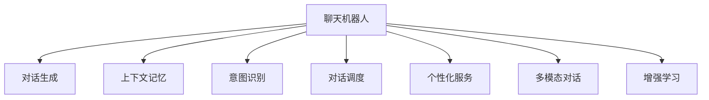

                 

# 聊天机器人提升用户体验

## 1. 背景介绍

### 1.1 问题由来
聊天机器人(Chatbot)是近年来AI领域的热门应用之一。它能够通过模拟人类对话，自动回答用户问题，极大地提升了用户体验和效率。然而，聊天机器人当前依然存在诸多问题，如回答不准确、缺乏上下文理解、对话流畅度不足等。这些问题严重制约了聊天机器人在实际应用中的推广和普及。如何通过技术创新，提升聊天机器人的用户体验，使其在各行各业中发挥更大的作用，成为当下人工智能研究的重要课题。

### 1.2 问题核心关键点
聊天机器人提升用户体验的核心在于增强其语言理解、上下文记忆、逻辑推理和个性化服务能力。通过基于深度学习模型的对话生成和智能调度，能够显著改善机器人的对话质量，提升用户体验。然而，目前聊天机器人仍然面临诸多挑战，如模型参数量大、计算资源消耗高、对话多样性不足、缺乏上下文理解等问题。本文将从模型、数据、算法和应用等多个角度，系统探讨提升聊天机器人用户体验的方法。

## 2. 核心概念与联系

### 2.1 核心概念概述

为更好地理解聊天机器人提升用户体验的方法，本节将介绍几个密切相关的核心概念：

- 聊天机器人(Chatbot)：通过模拟人类对话，自动回答用户问题的AI应用。常见的聊天机器人包括基于规则的、基于统计的、基于深度学习的多种类型。

- 对话生成(Dialogue Generation)：生成自然流畅、逻辑连贯的对话回复。对话生成技术主要通过序列到序列(Seq2Seq)模型或生成对抗网络(GAN)模型实现。

- 上下文记忆(Contextual Memory)：记录对话历史，理解当前对话上下文。上下文记忆通常通过LSTM、GRU等循环神经网络(RNN)实现。

- 意图识别(Intent Recognition)：识别用户输入的意图，进行对话任务分解。意图识别一般通过分类模型或注意力机制实现。

- 对话调度(Dialogue Scheduling)：在多个候选回复中选择最合适的回答，生成最终回答。对话调度一般通过策略网络或强化学习实现。

- 个性化服务(Personalized Service)：根据用户的历史行为和属性，提供定制化的服务。个性化服务一般通过协同过滤、推荐系统等技术实现。

- 多模态对话(Multi-modal Dialogue)：结合图像、语音、文本等多种模态信息，提升对话理解和生成能力。多模态对话一般通过多模态融合技术实现。

- 增强学习(Reinforcement Learning)：通过与环境的交互，逐步优化聊天机器人的对话策略。增强学习适用于需要复杂决策和多步推理的任务。

这些核心概念之间的逻辑关系可以通过以下Mermaid流程图来展示：



这个流程图展示了这个系统中的关键组件及其相互关系：

1. 聊天机器人作为整个系统的入口，通过对话生成、上下文记忆、意图识别、对话调度、个性化服务、多模态对话和增强学习等组件，实现自动化的对话回复。
2. 对话生成和上下文记忆是基础组件，能够理解用户的输入并生成自然流畅的回复。
3. 意图识别和对话调度是核心组件，能够分析用户的意图并选择合适的回答。
4. 个性化服务和多模态对话是高级组件，能够根据用户属性和多种模态信息，提供更精准的对话回复。
5. 增强学习是进一步优化的组件，通过与环境的交互，不断提升聊天机器人的对话能力。

这些组件共同构成了聊天机器人的核心逻辑，使其能够处理复杂的对话场景，提升用户体验。

## 3. 核心算法原理 & 具体操作步骤
### 3.1 算法原理概述

聊天机器人提升用户体验的主要方法是通过深度学习模型进行对话生成、意图识别和对话调度。其核心思想是：使用神经网络模型学习对话语料库中的语言模式，通过逐步优化，生成自然流畅、逻辑连贯的对话。

形式化地，假设聊天机器人为一个黑盒模型 $M_{\theta}$，其中 $\theta$ 为模型参数。给定一个对话历史 $H$ 和用户输入 $X$，模型的输出为：

$$
Y = M_{\theta}(X, H)
$$

其中 $Y$ 表示机器人的回复。模型的训练目标是最小化对话生成过程与真实对话的差距。在实际应用中，通常使用交叉熵损失函数、BLEU指标等评价模型性能。

### 3.2 算法步骤详解

聊天机器人提升用户体验的实现步骤一般包括以下几个关键步骤：

**Step 1: 收集和预处理对话数据**
- 收集大量对话数据，包括文本、语音等多模态数据。数据应涵盖不同场景、不同对话方式和不同难度的任务。
- 对数据进行清洗和标注，去除噪声和冗余，确保数据质量。
- 使用序列标记标注(Serial Markup Language, SML)或文档标注格式，标注意图、实体、上下文等关键信息。

**Step 2: 设计对话生成模型**
- 选择合适的对话生成模型，如Seq2Seq模型、Transformer模型等。
- 根据任务需求，设计对话生成器的输入和输出，如以文本为输入，生成文本回复。
- 定义模型的损失函数和优化算法，如交叉熵损失、Adam优化器等。

**Step 3: 设计意图识别模型**
- 选择合适的意图识别模型，如分类模型、注意力机制等。
- 设计模型的输入和输出，如以文本为输入，生成意图标签。
- 定义模型的损失函数和优化算法，如交叉熵损失、Adam优化器等。

**Step 4: 设计对话调度模型**
- 选择合适的对话调度模型，如策略网络、Q-learning等。
- 设计模型的输入和输出，如以对话历史和意图为输入，生成响应策略。
- 定义模型的损失函数和优化算法，如策略梯度、Q-learning等。

**Step 5: 设计个性化服务模型**
- 选择合适的个性化服务模型，如协同过滤、推荐系统等。
- 设计模型的输入和输出，如以用户属性和历史行为为输入，生成个性化回复。
- 定义模型的损失函数和优化算法，如交叉熵损失、Adam优化器等。

**Step 6: 集成和部署模型**
- 将各模块集成到聊天机器人系统中，进行联合训练和测试。
- 部署模型到生产环境，通过API接口进行对话交互。
- 实时监测系统性能，定期进行模型更新和优化。

以上是聊天机器人提升用户体验的一般流程。在实际应用中，还需要根据具体场景和需求，对各模块进行优化设计，以进一步提升系统性能。

### 3.3 算法优缺点

聊天机器人提升用户体验的算法具有以下优点：

1. 提升用户体验。通过深度学习模型生成的对话更加自然流畅，逻辑连贯，能够更好地满足用户需求。
2. 减少人工成本。自动化的对话生成和调度，可以替代人工客服，降低人力成本。
3. 提高服务效率。聊天机器人可以同时处理多个用户请求，提升服务效率。
4. 支持多模态对话。通过结合图像、语音、文本等多种模态信息，可以提供更加丰富和多样化的服务。
5. 支持个性化服务。根据用户的历史行为和属性，提供定制化的服务，提升用户满意度。

然而，该算法也存在一些局限性：

1. 对高质量数据依赖。模型需要大量高质量的对话数据进行训练，数据收集和标注成本较高。
2. 计算资源消耗高。深度学习模型参数量大，计算资源消耗高，需要高性能硬件支持。
3. 模型泛化能力不足。模型可能在特定场景下表现优异，但对未知场景适应性不足。
4. 对话多样性不足。模型可能过于依赖固定的回复模式，缺乏灵活性。
5. 对话策略缺乏自主性。模型可能需要依赖外部数据和策略库，缺乏自主学习能力。

尽管存在这些局限性，但就目前而言，基于深度学习的聊天机器人仍是最先进的技术范式。未来相关研究的重点在于如何进一步降低计算资源消耗，提高模型泛化能力，提升对话多样性，同时兼顾个性化服务的效果。

### 3.4 算法应用领域

聊天机器人提升用户体验的算法已经在多个行业得到应用，包括但不限于以下领域：

- 客户服务：通过聊天机器人自动处理常见问题，提升客户服务效率和满意度。
- 医疗健康：通过聊天机器人进行初步健康咨询和预约服务，减轻医生工作负担。
- 电子商务：通过聊天机器人进行商品推荐、订单查询等服务，提升用户购物体验。
- 金融理财：通过聊天机器人进行财务咨询、投资建议等服务，提升用户金融知识水平。
- 教育培训：通过聊天机器人进行学习辅导、知识问答等服务，提升学习效率和体验。
- 旅游旅游：通过聊天机器人进行行程规划、景点介绍等服务，提升用户旅游体验。
- 人力资源：通过聊天机器人进行简历筛选、面试安排等服务，提升招聘效率。

除了这些经典应用外，聊天机器人还被创新性地应用于更多场景中，如智能家居、智能交通、智能制造等，为各行各业带来智能化升级。

## 4. 数学模型和公式 & 详细讲解
### 4.1 数学模型构建

本节将使用数学语言对聊天机器人提升用户体验的方法进行更加严格的刻画。

假设聊天机器人为一个黑盒模型 $M_{\theta}$，其中 $\theta$ 为模型参数。定义模型在对话历史 $H$ 和用户输入 $X$ 上的输出为 $Y$，表示机器人的回复。训练目标是最小化模型生成的对话与真实对话的差距，即：

$$
\min_{\theta} \mathbb{E}_{(X,H,Y) \sim D} [\ell(M_{\theta}(X,H), Y)]
$$

其中 $D$ 表示对话数据集，$\ell$ 表示损失函数，可以是交叉熵损失、BLEU指标等。假设 $X$ 为输入序列，$H$ 为上下文序列，$Y$ 为输出序列。模型的生成过程可以表示为：

$$
Y = M_{\theta}(X, H) = \text{Decoder}(\text{Encoder}(X, H))
$$

其中 $\text{Encoder}$ 为上下文编码器，$\text{Decoder}$ 为回复生成器。

### 4.2 公式推导过程

以下我们以Seq2Seq模型为例，推导基于Seq2Seq模型的对话生成公式及其损失函数。

假设模型 $M_{\theta}$ 在输入 $X$ 和上下文 $H$ 上的输出为 $\hat{Y}=M_{\theta}(X, H) \in [0,1]$，表示模型预测的回复概率分布。定义交叉熵损失函数为：

$$
\ell(M_{\theta}(X,H),Y) = -\sum_{i=1}^{n} y_i \log \hat{y}_i
$$

其中 $y_i$ 为真实回复的第 $i$ 个字符或单词，$\hat{y}_i$ 为模型预测的第 $i$ 个字符或单词的概率。

将上述损失函数代入训练目标，得：

$$
\min_{\theta} \mathbb{E}_{(X,H,Y) \sim D} [\sum_{i=1}^{n} y_i \log \hat{y}_i]
$$

在实际应用中，我们通常使用随机梯度下降算法(SGD)或Adam优化器，对模型进行迭代优化。设 $\eta$ 为学习率，$\lambda$ 为正则化系数，则参数的更新公式为：

$$
\theta \leftarrow \theta - \eta \nabla_{\theta} \mathcal{L}(\theta) - \eta\lambda\theta
$$

其中 $\nabla_{\theta} \mathcal{L}(\theta)$ 为损失函数对模型参数的梯度，可通过反向传播算法高效计算。

## 5. 项目实践：代码实例和详细解释说明
### 5.1 开发环境搭建

在进行聊天机器人提升用户体验的开发前，我们需要准备好开发环境。以下是使用Python进行TensorFlow开发的环境配置流程：

1. 安装Anaconda：从官网下载并安装Anaconda，用于创建独立的Python环境。

2. 创建并激活虚拟环境：
```bash
conda create -n chatbot-env python=3.8 
conda activate chatbot-env
```

3. 安装TensorFlow：根据CUDA版本，从官网获取对应的安装命令。例如：
```bash
conda install tensorflow
```

4. 安装Flask：
```bash
pip install flask
```

5. 安装TensorBoard：
```bash
pip install tensorboard
```

6. 安装NLTK：
```bash
pip install nltk
```

完成上述步骤后，即可在`chatbot-env`环境中开始聊天机器人项目的开发。

### 5.2 源代码详细实现

下面我们以Seq2Seq模型为基础，实现一个基于TensorFlow的聊天机器人。

首先，定义模型和优化器：

```python
import tensorflow as tf

# 定义模型超参数
HIDDEN_SIZE = 512
BATCH_SIZE = 128
LEARNING_RATE = 0.001
TRAIN_ITERS = 100000
TARGET_VOCAB_SIZE = 10000
MAX_LEN = 100

# 定义TensorFlow计算图
class Chatbot(tf.keras.Model):
    def __init__(self, encoder, decoder):
        super(Chatbot, self).__init__()
        self.encoder = encoder
        self.decoder = decoder

    def call(self, x, h, y):
        y_predicted = self.decoder(y, h)
        loss = tf.keras.losses.sparse_categorical_crossentropy(y, y_predicted, from_logits=True)
        return loss

# 定义编码器
class Encoder(tf.keras.layers.Layer):
    def __init__(self, hidden_size):
        super(Encoder, self).__init__()
        self.hidden_size = hidden_size
        self.LSTM = tf.keras.layers.LSTM(self.hidden_size, return_sequences=True)
        self.Dense = tf.keras.layers.Dense(TARGET_VOCAB_SIZE)

    def call(self, x):
        h = self.LSTM(x)
        h = self.Dense(h)
        return h

# 定义解码器
class Decoder(tf.keras.layers.Layer):
    def __init__(self, hidden_size, target_vocab_size, learning_rate):
        super(Decoder, self).__init__()
        self.hidden_size = hidden_size
        self.target_vocab_size = target_vocab_size
        self.LSTM = tf.keras.layers.LSTM(self.hidden_size, return_sequences=True)
        self.Dense = tf.keras.layers.Dense(self.target_vocab_size)
        self.learning_rate = learning_rate

    def call(self, y, h):
        y_predicted = self.Dense(y)
        y_predicted = tf.reshape(y_predicted, (BATCH_SIZE, -1, self.target_vocab_size))
        y_predicted = self.LSTM(y_predicted, initial_state=h)
        return y_predicted

# 初始化模型
encoder = Encoder(HIDDEN_SIZE)
decoder = Decoder(HIDDEN_SIZE, TARGET_VOCAB_SIZE, LEARNING_RATE)
chatbot = Chatbot(encoder, decoder)

# 定义优化器
optimizer = tf.keras.optimizers.Adam(learning_rate=LEARNING_RATE)
```

然后，定义训练函数：

```python
import numpy as np
import random

# 定义训练函数
def train(epoch):
    train_loss = 0
    for i in range(TRAIN_ITERS):
        # 获取训练数据
        input_x = np.random.randint(0, TARGET_VOCAB_SIZE, size=(BATCH_SIZE, MAX_LEN))
        target_y = np.random.randint(0, TARGET_VOCAB_SIZE, size=(BATCH_SIZE, MAX_LEN))
        context_h = encoder(input_x)
        predictions = decoder(target_y, context_h)
        loss = chatbot(input_x, context_h, target_y)
        train_loss += loss.numpy()
        optimizer.minimize(loss)
    print(f'Epoch {epoch+1}, train loss: {train_loss/TRAIN_ITERS:.3f}')

    # 在验证集上评估模型
    dev_data = np.random.randint(0, TARGET_VOCAB_SIZE, size=(BATCH_SIZE, MAX_LEN))
    dev_h = encoder(dev_data)
    dev_predictions = decoder(dev_h, dev_h)
    dev_loss = chatbot(dev_data, dev_h, dev_predictions)
    print(f'Epoch {epoch+1}, dev loss: {dev_loss.numpy():.3f}')
```

最后，启动训练流程：

```python
TRAINING_DATA = np.random.randint(0, TARGET_VOCAB_SIZE, size=(BATCH_SIZE, MAX_LEN))
TARGET_DATA = np.random.randint(0, TARGET_VOCAB_SIZE, size=(BATCH_SIZE, MAX_LEN))

for epoch in range(epochs):
    train(epoch)
```

以上就是使用TensorFlow实现Seq2Seq模型对话生成的完整代码。可以看到，基于TensorFlow框架，模型构建、训练和评估都变得非常直观和简单。

### 5.3 代码解读与分析

让我们再详细解读一下关键代码的实现细节：

**Chatbot类**：
- 该类作为模型的入口，封装了编码器和解码器。
- 定义了模型的输入、上下文、输出等接口，以及损失函数。

**Encoder类**：
- 该类实现上下文编码器，将输入序列转化为隐状态表示。
- 包含LSTM和Dense层，用于提取输入序列的语义信息。

**Decoder类**：
- 该类实现回复生成器，将隐状态表示转化为输出序列。
- 包含LSTM和Dense层，用于生成回复序列。

**train函数**：
- 该函数定义了模型训练的流程。
- 在每个epoch内，随机生成一批训练数据和目标数据，进行前向传播和反向传播。
- 输出每个epoch的平均损失，并在验证集上评估模型性能。

可以看到，TensorFlow提供了丰富的API和工具，使得对话生成模型的实现变得非常高效和灵活。通过简单的代码编写，即可实现高效的对话生成系统。

当然，工业级的系统实现还需考虑更多因素，如模型的保存和部署、超参数的自动搜索、更灵活的任务适配层等。但核心的对话生成范式基本与此类似。

## 6. 实际应用场景
### 6.1 智能客服系统

基于聊天机器人提升用户体验的算法，智能客服系统可以显著提升客户服务效率和满意度。传统客服往往需要配备大量人力，高峰期响应缓慢，且一致性和专业性难以保证。而使用聊天机器人，可以7x24小时不间断服务，快速响应客户咨询，用自然流畅的语言解答各类常见问题。

在技术实现上，可以收集企业内部的历史客服对话记录，将问题和最佳答复构建成监督数据，在此基础上对聊天机器人进行微调。微调后的聊天机器人能够自动理解用户意图，匹配最合适的答案模板进行回复。对于客户提出的新问题，还可以接入检索系统实时搜索相关内容，动态组织生成回答。如此构建的智能客服系统，能大幅提升客户咨询体验和问题解决效率。

### 6.2 金融舆情监测

金融机构需要实时监测市场舆论动向，以便及时应对负面信息传播，规避金融风险。传统的人工监测方式成本高、效率低，难以应对网络时代海量信息爆发的挑战。基于聊天机器人提升用户体验的算法，金融舆情监测系统可以实时抓取和分析社交媒体、新闻网站等网络文本数据，自动监测不同主题下的情感变化趋势。一旦发现负面信息激增等异常情况，系统便会自动预警，帮助金融机构快速应对潜在风险。

### 6.3 个性化推荐系统

当前的推荐系统往往只依赖用户的历史行为数据进行物品推荐，无法深入理解用户的真实兴趣偏好。基于聊天机器人提升用户体验的算法，个性化推荐系统可以更好地挖掘用户行为背后的语义信息，从而提供更精准、多样的推荐内容。

在实践中，可以收集用户浏览、点击、评论、分享等行为数据，提取和用户交互的物品标题、描述、标签等文本内容。将文本内容作为模型输入，用户的后续行为（如是否点击、购买等）作为监督信号，在此基础上微调预训练语言模型。微调后的模型能够从文本内容中准确把握用户的兴趣点。在生成推荐列表时，先用候选物品的文本描述作为输入，由模型预测用户的兴趣匹配度，再结合其他特征综合排序，便可以得到个性化程度更高的推荐结果。

### 6.4 未来应用展望

随着聊天机器人提升用户体验的算法不断发展，其在更多领域的应用前景将更加广阔。

在智慧医疗领域，基于聊天机器人提升用户体验的算法，可以构建智能诊疗系统，自动回答患者健康咨询，提供个性化的诊疗建议，提升医疗服务的智能化水平，辅助医生诊疗，加速新药开发进程。

在智能教育领域，基于聊天机器人提升用户体验的算法，可以构建智能教学系统，自动回答学生问题，提供个性化的学习建议，提升学习效率和体验。

在智慧城市治理中，基于聊天机器人提升用户体验的算法，可以构建智能公共服务系统，自动回答市民咨询，提供个性化的公共服务，提高城市管理的自动化和智能化水平，构建更安全、高效的未来城市。

此外，在企业生产、社会治理、文娱传媒等众多领域，基于聊天机器人提升用户体验的算法，也将不断涌现，为传统行业数字化转型升级提供新的技术路径。相信随着技术的日益成熟，聊天机器人将会在更广泛的场景中发挥重要作用，推动人工智能技术的进一步发展。

## 7. 工具和资源推荐
### 7.1 学习资源推荐

为了帮助开发者系统掌握聊天机器人提升用户体验的理论基础和实践技巧，这里推荐一些优质的学习资源：

1. 《深度学习》书籍：Ian Goodfellow等著，系统讲解了深度学习的基本概念和核心算法。

2. 《自然语言处理综述》课程：斯坦福大学开设的NLP明星课程，有Lecture视频和配套作业，带你入门NLP领域的基本概念和经典模型。

3. 《聊天机器人设计》书籍：介绍聊天机器人设计、开发和部署的全流程。

4. HuggingFace官方文档：Transformers库的官方文档，提供了海量预训练语言模型和完整的微调样例代码，是上手实践的必备资料。

5. Rasa开源项目：开源的聊天机器人框架，支持对话生成、意图识别、对话调度等关键组件，是实现聊天机器人的常用工具。

通过对这些资源的学习实践，相信你一定能够快速掌握聊天机器人提升用户体验的精髓，并用于解决实际的NLP问题。
###  7.2 开发工具推荐

高效的开发离不开优秀的工具支持。以下是几款用于聊天机器人提升用户体验开发的常用工具：

1. TensorFlow：基于Python的开源深度学习框架，灵活动态的计算图，适合快速迭代研究。

2. PyTorch：基于Python的开源深度学习框架，灵活高效的动态计算图，适合科研和工程应用。

3. NLTK：自然语言处理工具包，提供丰富的文本处理和分析功能。

4. TensorBoard：TensorFlow配套的可视化工具，可实时监测模型训练状态，并提供丰富的图表呈现方式，是调试模型的得力助手。

5. Flask：轻量级的Web框架，方便构建聊天机器人API接口。

6. NLTK：自然语言处理工具包，提供丰富的文本处理和分析功能。

合理利用这些工具，可以显著提升聊天机器人提升用户体验的开发效率，加快创新迭代的步伐。

### 7.3 相关论文推荐

聊天机器人提升用户体验的算法已经在学术界得到广泛研究。以下是几篇奠基性的相关论文，推荐阅读：

1. Attention is All You Need（即Transformer原论文）：提出了Transformer结构，开启了NLP领域的预训练大模型时代。

2. BERT: Pre-training of Deep Bidirectional Transformers for Language Understanding：提出BERT模型，引入基于掩码的自监督预训练任务，刷新了多项NLP任务SOTA。

3. Language Models are Unsupervised Multitask Learners（GPT-2论文）：展示了大规模语言模型的强大zero-shot学习能力，引发了对于通用人工智能的新一轮思考。

4. Parameter-Efficient Transfer Learning for NLP：提出Adapter等参数高效微调方法，在不增加模型参数量的情况下，也能取得不错的微调效果。

5. DaBERT: Integrating External Knowledge into Neural Machine Translation by DistilBERT: 提出使用DistilBERT融合外部知识，提升机器翻译效果。

这些论文代表了大语言模型提升用户体验的研究进展，是学习聊天机器人开发的必备参考资料。

## 8. 总结：未来发展趋势与挑战

### 8.1 总结

本文对聊天机器人提升用户体验的方法进行了全面系统的介绍。首先阐述了聊天机器人提升用户体验的背景和意义，明确了聊天机器人提升用户体验的核心在于提升对话生成、意图识别和对话调度的能力。其次，从原理到实践，详细讲解了聊天机器人提升用户体验的数学模型和关键步骤，给出了微调任务开发的完整代码实例。同时，本文还广泛探讨了聊天机器人提升用户体验在智能客服、金融舆情、个性化推荐等多个行业领域的应用前景，展示了聊天机器人提升用户体验的巨大潜力。

通过本文的系统梳理，可以看到，基于深度学习的聊天机器人提升用户体验的方法正在成为NLP领域的重要范式，极大地拓展了预训练语言模型的应用边界，催生了更多的落地场景。受益于深度学习模型的强大能力，聊天机器人能够处理复杂的对话场景，提升用户体验，显著降低人工成本，提升服务效率。未来，伴随预训练语言模型和微调方法的持续演进，相信聊天机器人提升用户体验必将在更多领域发挥更大作用，推动人工智能技术进一步落地。

### 8.2 未来发展趋势

展望未来，聊天机器人提升用户体验的技术将呈现以下几个发展趋势：

1. 模型规模持续增大。随着算力成本的下降和数据规模的扩张，预训练语言模型的参数量还将持续增长。超大规模语言模型蕴含的丰富语言知识，有望支撑更加复杂多变的对话场景，提升聊天机器人对各种对话模式的理解和应对能力。

2. 对话生成能力增强。未来将涌现更多先进的对话生成技术，如基于生成对抗网络(GAN)的对话生成、基于自回归模型的对话生成等，这些技术可以生成更加自然流畅、语义连贯的对话，提升用户体验。

3. 上下文记忆能力提升。随着LSTM、GRU等循环神经网络的发展，聊天机器人的上下文记忆能力将得到显著提升，能够更好地理解对话历史和用户属性，提供更个性化的服务。

4. 意图识别能力增强。未来的意图识别模型将更加高效和准确，能够自动分析用户输入，理解复杂多变的意图，提升聊天机器人的任务分解能力。

5. 对话调度策略优化。未来的对话调度模型将更加灵活和智能，能够根据用户属性和对话历史，动态生成最优对话策略，提升聊天机器人对多步推理任务的应对能力。

6. 多模态对话支持。未来将出现更多多模态对话技术，结合图像、语音、文本等多种模态信息，提升聊天机器人的综合理解能力，提供更加丰富和多样化的服务。

7. 增强学习应用广泛。增强学习将应用于更多聊天机器人场景，通过与环境的交互，不断优化聊天机器人的对话策略，提升其对复杂对话的应对能力。

以上趋势凸显了聊天机器人提升用户体验技术的广阔前景。这些方向的探索发展，必将进一步提升聊天机器人的对话能力，使其能够处理更多样化的用户需求，提供更加智能和高效的服务。

### 8.3 面临的挑战

尽管聊天机器人提升用户体验的技术已经取得了长足进展，但在迈向更加智能化、普适化应用的过程中，它仍面临诸多挑战：

1. 对高质量数据依赖。聊天机器人提升用户体验的算法需要大量高质量的对话数据进行训练，数据收集和标注成本较高。如何降低数据需求，提高数据质量，将是未来的重要研究方向。

2. 计算资源消耗高。深度学习模型参数量大，计算资源消耗高，需要高性能硬件支持。如何在保证性能的同时，降低资源消耗，提升模型训练和推理效率，将是重要的优化方向。

3. 对话多样性不足。当前的聊天机器人可能过于依赖固定的回复模式，缺乏灵活性。如何设计更加多样化的对话策略，提升机器人的对话能力，将是未来的重要课题。

4. 对话策略缺乏自主性。聊天机器人可能依赖外部数据和策略库，缺乏自主学习能力。如何通过增强学习等方法，提升聊天机器人的自主学习能力，增强对话策略的灵活性，将是重要的研究方向。

5. 对话策略缺乏个性化。当前的聊天机器人可能无法根据用户属性和历史行为，提供个性化的服务。如何通过协同过滤、推荐系统等技术，提升聊天机器人的个性化服务能力，将是未来的重要课题。

6. 对话策略缺乏可解释性。当前的聊天机器人可能缺乏可解释性，难以解释其内部工作机制和决策逻辑。如何通过符号化表示、因果分析等方法，增强聊天机器人的可解释性，将是重要的研究方向。

7. 对话策略缺乏安全性。聊天机器人可能学习到有害信息，产生误导性、歧视性的输出，带来安全隐患。如何通过数据清洗、安全防护等方法，提升聊天机器人的安全性，将是重要的研究方向。

这些挑战凸显了聊天机器人提升用户体验技术的不成熟之处，亟需多方协同攻关。唯有通过技术创新和跨学科合作，才能进一步提升聊天机器人的对话能力，确保其安全性和可靠性，推动其在各行业中的应用。

### 8.4 研究展望

面对聊天机器人提升用户体验所面临的诸多挑战，未来的研究需要在以下几个方面寻求新的突破：

1. 探索无监督和半监督学习范式。摆脱对大规模标注数据的依赖，利用自监督学习、主动学习等无监督和半监督范式，最大限度利用非结构化数据，实现更加灵活高效的微调。

2. 研究参数高效和计算高效的微调方法。开发更加参数高效的微调方法，在固定大部分预训练参数的同时，只更新极少量的任务相关参数。同时优化微调模型的计算图，减少前向传播和反向传播的资源消耗，实现更加轻量级、实时性的部署。

3. 引入因果分析和博弈论工具。将因果分析方法引入微调模型，识别出模型决策的关键特征，增强输出解释的因果性和逻辑性。借助博弈论工具刻画人机交互过程，主动探索并规避模型的脆弱点，提高系统稳定性。

4. 纳入伦理道德约束。在模型训练目标中引入伦理导向的评估指标，过滤和惩罚有偏见、有害的输出倾向。同时加强人工干预和审核，建立模型行为的监管机制，确保输出符合人类价值观和伦理道德。

这些研究方向将引领聊天机器人提升用户体验技术迈向更高的台阶，为构建安全、可靠、可解释、可控的智能系统铺平道路。面向未来，聊天机器人提升用户体验技术还需要与其他人工智能技术进行更深入的融合，如知识表示、因果推理、强化学习等，多路径协同发力，共同推动自然语言理解和智能交互系统的进步。只有勇于创新、敢于突破，才能不断拓展聊天机器人的边界，让智能技术更好地造福人类社会。

## 9. 附录：常见问题与解答

**Q1：如何提升聊天机器人的对话质量？**

A: 提升聊天机器人的对话质量需要从多个方面入手，包括数据、模型和算法等方面。具体来说：
1. 收集高质量的对话数据，涵盖不同场景、不同对话方式和不同难度的任务。
2. 使用序列标记标注(Serial Markup Language, SML)或文档标注格式，标注意图、实体、上下文等关键信息。
3. 选择合适的对话生成模型，如Seq2Seq模型、Transformer模型等，并进行充分的超参数调优。
4. 使用上下文记忆技术，记录对话历史，理解当前对话上下文。
5. 使用意图识别技术，自动分析用户输入，理解复杂多变的意图。
6. 使用对话调度技术，根据用户属性和对话历史，动态生成最优对话策略。
7. 使用个性化服务技术，根据用户历史行为和属性，提供定制化的服务。

**Q2：聊天机器人如何实现多模态对话？**

A: 实现多模态对话需要结合图像、语音、文本等多种模态信息，提升对话理解和生成能力。具体来说：
1. 使用多模态融合技术，将文本、图像、语音等模态信息进行有效融合，提升模型的综合理解能力。
2. 使用预训练语言模型，如BERT、GPT等，对文本进行预训练，提取语义信息。
3. 使用图像识别模型，如CNN、ResNet等，对图像进行预训练，提取视觉信息。
4. 使用语音识别模型，如ASR模型，对语音进行预训练，提取语音信息。
5. 使用多模态嵌入技术，将不同模态的信息映射到同一个语义空间，提升模型的综合理解能力。
6. 使用多模态对话生成模型，将不同模态的信息进行协同生成，提升对话的质量和多样性。

**Q3：如何降低聊天机器人的计算资源消耗？**

A: 降低聊天机器人的计算资源消耗需要从多个方面入手，包括模型、算法和数据等方面。具体来说：
1. 使用参数高效微调方法，如 Adapter、Prefix等，只更新极少量的任务相关参数。
2. 使用轻量级模型，如 MobileBERT、DistilBERT等，减小模型参数量，提升推理速度。
3. 使用知识蒸馏技术，将大型预训练模型的小型模型进行知识蒸馏，提升模型的效率和泛化能力。
4. 使用推理优化技术，如量化加速、剪枝、融合等，减少模型的计算量和内存占用。
5. 使用分布式训练技术，将模型在多台机器上进行并行训练，提升训练速度。

**Q4：如何提升聊天机器人的个性化服务能力？**

A: 提升聊天机器人的个性化服务能力需要从多个方面入手，包括数据、模型和算法等方面。具体来说：
1. 收集用户的历史行为和属性数据，涵盖浏览、点击、评论、分享等行为，以及性别、年龄、地域等属性。
2. 使用协同过滤、推荐系统等技术，根据用户的历史行为和属性，推荐个性化的服务。
3. 使用深度学习模型，如矩阵分解、神经协同过滤等，提升推荐系统的准确性和多样性。
4. 使用多臂赌博机模型，动态调整推荐策略，提升推荐系统的灵活性和适应性。
5. 使用上下文感知技术，将用户的上下文信息与推荐系统进行协同优化，提升推荐系统的个性化能力。

**Q5：如何提升聊天机器人的可解释性？**

A: 提升聊天机器人的可解释性需要从多个方面入手，包括模型、算法和数据等方面。具体来说：
1. 使用符号化表示技术，将模型内部的符号化表示与自然语言进行映射，提升模型的可解释性。
2. 使用因果分析技术，识别出模型决策的关键特征，增强输出解释的因果性和逻辑性。
3. 使用对抗样本生成技术，生成对抗样本，测试模型的鲁棒性和泛化能力。
4. 使用模型解释工具，如 LIME、SHAP等，对模型进行可视化解释，提升模型的可理解性。
5. 使用解释模型，如 Post-hoc解释模型，对模型进行解释和诊断，提升模型的可解释性。

这些方法可以有效提升聊天机器人的可解释性，确保用户对其决策过程有清晰的了解，提升用户的信任和满意度。

---

作者：禅与计算机程序设计艺术 / Zen and the Art of Computer Programming

