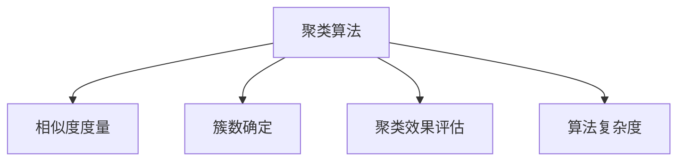

                 

# 聚类 (Clustering) 原理与代码实例讲解

> 关键词：聚类算法, 数据挖掘, 机器学习, 无监督学习, K-means, 层次聚类, 密度聚类, 随机森林聚类

## 1. 背景介绍

### 1.1 问题由来
在数据分析和机器学习领域，聚类（Clustering）是一个基本但极其重要的任务。聚类算法旨在将数据集中的样本按照某种相似度度量分成多个自然或预定义的组，从而揭示数据的内在结构和模式。聚类在市场分析、图像处理、社交网络分析、生物学、天文学等多个领域都有广泛应用。

### 1.2 问题核心关键点
聚类算法可以分为硬聚类和软聚类。硬聚类要求每个样本只能属于一个簇，而软聚类允许样本以一定的概率属于多个簇。常见的聚类算法包括K-means、层次聚类、DBSCAN、谱聚类、随机森林聚类等。

聚类算法的核心关键点包括：
- 相似度度量：用于衡量样本之间距离或相似性的函数。
- 簇数确定：如何选择最优的簇数，以适应数据结构和真实世界中的实际分类情况。
- 聚类效果评估：如何评估聚类的质量，如簇的紧凑性、簇间分离度等。
- 算法复杂度：不同算法的时间复杂度和空间复杂度，影响实际应用的可行性和效率。

### 1.3 问题研究意义
研究聚类算法具有重要意义：
- 数据探索：聚类算法能够发现数据中的模式和结构，揭示数据的潜在特征和关联。
- 数据预处理：聚类可作为数据预处理步骤，为后续的分类、回归等任务提供数据。
- 数据可视化：聚类结果可用于数据可视化，直观展示数据的空间分布和集群的形态。
- 推荐系统：聚类算法可用于用户行为分析，推荐相似用户或物品，提升用户体验。
- 异常检测：通过识别与其他簇显著分离的异常点，聚类算法可用于异常检测和数据清洗。

## 2. 核心概念与联系

### 2.1 核心概念概述

为了更好地理解聚类算法的核心原理，本节将介绍几个密切相关的核心概念：

- 聚类算法(Clustering)：一种无监督学习技术，用于发现数据集中的自然分组。常见的聚类算法包括K-means、层次聚类、DBSCAN、谱聚类等。
- 相似度度量(Similarity Metric)：用于衡量样本之间距离或相似性的函数。如欧式距离、曼哈顿距离、余弦相似度等。
- 簇数确定(Cluster Number Determination)：选择最优的簇数，以适应数据结构和真实世界中的实际分类情况。常见的确定簇数的方法包括Elbow Method、Silhouette Coefficient、Gap Statistic等。
- 聚类效果评估(Cluster Evaluation)：评估聚类的质量，如簇的紧凑性、簇间分离度等。常见的评估指标包括SSE、ARI、Dunn Index等。
- 算法复杂度(Algorithm Complexity)：不同算法的时间复杂度和空间复杂度，影响实际应用的可行性和效率。

这些核心概念之间的逻辑关系可以通过以下Mermaid流程图来展示：



这个流程图展示了一个典型的聚类算法流程：首先定义聚类算法，选择相似度度量，确定簇数，接着进行聚类效果评估，并考虑算法的复杂度。这些概念共同构成了聚类算法的核心框架，使其能够有效地发现数据集中的自然分组。

## 3. 核心算法原理 & 具体操作步骤
### 3.1 算法原理概述

聚类算法主要分为硬聚类和软聚类两种。硬聚类要求每个样本只能属于一个簇，而软聚类允许样本以一定的概率属于多个簇。

典型的硬聚类算法包括K-means和层次聚类。K-means算法通过对样本进行迭代重心的更新，将样本分配到最近的簇中心，最终得到K个簇。层次聚类算法则通过自下而上的层次结构构建，逐步合并簇，最终得到树形结构的簇划分。

软聚类算法包括DBSCAN和谱聚类。DBSCAN算法通过密度阈值的定义，识别出密集区域作为簇，并标记出异常点。谱聚类算法通过图论方法，将数据映射为低维空间，进行聚类。

### 3.2 算法步骤详解

以下将以K-means算法为例，详细讲解其步骤和原理：

**Step 1: 初始化簇中心**
随机选取K个样本作为初始簇中心，可以采用K-means++等方法进行优化选择。

**Step 2: 分配样本到最近的簇中心**
对每个样本计算其与所有簇中心的距离，将其分配到最近的簇中心。

**Step 3: 更新簇中心**
对每个簇，重新计算其所有成员的平均值，更新簇中心。

**Step 4: 重复迭代**
重复执行步骤2和步骤3，直到簇中心不再发生变化或达到预设的迭代次数。

### 3.3 算法优缺点

K-means算法的优点包括：
- 简单易实现。K-means算法计算复杂度较低，易于实现和调试。
- 收敛较快。K-means算法通常能够在较短时间内收敛到相对稳定的结果。
- 可解释性好。K-means算法得到的簇中心和簇分配结果直观易懂。

K-means算法的缺点包括：
- 簇数需要事先指定。K-means算法需要事先确定簇数K，难以自动确定最优的簇数。
- 对初始值敏感。不同的初始值可能导致不同的聚类结果，影响聚类的稳定性。
- 只能处理球状簇。K-means算法假定簇为球状，对于非球状簇，聚类效果可能不佳。

### 3.4 算法应用领域

聚类算法在众多领域中都有广泛应用，包括但不限于：

- 市场营销：通过聚类分析，发现目标市场和客户群体，制定精准营销策略。
- 图像处理：将图像中的像素点聚类，进行图像分割、边缘检测等处理。
- 生物信息学：聚类算法用于基因表达数据的分类和功能分析。
- 天文学：用于星系的分类和运动研究。
- 金融分析：识别市场中的交易模式和异常交易，防范金融风险。

除了这些经典应用外，聚类算法还被创新性地应用于更多场景中，如社交网络分析、推荐系统、异常检测等，为数据挖掘和知识发现提供了新的工具。

## 4. 数学模型和公式 & 详细讲解 & 举例说明

### 4.1 数学模型构建

K-means算法的数学模型可以形式化为：

$$
\min_{C,\mu} \sum_{i=1}^N \sum_{k=1}^K d(x_i,\mu_k)^2, \text{其中 } d(\cdot,\cdot) \text{ 为距离度量}
$$

其中，$C=\{C_1, \ldots, C_K\}$ 为K个簇，$\mu_k = \frac{1}{|C_k|} \sum_{x_i \in C_k} x_i$ 为簇 $C_k$ 的质心，$d(\cdot,\cdot)$ 为距离度量函数（如欧式距离）。

目标是最小化所有样本到最近簇中心的距离平方和，优化过程包括簇中心更新和样本分配。

### 4.2 公式推导过程

K-means算法的优化过程主要包括以下几个步骤：

**Step 1: 初始化簇中心**
随机选择K个样本作为初始簇中心。

**Step 2: 分配样本到最近的簇中心**
对于每个样本 $x_i$，计算其到每个簇中心的距离 $d(x_i,\mu_k)$，将其分配到距离最近的簇中心 $C_k$。

**Step 3: 更新簇中心**
对于每个簇 $C_k$，重新计算其所有成员的平均值 $\mu_k = \frac{1}{|C_k|} \sum_{x_i \in C_k} x_i$，更新簇中心。

**Step 4: 重复迭代**
重复执行步骤2和步骤3，直到簇中心不再发生变化或达到预设的迭代次数。

### 4.3 案例分析与讲解

以一个简单的二维数据集为例，展示K-means算法的聚类过程。假设我们有4个样本点，需要将其分为两个簇。

**初始状态：** 随机选择两个样本点作为初始簇中心。

**第一轮迭代：**
- 对于第一个样本点 $x_1 = (1,1)$，计算其到两个簇中心的距离：$d(x_1,\mu_1) = \sqrt{(1-1)^2 + (1-1)^2} = 0$，$d(x_1,\mu_2) = \sqrt{(1-2)^2 + (1-3)^2} = \sqrt{10}$。
- 将 $x_1$ 分配到簇 $\mu_1$。
- 同理，将 $x_2, x_3, x_4$ 分别分配到最近的簇中心。

**第一轮更新：**
- 更新 $\mu_1$ 和 $\mu_2$ 的坐标：$\mu_1 = \frac{1}{2} (1+2) = (1.5, 2.5)$，$\mu_2 = \frac{1}{2} (3+4) = (3.5, 3.5)$。

**第二轮迭代：**
- 计算每个样本点到两个簇中心的距离，进行重新分配。
- 更新 $\mu_1$ 和 $\mu_2$ 的坐标。

**重复迭代：**
- 继续进行样本分配和簇中心更新，直到簇中心不再发生变化。

**最终聚类结果：**
- 得到两个簇，分别包含 $(x_1, x_3)$ 和 $(x_2, x_4)$。

通过这个案例，可以看出K-means算法的聚类过程是迭代重心的更新和样本分配的交替进行，直到簇中心不再发生变化。

## 5. 项目实践：代码实例和详细解释说明
### 5.1 开发环境搭建

在进行聚类实践前，我们需要准备好开发环境。以下是使用Python进行K-means聚类的环境配置流程：

1. 安装Anaconda：从官网下载并安装Anaconda，用于创建独立的Python环境。

2. 创建并激活虚拟环境：
```bash
conda create -n py-env python=3.8 
conda activate py-env
```

3. 安装Scikit-learn：
```bash
pip install scikit-learn
```

4. 安装相关数据集：
```bash
pip install matplotlib numpy
```

完成上述步骤后，即可在`py-env`环境中开始聚类实践。

### 5.2 源代码详细实现

以下是一个使用Scikit-learn库对K-means算法进行聚类的Python代码实现：

```python
import matplotlib.pyplot as plt
import numpy as np
from sklearn.cluster import KMeans

# 生成随机数据集
np.random.seed(0)
X = np.random.rand(100, 2)

# 创建KMeans对象，簇数为3
kmeans = KMeans(n_clusters=3, init='k-means++', max_iter=100)

# 训练模型
kmeans.fit(X)

# 预测聚类标签
y_pred = kmeans.predict(X)

# 绘制聚类结果
plt.scatter(X[:, 0], X[:, 1], c=y_pred)
plt.show()
```

这个代码片段实现了对二维随机数据集的K-means聚类。

### 5.3 代码解读与分析

让我们再详细解读一下关键代码的实现细节：

**np.random.seed(0)**：设置随机种子，保证实验可复现性。

**X = np.random.rand(100, 2)**：生成100个二维随机数据点。

**kmeans = KMeans(n_clusters=3, init='k-means++', max_iter=100)**：创建KMeans对象，指定簇数为3，使用K-means++初始化，最大迭代次数为100。

**kmeans.fit(X)**：训练模型，对数据集进行聚类。

**y_pred = kmeans.predict(X)**：对数据集进行预测，得到每个样本的聚类标签。

**plt.scatter(X[:, 0], X[:, 1], c=y_pred)**：绘制聚类结果，以颜色区分不同的簇。

**plt.show()**：显示聚类结果图。

可以看到，Scikit-learn库使得K-means算法的实现变得非常简单。开发者可以将更多精力放在数据处理和模型改进上，而不必过多关注底层的实现细节。

当然，实际应用中还需要考虑更多因素，如聚类数的自动确定、簇的可视化展示、聚类结果的评估等。但核心的聚类范式基本与此类似。

## 6. 实际应用场景
### 6.1 市场营销

K-means算法在市场营销中广泛应用，通过聚类分析，发现目标市场和客户群体，制定精准营销策略。例如，零售商可以通过聚类分析，发现不同客户群体的购买行为和偏好，有针对性地推出产品和服务，提升客户满意度和销售额。

### 6.2 图像处理

K-means算法在图像处理中用于图像分割、边缘检测等处理。通过将像素点聚类，可以识别出图像中的不同区域，提取边缘特征，实现图像的预处理和分析。

### 6.3 生物信息学

K-means算法在生物信息学中用于基因表达数据的分类和功能分析。通过聚类分析，可以发现基因表达的模式和关系，揭示基因的功能和调控机制。

### 6.4 天文学

K-means算法在天文学中用于星系的分类和运动研究。通过聚类分析，可以识别出不同星系的特征和运动模式，帮助天文学家更好地理解宇宙的结构和演化。

除了这些经典应用外，K-means算法还被创新性地应用于更多场景中，如社交网络分析、推荐系统、异常检测等，为数据挖掘和知识发现提供了新的工具。

### 6.5 未来应用展望

随着数据量的不断增大和计算能力的提升，K-means算法和其他聚类算法将在大数据处理和智能系统中发挥更大的作用。未来的聚类技术将更加智能化、自动化和多样化，为各行各业带来更多应用场景。

## 7. 工具和资源推荐
### 7.1 学习资源推荐

为了帮助开发者系统掌握聚类算法的理论基础和实践技巧，这里推荐一些优质的学习资源：

1. 《机器学习实战》：详细讲解了K-means算法和其他聚类算法的原理和实现，适合初学者入门。

2. 《Python数据科学手册》：涵盖聚类算法的多种实现，包括K-means、层次聚类、DBSCAN等。

3. 《聚类分析：聚类与层次聚类算法》：讲解聚类算法的数学基础和实际应用，适合深入学习。

4. Kaggle网站：提供大量聚类算法相关的Kaggle比赛和数据集，适合实践练习。

通过对这些资源的学习实践，相信你一定能够快速掌握聚类算法的精髓，并用于解决实际的机器学习问题。

### 7.2 开发工具推荐

高效的开发离不开优秀的工具支持。以下是几款用于聚类开发的常用工具：

1. Scikit-learn：Python中最流行的机器学习库之一，包含K-means算法和其他聚类算法的实现。

2. TensorFlow：Google开发的深度学习框架，支持各种聚类算法的实现和优化。

3. Apache Spark：基于分布式计算的机器学习框架，适合处理大规模数据集。

4. Weights & Biases：模型训练的实验跟踪工具，可以记录和可视化聚类算法的训练过程和结果。

5. TensorBoard：TensorFlow配套的可视化工具，可实时监测聚类算法的训练状态和指标。

6. Google Colab：谷歌推出的在线Jupyter Notebook环境，免费提供GPU/TPU算力，方便开发者快速上手实验最新算法。

合理利用这些工具，可以显著提升聚类算法的开发效率，加快创新迭代的步伐。

### 7.3 相关论文推荐

聚类算法在机器学习领域的研究已有数十年历史，以下是几篇奠基性的相关论文，推荐阅读：

1. K-means: A Method for Partitioning Clusters: 介绍K-means算法的经典论文，由Arthur和Varshney提出。

2. The K-means Clustering Algorithm: A Quantitative Survey: 对K-means算法的数学基础和实际应用进行全面总结。

3. Affinity Propagation: A Scalable Algorithm for Finding Natural Clusters: 介绍Affinity Propagation算法，具有自适应聚类数的优点。

4. DBSCAN: A Density-Based Clustering Method: 介绍DBSCAN算法，具有处理任意形状簇的优点。

5. Spectral Clustering: A Tutorial: 介绍谱聚类算法，具有处理高维数据和任意形状簇的优点。

这些论文代表了大规模数据聚类技术的发展脉络。通过学习这些前沿成果，可以帮助研究者把握学科前进方向，激发更多的创新灵感。

## 8. 总结：未来发展趋势与挑战
### 8.1 总结

本文对聚类算法进行了全面系统的介绍。首先阐述了聚类算法的研究背景和意义，明确了聚类在数据分析和机器学习中的重要地位。其次，从原理到实践，详细讲解了聚类算法的数学模型和实现步骤，给出了聚类任务开发的完整代码实例。同时，本文还广泛探讨了聚类算法在市场营销、图像处理、生物信息学、天文学等多个领域的应用前景，展示了聚类算法的巨大潜力。此外，本文精选了聚类算法的各类学习资源，力求为读者提供全方位的技术指引。

通过本文的系统梳理，可以看到，聚类算法正在成为数据挖掘和机器学习中的重要技术，极大地拓展了数据处理和知识发现的能力。未来，伴随数据量的不断增大和计算能力的提升，聚类技术必将在大数据处理和智能系统中发挥更大的作用，为各行各业带来更多应用场景。

### 8.2 未来发展趋势

展望未来，聚类算法将呈现以下几个发展趋势：

1. 数据处理能力增强：随着数据量的不断增大和计算能力的提升，聚类算法能够处理更大规模的数据集，发现更深层次的数据模式。

2. 算法多样性增加：未来将涌现更多聚类算法，如层次聚类、谱聚类、密度聚类等，满足不同场景下的聚类需求。

3. 自动化水平提高：聚类算法的自动化水平将不断提高，能够自动识别最优的聚类数，自动调整算法参数。

4. 交叉学科融合：聚类算法将与其他学科领域如地理信息系统、金融分析等进行交叉融合，推动跨学科研究。

5. 多模态数据融合：聚类算法将处理多模态数据（如文本、图像、视频等），实现多模态数据的协同建模。

这些趋势凸显了聚类算法在数据处理和智能系统中的广阔前景。这些方向的探索发展，必将进一步提升聚类算法的性能和应用范围，为数据挖掘和知识发现提供新的工具。

### 8.3 面临的挑战

尽管聚类算法已经取得了瞩目成就，但在迈向更加智能化、自动化应用的过程中，它仍面临着诸多挑战：

1. 数据稀疏性：聚类算法对于稀疏数据和高维数据处理效果较差，如何提升聚类算法的鲁棒性，适应复杂数据结构，将是一大挑战。

2. 可解释性不足：聚类算法通常被视为"黑盒"模型，难以解释其内部工作机制和决策逻辑，对于实际应用中的解释需求，如何提升聚类算法的可解释性，将是一个重要的研究方向。

3. 高效处理大规模数据：随着数据量的不断增大，聚类算法需要处理大规模数据集，如何高效处理数据、优化算法，将是一个重要的优化方向。

4. 算法鲁棒性提升：聚类算法面对噪声和异常数据时，容易产生不稳定的聚类结果，如何提升聚类算法的鲁棒性，防止过拟合，将是一个重要的研究课题。

5. 算法公平性保障：聚类算法可能产生数据不平衡和偏见问题，如何保证算法的公平性和公正性，避免数据歧视，将是一个重要的伦理问题。

这些挑战凸显了聚类算法在实际应用中需要解决的问题。未来聚类算法需要在数据处理、算法优化、可解释性、公平性等方面进行更多的研究和改进，才能更好地服务于实际应用。

### 8.4 研究展望

面对聚类算法所面临的种种挑战，未来的研究需要在以下几个方面寻求新的突破：

1. 无监督学习和半监督学习：通过引入无监督和半监督学习，探索自动化的聚类算法，减少对标注数据的需求。

2. 多模态聚类：将聚类算法应用于多模态数据，实现多模态数据的协同建模和分析。

3. 聚类算法融合：将聚类算法与其他机器学习算法（如分类、回归等）进行融合，提升聚类算法的应用效果。

4. 聚类算法可解释性：通过引入可解释性算法（如局部聚类、类比聚类等），提升聚类算法的可解释性，增强其应用可靠性。

5. 聚类算法公平性：引入公平性约束，设计公平、公正的聚类算法，避免数据偏见和歧视问题。

这些研究方向的探索，必将引领聚类算法技术迈向更高的台阶，为数据挖掘和知识发现提供新的工具。

## 9. 附录：常见问题与解答

**Q1: 聚类算法的目标是什么？**

A: 聚类算法的目标是发现数据集中的自然分组，使得同一簇内的样本相似度高，不同簇之间的样本相似度低。常见的评价指标包括簇的紧凑性、簇间分离度等。

**Q2: 如何选择合适的聚类算法？**

A: 选择合适的聚类算法需要考虑数据特征、聚类目标、算法复杂度等因素。K-means算法适用于球状簇，DBSCAN适用于任意形状簇，谱聚类适用于高维数据和任意形状簇。

**Q3: 聚类算法面临的主要挑战有哪些？**

A: 聚类算法面临的主要挑战包括数据稀疏性、可解释性不足、高效处理大规模数据、算法鲁棒性提升和算法公平性保障等。

**Q4: 聚类算法有哪些应用场景？**

A: 聚类算法在市场营销、图像处理、生物信息学、天文学、社交网络分析、推荐系统、异常检测等领域有广泛应用。

通过本文的系统梳理，可以看到聚类算法在数据分析和机器学习中的重要地位，未来聚类技术将在数据处理和智能系统中发挥更大的作用，为各行各业带来更多应用场景。相信随着研究的不断深入，聚类算法将迎来更加智能化和自动化，为数据挖掘和知识发现提供新的工具。

---

作者：禅与计算机程序设计艺术 / Zen and the Art of Computer Programming

