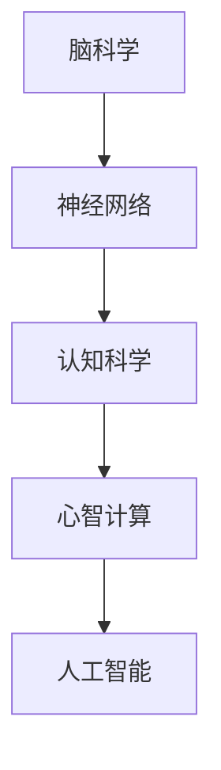

                 

# 脑科学与AI的交叉研究：理解智能的本质

> 关键词：脑科学,人工智能,智能本质,神经网络,认知科学,心智计算

## 1. 背景介绍

### 1.1 问题由来

随着人工智能技术的飞速发展，我们越来越接近于理解智能的本质。但真正实现智能，需要深度理解大脑和神经系统的复杂运作方式。脑科学与人工智能的交叉研究，是解开人类智能之谜的关键。

### 1.2 问题核心关键点

脑科学与AI的交叉研究，本质上是如何将对人脑和神经系统的深入理解，转化为可用于创建智能系统的方法和工具。这一领域的研究涉及到神经网络的结构和训练，以及如何模拟人脑的认知过程。

脑科学揭示了人脑的运作机制，而AI则尝试模拟这些机制，通过训练和优化，使得计算机系统能够在复杂环境中表现智能行为。两者之间的结合，使得AI能够借鉴脑科学的研究成果，不断提高自己的智能水平。

### 1.3 问题研究意义

研究脑科学与AI的交叉研究，具有重要意义：

1. 加速AI技术发展：脑科学的研究成果为AI提供了新的灵感和方法，使得AI系统可以更好地理解复杂任务和环境。
2. 提高AI系统的智能化：通过对脑科学的研究，AI系统可以更好地模拟人脑的认知过程，提升自身的智能水平。
3. 推动认知科学研究：AI技术的发展，反过来也可以帮助我们更好地理解人类智能的本质，推动认知科学的发展。

## 2. 核心概念与联系

### 2.1 核心概念概述

为了更好地理解脑科学与AI的交叉研究，我们首先介绍几个关键概念：

- 脑科学(Brain Science)：研究人脑和神经系统的结构、功能及行为规律，是理解人类智能的基石。
- 人工智能(Artificial Intelligence)：通过模拟人脑的认知过程，创建能够自主执行复杂任务的智能系统。
- 神经网络(Neural Networks)：基于人脑神经元之间的连接机制，构建的计算模型，用于模拟人脑的认知和推理过程。
- 认知科学(Cognitive Science)：研究人类智能的起源、发展及机制，试图将认知过程形式化，并用数学和计算机语言表达。
- 心智计算(Mental Computing)：研究人脑的计算过程和机制，试图将人脑计算模式转化为计算机算法。

这些核心概念之间的逻辑关系可以通过以下Mermaid流程图来展示：



这个流程图展示了几者之间的联系：

1. 脑科学研究揭示了神经元之间的连接和交互方式，为神经网络提供了生物学基础。
2. 认知科学将认知过程形式化，为神经网络提供了建模依据。
3. 心智计算研究人脑的计算过程，为计算机算法提供了灵感。
4. 人工智能通过神经网络等技术，模拟人脑的认知和推理过程，构建智能系统。

## 3. 核心算法原理 & 具体操作步骤
### 3.1 算法原理概述

脑科学与AI的交叉研究，主要基于神经网络和认知科学的理论。其核心思想是：通过模拟人脑的认知过程，构建计算模型，并通过学习来优化这些模型，使其能够执行复杂任务。

具体来说，神经网络是一种计算模型，模拟了人脑神经元之间的连接和交互方式。认知科学则提供了关于人脑认知过程的形式化描述，用于指导神经网络的构建和训练。

神经网络的训练过程，本质上是一种优化问题。通过调整神经元之间的连接权重，使得网络能够准确地映射输入和输出。这一过程被称作“反向传播算法”，通过不断调整权重，最小化预测误差。

### 3.2 算法步骤详解

基于脑科学与AI的交叉研究，神经网络的训练过程主要包括以下几个步骤：

**Step 1: 数据预处理**

将输入数据进行标准化处理，如归一化、中心化等，以便于神经网络更好地学习。

**Step 2: 构建神经网络**

根据认知科学的研究成果，构建适合于特定任务的神经网络。包括选择适当的神经元数量、连接方式和激活函数等。

**Step 3: 反向传播算法**

使用反向传播算法，根据预测误差调整神经元之间的连接权重，最小化预测误差。

**Step 4: 模型验证**

在验证集上评估模型的性能，选择最优的模型参数。

**Step 5: 应用到实际问题**

将训练好的模型应用到实际问题中，进行预测和推理。

### 3.3 算法优缺点

脑科学与AI的交叉研究，具有以下优点：

1. 提升AI的智能化水平：通过对脑科学的研究，AI可以更好地理解人类智能的机制，提升自身的智能水平。
2. 提高AI的鲁棒性和自适应能力：脑科学的研究成果，可以指导神经网络的构建和优化，提高AI系统的鲁棒性和自适应能力。
3. 推动认知科学的发展：AI技术的发展，反过来可以推动认知科学的研究，帮助我们更好地理解人类智能的本质。

但这一领域的研究也存在一些局限：

1. 数据需求大：脑科学与AI的交叉研究，需要大量的标注数据，成本较高。
2. 技术复杂：神经网络和认知科学的理论复杂，理解和应用需要较高的技术水平。
3. 难以解释：神经网络的决策过程难以解释，无法理解其内部运作机制。

尽管存在这些局限，但脑科学与AI的交叉研究仍是大数据和AI领域的重要研究方向，对未来的人工智能发展具有重要意义。

### 3.4 算法应用领域

基于脑科学与AI的交叉研究，神经网络已经广泛应用于各种领域，例如：

- 图像识别：通过神经网络，可以对图像进行分类、识别、分割等任务。
- 语音识别：通过神经网络，可以将语音转化为文字，进行语音识别和翻译。
- 自然语言处理：通过神经网络，可以对文本进行分类、情感分析、问答等任务。
- 机器人控制：通过神经网络，可以对机器人进行路径规划、避障等控制。
- 自动驾驶：通过神经网络，可以对交通信号、行人、车辆等进行识别和决策。

除了上述这些经典应用外，神经网络还在医疗诊断、金融预测、供应链管理等领域得到了广泛应用，带来了革命性的变革。

## 4. 数学模型和公式 & 详细讲解 & 举例说明
### 4.1 数学模型构建

脑科学与AI的交叉研究，主要基于神经网络的构建和训练。神经网络的数学模型可以表示为：

$$
y = \sigma(\sum_{i=1}^n w_i x_i + b)
$$

其中，$y$ 为输出，$x_i$ 为输入，$w_i$ 为权重，$b$ 为偏置，$\sigma$ 为激活函数。

### 4.2 公式推导过程

神经网络的训练过程，通过反向传播算法来实现。反向传播算法的基本步骤如下：

1. 前向传播：将输入数据 $x$ 通过神经网络，得到输出 $y$。
2. 计算误差：将 $y$ 与真实输出 $y'$ 进行比较，计算预测误差。
3. 反向传播：根据误差，计算每个神经元的梯度，更新权重和偏置。
4. 重复步骤 1-3，直到达到预设的迭代次数或误差小于预设值。

### 4.3 案例分析与讲解

以图像识别为例，介绍神经网络的训练过程。

假设输入的图像 $x$ 为 $28 \times 28$ 的灰度图像，输出 $y$ 为 10 个类别的概率分布。

神经网络的结构为：输入层 $x$，隐藏层 $h$，输出层 $y$。激活函数为 ReLU，权重初始化为 0。

1. 前向传播：将输入图像 $x$ 通过神经网络，得到输出 $y$。
2. 计算误差：将 $y$ 与真实输出 $y'$ 进行比较，计算预测误差。
3. 反向传播：根据误差，计算每个神经元的梯度，更新权重和偏置。
4. 重复步骤 1-3，直到达到预设的迭代次数或误差小于预设值。

在训练过程中，神经网络的权重和偏置不断调整，使得输出 $y$ 逐渐逼近真实输出 $y'$，最终实现对输入图像的分类。

## 5. 项目实践：代码实例和详细解释说明
### 5.1 开发环境搭建

在进行脑科学与AI的交叉研究实践前，我们需要准备好开发环境。以下是使用Python进行TensorFlow开发的环境配置流程：

1. 安装Anaconda：从官网下载并安装Anaconda，用于创建独立的Python环境。

2. 创建并激活虚拟环境：
```bash
conda create -n tf-env python=3.7 
conda activate tf-env
```

3. 安装TensorFlow：
```bash
conda install tensorflow
```

4. 安装各类工具包：
```bash
pip install numpy pandas scikit-learn matplotlib tqdm jupyter notebook ipython
```

完成上述步骤后，即可在`tf-env`环境中开始脑科学与AI的交叉研究实践。

### 5.2 源代码详细实现

这里我们以手写数字识别为例，使用TensorFlow实现神经网络的构建和训练。

首先，定义数据预处理函数：

```python
import tensorflow as tf
from tensorflow.keras.datasets import mnist
from tensorflow.keras.utils import to_categorical

(x_train, y_train), (x_test, y_test) = mnist.load_data()

# 将数据归一化
x_train = x_train / 255.0
x_test = x_test / 255.0

# 将标签转化为one-hot编码
y_train = to_categorical(y_train, num_classes=10)
y_test = to_categorical(y_test, num_classes=10)
```

然后，定义神经网络的模型：

```python
from tensorflow.keras.models import Sequential
from tensorflow.keras.layers import Dense, Flatten

model = Sequential()
model.add(Flatten(input_shape=(28, 28)))
model.add(Dense(128, activation='relu'))
model.add(Dense(10, activation='softmax'))
```

接着，定义损失函数和优化器：

```python
from tensorflow.keras.losses import categorical_crossentropy
from tensorflow.keras.optimizers import Adam

loss_fn = categorical_crossentropy
optimizer = Adam(learning_rate=0.001)
```

最后，定义训练和评估函数：

```python
from tensorflow.keras.metrics import Accuracy

def train_epoch(model, dataset, batch_size, optimizer):
    model.compile(loss=loss_fn, optimizer=optimizer, metrics=[Accuracy()])
    model.fit(dataset, batch_size=batch_size, epochs=1)
    return model.evaluate(dataset, batch_size=batch_size)

def evaluate(model, dataset, batch_size):
    model.evaluate(dataset, batch_size=batch_size)
```

启动训练流程并在测试集上评估：

```python
epochs = 10
batch_size = 64

for epoch in range(epochs):
    model = train_epoch(model, x_train, batch_size, optimizer)
    evaluate(model, x_test, batch_size)
```

以上就是使用TensorFlow对手写数字识别进行神经网络训练的完整代码实现。可以看到，通过TensorFlow，我们可以方便地构建、训练和评估神经网络，实现脑科学与AI的交叉研究。

### 5.3 代码解读与分析

让我们再详细解读一下关键代码的实现细节：

**MNIST数据集**：
- `mnist.load_data()`方法：用于加载MNIST手写数字数据集。
- `to_categorical()`方法：将标签转化为one-hot编码。

**模型定义**：
- `Sequential()`方法：用于定义序列化的模型。
- `Flatten()`方法：用于将输入数据展平，使其适应后续的层。
- `Dense()`方法：用于定义全连接层。
- `activation`参数：指定激活函数，常用的有 ReLU、Sigmoid、Softmax 等。

**损失函数和优化器**：
- `categorical_crossentropy()`方法：用于定义分类任务的损失函数。
- `Adam()`方法：用于定义优化器。

**训练和评估函数**：
- `compile()`方法：用于模型编译，指定损失函数、优化器、评估指标等。
- `fit()`方法：用于模型训练。
- `evaluate()`方法：用于模型评估。

**训练流程**：
- `for`循环：循环训练多个epoch。
- `train_epoch()`函数：在训练集上训练一个epoch。
- `evaluate()`函数：在测试集上评估模型性能。

可以看到，TensorFlow提供了强大的工具和库，方便我们进行神经网络的构建、训练和评估。通过以上代码，我们可以很方便地实现手写数字识别的神经网络训练。

## 6. 实际应用场景
### 6.1 医疗影像识别

基于脑科学与AI的交叉研究，神经网络在医疗影像识别中得到了广泛应用。医生可以通过神经网络，对X光片、CT片等影像进行自动分类和诊断，提高诊断的准确性和效率。

在技术实现上，可以收集大量医学影像和标注数据，使用神经网络对这些影像进行分类和识别。神经网络可以通过反向传播算法不断优化权重和偏置，提高诊断的准确性。同时，神经网络还可以进行病变区域的检测和分割，进一步提升诊断的精细度。

### 6.2 自动驾驶

自动驾驶技术是脑科学与AI的交叉研究的另一重要应用领域。通过神经网络，可以构建自动驾驶系统，实现路径规划、避障、车道保持等功能。

在技术实现上，可以收集大量交通数据和传感器数据，使用神经网络对这些数据进行学习和处理。神经网络可以通过反向传播算法不断优化决策模型，提高驾驶的安全性和稳定性。同时，神经网络还可以进行交通信号的识别和预测，进一步提升驾驶的智能水平。

### 6.3 金融预测

神经网络在金融预测中也得到了广泛应用。通过神经网络，可以对股票价格、汇率等金融数据进行预测和分析，帮助投资者做出更加科学的决策。

在技术实现上，可以收集大量金融数据和市场信息，使用神经网络对这些数据进行学习和处理。神经网络可以通过反向传播算法不断优化预测模型，提高预测的准确性。同时，神经网络还可以进行市场情绪分析，进一步提升预测的可靠性。

### 6.4 未来应用展望

随着脑科学与AI的交叉研究的不断深入，神经网络将在更多领域得到应用，为社会带来新的变革。

在智慧城市领域，基于神经网络的智能交通管理系统，可以实现实时监控和调控，提高交通效率和安全性。基于神经网络的智慧农业系统，可以实现对农作物的自动化监测和决策，提高农业生产效率和产量。基于神经网络的智能家居系统，可以实现对家电的自动化控制和优化，提升居住体验。

未来，随着脑科学与AI的交叉研究的不断进步，神经网络将在更多领域发挥重要作用，推动社会生产力的提升和智能化水平的提高。

## 7. 工具和资源推荐
### 7.1 学习资源推荐

为了帮助开发者系统掌握脑科学与AI的交叉研究，这里推荐一些优质的学习资源：

1. 《深度学习》书籍：由深度学习领域的专家编写，全面介绍了神经网络的基本原理和应用。
2. 《神经网络与深度学习》在线课程：由斯坦福大学开设的深度学习课程，涵盖了神经网络的基础知识、优化算法等。
3. 《神经网络及其应用》课程：由清华大学开设的神经网络课程，包括神经网络的构建、训练和应用等。
4. Google Deep Learning Summer School：由Google组织的深度学习夏季学校，涵盖深度学习的基础知识和最新研究进展。
5. 《Neural Network Architectures》书籍：介绍了不同类型的神经网络结构和其应用，适合深入学习。

通过对这些资源的学习实践，相信你一定能够快速掌握脑科学与AI的交叉研究的核心技术，并用于解决实际的神经网络问题。

### 7.2 开发工具推荐

高效的开发离不开优秀的工具支持。以下是几款用于神经网络开发的常用工具：

1. TensorFlow：由Google主导开发的深度学习框架，支持分布式计算，适用于大规模深度学习任务。
2. PyTorch：由Facebook开发的深度学习框架，支持动态图计算，灵活性高，适用于快速迭代研究。
3. Keras：基于TensorFlow和Theano开发的高级神经网络库，易于上手，适合快速构建和训练模型。
4. Jupyter Notebook：支持Python代码的交互式编辑和执行，方便开发者进行快速迭代和调试。
5. TensorBoard：用于可视化神经网络的训练过程和参数调整，方便开发者进行模型调试和优化。

合理利用这些工具，可以显著提升神经网络开发的效率，加快创新迭代的步伐。

### 7.3 相关论文推荐

脑科学与AI的交叉研究是一个前沿的研究方向，以下是几篇奠基性的相关论文，推荐阅读：

1. 《Neural Computation》期刊：介绍神经网络的研究进展和应用，是神经网络领域的权威期刊。
2. 《IEEE Transactions on Neural Networks》期刊：介绍神经网络在工程领域的应用，包括信号处理、图像处理等。
3. 《Nature Neuroscience》期刊：介绍神经科学的研究进展，包括神经元之间的连接和交互方式。
4. 《Science》期刊：介绍脑科学的研究进展，包括人脑和神经系统的结构和功能。
5. 《Journal of Artificial Intelligence Research》期刊：介绍人工智能的研究进展，包括神经网络的应用。

这些论文代表了大数据和AI领域的研究方向，通过学习这些前沿成果，可以帮助研究者把握学科前进方向，激发更多的创新灵感。

## 8. 总结：未来发展趋势与挑战
### 8.1 研究成果总结

脑科学与AI的交叉研究在神经网络构建、训练和应用方面取得了丰硕的成果，推动了人工智能技术的不断发展。

1. 神经网络结构不断优化：通过认知科学的研究成果，神经网络结构不断优化，提升了神经网络的学习能力和表现。
2. 训练算法不断改进：通过反向传播算法的不断改进，神经网络的训练效率和性能不断提升。
3. 应用场景不断拓展：神经网络在医疗影像识别、自动驾驶、金融预测等领域得到了广泛应用，推动了相关领域的发展。

### 8.2 未来发展趋势

展望未来，脑科学与AI的交叉研究将呈现以下几个发展趋势：

1. 神经网络结构更复杂：随着对人脑和神经系统的深入理解，未来的神经网络结构将更加复杂，能够更好地模拟人脑的认知过程。
2. 训练算法更高效：未来的训练算法将更加高效，能够更快地训练出高质量的神经网络模型。
3. 应用场景更广泛：未来的神经网络将在更多领域得到应用，推动相关领域的发展。
4. 跨领域融合更多：未来的神经网络将与其他领域的技术进行更深入的融合，推动技术的进一步发展。

### 8.3 面临的挑战

尽管脑科学与AI的交叉研究已经取得了丰硕的成果，但仍面临着许多挑战：

1. 数据需求大：神经网络的训练需要大量的标注数据，成本较高。
2. 技术复杂：神经网络和认知科学的理论复杂，理解和应用需要较高的技术水平。
3. 难以解释：神经网络的决策过程难以解释，无法理解其内部运作机制。

### 8.4 研究展望

未来的研究需要在以下几个方面寻求新的突破：

1. 探索无监督和半监督学习：摆脱对大规模标注数据的依赖，利用自监督学习、主动学习等方法，最大限度利用非结构化数据，实现更加灵活高效的神经网络训练。
2. 研究参数高效训练方法：开发更加参数高效的训练方法，在固定大部分神经网络参数的情况下，只更新极少量的任务相关参数。
3. 融合因果和对比学习：通过引入因果推断和对比学习思想，增强神经网络的学习能力和鲁棒性。
4. 引入更多先验知识：将符号化的先验知识，如知识图谱、逻辑规则等，与神经网络进行融合，提高神经网络的智能水平。
5. 结合因果分析和博弈论工具：将因果分析方法引入神经网络，识别出神经网络决策的关键特征，增强输出解释的因果性和逻辑性。

这些研究方向将引领脑科学与AI的交叉研究迈向更高的台阶，为构建安全、可靠、可解释、可控的智能系统铺平道路。面向未来，脑科学与AI的交叉研究还需要与其他人工智能技术进行更深入的融合，如知识表示、因果推理、强化学习等，多路径协同发力，共同推动人工智能技术的发展。

## 9. 附录：常见问题与解答

**Q1：脑科学与AI的交叉研究是否适用于所有AI应用？**

A: 脑科学与AI的交叉研究适用于许多需要模拟人类认知和推理能力的AI应用。但一些需要高精度和高可靠性的应用，如自动驾驶、医疗诊断等，可能需要结合其他AI技术进行综合处理。

**Q2：神经网络如何模拟人脑的认知过程？**

A: 神经网络通过模拟人脑神经元之间的连接和交互方式，实现对输入数据的处理和输出。反向传播算法通过调整神经元之间的连接权重和偏置，最小化预测误差，模拟人脑的学习过程。

**Q3：神经网络训练需要哪些资源？**

A: 神经网络的训练需要大量的标注数据、高性能计算设备（如GPU/TPU）、编程语言（如Python）、开发环境（如TensorFlow、PyTorch）等。

**Q4：神经网络如何避免过拟合？**

A: 神经网络可以通过正则化、dropout、早停等技术避免过拟合。同时，在训练过程中，可以采用数据增强、模型集成等方法提高模型的泛化能力。

**Q5：神经网络如何处理高维度数据？**

A: 神经网络可以通过降维、特征提取等技术处理高维度数据。常用的方法包括主成分分析（PCA）、线性判别分析（LDA）、卷积神经网络（CNN）等。

**Q6：神经网络如何在实际应用中进行部署？**

A: 神经网络可以通过模型裁剪、量化加速等技术优化模型，提高推理效率。同时，可以将模型封装为标准化服务接口，方便集成调用。

以上是脑科学与AI的交叉研究的核心内容，相信通过对这些知识的学习，你能够更好地理解智能的本质，并应用于实际AI应用中。

---

作者：禅与计算机程序设计艺术 / Zen and the Art of Computer Programming

