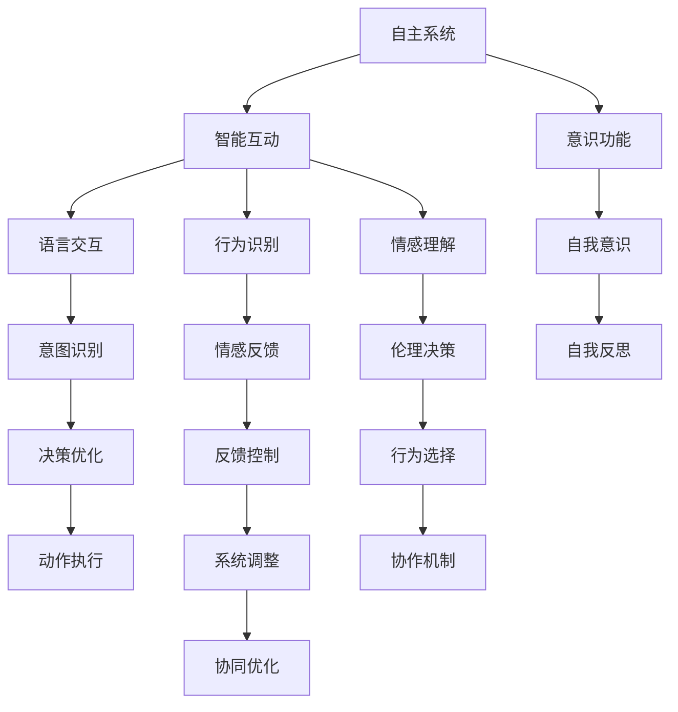

                 

# 自主系统与意识功能的互动

## 1. 背景介绍

### 1.1 问题由来

随着人工智能(AI)技术的快速发展，智能系统和人类的互动已经成为了一个重要研究方向。智能系统，尤其是自主系统，能够在各种任务中表现出卓越的性能，但是其能否真正理解人类的意图和情感，并作出符合伦理道德的行为，是一个亟待解决的问题。意识功能，作为一种高级智能形式，其如何与自主系统互动，成为一个热点话题。

### 1.2 问题核心关键点

- 智能系统如何识别和理解人类的意图、情感和行为？
- 智能系统如何在互动中表现出符合伦理道德的行为？
- 自主系统与意识功能如何协同工作，实现人机协同？

这些问题涉及了认知科学、伦理学、计算机科学等多个领域，是当前AI技术研究的重点和难点。

### 1.3 问题研究意义

研究自主系统与意识功能的互动，对于提升智能系统的智能水平、保障其安全性和可解释性、构建人机协同系统具有重要意义。能够理解并适应人类情感和行为的智能系统，将更好地服务于人类，提升生活质量和工作效率，加速AI技术的落地应用。

## 2. 核心概念与联系

### 2.1 核心概念概述

为更好地理解自主系统与意识功能的互动，本节将介绍几个密切相关的核心概念：

- 自主系统(Autonomous Systems)：指能够自主决策、执行任务的智能系统，包括机器人、无人驾驶、智能家居等。
- 意识功能(Conscious Functionality)：指能够理解自身和他人意图、情感、行为的系统，能够表现出自我意识、自我反思等高级智能行为。
- 智能互动(Intelligent Interaction)：指智能系统与人类之间的双向交流和合作，包括语言交互、行为识别、情感理解等。
- 人机协同(Human-AI Collaboration)：指人类与智能系统在多个任务中的协同工作，共同完成目标。

这些核心概念之间的逻辑关系可以通过以下Mermaid流程图来展示：



这个流程图展示了大语言模型的工作原理和优化方向：

1. 自主系统通过智能互动获取人类信息。
2. 系统利用语言交互、行为识别、情感理解等技术，识别出人类的意图和情感。
3. 系统通过意图识别、情感反馈、伦理决策等步骤，优化决策并执行动作。
4. 系统通过协作机制与意识功能协同工作，增强系统的智能和可解释性。

这些概念共同构成了自主系统与意识功能的互动框架，使其能够在各种场景下发挥强大的协同作用。通过理解这些核心概念，我们可以更好地把握系统的工作原理和优化方向。

## 3. 核心算法原理 & 具体操作步骤
### 3.1 算法原理概述

自主系统与意识功能的互动，本质上是一种高级智能互动过程。其核心思想是：智能系统通过与人类进行双向交流和行为反馈，理解人类的意图和情感，并根据这些信息调整自己的行为，以实现人机协同。

形式化地，假设智能系统为 $S_{\theta}$，其中 $\theta$ 为系统参数。给定人类信息 $I_h$，系统的目标是最大化其与人类互动的效用函数 $U(I_h, S_{\theta})$。

系统在互动过程中，需要处理的任务包括：

1. 意图识别：通过语言、行为等信号，识别出人类的意图。
2. 情感理解：分析人类的情感状态，判断其情感倾向。
3. 行为选择：根据识别出的意图和情感，选择最优的行为策略。
4. 伦理决策：在行为选择过程中，考虑伦理道德因素，避免有害行为。
5. 反馈控制：根据人类的反馈，调整系统的行为策略。

系统在每一步的决策过程中，都可以通过强化学习等方法，优化其行为策略，以提升互动效用。

### 3.2 算法步骤详解

自主系统与意识功能的互动，一般包括以下几个关键步骤：

**Step 1: 准备环境和数据集**
- 选择适当的智能系统 $S_{\theta}$，如机器人、无人驾驶等。
- 准备人类信息数据集 $D_h=\{(I_{hi}, U_hi)\}_{i=1}^N$，其中 $I_{hi}$ 为人类信息，$U_hi$ 为互动效用。

**Step 2: 定义互动目标**
- 根据任务需求，定义系统的互动目标函数 $U(I_h, S_{\theta})$，通常为某种效用函数。
- 设计系统的行为策略 $\pi(I_h)$，包括动作选择、决策优化等。

**Step 3: 设计互动环境**
- 构建与人类互动的环境，包含语言、行为、情感等信号。
- 定义环境状态 $S_e$，并设计状态转换规则 $T(S_e, \pi(I_h))$。

**Step 4: 执行强化学习训练**
- 使用强化学习算法，如Q-learning、SARSA等，优化系统行为策略 $\pi(I_h)$，以最大化效用函数 $U(I_h, S_{\theta})$。
- 训练过程中，利用人类反馈 $F_h$ 调整系统行为，实现适应性互动。

**Step 5: 评估和优化**
- 在测试集上评估系统互动性能，对比优化前后的效果。
- 根据测试结果，进一步调整系统行为策略和环境设计。

以上是自主系统与意识功能互动的一般流程。在实际应用中，还需要针对具体任务的特点，对互动过程的各个环节进行优化设计，如改进互动目标函数，引入更多的反馈控制机制等，以进一步提升互动效果。

### 3.3 算法优缺点

自主系统与意识功能的互动方法具有以下优点：
1. 高效互动：智能系统能够快速识别和理解人类意图、情感，及时调整行为策略，实现高效互动。
2. 人机协同：系统能够在多个任务中与人类协同工作，提升系统的智能和适应性。
3. 可解释性：系统行为策略基于强化学习等方法，可以通过优化算法解释行为选择过程。
4. 伦理决策：系统在行为选择过程中，引入伦理道德因素，避免有害行为，提升系统安全性。

同时，该方法也存在一定的局限性：
1. 依赖人类反馈：系统的行为策略高度依赖于人类的反馈信息，难以自主适应新场景。
2. 环境复杂性：互动环境的设计需要高度抽象和建模，难以应对复杂多变的人类行为。
3. 资源消耗：强化学习训练过程需要大量计算资源，增加系统部署成本。
4. 伦理风险：系统的行为策略可能引入伦理道德风险，难以控制决策的公平性和公正性。

尽管存在这些局限性，但就目前而言，基于智能互动的自主系统设计仍然是大规模应用的重要方向。未来相关研究的重点在于如何进一步降低互动对人类反馈的依赖，提高系统的鲁棒性和泛化能力，同时兼顾伦理道德和社会责任。

### 3.4 算法应用领域

自主系统与意识功能的互动方法，已经在多个领域得到广泛应用，例如：

- 智能客服：智能客服系统能够理解用户的意图和情感，提供个性化的服务。
- 无人驾驶：无人驾驶车辆能够识别交通信号和行人行为，做出安全的决策。
- 医疗诊断：智能医疗系统能够理解患者的症状和需求，提供诊断和治疗建议。
- 教育辅助：智能教育系统能够识别学生的学习状态，提供个性化的学习内容。

除了上述这些经典应用外，互动范式还被创新性地应用到更多场景中，如虚拟助手、智能家居、智能仓储等，为人机协同和智能化应用提供了新的思路。随着技术的发展，未来智能系统将会在更多领域中展现其独特的优势，为人类社会带来更深远的影响。

## 4. 数学模型和公式 & 详细讲解  
### 4.1 数学模型构建

本节将使用数学语言对自主系统与意识功能的互动过程进行更加严格的刻画。

记智能系统为 $S_{\theta}:\mathcal{I} \rightarrow \mathcal{A}$，其中 $\mathcal{I}$ 为输入空间，$\mathcal{A}$ 为输出动作空间，$\theta \in \mathbb{R}^d$ 为系统参数。假设与人类互动的环境为 $E=\{S_e, T(S_e, \pi(I_h))\}$，其中 $S_e$ 为环境状态空间，$T(S_e, \pi(I_h))$ 为状态转换规则。

定义系统在状态 $S_e$ 下与人类互动的效用函数为 $U(S_e, I_h)$，在 $n$ 个时间步内与人类互动的总效用为：

$$
U(S_h, I_h, n) = \sum_{t=1}^n U(S_e^{(t)}, I_h^{(t)})
$$

系统的行为策略为 $\pi(I_h)$，在时间步 $t$ 内选择动作 $a_t$，并根据状态转换规则 $T(S_e, \pi(I_h))$ 更新状态 $S_e^{(t+1)}$。系统的优化目标是最小化总效用函数 $U(S_h, I_h, n)$。

### 4.2 公式推导过程

以下我们以无人驾驶车辆为例，推导强化学习模型的公式。

假设无人驾驶车辆在时间步 $t$ 的状态为 $S_e^{(t)}$，速度为 $v_t$，与前方障碍物距离为 $d_t$，控制信号为 $a_t$，在时间步 $t+1$ 的状态为 $S_e^{(t+1)}$。车辆的控制信号 $a_t$ 可以是对油门、刹车、转向等操作的表示。

车辆在状态 $S_e^{(t)}$ 下与人类互动的效用函数为：

$$
U(S_e^{(t)}, I_h^{(t)}) = R(S_e^{(t)}, a_t) - C(S_e^{(t+1)})
$$

其中 $R(S_e^{(t)}, a_t)$ 为在状态 $S_e^{(t)}$ 下选择动作 $a_t$ 的奖励函数，$C(S_e^{(t+1)})$ 为车辆在状态 $S_e^{(t+1)}$ 下的成本函数。

系统的优化目标是最小化总效用函数：

$$
\min_{\pi} \mathbb{E}[\sum_{t=1}^n U(S_e^{(t)}, I_h^{(t)})]
$$

根据强化学习算法，系统通过迭代优化行为策略 $\pi(I_h)$，逐步调整动作选择，使得总效用函数最小化。

通过上述公式，我们可以看到，强化学习算法能够使得系统在多次与人类互动的过程中，逐步优化行为策略，最终实现高效、安全、可靠的互动。

## 5. 项目实践：代码实例和详细解释说明
### 5.1 开发环境搭建

在进行互动实践前，我们需要准备好开发环境。以下是使用Python进行强化学习的开发环境配置流程：

1. 安装Anaconda：从官网下载并安装Anaconda，用于创建独立的Python环境。

2. 创建并激活虚拟环境：
```bash
conda create -n reinforcement-env python=3.8 
conda activate reinforcement-env
```

3. 安装PyTorch：根据CUDA版本，从官网获取对应的安装命令。例如：
```bash
conda install pytorch torchvision torchaudio cudatoolkit=11.1 -c pytorch -c conda-forge
```

4. 安装TensorFlow：
```bash
pip install tensorflow==2.5.0
```

5. 安装gym库：用于构建互动环境，支持多种互动场景。
```bash
pip install gym
```

6. 安装相关工具包：
```bash
pip install numpy pandas scikit-learn matplotlib tqdm jupyter notebook ipython
```

完成上述步骤后，即可在`reinforcement-env`环境中开始互动实践。

### 5.2 源代码详细实现

下面我以无人驾驶车辆为例，给出使用gym构建互动环境并使用强化学习算法进行训练的PyTorch代码实现。

首先，定义互动环境：

```python
import gym
from gym.envs注册 import register

# 定义环境类
class CarEnv(gym.Env):
    def __init__(self):
        self.state = [0, 0, 0]  # 状态空间：速度、与障碍物距离、刹车状态
        self.observation_space = gym.spaces.Box(low=0, high=100, shape=(3,), dtype=float)
        self.action_space = gym.spaces.Box(low=-1, high=1, shape=(2,), dtype=float)  # 控制信号，分别表示油门、刹车

    def step(self, action):
        velocity = self.state[0] + action[0]
        distance = self.state[1] - 0.5 * velocity
        if distance <= 0:
            self.state[2] = 1
        else:
            self.state[2] = 0
        self.state[1] = distance
        reward = -0.01 * velocity - 0.001 * distance
        return self.state, reward, self.state[2] == 1, {}

    def reset(self):
        self.state = [0, 0, 0]
        return self.state

    def render(self, mode='human'):
        pass

# 注册环境
register(
    id='CarEnv-v0',
    entry_point='gym.envs.python.reinforcement_learning:CarEnv',
)
```

然后，定义强化学习算法：

```python
from gym import spaces
import torch
import torch.nn as nn
import torch.optim as optim
import torch.nn.functional as F

class QNetwork(nn.Module):
    def __init__(self, state_dim, action_dim):
        super(QNetwork, self).__init__()
        self.fc1 = nn.Linear(state_dim, 64)
        self.fc2 = nn.Linear(64, 64)
        self.fc3 = nn.Linear(64, action_dim)

    def forward(self, state):
        x = F.relu(self.fc1(state))
        x = F.relu(self.fc2(x))
        x = self.fc3(x)
        return x

class QLearningAgent:
    def __init__(self, env, model, lr, gamma):
        self.env = env
        self.model = model
        self.lr = lr
        self.gamma = gamma

    def select_action(self, state):
        state = torch.tensor(state, dtype=torch.float32)
        with torch.no_grad():
            q_values = self.model(state)
            q_values = q_values.squeeze()
            action_values = q_values.cpu().numpy()
        action = np.random.choice(np.arange(len(action_values)), p=action_values)
        return action

    def update_model(self, state, action, reward, next_state, done):
        state = torch.tensor(state, dtype=torch.float32)
        next_state = torch.tensor(next_state, dtype=torch.float32)
        action = torch.tensor(action, dtype=torch.long)
        q_values = self.model(state)
        q_values = q_values[action]
        next_q_values = self.model(next_state)
        target_q_values = reward + self.gamma * torch.max(next_q_values)
        self.model.zero_grad()
        loss = F.mse_loss(target_q_values, q_values)
        loss.backward()
        self.optimizer.step()

    def train(self, episode_count):
        self.model = QNetwork(self.env.observation_space.shape[0], self.env.action_space.shape[0])
        self.optimizer = optim.Adam(self.model.parameters(), lr=self.lr)

        for episode in range(episode_count):
            state = self.env.reset()
            done = False
            total_reward = 0

            while not done:
                action = self.select_action(state)
                next_state, reward, done, _ = self.env.step(action)
                self.update_model(state, action, reward, next_state, done)
                state = next_state
                total_reward += reward

            print(f"Episode {episode+1}, reward: {total_reward}")
```

最后，启动训练流程并在互动环境上评估：

```python
agent = QLearningAgent(env, model, lr=0.01, gamma=0.99)
agent.train(1000)
env = CarEnv()
env.reset()
state = env.reset()
done = False
while not done:
    action = agent.select_action(state)
    state, reward, done, _ = env.step(action)
    env.render()
```

以上就是使用PyTorch对无人驾驶车辆进行互动训练的完整代码实现。可以看到，得益于gym和TensorFlow的强大封装，我们可以用相对简洁的代码完成强化学习互动的实验。

### 5.3 代码解读与分析

让我们再详细解读一下关键代码的实现细节：

**CarEnv类**：
- `__init__`方法：初始化状态、观察空间、动作空间等关键组件。
- `step`方法：对环境进行单步模拟，根据动作更新状态和计算奖励。
- `reset`方法：重置环境，返回初始状态。
- `render`方法：用于可视化渲染环境状态，方便调试。

**QNetwork类**：
- `__init__`方法：定义神经网络结构，包括输入层、隐藏层、输出层等。
- `forward`方法：定义前向传播计算过程，输出Q值。

**QLearningAgent类**：
- `__init__`方法：初始化环境和模型等参数。
- `select_action`方法：根据当前状态选择动作。
- `update_model`方法：根据当前状态、动作、奖励、下一状态和完成标志，更新模型参数。
- `train`方法：进行强化学习训练，优化行为策略。

**训练流程**：
- 初始化环境、模型和优化器，开始循环迭代
- 在每轮游戏中，选择动作并更新模型，计算总奖励
- 输出每轮游戏的总奖励，并可视化渲染环境状态

可以看到，强化学习算法使得无人驾驶车辆能够在互动环境中自主学习最优行为策略，实现高效、安全、可靠的互动。

当然，工业级的系统实现还需考虑更多因素，如模型的保存和部署、超参数的自动搜索、更灵活的行为策略等。但核心的互动范式基本与此类似。

## 6. 实际应用场景
### 6.1 智能客服系统

基于强化学习的智能客服系统，可以理解用户的意图和情感，并提供个性化的服务。系统能够根据用户反馈调整回答策略，提升用户体验。

在技术实现上，可以收集用户的历史客服对话记录，将问题和最佳答复构建成监督数据，在此基础上对预训练模型进行强化学习训练。训练后的模型能够自动理解用户意图，匹配最合适的答复。对于用户提出的新问题，还可以接入检索系统实时搜索相关内容，动态组织生成回答。如此构建的智能客服系统，能大幅提升客户咨询体验和问题解决效率。

### 6.2 无人驾驶车辆

无人驾驶车辆在复杂多变的道路环境中，需要快速识别和理解交通信号、行人行为等，并做出安全、可靠的决策。强化学习训练使得车辆能够适应各种道路场景，实现自主导航和避障。

在训练过程中，可以收集无人驾驶车辆在真实道路环境中的行为数据，并构建互动环境。通过与人类驾驶员的互动，训练车辆的行为策略，使其能够理解交通规则，识别行人行为，并在复杂的交通环境中做出最优决策。

### 6.3 医疗诊断系统

智能医疗系统能够理解患者的症状和需求，提供诊断和治疗建议。系统通过与医生的互动，学习医疗知识，提升诊断准确性。

在训练过程中，可以收集医生的诊断记录和患者反馈，构建互动环境。通过与医生互动，训练系统的诊断策略，使其能够理解病人的症状，选择最优的治疗方案，并在临床实践中不断优化。

### 6.4 未来应用展望

随着强化学习技术的不断发展，基于互动的自主系统将得到更广泛的应用，为人类社会带来更深刻的变革。

在智慧医疗领域，智能医疗系统能够理解病人的症状和需求，提供个性化的诊断和治疗建议，提升医疗服务的智能化水平，辅助医生诊疗，加速新药开发进程。

在智能教育领域，智能教育系统能够识别学生的学习状态，提供个性化的学习内容，因材施教，促进教育公平，提高教学质量。

在智慧城市治理中，智能系统能够理解市民的投诉和建议，提供及时的响应和改进措施，提高城市管理的自动化和智能化水平，构建更安全、高效的未来城市。

此外，在企业生产、社会治理、文娱传媒等众多领域，基于互动的智能系统也将不断涌现，为经济社会发展注入新的动力。相信随着技术的日益成熟，互动方法将成为人工智能落地应用的重要范式，推动人工智能技术在更广阔的领域加速渗透。

## 7. 工具和资源推荐
### 7.1 学习资源推荐

为了帮助开发者系统掌握互动范式的理论基础和实践技巧，这里推荐一些优质的学习资源：

1. 《强化学习》系列博文：由知名AI专家撰写，深入浅出地介绍了强化学习的原理和应用。

2. CS352《强化学习》课程：斯坦福大学开设的强化学习课程，有Lecture视频和配套作业，适合入门和进阶学习。

3. 《Reinforcement Learning: An Introduction》书籍：强化学习领域的经典教材，全面介绍了强化学习的基本理论和算法。

4. OpenAI Gym：用于构建互动环境的开源库，支持多种互动场景，是进行强化学习训练的必备工具。

5. Reinforcement Learning Toolkit：基于TensorFlow的强化学习框架，提供了丰富的强化学习算法和工具，适合工业应用。

通过学习这些资源，相信你一定能够快速掌握互动范式的精髓，并用于解决实际的AI问题。
###  7.2 开发工具推荐

高效的开发离不开优秀的工具支持。以下是几款用于强化学习互动开发的常用工具：

1. PyTorch：基于Python的开源深度学习框架，灵活动态的计算图，适合快速迭代研究。大部分强化学习算法都有PyTorch版本的实现。

2. TensorFlow：由Google主导开发的开源深度学习框架，生产部署方便，适合大规模工程应用。同样有丰富的强化学习算法资源。

3. OpenAI Gym：用于构建互动环境的开源库，支持多种互动场景，是进行强化学习训练的必备工具。

4. Weights & Biases：模型训练的实验跟踪工具，可以记录和可视化模型训练过程中的各项指标，方便对比和调优。与主流深度学习框架无缝集成。

5. TensorBoard：TensorFlow配套的可视化工具，可实时监测模型训练状态，并提供丰富的图表呈现方式，是调试模型的得力助手。

6. Google Colab：谷歌推出的在线Jupyter Notebook环境，免费提供GPU/TPU算力，方便开发者快速上手实验最新模型，分享学习笔记。

合理利用这些工具，可以显著提升互动系统的开发效率，加快创新迭代的步伐。

### 7.3 相关论文推荐

强化学习互动的研究源于学界的持续研究。以下是几篇奠基性的相关论文，推荐阅读：

1. Q-learning: A New Method for General Reinforcement Problems：提出Q-learning算法，奠定了强化学习算法的基础。

2. Multi-Agent Systems：介绍多智能体系统，探讨多个智能体之间的互动和协同。

3. Deep Reinforcement Learning for Dynamic Portfolio Optimization：研究强化学习在金融投资中的应用，展示了其在动态投资组合优化中的潜力。

4. Deep Reinforcement Learning for Playing Atari Games：展示强化学习在复杂环境下的应用，推动了深度强化学习的发展。

5. AlphaGo Zero: Mastering the Game of Go without Human Knowledge：展示强化学习在复杂博弈中的应用，提升了对高难度博弈游戏的理解。

这些论文代表了大互动技术的发展脉络。通过学习这些前沿成果，可以帮助研究者把握学科前进方向，激发更多的创新灵感。

## 8. 总结：未来发展趋势与挑战
### 8.1 总结

本文对基于强化学习的自主系统与意识功能的互动方法进行了全面系统的介绍。首先阐述了互动范式的研究背景和意义，明确了互动在提升智能系统智能水平、保障其安全性和可解释性、构建人机协同系统方面的独特价值。其次，从原理到实践，详细讲解了强化学习的数学原理和关键步骤，给出了互动任务开发的完整代码实例。同时，本文还广泛探讨了互动方法在智能客服、无人驾驶、医疗诊断等多个行业领域的应用前景，展示了互动范式的巨大潜力。

通过本文的系统梳理，可以看到，基于强化学习的互动方法正在成为智能系统设计的重要方向，极大地拓展了系统的智能和适应性。

### 8.2 未来发展趋势

展望未来，强化学习互动技术将呈现以下几个发展趋势：

1. 模型复杂度增加。随着深度学习技术的发展，强化学习互动模型的复杂度将进一步提升，能够更好地处理复杂的任务和环境。

2. 多智能体互动。未来的系统将由多个智能体协同工作，共同完成复杂的任务，提升系统的稳定性和鲁棒性。

3. 环境丰富化。互动环境将更加丰富和多样，能够更好地模拟真实世界中的各种场景，提升系统的适应性和泛化能力。

4. 伦理决策引入。系统将在行为决策过程中考虑伦理道德因素，避免有害行为，提升系统的可解释性和安全性。

5. 模型自适应能力提升。系统将具备更强的自适应能力，能够在不断变化的环境中快速调整行为策略。

以上趋势凸显了强化学习互动技术的广阔前景。这些方向的探索发展，必将进一步提升系统的智能和可解释性，为构建更加智能、可靠、安全的人机协同系统铺平道路。

### 8.3 面临的挑战

尽管强化学习互动技术已经取得了瞩目成就，但在迈向更加智能化、普适化应用的过程中，它仍面临着诸多挑战：

1. 数据量瓶颈。强化学习互动需要大量的标注数据进行训练，对于某些复杂任务，获取高质量的标注数据非常困难。如何降低对标注数据的依赖，是当前研究的重点。

2. 计算资源需求。训练大规模互动模型需要大量的计算资源，难以在分布式系统中高效运行。如何优化计算资源使用，降低训练成本，是未来需要解决的问题。

3. 环境泛化性。互动系统在实际应用中可能面临复杂多变的环境，难以泛化到新场景。如何增强系统的泛化能力，提升系统的稳定性和适应性，是重要的研究方向。

4. 模型可解释性。强化学习互动模型往往难以解释其内部决策过程，难以满足高风险应用的需求。如何提高系统的可解释性，增强模型的可信度，是未来研究的重要方向。

5. 伦理决策问题。系统在行为决策过程中可能引入伦理道德风险，难以控制决策的公平性和公正性。如何构建伦理导向的决策机制，确保决策的透明和公正，是未来需要解决的问题。

6. 模型安全性。系统可能被恶意攻击和操控，导致有害行为。如何提升系统的安全性，确保模型行为的可控性，是重要的研究方向。

正视强化学习互动面临的这些挑战，积极应对并寻求突破，将是大语言模型互动走向成熟的必由之路。相信随着学界和产业界的共同努力，这些挑战终将一一被克服，强化学习互动技术必将在构建安全、可靠、可解释、可控的智能系统中扮演越来越重要的角色。

### 8.4 研究展望

面向未来，强化学习互动技术需要在以下几个方向寻求新的突破：

1. 探索无监督和半监督学习范式。摆脱对大规模标注数据的依赖，利用自监督学习、主动学习等无监督和半监督方法，最大限度利用非结构化数据，实现更加灵活高效的互动。

2. 研究多智能体互动方法。探索多智能体系统的协作机制和优化方法，提升系统的鲁棒性和协同能力。

3. 引入更多先验知识。将符号化的先验知识，如知识图谱、逻辑规则等，与神经网络模型进行巧妙融合，引导互动过程学习更准确、合理的语言模型。

4. 结合因果分析和博弈论工具。将因果分析方法引入互动模型，识别出模型决策的关键特征，增强输出解释的因果性和逻辑性。借助博弈论工具刻画人机交互过程，主动探索并规避模型的脆弱点，提高系统稳定性。

5. 纳入伦理道德约束。在互动目标中引入伦理导向的评估指标，过滤和惩罚有害行为，建立互动行为的监管机制，确保输出符合人类价值观和伦理道德。

这些研究方向的探索，必将引领强化学习互动技术迈向更高的台阶，为构建安全、可靠、可解释、可控的智能系统铺平道路。面向未来，强化学习互动技术还需要与其他人工智能技术进行更深入的融合，如知识表示、因果推理、强化学习等，多路径协同发力，共同推动自然语言理解和智能交互系统的进步。只有勇于创新、敢于突破，才能不断拓展互动范式的边界，让智能技术更好地造福人类社会。

## 9. 附录：常见问题与解答

**Q1：强化学习互动是否适用于所有NLP任务？**

A: 强化学习互动在大多数NLP任务上都能取得不错的效果，特别是对于需要高度理解人类意图和情感的任务，如智能客服、无人驾驶、医疗诊断等。但对于一些特定领域的任务，如法律、医学等，仅仅依靠通用语料预训练的模型可能难以很好地适应。此时需要在特定领域语料上进一步预训练，再进行互动训练，才能获得理想效果。

**Q2：如何选择适当的学习率？**

A: 强化学习互动的学习率一般需要根据任务难度和环境复杂度进行调整。通常建议从0.001开始调参，逐步减小学习率，直至收敛。在学习率选择上，可以使用Warmup策略，在开始阶段使用较小的学习率，再逐渐过渡到预设值。需要注意的是，不同的强化学习算法可能需要不同的学习率设置。

**Q3：强化学习互动的计算资源需求如何？**

A: 强化学习互动需要大量的计算资源，包括训练和推理资源。大规模模型的训练需要GPU/TPU等高性能设备，而复杂环境的推理可能需要高计算资源。为了优化资源使用，可以采用模型压缩、稀疏化存储等方法，同时利用分布式训练技术，加速训练过程。

**Q4：强化学习互动如何实现适应性互动？**

A: 强化学习互动系统通过与人类互动不断学习新的行为策略，从而实现适应性互动。在训练过程中，可以设计更多的环境状态和动作空间，引入更多的环境噪声，提升系统的鲁棒性和泛化能力。同时，可以通过多智能体系统，增强系统的协作能力和适应性。

**Q5：强化学习互动在实际应用中需要注意哪些问题？**

A: 在实际应用中，强化学习互动系统需要注意以下问题：

1. 数据隐私：互动系统需要收集大量的用户数据，保护用户隐私非常重要。需要在数据收集和处理过程中，采用匿名化和加密等手段，确保数据安全。

2. 可解释性：互动系统需要提供可解释的决策依据，增强系统的可信度。可以使用部分可解释模型，如规则型模型，提升系统的可解释性。

3. 伦理决策：互动系统需要在行为决策过程中考虑伦理道德因素，避免有害行为。可以设置伦理导向的评估指标，过滤和惩罚有害行为，确保系统的道德性。

4. 模型安全性：互动系统需要防止恶意攻击和操控，确保模型的行为可控。可以通过模型验证和异常检测，提升系统的安全性。

5. 实时响应：互动系统需要快速响应用户需求，提高用户体验。需要优化模型的推理速度，采用高效的推理算法，提升系统的实时性。

大语言模型互动为NLP应用开启了广阔的想象空间，但如何将强大的性能转化为稳定、高效、安全的业务价值，还需要工程实践的不断打磨。唯有从数据、算法、工程、业务等多个维度协同发力，才能真正实现人工智能技术在垂直行业的规模化落地。总之，互动需要开发者根据具体任务，不断迭代和优化模型、数据和算法，方能得到理想的效果。

