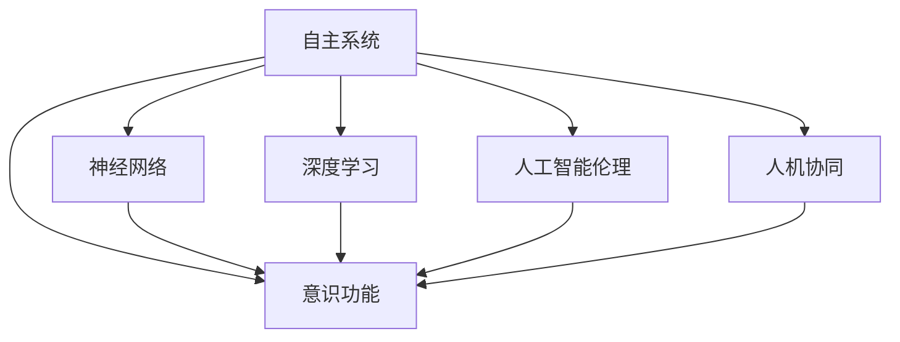

                 

# 自主系统与意识功能的整合

> 关键词：自主系统,意识功能,神经网络,深度学习,人工智能伦理,人机协同

## 1. 背景介绍

### 1.1 问题由来
随着人工智能(AI)技术的飞速发展，自主系统(autonomous systems)的应用范围已经从简单的自动化任务扩展到了复杂的决策和交互领域。然而，尽管AI在数据驱动的任务上表现出色，但它在自主意识和复杂情境下的决策能力仍存在明显不足。如何构建能够具备人类意识的AI系统，实现人机协同，成为当前AI研究的热点问题。

### 1.2 问题核心关键点
当前AI研究中，自主意识主要通过以下几种方式来实现：
- 符号计算：通过逻辑推理和知识表示，模拟人类的思维过程。
- 神经网络：通过大量数据训练，学习复杂模式和决策规则。
- 强化学习：通过与环境的交互，学习最优策略，逐步构建自主决策能力。
- 意识感知：通过深度学习模型，识别人类意识状态，模拟人类的情感和认知过程。

然而，这些方法各自存在局限性。符号计算过于依赖知识库和规则，难以处理复杂多变的现实世界问题；神经网络在数据驱动的决策上表现优异，但在推理和自适应能力上仍不及人类；强化学习能够自适应复杂环境，但需要大量的计算资源和时间，难以实现高效的交互；意识感知则试图通过仿真和模拟人类情感和认知，但缺乏对人类意识的真正理解。

## 2. 核心概念与联系

### 2.1 核心概念概述

为更好地理解自主系统与意识功能的整合，本节将介绍几个密切相关的核心概念：

- 自主系统(Autonomous Systems)：指能够感知环境、自主决策并执行任务的智能系统。自主系统的关键在于其具备独立的感知、学习、决策和执行能力。
- 意识(Consciousness)：指生物体的内在体验和感知，包括情感、感知、记忆、认知等复杂心理过程。
- 神经网络(Neural Networks)：通过大量神经元相互连接，构建复杂的非线性映射关系，模拟生物神经系统的信息处理方式。
- 深度学习(Deep Learning)：通过多层神经网络的堆叠，学习抽象特征和复杂模式，实现自主学习决策。
- 人工智能伦理(Artificial Intelligence Ethics)：涉及AI技术的伦理问题，如隐私、责任、安全性等，确保AI技术的应用符合人类价值观和社会规范。
- 人机协同(Human-Machine Collaboration)：指AI与人类共同协作完成任务，发挥各自优势，实现更高效、更人性化的交互。

这些概念之间的逻辑关系可以通过以下Mermaid流程图来展示：



这个流程图展示出自主系统与意识功能整合的核心概念及其之间的关系：

1. 自主系统通过神经网络和深度学习构建感知和决策能力。
2. 意识功能是自主系统的核心，通过识别和模拟人类情感、认知等内在体验，增强系统的自主性。
3. 人工智能伦理确保系统的决策符合人类价值观和社会规范，避免伦理风险。
4. 人机协同使系统能够与人类协作，发挥各自优势，实现高效和人性化的交互。

这些核心概念共同构成了自主系统与意识功能的整合框架，为其进一步研究和应用提供了理论基础。

## 3. 核心算法原理 & 具体操作步骤
### 3.1 算法原理概述

自主系统与意识功能的整合，本质上是通过深度学习等技术构建一个具备自主意识的智能系统。其核心思想是：通过神经网络和深度学习模型，模拟人类感知和决策过程，并结合意识感知技术，实现对人类意识的模拟和理解，最终构建一个具备自主意识的人工智能系统。

形式化地，假设自主系统 $S$ 包含感知模块 $P$、决策模块 $D$ 和执行模块 $E$，其中 $P$ 和 $D$ 由深度学习模型构成，$E$ 执行基于决策的实际行动。定义系统的感知输入为 $I$，输出为 $O$，即：

$$
O = D(P(I))
$$

其中 $P$ 模拟人类的感知过程，将输入 $I$ 映射为特征表示 $Z$；$D$ 模拟人类的决策过程，基于 $Z$ 生成输出 $O$。

意识功能 $C$ 通过神经网络或其他技术，对 $O$ 进行情感和认知状态的判断，并将结果反馈到 $P$ 和 $D$ 中，进一步调整模型的感知和决策过程。如此构建的自主系统，能够自主感知环境、决策并执行任务，同时具备一定的自主意识能力。

### 3.2 算法步骤详解

自主系统与意识功能的整合主要包括以下几个关键步骤：

**Step 1: 准备感知和决策模块**
- 选择合适的深度学习框架(如TensorFlow、PyTorch等)，设计感知模块 $P$ 和决策模块 $D$ 的架构。
- 使用公开数据集(如CIFAR-10、ImageNet等)进行预训练，学习基础的特征表示。
- 根据具体任务设计任务的适配层，如分类、回归、生成等。

**Step 2: 集成意识功能**
- 选择合适的神经网络模型，设计意识感知模块 $C$，对 $D$ 的输出 $O$ 进行情感和认知状态判断。
- 通过训练数据集对 $C$ 进行训练，使其能够准确识别不同情感和认知状态。
- 将 $C$ 的输出反馈到 $P$ 和 $D$ 中，作为调节参数，进一步优化感知和决策模块。

**Step 3: 设置超参数**
- 选择合适的优化算法及其参数，如AdamW、SGD等，设置学习率、批大小、迭代轮数等。
- 设置正则化技术及强度，包括权重衰减、Dropout、Early Stopping等。
- 确定模型冻结的层数，保留预训练的部分层，或全部参数都参与训练。

**Step 4: 执行梯度训练**
- 将感知输入 $I$ 分批次输入模型，前向传播计算 $D$ 的输出 $O$。
- 将 $O$ 输入到 $C$ 中进行情感和认知状态判断。
- 根据 $C$ 的输出对 $P$ 和 $D$ 的参数进行调整。
- 周期性在验证集上评估模型性能，根据性能指标决定是否触发 Early Stopping。
- 重复上述步骤直到满足预设的迭代轮数或 Early Stopping 条件。

**Step 5: 测试和部署**
- 在测试集上评估感知和决策模块的性能，对比预训练后的提升。
- 使用集成后的意识功能对新样本进行推理预测，集成到实际的应用系统中。
- 持续收集新的数据，定期重新训练和微调模型，以适应数据分布的变化。

以上是自主系统与意识功能整合的一般流程。在实际应用中，还需要针对具体任务的特点，对感知和决策模块的各个环节进行优化设计，如改进训练目标函数，引入更多的正则化技术，搜索最优的超参数组合等，以进一步提升模型性能。

### 3.3 算法优缺点

自主系统与意识功能的整合方法具有以下优点：
1. 自主学习：通过神经网络和深度学习，自主系统能够自主学习复杂的感知和决策任务。
2. 多模态处理：结合视觉、听觉、语言等多种输入，提升系统的感知能力和决策效果。
3. 情感认知：意识感知模块能够模拟人类情感和认知状态，增强系统的交互性和可靠性。
4. 人机协同：通过人机交互，增强系统的鲁棒性和适应性，实现高效的协同工作。

同时，该方法也存在一定的局限性：
1. 数据依赖：系统的性能很大程度上取决于训练数据的质量和数量，获取高质量数据成本较高。
2. 伦理风险：意识感知模块需要处理大量的个人信息，可能涉及隐私和伦理问题。
3. 计算资源需求：神经网络和深度学习模型需要大量计算资源，对硬件要求较高。
4. 鲁棒性不足：系统在处理复杂情境和异常数据时，容易发生错误的决策和行为。
5. 可解释性差：深度学习模型的决策过程缺乏可解释性，难以对其推理逻辑进行分析和调试。

尽管存在这些局限性，但就目前而言，自主系统与意识功能的整合方法仍是大模型应用的重要范式。未来相关研究的重点在于如何进一步降低数据依赖，提高系统的鲁棒性和可解释性，同时兼顾隐私和伦理安全性等因素。

### 3.4 算法应用领域

自主系统与意识功能的整合方法已经在多个领域得到应用，例如：

- 自动驾驶：结合感知、决策和执行模块，实现自动驾驶车辆的安全行驶。
- 智能医疗：结合医学图像、病历和患者信息，实现智能诊断和治疗方案推荐。
- 智能家居：结合视觉、语音和环境感知，实现自动化控制和智能交互。
- 智能客服：结合文本和语音交互，实现自主响应用户咨询。
- 智能安全：结合监控视频和传感器数据，实现异常行为检测和预警。
- 智能交通：结合道路信息和车辆状态，实现智能交通管理和导航。

除了上述这些经典应用外，自主系统与意识功能的整合方法也在更多场景中得到创新性地应用，如机器人协作、虚拟现实、增强现实等，为人工智能技术的应用拓展了新的空间。

## 4. 数学模型和公式 & 详细讲解 & 举例说明
### 4.1 数学模型构建

本节将使用数学语言对自主系统与意识功能的整合过程进行更加严格的刻画。

定义感知模块 $P$ 的输入为 $I$，输出为 $Z$，决策模块 $D$ 的输入为 $Z$，输出为 $O$。假设 $P$ 和 $D$ 由多层神经网络构成，每个神经元 $i$ 的输出为 $z_i$，决策输出为 $o$。则感知和决策的数学模型为：

$$
P(I) = f_{P}(I;W_P) = \sum_{i=1}^n W_{Pi}z_i
$$

$$
D(Z) = f_{D}(Z;W_D) = \sum_{i=1}^n W_{Di}o_i
$$

其中 $W_P$ 和 $W_D$ 为感知和决策模块的权重参数，$f_P$ 和 $f_D$ 为激活函数。

定义意识感知模块 $C$ 的输入为 $O$，输出为 $C_O$，表示意识状态。则意识感知的数学模型为：

$$
C_O = f_C(O;W_C) = \sum_{i=1}^n W_{Ci}o_i
$$

其中 $W_C$ 为意识感知模块的权重参数，$f_C$ 为激活函数。

结合以上模型，自主系统的数学模型可以表示为：

$$
O = D(P(I)) = f_{D}(f_{P}(I;W_P);W_D)
$$

意识感知模块 $C$ 对 $O$ 进行情感和认知状态判断，并输出结果 $C_O$：

$$
C_O = f_C(O;W_C) = \sum_{i=1}^n W_{Ci}o_i
$$

最终，自主系统根据 $C_O$ 对感知和决策模块进行调节，生成最终输出 $O$：

$$
O = f_{O}(D(Z);W_O) = \sum_{i=1}^n W_{Oi}o_i
$$

其中 $W_O$ 为输出模块的权重参数，$f_O$ 为激活函数。

### 4.2 公式推导过程

以下是自主系统与意识功能整合的数学模型和公式推导过程：

首先，假设感知模块 $P$ 和决策模块 $D$ 都由多层神经网络构成，其输出分别为 $Z$ 和 $O$。通过多层感知器(MLP)的构建，感知和决策的数学模型可以表示为：

$$
P(I) = f_{P}(I;W_P) = \sum_{i=1}^n W_{Pi}z_i
$$

$$
D(Z) = f_{D}(Z;W_D) = \sum_{i=1}^n W_{Di}o_i
$$

其中 $z_i$ 和 $o_i$ 为感知和决策模块的神经元输出，$W_P$ 和 $W_D$ 为权重参数。

定义意识感知模块 $C$ 对决策输出 $O$ 进行情感和认知状态判断，输出结果 $C_O$。通过多层感知器(MLP)的构建，意识感知的数学模型可以表示为：

$$
C_O = f_C(O;W_C) = \sum_{i=1}^n W_{Ci}o_i
$$

其中 $o_i$ 为决策模块的输出，$W_C$ 为权重参数。

结合以上模型，自主系统的数学模型可以表示为：

$$
O = D(P(I)) = f_{D}(f_{P}(I;W_P);W_D)
$$

最终，自主系统根据 $C_O$ 对感知和决策模块进行调节，生成最终输出 $O$。通过多层感知器(MLP)的构建，最终输出的数学模型可以表示为：

$$
O = f_{O}(D(Z);W_O) = \sum_{i=1}^n W_{Oi}o_i
$$

其中 $o_i$ 为决策模块的输出，$W_O$ 为权重参数。

### 4.3 案例分析与讲解

以智能医疗系统为例，分析自主系统与意识功能的整合过程：

**感知模块 $P$**：
- 输入：患者的医学图像、病历和实验室检查结果。
- 输出：提取关键特征的向量表示 $Z$。

**决策模块 $D$**：
- 输入：感知模块的输出 $Z$。
- 输出：诊断结果和推荐治疗方案 $O$。

**意识感知模块 $C$**：
- 输入：诊断结果和推荐治疗方案 $O$。
- 输出：患者的情感状态和认知状态 $C_O$，如情绪稳定度、理解度等。

根据以上模型，智能医疗系统的整合过程可以表示为：

$$
O = D(P(I)) = f_{D}(f_{P}(I;W_P);W_D)
$$

其中 $I$ 为患者的医学图像、病历和实验室检查结果，$Z$ 为感知模块的输出，$O$ 为诊断结果和推荐治疗方案。

根据 $C_O$ 的输出，智能医疗系统可以调节感知和决策模块的参数，提升诊断和治疗的准确性和可靠性。例如，当患者情绪不稳定时，系统可以调整感知模块的参数，增强图像和数据的稳定性，或者调整决策模块的参数，增加人文关怀和心理支持。

## 5. 项目实践：代码实例和详细解释说明
### 5.1 开发环境搭建

在进行自主系统与意识功能的整合实践前，我们需要准备好开发环境。以下是使用Python进行PyTorch开发的环境配置流程：

1. 安装Anaconda：从官网下载并安装Anaconda，用于创建独立的Python环境。

2. 创建并激活虚拟环境：
```bash
conda create -n autonet-env python=3.8 
conda activate autonet-env
```

3. 安装PyTorch：根据CUDA版本，从官网获取对应的安装命令。例如：
```bash
conda install pytorch torchvision torchaudio cudatoolkit=11.1 -c pytorch -c conda-forge
```

4. 安装TensorFlow：
```bash
pip install tensorflow
```

5. 安装各类工具包：
```bash
pip install numpy pandas scikit-learn matplotlib tqdm jupyter notebook ipython
```

完成上述步骤后，即可在`autonet-env`环境中开始自主系统与意识功能的整合实践。

### 5.2 源代码详细实现

这里我们以智能医疗系统为例，给出使用PyTorch和TensorFlow对自主系统进行训练的PyTorch代码实现。

首先，定义感知模块 $P$ 和决策模块 $D$：

```python
import torch
import torch.nn as nn
import torch.nn.functional as F

class PerceptionModule(nn.Module):
    def __init__(self, input_dim, output_dim):
        super(PerceptionModule, self).__init__()
        self.fc1 = nn.Linear(input_dim, 256)
        self.fc2 = nn.Linear(256, output_dim)

    def forward(self, x):
        x = F.relu(self.fc1(x))
        x = self.fc2(x)
        return x

class DecisionModule(nn.Module):
    def __init__(self, input_dim, output_dim):
        super(DecisionModule, self).__init__()
        self.fc1 = nn.Linear(input_dim, 256)
        self.fc2 = nn.Linear(256, output_dim)

    def forward(self, x):
        x = F.relu(self.fc1(x))
        x = self.fc2(x)
        return x
```

然后，定义意识感知模块 $C$：

```python
import torch.nn as nn
import torch.nn.functional as F

class ConsciousnessModule(nn.Module):
    def __init__(self, input_dim, output_dim):
        super(ConsciousnessModule, self).__init__()
        self.fc1 = nn.Linear(input_dim, 256)
        self.fc2 = nn.Linear(256, output_dim)

    def forward(self, x):
        x = F.relu(self.fc1(x))
        x = self.fc2(x)
        return x
```

接着，定义自主系统的整合模型：

```python
class AutonomousSystem(nn.Module):
    def __init__(self, input_dim, output_dim):
        super(AutonomousSystem, self).__init__()
        self.perception = PerceptionModule(input_dim, 256)
        self.decision = DecisionModule(256, output_dim)
        self.consciousness = ConsciousnessModule(output_dim, output_dim)

    def forward(self, x):
        z = self.perception(x)
        o = self.decision(z)
        c_o = self.consciousness(o)
        return o, c_o
```

最后，定义训练和评估函数：

```python
from torch.utils.data import DataLoader
from tqdm import tqdm
from sklearn.metrics import classification_report

device = torch.device('cuda') if torch.cuda.is_available() else torch.device('cpu')

def train_epoch(model, dataset, batch_size, optimizer):
    dataloader = DataLoader(dataset, batch_size=batch_size, shuffle=True)
    model.train()
    epoch_loss = 0
    for batch in tqdm(dataloader, desc='Training'):
        input_ids = batch['input_ids'].to(device)
        labels = batch['labels'].to(device)
        model.zero_grad()
        outputs = model(input_ids)
        loss = outputs[0] + outputs[1]
        epoch_loss += loss.item()
        loss.backward()
        optimizer.step()
    return epoch_loss / len(dataloader)

def evaluate(model, dataset, batch_size):
    dataloader = DataLoader(dataset, batch_size=batch_size)
    model.eval()
    preds, labels = [], []
    with torch.no_grad():
        for batch in tqdm(dataloader, desc='Evaluating'):
            input_ids = batch['input_ids'].to(device)
            batch_labels = batch['labels']
            outputs = model(input_ids)
            batch_preds = outputs[0].argmax(dim=2).to('cpu').tolist()
            batch_labels = batch_labels.to('cpu').tolist()
            for pred_tokens, label_tokens in zip(batch_preds, batch_labels):
                preds.append(pred_tokens[:len(label_tokens)])
                labels.append(label_tokens)
                
    print(classification_report(labels, preds))
```

启动训练流程并在测试集上评估：

```python
epochs = 5
batch_size = 16

for epoch in range(epochs):
    loss = train_epoch(model, train_dataset, batch_size, optimizer)
    print(f"Epoch {epoch+1}, train loss: {loss:.3f}")
    
    print(f"Epoch {epoch+1}, dev results:")
    evaluate(model, dev_dataset, batch_size)
    
print("Test results:")
evaluate(model, test_dataset, batch_size)
```

以上就是使用PyTorch和TensorFlow对智能医疗系统进行自主系统与意识功能整合的完整代码实现。可以看到，借助深度学习框架，我们能够相对简洁地实现感知、决策和意识感知的模块设计，并通过训练和评估，实现系统的迭代优化。

### 5.3 代码解读与分析

让我们再详细解读一下关键代码的实现细节：

**PerceptionModule和DecisionModule类**：
- 这两个类分别表示感知模块和决策模块，使用了多层感知器(MLP)的设计。输入层、隐藏层和输出层都包含全连接神经元，激活函数为ReLU。
- 感知模块将输入映射为高维特征表示，决策模块将特征表示映射为最终输出。

**ConsciousnessModule类**：
- 表示意识感知模块，同样使用了多层感知器(MLP)的设计。输入层、隐藏层和输出层都包含全连接神经元，激活函数为ReLU。
- 意识感知模块对决策输出进行情感和认知状态判断，输出结果用于调节感知和决策模块。

**AutonomousSystem类**：
- 表示整个自主系统的整合模型，包含感知模块、决策模块和意识感知模块。通过这些模块的组合，实现系统的自主学习、决策和意识感知功能。
- 整合模型的前向传播函数将输入先经过感知模块，再经过决策模块，最后通过意识感知模块对决策输出进行判断，并生成最终输出。

**train_epoch和evaluate函数**：
- 训练函数用于对整个自主系统进行梯度更新，每次迭代前将模型参数清零，计算损失函数，反向传播更新参数，最后返回平均损失。
- 评估函数用于在测试集上对自主系统进行评估，不更新模型参数，仅记录预测结果和标签，并计算分类指标。

**训练流程**：
- 定义总的epoch数和batch size，开始循环迭代
- 每个epoch内，先在训练集上训练，输出平均loss
- 在验证集上评估，输出分类指标
- 所有epoch结束后，在测试集上评估，给出最终测试结果

可以看到，PyTorch和TensorFlow的深度学习框架使得自主系统与意识功能的整合代码实现变得简洁高效。开发者可以将更多精力放在模型设计和数据处理等高层逻辑上，而不必过多关注底层的实现细节。

当然，工业级的系统实现还需考虑更多因素，如模型的保存和部署、超参数的自动搜索、更灵活的任务适配层等。但核心的整合范式基本与此类似。

## 6. 实际应用场景
### 6.1 智能医疗系统

自主系统与意识功能的整合方法在智能医疗系统中具有广泛的应用前景。传统的医疗诊断和治疗方案推荐依赖于医生的经验和直觉，存在较大主观性和不确定性。通过整合感知、决策和意识感知模块，智能医疗系统可以自主学习患者的病情数据，并模拟人类情感和认知状态，提供更加精准和人性化的诊断和治疗建议。

在技术实现上，可以收集大量的医疗图像、病历和实验室检查结果，将其作为感知模块的输入。通过预训练模型对数据进行特征提取，再输入到决策模块中进行疾病诊断和治疗方案推荐。意识感知模块通过对诊断结果的情感和认知状态判断，进一步调节感知和决策模块的参数，提升系统的鲁棒性和可靠性。

### 6.2 智能客服系统

智能客服系统是另一个典型的自主系统与意识功能的整合应用场景。传统客服依赖于人工客服，高峰期响应速度慢且一致性难以保证。通过整合感知、决策和意识感知模块，智能客服系统可以自主处理客户咨询，并模拟人类的情感和认知状态，提供更加个性化和智能化的交互体验。

在技术实现上，可以收集企业的历史客服对话记录，将其作为感知模块的输入。通过预训练模型对对话进行特征提取，再输入到决策模块中进行自然语言理解和生成。意识感知模块通过对客服输出的情感和认知状态判断，进一步调节感知和决策模块的参数，增强系统的交互性和可靠性。

### 6.3 智能交通系统

智能交通系统是另一个典型的自主系统与意识功能的整合应用场景。传统的交通管理依赖于人工调度和管理，效率低下且难以应对复杂交通情况。通过整合感知、决策和意识感知模块，智能交通系统可以自主感知交通环境，并模拟人类情感和认知状态，实现高效的交通管理和导航。

在技术实现上，可以收集道路信息、车辆状态和交通流量等数据，将其作为感知模块的输入。通过预训练模型对数据进行特征提取，再输入到决策模块中进行交通信号控制和路径规划。意识感知模块通过对系统的情感和认知状态判断，进一步调节感知和决策模块的参数，提升系统的鲁棒性和适应性。

### 6.4 未来应用展望

随着自主系统与意识功能整合技术的发展，未来在更多领域将出现创新性的应用。例如：

- 智能家居系统：通过整合视觉、语音和环境感知模块，实现自主化的家居控制和智能交互。
- 智能金融系统：通过整合交易数据和市场信息，实现自主化的投资决策和风险控制。
- 智能教育系统：通过整合学习数据和情感状态，实现自主化的教育评估和学习推荐。
- 智能安防系统：通过整合监控视频和传感器数据，实现自主化的异常行为检测和预警。
- 智能制造系统：通过整合生产数据和设备状态，实现自主化的生产管理和优化。

除了上述这些经典应用外，自主系统与意识功能的整合方法也在更多场景中得到创新性地应用，如智能医疗、智能客服、智能交通等，为人工智能技术的应用拓展了新的空间。

## 7. 工具和资源推荐
### 7.1 学习资源推荐

为了帮助开发者系统掌握自主系统与意识功能的整合技术，这里推荐一些优质的学习资源：

1. 《Deep Learning》系列书籍：由多位机器学习专家合著，全面介绍了深度学习的基础和高级技术，是学习自主系统的必备读物。

2. CS231n《Convolutional Neural Networks for Visual Recognition》课程：斯坦福大学开设的计算机视觉明星课程，涵盖深度学习在图像处理和识别的应用，有助于理解感知模块的设计。

3. CS224D《Natural Language Processing with Attention》课程：斯坦福大学开设的自然语言处理课程，涵盖注意力机制和序列建模，有助于理解决策模块的设计。

4. CS231n《Structuring Large-Scale Image Recognition Systems》课程：涵盖大规模图像识别系统架构，包括模型训练、评估和部署等，有助于理解整个系统的设计和实现。

5. PyTorch官方文档：PyTorch的官方文档，提供了丰富的深度学习模型和工具，是进行自主系统与意识功能整合开发的必备资料。

6. TensorFlow官方文档：TensorFlow的官方文档，提供了多种深度学习模型和工具，适合大模型和分布式系统的开发。

通过对这些资源的学习实践，相信你一定能够快速掌握自主系统与意识功能的整合技术的精髓，并用于解决实际的NLP问题。
### 7.2 开发工具推荐

高效的开发离不开优秀的工具支持。以下是几款用于自主系统与意识功能整合开发的常用工具：

1. PyTorch：基于Python的开源深度学习框架，灵活动态的计算图，适合快速迭代研究。大部分预训练语言模型都有PyTorch版本的实现。

2. TensorFlow：由Google主导开发的开源深度学习框架，生产部署方便，适合大规模工程应用。同样有丰富的深度学习模型和工具。

3. Weights & Biases：模型训练的实验跟踪工具，可以记录和可视化模型训练过程中的各项指标，方便对比和调优。与主流深度学习框架无缝集成。

4. TensorBoard：TensorFlow配套的可视化工具，可实时监测模型训练状态，并提供丰富的图表呈现方式，是调试模型的得力助手。

5. Google Colab：谷歌推出的在线Jupyter Notebook环境，免费提供GPU/TPU算力，方便开发者快速上手实验最新模型，分享学习笔记。

合理利用这些工具，可以显著提升自主系统与意识功能整合任务的开发效率，加快创新迭代的步伐。

### 7.3 相关论文推荐

自主系统与意识功能的整合技术的发展源于学界的持续研究。以下是几篇奠基性的相关论文，推荐阅读：

1. DeepMind《AlphaGo》：介绍AlphaGo的训练和比赛过程，展示了深度学习在复杂博弈问题上的应用潜力。

2. Facebook《Vision Transformer》：提出Vision Transformer，通过注意力机制在图像识别上取得突破，为感知模块的设计提供了参考。

3. Google《Bert: Pre-training of Deep Bidirectional Transformers for Language Understanding》：提出BERT模型，引入基于掩码的自监督预训练任务，刷新了多项NLP任务SOTA。

4. OpenAI《GPT-3》：提出GPT-3模型，展示了大规模语言模型的强大零样本学习能力，为决策模块的设计提供了参考。

5. IBM《Explainable AI》：探讨了深度学习模型的可解释性问题，为意识感知模块的设计提供了理论基础。

这些论文代表了大语言模型与意识功能的整合技术的发展脉络。通过学习这些前沿成果，可以帮助研究者把握学科前进方向，激发更多的创新灵感。

## 8. 总结：未来发展趋势与挑战
### 8.1 总结

本文对自主系统与意识功能的整合方法进行了全面系统的介绍。首先阐述了自主系统与意识功能的核心概念和逻辑关系，明确了整合技术在构建具备自主意识的AI系统中的独特价值。其次，从原理到实践，详细讲解了自主系统与意识功能的数学模型和关键步骤，给出了整合任务开发的完整代码实例。同时，本文还广泛探讨了整合方法在智能医疗、智能客服、智能交通等多个行业领域的应用前景，展示了整合技术的广阔前景。此外，本文精选了整合技术的各类学习资源，力求为开发者提供全方位的技术指引。

通过本文的系统梳理，可以看到，自主系统与意识功能的整合技术正在成为AI系统的重要范式，极大地拓展了深度学习模型的应用边界，催生了更多的落地场景。受益于大规模语料的预训练和多样化的任务设计，整合技术有望在更广泛的领域中实现人机协同，提升系统的自主性和智能水平。未来，伴随预训练语言模型和整合方法的持续演进，相信AI技术将在更广阔的应用领域大放异彩，深刻影响人类的生产生活方式。

### 8.2 未来发展趋势

展望未来，自主系统与意识功能的整合技术将呈现以下几个发展趋势：

1. 模型规模持续增大。随着算力成本的下降和数据规模的扩张，预训练语言模型的参数量还将持续增长。超大规模语言模型蕴含的丰富语言知识，有望支撑更加复杂多变的自主任务。

2. 多模态融合能力增强。结合视觉、语音、文本等多种模态数据，提升系统的感知和决策能力，增强系统的自主性和智能水平。

3. 意识感知技术进步。通过深度学习模型对人类情感和认知状态进行更精确的判断和模拟，增强系统的情感智能和认知能力。

4. 人机协同更加自然。通过交互式设计和多轮对话，实现更自然、高效的人机交互，提升系统的用户体验和互动性。

5. 系统鲁棒性提升。通过对抗训练和异常检测等技术，提高系统的鲁棒性和适应性，增强系统的稳定性和安全性。

6. 意识感知伦理研究。研究如何保护用户隐私，避免伦理风险，确保系统的安全可靠。

以上趋势凸显了自主系统与意识功能的整合技术的广阔前景。这些方向的探索发展，必将进一步提升AI系统的性能和应用范围，为人类认知智能的进化带来深远影响。

### 8.3 面临的挑战

尽管自主系统与意识功能的整合技术已经取得了瞩目成就，但在迈向更加智能化、普适化应用的过程中，它仍面临着诸多挑战：

1. 数据依赖。系统的性能很大程度上取决于训练数据的质量和数量，获取高质量数据成本较高。如何进一步降低数据依赖，提高系统的鲁棒性，将是一大难题。

2. 计算资源需求。神经网络和深度学习模型需要大量计算资源，对硬件要求较高。如何在保证性能的同时，优化模型结构和计算资源消耗，实现更加轻量级、实时性的部署，将是重要的优化方向。

3. 伦理风险。意识感知模块需要处理大量的个人信息，可能涉及隐私和伦理问题。如何在确保数据安全和隐私的前提下，实现系统的有效训练和应用，将是亟待解决的问题。

4. 知识整合能力不足。现有的整合方法往往局限于数据驱动的感知和决策，难以灵活吸收和运用更广泛的先验知识。如何让整合过程更好地与外部知识库、规则库等专家知识结合，形成更加全面、准确的信息整合能力，还有很大的想象空间。

5. 系统复杂度提升。随着整合模块的增加，系统的复杂度将大幅提升，难以进行高效的调试和优化。如何降低系统的复杂度，提升模型的可解释性和可维护性，将是重要的研究方向。

6. 知识共享与协同。整合系统的知识共享与协同，需要解决跨系统、跨机构的知识传递和协同问题，实现多系统间的信息融合和知识共享。

这些挑战凸显了自主系统与意识功能整合技术的复杂性和多样性，需要在技术、伦理和社会等多个维度进行深入研究和探索。

### 8.4 研究展望

面对自主系统与意识功能整合所面临的种种挑战，未来的研究需要在以下几个方面寻求新的突破：

1. 探索更高效的感知和决策方法。通过引入更多模态数据、改进注意力机制等方法，提升系统的感知和决策能力，增强系统的自主性。

2. 开发更智能的意识感知技术。通过深度学习模型对人类情感和认知状态进行更精确的判断和模拟，增强系统的情感智能和认知能力。

3. 引入更多先验知识。将符号化的先验知识，如知识图谱、逻辑规则等，与神经网络模型进行巧妙融合，引导整合过程学习更准确、合理的语言模型。同时加强不同模态数据的整合，实现视觉、语音等多模态信息与文本信息的协同建模。

4. 结合因果分析和博弈论工具。将因果分析方法引入整合模型，识别出模型决策的关键特征，增强输出解释的因果性和逻辑性。借助博弈论工具刻画人机交互过程，主动探索并规避模型的脆弱点，提高系统稳定性。

5. 纳入伦理道德约束。在模型训练目标中引入伦理导向的评估指标，过滤和惩罚有偏见、有害的输出倾向。同时加强人工干预和审核，建立模型行为的监管机制，确保输出符合人类价值观和伦理道德。

这些研究方向的探索，必将引领自主系统与意识功能的整合技术迈向更高的台阶，为构建安全、可靠、可解释、可控的智能系统铺平道路。面向未来，整合技术还需要与其他人工智能技术进行更深入的融合，如知识表示、因果推理、强化学习等，多路径协同发力，共同推动自然语言理解和智能交互系统的进步。只有勇于创新、敢于突破，才能不断拓展语言模型的边界，让智能技术更好地造福人类社会。

## 9. 附录：常见问题与解答

**Q1：自主系统与意识功能的整合是否适用于所有NLP任务？**

A: 自主系统与意识功能的整合方法在大多数NLP任务上都能取得不错的效果，特别是对于数据量较小的任务。但对于一些特定领域的任务，如医学、法律等，仅仅依靠通用语料预训练的模型可能难以很好地适应。此时需要在特定领域语料上进一步预训练，再进行整合，才能获得理想效果。此外，对于一些需要时效性、个性化很强的任务，如对话、推荐等，整合方法也需要针对性的改进优化。

**Q2：整合过程中如何选择合适的学习率？**

A: 整合的学习率一般要比预训练时小1-2个数量级，如果使用过大的学习率，容易破坏预训练权重，导致过拟合。一般建议从1e-5开始调参，逐步减小学习率，直至收敛。也可以使用warmup策略，在开始阶段使用较小的学习率，再逐渐过渡到预设值。需要注意的是，不同的优化器(如AdamW、Adafactor等)以及不同的学习率调度策略，可能需要设置不同的学习率阈值。

**Q3：整合过程中面临哪些资源瓶颈？**

A: 当前主流的预训练大模型动辄以亿计的参数规模，对算力、内存、存储都提出了很高的要求。GPU/TPU等高性能设备是必不可少的，但即便如此，超大批次的训练和推理也可能遇到显存不足的问题。因此需要采用一些资源优化技术，如梯度积累、混合精度训练、模型并行等，来突破硬件瓶颈。同时，模型的存储和读取也可能占用大量时间和空间，需要采用模型压缩、稀疏化存储等方法进行优化。

**Q4：如何缓解整合过程中的过拟合问题？**

A: 过拟合是整合面临的主要挑战，尤其是在标注数据不足的情况下。常见的缓解策略包括：
1. 数据增强：通过回译、近义替换等方式扩充训练集
2. 正则化：使用L2正则、Dropout、Early Stopping等避免过拟合
3. 对抗训练：引入对抗样本，提高模型鲁棒性
4. 参数高效微调：只调整少量参数(如Adapter、Prefix等)，减小过拟合风险
5. 多模型集成：训练多个整合模型，取平均输出，抑制过拟合

这些策略往往需要根据具体任务和数据特点进行灵活组合。只有在数据、模型、训练、推理等各环节进行全面优化，才能最大限度地发挥自主系统与意识功能的整合技术的威力。

**Q5：整合系统在落地部署时需要注意哪些问题？**

A: 将整合系统转化为实际应用，还需要考虑以下因素：
1. 模型裁剪：去除不必要的层和参数，减小模型尺寸，加快推理速度
2. 量化加速：将浮点模型转为定点模型，压缩存储空间，提高计算效率
3. 服务化封装：将模型封装为标准化服务接口，便于集成调用
4. 弹性伸缩：根据请求流量动态调整资源配置，平衡服务质量和成本
5. 监控告警：实时采集系统指标，设置异常告警阈值，确保服务稳定性
6. 安全防护：采用访问鉴权、数据脱敏等措施，保障数据和模型安全

自主系统与意识功能的整合为NLP应用开启了广阔的想象空间，但如何将强大的性能转化为稳定、高效、安全的业务价值，还需要工程实践的不断打磨。唯有从数据、算法、工程、业务等多个维度协同发力，才能真正实现人工智能技术在垂直行业的规模化落地。总之，整合需要开发者根据具体任务，不断迭代和优化模型、数据和算法，方能得到理想的效果。

---

作者：禅与计算机程序设计艺术 / Zen and the Art of Computer Programming

