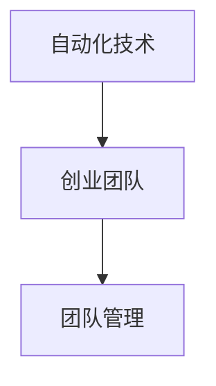

                 

# 自动化创业中的团队管理策略

## 1. 背景介绍

在科技日新月异的今天，自动化技术已经成为推动各行各业创新的重要力量。尤其是在创业领域，自动化的引入可以大幅提高工作效率，降低成本，加速产品迭代，提升企业竞争力。然而，如何高效地管理一个自动化创业团队，充分发挥技术创新的潜能，是每个企业面临的共同挑战。本文将深入探讨自动化创业中的团队管理策略，通过理论联系实践，为创业企业提供系统化、可操作的指导。

## 2. 核心概念与联系

### 2.1 核心概念概述

为更好地理解自动化创业团队的管理策略，本节将介绍几个关键概念：

- **自动化技术**：指利用计算机程序来模拟、扩展或替代人工操作的技术。自动化技术覆盖面广，包括生产自动化、办公自动化、服务自动化等诸多领域。

- **创业团队**：指一群充满激情和创新能力，共同创立企业、追求目标的个体。一个成功的创业团队应具备明确的目标、协作的精神、高效的管理。

- **团队管理**：指对团队成员进行有效组织、协调和指导，以达成共同目标的过程。管理策略包括人员选拔、角色分配、绩效考核、激励机制等。

- **自动化创业**：指在创业过程中，充分利用自动化技术，降低人力成本，提高效率和准确性，加速产品迭代和市场响应速度。

这些概念之间的逻辑关系可以通过以下Mermaid流程图来展示：



这个流程图展示了一个基本的逻辑框架：首先，通过自动化技术提升工作效率和质量，进而使创业团队能够专注于创新和市场拓展。与此同时，高效的管理策略可以确保团队成员充分发挥潜力，实现团队目标。

## 3. 核心算法原理 & 具体操作步骤
### 3.1 算法原理概述

自动化创业中的团队管理策略，其核心思想是通过高效的组织和协调，激发团队成员的创新能力，推动产品从创意到市场的过程。核心算法原理主要包括：

- **任务分解与分配**：将大任务拆解为多个小任务，合理分配给不同成员，确保每个成员都能专注于自身擅长的领域。
- **绩效评估与反馈**：通过定量和定性的方式，评估团队成员的工作表现，提供及时反馈，激励成员持续改进。
- **沟通与协作机制**：建立有效的沟通渠道，促进信息共享和团队合作，避免信息孤岛和重复劳动。
- **技术驱动与管理协同**：利用自动化工具，如项目管理软件、协作平台等，优化管理流程，提高效率。

### 3.2 算法步骤详解

以下是基于上述原理的自动化创业团队管理操作步骤：

1. **初始化阶段**：
   - 制定团队目标和战略规划，明确创业方向和目标。
   - 组建核心团队，确保团队成员具备必要的技能和经验。
   - 配置必要的自动化工具，如项目管理软件、协作平台等。

2. **任务分解与分配**：
   - 将大任务拆解为具体、可执行的小任务。
   - 根据成员技能和兴趣，合理分配任务，确保人人有事做。
   - 确定任务优先级和完成时间，制定详细的项目计划。

3. **绩效评估与反馈**：
   - 设定明确的绩效指标，如任务完成度、质量标准、创新成果等。
   - 定期进行绩效评估，采用自评和互评相结合的方式。
   - 提供即时反馈，肯定成绩，指出不足，鼓励改进。

4. **沟通与协作机制**：
   - 建立高效的沟通渠道，如定期的项目会议、日报等。
   - 鼓励开放、透明的沟通文化，促进信息共享。
   - 使用协作工具，如GitHub、Slack等，协同工作，减少误解和重复劳动。

5. **技术驱动与管理协同**：
   - 利用自动化工具，如JIRA、Trello等，进行任务跟踪和进度管理。
   - 集成CI/CD工具，如Jenkins、GitLab CI等，自动化测试、部署和发布流程。
   - 引入数据分析工具，如Google Analytics、Tableau等，实时监控项目进展和团队表现。

### 3.3 算法优缺点

自动化创业团队管理策略具有以下优点：

- **效率提升**：自动化流程和工具大大提高了项目管理、任务执行和沟通协作的效率，缩短了产品开发周期。
- **质量保障**：严格的绩效评估和即时反馈机制，确保了项目质量和工作标准。
- **创新激发**：透明的沟通文化和有效的协作机制，促进了团队成员的创造性和创新能力。

同时，该策略也存在一些局限性：

- **依赖自动化工具**：过度依赖自动化工具可能忽视了人性和团队协作的复杂性，导致团队成员的沟通和情感联结减弱。
- **管理复杂性**：虽然自动化提升了效率，但管理策略也需要持续优化和调整，增加了管理复杂性。
- **灵活性不足**：固定的任务分配和绩效评估机制，可能在面对突发情况时显得不够灵活，无法迅速调整策略。

尽管存在这些局限性，但就目前而言，基于自动化技术的管理策略仍是提升创业团队效率和创新能力的重要手段。

### 3.4 算法应用领域

基于自动化技术的管理策略，在多个领域得到了广泛的应用：

- **软件开发**：在敏捷开发、DevOps等模式下，自动化工具和流程管理极大地提升了代码质量、交付速度和团队协作效率。
- **智能制造**：通过自动化设备和数据分析，优化生产流程，提高生产效率和产品质量，降低人力成本。
- **客服自动化**：利用聊天机器人、自动化流程，提升客户服务效率，降低人力成本，改善客户体验。
- **市场营销**：自动化分析工具和营销自动化平台，帮助企业精准定位目标客户，提升营销效果。

以上领域展示了自动化技术在提升企业效率和创新能力方面的巨大潜力。通过合理应用自动化管理策略，这些领域的企业可以更好地适应市场变化，实现可持续发展。

## 4. 数学模型和公式 & 详细讲解  
### 4.1 数学模型构建

本节将使用数学语言对自动化创业团队管理策略进行更加严格的刻画。

假设一个自动化创业团队包含 $n$ 个成员，每个成员的工作效率为 $e_i$，工作质量为 $q_i$，团队的任务完成时间为 $t$，团队的目标为 $G$。

定义任务完成度 $P$ 和团队绩效 $E$ 分别为：

$$
P = \sum_{i=1}^{n} q_i
$$

$$
E = \sum_{i=1}^{n} e_i \cdot q_i
$$

则任务完成时间 $t$ 可以表示为：

$$
t = \frac{P}{\sum_{i=1}^{n} e_i}
$$

同时，团队目标 $G$ 可以表示为：

$$
G = E \cdot t
$$

在实际操作中，我们可以通过对团队成员的工作效率和质量进行评估，调整任务分配，优化管理策略，从而最小化任务完成时间，最大化团队绩效。

### 4.2 公式推导过程

以下我们以软件开发项目为例，推导任务完成时间与任务分解的关系。

假设一个软件开发项目包含 $m$ 个模块，每个模块的工作量为 $w_j$，每个模块的自动化测试时间为 $t_j$，人工测试时间为 $t_{j, man}$。则任务完成时间为：

$$
t = \sum_{j=1}^{m} t_j + \sum_{j=1}^{m} t_{j, man}
$$

对于每个模块 $j$，其工作量为 $w_j = \sum_{i=1}^{n} (e_i \cdot t_{i, j})$，其中 $t_{i, j}$ 表示成员 $i$ 在模块 $j$ 上的工作时间。

通过对模块工作量的加和，可以计算出整个项目的工作量：

$$
W = \sum_{j=1}^{m} w_j
$$

因此，任务完成时间 $t$ 可以表示为：

$$
t = \frac{W}{\sum_{i=1}^{n} e_i}
$$

通过最小化任务完成时间，即最小化 $t$，可以优化项目管理策略，提升团队效率。

### 4.3 案例分析与讲解

考虑一个软件开发团队，成员 $A$、$B$ 和 $C$ 分别负责不同模块，其工作效率分别为 $e_A=0.8$、$e_B=0.7$、$e_C=0.9$，模块 $1$ 和 $2$ 的自动化测试时间分别为 $t_{1, auto}=2h$、$t_{2, auto}=3h$，人工测试时间分别为 $t_{1, man}=3h$、$t_{2, man}=4h$。

假设模块 $1$ 和 $2$ 的工作量分别为 $w_1=20h$、$w_2=15h$，则任务完成时间为：

$$
t = \frac{w_1}{\sum_{i=1}^{3} e_i} + \frac{w_2}{\sum_{i=1}^{3} e_i} = \frac{20}{0.8+0.7+0.9} + \frac{15}{0.8+0.7+0.9} = 12.5h
$$

可以看出，合理分配任务和优化测试流程，可以有效缩短任务完成时间，提高团队绩效。

## 5. 项目实践：代码实例和详细解释说明
### 5.1 开发环境搭建

在进行团队管理实践前，我们需要准备好开发环境。以下是使用Python进行JIRA和Trello集成的开发环境配置流程：

1. 安装JIRA API库：
```bash
pip install jira
```

2. 安装Trello API库：
```bash
pip install trello
```

3. 配置JIRA API和Trello API：
```python
from jira import JIRA
from trello import Trello

jira = JIRA('https://your-jira-api-url', username='your-jira-username', password='your-jira-password')
trello = Trello('your-trello-api-key')
```

### 5.2 源代码详细实现

下面我们以软件开发项目为例，给出使用JIRA和Trello集成的团队管理代码实现。

```python
import jira
import trello

def fetch_jira_issues(jira_obj, project_key):
    jira_issues = jira_obj.search_jql('project={}'.format(project_key))
    return jira_issues

def create_trello_board(board_name):
    board = trello.create_board(board_name)
    return board

def move_trello_cards(trello_obj, board_id, from_list_name, to_list_name, card_ids):
    for card_id in card_ids:
        card = trello.get_card(card_id)
        trello.move_card(card, to_list_name, board_id)
```

### 5.3 代码解读与分析

让我们再详细解读一下关键代码的实现细节：

**fetch_jira_issues函数**：
- 获取指定项目的JIRA任务，返回一个列表。

**create_trello_board函数**：
- 创建指定的Trello看板，返回创建后的看板对象。

**move_trello_cards函数**：
- 将Trello任务从指定列表移动到另一个列表。

以上代码实现了JIRA和Trello的简单集成，通过JIRA获取任务，并利用Trello进行任务的管理和调度。开发者可以将更多的功能模块集成进来，如任务自动分配、进度跟踪、绩效评估等。

### 5.4 运行结果展示

以下是一个简单的运行示例：

```python
jira_obj = jira.JIRA('https://your-jira-api-url', username='your-jira-username', password='your-jira-password')
board = create_trello_board('Development')

jira_issues = fetch_jira_issues(jira_obj, 'PROJECT_KEY')
card_ids = [issue.id for issue in jira_issues]

move_trello_cards(trello, board.id, 'To Do', 'In Progress', card_ids)
```

该示例展示了如何从JIRA获取任务，并在Trello中创建看板，并根据任务状态自动移动任务卡片。

## 6. 实际应用场景
### 6.1 软件开发

在软件开发领域，基于自动化技术的管理策略可以大幅提升项目效率和质量。通过JIRA和Trello的集成，团队可以实时跟踪任务进展，动态调整工作计划，优化资源配置。同时，利用CI/CD工具和自动化测试，可以加速代码部署和质量保证，提高市场响应速度。

### 6.2 智能制造

智能制造企业通过自动化设备和数据分析，优化生产流程，提升生产效率和产品质量。利用IoT设备和传感器，实时监测设备状态和生产数据，快速发现并解决生产问题。通过自动化调度和任务管理，优化生产线布局和资源分配，提高生产效率。

### 6.3 客服自动化

客服自动化系统利用自然语言处理和自动化流程，提升客户服务效率，降低人力成本。通过集成AI聊天机器人和自动化流程，快速响应客户咨询，提供24/7不间断服务。同时，利用数据分析和智能调度，优化客服资源配置，提升客户体验。

### 6.4 未来应用展望

随着自动化技术的发展，基于管理策略的应用场景将不断扩展，为各个行业带来更多变革性影响。

在智慧城市治理中，自动化系统可以应用于交通管理、公共安全、能源管理等环节，提升城市运行效率和管理水平。通过智能监控和数据分析，优化资源配置，实现城市管理的自动化和智能化。

在智慧医疗领域，基于自动化技术的管理策略可以应用于病人诊断、药物研发、健康监测等环节，提升医疗服务的智能化水平，辅助医生诊疗，加速新药开发进程。

在智能教育领域，利用自动化技术优化教学资源配置，提供个性化推荐和学习建议，提升教学质量和学生学习效果。通过智能评测和反馈机制，提供及时的学习指导和改进建议。

此外，在企业生产、金融、市场营销等众多领域，基于自动化技术的管理策略也将不断涌现，为传统行业带来新的技术和创新。

## 7. 工具和资源推荐
### 7.1 学习资源推荐

为了帮助开发者系统掌握自动化创业团队管理策略，这里推荐一些优质的学习资源：

1. 《敏捷开发实践》：介绍敏捷开发、DevOps、持续集成等自动化项目管理方法，适合软件开发团队学习。

2. 《精益创业》：讲解创业初期的资源配置和项目管理策略，适合创业团队阅读。

3. 《项目管理原理与实践》：系统介绍项目管理的基本原理和实践方法，适合各行业团队参考。

4. 《领导力与组织行为学》：探讨团队管理、领导力和组织行为学原理，提升团队管理能力。

5. 《创业维艰》：通过真实案例，揭示创业过程中的管理挑战和解决方案，适合创业团队深入理解。

通过对这些资源的学习实践，相信你一定能够系统掌握自动化创业团队管理策略，提升团队效率和创新能力。

### 7.2 开发工具推荐

高效的开发离不开优秀的工具支持。以下是几款用于自动化创业团队管理的常用工具：

1. JIRA：全球领先的敏捷项目管理工具，支持任务分配、进度跟踪、绩效评估等功能。

2. Trello：简单易用的看板式任务管理工具，支持实时协作和任务调度。

3. GitLab CI/CD：集成在GitLab的持续集成和持续部署工具，支持自动化测试、部署和发布流程。

4. Slack：实时沟通协作工具，支持多个集成插件，方便团队成员沟通和协作。

5. Google Analytics：数据分析工具，帮助团队实时监控项目进展和绩效表现。

6. GitHub：代码托管和协作平台，支持版本控制、代码审查、问题跟踪等功能。

合理利用这些工具，可以显著提升自动化创业团队的管理效率，加快创新迭代的步伐。

### 7.3 相关论文推荐

自动化创业团队管理策略的研究源于学界的持续探索。以下是几篇奠基性的相关论文，推荐阅读：

1. Agile Software Development, Principles, Patterns, and Practices（敏捷软件开发）：介绍敏捷开发和Scrum方法论，为软件开发项目管理提供指导。

2. Lean Startup：提出精益创业方法论，强调快速验证、持续迭代和客户反馈的重要性。

3. Lean Project Management for the Non-Lean Organization：探讨精益项目管理和传统项目管理方法的结合，适合各行业团队参考。

4. Toyota Production System: Beyond Large-Scale Production（丰田生产方式）：介绍精益制造和丰田生产方式，为智能制造管理提供借鉴。

5. The Lean Startup Methodology: How Today's Entrepreneurs Use Continuous Innovation to Create Radically Successful Businesses：总结精益创业的方法和实践，适合创业团队深入理解。

这些论文代表了大规模自动化创业团队管理策略的发展脉络。通过学习这些前沿成果，可以帮助研究者把握学科前进方向，激发更多的创新灵感。

## 8. 总结：未来发展趋势与挑战

### 8.1 总结

本文对自动化创业中的团队管理策略进行了全面系统的介绍。首先阐述了自动化技术和创业团队的概念，明确了两者之间的联系。其次，从原理到实践，详细讲解了团队管理的核心算法和具体操作步骤，给出了团队管理的完整代码实例。同时，本文还探讨了管理策略在多个行业领域的应用前景，展示了自动化技术在提升企业效率和创新能力方面的巨大潜力。最后，本文精选了管理策略的学习资源，力求为读者提供全方位的技术指引。

通过本文的系统梳理，可以看到，基于自动化技术的管理策略正在成为提升创业团队效率和创新能力的重要手段。这些方法的合理应用，使得自动化创业企业能够更好地应对市场挑战，实现可持续发展。

### 8.2 未来发展趋势

展望未来，自动化创业团队管理策略将呈现以下几个发展趋势：

1. **智能决策支持**：通过大数据分析和机器学习，提升团队决策的科学性和精准性，减少主观因素干扰。

2. **敏捷与精益结合**：敏捷开发和精益创业方法论的进一步融合，形成更加灵活、高效的团队管理模式。

3. **跨团队协作**：推动不同部门、不同企业的跨团队协作，优化资源配置，提高项目执行效率。

4. **人机协同**：利用AI辅助工具，如智能助手、自动化调度等，提升团队协作效率，增强人机协同效果。

5. **全球化管理**：利用自动化技术和网络工具，实现跨国团队的实时协作和资源共享，推动全球化管理。

以上趋势凸显了自动化创业团队管理策略的广阔前景。这些方向的探索发展，必将进一步提升团队效率和创新能力，为创业企业带来更多成功机遇。

### 8.3 面临的挑战

尽管自动化创业团队管理策略取得了显著成效，但在迈向更加智能化、普适化应用的过程中，仍面临诸多挑战：

1. **技术适配难度**：不同领域和行业的技术需求差异较大，自动化工具和策略需要灵活适应，增加了实施难度。

2. **文化冲突**：不同团队成员的背景和习惯差异，可能对自动化管理工具的接受度和使用效果产生影响。

3. **灵活性不足**：自动化策略在处理突发情况和复杂任务时，可能显得不够灵活，需要及时调整和优化。

4. **数据隐私和安全**：在利用数据分析和自动化工具时，需要注意数据隐私和安全问题，确保数据合规和用户隐私保护。

5. **组织变革挑战**：引入自动化工具和策略，可能引发组织结构和流程的变化，需要全方位的组织变革支持。

6. **人才需求**：高级别的技术人才和管理人才的需求增加，企业需要投入更多资源进行人才培养和引入。

正视这些挑战，积极应对并寻求突破，将是大规模自动化创业团队管理策略走向成熟的必由之路。相信随着学界和产业界的共同努力，这些挑战终将一一被克服，自动化创业团队管理策略必将在构建人机协同的智能时代中扮演越来越重要的角色。

### 8.4 研究展望

面对自动化创业团队管理策略所面临的种种挑战，未来的研究需要在以下几个方面寻求新的突破：

1. **柔性管理框架**：开发更加灵活、适应性强的管理框架，根据不同场景和需求，动态调整管理策略。

2. **AI辅助决策**：引入AI技术，提升团队决策的科学性和精准性，减少人为干预。

3. **跨领域融合**：将自动化管理策略与其他AI技术进行更深入的融合，如知识图谱、自然语言处理等，提升团队管理的智能化水平。

4. **全球化协同**：推动不同国家和地区的跨团队协作，优化资源配置，提高全球化管理效率。

5. **数据隐私保护**：研究如何在使用自动化工具时，保护数据隐私和用户隐私，确保合规和安全性。

这些研究方向的探索，必将引领自动化创业团队管理策略迈向更高的台阶，为构建安全、可靠、可解释、可控的智能系统铺平道路。面向未来，大语言模型微调技术还需要与其他人工智能技术进行更深入的融合，多路径协同发力，共同推动自然语言理解和智能交互系统的进步。只有勇于创新、敢于突破，才能不断拓展语言模型的边界，让智能技术更好地造福人类社会。

## 9. 附录：常见问题与解答

**Q1：自动化技术在创业团队中的应用场景有哪些？**

A: 自动化技术在创业团队中的应用场景广泛，主要包括以下几个方面：

1. **项目管理**：利用JIRA、Trello等工具，优化任务分配和进度管理，提升项目管理效率。

2. **自动化测试**：使用CI/CD工具，如Jenkins、GitLab CI等，自动化测试、部署和发布流程，提升产品质量和交付速度。

3. **客服自动化**：利用聊天机器人、自动化流程，提升客户服务效率，降低人力成本，改善客户体验。

4. **数据分析**：通过Google Analytics等工具，实时监控项目进展和团队绩效，优化资源配置。

5. **协作工具**：使用Slack、Microsoft Teams等工具，促进团队成员沟通和协作，增强团队凝聚力。

这些应用场景展示了自动化技术在提升创业团队效率和创新能力方面的巨大潜力。通过合理应用自动化管理策略，创业团队可以更好地应对市场挑战，实现可持续发展。

**Q2：如何有效地管理自动化创业团队？**

A: 管理自动化创业团队需要从以下几个方面入手：

1. **明确目标和战略**：制定明确的目标和战略规划，确保团队成员理解公司的发展方向和目标。

2. **任务分解与分配**：将大任务拆解为多个小任务，合理分配给不同成员，确保人人有事做。

3. **绩效评估与反馈**：设定明确的绩效指标，定期进行绩效评估，提供及时反馈，激励成员持续改进。

4. **沟通与协作机制**：建立高效的沟通渠道，鼓励开放、透明的沟通文化，促进信息共享。

5. **技术驱动与管理协同**：利用自动化工具，如项目管理软件、协作平台等，优化管理流程，提高效率。

6. **文化建设**：打造积极向上的企业文化，增强团队凝聚力和协作精神。

通过这些措施，可以最大化自动化创业团队的效率和创新能力，推动创业企业不断向前发展。

**Q3：自动化创业团队管理策略有哪些优缺点？**

A: 自动化创业团队管理策略具有以下优点：

- **效率提升**：自动化流程和工具大大提高了项目管理、任务执行和沟通协作的效率，缩短了产品开发周期。
- **质量保障**：严格的绩效评估和即时反馈机制，确保了项目质量和工作标准。
- **创新激发**：透明的沟通文化和有效的协作机制，促进了团队成员的创造性和创新能力。

同时，该策略也存在一些局限性：

- **依赖自动化工具**：过度依赖自动化工具可能忽视了人性和团队协作的复杂性，导致团队成员的沟通和情感联结减弱。
- **管理复杂性**：虽然自动化提升了效率，但管理策略也需要持续优化和调整，增加了管理复杂性。
- **灵活性不足**：固定的任务分配和绩效评估机制，可能在面对突发情况时显得不够灵活，无法迅速调整策略。

尽管存在这些局限性，但就目前而言，基于自动化技术的管理策略仍是提升创业团队效率和创新能力的重要手段。

**Q4：如何评估自动化创业团队的管理效果？**

A: 评估自动化创业团队的管理效果可以从以下几个方面入手：

1. **任务完成度**：通过比较计划完成时间和实际完成时间，评估任务完成情况。

2. **绩效指标**：设定明确的绩效指标，如任务完成度、质量标准、创新成果等，定期进行绩效评估。

3. **团队反馈**：定期收集团队成员的反馈意见，了解团队对管理策略的满意度和改进建议。

4. **客户满意度**：通过客户满意度调查，评估团队交付的产品或服务的质量。

5. **市场响应速度**：分析团队对市场变化和客户需求的响应速度，评估市场竞争力和创新能力。

6. **员工留存率**：分析团队成员的留存率，评估团队稳定性和工作环境。

通过这些评估手段，可以及时发现问题并采取改进措施，提升团队管理效果。

**Q5：如何在自动化创业团队中促进团队成员的协作精神？**

A: 促进团队成员的协作精神需要从以下几个方面入手：

1. **明确目标和责任**：确保每个成员理解团队目标和自身责任，增强团队凝聚力。

2. **建立透明沟通渠道**：鼓励开放、透明的沟通文化，促进信息共享，减少误解和信息孤岛。

3. **引入协作工具**：利用协作工具，如Slack、Microsoft Teams等，促进团队成员之间的沟通和协作。

4. **团队建设活动**：定期组织团队建设活动，增强团队成员的信任和情感联结。

5. **激励机制**：建立合理的激励机制，如绩效奖励、团队奖励等，激发团队成员的工作热情和创新能力。

6. **团队领导力**：培养团队领导力，通过领导者的榜样作用，带动团队成员共同进步。

通过这些措施，可以增强团队成员的协作精神，提升团队整体效率和创新能力。

---

作者：禅与计算机程序设计艺术 / Zen and the Art of Computer Programming

