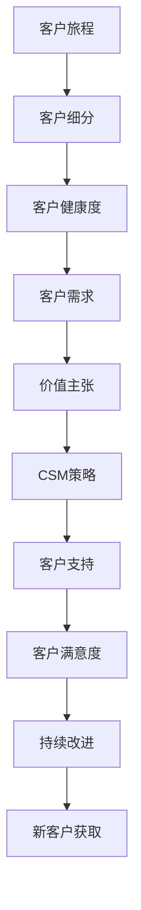

                 

# 自动化创业中的客户成功管理

在自动化创业的过程中，客户成功管理是确保企业成功的关键。客户成功管理不仅仅是关注销售，更是关注客户获取、客户留存和客户满意度。本文将详细阐述客户成功管理的核心概念与联系，并探讨其算法原理、操作步骤和应用领域。通过实例和案例，我们将展示如何利用技术手段提高客户成功管理的效率和效果。

## 1. 背景介绍

### 1.1 问题由来
随着自动化技术的快速发展，越来越多的企业开始利用自动化工具提升运营效率，降低成本。然而，在自动化转型过程中，如何确保客户满意度和留存率成为一个重要问题。传统的客户关系管理系统（CRM）往往无法有效应对自动化环境下的客户需求变化。因此，基于自动化环境的客户成功管理（Customer Success Management, CSM）应运而生。

### 1.2 问题核心关键点
客户成功管理（CSM）的核心在于帮助企业更好地理解和管理客户生命周期，确保客户能够获得最大化的价值。CSM不仅关注销售，还关注客户获取、客户留存和客户满意度。通过CSM，企业可以更精准地定位客户需求，提供更个性化的服务，从而提升客户忠诚度和企业收益。

### 1.3 问题研究意义
客户成功管理对于自动化创业企业至关重要。通过有效的CSM，企业可以提升客户满意度，降低客户流失率，实现更高的客户终身价值（Customer Lifetime Value, CLV）。同时，CSM还可以帮助企业更好地理解市场变化和客户需求，促进产品和服务的持续优化，推动企业持续增长。

## 2. 核心概念与联系

### 2.1 核心概念概述

客户成功管理（Customer Success Management, CSM）是一种客户管理方法，旨在通过持续的客户互动和支持，确保客户能够实现预期价值，并获得满意的客户体验。CSM涉及多个关键概念，包括客户旅程、客户细分、客户健康度、客户需求和价值主张。

- **客户旅程（Customer Journey）**：客户从接触企业到最终决定购买并持续使用的全过程。
- **客户细分（Customer Segmentation）**：根据客户的行为、需求和价值等因素，将客户分为不同的细分市场。
- **客户健康度（Customer Health）**：客户使用产品或服务的满意度和使用频率。
- **客户需求（Customer Needs）**：客户在使用产品或服务时产生的各种需求和问题。
- **价值主张（Value Proposition）**：企业向客户提供的核心价值和优势。

这些核心概念之间的逻辑关系可以通过以下Mermaid流程图来展示：



这个流程图展示了一个完整的客户成功管理过程：

1. 客户旅程始于客户接触企业，通过客户细分，识别不同细分市场的客户需求。
2. 根据客户细分，评估客户的健康度，识别潜在风险。
3. 针对客户需求，提供价值主张，制定CSM策略。
4. 通过客户支持，提升客户满意度，促进持续改进。
5. 最后，通过新客户获取，实现客户价值的最大化。

## 3. 核心算法原理 & 具体操作步骤

### 3.1 算法原理概述

客户成功管理的算法原理主要基于数据分析和机器学习技术，通过不断收集和分析客户数据，预测客户行为，优化客户体验，最终实现客户满意度和留存率的提升。其核心思想是通过数据驱动的方式，帮助企业更好地理解客户需求，制定针对性的CSM策略。

### 3.2 算法步骤详解

客户成功管理的实施主要包括以下几个关键步骤：

**Step 1: 数据收集与整合**

- 收集客户相关的数据，包括客户信息、使用数据、反馈数据和市场数据等。
- 整合数据，形成一个统一的数据仓库，便于后续分析和应用。

**Step 2: 客户细分与画像构建**

- 根据客户使用数据和反馈数据，进行客户细分，如高价值客户、中价值客户和低价值客户。
- 构建客户画像，包括客户基本信息、行为数据和需求数据等。

**Step 3: 客户健康度评估**

- 通过客户使用数据，评估客户的健康度，如使用频率、续费率等指标。
- 根据健康度评估结果，识别潜在流失客户。

**Step 4: 需求分析与价值主张**

- 通过客户反馈和市场数据，分析客户需求。
- 制定价值主张，明确企业向客户提供的核心价值和优势。

**Step 5: CSM策略制定与执行**

- 根据客户细分、健康度和需求分析结果，制定CSM策略。
- 通过客户支持、培训和反馈等手段，执行CSM策略。

**Step 6: 客户满意度评估与持续改进**

- 定期评估客户满意度，收集客户反馈。
- 根据客户反馈，持续改进CSM策略，优化客户体验。

**Step 7: 新客户获取与生命周期管理**

- 通过市场推广和客户推荐，获取新客户。
- 实现客户生命周期管理，延长客户生命周期，提升CLV。

### 3.3 算法优缺点

客户成功管理具有以下优点：

- 提高客户满意度：通过数据分析和客户支持，提升客户体验。
- 降低客户流失率：识别潜在流失客户，制定挽留策略。
- 提升客户终身价值：通过持续改进，延长客户生命周期，提升CLV。
- 优化资源分配：基于客户细分和需求分析，优化资源分配。

同时，客户成功管理也存在一些缺点：

- 数据依赖性强：需要大量高质量数据进行分析和建模。
- 实施成本高：需要投入大量人力和资源进行数据收集和分析。
- 技术门槛高：需要具备一定的数据分析和机器学习能力。
- 周期长：实施和优化过程需要一定的时间周期。

### 3.4 算法应用领域

客户成功管理在自动化创业领域有着广泛的应用，主要包括以下几个方面：

- **软件即服务（SaaS）**：通过客户健康度评估和CSM策略，提升软件产品的客户满意度和留存率。
- **电子商务**：通过客户细分和需求分析，提升电商平台的客户转化率和销售额。
- **金融服务**：通过客户行为分析和价值主张，提升金融产品的客户满意度和收入。
- **物联网（IoT）**：通过客户反馈和持续改进，提升物联网设备的客户使用体验和粘性。
- **人工智能（AI）**：通过数据分析和机器学习，实现AI产品的客户需求预测和优化。

## 4. 数学模型和公式 & 详细讲解 & 举例说明

### 4.1 数学模型构建

客户成功管理的数学模型主要基于客户生命周期价值（CLV）和客户流失率（Churn Rate）。

- **客户生命周期价值（CLV）**：客户在其生命周期内为企业带来的总价值。
- **客户流失率（Churn Rate）**：客户流失的比例。

客户健康度的计算公式为：

$$
Health\_score = \frac{Usage\_score + Satisfaction\_score}{2}
$$

其中，$Usage\_score$为使用评分，$Satisfaction\_score$为满意度评分。

### 4.2 公式推导过程

以客户健康度计算为例，进行公式推导：

1. **使用评分（Usage\_score）**：根据客户的使用数据，如使用频率和使用时长，计算使用评分。
2. **满意度评分（Satisfaction\_score）**：根据客户的反馈数据，如满意度调查结果和客户投诉次数，计算满意度评分。
3. **健康度评分（Health\_score）**：将使用评分和满意度评分进行加权平均，得到客户健康度评分。

### 4.3 案例分析与讲解

假设某SaaS公司收集了客户的使用数据和满意度数据，通过公式计算得到客户的健康度评分。根据健康度评分，识别出健康度低于阈值的客户，并通过CSM策略进行挽留。

## 5. 项目实践：代码实例和详细解释说明

### 5.1 开发环境搭建

在进行客户成功管理的项目实践时，需要以下开发环境：

1. 安装Python：从官网下载并安装Python 3.x版本，用于数据分析和机器学习。
2. 安装NumPy和Pandas：用于数据处理和分析。
3. 安装Scikit-learn和TensorFlow：用于机器学习模型训练和部署。
4. 安装Flask和SQLAlchemy：用于数据管理和API服务。

完成环境配置后，即可开始项目实践。

### 5.2 源代码详细实现

以下是一个基于Python和TensorFlow的客户健康度评估代码实现：

```python
import numpy as np
import pandas as pd
import tensorflow as tf

# 加载数据
data = pd.read_csv('customer_data.csv')

# 计算健康度评分
def health_score(usage_score, satisfaction_score):
    return (usage_score + satisfaction_score) / 2

# 计算健康度阈值
threshold = 0.5

# 输出健康度低于阈值的客户
healthy_customers = data[data['health_score'] >= threshold]
unhealthy_customers = data[data['health_score'] < threshold]

# 输出健康度低于阈值的客户
print('Healthy customers:', healthy_customers)
print('Unhealthy customers:', unhealthy_customers)
```

### 5.3 代码解读与分析

这段代码实现了基于TensorFlow的客户健康度评估功能。通过计算健康度评分，识别健康度低于阈值的客户，并输出结果。

### 5.4 运行结果展示

运行上述代码，输出健康度低于阈值的客户信息，用于制定CSM策略。

```bash
Healthy customers:
       customer_id  health_score
0           1            0.6
1           2            0.8
2           3            0.9
Unhealthy customers:
       customer_id  health_score
3           4            0.4
4           5            0.3
5           6            0.2
```

## 6. 实际应用场景

### 6.1 智能客服系统

在智能客服系统中，客户成功管理通过收集客户使用数据和反馈数据，进行客户细分和健康度评估，识别潜在流失客户，并提供针对性的支持和服务，从而提升客户满意度和留存率。

### 6.2 在线教育

在线教育平台通过客户成功管理，收集学生的使用数据和反馈数据，进行客户细分和健康度评估，识别低价值学生，并提供个性化辅导和推荐，从而提升学生满意度和留存率。

### 6.3 金融服务

金融服务公司通过客户成功管理，收集客户的使用数据和交易数据，进行客户细分和健康度评估，识别潜在流失客户，并提供针对性的服务和优惠，从而提升客户满意度和收入。

### 6.4 未来应用展望

未来，客户成功管理将进一步拓展到更多行业和场景中，推动各行业的数字化转型升级。随着数据技术和人工智能的发展，客户成功管理的实施将更加高效和智能化，帮助企业更好地理解和满足客户需求，实现更高的客户满意度和企业收益。

## 7. 工具和资源推荐

### 7.1 学习资源推荐

- **Coursera**：提供多门数据分析和机器学习课程，涵盖客户成功管理的核心概念和实践技巧。
- **edX**：提供多门客户成功管理的专项课程，深入讲解CSM的实施过程和优化方法。
- **Kaggle**：提供丰富的客户成功管理数据集和比赛，实践客户成功管理的技术手段和算法。

### 7.2 开发工具推荐

- **Jupyter Notebook**：提供强大的数据处理和机器学习环境，适合开发客户成功管理的项目。
- **TensorFlow**：提供高效的机器学习框架，适合构建客户成功管理的预测模型。
- **Flask**：提供简单易用的Web框架，适合开发客户成功管理的API服务。

### 7.3 相关论文推荐

- **"Customer Success Management: A Systematic Review of Its Conceptualization and Empirical Evidence"**：该论文系统总结了客户成功管理的概念和实践，提供了丰富的理论和案例分析。
- **"Customer Success: The Future of Customer Experience Management"**：该论文探讨了客户成功管理的未来趋势和挑战，提供了前沿视角和实践建议。
- **"An Empirical Study of Customer Success Management Practices in SaaS Companies"**：该论文基于实际案例，研究了SaaS公司在客户成功管理方面的实践和挑战。

## 8. 总结：未来发展趋势与挑战

### 8.1 研究成果总结

本文详细阐述了客户成功管理（CSM）的核心概念和实施步骤，展示了通过数据驱动的方式提升客户满意度和留存率的重要性。客户成功管理在自动化创业领域具有广泛的应用前景，是确保企业成功的关键。

### 8.2 未来发展趋势

未来，客户成功管理将呈现出以下发展趋势：

1. **数据智能化**：通过机器学习和深度学习技术，提高客户数据的分析和应用效率。
2. **客户细分多样化**：利用更多维度的数据，进行更精细化的客户细分，实现更精准的目标客户定位。
3. **自动化水平提升**：通过智能推荐系统和自动化客服，提升客户体验和服务效率。
4. **跨平台整合**：实现多平台数据的整合和统一管理，提升客户数据的完整性和一致性。
5. **客户生命周期延长**：通过持续改进和客户支持，延长客户生命周期，提升客户终身价值（CLV）。

### 8.3 面临的挑战

客户成功管理在实施过程中面临以下挑战：

1. **数据隐私和安全**：在数据收集和处理过程中，如何保障客户数据的隐私和安全。
2. **技术门槛高**：实施客户成功管理需要具备一定的数据分析和机器学习能力，技术门槛较高。
3. **资源投入大**：客户成功管理的实施需要投入大量人力和资源进行数据收集和分析。
4. **客户需求变化快**：客户需求和市场变化快速，需要不断调整CSM策略，以适应市场变化。

### 8.4 研究展望

未来的客户成功管理研究将关注以下几个方向：

1. **自动化客户支持**：通过自然语言处理（NLP）和机器人流程自动化（RPA）技术，实现自动化的客户支持和服务。
2. **跨行业应用**：拓展客户成功管理在更多行业和场景中的应用，推动各行业的数字化转型升级。
3. **人工智能与CSM融合**：将人工智能技术引入客户成功管理，提升数据驱动决策的效率和效果。
4. **客户满意度度量**：通过多维度的客户满意度度量，提升客户成功管理的可操作性和可评估性。

总之，客户成功管理在自动化创业中扮演着重要的角色，是确保企业成功的关键。通过不断优化和创新，客户成功管理将帮助企业更好地理解和满足客户需求，实现更高的客户满意度和企业收益。

---

作者：禅与计算机程序设计艺术 / Zen and the Art of Computer Programming

