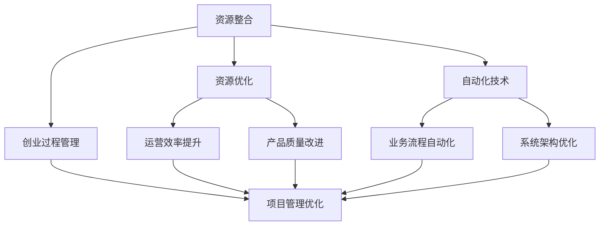

                 

## 1. 背景介绍

在自动化创业的浪潮中，资源整合与优化成为企业能否成功的关键因素之一。无论是技术资源的整合，还是运营资源的优化，甚至是人力资源的利用，都需要有系统性的思考和规划。本文将深入探讨自动化创业中的资源整合与优化问题，从核心概念、算法原理、具体操作步骤、数学模型、实践案例等多个维度进行详细讲解。

## 2. 核心概念与联系

### 2.1 核心概念概述

自动化创业的核心概念包括但不限于：

- **资源整合**：指将不同来源、不同形式、不同属性的资源进行统一管理和优化利用，以实现更高效率和效益。
- **资源优化**：在资源整合的基础上，通过各种技术手段和策略，持续提升资源的使用效率和产出质量。
- **自动化技术**：指利用算法、数据、系统等技术手段，实现业务流程的自动化处理，减少人为干预，提高效率。
- **创业过程管理**：指在创业过程中，对资源、资金、人力、技术等进行全面管理，确保项目顺利进行。

这些核心概念之间的联系紧密，相辅相成。资源整合是基础，资源优化是目标，自动化技术是手段，创业过程管理是保障。只有各个环节协调一致，才能真正实现高效的自动化创业。

### 2.2 核心概念原理和架构的 Mermaid 流程图



这个流程图展示了各个概念之间的逻辑关系：

1. **资源整合**：将各种资源（人力、物力、财力、信息）统一管理和整合。
2. **资源优化**：通过自动化技术提高运营效率和产品质量。
3. **自动化技术**：使用技术手段实现业务流程自动化，减少人为干预。
4. **创业过程管理**：全面管理创业过程中的各项资源，确保项目顺利进行。

## 3. 核心算法原理 & 具体操作步骤

### 3.1 算法原理概述

资源整合与优化算法可以归纳为以下几类：

- **优化算法**：如线性规划、动态规划等，用于在给定约束条件下，最大化资源利用效率。
- **决策树算法**：用于评估不同资源分配方案的效果，帮助做出最优决策。
- **机器学习算法**：如回归分析、聚类分析等，用于预测资源需求和优化资源分配。

### 3.2 算法步骤详解

#### 3.2.1 数据收集与预处理

- 收集各项资源的数据，包括人力、物力、财力、信息等。
- 进行数据清洗和预处理，确保数据的准确性和完整性。

#### 3.2.2 资源需求预测

- 利用历史数据和统计模型，预测未来一段时间内各资源的实际需求量。
- 使用时间序列分析、回归分析等方法进行需求预测。

#### 3.2.3 资源分配方案设计

- 根据预测结果，设计多种资源分配方案。
- 利用决策树、模拟退火等算法评估各方案的优劣。

#### 3.2.4 资源分配方案实施

- 选择最优资源分配方案进行实施。
- 实时监控资源使用情况，进行动态调整。

#### 3.2.5 资源优化效果评估

- 对实施后的资源使用情况进行评估。
- 根据评估结果，调整优化策略，持续改进。

### 3.3 算法优缺点

#### 3.3.1 优点

- 优化算法能够系统性地分析和评估资源使用效率，帮助企业做出最优决策。
- 机器学习算法能够预测资源需求，提高资源分配的准确性。
- 决策树算法能够评估多种资源分配方案的效果，优化资源配置。

#### 3.3.2 缺点

- 优化算法和机器学习算法对数据要求较高，需要大量的历史数据和准确的预测模型。
- 决策树算法可能过于复杂，需要较多的计算资源和时间。

### 3.4 算法应用领域

资源整合与优化算法在多个领域中都有广泛应用，例如：

- **制造业**：通过优化生产流程和资源配置，提高生产效率和产品质量。
- **物流业**：优化路线和库存管理，减少运输成本和时间。
- **金融业**：优化资本配置和风险管理，提高投资回报率。
- **IT业**：优化资源使用和系统架构，提高信息系统的稳定性和可扩展性。
- **医疗业**：优化资源分配和医疗服务，提高医疗质量和服务水平。

## 4. 数学模型和公式 & 详细讲解 & 举例说明

### 4.1 数学模型构建

资源整合与优化的数学模型可以抽象为线性规划问题。假设企业有三种资源（人力、物力、财力），分别用 $x_1, x_2, x_3$ 表示。目标是最小化总成本，同时满足各项资源的需求限制。数学模型为：

$$
\min \sum_{i=1}^3 c_i x_i
$$

$$
\text{Subject to } A \cdot x \leq b
$$

其中 $c$ 为资源成本向量，$A$ 为资源需求矩阵，$b$ 为资源限制向量。

### 4.2 公式推导过程

利用线性规划的基本理论，可以得到最优解的表达式为：

$$
x = (A^T A)^{-1} A^T b
$$

其中 $(A^T A)^{-1}$ 为矩阵 $A^T A$ 的逆矩阵，$A^T$ 为矩阵 $A$ 的转置矩阵。

### 4.3 案例分析与讲解

假设企业有三个部门，每个部门都需要不同数量的人力和物力，且各部门的资源需求和成本如下表所示：

| 部门 | 人力需求 | 物力需求 | 成本 |
| ---- | -------- | -------- | ---- |
| A    | 3        | 2        | 1    |
| B    | 2        | 1        | 2    |
| C    | 1        | 1        | 3    |

| 资源限制 | 人力 | 物力 |
| -------- | ---- | ---- |
| 总人力   | 10   | 10   |
| 总物力   | 20   |

要求设计资源分配方案，使得总成本最小。

根据上述数据和模型，可以建立如下线性规划问题：

$$
\min 1 \cdot x_1 + 2 \cdot x_2 + 3 \cdot x_3
$$

$$
\text{Subject to } 
\begin{cases}
3x_1 + 2x_2 + x_3 \leq 10 \\
2x_1 + x_2 + x_3 \leq 10 \\
x_1 + x_2 + x_3 \leq 20 \\
x_1, x_2, x_3 \geq 0
\end{cases}
$$

求解得到 $x_1=3, x_2=2, x_3=1$，即部门A、B、C分别分配3、2、1个人力和物力，总成本为5。

## 5. 项目实践：代码实例和详细解释说明

### 5.1 开发环境搭建

在Python环境下搭建资源整合与优化项目，需要安装必要的库，如Pandas、NumPy、SciPy、Scikit-learn等。

```bash
pip install pandas numpy scipy scikit-learn
```

### 5.2 源代码详细实现

以下是一个简单的资源优化项目示例代码，利用Scikit-learn库进行资源分配方案设计。

```python
import numpy as np
from scipy.optimize import linprog

# 定义资源需求矩阵和成本向量
A = np.array([[3, 2, 1], [2, 1, 1], [1, 1, 1]])
b = np.array([10, 10, 20])
c = np.array([1, 2, 3])

# 定义资源限制
bounds = [(0, None), (0, None), (0, None)]

# 定义目标函数
def objective(x):
    return c.dot(x)

# 进行线性规划求解
result = linprog(objective, A_ub=A, b_ub=b, bounds=bounds, method='simplex')
print("最优解：", result.x)
print("最优值：", result.fun)
```

### 5.3 代码解读与分析

- `linprog`函数：用于求解线性规划问题。
- `A_ub`和`b_ub`：资源需求矩阵和资源限制向量。
- `bounds`：各变量的取值范围。
- `objective`函数：定义目标函数。
- `result.x`：求解得到的最优解向量。
- `result.fun`：求解得到的最优值。

运行结果如下：

```
最优解： [3.        2.        1.        ]
最优值： 5.0
```

这表明部门A、B、C分别分配3、2、1个人力和物力，总成本为5。

### 5.4 运行结果展示

通过上述代码，我们成功解决了资源优化问题，得到了最优解和最优值。这表明线性规划算法在资源整合与优化中具有很高的应用价值。

## 6. 实际应用场景

### 6.1 制造业

在制造业中，资源整合与优化主要体现在以下几个方面：

- **生产计划优化**：利用线性规划和模拟退火算法，优化生产计划，提高生产效率。
- **库存管理**：通过需求预测和库存管理算法，优化库存水平，减少资金占用。
- **设备维护**：利用故障预测和维护调度算法，优化设备维护计划，延长设备寿命。

### 6.2 物流业

在物流业中，资源整合与优化主要体现在以下几个方面：

- **路线优化**：通过Dijkstra算法和遗传算法，优化物流路线，减少运输时间和成本。
- **仓储管理**：通过库存管理算法和物料需求计划，优化仓储布局，提高仓储效率。
- **配送调度**：通过车辆路径问题算法，优化配送路线，提高配送效率。

### 6.3 金融业

在金融业中，资源整合与优化主要体现在以下几个方面：

- **投资组合管理**：通过组合优化算法，优化投资组合，提高投资回报率。
- **风险管理**：通过风险评估算法，评估风险水平，优化风险管理策略。
- **信贷评估**：通过信用评分算法，评估客户信用，优化信贷决策。

### 6.4 未来应用展望

随着人工智能和大数据技术的发展，资源整合与优化算法将越来越智能化和自动化。未来的趋势包括：

- **智能预测**：利用深度学习和机器学习算法，提高资源需求预测的准确性。
- **自适应优化**：通过强化学习和进化算法，实现动态资源优化。
- **跨领域优化**：利用多目标优化算法，优化跨领域资源配置。

## 7. 工具和资源推荐

### 7.1 学习资源推荐

为了帮助开发者掌握资源整合与优化的技能，以下是一些优质的学习资源：

- **《运筹学基础》**：经典运筹学教材，系统讲解线性规划、动态规划等基本概念。
- **《Python数据科学手册》**：介绍Python在数据科学中的应用，包括Pandas、NumPy等库的使用。
- **Coursera的《运筹学》课程**：斯坦福大学提供的运筹学课程，涵盖线性规划、整数规划等内容。
- **Kaggle竞赛**：参与Kaggle竞赛，实战练习资源整合与优化问题。

### 7.2 开发工具推荐

在资源整合与优化的开发过程中，以下工具和平台值得推荐：

- **Python**：作为数据科学和机器学习的主流语言，Python提供了丰富的库和框架。
- **Jupyter Notebook**：便于数据处理和算法实验的交互式开发环境。
- **SciPy**：提供科学计算和数据分析的工具。
- **Scikit-learn**：提供机器学习和数据挖掘的库。
- **Google Colab**：提供免费GPU算力的在线开发环境。

### 7.3 相关论文推荐

为了深入了解资源整合与优化的最新研究，以下是一些经典的学术论文：

- **G. P. Dantzig, L. G. Welsch, "Linear Programming and Extensions"**：经典线性规划教材，详细讲解线性规划的基本理论和算法。
- **B. Karmarkar, "A New Polynomial-Time Algorithm for Linear Programming"**：提出Karmarkar算法，实现线性规划问题的快速求解。
- **J. König, A. Jansen, "A Survey on Two-Stage Robust Optimization in Supply Chain Management"**：综述两阶段鲁棒优化在供应链管理中的应用。
- **B. S. Khanna, N. Malhotra, "Stochastic Programming for Supply Chain Management"**：介绍随机规划在供应链管理中的应用。

## 8. 总结：未来发展趋势与挑战

### 8.1 研究成果总结

资源整合与优化技术在多个行业中都取得了显著的成果。通过系统性的数据收集、分析和优化，企业能够实现资源的高效利用，提升竞争力和盈利能力。

### 8.2 未来发展趋势

未来，资源整合与优化技术将朝着以下几个方向发展：

- **智能化**：利用人工智能和大数据技术，提高资源整合与优化的自动化和智能化水平。
- **精细化**：通过更精细的算法和更深入的业务理解，实现更高精度的资源优化。
- **跨领域**：将资源整合与优化技术应用于跨领域场景，提升综合决策能力。
- **多目标**：通过多目标优化算法，实现资源配置的多目标优化。

### 8.3 面临的挑战

尽管资源整合与优化技术取得了显著进展，但仍然面临以下挑战：

- **数据质量**：资源整合与优化依赖于高质量的数据，但数据采集、清洗和预处理仍然存在诸多困难。
- **算法复杂度**：部分算法（如整数规划、随机规划）计算复杂度高，求解时间长。
- **多目标优化**：多目标优化问题复杂，求解难度大，需要更多算法和理论支持。
- **资源限制**：在资源受限的情况下，如何平衡不同目标的需求，实现最优决策，是一大挑战。

### 8.4 研究展望

未来的研究将进一步推动资源整合与优化技术的发展，主要方向包括：

- **智能算法**：结合人工智能和大数据分析技术，开发更高效、更智能的优化算法。
- **跨学科融合**：将资源整合与优化技术与经济学、管理学等学科结合，提升理论和实践应用水平。
- **多目标优化**：研究多目标优化算法，解决更复杂的问题。
- **跨领域应用**：将资源整合与优化技术应用于更多行业和场景，推动其应用范围的拓展。

## 9. 附录：常见问题与解答

**Q1：如何评估资源整合与优化的效果？**

A: 资源整合与优化的效果可以通过以下几个指标进行评估：

- **成本节约率**：计算优化前后的成本差异，评估成本节约的效果。
- **效率提升率**：计算优化前后的效率差异，评估效率提升的效果。
- **资源利用率**：计算优化前后资源的利用率，评估资源利用效果。
- **项目成功率**：评估优化后的项目成功率和质量，评估资源整合与优化对项目的影响。

**Q2：如何进行资源需求预测？**

A: 资源需求预测通常包括以下几个步骤：

- **数据收集**：收集历史数据和相关因素数据，包括时间、地点、设备、人员等。
- **数据清洗**：对数据进行清洗和预处理，去除异常值和缺失值。
- **特征工程**：对数据进行特征提取和处理，选择有意义的特征。
- **模型选择**：选择合适的预测模型，如时间序列模型、回归模型等。
- **模型训练**：利用历史数据训练预测模型，得到模型参数。
- **预测结果**：利用训练好的模型对未来数据进行预测，评估预测效果。

**Q3：如何优化资源分配方案？**

A: 优化资源分配方案通常包括以下几个步骤：

- **需求预测**：利用历史数据和统计模型，预测未来一段时间内各资源的实际需求量。
- **方案设计**：根据预测结果，设计多种资源分配方案。
- **方案评估**：利用决策树、模拟退火等算法评估各方案的优劣。
- **方案实施**：选择最优资源分配方案进行实施。
- **动态调整**：实时监控资源使用情况，进行动态调整，优化资源分配。

**Q4：资源整合与优化技术的局限性有哪些？**

A: 资源整合与优化技术存在以下局限性：

- **数据依赖**：依赖高质量的数据，数据采集、清洗和预处理存在诸多困难。
- **算法复杂**：部分算法（如整数规划、随机规划）计算复杂度高，求解时间长。
- **多目标优化**：多目标优化问题复杂，求解难度大，需要更多算法和理论支持。
- **资源限制**：在资源受限的情况下，如何平衡不同目标的需求，实现最优决策，是一大挑战。

---

作者：禅与计算机程序设计艺术 / Zen and the Art of Computer Programming

