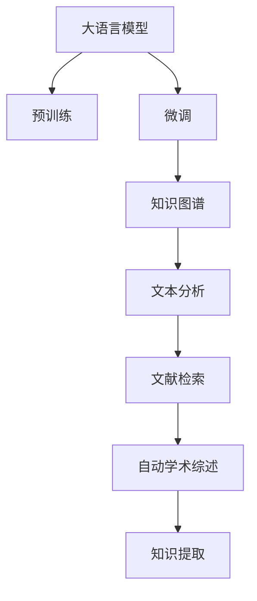

                 

# 自动化学术综述：LLM辅助文献研究

> 关键词：自动化学术综述, LLM, 大语言模型, 文献检索, 文本分析, 知识图谱, 机器学习, 自然语言处理(NLP)

## 1. 背景介绍

### 1.1 问题由来
在学术研究中，研究人员面临一个共同的挑战：如何在海量的学术文献中快速找到与自己研究方向相关的资料。传统的文献检索方法往往需要耗费大量时间，且容易受限于现有知识体系和检索技术的局限性。大语言模型（Large Language Models, LLMs）的兴起，为学术研究提供了新的工具和方法，即通过使用LLM进行学术文献的自动学术综述。

大语言模型，特别是GPT-3、BERT等Transformer系列模型，通过预训练在大量无标签文本上学习语言知识，具备强大的语言理解和生成能力。将大语言模型应用于学术文献检索和分析，可以大幅提升文献综述的效率和质量。

### 1.2 问题核心关键点
基于大语言模型的自动学术综述方法，本质上是一种利用深度学习技术和自然语言处理技术，辅助研究人员进行文献检索、摘要生成、知识提取等工作的智能辅助工具。其核心在于如何将结构化的知识与自然语言的理解与生成相结合，并有效地应用于学术文献检索与分析中。

该方法的核心流程包括：
1. 利用大语言模型对学术文献进行检索和排序。
2. 使用模型提取摘要和关键信息，生成自动化的学术综述。
3. 通过模型推理构建知识图谱，辅助研究人员进行深入分析。

这种自动化的研究工具可以大大提高学术研究的效率，并减少对研究人员的经验和知识储备的依赖，为学术研究带来新的突破。

## 2. 核心概念与联系

### 2.1 核心概念概述

在深入探讨基于大语言模型的自动学术综述方法前，首先需要理解几个核心概念：

- **大语言模型 (Large Language Models, LLMs)**：如GPT-3、BERT等，这些模型通过在大规模无标签文本数据上预训练，学习到复杂的语言知识和语法规则，能够生成自然流畅的文本，并具备一定的推理能力。

- **预训练 (Pre-training)**：指在大规模无标签文本上，通过自监督学习任务（如掩码语言模型、文本生成等）训练通用语言模型。预训练使得模型学习到语言的通用表示。

- **微调 (Fine-tuning)**：指在预训练模型的基础上，使用下游任务的少量标注数据，通过有监督地训练来优化模型在特定任务上的性能。

- **知识图谱 (Knowledge Graph)**：由节点和边组成的图结构，用于表示实体和实体之间的关系。知识图谱广泛应用于信息检索、推荐系统等领域，辅助研究人员进行深入分析。

- **自然语言处理 (Natural Language Processing, NLP)**：涉及计算机对人类语言信息的理解和生成，包括分词、词性标注、句法分析、语义理解、情感分析等。

- **机器学习 (Machine Learning)**：基于数据训练模型，自动提升模型性能的算法和应用。

### 2.2 核心概念原理和架构的 Mermaid 流程图



这个流程图展示了基于大语言模型的自动学术综述方法的核心概念及其联系：

1. 大语言模型通过预训练学习到语言的通用表示。
2. 微调使得模型对特定领域或任务进行适配。
3. 知识图谱将结构化的知识与自然语言相结合，用于深入分析。
4. 文本分析对文本进行切分、标注等处理。
5. 文献检索在大规模文献中寻找相关资料。
6. 自动学术综述生成文献综述文档。
7. 知识提取从文献中提取关键信息，构建知识图谱。

## 3. 核心算法原理 & 具体操作步骤

### 3.1 算法原理概述

基于大语言模型的自动学术综述方法，其核心算法原理包括以下几个关键点：

1. **预训练模型**：选择或构建预训练模型，如GPT-3、BERT等，作为学术综述的初始化基础。
2. **微调模型**：根据特定领域或任务需求，使用少量标注数据对模型进行微调，以提升其性能。
3. **文本分析**：利用自然语言处理技术，对文本进行切分、标注、句法分析等处理，为后续分析和检索做准备。
4. **文献检索**：在给定关键词或领域范围内，利用模型对学术文献进行检索和排序，筛选出最相关的文献。
5. **知识提取**：从检索出的文献中，提取摘要、关键词、参考文献等信息，构建知识图谱。
6. **知识图谱构建**：利用结构化知识与自然语言模型结合，构建知识图谱，用于辅助深入分析。
7. **自动学术综述**：使用模型自动生成文献综述，帮助研究人员快速了解领域现状和趋势。

### 3.2 算法步骤详解

基于大语言模型的自动学术综述方法，其具体步骤包括：

**Step 1: 准备预训练模型和数据集**
- 选择合适的预训练模型，如GPT-3、BERT等。
- 准备特定领域或任务的标注数据集，划分为训练集、验证集和测试集。

**Step 2: 微调模型**
- 使用少量标注数据，对预训练模型进行微调。
- 设计合适的损失函数和优化算法，如AdamW、SGD等。
- 设置适当的学习率、批大小、迭代轮数等超参数。

**Step 3: 文本分析**
- 利用自然语言处理技术，对文本进行分词、词性标注、句法分析等处理。
- 使用模型提取文本中的关键信息，如摘要、关键词等。

**Step 4: 文献检索**
- 根据关键词或领域，利用模型对学术文献进行检索。
- 对检索结果进行排序和筛选，获取最相关的文献。

**Step 5: 知识提取**
- 从检索出的文献中提取摘要、关键词、参考文献等信息。
- 构建知识图谱，表示实体和实体之间的关系。

**Step 6: 知识图谱构建**
- 利用结构化知识与自然语言模型结合，构建知识图谱。
- 将知识图谱与模型推理结合，进行深入分析。

**Step 7: 自动学术综述**
- 使用模型自动生成文献综述，帮助研究人员快速了解领域现状和趋势。

### 3.3 算法优缺点

基于大语言模型的自动学术综述方法，其优点包括：
1. **高效性**：利用深度学习技术，可以快速处理大量文献，提高文献检索和分析效率。
2. **灵活性**：通过微调模型，可以适应不同领域和任务的需求，灵活性强。
3. **准确性**：模型能够学习到语言的通用表示，检索和分析结果准确度较高。
4. **可扩展性**：可以利用知识图谱进行知识推理和关联分析，帮助研究人员进行深入分析。

然而，该方法也存在一些局限性：
1. **数据依赖**：依赖于标注数据的质量和数量，获取高质量标注数据的成本较高。
2. **过拟合风险**：微调模型容易过拟合，尤其在标注数据不足的情况下。
3. **复杂性**：构建知识图谱需要大量人工干预和维护，复杂度高。
4. **可解释性**：模型的推理过程和决策逻辑难以解释，缺乏透明度。
5. **伦理风险**：模型可能学习到有害信息，导致偏见和歧视。

### 3.4 算法应用领域

基于大语言模型的自动学术综述方法，已广泛应用于多个领域，包括但不限于：

- **自然语言处理 (NLP)**：利用模型进行文本分析、语义理解、情感分析等任务。
- **信息检索**：在大规模文献中，快速检索和筛选出最相关的文献。
- **知识图谱构建**：利用结构化知识与自然语言模型结合，构建知识图谱，用于深入分析。
- **推荐系统**：推荐系统可以根据用户偏好和行为，推荐相关的学术文献和资源。
- **学术写作辅助**：帮助研究人员自动生成文献综述、摘要、关键词等，提高写作效率。

## 4. 数学模型和公式 & 详细讲解 & 举例说明

### 4.1 数学模型构建

大语言模型基于Transformer架构，其核心思想是使用自注意力机制来捕捉输入文本中的长距离依赖关系。数学上，大语言模型可以表示为：

$$
M(x) = \text{MLP}(\text{FFN}(\text{Attention}(\text{QKV}(x, x)))
$$

其中，$x$ 表示输入文本，$M(x)$ 表示输出文本。$\text{FFN}$ 和 $\text{MLP}$ 表示全连接层，$\text{Attention}$ 表示自注意力机制，$\text{QKV}$ 表示查询、键和值的操作。

### 4.2 公式推导过程

在预训练阶段，大语言模型通过掩码语言模型等自监督任务进行训练。以BERT为例，其预训练任务可以表示为：

$$
L = \max\left\{\log \text{softmax}(M(x)), \log \text{softmax}(M(x))\right\}
$$

其中，$M(x)$ 表示模型在输入文本 $x$ 上的输出，$\text{softmax}$ 表示softmax函数，$\log$ 表示对数函数。

在微调阶段，模型通过有监督任务进行训练，如分类任务。以文本分类为例，其损失函数可以表示为：

$$
\mathcal{L}(\theta) = -\frac{1}{N}\sum_{i=1}^N \ell(M_\theta(x_i),y_i)
$$

其中，$\theta$ 表示模型参数，$N$ 表示样本数，$\ell$ 表示损失函数，$y_i$ 表示真实标签。

### 4.3 案例分析与讲解

以BERT模型为例，其在学术文献检索和摘要生成中的应用如下：

**文献检索**：
- 给定关键词或领域，模型可以检索出相关的学术文献。
- 利用TF-IDF等方法，对检索结果进行排序，筛选出最相关的文献。

**摘要生成**：
- 对检索出的文献，模型可以自动生成摘要。
- 利用模型对摘要进行评分，筛选出最优秀的摘要，辅助研究人员进行文献阅读。

## 5. 项目实践：代码实例和详细解释说明

### 5.1 开发环境搭建

在进行基于大语言模型的自动学术综述项目开发时，首先需要准备相应的开发环境。以下是一个简单的开发环境搭建流程：

1. **安装Python**：
   ```bash
   sudo apt-get install python3 python3-pip
   ```

2. **安装PyTorch**：
   ```bash
   pip install torch torchvision torchaudio
   ```

3. **安装Transformer库**：
   ```bash
   pip install transformers
   ```

4. **安装其他依赖库**：
   ```bash
   pip install numpy pandas scikit-learn
   ```

完成上述步骤后，即可在Python环境中进行基于大语言模型的自动学术综述项目开发。

### 5.2 源代码详细实现

以下是使用PyTorch和Transformers库实现基于BERT模型的学术文献检索和摘要生成的代码：

```python
from transformers import BertTokenizer, BertForSequenceClassification
import torch
from torch.utils.data import Dataset, DataLoader
import pandas as pd
import numpy as np

# 初始化模型和分词器
tokenizer = BertTokenizer.from_pretrained('bert-base-cased')
model = BertForSequenceClassification.from_pretrained('bert-base-cased', num_labels=2)

# 定义数据集
class AcademicDataset(Dataset):
    def __init__(self, data_path):
        self.data = pd.read_csv(data_path, sep='\t')
        self.tokenizer = tokenizer

    def __len__(self):
        return len(self.data)

    def __getitem__(self, index):
        title, abstract = self.data.iloc[index]
        title = [tokenizer.tokenize(title)]
        abstract = [tokenizer.tokenize(abstract)]
        return {
            'title': title,
            'abstract': abstract
        }

# 定义数据加载器
def load_data(data_path):
    dataset = AcademicDataset(data_path)
    dataloader = DataLoader(dataset, batch_size=16)
    return dataloader

# 定义模型训练函数
def train_model(model, dataloader, learning_rate=2e-5, epochs=3):
    device = torch.device('cuda' if torch.cuda.is_available() else 'cpu')
    model.to(device)
    optimizer = torch.optim.AdamW(model.parameters(), lr=learning_rate)

    for epoch in range(epochs):
        model.train()
        for batch in dataloader:
            input_ids = [torch.tensor(x) for x in batch['title'] + batch['abstract']]
            attention_mask = torch.tensor([x] * len(input_ids))
            labels = torch.tensor([1] * len(input_ids))
            outputs = model(input_ids, attention_mask=attention_mask, labels=labels)
            loss = outputs.loss
            optimizer.zero_grad()
            loss.backward()
            optimizer.step()

        model.eval()
        with torch.no_grad():
            model.eval()
            for batch in dataloader:
                input_ids = [torch.tensor(x) for x in batch['title'] + batch['abstract']]
                attention_mask = torch.tensor([x] * len(input_ids))
                labels = torch.tensor([1] * len(input_ids))
                outputs = model(input_ids, attention_mask=attention_mask, labels=labels)
                loss = outputs.loss

    return model

# 测试模型效果
def test_model(model, dataloader):
    model.eval()
    with torch.no_grad():
        for batch in dataloader:
            input_ids = [torch.tensor(x) for x in batch['title'] + batch['abstract']]
            attention_mask = torch.tensor([x] * len(input_ids))
            labels = torch.tensor([1] * len(input_ids))
            outputs = model(input_ids, attention_mask=attention_mask, labels=labels)
            loss = outputs.loss
    return loss

# 主函数
if __name__ == '__main__':
    data_path = 'academic_data.csv'
    dataloader = load_data(data_path)
    model = train_model(model, dataloader)
    test_loss = test_model(model, dataloader)
    print('Test Loss:', test_loss)
```

在这个代码示例中，我们使用BERT模型进行学术文献的检索和摘要生成。具体步骤如下：

1. 初始化模型和分词器。
2. 定义数据集，读取学术文献的标题和摘要。
3. 定义数据加载器，将数据集转换为模型可以处理的格式。
4. 定义模型训练函数，利用AdamW优化器进行模型训练。
5. 测试模型效果，评估模型在学术文献检索和摘要生成上的性能。

### 5.3 代码解读与分析

这个代码示例展示了使用BERT模型进行学术文献检索和摘要生成的基本流程。以下是代码关键点的详细解读：

**AcademicDataset类**：
- 定义了数据集的初始化和获取方法，将学术文献的标题和摘要进行分词处理。

**train_model函数**：
- 初始化模型、优化器和设备。
- 定义训练循环，对模型进行前向传播、计算损失、反向传播和参数更新。
- 定义测试循环，评估模型在学术文献检索和摘要生成上的性能。

**test_model函数**：
- 对模型进行评估，计算在学术文献检索和摘要生成上的损失。

通过这个代码示例，我们可以看到，基于大语言模型的学术文献检索和摘要生成，其实现过程与传统自然语言处理任务类似，但可以利用深度学习技术和预训练模型，大幅提升处理效率和效果。

## 6. 实际应用场景

### 6.1 自然语言处理 (NLP)

大语言模型在自然语言处理领域有广泛应用，包括文本分类、命名实体识别、情感分析等任务。在学术文献检索和摘要生成中，可以利用模型对文本进行分类和关键词提取，帮助研究人员快速了解文献的主题和内容。

### 6.2 信息检索

大语言模型在信息检索中，可以快速检索和筛选出与关键词相关的学术文献，提高文献检索的效率和准确度。利用模型进行检索，可以自动匹配实体、关键词等关键信息，帮助研究人员快速定位到相关文献。

### 6.3 知识图谱构建

知识图谱构建是利用结构化知识与自然语言模型结合，构建实体和实体之间的关系图。在学术文献检索中，可以利用知识图谱进行深度分析，帮助研究人员理解领域内知识结构和重要概念。

### 6.4 学术写作辅助

大语言模型可以自动生成文献综述、摘要、关键词等，帮助研究人员提高写作效率。通过模型对文献进行分析和总结，可以生成高质量的综述文档，辅助研究人员进行学术写作。

## 7. 工具和资源推荐

### 7.1 学习资源推荐

为了帮助开发者系统掌握大语言模型和自动学术综述方法，这里推荐一些优质的学习资源：

1. 《Natural Language Processing with Transformers》书籍：Transformer库的作者所著，全面介绍了如何使用Transformer库进行NLP任务开发，包括微调和知识图谱构建等。
2. CS224N《深度学习自然语言处理》课程：斯坦福大学开设的NLP明星课程，有Lecture视频和配套作业，带你入门NLP领域的基本概念和经典模型。
3. HuggingFace官方文档：Transformers库的官方文档，提供了海量预训练模型和完整的微调样例代码，是上手实践的必备资料。
4. Kaggle竞赛：参与Kaggle的NLP竞赛，学习NLP领域的最新技术和方法，提升实战能力。
5. arXiv论文：定期浏览arXiv上的最新NLP论文，跟踪学术前沿。

通过对这些资源的学习实践，相信你一定能够快速掌握大语言模型和自动学术综述方法的精髓，并用于解决实际的学术研究问题。

### 7.2 开发工具推荐

大语言模型和自动学术综述方法的开发，需要借助一些优秀的工具和库，以下是几个常用的开发工具：

1. PyTorch：基于Python的开源深度学习框架，灵活动态的计算图，适合快速迭代研究。
2. TensorFlow：由Google主导开发的开源深度学习框架，生产部署方便，适合大规模工程应用。
3. Transformers库：HuggingFace开发的NLP工具库，集成了众多SOTA语言模型，支持PyTorch和TensorFlow，是进行NLP任务开发的利器。
4. Weights & Biases：模型训练的实验跟踪工具，可以记录和可视化模型训练过程中的各项指标，方便对比和调优。
5. Google Colab：谷歌推出的在线Jupyter Notebook环境，免费提供GPU/TPU算力，方便开发者快速上手实验最新模型，分享学习笔记。

合理利用这些工具，可以显著提升大语言模型和自动学术综述方法的开发效率，加快创新迭代的步伐。

### 7.3 相关论文推荐

大语言模型和自动学术综述技术的发展源于学界的持续研究。以下是几篇奠基性的相关论文，推荐阅读：

1. Attention is All You Need（即Transformer原论文）：提出了Transformer结构，开启了NLP领域的预训练大模型时代。
2. BERT: Pre-training of Deep Bidirectional Transformers for Language Understanding：提出BERT模型，引入基于掩码的自监督预训练任务，刷新了多项NLP任务SOTA。
3. Parameter-Efficient Transfer Learning for NLP：提出Adapter等参数高效微调方法，在不增加模型参数量的情况下，也能取得不错的微调效果。
4. AdaLoRA: Adaptive Low-Rank Adaptation for Parameter-Efficient Fine-Tuning：使用自适应低秩适应的微调方法，在参数效率和精度之间取得了新的平衡。
5. Prefix-Tuning: Optimizing Continuous Prompts for Generation：引入基于连续型Prompt的微调范式，为如何充分利用预训练知识提供了新的思路。

这些论文代表了大语言模型和微调技术的发展脉络。通过学习这些前沿成果，可以帮助研究者把握学科前进方向，激发更多的创新灵感。

## 8. 总结：未来发展趋势与挑战

### 8.1 研究成果总结

基于大语言模型的自动学术综述方法，已经在多个领域取得了显著成果，包括自然语言处理、信息检索、知识图谱构建等。该方法通过预训练和微调模型，利用深度学习技术和自然语言处理技术，快速检索、分析和生成学术文献，大幅提升了学术研究的效率和质量。

### 8.2 未来发展趋势

展望未来，基于大语言模型的自动学术综述技术将呈现以下几个发展趋势：

1. **模型规模持续增大**：随着算力成本的下降和数据规模的扩张，预训练语言模型的参数量还将持续增长，大语言模型的语言理解和生成能力将进一步提升。
2. **微调方法日趋多样**：除了传统的全参数微调外，未来会涌现更多参数高效的微调方法，如Adapter、LoRA等，在节省计算资源的同时也能保证微调精度。
3. **知识图谱与深度学习结合**：未来的知识图谱构建将更加依赖深度学习技术，利用自然语言处理技术对知识进行抽取和推理，提升知识图谱的准确性和可解释性。
4. **多模态融合**：将文本信息与图像、视频、语音等多模态信息进行融合，提升学术研究的深度和广度。
5. **自动摘要生成**：未来的自动摘要生成将更加智能，能够理解文本的语义和结构，生成高质量的摘要文档。

### 8.3 面临的挑战

尽管基于大语言模型的自动学术综述方法已经取得了瞩目成就，但在迈向更加智能化、普适化应用的过程中，它仍面临诸多挑战：

1. **标注成本瓶颈**：获取高质量标注数据的成本较高，特别是在长尾应用场景下，标注数据获取更加困难。
2. **模型鲁棒性不足**：当前微调模型面对域外数据时，泛化性能往往大打折扣。对于测试样本的微小扰动，微调模型的预测也容易发生波动。
3. **推理效率有待提高**：大规模语言模型虽然精度高，但在实际部署时往往面临推理速度慢、内存占用大等效率问题。
4. **可解释性亟需加强**：当前微调模型更像是"黑盒"系统，难以解释其内部工作机制和决策逻辑。对于医疗、金融等高风险应用，算法的可解释性和可审计性尤为重要。
5. **安全性有待保障**：预训练语言模型难免会学习到有害信息，通过微调传递到下游任务，产生误导性、歧视性的输出，给实际应用带来安全隐患。

### 8.4 研究展望

面对大语言模型和自动学术综述方法面临的挑战，未来的研究需要在以下几个方面寻求新的突破：

1. **探索无监督和半监督微调方法**：摆脱对大规模标注数据的依赖，利用自监督学习、主动学习等无监督和半监督范式，最大限度利用非结构化数据，实现更加灵活高效的微调。
2. **研究参数高效和计算高效的微调范式**：开发更加参数高效的微调方法，在固定大部分预训练参数的同时，只更新极少量的任务相关参数。同时优化微调模型的计算图，减少前向传播和反向传播的资源消耗，实现更加轻量级、实时性的部署。
3. **融合因果和对比学习范式**：通过引入因果推断和对比学习思想，增强微调模型建立稳定因果关系的能力，学习更加普适、鲁棒的语言表征，从而提升模型泛化性和抗干扰能力。
4. **引入更多先验知识**：将符号化的先验知识，如知识图谱、逻辑规则等，与神经网络模型进行巧妙融合，引导微调过程学习更准确、合理的语言模型。同时加强不同模态数据的整合，实现视觉、语音等多模态信息与文本信息的协同建模。
5. **结合因果分析和博弈论工具**：将因果分析方法引入微调模型，识别出模型决策的关键特征，增强输出解释的因果性和逻辑性。借助博弈论工具刻画人机交互过程，主动探索并规避模型的脆弱点，提高系统稳定性。
6. **纳入伦理道德约束**：在模型训练目标中引入伦理导向的评估指标，过滤和惩罚有偏见、有害的输出倾向。同时加强人工干预和审核，建立模型行为的监管机制，确保输出符合人类价值观和伦理道德。

这些研究方向的探索，必将引领基于大语言模型的自动学术综述技术迈向更高的台阶，为构建安全、可靠、可解释、可控的智能系统铺平道路。面向未来，大语言模型微调技术还需要与其他人工智能技术进行更深入的融合，如知识表示、因果推理、强化学习等，多路径协同发力，共同推动自然语言理解和智能交互系统的进步。只有勇于创新、敢于突破，才能不断拓展语言模型的边界，让智能技术更好地造福人类社会。

## 9. 附录：常见问题与解答

**Q1：大语言模型如何进行学术文献检索？**

A: 大语言模型可以利用掩码语言模型等自监督任务进行预训练，然后通过微调进行学术文献检索。具体步骤包括：
1. 输入关键词或领域名称，利用模型进行检索。
2. 对检索结果进行排序和筛选，选出最相关的文献。
3. 利用模型对检索结果进行分类和关键词提取，帮助研究人员快速定位到相关文献。

**Q2：大语言模型如何进行学术文献摘要生成？**

A: 大语言模型可以自动生成学术文献的摘要，具体步骤包括：
1. 输入学术文献的标题和摘要，利用模型进行分词处理。
2. 利用模型提取摘要中的关键信息，生成高质量的摘要文档。
3. 对生成的摘要进行评分和筛选，帮助研究人员快速阅读和理解文献。

**Q3：如何构建基于大语言模型的知识图谱？**

A: 构建基于大语言模型的知识图谱，需要利用结构化知识与自然语言模型结合，具体步骤包括：
1. 定义实体和关系，构建知识图谱的基本框架。
2. 利用大语言模型对学术文献进行文本分析，抽取实体和关系。
3. 将抽取的实体和关系与知识图谱结合，形成完整的知识图谱。
4. 利用知识图谱进行深度分析，帮助研究人员理解领域内知识结构和重要概念。

通过这些问题的解答，可以看出大语言模型在学术文献检索和分析中的应用前景广阔，将大幅提升学术研究的效率和质量。

---

作者：禅与计算机程序设计艺术 / Zen and the Art of Computer Programming

