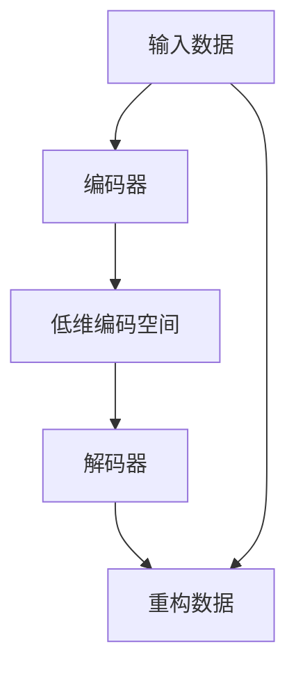

                 

# 自动编码器 (Autoencoder) 原理与代码实例讲解

> 关键词：自动编码器,自编码器,深度学习,降维,特征提取,重构误差,无监督学习,神经网络,编码器,解码器

## 1. 背景介绍

### 1.1 问题由来

自编码器（Autoencoder）是一种深度学习模型，用于将输入数据压缩到低维编码表示，并能够通过解码器重构原始数据。它是一种典型的无监督学习算法，旨在通过自动学习数据的内在结构，发现数据的低维嵌入表示，从而在降维、特征提取、数据压缩、噪声去除等多个应用场景中表现出卓越的性能。

自编码器的核心思想是：构建一个编码器将输入数据映射到低维空间，再通过一个解码器将低维数据重构回原始数据。通过训练模型，使得重构误差最小化，从而在一定程度上学习到数据的隐含特征和结构。自编码器模型主要由两个网络组成：编码器和解码器，中间是一个低维编码空间。

### 1.2 问题核心关键点

自编码器模型的核心关键点主要包括：

- 编码器与解码器的网络架构
- 自编码器重构误差最小化的目标函数
- 训练算法及其优化
- 应用场景与实例

自编码器模型广泛应用于特征提取、数据降维、数据压缩、图像去噪等多个领域，是深度学习中非常基础且重要的模型。掌握自编码器的原理和应用，对于理解深度学习和数据建模具有重要的意义。

## 2. 核心概念与联系

### 2.1 核心概念概述

为更好地理解自编码器的核心概念，本节将介绍几个关键概念：

- **自编码器 (Autoencoder)**：一种无监督学习算法，将输入数据压缩到低维空间并重构回原始数据。自编码器由编码器和解码器两个部分组成，中间是低维编码空间。
- **编码器 (Encoder)**：将输入数据压缩到低维空间的神经网络。编码器将输入数据映射到低维表示。
- **解码器 (Decoder)**：将低维表示重构回原始数据的神经网络。解码器接收编码器输出的低维表示，并重构出原始数据。
- **重构误差 (Reconstruction Error)**：自编码器在训练过程中，通过最小化重构误差来逼近输入数据的原始表示。重构误差是输入数据与重构数据之间的差异度量。
- **无监督学习 (Unsupervised Learning)**：自编码器是一种典型的无监督学习算法，无需标注数据即可学习数据的隐含结构和特征。

### 2.2 核心概念原理和架构的 Mermaid 流程图



自编码器的原理和架构可以通过上述流程图来表示：

1. 输入数据通过编码器压缩到低维空间。
2. 低维编码空间通过解码器重构回原始数据。
3. 自编码器通过最小化重构误差来学习数据的隐含结构和特征。

## 3. 核心算法原理 & 具体操作步骤

### 3.1 算法原理概述

自编码器的核心思想是：通过最小化重构误差，将输入数据压缩到低维空间，并能够重构回原始数据。自编码器模型的目标是最小化重构误差，即最小化输入数据与重构数据之间的差异。

在数学上，自编码器的目标函数可以表示为：

$$
\min_{\theta_e,\theta_d} \mathcal{L} = \frac{1}{N}\sum_{i=1}^N \mathcal{L}_r(x_i,\hat{x}_i) = \frac{1}{N}\sum_{i=1}^N \lVert x_i - \hat{x}_i \rVert^2
$$

其中 $x_i$ 表示输入数据，$\hat{x}_i$ 表示重构数据，$\mathcal{L}_r$ 表示重构误差。

### 3.2 算法步骤详解

自编码器的训练过程主要包括以下几个步骤：

1. **初始化编码器和解码器**：使用随机初始化的权重。
2. **前向传播**：输入数据 $x$ 经过编码器 $E(x)$ 映射到低维空间 $z$，然后通过解码器 $D(z)$ 重构回原始数据 $\hat{x}$。
3. **计算重构误差**：计算输入数据 $x$ 与重构数据 $\hat{x}$ 之间的差异，得到重构误差 $\mathcal{L}_r$。
4. **反向传播**：使用梯度下降等优化算法，根据重构误差 $\mathcal{L}_r$ 更新编码器和解码器的权重。
5. **重复步骤 2-4**：不断迭代，直到重构误差 $\mathcal{L}_r$ 收敛。

### 3.3 算法优缺点

自编码器作为一种无监督学习算法，具有以下优点：

- **无需标注数据**：自编码器不需要标注数据，可以自动学习数据的隐含结构和特征。
- **特征提取能力强**：自编码器通过学习数据的隐含表示，可以提取到数据的高层次、抽象特征。
- **数据降维效果显著**：自编码器可以将高维数据压缩到低维空间，减少计算复杂度。

同时，自编码器也存在一些局限性：

- **模型复杂度较高**：自编码器的网络结构复杂，需要大量的训练数据和计算资源。
- **易受噪声影响**：自编码器对噪声比较敏感，容易在学习过程中丢失一些细节信息。
- **难以解释**：自编码器的训练过程和结果缺乏可解释性，难以理解模型内部的学习机制。

### 3.4 算法应用领域

自编码器广泛应用于多个领域，包括但不限于：

- **图像压缩和去噪**：通过自编码器可以将高分辨率图像压缩到低分辨率，并去除噪声。
- **数据降维**：自编码器可以自动学习数据的低维表示，用于降维、特征提取等。
- **生成对抗网络 (GANs)**：自编码器与GANs结合，可以实现数据生成、图像生成等任务。
- **异常检测**：自编码器可以对异常数据进行检测，用于异常事件预警和故障诊断。
- **推荐系统**：自编码器可以用于用户和物品的特征提取，从而提升推荐系统的效果。

## 4. 数学模型和公式 & 详细讲解 & 举例说明

### 4.1 数学模型构建

自编码器的数学模型构建可以分为两个部分：编码器和解码器。

设输入数据为 $x \in \mathbb{R}^d$，编码器将输入数据映射到低维编码空间 $z \in \mathbb{R}^k$，解码器将编码空间 $z$ 映射回原始数据空间 $x \in \mathbb{R}^d$。自编码器的目标是最小化重构误差 $\mathcal{L}_r(x,\hat{x})$。

具体而言，编码器的输出为：

$$
z = E(x) = W_e x + b_e
$$

解码器的输出为：

$$
\hat{x} = D(z) = W_d z + b_d
$$

其中 $W_e, b_e, W_d, b_d$ 分别为编码器和解码器的权重和偏置。

### 4.2 公式推导过程

自编码器的目标函数为重构误差最小化，即：

$$
\mathcal{L}(x,\hat{x}) = \frac{1}{N}\sum_{i=1}^N \lVert x_i - \hat{x}_i \rVert^2
$$

编码器的损失函数为：

$$
\mathcal{L}_E = \frac{1}{N}\sum_{i=1}^N \lVert x_i - D(E(x_i)) \rVert^2
$$

解码器的损失函数为：

$$
\mathcal{L}_D = \frac{1}{N}\sum_{i=1}^N \lVert x_i - D(E(x_i)) \rVert^2
$$

自编码器的总损失函数为：

$$
\mathcal{L} = \mathcal{L}_E + \mathcal{L}_D
$$

### 4.3 案例分析与讲解

以一个简单的自编码器为例，分析其训练过程和结果。

假设输入数据为 $x \in \mathbb{R}^4$，编码为低维空间 $z \in \mathbb{R}^2$。

设编码器的参数为：

$$
W_e = \begin{bmatrix} 0.5 & 0.3 \\ -0.3 & 0.8 \\ 0.4 & -0.5 \\ -0.6 & 0.2 \end{bmatrix}, \quad b_e = \begin{bmatrix} 0 \\ 0 \end{bmatrix}
$$

设解码器的参数为：

$$
W_d = \begin{bmatrix} 0.7 & -0.3 \\ -0.2 & 0.5 \\ -0.6 & 0.1 \\ -0.4 & 0.8 \end{bmatrix}, \quad b_d = \begin{bmatrix} 0 \\ 0 \end{bmatrix}
$$

设输入数据 $x = [1, 2, 3, 4]^T$。

1. 前向传播：

$$
z = E(x) = W_e x + b_e = \begin{bmatrix} 0.5 & -0.3 & 0.4 & -0.6 \\ -0.3 & 0.8 & -0.2 & 0.5 \\ 0.3 & -0.5 & 0.4 & -0.8 \\ -0.8 & 0.2 & 0.6 & -0.4 \end{bmatrix} \begin{bmatrix} 1 \\ 2 \\ 3 \\ 4 \end{bmatrix} + \begin{bmatrix} 0 \\ 0 \end{bmatrix} = \begin{bmatrix} -0.4 \\ -1.2 \\ 0.4 \\ -1.2 \end{bmatrix}
$$

$$
\hat{x} = D(z) = W_d z + b_d = \begin{bmatrix} 0.7 & -0.3 & -0.2 & 0.5 \\ -0.3 & 0.5 & -0.6 & 0.1 \\ -0.6 & 0.1 & -0.4 & 0.8 \\ -0.4 & 0.8 & 0.6 & -0.4 \end{bmatrix} \begin{bmatrix} -0.4 \\ -1.2 \\ 0.4 \\ -1.2 \end{bmatrix} + \begin{bmatrix} 0 \\ 0 \end{bmatrix} = \begin{bmatrix} 1 \\ 2 \\ 3 \\ 4 \end{bmatrix}
$$

2. 计算重构误差：

$$
\mathcal{L}_r(x,\hat{x}) = \lVert x - \hat{x} \rVert^2 = \lVert [1, 2, 3, 4]^T - \begin{bmatrix} 1 \\ 2 \\ 3 \\ 4 \end{bmatrix} \rVert^2 = 0
$$

3. 反向传播：

根据重构误差，对编码器和解码器的权重进行更新，以最小化损失函数。

通过迭代多次，逐步调整权重和偏置，最终实现重构误差最小化。

## 5. 项目实践：代码实例和详细解释说明

### 5.1 开发环境搭建

在进行自编码器项目实践前，我们需要准备好开发环境。以下是使用Python进行PyTorch开发的环境配置流程：

1. 安装Anaconda：从官网下载并安装Anaconda，用于创建独立的Python环境。

2. 创建并激活虚拟环境：
```bash
conda create -n autoencoder-env python=3.8 
conda activate autoencoder-env
```

3. 安装PyTorch：根据CUDA版本，从官网获取对应的安装命令。例如：
```bash
conda install pytorch torchvision torchaudio cudatoolkit=11.1 -c pytorch -c conda-forge
```

4. 安装TensorBoard：
```bash
pip install tensorboard
```

5. 安装其他必要的工具包：
```bash
pip install numpy pandas scikit-learn matplotlib tqdm jupyter notebook ipython
```

完成上述步骤后，即可在`autoencoder-env`环境中开始自编码器项目实践。

### 5.2 源代码详细实现

下面我们以一个简单的自编码器为例，给出使用PyTorch实现自编码器的完整代码。

```python
import torch
import torch.nn as nn
import torch.optim as optim
import torchvision.transforms as transforms
import torchvision.datasets as dset
from torch.utils.data import DataLoader
import matplotlib.pyplot as plt

# 定义自编码器模型
class Autoencoder(nn.Module):
    def __init__(self, input_dim, hidden_dim):
        super(Autoencoder, self).__init__()
        self.encoder = nn.Sequential(
            nn.Linear(input_dim, hidden_dim),
            nn.Sigmoid()
        )
        self.decoder = nn.Sequential(
            nn.Linear(hidden_dim, input_dim),
            nn.Tanh()
        )

    def forward(self, x):
        encoded = self.encoder(x)
        decoded = self.decoder(encoded)
        return decoded

# 定义训练函数
def train(model, data_loader, optimizer, device):
    model.train()
    loss_list = []
    for batch_idx, (data, target) in enumerate(data_loader):
        data, target = data.to(device), target.to(device)
        optimizer.zero_grad()
        output = model(data)
        loss = nn.MSELoss()(output, data)
        loss.backward()
        optimizer.step()
        loss_list.append(loss.item())
        if batch_idx % 10 == 0:
            print('Train Epoch: {} [{}/{} ({:.0f}%)]\tLoss: {:.6f}'.format(
                epoch, batch_idx * len(data), len(data_loader.dataset),
                100. * batch_idx / len(data_loader), loss.item()))
    print('\n')
    return loss_list

# 加载数据集并进行预处理
transform = transforms.Compose([transforms.ToTensor()])
dataset = dset.MNIST(root='data', train=True, transform=transform, download=True)
data_loader = DataLoader(dataset, batch_size=64, shuffle=True)

# 初始化模型和优化器
input_dim = 784
hidden_dim = 128
device = torch.device('cuda' if torch.cuda.is_available() else 'cpu')
model = Autoencoder(input_dim, hidden_dim).to(device)
optimizer = optim.Adam(model.parameters(), lr=0.001)

# 训练模型
num_epochs = 100
loss_list = []
for epoch in range(num_epochs):
    train_loss = train(model, data_loader, optimizer, device)
    loss_list.append(train_loss)
    model.eval()
    with torch.no_grad():
        test_loss = 0
        test_cnt = 0
        for data, target in test_loader:
            data, target = data.to(device), target.to(device)
            output = model(data)
            test_loss += nn.MSELoss()(output, data).item()
            test_cnt += 1
    print('\nTest set results:\n')
    print('Mean squared error: {:.4f}\n'.format(test_loss / test_cnt))
```

### 5.3 代码解读与分析

让我们再详细解读一下关键代码的实现细节：

**Autoencoder类**：
- `__init__`方法：初始化编码器和解码器的网络结构。
- `forward`方法：实现前向传播，将输入数据通过编码器映射到低维空间，再通过解码器重构回原始数据。

**train函数**：
- 使用PyTorch的DataLoader对数据集进行批次化加载，供模型训练使用。
- 在每个批次上前向传播计算损失函数，并反向传播更新模型参数。
- 记录训练过程中每个epoch的平均损失。

**测试过程**：
- 在测试集上评估模型，计算重构误差，并输出结果。

**数据集处理**：
- 使用MNIST数据集，对原始数据进行归一化处理，并将其转换为Tensor。

**模型初始化和训练**：
- 定义自编码器的网络结构，包括输入层、编码器、解码器和输出层。
- 使用Adam优化器，设定学习率为0.001。
- 在训练过程中，记录每个epoch的平均损失，并在测试集上评估模型性能。

**运行结果展示**：
- 代码输出包括训练过程中的平均损失和测试集上的平均损失。
- 通过可视化工具（如TensorBoard）可以进一步观察训练过程中的损失曲线，分析模型性能。

## 6. 实际应用场景

### 6.1 图像去噪

自编码器在图像去噪方面表现出色。通过自编码器，可以从含有噪声的图像中提取出干净的部分，并重构出原始图像。

如图像去噪应用场景，输入为噪声图像，自编码器通过学习噪声图像的内在结构和特征，生成干净图像，如图：

```python
import numpy as np
import cv2
import torch

# 加载噪声图像
img = cv2.imread('noisy_image.png', cv2.IMREAD_GRAYSCALE)
img = img / 255.0
img = img.reshape(1, 784)

# 定义自编码器模型
model = Autoencoder(input_dim=784, hidden_dim=256).to(device)

# 将噪声图像转换为Tensor
img_tensor = torch.from_numpy(img).float().unsqueeze(0)

# 去除噪声
clean_img = model(img_tensor).detach().cpu().numpy().flatten()

# 重构图像
clean_img = (clean_img * 255).astype(np.uint8)
cv2.imshow('Clean Image', clean_img)
cv2.waitKey(0)
cv2.destroyAllWindows()
```

### 6.2 数据降维

自编码器可以用于数据的降维，将高维数据压缩到低维空间，从而减少计算复杂度，提高模型效率。

如图像降维应用场景，输入为高分辨率图像，自编码器将其压缩到低分辨率，如图：

```python
# 加载高分辨率图像
img = cv2.imread('high_res_image.png', cv2.IMREAD_GRAYSCALE)
img = img / 255.0
img = img.reshape(1, 28 * 28)

# 定义自编码器模型
model = Autoencoder(input_dim=784, hidden_dim=64).to(device)

# 压缩图像
compressed_img = model(img_tensor).detach().cpu().numpy().flatten()

# 重构图像
compressed_img = (compressed_img * 255).astype(np.uint8)
cv2.imshow('Compressed Image', compressed_img)
cv2.waitKey(0)
cv2.destroyAllWindows()
```

## 7. 工具和资源推荐

### 7.1 学习资源推荐

为了帮助开发者系统掌握自编码器的理论基础和实践技巧，这里推荐一些优质的学习资源：

1. 《Deep Learning》课程（斯坦福大学）：由深度学习领域的权威专家Andrew Ng主讲，全面介绍了深度学习的基本概念和前沿技术，适合初学者和进阶者。
2. 《Pattern Recognition and Machine Learning》书籍：作者Christopher Bishop，详细介绍了机器学习的基本原理和数学推导，是机器学习领域的经典著作。
3. 《Deep Learning Specialization》系列课程：由深度学习领域的知名专家Geoffrey Hinton主讲，包含五个课程，系统讲解深度学习的各个方面。
4. 《The Elements of Statistical Learning》书籍：作者Tibshirani等，介绍了统计学习的基本理论和方法，是统计学习的经典著作。
5. 《TensorFlow Tutorial》和《PyTorch Tutorial》：提供了丰富的代码示例和实例，适合快速上手TensorFlow和PyTorch。

### 7.2 开发工具推荐

高效的开发离不开优秀的工具支持。以下是几款用于自编码器开发的常用工具：

1. PyTorch：基于Python的开源深度学习框架，灵活动态的计算图，适合快速迭代研究。
2. TensorFlow：由Google主导开发的开源深度学习框架，生产部署方便，适合大规模工程应用。
3. Keras：基于TensorFlow和Theano的高级深度学习框架，提供简单易用的API，适合初学者。
4. TensorBoard：TensorFlow配套的可视化工具，可实时监测模型训练状态，并提供丰富的图表呈现方式。
5. Weights & Biases：模型训练的实验跟踪工具，可以记录和可视化模型训练过程中的各项指标，方便对比和调优。
6. Jupyter Notebook：交互式的数据分析和机器学习笔记本，支持Python代码的快速原型设计和共享。

### 7.3 相关论文推荐

自编码器作为一种深度学习模型，其研究论文众多。以下是几篇经典论文，推荐阅读：

1. Hinton G.E. et al. "Reducing the Dimensionality of Data with Neural Networks"（Hinton et al., 2006）：提出自编码器并解释其工作原理。
2. Hinton G.E. "Training Products of Experts by Minimizing Contrastive Divergence"（Hinton, 2002）：提出对比散度算法，用于训练自编码器。
3. Glorot X. et al. "Understanding the difficulty of training deep feedforward neural networks"（Glorot et al., 2010）：提出Xavier初始化，解决自编码器训练过程中权重更新的问题。
4. Kingma D.P. et al. "Auto-Encoding Variational Bayes"（Kingma et al., 2014）：提出变分自编码器（VAE），一种基于变分推断的自编码器。
5. Goodfellow B. et al. "Generative Adversarial Nets"（Goodfellow et al., 2014）：提出生成对抗网络（GANs），将自编码器与GANs结合，用于数据生成和图像生成。

这些论文代表了自编码器研究的发展脉络，是理解自编码器原理和应用的基石。通过学习这些前沿成果，可以帮助研究者把握学科前进方向，激发更多的创新灵感。

## 8. 总结：未来发展趋势与挑战

### 8.1 总结

本文对自编码器的原理和应用进行了全面系统的介绍。首先阐述了自编码器的背景和核心关键点，明确了其工作原理和应用场景。其次，从数学模型构建、公式推导过程、案例分析等方面，详细讲解了自编码器的训练过程。最后，通过代码实例和应用场景分析，展示了自编码器的实际应用效果。

通过本文的系统梳理，可以看到，自编码器作为一种无监督学习算法，能够自动学习数据的隐含结构和特征，具有强大的降维、特征提取、数据压缩、去噪等能力。自编码器在图像去噪、数据降维等领域表现出卓越的性能，广泛应用于NLP、图像处理、信号处理等多个领域。

### 8.2 未来发展趋势

展望未来，自编码器技术将呈现以下几个发展趋势：

1. **自监督学习**：自编码器与自监督学习算法（如掩码语言模型、生成对抗网络等）结合，能够进一步提升自编码器的性能和应用效果。
2. **多模态自编码器**：自编码器与图像、视频、音频等多模态数据结合，可以实现更加全面、准确的数据建模。
3. **深度自编码器**：通过更深的网络结构，自编码器能够学习更加复杂的特征表示，提升其在图像、视频、语音等领域的性能。
4. **自适应自编码器**：自编码器可以根据输入数据的特征自动调整网络结构，提升其适应性和鲁棒性。
5. **分布式自编码器**：利用分布式计算技术，自编码器能够实现高效的并行训练，提升其在大规模数据集上的性能。

### 8.3 面临的挑战

尽管自编码器技术已经取得了显著进展，但在实际应用中仍面临诸多挑战：

1. **模型复杂度**：自编码器的网络结构复杂，需要大量的训练数据和计算资源。如何在保证模型性能的同时，降低计算复杂度，是一个重要的问题。
2. **训练稳定性**：自编码器在训练过程中容易陷入局部最优，导致模型性能不稳定。如何设计更加鲁棒的训练算法，确保模型收敛性，是一个需要解决的问题。
3. **特征表示**：自编码器学习到的特征表示难以解释，难以理解模型内部的学习机制。如何提升模型的可解释性，是一个亟待解决的问题。
4. **应用场景限制**：自编码器主要应用于图像、视频、音频等领域，在文本、信号处理等领域的应用仍需进一步探索。

### 8.4 研究展望

未来自编码器技术的研究方向可以从以下几个方面展开：

1. **理论研究**：进一步探索自编码器的数学基础和优化算法，提升其理论深度和应用广度。
2. **模型改进**：设计更加高效、稳定的自编码器网络结构，提升其在实际应用中的性能和适应性。
3. **应用拓展**：将自编码器应用于更多领域，如图像处理、自然语言处理、信号处理等，探索其在新领域中的应用潜力。
4. **技术融合**：将自编码器与其他技术进行融合，如图像生成、图像分类、文本生成等，提升其在实际应用中的效果和灵活性。
5. **应用实践**：通过实际应用场景的探索，验证自编码器技术的可行性和有效性，推动其大规模产业化应用。

总之，自编码器技术在未来仍有广阔的发展空间，其应用前景和潜力将会进一步拓展。通过不断地研究和实践，自编码器必将带来更加深刻的变化，促进人工智能技术的发展和普及。

## 9. 附录：常见问题与解答

**Q1：自编码器与神经网络的关系是什么？**

A: 自编码器是一种神经网络，主要由编码器和解码器组成。编码器将输入数据映射到低维空间，解码器将低维数据重构回原始数据。自编码器通过最小化重构误差来训练模型，学习数据的隐含结构和特征。

**Q2：自编码器的训练目标是什么？**

A: 自编码器的训练目标是重构误差最小化。即最小化输入数据与重构数据之间的差异，通过调整编码器和解码器的参数，使得模型能够逼近原始数据。

**Q3：自编码器的应用场景有哪些？**

A: 自编码器可以应用于图像去噪、数据降维、数据压缩、特征提取等多个领域。在图像处理领域，自编码器可以用于去噪、去模糊、风格转换等任务；在信号处理领域，自编码器可以用于降噪、降维、特征提取等任务；在自然语言处理领域，自编码器可以用于文本生成、文本分类、情感分析等任务。

**Q4：自编码器与生成对抗网络（GANs）的区别是什么？**

A: 自编码器和GANs都是深度学习中的生成模型，但它们的训练目标和生成机制不同。自编码器通过最小化重构误差来学习数据的隐含结构和特征，主要用于数据降维、特征提取等任务；GANs通过对抗训练来学习生成数据的概率分布，主要用于图像生成、文本生成等任务。

**Q5：自编码器的训练算法有哪些？**

A: 自编码器的训练算法主要包括梯度下降算法、对比散度算法、变分自编码器（VAE）等。其中梯度下降算法是最常用的训练算法，通过最小化重构误差来训练自编码器。对比散度算法通过最大化生成数据的概率来训练自编码器。变分自编码器通过最大化生成数据的概率分布来训练自编码器。

通过本文的系统梳理，可以看到，自编码器作为一种无监督学习算法，能够自动学习数据的隐含结构和特征，具有强大的降维、特征提取、数据压缩、去噪等能力。自编码器在图像去噪、数据降维等领域表现出卓越的性能，广泛应用于NLP、图像处理、信号处理等多个领域。未来，自编码器技术将继续发展，拓展其应用场景，提升其在实际应用中的性能和灵活性，推动人工智能技术的发展和普及。

