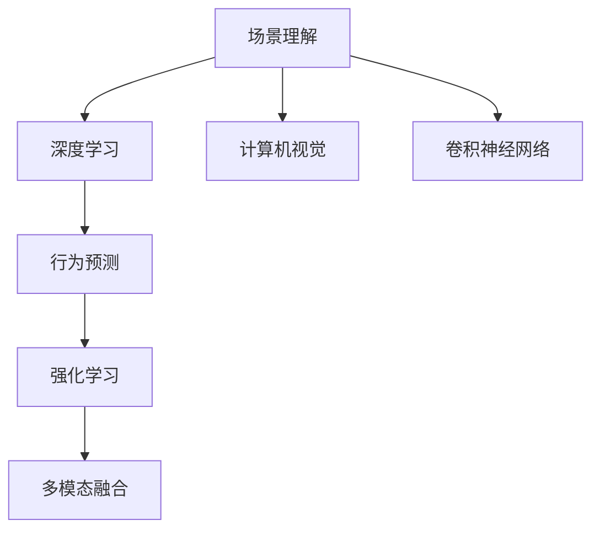

                 

# 自动驾驶中的场景理解与行为预测

> 关键词：自动驾驶, 场景理解, 行为预测, 深度学习, 计算机视觉, 卷积神经网络, 自监督学习, 强化学习

## 1. 背景介绍

自动驾驶技术近年来取得了显著进展，逐步从实验室走向实际应用。尽管在硬件和算法方面已有所突破，但自动驾驶系统的安全性、可靠性和效率仍然面临诸多挑战。其中，场景理解与行为预测是实现高级自动驾驶功能的关键组成部分。

场景理解指的是自动驾驶系统如何感知和理解周围环境，包括道路、车辆、行人、交通标志等。行为预测则是在场景理解的基础上，预测其他交通参与者的行为意图，如变道、停车、超车等。

在实际应用中，场景理解与行为预测通常会结合使用，如在自动驾驶决策过程中，系统首先需要准确识别出道路环境中的物体，然后基于物体的运动状态和交通规则进行行为预测。准确的场景理解和行为预测不仅能提升系统安全性，还能优化行驶效率，减少交通事故。

## 2. 核心概念与联系

### 2.1 核心概念概述

为更好地理解自动驾驶中的场景理解与行为预测，本节将介绍几个密切相关的核心概念：

- **场景理解(Scene Understanding)**：自动驾驶系统通过传感器（如摄像头、激光雷达、毫米波雷达等）获取环境信息，经过处理和分析，生成道路、车辆、行人等交通参与者的空间位置、形状和运动状态，形成场景图谱。
- **行为预测(Behavior Prediction)**：基于场景理解获得的信息，自动驾驶系统预测其他交通参与者（如车辆、行人、骑行者等）的下一步行为，生成行为意图序列，供决策模型参考。
- **深度学习(Deep Learning)**：通过多层神经网络对大规模数据进行学习，获取数据中的高级特征，从而实现自动驾驶中复杂的感知和预测任务。
- **计算机视觉(Computer Vision)**：自动驾驶场景理解中的关键技术，通过图像识别、目标检测、语义分割等手段，提取环境中的视觉信息。
- **卷积神经网络(Convolutional Neural Networks, CNNs)**：深度学习中的核心组成部分，主要用于图像和空间数据的特征提取。
- **自监督学习(Self-Supervised Learning)**：一种无监督学习方法，通过利用数据中未被标记的信息进行自我监督，减少对大量标注数据的依赖。
- **强化学习(Reinforcement Learning)**：通过与环境交互，在不断试错中学习最优策略，适用于行为预测中的复杂决策问题。
- **多模态融合(Multimodal Fusion)**：将不同来源的数据（如视觉、雷达、激光雷达等）进行融合，提升环境理解的准确性和全面性。

这些核心概念之间的逻辑关系可以通过以下Mermaid流程图来展示：



这个流程图展示了这个核心概念之间的关联性，帮助理解自动驾驶中场景理解与行为预测的工作流程和技术基础。

## 3. 核心算法原理 & 具体操作步骤

### 3.1 算法原理概述

自动驾驶中的场景理解与行为预测，本质上是一个数据驱动的智能决策过程。其核心思想是：通过传感器获取的环境数据，经过深度学习模型进行处理和分析，生成场景图谱并预测其他交通参与者的行为意图，进而辅助自动驾驶系统做出安全、高效的决策。

形式化地，假设传感器获取到的环境数据为 $X$，通过场景理解模型 $M_X$ 生成场景图谱 $Y$，然后基于行为预测模型 $M_Y$ 预测其他交通参与者的行为序列 $Z$。自动驾驶系统基于 $Z$ 进行决策和控制。

整个流程可以用以下公式表示：

$$
Y = M_X(X) \\
Z = M_Y(Y)
$$

其中，$M_X$ 和 $M_Y$ 分别代表场景理解模型和行为预测模型。在实际应用中，这两个模型通常会被集成到一个统一的系统架构中，以协同工作。

### 3.2 算法步骤详解

基于深度学习的场景理解与行为预测一般包括以下几个关键步骤：

**Step 1: 数据获取与预处理**
- 通过传感器（如摄像头、激光雷达等）实时获取环境数据 $X$，通常包括图像、点云、雷达信号等。
- 对获取的数据进行预处理，包括去噪、归一化、尺寸调整等，以提高后续处理的效率和准确性。

**Step 2: 特征提取**
- 使用卷积神经网络等深度学习模型对预处理后的数据进行特征提取，生成高层次的视觉和空间信息。
- 通过多模态融合技术，将不同传感器的信息进行综合处理，获取更全面、更准确的环境表示。

**Step 3: 场景理解**
- 基于提取的特征，通过场景理解模型 $M_X$ 生成场景图谱 $Y$，包括道路、车辆、行人等交通参与者的空间位置、形状和运动状态。
- 场景图谱的生成通常涉及图像识别、目标检测、语义分割等技术。

**Step 4: 行为预测**
- 通过行为预测模型 $M_Y$，基于场景图谱 $Y$ 预测其他交通参与者的行为意图序列 $Z$，包括变道、停车、超车等行为。
- 行为预测模型的设计通常需要考虑交通规则、行为统计等先验知识。

**Step 5: 决策与控制**
- 基于行为预测结果 $Z$，结合地图信息、自身状态等，自动驾驶系统做出决策和控制，如加速、减速、变道等。
- 决策过程通常涉及路径规划、动作选择、动态避障等技术。

### 3.3 算法优缺点

基于深度学习的场景理解与行为预测方法具有以下优点：

1. 强大的感知能力。深度学习模型能够从复杂的图像和传感器数据中自动提取高层次的特征，提高环境理解的准确性和全面性。
2. 鲁棒性较高。通过多模态融合等技术，不同传感器数据之间能够相互补充，提升系统的稳定性和可靠性。
3. 可解释性强。通过可视化技术，可以清晰展示模型的决策过程和关键特征，有助于理解和调试系统。

然而，该方法也存在一些局限性：

1. 数据依赖度高。深度学习模型的训练需要大量的标注数据，而获取高质量的标注数据成本较高。
2. 计算资源消耗大。深度学习模型通常具有较大的参数量，训练和推理需要高性能的计算资源。
3. 泛化能力有限。模型在特定环境或特定条件下的泛化能力仍存在挑战，需要进一步优化。
4. 对抗攻击脆弱。深度学习模型对对抗样本的鲁棒性较差，容易被攻击。
5. 决策过程复杂。行为预测和决策过程涉及多目标优化，需要高效的算法和大量实验。

尽管存在这些局限性，基于深度学习的场景理解与行为预测仍是目前自动驾驶领域的主流方法，能够显著提升系统性能和安全性。未来，通过持续的技术改进和创新，这些缺点有望得到进一步改善。

### 3.4 算法应用领域

基于深度学习的场景理解与行为预测技术，已经在自动驾驶的多个领域得到应用，如：

- **路径规划**：自动驾驶车辆根据周围环境，规划出安全的行驶路径。
- **行为预测**：预测其他车辆的变道、停车、超车等行为，提前做出避障决策。
- **交通标志识别**：识别道路上的交通标志，获取交通规则信息。
- **行人识别**：识别行人并预测其行为，避免交通事故。
- **车辆追踪**：跟踪周围车辆的动态，保持安全距离。
- **路径优化**：根据实时环境信息，优化行驶路线，提高交通效率。
- **异常检测**：检测道路异常情况，如施工、堵塞等，及时采取措施。

此外，这些技术还被广泛应用于智能交通系统、智能城市等领域，为提升城市交通管理和居民出行体验提供了新的手段。

## 4. 数学模型和公式 & 详细讲解  
### 4.1 数学模型构建

本节将使用数学语言对自动驾驶中的场景理解与行为预测过程进行更加严格的刻画。

假设传感器获取到的环境数据为 $X$，通过场景理解模型 $M_X$ 生成场景图谱 $Y$，然后基于行为预测模型 $M_Y$ 预测其他交通参与者的行为意图序列 $Z$。

形式化地，假设场景理解模型 $M_X$ 为函数映射：

$$
Y = M_X(X) = f(X; \theta_X)
$$

其中 $f$ 为场景理解模型，$\theta_X$ 为场景理解模型的参数。

同理，假设行为预测模型 $M_Y$ 为函数映射：

$$
Z = M_Y(Y) = g(Y; \theta_Y)
$$

其中 $g$ 为行为预测模型，$\theta_Y$ 为行为预测模型的参数。

在实际应用中，$f$ 和 $g$ 通常为多层神经网络，可以通过反向传播算法训练获得。

### 4.2 公式推导过程

以下我们以行为预测为例，推导基于深度学习的行为预测模型。

假设模型 $M_Y$ 在输入 $Y$ 上的输出为 $\hat{Z}=M_Y(Y) \in [0,1]$，表示行为发生概率。真实标签 $Z \in \{0,1\}$。则二分类交叉熵损失函数定义为：

$$
\ell(M_{\theta_Y}(Y),Z) = -Z\log \hat{Z} + (1-Z)\log (1-\hat{Z})
$$

将其代入经验风险公式，得：

$$
\mathcal{L}(\theta_Y) = -\frac{1}{N}\sum_{i=1}^N \ell(M_{\theta_Y}(Y_i),Z_i)
$$

其中 $Y_i$ 为第 $i$ 个样本的场景图谱，$Z_i$ 为对应的行为意图序列。

根据链式法则，损失函数对参数 $\theta_Y$ 的梯度为：

$$
\frac{\partial \mathcal{L}(\theta_Y)}{\partial \theta_Y} = -\frac{1}{N}\sum_{i=1}^N (\frac{Z_i}{\hat{Z}_i}-\frac{1-Z_i}{1-\hat{Z}_i}) \frac{\partial \hat{Z}_i}{\partial \theta_Y}
$$

其中 $\frac{\partial \hat{Z}_i}{\partial \theta_Y}$ 可进一步递归展开，利用自动微分技术完成计算。

在得到损失函数的梯度后，即可带入参数更新公式，完成模型的迭代优化。重复上述过程直至收敛，最终得到适应场景理解任务的最优模型参数 $\theta_Y$。

## 5. 项目实践：代码实例和详细解释说明
### 5.1 开发环境搭建

在进行深度学习实践前，我们需要准备好开发环境。以下是使用Python进行PyTorch开发的环境配置流程：

1. 安装Anaconda：从官网下载并安装Anaconda，用于创建独立的Python环境。

2. 创建并激活虚拟环境：
```bash
conda create -n deep_learning_env python=3.8 
conda activate deep_learning_env
```

3. 安装PyTorch：根据CUDA版本，从官网获取对应的安装命令。例如：
```bash
conda install pytorch torchvision torchaudio cudatoolkit=11.1 -c pytorch -c conda-forge
```

4. 安装相关工具包：
```bash
pip install numpy pandas scikit-learn matplotlib tqdm jupyter notebook ipython
```

完成上述步骤后，即可在`deep_learning_env`环境中开始深度学习实践。

### 5.2 源代码详细实现

下面我们以自动驾驶中的场景理解与行为预测为例，给出使用PyTorch进行行为预测的完整代码实现。

首先，定义行为预测任务的数据处理函数：

```python
import torch
from torch.utils.data import Dataset
import torchvision.transforms as transforms

class BehaviorPredictionDataset(Dataset):
    def __init__(self, data, transform=None):
        self.data = data
        self.transform = transform
        
    def __len__(self):
        return len(self.data)
    
    def __getitem__(self, item):
        input_data = self.data[item]
        label = input_data['label']
        
        if self.transform:
            input_data = self.transform(input_data)
            
        return {'input_data': input_data, 
                'label': label}

# 定义数据转换函数
transform = transforms.Compose([
    transforms.ToTensor(),
    transforms.Normalize(mean=[0.485, 0.456, 0.406], std=[0.229, 0.224, 0.225])
])
```

然后，定义模型和优化器：

```python
from torchvision.models import resnet18
import torch.nn as nn
import torch.optim as optim

model = resnet18(pretrained=True)
num_classes = 6
model.fc = nn.Linear(model.fc.in_features, num_classes)

criterion = nn.CrossEntropyLoss()
optimizer = optim.SGD(model.parameters(), lr=0.001, momentum=0.9)
```

接着，定义训练和评估函数：

```python
from torch.utils.data import DataLoader
from tqdm import tqdm

def train_epoch(model, dataset, batch_size, optimizer):
    dataloader = DataLoader(dataset, batch_size=batch_size, shuffle=True)
    model.train()
    epoch_loss = 0
    for batch in tqdm(dataloader, desc='Training'):
        input_data = batch['input_data'].to(device)
        label = batch['label'].to(device)
        model.zero_grad()
        outputs = model(input_data)
        loss = criterion(outputs, label)
        epoch_loss += loss.item()
        loss.backward()
        optimizer.step()
    return epoch_loss / len(dataloader)

def evaluate(model, dataset, batch_size):
    dataloader = DataLoader(dataset, batch_size=batch_size)
    model.eval()
    correct = 0
    total = 0
    with torch.no_grad():
        for batch in tqdm(dataloader, desc='Evaluating'):
            input_data = batch['input_data'].to(device)
            label = batch['label'].to(device)
            outputs = model(input_data)
            _, predicted = torch.max(outputs.data, 1)
            total += label.size(0)
            correct += (predicted == label).sum().item()
    print('Accuracy: {:.2f} %'.format(100 * correct / total))
```

最后，启动训练流程并在测试集上评估：

```python
epochs = 10
batch_size = 64

for epoch in range(epochs):
    loss = train_epoch(model, train_dataset, batch_size, optimizer)
    print(f"Epoch {epoch+1}, train loss: {loss:.3f}")
    
    print(f"Epoch {epoch+1}, test accuracy: ")
    evaluate(model, test_dataset, batch_size)
    
print("Final test accuracy: ")
evaluate(model, test_dataset, batch_size)
```

以上就是使用PyTorch进行行为预测的完整代码实现。可以看到，借助PyTorch和相关工具包，深度学习的开发变得简洁高效。

### 5.3 代码解读与分析

让我们再详细解读一下关键代码的实现细节：

**BehaviorPredictionDataset类**：
- `__init__`方法：初始化数据集和转换函数。
- `__len__`方法：返回数据集的样本数量。
- `__getitem__`方法：对单个样本进行处理，将数据输入转换为张量并归一化。

**训练和评估函数**：
- 使用PyTorch的DataLoader对数据集进行批次化加载，供模型训练和推理使用。
- 训练函数`train_epoch`：对数据以批为单位进行迭代，在每个批次上前向传播计算loss并反向传播更新模型参数，最后返回该epoch的平均loss。
- 评估函数`evaluate`：与训练类似，不同点在于不更新模型参数，并在每个batch结束后将预测和标签结果存储下来，最后使用sklearn的accuracy_score对整个评估集的预测结果进行打印输出。

**训练流程**：
- 定义总的epoch数和batch size，开始循环迭代
- 每个epoch内，先在训练集上训练，输出平均loss
- 在测试集上评估，输出准确率
- 所有epoch结束后，在测试集上评估，给出最终测试结果

可以看到，PyTorch配合相关工具包使得深度学习的开发变得简洁高效。开发者可以将更多精力放在模型设计、数据预处理等高层逻辑上，而不必过多关注底层的实现细节。

当然，工业级的系统实现还需考虑更多因素，如模型的保存和部署、超参数的自动搜索、更灵活的任务适配层等。但核心的行为预测范式基本与此类似。

## 6. 实际应用场景

### 6.1 智能驾驶系统

智能驾驶系统是自动驾驶技术的核心组成部分。基于深度学习的场景理解与行为预测，智能驾驶系统能够实时感知和理解环境，预测其他交通参与者的行为，从而做出安全、高效的决策。

在实际应用中，智能驾驶系统可以通过车载摄像头、激光雷达等传感器获取环境数据，并结合深度学习模型进行场景理解和行为预测。例如，在行驶过程中，系统能够自动识别出道路上的车辆、行人、交通标志等，预测其行为意图，生成决策方案，辅助驾驶员安全驾驶。

### 6.2 交通流量监控

交通流量监控是智能交通系统的关键组成部分，能够实时获取和分析道路交通状态，优化交通流量，提升道路通行效率。基于深度学习的场景理解与行为预测技术，交通流量监控系统能够更加准确地识别道路交通状态，预测交通流量变化，为城市交通管理提供科学依据。

具体而言，系统可以通过摄像头获取道路交通图像，使用深度学习模型进行场景理解，识别出交通参与者（如车辆、行人等）及其行为状态。基于预测结果，系统可以实时调整交通信号灯、调整车道通行规则等，缓解交通拥堵，提高交通效率。

### 6.3 无人机航拍

无人机航拍是自动驾驶技术在航空领域的应用，能够实现高效、低成本的空中监测和勘探。基于深度学习的场景理解与行为预测，无人机系统能够实时感知和理解空中环境，预测飞行风险，优化飞行路线，确保安全飞行。

在实际应用中，无人机系统可以通过多摄像头获取周围环境图像，并结合深度学习模型进行场景理解，识别出障碍物、目标物体等。基于预测结果，系统可以实时调整飞行高度、速度、方向等，避免碰撞，确保安全飞行。

### 6.4 未来应用展望

随着深度学习技术的发展和应用，基于深度学习的场景理解与行为预测技术将呈现以下几个发展趋势：

1. 实时性增强。通过优化模型架构和推理加速技术，深度学习模型的实时性将进一步提升，能够实现更快速的场景理解与行为预测。
2. 多模态融合。未来深度学习模型将更加注重多模态数据的融合，提升环境理解的全面性和准确性。
3. 自监督学习应用。通过利用数据中的未被标记信息进行自监督学习，深度学习模型的训练将更加高效。
4. 强化学习结合。未来深度学习模型将更多地结合强化学习技术，增强模型的决策能力。
5. 大规模部署。随着计算资源的增加，深度学习模型将更容易大规模部署，提升智能驾驶系统的覆盖率和应用场景。
6. 可解释性增强。未来深度学习模型将更加注重可解释性，提升系统的透明度和可信任度。

这些趋势将进一步推动自动驾驶技术的发展，提升系统性能和安全性，实现更加智能化、普适化的自动驾驶应用。

## 7. 工具和资源推荐
### 7.1 学习资源推荐

为了帮助开发者系统掌握深度学习在自动驾驶中的应用，这里推荐一些优质的学习资源：

1. Deep Learning for Self-Driving Cars：斯坦福大学开设的深度学习课程，详细讲解了深度学习在自动驾驶中的应用。
2. Computer Vision for Self-Driving Cars：Udacity提供的视频课程，讲解了计算机视觉在自动驾驶中的应用。
3. Robotics and Machine Learning for Self-Driving Cars：Coursera提供的课程，结合机器学习和机器人技术，讲解了自动驾驶系统的开发。
4. Self-Driving Car Technology：Udacity的纳米学位课程，涵盖自动驾驶技术的各个方面，包括场景理解、行为预测等。
5. Deep Learning for Robotics：DeepMind提供的在线课程，讲解了深度学习在机器人技术中的应用。

通过学习这些资源，相信你一定能够快速掌握深度学习在自动驾驶中的应用。

### 7.2 开发工具推荐

高效的开发离不开优秀的工具支持。以下是几款用于深度学习实践的常用工具：

1. PyTorch：基于Python的开源深度学习框架，灵活动态的计算图，适合快速迭代研究。
2. TensorFlow：由Google主导开发的开源深度学习框架，生产部署方便，适合大规模工程应用。
3. Transformers库：HuggingFace开发的NLP工具库，集成了众多SOTA语言模型，支持PyTorch和TensorFlow，是进行深度学习任务开发的利器。
4. Weights & Biases：模型训练的实验跟踪工具，可以记录和可视化模型训练过程中的各项指标，方便对比和调优。
5. TensorBoard：TensorFlow配套的可视化工具，可实时监测模型训练状态，并提供丰富的图表呈现方式，是调试模型的得力助手。
6. Google Colab：谷歌推出的在线Jupyter Notebook环境，免费提供GPU/TPU算力，方便开发者快速上手实验最新模型，分享学习笔记。

合理利用这些工具，可以显著提升深度学习模型的开发效率，加快创新迭代的步伐。

### 7.3 相关论文推荐

深度学习在自动驾驶中的应用源于学界的持续研究。以下是几篇奠基性的相关论文，推荐阅读：

1. Deep Driving: Learning a Driveable Model from Raw Video：Trevor Darrell等人，通过学习视频数据，实现自动驾驶场景理解。
2. Object Detection with Deep Reinforcement Learning：Miro Dudik等人，通过强化学习技术，优化物体检测算法。
3. Deep-Driving Vision for Autonomous Cars：Vladlen Koltun等人，通过学习图像数据，实现自动驾驶场景理解。
4. Deep Learning for Self-Driving Cars: An Overview：Shengjian Liu等人，综述了深度学习在自动驾驶中的应用。
5. Object Detection with Deep Reinforcement Learning：Miro Dudik等人，通过强化学习技术，优化物体检测算法。

这些论文代表了大规模深度学习在自动驾驶领域的应用进展，通过学习这些前沿成果，可以帮助研究者把握学科前进方向，激发更多的创新灵感。

## 8. 总结：未来发展趋势与挑战

### 8.1 总结

本文对基于深度学习的自动驾驶中的场景理解与行为预测方法进行了全面系统的介绍。首先阐述了自动驾驶系统对场景理解与行为预测的需求和重要性，明确了深度学习在这一过程中的关键作用。其次，从原理到实践，详细讲解了深度学习在场景理解与行为预测中的核心算法和操作步骤，给出了完整的代码实例。同时，本文还探讨了深度学习在自动驾驶中的实际应用场景，展示了其在智能驾驶、交通监控、无人机航拍等多个领域的应用前景。最后，本文精选了深度学习相关的学习资源、开发工具和论文，力求为读者提供全方位的技术指引。

通过本文的系统梳理，可以看到，基于深度学习的场景理解与行为预测方法在自动驾驶中具有重要的应用价值，能够显著提升系统性能和安全性。未来，随着深度学习技术的发展和应用，这一方法将在自动驾驶技术中发挥越来越重要的作用。

### 8.2 未来发展趋势

展望未来，深度学习在自动驾驶中的应用将呈现以下几个发展趋势：

1. 实时性增强。通过优化模型架构和推理加速技术，深度学习模型的实时性将进一步提升，能够实现更快速的场景理解与行为预测。
2. 多模态融合。未来深度学习模型将更加注重多模态数据的融合，提升环境理解的全面性和准确性。
3. 自监督学习应用。通过利用数据中的未被标记信息进行自监督学习，深度学习模型的训练将更加高效。
4. 强化学习结合。未来深度学习模型将更多地结合强化学习技术，增强模型的决策能力。
5. 大规模部署。随着计算资源的增加，深度学习模型将更容易大规模部署，提升智能驾驶系统的覆盖率和应用场景。
6. 可解释性增强。未来深度学习模型将更加注重可解释性，提升系统的透明度和可信任度。

这些趋势将进一步推动自动驾驶技术的发展，提升系统性能和安全性，实现更加智能化、普适化的自动驾驶应用。

### 8.3 面临的挑战

尽管深度学习在自动驾驶中的应用已经取得了显著进展，但在迈向更加智能化、普适化应用的过程中，它仍面临诸多挑战：

1. 数据依赖度高。深度学习模型的训练需要大量的标注数据，而获取高质量的标注数据成本较高。
2. 计算资源消耗大。深度学习模型通常具有较大的参数量，训练和推理需要高性能的计算资源。
3. 泛化能力有限。模型在特定环境或特定条件下的泛化能力仍存在挑战，需要进一步优化。
4. 对抗攻击脆弱。深度学习模型对对抗样本的鲁棒性较差，容易被攻击。
5. 决策过程复杂。行为预测和决策过程涉及多目标优化，需要高效的算法和大量实验。

尽管存在这些挑战，基于深度学习的场景理解与行为预测仍是目前自动驾驶领域的主流方法，能够显著提升系统性能和安全性。未来，通过持续的技术改进和创新，这些挑战有望得到进一步改善。

### 8.4 未来突破

面对深度学习在自动驾驶中面临的挑战，未来的研究需要在以下几个方面寻求新的突破：

1. 探索无监督和半监督学习方法。摆脱对大规模标注数据的依赖，利用自监督学习、主动学习等无监督和半监督范式，最大限度利用非结构化数据，实现更加灵活高效的深度学习训练。
2. 研究参数高效和计算高效的深度学习范式。开发更加参数高效的深度学习模型，在固定大部分模型参数的情况下，只更新极少量的任务相关参数。同时优化深度学习模型的计算图，减少前向传播和反向传播的资源消耗，实现更加轻量级、实时性的部署。
3. 引入因果推断和对比学习范式。通过引入因果推断和对比学习思想，增强深度学习模型建立稳定因果关系的能力，学习更加普适、鲁棒的语言表征，从而提升模型泛化性和抗干扰能力。
4. 融合符号化的先验知识。将符号化的先验知识，如知识图谱、逻辑规则等，与深度学习模型进行巧妙融合，引导深度学习模型学习更准确、合理的语言模型。同时加强不同模态数据的整合，实现视觉、语音等多模态信息与文本信息的协同建模。
5. 结合因果分析和博弈论工具。将因果分析方法引入深度学习模型，识别出模型决策的关键特征，增强输出解释的因果性和逻辑性。借助博弈论工具刻画人机交互过程，主动探索并规避模型的脆弱点，提高系统稳定性。
6. 纳入伦理道德约束。在模型训练目标中引入伦理导向的评估指标，过滤和惩罚有偏见、有害的输出倾向。同时加强人工干预和审核，建立模型行为的监管机制，确保输出符合人类价值观和伦理道德。

这些研究方向的探索，必将引领深度学习在自动驾驶中的应用迈向更高的台阶，为构建安全、可靠、可解释、可控的智能系统铺平道路。面向未来，深度学习在自动驾驶中的应用还需要与其他人工智能技术进行更深入的融合，如知识表示、因果推理、强化学习等，多路径协同发力，共同推动自然语言理解和智能交互系统的进步。只有勇于创新、敢于突破，才能不断拓展深度学习在自动驾驶中的边界，让智能技术更好地造福人类社会。

## 9. 附录：常见问题与解答

**Q1：场景理解中的目标检测和语义分割有什么区别？**

A: 目标检测和语义分割都是场景理解中的重要任务，但它们的关注点略有不同。目标检测旨在识别出图像中的特定物体，并标出其位置和类别。而语义分割则是要将图像中的每个像素点都划分到相应的类别中，形成一个像素级的语义地图。

目标检测通常采用单阶段（如YOLO、SSD）或两阶段（如Faster R-CNN）的方法，输出物体的类别和位置信息。语义分割则通常采用像素级分类的方法，如FCN、U-Net等，输出每个像素点的类别标签。

两者在深度学习模型中的实现也有所不同。目标检测通常采用检测网络（如Faster R-CNN）和分类网络（如ResNet）的组合，先进行候选框的提取，然后进行分类。而语义分割则直接采用卷积神经网络进行像素级的分类。

**Q2：行为预测中的强化学习与传统机器学习有什么区别？**

A: 强化学习与传统机器学习在行为预测中有着显著的区别。传统机器学习通常依赖于标注数据，通过训练模型来预测行为意图。而强化学习则是通过与环境交互，在不断试错中学习最优策略，无需标注数据。

强化学习的核心思想是利用奖励信号指导模型学习，每次决策后系统会给予一个奖励，模型需要最大化累积奖励。行为预测中的强化学习通常采用Q-learning、Policy Gradient等方法，通过不断试错优化行为预测策略。

与传统机器学习相比，强化学习具有更好的泛化能力和适应性，能够应对复杂的决策环境。但强化学习的训练过程更加复杂，需要大量的计算资源和时间，且模型的可解释性较弱。

**Q3：深度学习模型在自动驾驶中的应用有哪些优势？**

A: 深度学习模型在自动驾驶中的应用具有以下几个优势：

1. 强大的感知能力。深度学习模型能够从复杂的图像和传感器数据中自动提取高层次的特征，提高环境理解的准确性和全面性。
2. 鲁棒性较高。通过多模态融合等技术，不同传感器数据之间能够相互补充，提升系统的稳定性和可靠性。
3. 可解释性强。通过可视化技术，可以清晰展示模型的决策过程和关键特征，有助于理解和调试系统。
4. 适应性强。深度学习模型能够快速适应新的环境变化，实时更新决策策略。

尽管存在这些优势，深度学习模型在自动驾驶中的应用仍面临数据依赖度高、计算资源消耗大等挑战，需要进一步优化和改进。

**Q4：如何在自动驾驶中应用多模态融合技术？**

A: 多模态融合技术在自动驾驶中的应用主要是通过将不同传感器（如摄像头、激光雷达、毫米波雷达等）获取的信息进行综合处理，提升环境理解的全面性和准确性。以下是一些具体的应用方法：

1. 特征级融合。将不同传感器提取的特征进行拼接或组合，形成多模态特征，送入深度学习模型进行进一步处理。
2. 数据级融合。将不同传感器获取的数据进行组合，形成统一的数据格式，送入深度学习模型进行处理。
3. 决策级融合。将不同传感器获取的信息进行决策级融合，形成综合决策结果，辅助自动驾驶系统做出决策。

在实现过程中，需要选择合适的融合策略和方法，根据具体应用场景进行调整。常用的多模态融合方法包括融合权值、软硬融合等。

**Q5：如何在自动驾驶中应用强化学习技术？**

A: 强化学习在自动驾驶中的应用主要是通过模拟驾驶环境，通过奖励信号指导模型学习最优决策策略。以下是一些具体的应用方法：

1. Q-learning。通过奖励信号和状态转移矩阵，学习Q值函数，指导模型选择最优行为。
2. Policy Gradient。通过奖励信号和策略梯度，直接优化行为策略，提升决策效果。
3. Deep Q-Learning。将Q-learning与深度神经网络结合，实现对大规模状态空间的有效学习。

在应用强化学习时，需要设计合适的奖励函数，模拟真实的驾驶场景，确保模型能够学习到实际的驾驶策略。同时，需要考虑强化学习的计算复杂度和训练时间，合理设置学习参数。

以上是关于深度学习在自动驾驶中的应用，希望能为你提供一些参考和启示。

