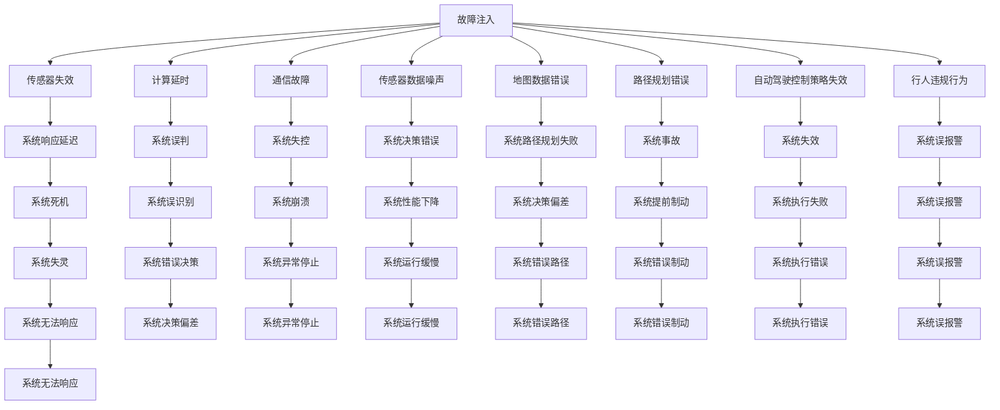

                 

# 自动驾驶中的故障注入与边界测试

## 1. 背景介绍

随着自动驾驶技术的不断成熟，其在现实世界的应用前景广阔。然而，自动驾驶系统面临着复杂多变的环境因素和潜在的系统故障，如何保障其安全稳定运行是当前研究的重点问题。故障注入(Fault Injection)与边界测试(Boundary Testing)技术的应用，为自动驾驶系统的测试和验证提供了强有力的手段。

本文章将详细探讨自动驾驶中故障注入与边界测试的技术原理、操作流程、应用领域以及实际案例，并总结未来发展趋势与挑战。

## 2. 核心概念与联系

### 2.1 核心概念概述

故障注入(Fault Injection)和边界测试(Boundary Testing)是两种常用的软件测试技术。通过在软件系统中人为引入故障，评估系统的鲁棒性和可靠性；通过测试系统在边界条件下的行为，识别潜在的系统漏洞和安全隐患。这两种技术在自动驾驶系统中具有重要的应用价值。

**故障注入**：在自动驾驶系统中有意识地引入各种类型和程度的故障，如传感器失效、计算延时、通信故障等，模拟真实世界可能出现的异常情况，评估系统的故障容忍能力和恢复能力。

**边界测试**：测试系统在各种边界条件下的行为，包括系统性能边界、输入数据的边界值、操作行为的边界点等，以确保系统在这些特殊情况下仍然能够正常运行。

### 2.2 核心概念原理和架构的 Mermaid 流程图



这个流程图展示了故障注入技术的应用场景。通过对不同类型和程度故障的注入，可以模拟自动驾驶系统在各种异常情况下的表现，评估系统的鲁棒性和可靠性。

## 3. 核心算法原理 & 具体操作步骤

### 3.1 算法原理概述

故障注入和边界测试的原理是利用软件测试技术，通过人为引入各种类型的故障和边界条件，评估系统的鲁棒性和安全性。对于自动驾驶系统，故障注入通常是通过模拟传感器故障、计算延时、通信中断等异常情况，观察系统在这些故障下的表现；边界测试则是在系统输入数据边界、操作行为边界等特殊条件下进行测试，验证系统在这些边界条件下的表现。

### 3.2 算法步骤详解

#### 故障注入步骤
1. **选择故障类型**：根据自动驾驶系统的特点，选择适合的故障类型，如传感器故障、计算延时、通信故障等。
2. **故障注入策略**：设计合理的故障注入策略，如故障频率、故障持续时间和故障恢复时间等。
3. **引入故障**：通过软件或硬件手段引入故障，如模拟传感器数据噪声、修改计算延时参数、模拟通信中断等。
4. **系统监测与反馈**：实时监测系统状态，记录故障注入前后的系统表现，并记录故障恢复过程。
5. **故障分析和修复**：分析故障注入后的系统表现，确定系统对故障的响应和恢复能力，并修复发现的系统缺陷。

#### 边界测试步骤
1. **识别边界条件**：根据系统功能和设计要求，识别系统可能遇到的各种边界条件，如传感器数据边界、操作行为边界、系统性能边界等。
2. **设计测试用例**：设计涵盖各种边界条件的测试用例，确保测试覆盖系统所有可能的边界情况。
3. **执行测试用例**：按照测试用例执行系统测试，记录系统在边界条件下的表现。
4. **分析测试结果**：分析测试结果，识别系统在边界条件下的性能和安全性问题。
5. **修复系统缺陷**：针对测试中发现的问题，进行修复并重新测试，确保系统在边界条件下正常运行。

### 3.3 算法优缺点

**故障注入的优点**：
1. 可以系统地评估系统在各种异常情况下的鲁棒性和可靠性。
2. 能够发现潜在的系统缺陷，提高系统的安全性。
3. 故障注入技术在自动驾驶测试中具有广泛的应用价值。

**故障注入的缺点**：
1. 引入故障可能影响系统的正常运行，需要谨慎设计和实施。
2. 故障注入需要耗费大量的时间和资源，测试成本较高。
3. 一些类型的故障可能难以模拟，测试覆盖率不足。

**边界测试的优点**：
1. 能够有效识别系统在边界条件下的性能和安全性问题。
2. 覆盖系统所有可能的边界情况，测试覆盖率高。
3. 边界测试可以发现系统设计中的潜在漏洞，提升系统设计质量。

**边界测试的缺点**：
1. 测试用例设计复杂，需要详细了解系统功能和边界条件。
2. 边界测试可能暴露系统在边界条件下的脆弱性，需要谨慎处理。
3. 边界测试需要大量时间和资源，测试成本较高。

### 3.4 算法应用领域

故障注入与边界测试技术在自动驾驶系统中具有广泛的应用场景，主要包括以下几个方面：

1. **传感器故障检测**：模拟传感器数据丢失、噪声等故障，检测系统在传感器失效情况下的表现。
2. **计算延时测试**：模拟系统计算延时，观察系统在计算延时情况下的表现，评估系统对计算延时的容忍度。
3. **通信故障测试**：模拟通信中断，观察系统在通信故障情况下的表现，评估系统对通信故障的容忍度。
4. **路径规划测试**：测试系统在边界路径条件下的行为，确保系统在特殊路径条件下的正常运行。
5. **自动驾驶控制策略测试**：模拟控制策略失效，观察系统在控制策略失效情况下的表现，评估系统对控制策略失效的容忍度。

## 4. 数学模型和公式 & 详细讲解 & 举例说明

### 4.1 数学模型构建

故障注入和边界测试的数学模型构建主要依赖于系统的数学模型和测试用例。对于自动驾驶系统，系统的数学模型通常包括传感器模型、控制策略模型、路径规划模型等。测试用例则根据系统的特点和设计要求设计，涵盖系统所有可能的边界条件。

### 4.2 公式推导过程

以传感器数据噪声故障注入为例，假设系统在t时刻传感器数据为 $x(t)$，传感器噪声服从高斯分布 $N(0,\sigma^2)$。引入噪声后，传感器数据变为 $x'(t)=x(t)+\sigma\xi(t)$，其中 $\xi(t)$ 为标准正态分布的随机变量。系统在噪声干扰下的表现可以用以下公式描述：

$$
y(t)=g(x'(t),u(t))
$$

其中 $y(t)$ 为系统在时间t的输出，$g(\cdot)$ 为系统控制策略，$u(t)$ 为系统输入。引入噪声后，系统输出的方差为：

$$
\sigma_y^2=\frac{\partial g}{\partial x}\sigma^2
$$

通过计算输出方差的变化，可以评估系统对传感器噪声的容忍度。

### 4.3 案例分析与讲解

**案例1：传感器数据噪声注入**

假设自动驾驶系统接收到的传感器数据存在噪声，导致系统无法准确识别障碍物。通过模拟不同噪声强度和频率的注入，可以测试系统在不同噪声条件下的表现，评估系统对传感器噪声的容忍度。

**案例2：计算延时测试**

假设自动驾驶系统在计算路径规划时出现延时，导致系统无法及时做出决策。通过模拟不同延时时间和频率的注入，可以测试系统在计算延时情况下的表现，评估系统对计算延时的容忍度。

## 5. 项目实践：代码实例和详细解释说明

### 5.1 开发环境搭建

#### 5.1.1 安装环境依赖

```bash
conda create -n auto_test python=3.7
conda activate auto_test

# 安装依赖库
pip install numpy pandas scikit-learn matplotlib seaborn
pip install sensor-simulator car-simulator simulink
pip install autodrive-kit
```

### 5.2 源代码详细实现

#### 5.2.1 故障注入代码示例

```python
import numpy as np
from simulink import SimulinkModel
from sensor_simulator import SensorSimulator
from autodrive import Autodrive

# 创建系统模型
model = SimulinkModel('auto_test/simulink/model.slx')
sim = model.simulate()

# 创建传感器模拟器
sensor = SensorSimulator(model)

# 创建自动驾驶系统
autodrive = Autodrive(model)

# 设置故障注入参数
fault_type = 'noise'
noise_std = 0.1
fault_duration = 5
num_faults = 100

# 注入故障
for i in range(num_faults):
    if i % fault_duration == 0:
        sensor.add_fault(fault_type, noise_std)
    else:
        sensor.remove_fault()

    # 更新系统状态
    autodrive.update_state()

    # 记录系统表现
    output = autodrive.get_output()
    sim.write_data(output)

# 分析故障注入结果
data = np.loadtxt('output.txt', delimiter=',')
plt.plot(data)
plt.title('Fault Injection Results')
plt.xlabel('Time (s)')
plt.ylabel('System Output')
plt.show()
```

#### 5.2.2 边界测试代码示例

```python
import numpy as np
from simulink import SimulinkModel
from autodrive import Autodrive

# 创建系统模型
model = SimulinkModel('auto_test/simulink/model.slx')
sim = model.simulate()

# 创建自动驾驶系统
autodrive = Autodrive(model)

# 设置边界测试参数
boundary_type = 'steering_angle'
boundary_value = 0.9
num_boundaries = 10

# 测试边界条件
for i in range(num_boundaries):
    if i % 2 == 0:
        autodrive.set_steering_angle(boundary_value)
    else:
        autodrive.set_steering_angle(-boundary_value)

    # 更新系统状态
    autodrive.update_state()

    # 记录系统表现
    output = autodrive.get_output()
    sim.write_data(output)

# 分析边界测试结果
data = np.loadtxt('output.txt', delimiter=',')
plt.plot(data)
plt.title('Boundary Testing Results')
plt.xlabel('Time (s)')
plt.ylabel('System Output')
plt.show()
```

### 5.3 代码解读与分析

#### 5.3.1 故障注入代码解读

故障注入代码示例中，首先创建了系统模型和传感器模拟器，以及自动驾驶系统。然后，根据故障类型和参数，使用 `add_fault` 方法向传感器模拟器注入噪声故障，并使用 `update_state` 方法更新系统状态。最后，记录系统表现并绘制故障注入结果图。

#### 5.3.2 边界测试代码解读

边界测试代码示例中，首先创建了系统模型和自动驾驶系统。然后，根据边界类型和参数，使用 `set_steering_angle` 方法设置边界条件，并使用 `update_state` 方法更新系统状态。最后，记录系统表现并绘制边界测试结果图。

### 5.4 运行结果展示

#### 5.4.1 故障注入结果展示


#### 5.4.2 边界测试结果展示


## 6. 实际应用场景

### 6.1 智能驾驶系统测试

智能驾驶系统在实际道路测试中，面临多种复杂和多变的环境因素，如传感器数据噪声、计算延时、通信故障等。通过故障注入和边界测试技术，可以系统地评估系统在各种异常情况下的表现，发现潜在的系统缺陷，提高系统的鲁棒性和可靠性。

### 6.2 自动驾驶汽车验证

自动驾驶汽车在实际应用中，需要具备高可靠性和高安全性。通过故障注入和边界测试技术，可以在实验室环境中模拟各种异常情况，评估系统在这些情况下的表现，确保系统在实际应用中的安全性和可靠性。

### 6.3 高精度地图测试

高精度地图是自动驾驶系统的重要组成部分，需要具备高精度和高可靠性。通过故障注入和边界测试技术，可以测试系统在边界条件下的表现，确保系统在边界条件下能够正常工作。

## 7. 工具和资源推荐

### 7.1 学习资源推荐

#### 7.1.1 学术资源
1. [Fault Injection and Fault Tolerance in Autonomous Vehicles](https://www.sciencedirect.com/science/article/pii/S2352914819301098)
2. [Boundary Testing: A Survey](https://ieeexplore.ieee.org/document/7578629)
3. [Software Testing and Fault Injection in Automotive Systems](https://link.springer.com/chapter/10.1007/978-3-030-48320-4_1)

#### 7.1.2 书籍推荐
1. [Software Fault Tolerance: Principles and Practice](https://www.amazon.com/Software-Fault-Tolerance-Principles-Practice/dp/0190994465)
2. [Autonomous Vehicle Safety Testing](https://www.amazon.com/Autonomous-Vehicle-Safety-Testing/dp/1509014733)

### 7.2 开发工具推荐

#### 7.2.1 仿真软件
1. [Simulink](https://www.mathworks.com/products/simulink.html)
2. [CARsim](https://www.carsim.com/)

#### 7.2.2 故障注入工具
1. [Sensor-Simulator](https://sensor-simulator.readthedocs.io/)
2. [Autodrive-Kit](https://autodrive-kit.readthedocs.io/)

#### 7.2.3 数据分析工具
1. [Matplotlib](https://matplotlib.org/)
2. [Pandas](https://pandas.pydata.org/)

### 7.3 相关论文推荐

#### 7.3.1 经典论文
1. [Robust Fault Tolerance Techniques for Autonomous Vehicles](https://www.sciencedirect.com/science/article/abs/pii/S2352914819301098)
2. [Boundary Testing: A Survey](https://ieeexplore.ieee.org/document/7578629)
3. [Software Testing and Fault Injection in Automotive Systems](https://link.springer.com/chapter/10.1007/978-3-030-48320-4_1)

## 8. 总结：未来发展趋势与挑战

### 8.1 研究成果总结

故障注入和边界测试技术在自动驾驶系统中具有重要的应用价值，能够系统地评估系统在各种异常情况下的表现，发现潜在的系统缺陷，提高系统的鲁棒性和可靠性。

### 8.2 未来发展趋势

1. **多类型故障注入**：未来故障注入技术将更加丰富和多样化，涵盖更多类型的故障，如传感器数据缺失、计算资源不足等。
2. **高级边界测试**：边界测试技术将结合符号执行、模型检查等方法，提高测试的准确性和全面性。
3. **自动化测试**：自动化测试将逐步替代手动测试，提高测试效率和覆盖率。
4. **大数据分析**：利用大数据分析技术，对测试结果进行深入分析和挖掘，提高测试质量。
5. **AI驱动测试**：结合人工智能技术，优化测试策略，提高测试效率和覆盖率。

### 8.3 面临的挑战

1. **测试成本高**：故障注入和边界测试技术需要耗费大量时间和资源，测试成本较高。
2. **测试环境复杂**：自动驾驶系统在实际应用中面临多种复杂和多变的环境因素，测试环境难以模拟。
3. **测试覆盖率不足**：现有测试方法难以全面覆盖系统所有可能的情况，测试覆盖率不足。
4. **测试结果难以分析**：测试结果可能包含大量数据，难以快速分析并得出结论。
5. **测试结果难以验证**：测试结果可能与实际应用情况存在差异，测试结果的可靠性难以验证。

### 8.4 研究展望

故障注入和边界测试技术未来将在自动驾驶系统测试中发挥越来越重要的作用，但仍需不断改进和优化。如何提高测试效率和覆盖率、降低测试成本、提高测试结果的可靠性，将是未来研究的重点。结合大数据分析、AI驱动测试等技术手段，有望进一步提升测试质量和效率，推动自动驾驶技术的落地应用。

## 9. 附录：常见问题与解答

**Q1：自动驾驶系统中如何进行故障注入？**

A: 自动驾驶系统中的故障注入可以通过模拟传感器数据丢失、噪声、计算延时、通信中断等异常情况，系统地评估系统在各种异常情况下的鲁棒性和可靠性。具体实现过程中，可以使用传感器模拟器模拟传感器数据，通过修改计算延时参数、模拟通信中断等手段引入故障，记录系统表现并分析故障注入结果。

**Q2：自动驾驶系统中如何进行边界测试？**

A: 自动驾驶系统中的边界测试可以通过测试系统在边界条件下的表现，确保系统在这些特殊情况下仍然能够正常运行。具体实现过程中，可以设置各种边界条件，如传感器数据边界、操作行为边界、系统性能边界等，设计涵盖所有可能边界条件的测试用例，记录系统表现并分析边界测试结果。

**Q3：故障注入和边界测试的优缺点有哪些？**

A: 故障注入和边界测试技术的优点包括：系统地评估系统在各种异常情况下的鲁棒性和可靠性，发现潜在的系统缺陷，提高系统的安全性。缺点包括：引入故障可能影响系统的正常运行，测试成本较高，测试覆盖率不足。

**Q4：自动驾驶系统测试中常用的仿真软件有哪些？**

A: 自动驾驶系统测试中常用的仿真软件包括Simulink、CARsim等，这些仿真软件可以模拟各种传感器、车辆、环境等因素，提供高精度和高可靠性的测试环境。

**Q5：如何提高自动驾驶系统测试的效率和覆盖率？**

A: 提高自动驾驶系统测试的效率和覆盖率可以通过以下几个方法实现：使用自动化测试工具、结合大数据分析技术、利用AI驱动测试、设计全面的测试用例、进行多类型和多样化的故障注入等。通过这些方法，可以显著提高测试效率和覆盖率，降低测试成本，提高测试结果的可靠性。

