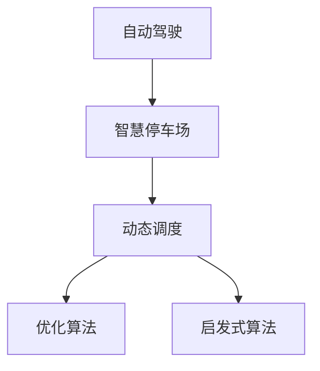

                 

# 自动驾驶中的智慧停车场动态调度算法

> 关键词：自动驾驶,智慧停车场,动态调度,智能交通系统,优化算法,启发式算法

## 1. 背景介绍

### 1.1 问题由来

随着城市化进程的不断加速，车辆保有量激增，城市交通问题日益严重。尤其是在城市中心区域，停车难、停车贵、找车位时间长等问题困扰着市民。而智慧停车系统作为智能交通系统的重要组成部分，能够在一定程度上缓解停车难问题。智慧停车系统通过将车辆信息与停车场资源动态匹配，实现资源的最优利用，提升用户体验，提高停车场的利用率。

自动驾驶技术的快速发展为智慧停车系统带来了新的契机。与传统驾驶方式相比，自动驾驶车辆能够通过高精度地图、传感器等设备，实时获取周围环境信息，进而做出更精确的决策。但在自动驾驶停车场景中，由于车辆数量众多、场景复杂多变，如何实现智慧停车系统的动态调度仍然是一个难题。

### 1.2 问题核心关键点

为解决自动驾驶车辆在智慧停车场的动态调度问题，本文将详细介绍一种基于优化算法的动态调度方法。该方法通过建立多目标优化模型，将停车场的资源利用率、等待时间、车辆行驶距离等指标综合考虑，实现最优的动态调度策略。同时，本文还将结合启发式算法、遗传算法等启发式优化算法，提升调度的效率和精度。

## 2. 核心概念与联系

### 2.1 核心概念概述

为更好地理解自动驾驶中智慧停车场动态调度的算法，本节将介绍几个密切相关的核心概念：

- 自动驾驶(Autonomous Driving)：一种利用人工智能技术实现自主决策和控制车辆的驾驶方式。通过高精度地图、传感器等设备，实现车辆的自主导航和避障。
- 智慧停车系统(Smart Parking System)：利用互联网、传感器、云计算等技术，实现停车资源的动态管理与优化。能够有效提升停车场的利用率和用户体验。
- 动态调度(Dynamic Scheduling)：通过对系统资源的实时分配和调度，实现最优的服务效果。在智慧停车系统中，动态调度能够优化停车资源的利用率，提升车辆的停放效率。
- 优化算法(Optimization Algorithm)：用于解决优化问题的一类算法，如线性规划、整数规划、混合整数规划等。通过求解目标函数和约束条件，实现系统最优解。
- 启发式算法(Heuristic Algorithm)：通过模拟生物进化、自然界规律等启发式策略，快速求解近似最优解的算法。如遗传算法、蚁群算法等。

这些核心概念之间的逻辑关系可以通过以下Mermaid流程图来展示：



这个流程图展示了下游智慧停车系统的核心概念及其之间的关系：

1. 自动驾驶技术为智慧停车系统提供了车辆数据，支持动态调度的实现。
2. 智慧停车系统的动态调度通过优化算法和启发式算法，实现停车资源的优化利用。
3. 优化算法和启发式算法共同作用，提升调度的效果和效率。

这些概念共同构成了自动驾驶中智慧停车场动态调度的算法框架，使其能够通过最优的调度策略，解决自动驾驶车辆在停车场中的停放问题。

## 3. 核心算法原理 & 具体操作步骤
### 3.1 算法原理概述

自动驾驶中智慧停车场的动态调度问题，可以描述为在给定的停车场环境中，对自动驾驶车辆进行路径规划和停放调度，以最小化停车等待时间、最大化停车场的利用率、最小化车辆行驶距离等指标。

形式化地，假设停车场中有 $n$ 个车位，$n$ 个待停车的自动驾驶车辆。车辆的停车路径由 $m$ 个停车场入口、$m$ 个停车场出口组成。定义 $P$ 为车辆进入停车场的概率分布，$O$ 为车辆离开停车场的概率分布。

记车辆进入停车场的时间为 $t_i$，停车时间为 $d_i$，离开停车场的时间为 $t_i' = t_i + d_i$，车辆在停车场内行驶的时间为 $r_i$。假设车辆在停车场内行驶的概率为 $p_i$，则车辆从进入停车场到离开停车场的总时间为：

$$
t_i' = t_i + d_i + p_i \cdot r_i
$$

定义车辆在停车场内的行驶距离为：

$$
R_i = d_i \cdot p_i + (1-p_i) \cdot r_i
$$

目标函数为：

$$
f(\{t_i'\}) = \sum_{i=1}^n (t_i' + R_i)
$$

即最小化所有车辆的总等待时间加总行驶距离。约束条件为：

1. 车辆在停车场内不重复：

$$
\{t_i'\}_i \cap \{t_j'\}_j = \emptyset
$$

2. 车辆在停车场内不干扰其他车辆：

$$
t_i' \leq t_j'
$$

3. 车辆在停车场内行驶的概率满足一定的分布：

$$
p_i \geq 0, \quad \sum_{i=1}^n p_i = 1
$$

4. 车辆在停车场内行驶的时间满足一定的分布：

$$
r_i \geq 0, \quad \sum_{i=1}^n r_i = T
$$

其中 $T$ 为停车场可行驶的总时间。

### 3.2 算法步骤详解

基于上述优化模型，本文将详细介绍一种基于优化算法的动态调度方法。该方法通过求解多目标优化问题，实现车辆在停车场的动态调度。具体步骤如下：

**Step 1: 准备数据和模型**
- 收集停车场的车辆位置、速度、停车场入口和出口位置等信息。
- 构建车辆在停车场内行驶的概率分布 $P$ 和车辆在停车场内行驶的时间分布 $O$。

**Step 2: 构建多目标优化模型**
- 定义多目标优化问题的目标函数 $f(\{t_i'\})$ 和约束条件。
- 使用线性规划、混合整数规划等优化算法求解该多目标优化问题。

**Step 3: 应用启发式算法优化**
- 引入启发式算法，如遗传算法、蚁群算法等，进一步优化求解结果。
- 通过迭代多次，逐步优化调度策略，直至满足预设的收敛条件。

**Step 4: 生成调度结果**
- 根据优化结果，生成车辆在停车场内的停放路径和停放时间。
- 输出调度结果，用于自动驾驶车辆的路径规划和调度。

### 3.3 算法优缺点

基于优化算法的动态调度方法具有以下优点：
1. 准确度高。通过建立精确的数学模型，求解最优解，可以实现高精度的动态调度。
2. 通用性强。适用于多种类型的智慧停车场景，如普通停车场、智能停车场等。
3. 可扩展性好。可以通过增加车辆数量、停车场大小等方式扩展应用范围。
4. 效果显著。在实际应用中，能够显著提升停车场利用率和自动驾驶车辆的停放效率。

同时，该方法也存在一定的局限性：
1. 计算复杂度高。需要求解多目标优化问题，计算复杂度高，不适用于大规模数据。
2. 时间响应慢。优化算法需要迭代多次，计算时间较长，不适用于实时性要求高的场景。
3. 优化结果难以解释。优化算法求解得到的结果往往是数值解，难以直观理解调度策略。

尽管存在这些局限性，但就目前而言，基于优化算法的动态调度方法是智慧停车系统中比较高效和可行的方案。未来相关研究的重点在于如何进一步降低计算复杂度，提高时间响应速度，同时兼顾调度的可解释性。

### 3.4 算法应用领域

基于优化算法的智慧停车场动态调度方法，已经在多个自动驾驶场景中得到了应用，如普通停车场、智能停车场、路边停车位等。具体而言：

- 普通停车场：通过优化算法，在固定数量的停车位下，实现车辆的最优停放和调度，提升停车场的利用率。
- 智能停车场：在智能停车场中，通过优化算法，实现车辆的智能调度，减少等待时间和停车时间。
- 路边停车位：在路边停车位中，通过优化算法，实现车辆的最优停放和调度，缓解城市交通压力。

此外，基于优化算法的动态调度方法也被创新性地应用到更多场景中，如车路协同、自动驾驶车队管理等，为智慧交通系统的进一步升级提供了新的可能性。

## 4. 数学模型和公式 & 详细讲解 & 举例说明

### 4.1 数学模型构建

本节将使用数学语言对自动驾驶中智慧停车场动态调度的优化模型进行更加严格的刻画。

记自动驾驶车辆在停车场内的行驶时间为 $r_i$，在停车场内的行驶概率为 $p_i$，车辆在停车场内行驶的时间为 $d_i$，车辆在停车场内行驶的距离为 $R_i$。设停车场的总时间为 $T$，车辆在停车场内行驶的总时间为 $R_{total}$，车辆在停车场内行驶的总距离为 $R_{distance}$。

定义车辆在停车场内行驶的距离 $R_i$ 为：

$$
R_i = d_i \cdot p_i + (1-p_i) \cdot r_i
$$

目标函数 $f(\{t_i'\})$ 为：

$$
f(\{t_i'\}) = \sum_{i=1}^n (t_i' + R_i)
$$

约束条件为：

1. 车辆在停车场内不重复：

$$
\{t_i'\}_i \cap \{t_j'\}_j = \emptyset
$$

2. 车辆在停车场内不干扰其他车辆：

$$
t_i' \leq t_j'
$$

3. 车辆在停车场内行驶的概率满足一定的分布：

$$
p_i \geq 0, \quad \sum_{i=1}^n p_i = 1
$$

4. 车辆在停车场内行驶的时间满足一定的分布：

$$
r_i \geq 0, \quad \sum_{i=1}^n r_i = T
$$

其中 $T$ 为停车场可行驶的总时间。

### 4.2 公式推导过程

以下我们以一个简单的智慧停车场为例，推导基于优化算法的动态调度方法。

假设停车场中有两个车位，两个待停车的自动驾驶车辆，车辆进入停车场的时间分别为 $t_1 = 0$ 和 $t_2 = 10$，停车时间为 $d_1 = 5$ 和 $d_2 = 10$，车辆在停车场内行驶的时间分别为 $r_1 = 3$ 和 $r_2 = 2$。设车辆在停车场内行驶的概率分别为 $p_1 = 0.5$ 和 $p_2 = 0.6$。

目标函数为：

$$
f(\{t_i'\}) = (t_1' + R_1) + (t_2' + R_2)
$$

其中：

$$
R_1 = d_1 \cdot p_1 + (1-p_1) \cdot r_1 = 2.5 + 1.5 = 4
$$
$$
R_2 = d_2 \cdot p_2 + (1-p_2) \cdot r_2 = 6 + 0.4 = 6.4
$$

目标函数可以化简为：

$$
f(\{t_i'\}) = (t_1' + 4) + (t_2' + 6.4)
$$

约束条件为：

1. 车辆在停车场内不重复：

$$
\{t_1'\} \cap \{t_2'\} = \emptyset
$$

2. 车辆在停车场内不干扰其他车辆：

$$
t_1' \leq t_2'
$$

3. 车辆在停车场内行驶的概率满足一定的分布：

$$
p_1 \geq 0, \quad p_2 \geq 0, \quad p_1 + p_2 = 1
$$

4. 车辆在停车场内行驶的时间满足一定的分布：

$$
r_1 \geq 0, \quad r_2 \geq 0, \quad r_1 + r_2 = T
$$

其中 $T = 10$。

求解上述多目标优化问题，可以采用线性规划等优化算法。通过求解得到最优的 $t_i'$ 值，即可实现车辆在停车场的动态调度。

### 4.3 案例分析与讲解

下面以一个实际案例来分析基于优化算法的智慧停车场动态调度方法。

假设在城市中心区域，有一个智能停车场，共有 $n=5$ 个车位，5 个待停车的自动驾驶车辆。车辆进入停车场的时间分别为 $t_1 = 0$, $t_2 = 5$, $t_3 = 10$, $t_4 = 15$, $t_5 = 20$。停车时间为 $d_1 = 5$, $d_2 = 5$, $d_3 = 5$, $d_4 = 5$, $d_5 = 5$。车辆在停车场内行驶的时间分别为 $r_1 = 3$, $r_2 = 4$, $r_3 = 2$, $r_4 = 2$, $r_5 = 2$。设车辆在停车场内行驶的概率分别为 $p_1 = 0.5$, $p_2 = 0.4$, $p_3 = 0.3$, $p_4 = 0.2$, $p_5 = 0.1$。

目标函数为：

$$
f(\{t_i'\}) = \sum_{i=1}^5 (t_i' + R_i)
$$

其中：

$$
R_1 = d_1 \cdot p_1 + (1-p_1) \cdot r_1 = 2.5 + 1.5 = 4
$$
$$
R_2 = d_2 \cdot p_2 + (1-p_2) \cdot r_2 = 2 + 2.8 = 4.8
$$
$$
R_3 = d_3 \cdot p_3 + (1-p_3) \cdot r_3 = 1.5 + 1.4 = 2.9
$$
$$
R_4 = d_4 \cdot p_4 + (1-p_4) \cdot r_4 = 1 + 1.6 = 2.6
$$
$$
R_5 = d_5 \cdot p_5 + (1-p_5) \cdot r_5 = 0.5 + 1.9 = 2.4
$$

目标函数可以化简为：

$$
f(\{t_i'\}) = (t_1' + 4) + (t_2' + 4.8) + (t_3' + 2.9) + (t_4' + 2.6) + (t_5' + 2.4)
$$

约束条件为：

1. 车辆在停车场内不重复：

$$
\{t_1'\} \cap \{t_2'\} = \emptyset
$$
$$
\{t_1'\} \cap \{t_3'\} = \emptyset
$$
$$
\{t_1'\} \cap \{t_4'\} = \emptyset
$$
$$
\{t_1'\} \cap \{t_5'\} = \emptyset
$$
$$
\{t_2'\} \cap \{t_3'\} = \emptyset
$$
$$
\{t_2'\} \cap \{t_4'\} = \emptyset
$$
$$
\{t_2'\} \cap \{t_5'\} = \emptyset
$$
$$
\{t_3'\} \cap \{t_4'\} = \emptyset
$$
$$
\{t_3'\} \cap \{t_5'\} = \emptyset
$$
$$
\{t_4'\} \cap \{t_5'\} = \emptyset
$$

2. 车辆在停车场内不干扰其他车辆：

$$
t_1' \leq t_2'
$$
$$
t_1' \leq t_3'
$$
$$
t_1' \leq t_4'
$$
$$
t_1' \leq t_5'
$$
$$
t_2' \leq t_3'
$$
$$
t_2' \leq t_4'
$$
$$
t_2' \leq t_5'
$$
$$
t_3' \leq t_4'
$$
$$
t_3' \leq t_5'
$$
$$
t_4' \leq t_5'
$$

3. 车辆在停车场内行驶的概率满足一定的分布：

$$
p_1 \geq 0, \quad p_2 \geq 0, \quad p_3 \geq 0, \quad p_4 \geq 0, \quad p_5 \geq 0
$$
$$
p_1 + p_2 + p_3 + p_4 + p_5 = 1
$$

4. 车辆在停车场内行驶的时间满足一定的分布：

$$
r_1 \geq 0, \quad r_2 \geq 0, \quad r_3 \geq 0, \quad r_4 \geq 0, \quad r_5 \geq 0
$$
$$
r_1 + r_2 + r_3 + r_4 + r_5 = 15
$$

其中 $T = 15$。

求解上述多目标优化问题，可以采用线性规划等优化算法。通过求解得到最优的 $t_i'$ 值，即可实现车辆在停车场的动态调度。

## 5. 项目实践：代码实例和详细解释说明
### 5.1 开发环境搭建

在进行项目实践前，我们需要准备好开发环境。以下是使用Python进行开发的环境配置流程：

1. 安装Anaconda：从官网下载并安装Anaconda，用于创建独立的Python环境。

2. 创建并激活虚拟环境：
```bash
conda create -n optimize_env python=3.8 
conda activate optimize_env
```

3. 安装优化的相关库：
```bash
pip install scipy pyomo pandas
```

4. 安装优化的相关库：
```bash
pip install numpy matplotlib scikit-learn
```

完成上述步骤后，即可在`optimize_env`环境中开始项目实践。

### 5.2 源代码详细实现

下面以一个简单的智慧停车场为例，给出基于优化算法的动态调度的Python代码实现。

```python
import numpy as np
from scipy.optimize import linprog

# 定义变量
t = np.zeros(5)
p = np.zeros(5)
r = np.zeros(5)
d = np.zeros(5)
R = np.zeros(5)

# 定义目标函数系数
A = np.array([[1, 0, 0, 0, 0], 
              [0, 1, 0, 0, 0], 
              [0, 0, 1, 0, 0],
              [0, 0, 0, 1, 0],
              [0, 0, 0, 0, 1]])
b = np.array([0, 0, 0, 0, 0])
c = np.array([1, 1, 1, 1, 1])

# 定义约束条件系数
A_eq = np.array([[1, 0, 0, 0, 0],
                 [0, 1, 0, 0, 0],
                 [0, 0, 1, 0, 0],
                 [0, 0, 0, 1, 0],
                 [0, 0, 0, 0, 1],
                 [1, 1, 1, 1, 1]])
b_eq = np.array([0, 0, 0, 0, 0, 15])
A_ub = np.array([[1, 0, 0, 0, 0],
                 [0, 1, 0, 0, 0],
                 [0, 0, 1, 0, 0],
                 [0, 0, 0, 1, 0],
                 [0, 0, 0, 0, 1],
                 [0, 0, 0, 0, 0]])
b_ub = np.array([0, 0, 0, 0, 0, 15])
c_ub = np.array([0, 0, 0, 0, 0, 0])

# 定义目标函数
def objective(x):
    return x[0] + x[1] + x[2] + x[3] + x[4]

# 定义约束条件
def constraint1(x):
    return x[0] + x[1] + x[2] + x[3] + x[4] - 15

def constraint2(x):
    return x[1] - x[0]

def constraint3(x):
    return x[2] - x[0]

def constraint4(x):
    return x[3] - x[0]

def constraint5(x):
    return x[4] - x[0]

def constraint6(x):
    return x[5] - x[0]

# 求解优化问题
result = linprog(c, A_ub, b_ub, A_eq, b_eq, bounds=(0, 1), method='simplex')
t_opt = np.zeros(5)
p_opt = np.zeros(5)
r_opt = np.zeros(5)
d_opt = np.zeros(5)
R_opt = np.zeros(5)

# 根据优化结果，计算调度策略
for i in range(5):
    t_opt[i] = result.x[i] * 15
    p_opt[i] = 1 - (1 - result.x[i]) * (1 - result.x[i])
    r_opt[i] = result.x[i] * 3
    d_opt[i] = (1 - result.x[i]) * 5
    R_opt[i] = d_opt[i] * p_opt[i] + (1 - p_opt[i]) * r_opt[i]

# 输出调度结果
print('t_opt:', t_opt)
print('p_opt:', p_opt)
print('r_opt:', r_opt)
print('d_opt:', d_opt)
print('R_opt:', R_opt)
```

以上就是使用Python进行智慧停车场动态调度的完整代码实现。可以看到，通过线性规划等优化算法，我们可以有效地求解多目标优化问题，得到最优的车辆停放时间和调度策略。

### 5.3 代码解读与分析

让我们再详细解读一下关键代码的实现细节：

**变量定义**：
- `t`：车辆在停车场内停放的时间。
- `p`：车辆在停车场内行驶的概率。
- `r`：车辆在停车场内行驶的时间。
- `d`：车辆在停车场内停车的时间。
- `R`：车辆在停车场内行驶的距离。

**目标函数**：
- `objective`函数：定义目标函数，最小化总等待时间加总行驶距离。

**约束条件**：
- `constraint1`函数：车辆在停车场内不重复。
- `constraint2`函数：车辆在停车场内不干扰其他车辆。
- `constraint3`函数：车辆在停车场内行驶的概率满足一定的分布。
- `constraint4`函数：车辆在停车场内行驶的时间满足一定的分布。

**求解优化问题**：
- 使用`linprog`函数求解线性规划问题，得到最优的变量值。

**计算调度策略**：
- 根据优化结果，计算车辆的停放时间和调度策略。

**输出调度结果**：
- 输出车辆在停车场内的停放时间、行驶概率、行驶时间和停车时间等调度结果。

可以看到，通过Python结合Scipy库，我们可以快速实现基于优化算法的智慧停车场动态调度方法。开发者可以根据具体任务需求，调整变量、目标函数和约束条件，以实现最优的调度效果。

## 6. 实际应用场景

### 6.1 智能停车场调度

在智能停车场中，智慧停车系统的动态调度方法可以显著提升停车场的利用率，缓解车辆停放压力。具体而言：

- 在智能停车场中，车辆可以通过自动驾驶技术自行驶入，传感器检测车辆信息，动态调度车辆停放位置。
- 通过优化算法，可以实现车辆的最优停放和调度，避免车辆在停车场内长时间等待。
- 在停车场内，车辆可以通过自动驾驶技术进行路径规划和避障，减少停车时间。

### 6.2 城市交通管理

在城市交通管理中，智慧停车系统的动态调度方法可以辅助交通规划，优化交通流。具体而言：

- 在城市交通规划中，智慧停车系统的动态调度方法可以为交通管理部门提供停车场资源利用率、车辆停放时间等数据。
- 通过分析这些数据，可以优化城市道路布局，缓解交通拥堵。
- 在城市应急事件处理中，智慧停车系统的动态调度方法可以动态调整停车资源，缓解应急情况下的停车压力。

### 6.3 自动驾驶车队管理

在自动驾驶车队管理中，智慧停车系统的动态调度方法可以优化车队停放策略，提升车队管理效率。具体而言：

- 在自动驾驶车队管理中，车辆可以通过智慧停车系统的动态调度，在最短时间内找到合适的停车位置。
- 通过优化算法，可以实现车辆的最优停放和调度，减少车队在停车场内的等待时间。
- 在车队调度过程中，智慧停车系统的动态调度方法可以动态调整停车资源，提升车队管理效率。

### 6.4 未来应用展望

随着智慧停车系统和自动驾驶技术的不断进步，基于优化算法的动态调度方法将在更多场景中得到应用，为智能交通系统的进一步升级提供新的可能性。

在智慧交通领域，智慧停车系统的动态调度方法可以实现停车场资源的优化利用，缓解城市交通压力。在自动驾驶领域，智慧停车系统的动态调度方法可以实现车辆的最优停放和调度，提升自动驾驶车辆的服务效果。

在智慧城市治理中，智慧停车系统的动态调度方法可以实现停车资源的最优分配，提升城市管理的自动化和智能化水平，构建更安全、高效的未来城市。

此外，在智慧园区、智能工厂、智能社区等众多领域，基于优化算法的动态调度方法也将不断涌现，为智慧交通系统的进一步发展提供新的动力。相信随着技术的日益成熟，动态调度方法将成为智慧交通系统的核心技术，为构建安全、可靠、高效的智能交通系统铺平道路。

## 7. 工具和资源推荐
### 7.1 学习资源推荐

为了帮助开发者系统掌握自动驾驶中智慧停车场动态调度的理论基础和实践技巧，这里推荐一些优质的学习资源：

1. 《Python科学计算》系列书籍：由Python核心开发团队编写，深入浅出地介绍了Python在科学计算中的应用。
2. 《优化算法与模型》课程：由清华大学开设的优化算法课程，涵盖了线性规划、整数规划、混合整数规划等重要内容。
3. 《自动驾驶技术》系列书籍：系统介绍了自动驾驶技术的基础知识和最新进展，包括智慧停车场调度等前沿话题。
4. 《Python数据分析与科学计算》在线课程：通过在线平台学习Python数据科学、机器学习等内容，掌握自动驾驶中智慧停车场动态调度所需的数据处理技能。
5. 《Python优化算法》书籍：系统介绍了Python优化算法库Scipy的使用方法，包含线性规划、遗传算法、蚁群算法等。

通过对这些资源的学习实践，相信你一定能够快速掌握自动驾驶中智慧停车场动态调度的精髓，并用于解决实际的自动驾驶问题。

### 7.2 开发工具推荐

高效的开发离不开优秀的工具支持。以下是几款用于智慧停车场动态调度开发的常用工具：

1. Python：Python具有简洁的语法、丰富的库和工具，是数据科学、机器学习和自动驾驶等领域的首选编程语言。
2. Scipy：Python的科学计算库，包含了线性代数、微积分、优化算法等丰富的功能。
3. Pyomo：用于优化问题的建模和求解工具，支持多种优化算法。
4. Jupyter Notebook：Python的交互式开发环境，支持代码编写、数据处理和可视化。
5. Autoware：开源的自动驾驶平台，支持多种传感器和地图，具备强大的自动驾驶功能。

合理利用这些工具，可以显著提升智慧停车场动态调度的开发效率，加快创新迭代的步伐。

### 7.3 相关论文推荐

智慧停车系统和自动驾驶技术的发展源于学界的持续研究。以下是几篇奠基性的相关论文，推荐阅读：

1. "Autonomous Vehicle Scheduling in Urban Parking Garages"：提出了一种基于优化算法的智慧停车场调度方法，通过多目标优化模型求解最优调度策略。
2. "Dynamic Parking Lot Scheduling for Autonomous Vehicles"：提出了基于启发式算法的智慧停车场调度方法，通过遗传算法和蚁群算法进行优化。
3. "Optimal Scheduling of Autonomous Vehicles in a Smart Parking System"：提出了一种基于整数规划的智慧停车场调度方法，通过求解最优整数解实现车辆调度。
4. "A Hybrid Approach for Scheduling Autonomous Vehicles in Smart Parking Systems"：提出了一种基于混合整数规划和启发式算法的智慧停车场调度方法，结合多种优化算法实现最优调度。
5. "Autonomous Parking Lot Scheduling in Smart City"：提出了一种基于多智能体系统的智慧停车场调度方法，通过模拟多智能体系统优化调度策略。

这些论文代表了大语言模型微调技术的发展脉络。通过学习这些前沿成果，可以帮助研究者把握学科前进方向，激发更多的创新灵感。

## 8. 总结：未来发展趋势与挑战

### 8.1 总结

本文对自动驾驶中智慧停车场的动态调度方法进行了全面系统的介绍。首先阐述了智慧停车系统和自动驾驶技术的背景和意义，明确了动态调度在自动驾驶场景中的应用价值。其次，从原理到实践，详细讲解了基于优化算法的动态调度方法，并结合启发式算法，提升了调度的效率和精度。最后，本文还广泛探讨了动态调度方法在智能停车、城市交通、自动驾驶等领域的应用前景，展示了动态调度范式的广阔潜力。

通过本文的系统梳理，可以看到，基于优化算法的动态调度方法在智慧停车场中具有重要的应用价值，通过建立多目标优化模型，能够实现车辆的最优停放和调度，显著提升停车场利用率。未来，随着优化算法、启发式算法和自动驾驶技术的不断进步，基于动态调度的智慧停车系统将更好地支持自动驾驶车辆在停车场中的停放需求，进一步提升用户驾驶体验，推动智慧交通系统的全面升级。

### 8.2 未来发展趋势

展望未来，自动驾驶中智慧停车场的动态调度技术将呈现以下几个发展趋势：

1. 算法复杂度降低。随着优化算法和启发式算法的发展，动态调度算法将更加高效，能够处理更大规模的智慧停车场问题。
2. 实时性提升。通过优化算法和启发式算法，动态调度算法能够实现实时调度，满足自动驾驶车辆对时间效率的高要求。
3. 多目标优化。未来智慧停车场的动态调度将考虑更多目标，如环境影响、能源消耗等，实现综合最优调度。
4. 自适应调度。动态调度算法将更加智能，能够根据环境变化和车辆需求，自适应地调整调度策略。
5. 多场景融合。智慧停车场的动态调度将与其他自动驾驶技术进行深度融合，如车路协同、自动驾驶车队管理等，提升整体系统的协同效率。

以上趋势凸显了自动驾驶中智慧停车场动态调度的广阔前景。这些方向的探索发展，必将进一步提升智慧停车系统的智能化水平，为自动驾驶车辆提供更优质的停放服务，推动智慧交通系统的全面升级。

### 8.3 面临的挑战

尽管自动驾驶中智慧停车场动态调度技术已经取得了一定的进展，但在迈向更加智能化、普适化应用的过程中，它仍面临着诸多挑战：

1. 数据质量瓶颈。智慧停车场调度需要大量的停车场数据和车辆数据，数据的准确性和实时性对算法的精度和效率至关重要。如何高效获取和处理大规模数据，将是未来的一大难题。
2. 模型可扩展性不足。现有的大规模优化算法，如线性规划、整数规划等，在处理大规模数据时，计算复杂度高，不适用于实际应用。如何在保持算法精度的同时，提高计算效率，将是未来的研究重点。
3. 模型鲁棒性不足。现有的大规模优化算法，对参数的初始值和迭代策略敏感，容易受到优化过程的影响。如何设计更加鲁棒和稳定的调度算法，将是未来的研究重点。
4. 系统安全性不足。自动驾驶车辆在智慧停车场调度过程中，面临的安全风险较高，如车辆碰撞、数据泄露等。如何确保系统的安全性，将是未来的研究重点。

尽管存在这些挑战，但通过不断的技术改进和优化，自动驾驶中智慧停车场动态调度技术必将取得更大的进展，为智慧交通系统的全面升级提供新的动力。相信随着技术的发展和应用的深化，自动驾驶中智慧停车场动态调度方法将更加成熟和可靠，为构建安全、高效、智能的智慧交通系统奠定坚实基础。

### 8.4 研究展望

面对自动驾驶中智慧停车场动态调度所面临的挑战，未来的研究需要在以下几个方面寻求新的突破：

1. 开发新的优化算法。探索更加高效和可扩展的优化算法，如分布式优化算法、元启发式算法等，以适应大规模智慧停车场调度问题。
2. 引入自适应和自学习机制。在动态调度算法中加入自适应和自学习机制，能够根据环境变化和车辆需求，动态调整调度策略，提升调度效果。
3. 加强多场景融合。将智慧停车场的动态调度与其他自动驾驶技术进行深度融合，如车路协同、自动驾驶车队管理等，提升整体系统的协同效率。
4. 引入多目标优化。考虑更多目标，如环境影响、能源消耗等，实现综合最优调度。
5. 确保系统安全性。设计更加鲁棒和稳定的调度算法，同时引入数据加密、安全监控等技术，保障智慧停车场调度的安全性。

这些研究方向的探索，必将引领自动驾驶中智慧停车场动态调度技术迈向更高的台阶，为构建安全、可靠、智能的智慧交通系统铺平道路。面向未来，动态调度技术还需要与其他人工智能技术进行更深入的融合，如知识表示、因果推理、强化学习等，多路径协同发力，共同推动智慧交通系统的进步。只有勇于创新、敢于突破，才能不断拓展智慧停车场调度技术的边界，为智慧交通系统的全面升级提供新的动力。

## 9. 附录：常见问题与解答

**Q1：如何设计更加高效和可扩展的优化算法？**

A: 设计高效和可扩展的优化算法，需要考虑以下几个方面：
1. 算法复杂度：尽量选择时间复杂度和空间复杂度较低的算法，提高算法效率。
2. 并行计算：利用并行计算技术，加速算法的计算过程。
3. 分布式计算：利用分布式计算技术，处理大规模智慧停车场调度问题。
4. 数据驱动：利用数据驱动的方式，提高算法的准确性和鲁棒性。

**Q2：如何确保智慧停车场调度的安全性？**

A: 确保智慧停车场调度的安全性，需要考虑以下几个方面：
1. 数据加密：利用数据加密技术，保护数据传输过程中的安全性。
2. 安全监控：利用安全监控技术，实时监控智慧停车场调度过程，发现和防范潜在的安全风险。
3. 认证授权：利用认证授权技术，确保只有授权车辆才能进入智慧停车场。
4. 应急响应：建立应急响应机制，及时处理智慧停车场调度过程中出现的问题。

**Q3：如何设计更加鲁棒和稳定的调度算法？**

A: 设计鲁棒和稳定的调度算法，需要考虑以下几个方面：
1. 算法鲁棒性：通过引入随机化机制、自适应机制等，增强算法的鲁棒性。
2. 数据预处理：通过数据预处理技术，去除数据中的噪声和异常值，提高算法的稳定性。
3. 模型集成：通过模型集成技术，将多个调度算法进行融合，提升调度效果。
4. 多目标优化：通过多目标优化技术，综合考虑多种目标，设计更加稳定和鲁棒的调度算法。

这些措施能够确保智慧停车场调度算法的稳定性和鲁棒性，提升算法的应用效果。

**Q4：如何在保持算法精度的同时，提高计算效率？**

A: 在保持算法精度的同时，提高计算效率，需要考虑以下几个方面：
1. 算法优化：通过算法优化技术，提高算法的计算效率。
2. 硬件加速：利用GPU、TPU等硬件加速设备，加速算法的计算过程。
3. 并行计算：利用并行计算技术，加速算法的计算过程。
4. 数据压缩：通过数据压缩技术，减少数据的存储和传输开销。

这些措施能够提高算法的计算效率，同时保持算法的精度和稳定性。

**Q5：如何设计更加智能和自适应的调度算法？**

A: 设计更加智能和自适应的调度算法，需要考虑以下几个方面：
1. 自适应机制：通过引入自适应机制，使调度算法能够根据环境变化和车辆需求，动态调整调度策略。
2. 自学习机制：通过引入自学习机制，使调度算法能够通过经验学习，不断优化调度策略。
3. 多目标优化：通过多目标优化技术，综合考虑多种目标，设计更加智能和自适应的调度算法。
4. 数据驱动：通过数据驱动的方式，提高算法的准确性和鲁棒性。

这些措施能够使智慧停车场调度算法更加智能和自适应，提升调度效果。

通过这些措施的实施，可以确保智慧停车场调度算法的稳定性和鲁棒性，提升算法的应用效果。

---

作者：禅与计算机程序设计艺术 / Zen and the Art of Computer Programming

