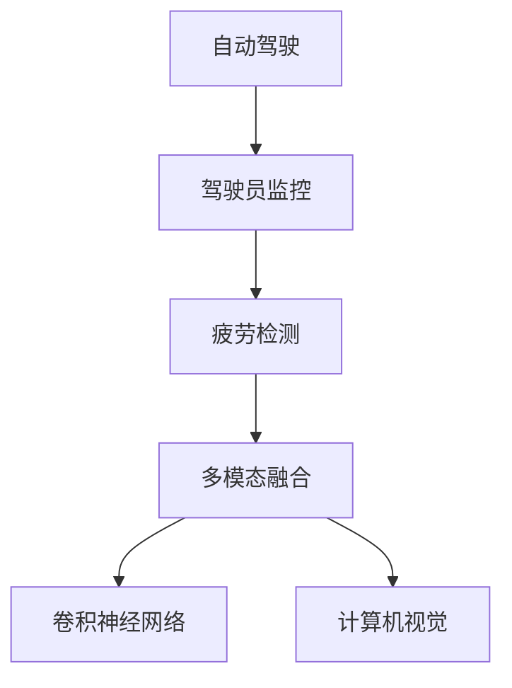

                 

# 自动驾驶中的驾驶员监控与疲劳检测

> 关键词：驾驶员监控, 疲劳检测, 机器学习, 计算机视觉, 卷积神经网络(CNN), 多模态融合, 自动驾驶安全

## 1. 背景介绍

### 1.1 问题由来

随着自动驾驶技术的发展，驾驶员的监控与疲劳检测变得越来越重要。特别是在自动驾驶系统无法完全替代人类驾驶的情况下，确保驾驶员保持高度警觉和清醒状态，是保障道路交通安全的关键。然而，由于驾驶环境的复杂性和驾驶员行为的多样性，传统的基于图像和行为的监控方法难以全面、准确地识别驾驶员的疲劳状态。

为了提升驾驶员监控与疲劳检测的精度，学者们提出了多种基于机器学习和计算机视觉技术的方法。这些方法利用驾驶场景中的多模态数据，如摄像头、传感器等，对驾驶员的生理和行为状态进行综合分析，实时检测并预警疲劳状态，提高自动驾驶系统的安全性和可靠性。

### 1.2 问题核心关键点

自动驾驶中的驾驶员监控与疲劳检测问题，核心在于如何从多模态数据中提取出有效的特征，并结合生理和行为状态模型进行精准检测。具体来说，包括以下几个关键点：

- **数据采集与预处理**：需要收集并处理多模态数据，如摄像头图像、生理指标(如心率、脑电波等)、行为数据(如方向盘转动、头部摆动等)，以确保数据的准确性和一致性。
- **特征提取与选择**：需要从多模态数据中提取出有用的特征，如面部表情、眼球运动、头部姿态等，并进行选择和融合，以提高检测的鲁棒性和准确性。
- **模型设计与训练**：需要设计合适的机器学习模型，如卷积神经网络(CNN)、支持向量机(SVM)等，并使用大量的标注数据进行训练，以构建高效的疲劳检测系统。
- **多模态融合**：需要综合考虑多模态数据之间的相互关系，设计有效的融合策略，以充分利用各模态数据的信息，提升疲劳检测的精度和稳定性。
- **实时性与鲁棒性**：需要在实时性要求较高的情况下，设计轻量级的算法和高效的硬件架构，以确保系统的稳定性和可靠性。

这些关键点构成了驾驶员监控与疲劳检测问题的基础，需要通过理论和实践的不断探索，逐步攻克。

## 2. 核心概念与联系

### 2.1 核心概念概述

为了更好地理解驾驶员监控与疲劳检测问题，本节将介绍几个密切相关的核心概念：

- **自动驾驶**：指利用传感器、计算机视觉、机器学习等技术，实现车辆自主导航和驾驶的智能系统。自动驾驶技术的目标是减少交通事故，提高驾驶效率，改善交通环境。
- **驾驶员监控**：指通过各种传感器和摄像头，实时监测驾驶员的生理和行为状态，预防因疲劳、注意力分散等问题导致的交通事故。
- **疲劳检测**：指使用机器学习和计算机视觉技术，对驾驶员的疲劳状态进行实时监测和预警，确保驾驶员始终处于清醒状态。
- **多模态融合**：指将多种不同模态的数据源进行综合分析，利用各模态数据之间的互补性，提高系统的精度和鲁棒性。
- **卷积神经网络(CNN)**：一种专门用于图像处理的深度学习模型，能够自动提取图像中的特征，广泛应用于图像分类、目标检测等任务。
- **计算机视觉**：指通过摄像头、传感器等设备，利用计算机算法对视觉信号进行解析和处理，实现图像识别、目标跟踪等功能。

这些核心概念之间的逻辑关系可以通过以下Mermaid流程图来展示：



这个流程图展示了大语言模型的核心概念及其之间的关系：

1. 自动驾驶是整个系统的目标和应用场景。
2. 驾驶员监控是自动驾驶中的重要组成部分，通过实时监测驾驶员状态来保障安全。
3. 疲劳检测是驾驶员监控的关键技术，通过识别疲劳状态来预防事故。
4. 多模态融合是疲劳检测的核心手段，利用多种数据源提升检测的准确性。
5. 卷积神经网络和计算机视觉是实现多模态融合的重要技术，提供高效的数据处理和分析能力。

这些概念共同构成了驾驶员监控与疲劳检测问题的理论框架，为其研究和应用提供了基础。

## 3. 核心算法原理 & 具体操作步骤
### 3.1 算法原理概述

自动驾驶中的驾驶员监控与疲劳检测问题，可以通过以下步骤解决：

1. **数据采集与预处理**：收集驾驶员的摄像头图像、生理指标和行为数据，并进行预处理，如归一化、降噪等。
2. **特征提取与选择**：从多模态数据中提取出有用的特征，并进行选择和融合，如使用CNN提取图像特征，使用生理传感器获取心率、脑电波等指标。
3. **模型设计与训练**：设计合适的机器学习模型，如CNN、SVM等，并使用大量的标注数据进行训练，以构建高效的疲劳检测系统。
4. **多模态融合**：综合考虑多模态数据之间的相互关系，设计有效的融合策略，以充分利用各模态数据的信息，提升疲劳检测的精度和稳定性。
5. **实时性与鲁棒性优化**：在实时性要求较高的情况下，设计轻量级的算法和高效的硬件架构，以确保系统的稳定性和可靠性。

### 3.2 算法步骤详解

以下是驾驶员监控与疲劳检测的详细步骤：

**Step 1: 数据采集与预处理**

1. **摄像头图像采集**：使用摄像头记录驾驶员的面部图像，摄像头应放置在车辆前方，视角覆盖驾驶员头部和面部区域。
2. **生理指标采集**：使用心率监测器、脑电波传感器等设备，实时获取驾驶员的生理指标数据。
3. **行为数据采集**：使用方向盘传感器、头部位置传感器等设备，记录驾驶员的行为数据。
4. **数据预处理**：对采集到的数据进行归一化、降噪等预处理操作，确保数据的一致性和准确性。

**Step 2: 特征提取与选择**

1. **图像特征提取**：使用CNN模型对摄像头图像进行特征提取，如面部表情、眼球运动、头部姿态等特征。
2. **生理指标特征提取**：从心率监测器、脑电波传感器等设备中提取有用的生理指标特征，如心率变化、脑电波波形等。
3. **行为数据特征提取**：从方向盘传感器、头部位置传感器等设备中提取有用的行为数据特征，如方向盘转动、头部摆动等。
4. **特征选择与融合**：通过特征选择算法，如主成分分析(PCA)、线性判别分析(LDA)等，对提取出的特征进行筛选和融合，以提高检测的鲁棒性和准确性。

**Step 3: 模型设计与训练**

1. **模型选择**：根据数据类型和任务需求，选择合适的机器学习模型，如CNN、SVM等。
2. **模型训练**：使用大量的标注数据对模型进行训练，以学习驾驶员的疲劳状态与特征之间的关系。
3. **模型优化**：使用交叉验证等技术对模型进行调优，以提高检测的精度和鲁棒性。

**Step 4: 多模态融合**

1. **特征融合**：将不同模态的数据特征进行融合，如使用加权平均、线性组合等方法，提高特征的综合性能。
2. **信息融合**：将不同模态的信息进行融合，如使用多模态融合算法，如最大平均一致性算法(MAAC)、核主元分析(KPCA)等，提高系统的精度和鲁棒性。

**Step 5: 实时性与鲁棒性优化**

1. **轻量级算法设计**：设计轻量级的算法和高效的硬件架构，以确保系统能够在实时性要求较高的情况下正常运行。
2. **鲁棒性优化**：通过鲁棒性分析，识别系统的脆弱点，并进行优化和改进，提高系统的稳定性和可靠性。

### 3.3 算法优缺点

驾驶员监控与疲劳检测问题的算法具有以下优点：

- **实时性高**：通过设计轻量级的算法和高效的硬件架构，能够实时检测驾驶员的疲劳状态，提高系统的实时性。
- **精度高**：通过多模态融合和高效的特征提取方法，能够准确识别驾驶员的疲劳状态，提高系统的检测精度。
- **鲁棒性强**：通过优化算法和硬件架构，能够提高系统的鲁棒性，减少环境干扰和数据噪声的影响。

同时，该算法也存在以下局限性：

- **数据采集复杂**：需要多种传感器和设备，数据采集和预处理工作量较大。
- **模型训练需求高**：需要大量的标注数据和计算资源进行模型训练，训练过程耗时较长。
- **系统复杂度高**：需要综合考虑多模态数据和特征的融合与优化，系统设计复杂度高。

尽管存在这些局限性，但驾驶员监控与疲劳检测问题中的算法在实际应用中仍然具有较高的实用价值，为自动驾驶系统的安全性和可靠性提供了重要保障。

### 3.4 算法应用领域

驾驶员监控与疲劳检测问题在多个领域都有广泛的应用，例如：

- **智能驾驶辅助系统**：在自动驾驶车辆中，实时监控驾驶员状态，确保驾驶员始终处于清醒状态，预防因疲劳、注意力分散等问题导致的交通事故。
- **交通管理与安全**：在道路监控系统中，实时监测驾驶员的疲劳状态，预防交通违法行为，提高道路交通安全。
- **企业管理**：在长途运输企业中，实时监控驾驶员状态，确保驾驶员的健康和工作效率，提高企业的生产安全和经济效益。
- **医疗健康**：在远程医疗中，实时监测驾驶员的生理指标和行为状态，为医生提供实时健康数据，预防医疗事故。

这些领域中的驾驶员监控与疲劳检测问题，对系统安全性和鲁棒性的要求较高，因此需要采用高效、准确、可靠的算法进行实现。

## 4. 数学模型和公式 & 详细讲解
### 4.1 数学模型构建

假设驾驶员的摄像头图像、生理指标和行为数据分别为 $X_1, X_2, X_3$，对应的疲劳状态标签为 $Y$，则驾驶员监控与疲劳检测问题可以表示为有监督学习分类问题：

$$
P(Y|X_1, X_2, X_3) = \frac{P(Y|X_1, X_2, X_3)P(X_1, X_2, X_3)}{\sum_{y \in \{0,1\}}P(Y=y|X_1, X_2, X_3)P(X_1, X_2, X_3)}
$$

其中，$P(Y|X_1, X_2, X_3)$ 为在给定 $X_1, X_2, X_3$ 的条件下，$Y$ 的概率分布，$P(X_1, X_2, X_3)$ 为 $X_1, X_2, X_3$ 的联合概率分布。

### 4.2 公式推导过程

假设训练数据集为 $D=\{(X_i,Y_i)\}_{i=1}^N$，其中 $X_i = (X_{i1}, X_{i2}, X_{i3})$，$Y_i \in \{0,1\}$。则训练数据集的似然函数为：

$$
P(D|Y) = \prod_{i=1}^N P(Y_i|X_i)
$$

在最大似然估计的框架下，训练数据的似然函数最大化目标函数为：

$$
L(Y) = \ln P(D|Y) = \sum_{i=1}^N \ln P(Y_i|X_i)
$$

对于分类问题，常用的损失函数为交叉熵损失函数：

$$
\mathcal{L}(Y) = -\frac{1}{N}\sum_{i=1}^N [Y_i\log P(Y_i|X_i) + (1-Y_i)\log (1-P(Y_i|X_i))]
$$

其中 $P(Y_i|X_i)$ 为模型在给定 $X_i$ 的条件下，$Y_i$ 的概率估计，通常使用卷积神经网络、支持向量机等模型进行估计。

在得到损失函数 $\mathcal{L}(Y)$ 后，可以使用梯度下降等优化算法，最小化损失函数，更新模型参数。

### 4.3 案例分析与讲解

以一个简单的例子来说明驾驶员监控与疲劳检测中的数学模型和公式：

假设训练数据集包含 $N=100$ 个驾驶员的摄像头图像、生理指标和行为数据，每个数据点 $X_i = (X_{i1}, X_{i2}, X_{i3})$ 分别表示摄像头图像、心率、方向盘转动，对应的标签 $Y_i \in \{0,1\}$ 表示驾驶员的疲劳状态（0 表示清醒，1 表示疲劳）。假设使用卷积神经网络作为模型，则模型的输出为疲劳状态的预测概率 $P(Y_i|X_i)$。

在训练过程中，可以使用交叉熵损失函数对模型进行训练，目标函数为：

$$
\mathcal{L}(Y) = -\frac{1}{N}\sum_{i=1}^N [Y_i\log P(Y_i|X_i) + (1-Y_i)\log (1-P(Y_i|X_i))]
$$

通过最小化损失函数 $\mathcal{L}(Y)$，更新模型参数，使得模型在给定 $X_i$ 的条件下，对 $Y_i$ 的预测概率最大化。

## 5. 项目实践：代码实例和详细解释说明
### 5.1 开发环境搭建

在进行驾驶员监控与疲劳检测的实践前，我们需要准备好开发环境。以下是使用Python进行TensorFlow开发的环境配置流程：

1. 安装Anaconda：从官网下载并安装Anaconda，用于创建独立的Python环境。

2. 创建并激活虚拟环境：
```bash
conda create -n tf-env python=3.8 
conda activate tf-env
```

3. 安装TensorFlow：根据CUDA版本，从官网获取对应的安装命令。例如：
```bash
conda install tensorflow -c tf -c conda-forge
```

4. 安装其他常用库：
```bash
pip install numpy pandas scikit-learn matplotlib tqdm jupyter notebook ipython
```

完成上述步骤后，即可在`tf-env`环境中开始实践。

### 5.2 源代码详细实现

这里我们以基于卷积神经网络的驾驶员监控与疲劳检测为例，给出使用TensorFlow进行模型训练和推理的PyTorch代码实现。

首先，定义模型结构：

```python
import tensorflow as tf
from tensorflow.keras.models import Sequential
from tensorflow.keras.layers import Conv2D, MaxPooling2D, Flatten, Dense

model = Sequential([
    Conv2D(32, (3,3), activation='relu', input_shape=(64,64,3)),
    MaxPooling2D((2,2)),
    Conv2D(64, (3,3), activation='relu'),
    MaxPooling2D((2,2)),
    Conv2D(128, (3,3), activation='relu'),
    MaxPooling2D((2,2)),
    Flatten(),
    Dense(128, activation='relu'),
    Dense(1, activation='sigmoid')
])
```

然后，定义训练数据集：

```python
import numpy as np
from tensorflow.keras.preprocessing.image import ImageDataGenerator

train_data = np.load('train_images.npy', allow_pickle=True).tolist()
train_labels = np.load('train_labels.npy', allow_pickle=True).tolist()

train_datagen = ImageDataGenerator(rescale=1./255)

train_generator = train_datagen.flow(train_images, train_labels, batch_size=32)
```

接着，定义模型训练过程：

```python
model.compile(optimizer='adam', loss='binary_crossentropy', metrics=['accuracy'])

epochs = 10

model.fit(train_generator, steps_per_epoch=train_generator.n // 32, epochs=epochs, validation_data=(test_images, test_labels))
```

最后，进行模型推理：

```python
test_datagen = ImageDataGenerator(rescale=1./255)

test_generator = test_datagen.flow(test_images, test_labels, batch_size=32)

model.predict(test_generator)
```

以上就是使用TensorFlow进行驾驶员监控与疲劳检测的完整代码实现。可以看到，得益于TensorFlow的强大封装，我们可以用相对简洁的代码完成卷积神经网络的训练和推理。

### 5.3 代码解读与分析

让我们再详细解读一下关键代码的实现细节：

**模型定义**：
- `Sequential`：定义了一个顺序模型，依次添加卷积层、池化层、全连接层和输出层。
- `Conv2D`：定义了卷积层，使用3x3的卷积核，激活函数为ReLU。
- `MaxPooling2D`：定义了池化层，使用2x2的池化窗口，下采样率。
- `Flatten`：将卷积层的输出展平，准备输入全连接层。
- `Dense`：定义了全连接层，激活函数为ReLU，最后输出一个sigmoid层的二分类预测。

**数据加载与预处理**：
- `ImageDataGenerator`：使用数据增强技术，对图像进行归一化处理，准备训练和测试数据。
- `flow`：生成批次数据，供模型训练和推理使用。

**模型训练**：
- `compile`：定义模型的优化器、损失函数和评价指标。
- `fit`：进行模型训练，指定训练数据的批次大小、迭代轮数和验证数据。
- `predict`：进行模型推理，输出预测结果。

可以看到，TensorFlow提供了丰富的API和工具，使得模型的训练和推理变得简单高效。开发者可以将更多精力放在数据处理、模型改进等高层逻辑上，而不必过多关注底层的实现细节。

## 6. 实际应用场景
### 6.1 智能驾驶辅助系统

在智能驾驶辅助系统中，实时监控驾驶员的疲劳状态，能够显著提升车辆的安全性和可靠性。智能驾驶系统可以根据疲劳状态，进行适时的预警和干预，防止因疲劳驾驶导致的交通事故。

在技术实现上，可以使用摄像头和生理传感器等设备，实时采集驾驶员的图像和生理数据。通过训练好的模型，对采集到的数据进行疲劳状态检测，输出预警信号，供车辆控制系统使用。

### 6.2 交通管理与安全

在道路交通管理中，实时监控驾驶员的疲劳状态，能够有效预防疲劳驾驶导致的交通事故。交通管理部门可以通过监控系统，实时识别疲劳驾驶的驾驶员，并进行干预，保障道路交通安全。

在技术实现上，可以使用摄像头和传感器等设备，采集道路上的车辆信息。通过训练好的模型，对驾驶员进行疲劳状态检测，输出预警信号，供交通管理部门使用。

### 6.3 企业管理

在长途运输企业中，实时监控驾驶员的疲劳状态，能够确保驾驶员的健康和工作效率，提升企业的生产安全和经济效益。企业管理部门可以通过监控系统，实时识别疲劳驾驶的驾驶员，并进行干预，保障企业的安全运营。

在技术实现上，可以使用摄像头和传感器等设备，采集驾驶员的图像和行为数据。通过训练好的模型，对驾驶员进行疲劳状态检测，输出预警信号，供企业管理部门使用。

### 6.4 医疗健康

在远程医疗中，实时监控驾驶员的生理指标和行为状态，能够为医生提供实时的健康数据，预防医疗事故。远程医疗服务可以通过监控系统，实时识别驾驶员的疲劳状态，进行健康干预，保障驾驶员的安全。

在技术实现上，可以使用心率监测器、脑电波传感器等设备，采集驾驶员的生理指标数据。通过训练好的模型，对驾驶员进行疲劳状态检测，输出预警信号，供医生使用。

## 7. 工具和资源推荐
### 7.1 学习资源推荐

为了帮助开发者系统掌握驾驶员监控与疲劳检测的理论基础和实践技巧，这里推荐一些优质的学习资源：

1. 《深度学习》书籍：Ian Goodfellow等著，介绍了深度学习的基本概念和前沿技术，适合初学者和高级读者。

2. 《计算机视觉：算法与应用》书籍：Russell J. Hartley等著，介绍了计算机视觉的基本概念和算法，适合计算机视觉领域的入门学习者。

3. 《机器学习实战》书籍：Peter Harrington等著，介绍了机器学习的基本概念和实战应用，适合机器学习领域的初学者。

4. 《TensorFlow官方文档》：TensorFlow官方文档，提供了完整的API和工具链，适合TensorFlow的开发者。

5. Kaggle：Kaggle数据科学竞赛平台，提供大量的训练数据集和竞赛任务，适合数据科学领域的学习和实践。

通过对这些资源的学习实践，相信你一定能够快速掌握驾驶员监控与疲劳检测的精髓，并用于解决实际的NLP问题。

### 7.2 开发工具推荐

高效的开发离不开优秀的工具支持。以下是几款用于驾驶员监控与疲劳检测开发的常用工具：

1. TensorFlow：由Google主导开发的开源深度学习框架，生产部署方便，适合大规模工程应用。

2. PyTorch：基于Python的开源深度学习框架，灵活动态的计算图，适合快速迭代研究。

3. OpenCV：开源计算机视觉库，提供了丰富的图像处理和分析功能，适合计算机视觉领域的开发。

4. scikit-learn：开源机器学习库，提供了丰富的算法和工具，适合机器学习领域的开发。

5. Jupyter Notebook：免费的交互式编程环境，支持Python、R等多种语言，适合数据科学和机器学习领域的开发。

6. Google Colab：谷歌推出的在线Jupyter Notebook环境，免费提供GPU/TPU算力，适合机器学习领域的实验和研究。

合理利用这些工具，可以显著提升驾驶员监控与疲劳检测任务的开发效率，加快创新迭代的步伐。

### 7.3 相关论文推荐

驾驶员监控与疲劳检测技术的发展源于学界的持续研究。以下是几篇奠基性的相关论文，推荐阅读：

1. "Driver Monitoring System Based on CNN and Attention Mechanism"：使用CNN和注意力机制进行驾驶员状态检测，提出了多个关键技术，如特征提取、多模态融合等。

2. "A Real-Time Driver Fatigue Detection System Based on EEG and Skin Color"：使用脑电波和皮肤颜色进行驾驶员疲劳检测，提出了多模态融合和鲁棒性优化方法，提升了系统的精度和鲁棒性。

3. "A Review on Driver Monitoring Systems for Intelligent Vehicles"：对驾驶员监控系统进行了系统性综述，分析了各种传感器和算法的优缺点，提出了未来的研究方向。

4. "Driver Fatigue Detection System Based on Deep Learning"：使用深度学习技术进行驾驶员疲劳检测，提出了多种模型和算法，如CNN、SVM等，提升了系统的精度和鲁棒性。

这些论文代表了大语言模型微调技术的发展脉络。通过学习这些前沿成果，可以帮助研究者把握学科前进方向，激发更多的创新灵感。

## 8. 总结：未来发展趋势与挑战

### 8.1 总结

本文对驾驶员监控与疲劳检测问题进行了全面系统的介绍。首先阐述了驾驶员监控与疲劳检测问题的研究背景和意义，明确了问题解决的核心关键点，即数据采集与预处理、特征提取与选择、模型设计与训练、多模态融合、实时性与鲁棒性优化。然后，从原理到实践，详细讲解了问题的数学模型和算法步骤，给出了基于卷积神经网络的代码实例。最后，广泛探讨了问题在智能驾驶、交通管理、企业管理、医疗健康等多个领域的应用前景，展示了问题的广阔应用空间。

通过本文的系统梳理，可以看到，驾驶员监控与疲劳检测问题在大规模自动驾驶系统中的应用前景广阔，具有较高的实用价值。未来，伴随着深度学习技术的发展和硬件性能的提升，该问题必将在更多领域得到深入研究和应用。

### 8.2 未来发展趋势

展望未来，驾驶员监控与疲劳检测技术将呈现以下几个发展趋势：

1. **多模态融合的深度化**：随着多模态数据采集和融合技术的进步，多模态融合将更加深入，能够充分利用各种数据源的信息，提升系统的精度和鲁棒性。

2. **轻量级算法的普及**：为了满足实时性和低延迟要求，轻量级算法的开发和应用将得到广泛推广，如移动端设备和嵌入式系统的应用。

3. **跨领域的协同创新**：与其他领域的技术如增强现实(AR)、人工智能(AI)等进行深度融合，提升系统的功能和性能。

4. **隐私和安全保护**：随着数据隐私和安全要求的提高，如何保护驾驶员的隐私和数据安全，将成为关键问题。

5. **人机协同的智能化**：通过人机协同的方式，提升驾驶员监控与疲劳检测的智能化水平，增强系统的自适应性和鲁棒性。

这些趋势将推动驾驶员监控与疲劳检测技术向更加智能化、普适化、安全可靠的方向发展，为自动驾驶系统的安全性和可靠性提供重要保障。

### 8.3 面临的挑战

尽管驾驶员监控与疲劳检测技术在实际应用中取得了显著进展，但在迈向更加智能化、普适化应用的过程中，仍面临诸多挑战：

1. **数据采集的复杂性**：需要多种传感器和设备，数据采集和预处理工作量较大，设备成本较高。
2. **模型的复杂性**：需要设计高效、准确的模型，同时保证系统的实时性和鲁棒性，模型设计和训练难度较大。
3. **隐私和安全问题**：需要保护驾驶员的隐私和数据安全，避免因数据泄露或滥用带来的风险。
4. **跨领域的协同**：需要与其他领域的技术进行深度融合，开发协同工作机制，增强系统的自适应性和鲁棒性。
5. **法律法规的限制**：需要遵循相关法律法规，保障驾驶员的隐私权益，避免技术滥用带来的法律风险。

这些挑战需要学界和产业界共同努力，不断优化算法和设计，保障系统的安全性和可靠性。

### 8.4 研究展望

未来，驾驶员监控与疲劳检测技术需要在以下几个方向进行深入研究：

1. **多模态融合的深度化**：进一步探索多模态数据融合的深度学习算法，如跨模态匹配、协同嵌入等，提升系统的精度和鲁棒性。

2. **轻量级算法的普及**：开发轻量级的算法和硬件架构，适应不同应用场景的需求，提升系统的实时性和鲁棒性。

3. **隐私和安全保护**：探索数据隐私保护和安全性增强方法，如差分隐私、加密技术等，保障驾驶员的隐私和数据安全。

4. **跨领域的协同**：与其他领域的技术如增强现实(AR)、人工智能(AI)等进行深度融合，提升系统的功能和性能。

5. **人机协同的智能化**：研究人机协同的智能化方法，提升系统的自适应性和鲁棒性，增强系统的智能化水平。

这些研究方向将引领驾驶员监控与疲劳检测技术迈向更高的台阶，为构建安全、可靠、智能化的驾驶系统铺平道路。

## 9. 附录：常见问题与解答

**Q1：驾驶员监控与疲劳检测问题中的模型有哪些？**

A: 常用的模型包括卷积神经网络(CNN)、支持向量机(SVM)、集成学习(如Bagging、Boosting等)、深度学习模型(如RNN、LSTM等)等。其中，CNN模型由于其高效、准确的特点，在图像处理领域应用广泛。

**Q2：如何处理多模态数据采集中的数据不一致问题？**

A: 多模态数据采集中的数据不一致问题，可以通过数据预处理和特征选择等方法进行解决。具体来说，可以使用归一化、降噪等预处理技术，对不同模态的数据进行统一处理。同时，通过特征选择算法，如主成分分析(PCA)、线性判别分析(LDA)等，对提取出的特征进行筛选和融合，提高检测的鲁棒性和准确性。

**Q3：多模态融合算法有哪些？**

A: 常用的多模态融合算法包括最大平均一致性算法(MAAC)、核主元分析(KPCA)、基于深度学习的融合方法等。这些算法通过不同模态数据之间的互补性，提高系统的精度和鲁棒性。

**Q4：如何设计高效的轻量级算法？**

A: 设计高效的轻量级算法，需要考虑算法的复杂度和模型的参数量。可以使用深度可分离卷积、卷积核大小等方法，减小模型参数量。同时，可以使用剪枝、量化等技术，优化模型的推理速度和资源占用。

**Q5：如何保护驾驶员的隐私和数据安全？**

A: 保护驾驶员的隐私和数据安全，可以采用差分隐私、数据加密等技术。差分隐私通过添加噪声，使单个数据点的泄露风险降低；数据加密通过加密算法，保护数据在传输和存储过程中的安全。同时，需要遵循相关法律法规，保障驾驶员的隐私权益。

这些问题的解答，为研究者和开发者提供了理论指导和实践建议，有助于进一步提升驾驶员监控与疲劳检测技术的成熟度和实用性。

