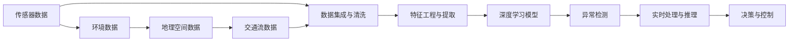

                 

# 自动驾驶公司的数据挖掘与分析平台

> 关键词：自动驾驶, 数据挖掘, 数据分析, 人工智能, 深度学习, 图像处理, 传感器融合

## 1. 背景介绍

随着自动驾驶技术的飞速发展，自动驾驶公司面临的核心挑战之一是如何有效地整合和分析大量异构数据，从而在复杂的城市环境中做出准确、及时的决策。数据挖掘与分析平台是自动驾驶公司实现其核心目标的关键工具，能够帮助公司处理传感器数据、地理空间数据、交通流数据等，通过深度学习等先进算法，提升自动驾驶系统的智能化和安全性。

### 1.1 问题由来

自动驾驶技术涉及多种传感器数据（如激光雷达、摄像头、雷达、GPS等），以及与环境交互的大量多维数据。如何从这些海量数据中提取有用信息，构建高质量的模型，进行实时决策，是当前自动驾驶公司面临的重要问题。传统的数据处理和分析方法已经无法满足这些复杂需求。

### 1.2 问题核心关键点

自动驾驶公司的数据挖掘与分析平台的核心关键点包括：

1. **数据集成与清洗**：处理各种传感器数据和外部数据，确保数据质量。
2. **特征工程与提取**：利用深度学习、时间序列分析等技术，提取出对自动驾驶有用的关键特征。
3. **模型构建与优化**：使用深度学习框架构建模型，优化模型性能，确保模型能够在复杂环境中进行准确决策。
4. **实时处理与推理**：构建高效的实时数据处理和推理引擎，支持自动驾驶系统的实时决策。
5. **安全与鲁棒性**：确保平台在极端和异常情况下的鲁棒性和安全性，避免因数据异常导致的安全隐患。

### 1.3 问题研究意义

自动驾驶公司的数据挖掘与分析平台的研究意义在于：

1. 提高自动驾驶系统的安全性：通过高质量的数据处理和模型优化，减少事故发生率，提升公众对自动驾驶技术的信任。
2. 提升自动驾驶的智能化水平：从大规模数据中提取知识，进行高精度环境建模和路径规划。
3. 降低自动驾驶系统的开发成本：加速模型训练和优化，减少人力和算力投入。
4. 推动自动驾驶技术的普及：提升自动驾驶系统的可靠性和用户体验，加速技术落地应用。
5. 赋能自动驾驶行业创新：数据平台能够促进新算法的研发和应用，提升整个行业的技术水平。

## 2. 核心概念与联系

### 2.1 核心概念概述

自动驾驶公司的数据挖掘与分析平台涉及的核心概念包括：

- **数据挖掘**：从大规模数据中提取有用信息，构建模型和知识。
- **数据分析**：对数据进行统计、可视化、探索性分析，发现数据规律和趋势。
- **深度学习**：利用多层神经网络模型进行特征提取、模式识别和预测。
- **传感器融合**：将来自不同传感器（如激光雷达、摄像头、雷达、GPS等）的数据进行融合，提升数据准确性和可靠性。
- **实时处理**：使用高效的算法和架构，确保数据处理和模型推理能够实时进行。
- **异常检测**：在数据和模型中识别异常情况，确保系统鲁棒性。

这些概念之间存在紧密的联系，形成一个完整的自动驾驶数据处理和分析系统。

### 2.2 核心概念原理和架构的 Mermaid 流程图



这个流程图展示了从传感器数据到最终决策的完整流程：传感器数据首先经过数据集成与清洗，然后通过特征工程与提取构建深度学习模型，接着进行异常检测和实时处理与推理，最后生成决策与控制信号。

## 3. 核心算法原理 & 具体操作步骤
### 3.1 算法原理概述

自动驾驶公司的数据挖掘与分析平台主要利用深度学习算法进行数据处理和分析。核心算法包括：

1. **卷积神经网络(CNN)**：用于图像识别和特征提取。
2. **循环神经网络(RNN)和长短期记忆网络(LSTM)**：用于时间序列数据分析和序列建模。
3. **变分自编码器(VAE)和生成对抗网络(GAN)**：用于降维和数据生成。
4. **强化学习**：用于训练智能决策模型，提升自动驾驶系统的智能化水平。

这些算法通过多层网络结构和复杂的学习机制，从海量数据中提取有用信息，构建高质量的模型，进行实时决策。

### 3.2 算法步骤详解

自动驾驶公司的数据挖掘与分析平台的主要操作步骤如下：

1. **数据集成与清洗**：
   - 集成来自不同传感器的数据，如激光雷达点云数据、摄像头图像数据、雷达数据、GPS数据等。
   - 清洗数据，处理缺失值、异常值和噪声，确保数据质量和一致性。

2. **特征工程与提取**：
   - 从传感器数据中提取时间、空间、速度、方向、距离等关键特征。
   - 利用深度学习算法进行特征提取和降维，构建高维特征空间。
   - 利用时序分析和可视化技术，发现数据规律和趋势。

3. **深度学习模型构建**：
   - 使用深度学习框架（如TensorFlow、PyTorch等）构建卷积神经网络、循环神经网络、生成对抗网络等模型。
   - 设计模型架构，选择合适的损失函数和优化算法，进行模型训练和优化。
   - 评估模型性能，进行交叉验证和调参，提升模型泛化能力。

4. **实时处理与推理**：
   - 构建高效的实时数据处理和推理引擎，支持模型推理和决策。
   - 优化算法和架构，确保数据处理和推理能够实时进行。
   - 使用并行计算、分布式计算等技术，提升处理效率。

5. **异常检测**：
   - 利用统计分析和深度学习技术，检测数据异常和模型偏差。
   - 使用异常检测算法（如孤立森林、自编码器等），识别异常数据和模型异常。
   - 构建异常处理机制，确保系统在异常情况下的鲁棒性和安全性。

### 3.3 算法优缺点

自动驾驶公司的数据挖掘与分析平台具有以下优点：

1. **高效处理大数据**：深度学习算法能够高效处理大规模数据，提升数据处理和分析效率。
2. **模型泛化能力强**：深度学习模型能够从海量数据中学习泛化能力，提升决策准确性。
3. **实时处理能力强**：实时处理和推理引擎能够支持自动驾驶系统的实时决策。
4. **异常检测能力强**：异常检测算法能够识别数据异常和模型异常，提升系统鲁棒性。

同时，也存在一些缺点：

1. **数据依赖性强**：数据质量直接影响模型性能，高质量数据获取难度大。
2. **模型复杂度高**：深度学习模型结构复杂，训练和优化难度大。
3. **资源消耗大**：深度学习模型通常需要大量的计算资源和时间，资源消耗大。
4. **模型解释性差**：深度学习模型通常被称为“黑盒”模型，难以解释其内部工作机制。

### 3.4 算法应用领域

自动驾驶公司的数据挖掘与分析平台在多个领域都有广泛应用，包括但不限于：

- **智能驾驶系统**：利用深度学习算法进行环境感知、路径规划、路径跟踪等任务。
- **自动驾驶汽车**：构建多传感器融合系统，利用实时数据进行精准定位和环境感知。
- **城市交通管理**：通过数据分析和可视化，优化交通流和道路资源。
- **智能交通基础设施**：利用数据挖掘技术，提升智能交通信号灯和道路标识的智能化水平。
- **智慧城市**：结合城市数据，提升城市管理智能化水平，优化公共服务。

## 4. 数学模型和公式 & 详细讲解 & 举例说明

### 4.1 数学模型构建

自动驾驶公司的数据挖掘与分析平台涉及的数学模型包括：

1. **卷积神经网络(CNN)**：
   - 输入数据为多通道图像，输出为特征图。
   - 公式：
     \[
     y = \sigma(\sum_{i=1}^{n}w_i x_i + b)
     \]
     其中，$x_i$ 为输入数据，$w_i$ 为卷积核，$b$ 为偏置项，$\sigma$ 为激活函数。

2. **循环神经网络(RNN)**：
   - 输入数据为时间序列数据，输出为序列预测结果。
   - 公式：
     \[
     h_t = \tanh(Wx_t + Uh_{t-1} + b)
     \]
     \[
     z_t = \sigma(W_{zx}x_t + Wh_{t-1} + b_z)
     \]
     \[
     \tilde{c}_t = z_t \odot \tanh(W_cx_t + Uhc_{t-1} + b_c)
     \]
     \[
     c_t = c_{t-1} \odot (1 - z_t) + z_t \odot \tilde{c}_t
     \]
     \[
     y_t = Vc_t + b
     \]
     其中，$h_t$ 为隐藏状态，$z_t$ 为门控单元，$c_t$ 为记忆单元，$y_t$ 为输出结果，$x_t$ 为输入数据，$W$、$U$、$V$ 为权重矩阵，$b$ 为偏置项，$\odot$ 为点乘运算，$\tanh$、$\sigma$ 为激活函数。

3. **长短期记忆网络(LSTM)**：
   - 输入数据为时间序列数据，输出为序列预测结果。
   - 公式：
     \[
     f_t = \sigma(W_{fx}x_t + Ufh_{t-1} + b_f)
     \]
     \[
     i_t = \sigma(W_{ix}x_t + Uih_{t-1} + b_i)
     \]
     \[
     \tilde{c}_t = \tanh(W_{cx}x_t + Uhc_{t-1} + b_c)
     \]
     \[
     c_t = f_t \odot c_{t-1} + i_t \odot \tilde{c}_t
     \]
     \[
     \tilde{o}_t = \sigma(W_{ox}x_t + Uho_{t-1} + b_o)
     \]
     \[
     o_t = o_t \odot \tilde{o}_t
     \]
     \[
     y_t = o_t \odot \tanh(c_t)
     \]
     其中，$f_t$、$i_t$、$o_t$ 为门控单元，$c_t$ 为记忆单元，$x_t$ 为输入数据，$W$、$U$、$V$ 为权重矩阵，$b$ 为偏置项，$\odot$ 为点乘运算，$\tanh$、$\sigma$ 为激活函数。

### 4.2 公式推导过程

以卷积神经网络为例，进行公式推导。

**CNN公式推导**：
- 输入数据为多通道图像 $x \in \mathbb{R}^{m \times n \times c}$，其中 $m$ 和 $n$ 为图像的高和宽，$c$ 为通道数。
- 卷积核 $w \in \mathbb{R}^{k \times k \times c \times o}$，其中 $k$ 为卷积核大小，$o$ 为卷积核的输出通道数。
- 输出特征图 $y \in \mathbb{R}^{(m-k+1) \times (n-k+1) \times o}$。

卷积操作公式为：
\[
y_{i,j,o} = \sum_{c=1}^{c} \sum_{m'=0}^{k-1} \sum_{n'=0}^{k-1} w_{m',n',c,o} x_{i+m',j+n',c}
\]

其中，$x_{i+m',j+n',c}$ 表示输入数据在位置 $(i+m',j+n',c)$ 处的值，$w_{m',n',c,o}$ 表示卷积核在位置 $(m',n',c)$ 处的权重值。

### 4.3 案例分析与讲解

以自动驾驶中的目标检测为例，进行案例分析。

**目标检测公式推导**：
- 输入为多通道图像 $x \in \mathbb{R}^{m \times n \times c}$。
- 输出为检测框的位置和置信度 $y \in \mathbb{R}^{n \times 4 \times 2}$，其中 $4$ 为检测框的四个顶点坐标，$2$ 为置信度。

目标检测算法流程如下：

1. **特征提取**：使用卷积神经网络提取图像特征，输出特征图 $z \in \mathbb{R}^{m' \times n' \times o'}$，其中 $m'$ 和 $n'$ 为特征图的高和宽，$o'$ 为特征图的通道数。
2. **目标分类**：使用分类器对特征图中的每个区域进行分类，输出类别概率 $p \in \mathbb{R}^{n' \times n' \times c'}$，其中 $c'$ 为类别数。
3. **边界框回归**：使用回归器对每个分类区域进行边界框回归，输出边界框坐标 $b \in \mathbb{R}^{n' \times n' \times 4}$。
4. **综合输出**：将类别概率和边界框坐标综合输出，得到检测结果 $y \in \mathbb{R}^{n' \times n' \times 4 \times 2}$。

## 5. 项目实践：代码实例和详细解释说明
### 5.1 开发环境搭建

自动驾驶公司的数据挖掘与分析平台开发环境搭建流程如下：

1. **安装Python**：确保系统上安装最新版本的Python，建议使用Anaconda进行管理。
2. **安装深度学习框架**：安装TensorFlow、PyTorch、Keras等深度学习框架。
3. **安装数据处理库**：安装NumPy、Pandas、SciPy等数据处理库。
4. **安装可视化工具**：安装Matplotlib、Seaborn、Bokeh等可视化工具。
5. **安装分布式计算库**：安装Dask、Ray等分布式计算库。

完成环境搭建后，可以使用Jupyter Notebook进行开发和调试。

### 5.2 源代码详细实现

以目标检测为例，进行代码实现。

```python
import tensorflow as tf
from tensorflow.keras.layers import Conv2D, Dense, Input, Flatten, Concatenate

def target_detection_model(input_shape=(300, 300, 3)):
    input_layer = Input(shape=input_shape)
    conv1 = Conv2D(32, 3, activation='relu')(input_layer)
    conv2 = Conv2D(64, 3, activation='relu')(conv1)
    pool1 = MaxPooling2D(pool_size=(2, 2))(conv2)
    conv3 = Conv2D(128, 3, activation='relu')(pool1)
    conv4 = Conv2D(256, 3, activation='relu')(conv3)
    pool2 = MaxPooling2D(pool_size=(2, 2))(conv4)
    conv5 = Conv2D(512, 3, activation='relu')(pool2)
    conv6 = Conv2D(1024, 3, activation='relu')(conv5)
    pool3 = MaxPooling2D(pool_size=(2, 2))(conv6)
    flatten = Flatten()(pool3)
    dense1 = Dense(4096, activation='relu')(flatten)
    dense2 = Dense(4096, activation='relu')(dense1)
    dense3 = Dense(4*4*2, activation='sigmoid')(dense2)
    dense4 = Dense(4*4*2, activation='sigmoid')(dense3)
    dense5 = Dense(1000, activation='softmax')(dense4)
    model = tf.keras.Model(inputs=input_layer, outputs=dense5)
    return model
```

以上代码实现了目标检测模型的构建，包括卷积层、池化层、全连接层等。

### 5.3 代码解读与分析

代码实现了卷积神经网络的目标检测模型，其中：

- `input_shape` 表示输入数据的大小，如 `(300, 300, 3)`。
- `Conv2D` 层用于卷积操作，激活函数为 ReLU。
- `MaxPooling2D` 层用于池化操作，池化大小为 `(2, 2)`。
- `Flatten` 层用于将特征图展平。
- `Dense` 层用于全连接操作，激活函数为 ReLU 或 sigmoid。
- `Model` 层用于定义模型，输入为 `input_layer`，输出为 `dense5`。

### 5.4 运行结果展示

运行代码后，可以使用 `model.summary()` 查看模型结构，使用 `model.predict()` 进行预测，使用 `model.evaluate()` 评估模型性能。

## 6. 实际应用场景

### 6.1 智能驾驶系统

在智能驾驶系统中，自动驾驶公司的数据挖掘与分析平台可以用于：

- **环境感知**：通过多传感器数据融合，构建高精度的环境地图和物体检测结果。
- **路径规划**：利用深度学习模型进行路径规划，优化驾驶路径。
- **路径跟踪**：使用目标检测和跟踪算法，确保车辆安全行驶。

### 6.2 自动驾驶汽车

自动驾驶汽车中，数据挖掘与分析平台可以用于：

- **实时定位**：利用 GPS、激光雷达、摄像头等数据进行实时定位和地图构建。
- **行为识别**：通过视频分析和图像处理技术，识别行人、车辆、交通标识等。
- **异常检测**：利用异常检测算法，识别道路异常和车辆异常情况，提高安全性和可靠性。

### 6.3 城市交通管理

在城市交通管理中，数据挖掘与分析平台可以用于：

- **交通流分析**：通过实时数据分析，优化交通流量和信号灯控制。
- **事故预测**：利用时间序列分析和深度学习模型，预测交通事故发生情况，提前采取防范措施。
- **交通模拟**：结合历史数据和实时数据，进行交通模拟和仿真。

### 6.4 智能交通基础设施

在智能交通基础设施中，数据挖掘与分析平台可以用于：

- **智能信号灯**：通过数据分析，优化信号灯控制策略，提升交通效率。
- **道路标识**：利用图像处理技术，识别和更新道路标识信息，提升道路管理水平。
- **交通监控**：结合视频分析和实时数据，进行交通监控和异常检测。

### 6.5 智慧城市

在智慧城市中，数据挖掘与分析平台可以用于：

- **城市监控**：通过数据分析，优化城市监控布局和资源配置。
- **公共服务**：利用实时数据分析，提升公共服务的智能化水平。
- **应急管理**：结合多源数据，进行应急事件的快速响应和处理。

## 7. 工具和资源推荐
### 7.1 学习资源推荐

- **深度学习框架**：TensorFlow、PyTorch、Keras 等。
- **数据处理库**：NumPy、Pandas、SciPy 等。
- **可视化工具**：Matplotlib、Seaborn、Bokeh 等。
- **分布式计算库**：Dask、Ray 等。
- **学习资源**：Coursera、Udacity、edX 等在线课程平台。

### 7.2 开发工具推荐

- **Python IDE**：PyCharm、Jupyter Notebook 等。
- **数据可视化工具**：Tableau、PowerBI 等。
- **分布式计算框架**：Apache Spark、Hadoop 等。
- **云服务**：AWS、Google Cloud、阿里云等。

### 7.3 相关论文推荐

- **目标检测论文**：Faster R-CNN、YOLO、SSD 等。
- **自动驾驶论文**：端到端自动驾驶、强化学习、传感器融合等。
- **城市交通管理论文**：智能交通信号灯、交通流分析、应急管理等。
- **智慧城市论文**：城市监控、公共服务、应急管理等。

## 8. 总结：未来发展趋势与挑战

### 8.1 研究成果总结

自动驾驶公司的数据挖掘与分析平台已经在多个实际应用场景中取得了显著成效，提升了自动驾驶系统的智能化和安全性。未来，数据挖掘与分析技术将继续推动自动驾驶行业的发展，提升系统的感知和决策能力。

### 8.2 未来发展趋势

1. **多传感器融合**：结合多传感器数据，提升系统的感知和决策能力。
2. **实时处理能力**：利用分布式计算技术，提升数据处理和模型推理的实时性。
3. **数据驱动决策**：利用大数据分析和深度学习技术，提升决策的精准性和智能化。
4. **异常检测和鲁棒性**：结合异常检测技术，提升系统的鲁棒性和可靠性。
5. **多任务学习**：结合多任务学习技术，提升系统的泛化能力和适用性。

### 8.3 面临的挑战

自动驾驶公司的数据挖掘与分析平台面临的挑战包括：

1. **数据质量**：高质量数据的获取和处理难度大。
2. **模型复杂度**：深度学习模型结构复杂，训练和优化难度大。
3. **资源消耗**：深度学习模型需要大量的计算资源和时间。
4. **模型解释性**：深度学习模型通常被称为“黑盒”模型，难以解释其内部工作机制。
5. **安全性和鲁棒性**：系统在极端和异常情况下的鲁棒性和安全性。

### 8.4 研究展望

未来，自动驾驶公司的数据挖掘与分析平台需要继续在以下方面进行深入研究：

1. **高效数据处理**：提升数据处理和分析的效率，降低资源消耗。
2. **模型解释性**：提升模型的可解释性和透明性，增强系统的可控性和可审计性。
3. **异常检测**：结合异常检测技术，提升系统的鲁棒性和可靠性。
4. **多任务学习**：结合多任务学习技术，提升系统的泛化能力和适用性。
5. **跨模态学习**：结合视觉、语音、文本等多模态数据，提升系统的感知和决策能力。

## 9. 附录：常见问题与解答

**Q1：自动驾驶公司的数据挖掘与分析平台如何使用多传感器数据？**

A: 自动驾驶公司的数据挖掘与分析平台可以利用多传感器数据进行融合，提升系统的感知和决策能力。具体步骤如下：

1. **数据预处理**：对不同传感器的数据进行预处理，包括格式转换、数据对齐等。
2. **数据融合**：使用数据融合算法，如 Kalman 滤波、粒子滤波等，将不同传感器的数据进行融合。
3. **特征提取**：对融合后的数据进行特征提取，使用深度学习模型进行特征学习和建模。
4. **模型训练和优化**：利用深度学习框架构建模型，进行训练和优化，提升模型性能。
5. **实时推理和决策**：在实际驾驶中，实时输入传感器数据，利用模型进行推理和决策，生成驾驶指令。

**Q2：自动驾驶公司的数据挖掘与分析平台如何进行异常检测？**

A: 自动驾驶公司的数据挖掘与分析平台可以利用异常检测技术，识别数据和模型中的异常情况，确保系统鲁棒性。具体步骤如下：

1. **数据预处理**：对传感器数据进行预处理，包括去噪、归一化等。
2. **异常检测算法**：使用统计分析和深度学习算法，如孤立森林、自编码器等，识别数据和模型中的异常情况。
3. **异常处理机制**：建立异常处理机制，对识别出的异常情况进行处理，如重新采样、重新训练模型等。
4. **模型验证和测试**：在训练集和测试集上评估模型性能，验证异常检测效果。
5. **系统安全保障**：在实际驾驶中，实时监测系统状态，识别和处理异常情况，确保系统安全。

**Q3：自动驾驶公司的数据挖掘与分析平台如何进行实时处理？**

A: 自动驾驶公司的数据挖掘与分析平台可以利用高效算法和架构，进行实时处理和推理。具体步骤如下：

1. **分布式计算**：利用分布式计算技术，将数据处理任务分布到多个计算节点上进行并行计算。
2. **实时数据流**：利用数据流处理技术，实现数据的高效处理和实时传输。
3. **模型优化**：优化模型架构和算法，减少计算量和延迟。
4. **缓存和优化**：利用缓存技术，优化数据访问和存储。
5. **实时监控和反馈**：实时监控系统状态，及时调整和优化处理流程。

**Q4：自动驾驶公司的数据挖掘与分析平台如何进行模型解释性？**

A: 自动驾驶公司的数据挖掘与分析平台可以利用模型解释性技术，提升模型的透明性和可控性。具体步骤如下：

1. **特征可视化**：可视化模型中的特征和权重，解释模型的决策过程。
2. **模型可视化**：使用模型可视化工具，展示模型结构和学习过程。
3. **可解释性算法**：结合可解释性算法，如 SHAP、LIME 等，解释模型的预测结果。
4. **可控性设计**：在设计模型时，考虑模型的透明性和可控性，确保模型的可靠性和可解释性。
5. **人机交互**：结合人机交互技术，解释模型的输出和决策，提升用户对系统的信任和接受度。

**Q5：自动驾驶公司的数据挖掘与分析平台如何结合多任务学习？**

A: 自动驾驶公司的数据挖掘与分析平台可以利用多任务学习技术，提升系统的泛化能力和适用性。具体步骤如下：

1. **任务定义**：定义多个相关任务，如目标检测、行为识别、路径规划等。
2. **任务融合**：利用多任务学习算法，如多任务分类、多任务回归等，将多个任务进行融合。
3. **共享参数**：共享参数，提升模型的泛化能力和适用性。
4. **任务优化**：优化任务融合机制，提升模型性能。
5. **任务评估**：在训练集和测试集上评估模型性能，验证多任务学习效果。

以上是自动驾驶公司的数据挖掘与分析平台的全面介绍，涵盖了从数据集成与清洗到模型构建与优化的全流程，介绍了具体技术实现和实际应用场景，并提出了未来发展方向和挑战。

作者：禅与计算机程序设计艺术 / Zen and the Art of Computer Programming

