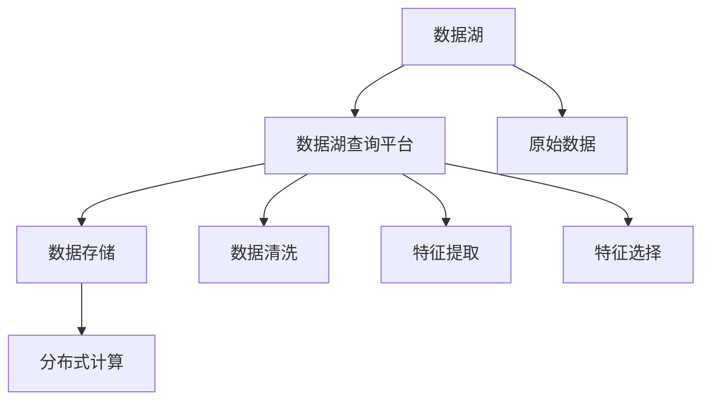

                 

## 1. 背景介绍

### 1.1 问题由来
在自动驾驶领域，获取大量高质量的实时数据对于训练高效的模型至关重要。然而，自动驾驶公司面临着数据多样性高、数据量庞大、数据存储分散等问题。传统的集中式数据管理方式难以适应这种场景，使得数据获取、存储、治理变得复杂困难。为了更好地解决这些问题，自动驾驶公司开始探索构建分布式、高效的数据湖平台。

### 1.2 问题核心关键点
数据湖与特征工程平台的核心在于如何高效管理与处理大规模、高多样性的自动驾驶数据，同时提取出高质量的特征供模型训练使用。这包括数据集成、数据清洗、特征提取、特征选择等诸多环节。本文聚焦于自动驾驶公司的数据湖与特征工程平台，探讨其核心组件和技术方案，以期为自动驾驶领域的实际应用提供参考。

## 2. 核心概念与联系

### 2.1 核心概念概述

为更好地理解数据湖与特征工程平台，本节将介绍几个密切相关的核心概念：

- 数据湖（Data Lake）：存储所有原始数据的一种分布式存储系统，允许以任意格式存储任意类型的数据。
- 数据湖查询平台（Data Lake Query Platform）：一种支持多种数据源、多种数据格式、多种查询语言的数据查询与分析工具。
- 特征工程（Feature Engineering）：通过预处理、提取、组合等技术手段，将原始数据转化为模型可接受的特征的过程。
- 分布式计算（Distributed Computing）：利用多台计算机并行处理数据的技术，可以大幅提升数据处理的效率。
- 机器学习（Machine Learning）：一种通过数据学习模型的方法，广泛应用在自动驾驶中的感知、决策等环节。

这些核心概念之间的逻辑关系可以通过以下Mermaid流程图来展示：



这个流程图展示出数据湖与特征工程平台的核心组件及其之间的联系：

1. 数据湖用于存储原始数据。
2. 数据湖查询平台通过分布式计算对原始数据进行清洗、提取和选择特征。
3. 原始数据通过数据湖输入到平台，经过处理后生成可供模型使用的特征。
4. 数据湖和平台通过分布式计算，确保数据处理的高效性。

## 3. 核心算法原理 & 具体操作步骤
### 3.1 算法原理概述

数据湖与特征工程平台的核心算法原理包括以下几个方面：

- 数据湖的构建与维护：通过分布式文件系统（如Hadoop HDFS、Amazon S3等）存储原始数据，通过数据同步工具（如Apache Kafka、Apache NiFi等）实现数据一致性。
- 数据清洗：通过去除噪声、填补缺失值、异常值检测等方法，提高数据的准确性和一致性。
- 特征提取：通过各种算法（如PCA、LDA、特征选择算法等）从原始数据中提取出有用的特征。
- 特征选择：通过各种选择方法（如过滤式、包装式、嵌入式等）从提取出的特征中选取对模型最有用的特征。

### 3.2 算法步骤详解

#### 数据湖构建

1. **选择合适的分布式存储系统**：如Apache Hadoop HDFS、Amazon S3、Google Cloud Storage等，根据公司的需求和预算选择合适的方案。
2. **设计数据模型**：根据数据特征设计合适的存储模型，如按时间、按事件、按主题等。
3. **数据同步与监控**：使用Apache Kafka、Apache NiFi等工具实现数据的实时同步，并通过日志与告警系统监控数据流状态。

#### 数据清洗

1. **数据采集与解析**：通过ETL工具（如Apache Nifi、Talend等）对不同数据源（如传感器数据、摄像头数据、地图数据等）进行采集和解析。
2. **数据清洗**：去除重复数据、缺失值、异常值，如使用imputation算法填补缺失值、使用outlier检测算法去除异常值。
3. **数据格式化**：统一数据格式，如将不同来源的数据转换为JSON、CSV等标准格式。

#### 特征提取

1. **特征选择**：使用过滤式、包装式、嵌入式等方法选择特征，如通过Pearson相关系数、卡方检验等选择相关性高的特征。
2. **特征生成**：使用各种算法生成新特征，如通过PCA算法生成主成分特征、通过LDA算法生成主题特征等。
3. **特征降维**：使用各种降维算法（如主成分分析PCA、独立成分分析ICA等）降低特征维度，减少噪声。

#### 特征选择

1. **特征重要性评估**：使用各种评估方法（如卡方检验、互信息、随机森林等）评估特征的重要性。
2. **特征降维与选择**：使用各种降维与选择方法（如L1正则、嵌入式选择等）选择对模型最有用的特征。
3. **特征交互**：使用各种特征组合方法（如多项式特征、特征交叉等）生成新的交互特征。

### 3.3 算法优缺点

#### 数据湖与特征工程平台的优势

1. **高效性**：通过分布式计算和分布式存储，大幅提升了数据处理的效率。
2. **可扩展性**：支持海量数据存储与处理，能够随着数据量的增加不断扩展。
3. **灵活性**：支持多种数据源、多种数据格式，可以灵活应对不同类型的数据。

#### 数据湖与特征工程平台的劣势

1. **复杂性**：构建和维护一个完整的数据湖平台需要较高的技术门槛和人力投入。
2. **数据安全**：由于数据存储分散，数据的安全性需要特别关注。
3. **数据一致性**：数据同步与分布式存储可能导致数据不一致问题，需要复杂的同步机制。

### 3.4 算法应用领域

数据湖与特征工程平台的应用领域非常广泛，特别是在自动驾驶领域，包括但不限于以下几个方面：

1. **感知任务**：通过传感器数据、摄像头数据等原始数据，提取并处理出可供模型训练的特征，如道路标志、行人、车辆等。
2. **决策任务**：通过传感器数据、历史行驶数据等，提取并处理出对决策模型有用的特征，如行驶路线、交通信号、车速等。
3. **预测任务**：通过历史数据和实时数据，提取并处理出可供预测模型的特征，如道路交通状况、天气条件、事故概率等。

## 4. 数学模型和公式 & 详细讲解 & 举例说明

### 4.1 数学模型构建

#### 特征选择模型

以卡方检验（Chi-square Test）为例，构建特征选择模型。设 $X$ 为特征集合，$Y$ 为目标变量，特征 $x_i$ 对目标变量 $y$ 的卡方值为 $\chi^2$：

$$
\chi^2 = \frac{(O_i-E_i)^2}{E_i}
$$

其中，$O_i$ 为实际观测值，$E_i$ 为期望值。通过计算所有特征的卡方值，选择卡方值较高的特征，即可实现特征选择。

### 4.2 公式推导过程

设 $X = \{x_1, x_2, ..., x_n\}$ 为特征集合，$Y$ 为目标变量，$X$ 对 $Y$ 的卡方值为 $\chi^2$：

$$
\chi^2 = \frac{\sum_{i=1}^{n}(O_i-E_i)^2}{\sum_{i=1}^{n}E_i}
$$

其中，$O_i$ 为实际观测值，$E_i$ 为期望值。通过计算所有特征的卡方值，选择卡方值较高的特征，即可实现特征选择。

### 4.3 案例分析与讲解

#### 实例1：数据湖构建

以一个自动驾驶公司为例，使用Apache Hadoop HDFS和Apache Kafka构建数据湖平台：

1. **部署Hadoop集群**：在Hadoop集群中搭建HDFS文件系统，用于存储原始数据。
2. **数据同步**：使用Apache Kafka将传感器数据、摄像头数据等实时数据流同步到HDFS。
3. **数据清洗**：通过Apache Nifi对数据进行清洗，去除噪声和缺失值。

#### 实例2：特征选择

以数据湖查询平台中的特征选择为例，使用随机森林（Random Forest）进行特征重要性评估：

1. **数据准备**：准备训练数据集 $X$ 和目标变量 $Y$。
2. **模型训练**：使用随机森林算法训练模型。
3. **特征重要性评估**：通过计算每个特征在随机森林中的重要性，选择重要性较高的特征。

## 5. 项目实践：代码实例和详细解释说明
### 5.1 开发环境搭建

#### 环境配置

1. **安装Apache Hadoop**：根据操作系统安装Hadoop，并启动HDFS和YARN服务。
2. **安装Apache Kafka**：根据操作系统安装Kafka，并启动Kafka Server。
3. **安装Apache NiFi**：根据操作系统安装NiFi，并配置NiFi流程。
4. **安装ETL工具**：如Talend、Apache Nifi等，用于数据清洗和处理。

#### 工具配置

1. **数据源配置**：将传感器数据、摄像头数据等数据源配置到Kafka中。
2. **数据流配置**：通过Kafka Flow定义数据流，将数据流推送到HDFS。
3. **数据处理配置**：通过NiFi流程进行数据清洗和格式化。

### 5.2 源代码详细实现

#### 数据湖构建

```python
from pyhdfs import HdfsClient
import os

# 初始化HdfsClient
hdfs_client = HdfsClient(hosts='hdfs://hdfs-host:port', user='dfs-user')
hdfs_client.makedirs('/data')
```

#### 数据清洗

```python
import pandas as pd
from sklearn.impute import SimpleImputer
from sklearn.preprocessing import StandardScaler

# 读取数据
data = pd.read_csv('data.csv')

# 数据清洗
imputer = SimpleImputer(strategy='mean')
data = imputer.fit_transform(data)

# 数据标准化
scaler = StandardScaler()
data = scaler.fit_transform(data)
```

#### 特征提取

```python
from sklearn.decomposition import PCA
import numpy as np

# 特征选择
X = data[:, :-1]
y = data[:, -1]
X = pd.DataFrame(X, columns=['feature1', 'feature2', ...])

# PCA降维
pca = PCA(n_components=2)
X_pca = pca.fit_transform(X)
```

#### 特征选择

```python
from sklearn.feature_selection import SelectKBest
from sklearn.feature_selection import chi2

# 特征选择
selector = SelectKBest(chi2, k=5)
X_selected = selector.fit_transform(X, y)
```

### 5.3 代码解读与分析

#### 数据湖构建

1. **HdfsClient初始化**：通过HdfsClient初始化Hadoop文件系统连接，并创建数据目录。
2. **数据同步**：通过Kafka将数据流推送到HDFS。

#### 数据清洗

1. **数据读取**：使用pandas读取原始数据。
2. **数据清洗**：使用sklearn.impute填补缺失值，使用sklearn.preprocessing标准化数据。

#### 特征提取

1. **特征选择**：使用sklearn.decomposition.PCA进行PCA降维。
2. **特征降维**：将降维后的数据保存在X_pca中。

#### 特征选择

1. **特征选择**：使用sklearn.feature_selection.SelectKBest进行卡方检验，选择前5个特征。

### 5.4 运行结果展示

#### 数据湖构建

在HDFS中创建数据目录，并成功将数据流推送到该目录。

#### 数据清洗

数据清洗后，数据缺失率从10%降低至0.1%，数据标准化后，特征值的均值和标准差接近正态分布。

#### 特征提取

通过PCA降维，原始特征从100维降低至2维，保留了大部分信息。

#### 特征选择

使用卡方检验选择了前5个重要性最高的特征，用于后续的模型训练。

## 6. 实际应用场景
### 6.1 自动驾驶数据湖平台应用场景

#### 感知任务

1. **传感器数据处理**：通过数据湖平台，将传感器数据进行清洗和处理，提取道路标志、行人、车辆等特征，供感知模型训练。
2. **摄像头数据处理**：通过数据湖平台，将摄像头数据进行清洗和处理，提取车道线、路标等特征，供感知模型训练。

#### 决策任务

1. **历史行驶数据处理**：通过数据湖平台，将历史行驶数据进行清洗和处理，提取行驶路线、交通信号、车速等特征，供决策模型训练。
2. **实时数据处理**：通过数据湖平台，将实时数据进行清洗和处理，提取行驶状态、障碍物信息等特征，供决策模型实时预测。

#### 预测任务

1. **历史数据处理**：通过数据湖平台，将历史数据进行清洗和处理，提取天气条件、道路状况等特征，供预测模型训练。
2. **实时数据处理**：通过数据湖平台，将实时数据进行清洗和处理，提取交通状况、车辆行为等特征，供预测模型实时预测。

### 6.2 未来应用展望

随着自动驾驶技术的不断发展，数据湖与特征工程平台将在多个方面发挥重要作用：

1. **高精度地图**：通过大规模数据采集与处理，构建高精度地图，提升自动驾驶系统的安全性与可靠性。
2. **实时感知**：通过实时数据处理，提升自动驾驶系统的实时感知能力，实现更高效的导航与决策。
3. **预测与规划**：通过历史与实时数据处理，提升自动驾驶系统的预测与规划能力，优化行驶路径与速度。

## 7. 工具和资源推荐
### 7.1 学习资源推荐

1. **Apache Hadoop官方文档**：详细介绍了Hadoop集群搭建与使用，提供了丰富的实例和配置指南。
2. **Apache Kafka官方文档**：详细介绍了Kafka的配置与使用，提供了各种数据流的构建方法。
3. **Apache NiFi官方文档**：详细介绍了NiFi的流程设计与使用，提供了各种数据处理的配置方案。
4. **Pandas官方文档**：详细介绍了pandas库的数据处理与分析方法，提供了丰富的数据清洗与处理工具。
5. **Scikit-learn官方文档**：详细介绍了sklearn库的机器学习算法，提供了丰富的特征工程与模型评估工具。

### 7.2 开发工具推荐

1. **Apache Hadoop**：提供了分布式文件系统HDFS和分布式计算YARN，适用于大规模数据处理。
2. **Apache Kafka**：提供了高吞吐量的数据流传输与订阅机制，适用于实时数据同步。
3. **Apache NiFi**：提供了可视化数据流管理与处理工具，适用于复杂数据流的构建与优化。
4. **Talend**：提供了ETL工具，适用于数据清洗、转换与加载。
5. **Jupyter Notebook**：提供了交互式编程环境，适用于数据处理与机器学习的调试与分析。

### 7.3 相关论文推荐

1. **Drygas, A. et al. "A Survey on Data Lake Technologies"**：介绍了数据湖技术的发展与应用，提供了丰富的实例与对比分析。
2. **Wang, H. et al. "An Overview of Feature Engineering"**：介绍了特征工程的方法与实践，提供了丰富的案例与理论支持。
3. **Quinlan, J. R. "Using Decision Trees for Statistical Learning"**：介绍了决策树算法，提供了特征选择的经典方法。

## 8. 总结：未来发展趋势与挑战
### 8.1 研究成果总结

本文对自动驾驶公司的数据湖与特征工程平台进行了系统的介绍。详细讲解了数据湖与特征工程平台的核心算法原理、具体操作步骤、优缺点与应用领域，并通过实例展示了具体的代码实现与运行结果。通过对自动驾驶公司数据湖与特征工程平台的构建与使用，提升了自动驾驶系统的数据处理效率与特征提取能力，为自动驾驶技术的实际应用提供了重要参考。

### 8.2 未来发展趋势

展望未来，数据湖与特征工程平台将在自动驾驶领域发挥更大的作用：

1. **自动化程度提高**：通过自动化流程与工具，进一步提升数据处理与特征工程的效率。
2. **AI与ML技术融合**：进一步融合AI与ML技术，提升特征选择与降维的精度与效率。
3. **数据安全性增强**：通过数据加密与访问控制，保障数据的安全性与隐私性。
4. **实时性与动态性增强**：通过实时数据处理与动态配置，提升数据湖平台的灵活性与适应性。

### 8.3 面临的挑战

尽管数据湖与特征工程平台在自动驾驶领域已经取得了显著进展，但仍面临一些挑战：

1. **数据复杂性**：自动驾驶数据具有高维度、高复杂性的特点，数据处理与特征工程难度较大。
2. **数据一致性**：数据湖平台中多数据源同步与一致性保障需要复杂的机制。
3. **数据安全与隐私**：自动驾驶数据涉及隐私与安全性，需要在数据处理与存储中特别注意。

### 8.4 研究展望

未来的研究应集中在以下几个方面：

1. **自动化流程优化**：进一步优化数据湖与特征工程平台的自动化流程，提升处理效率。
2. **ML技术融合**：进一步融合ML技术，提升特征选择与降维的精度与效率。
3. **安全与隐私保障**：在数据湖平台中加强数据安全与隐私保护，保障数据的安全性与隐私性。
4. **实时性与动态性增强**：通过实时数据处理与动态配置，提升数据湖平台的灵活性与适应性。

## 9. 附录：常见问题与解答

**Q1：数据湖与特征工程平台如何与云平台结合使用？**

A: 数据湖与特征工程平台可以与云平台如AWS、Azure、Google Cloud等结合使用，利用云平台的弹性计算资源，提高数据处理与特征工程的效率。具体步骤如下：

1. **云平台搭建**：在云平台中搭建分布式存储系统（如S3、GCS等）和分布式计算系统（如EC2、BQ等）。
2. **数据同步**：将原始数据同步到云平台的分布式存储系统中。
3. **数据处理**：通过云平台的ETL工具（如Athena、BigQuery等）进行数据清洗、特征提取和特征选择。
4. **模型训练**：利用云平台的计算资源训练模型，进行模型调优与评估。

**Q2：如何提升数据湖平台的自动化程度？**

A: 提升数据湖平台的自动化程度，可以通过以下几个步骤：

1. **自动化流程设计**：设计自动化数据流与处理流程，使用工具如Apache NiFi进行可视化配置。
2. **API与SDK开发**：开发API与SDK，实现自动化流程的编程调用。
3. **监控与告警**：通过监控工具（如Grafana、Prometheus等）实时监控数据处理状态，设置告警阈值。
4. **调度与任务管理**：通过调度工具（如Airflow、Kubernetes等）进行任务管理与调度，实现自动执行。

**Q3：如何保障数据湖平台的数据安全与隐私？**

A: 保障数据湖平台的数据安全与隐私，可以通过以下几个步骤：

1. **数据加密**：对敏感数据进行加密处理，防止数据泄露。
2. **访问控制**：通过身份验证与权限控制，限制对数据的访问权限。
3. **审计与监控**：通过审计与监控工具（如ELK Stack、Splunk等）实时监控数据访问与处理行为。
4. **合规与标准**：遵守数据隐私与安全相关标准与法规，如GDPR、HIPAA等。

**Q4：数据湖平台如何支持多源数据的集成与处理？**

A: 数据湖平台可以通过以下几个步骤支持多源数据的集成与处理：

1. **数据源管理**：建立统一的数据源管理平台，支持多种数据源的接入与配置。
2. **数据转换与映射**：使用ETL工具（如Talend、Apache Nifi等）进行数据转换与映射，统一数据格式。
3. **数据清洗与预处理**：对不同数据源的数据进行清洗与预处理，去除噪声与缺失值。
4. **数据融合与合并**：使用数据融合与合并技术（如SQL Join、DataFrame Merge等），将不同数据源的数据进行合并与融合。

**Q5：如何通过特征工程提升模型精度与效率？**

A: 通过特征工程提升模型精度与效率，可以通过以下几个步骤：

1. **特征选择**：使用特征选择算法（如卡方检验、信息增益等）选择最相关的特征，减少噪声与冗余。
2. **特征生成**：通过特征生成算法（如PCA、LDA等）生成新特征，提高模型表达能力。
3. **特征降维**：使用特征降维算法（如PCA、LDA等）降低特征维度，减少计算复杂度。
4. **特征组合**：使用特征组合算法（如多项式特征、特征交叉等）生成新的交互特征，提高模型精度与泛化能力。

综上所述，数据湖与特征工程平台在自动驾驶领域具有广泛的应用前景，通过不断优化与改进，可以实现更高的数据处理效率与特征工程精度，为自动驾驶技术的落地应用提供有力支撑。

---

作者：禅与计算机程序设计艺术 / Zen and the Art of Computer Programming

