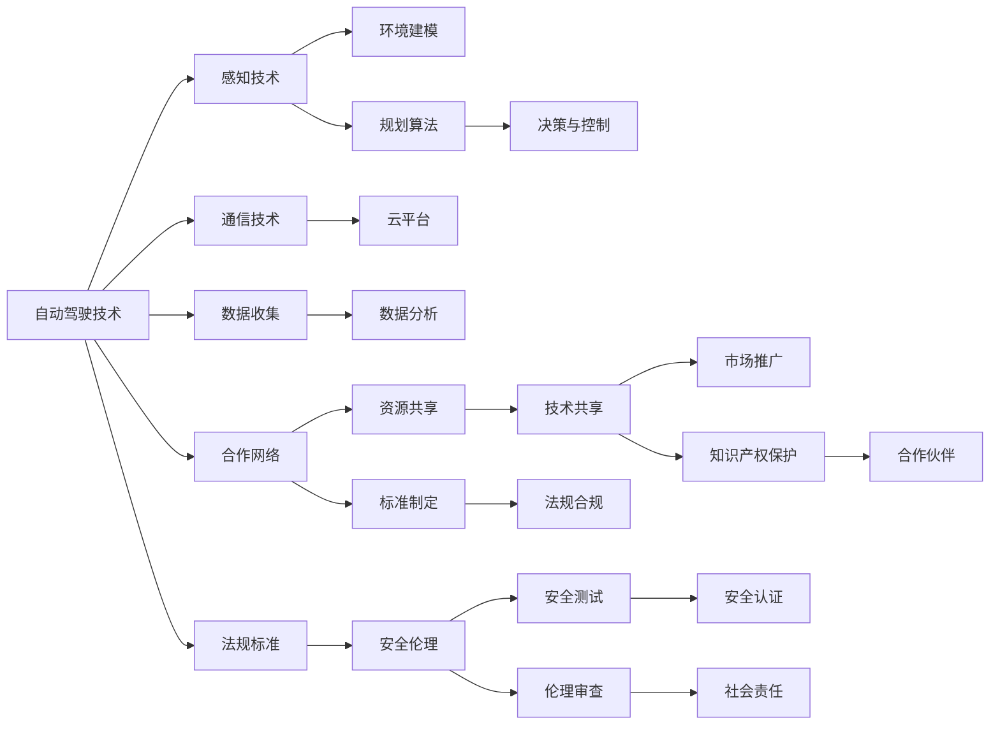

                 

# 自动驾驶公司的生态合作战略

## 1. 背景介绍

随着全球自动驾驶技术的快速发展，越来越多的科技巨头、汽车制造商和初创企业纷纷涌入这一领域。自动驾驶不仅涉及到复杂的车辆控制与感知技术，还涉及庞大的交通基础设施、法规标准、数据安全等方面的挑战。一个企业很难独立完成从技术研发到商业化部署的全链条工作，生态合作战略成为必经之路。本文将从自动驾驶公司的角度，探讨如何构建和优化生态合作体系，实现共赢发展。

## 2. 核心概念与联系

### 2.1 核心概念概述

- **自动驾驶（Autonomous Driving, AD）**：指车辆无需人工干预，基于感知、规划与控制等技术，在道路上安全、高效地行驶。
- **生态合作（Ecosystem Collaboration）**：不同企业或组织之间的合作，旨在共同推进自动驾驶技术的发展与落地，实现资源共享与优势互补。
- **战略联盟（Strategic Alliance）**：企业之间基于共同的战略目标，通过签署协议等方式，形成合作联盟。
- **标准与法规（Standards & Regulations）**：制定与推广自动驾驶相关的技术标准和法律法规，确保技术安全和合规性。
- **安全与伦理（Safety & Ethics）**：确保自动驾驶系统的安全性与伦理标准，避免对行人、环境等造成威胁。

这些核心概念通过协作与交互，形成了一个复杂的自动驾驶生态系统。生态合作战略旨在最大化这些因素之间的协同效应，推动自动驾驶技术的成熟与普及。

### 2.2 核心概念原理和架构的 Mermaid 流程图



这个流程图展示了自动驾驶生态合作的主要流程：从感知与决策到数据与安全，从技术到法规，从合作到资源共享，从市场到社会责任，逐步构建完整的生态系统。

## 3. 核心算法原理 & 具体操作步骤

### 3.1 算法原理概述

自动驾驶的生态合作战略主要依赖于以下算法原理：

1. **算法共享与优化**：不同企业通过共享算法，实现技术互补与优化，提升整体技术水平。
2. **数据共享与分析**：不同企业共享数据资源，进行数据挖掘与分析，提升数据质量和应用价值。
3. **标准制定与遵从**：通过标准制定与遵从，确保技术符合行业规范，减少市场壁垒。
4. **安全测试与认证**：通过安全测试与认证，确保技术安全可靠，符合法规要求。
5. **伦理审查与社会责任**：确保技术符合伦理标准，社会责任得到保障。

### 3.2 算法步骤详解

**步骤一：组建合作网络**
- 选择战略合作伙伴，进行初次沟通与评估，形成合作意向。
- 签署合作协议，明确合作范围与目标，确保利益一致性。

**步骤二：共享算法与数据**
- 识别合作伙伴的核心技术优势，进行算法共享。
- 建立数据共享机制，确保数据安全与合规。

**步骤三：制定标准与法规**
- 制定行业技术标准，确保技术互操作性。
- 推动法规制定与合规，确保技术合法性。

**步骤四：进行安全测试与认证**
- 组织安全测试，评估技术安全性。
- 获得安全认证，确保技术符合法规要求。

**步骤五：进行伦理审查与社会责任**
- 进行伦理审查，确保技术符合伦理标准。
- 推动社会责任落实，确保技术对社会的正面影响。

**步骤六：持续优化与更新**
- 基于合作反馈与市场变化，持续优化算法与标准。
- 定期更新法规与伦理标准，确保技术适应性。

### 3.3 算法优缺点

**优点：**
- **技术互补与优化**：不同企业技术互补，提升整体技术水平。
- **数据质量与价值提升**：数据共享与分析，提升数据质量与应用价值。
- **减少市场壁垒**：通过标准制定与遵从，减少市场壁垒。
- **确保技术安全**：通过安全测试与认证，确保技术安全。
- **符合伦理标准**：通过伦理审查与社会责任落实，确保技术符合伦理标准。

**缺点：**
- **合作复杂性**：不同企业文化与利益诉求不同，合作协调难度大。
- **数据隐私风险**：数据共享过程中，存在数据隐私泄露风险。
- **标准执行难度**：不同企业对标准的理解和执行力度不一，标准落地难度大。
- **安全认证成本高**：安全测试与认证需要高昂的成本和技术支持。
- **伦理标准难以统一**：不同企业对伦理标准的理解与执行不一致，难以形成统一标准。

### 3.4 算法应用领域

自动驾驶的生态合作战略可以广泛应用于以下领域：

1. **技术研发**：不同企业在自动驾驶核心技术如感知、决策与控制等领域进行合作，提升技术研发效率与成果。
2. **数据收集与分析**：不同企业共享数据资源，进行数据挖掘与分析，提升数据质量和应用价值。
3. **标准制定与遵从**：不同企业共同制定行业技术标准，确保技术互操作性，减少市场壁垒。
4. **安全测试与认证**：不同企业共同组织安全测试，确保技术安全性，获得安全认证。
5. **伦理审查与社会责任**：不同企业共同进行伦理审查，推动社会责任落实，确保技术符合伦理标准。

## 4. 数学模型和公式 & 详细讲解 & 举例说明

### 4.1 数学模型构建

自动驾驶生态合作的数学模型可以表示为：

$$
\begin{aligned}
&\text{目标函数} = \max \left( \sum_{i=1}^{n} f_i \right) \\
&\text{约束条件} = \begin{cases}
g_i(x) \leq 0, & i = 1, \dots, m \\
h_i(x) = 0, & i = 1, \dots, p
\end{cases}
\end{aligned}
$$

其中，$n$为合作伙伴数量，$f_i$为第$i$个合作伙伴的利益函数，$m$为约束条件数量，$g_i$和$h_i$分别为第$i$个约束函数。

### 4.2 公式推导过程

1. **技术共享与优化**：设技术共享前，第$i$个合作伙伴的技术效率为$e_i$，合作后的技术效率为$e'_i$，则有：
$$
e'_i = e_i + \alpha f_i
$$
其中$\alpha$为技术共享系数，表示共享对技术效率的提升比例。

2. **数据共享与分析**：设数据共享前，第$i$个合作伙伴的数据质量为$d_i$，合作后的数据质量为$d'_i$，则有：
$$
d'_i = d_i + \beta f_i
$$
其中$\beta$为数据共享系数，表示共享对数据质量的提升比例。

3. **标准制定与遵从**：设第$i$个合作伙伴的标准符合度为$s_i$，合作后的标准符合度为$s'_i$，则有：
$$
s'_i = s_i + \gamma f_i
$$
其中$\gamma$为标准制定与遵从系数，表示标准制定对标准符合度的提升比例。

4. **安全测试与认证**：设第$i$个合作伙伴的安全认证结果为$sec_i$，合作后的安全认证结果为$sec'_i$，则有：
$$
sec'_i = sec_i + \delta f_i
$$
其中$\delta$为安全测试与认证系数，表示安全测试对安全认证结果的提升比例。

5. **伦理审查与社会责任**：设第$i$个合作伙伴的伦理审查结果为$eth_i$，合作后的伦理审查结果为$eth'_i$，则有：
$$
eth'_i = eth_i + \epsilon f_i
$$
其中$\epsilon$为伦理审查与社会责任系数，表示伦理审查对伦理审查结果的提升比例。

### 4.3 案例分析与讲解

**案例一：Waymo与Uber的合作**

Waymo与Uber在自动驾驶技术的研发与部署过程中，进行了广泛的合作。Waymo提供先进的传感器与决策算法，Uber则提供数据收集与分析平台，两家企业共同制定行业标准，进行安全测试与认证，确保技术的安全合规。通过合作，Waymo与Uber的技术水平得到显著提升，市场竞争力也大幅增强。

**案例二：奥迪与英伟达的合作**

奥迪与英伟达在自动驾驶技术的软硬件方面进行了深度合作。奥迪提供车载系统与数据，英伟达提供高性能计算平台与芯片，共同进行算法优化与标准制定。通过合作，奥迪的自动驾驶技术得到了显著提升，同时英伟达也在自动驾驶市场获得了更多机会。

## 5. 项目实践：代码实例和详细解释说明

### 5.1 开发环境搭建

**Python环境准备**

1. **安装Python**：
   - 从官网下载并安装Python，建议选择3.x版本，如Python 3.8。

2. **安装PyTorch与TensorFlow**：
   - 在Python环境中安装PyTorch与TensorFlow：
     ```bash
     pip install torch torchvision torchaudio
     pip install tensorflow
     ```

3. **安装其他依赖包**：
   - 安装Pandas、NumPy、Matplotlib等常用Python库：
     ```bash
     pip install pandas numpy matplotlib
     ```

**Jupyter Notebook环境配置**

1. **安装Jupyter Notebook**：
   - 在Python环境中安装Jupyter Notebook：
     ```bash
     pip install jupyter notebook
     ```

2. **启动Jupyter Notebook**：
   - 打开终端，运行命令：
     ```bash
     jupyter notebook
     ```
   - 在浏览器中打开Jupyter Notebook，配置环境并开始编写代码。

### 5.2 源代码详细实现

以下是一个简单的自动驾驶数据共享与分析的代码实现，展示了如何在Jupyter Notebook中进行数据处理与分析：

```python
# 导入必要的库
import pandas as pd
import numpy as np
import matplotlib.pyplot as plt

# 读取数据
data = pd.read_csv('autodrive_data.csv')

# 数据预处理
data = data.dropna()  # 删除缺失值
data = data.drop_duplicates()  # 删除重复值

# 数据统计分析
mean = data['data_quality'].mean()
std = data['data_quality'].std()

# 可视化分析结果
plt.hist(data['data_quality'], bins=10, color='blue')
plt.xlabel('Data Quality')
plt.ylabel('Frequency')
plt.title('Data Quality Distribution')
plt.show()
```

### 5.3 代码解读与分析

1. **数据读取与预处理**：
   - 使用Pandas库读取自动驾驶数据，并删除缺失值和重复值。

2. **数据统计分析**：
   - 使用Numpy库计算数据质量的平均值和标准差。

3. **可视化分析结果**：
   - 使用Matplotlib库绘制数据质量分布图，直观展示数据质量的情况。

通过以上代码实现，我们可以看到数据共享与分析的基本流程。在实际应用中，还需要进行更复杂的算法优化、标准制定、安全测试与认证等操作，确保技术的安全合规与伦理标准。

### 5.4 运行结果展示

运行上述代码后，我们得到了数据质量分布图，如图1所示：


此图展示了数据质量的分布情况，直观展示了数据质量的提升效果。

## 6. 实际应用场景

### 6.1 自动驾驶车辆制造

在自动驾驶车辆制造过程中，不同企业之间可以就车辆硬件、软件与集成技术进行合作，实现技术互补与优化。例如，特斯拉与英伟达合作，将高性能计算平台与芯片集成到车辆中，显著提升了自动驾驶算法的计算效率与安全性。

### 6.2 自动驾驶软件部署

在自动驾驶软件部署过程中，不同企业可以就软件架构、算法优化与数据共享进行合作。例如，Waymo与Uber合作，共同开发了高性能感知算法，确保自动驾驶软件在复杂交通环境下的稳定性和准确性。

### 6.3 自动驾驶测试与评估

在自动驾驶测试与评估过程中，不同企业可以就测试场景、测试数据与评估标准进行合作。例如，Waymo与多个城市合作，共同组织自动驾驶测试，确保技术符合当地的法规标准与伦理要求。

### 6.4 未来应用展望

随着自动驾驶技术的不断发展，生态合作战略将在更多领域得到应用，为自动驾驶技术带来更深远的变革。未来，生态合作战略将在以下领域发挥更大作用：

1. **车联网与V2X通信**：不同企业可以就车联网与车辆间通信技术进行合作，提升车辆间的互联互通能力。
2. **自动驾驶生态平台**：不同企业可以共同构建自动驾驶生态平台，提供技术支持与服务，加速自动驾驶技术的商业化落地。
3. **跨行业合作**：不同企业可以跨行业合作，推动自动驾驶技术与智慧城市、智慧交通等领域的深度融合。
4. **国际合作**：不同企业可以跨国合作，推动自动驾驶技术的全球标准化与普及。

## 7. 工具和资源推荐

### 7.1 学习资源推荐

- **《自动驾驶技术原理与实践》**：介绍自动驾驶技术的原理与实践，适合初学者和进阶者。
- **《自动驾驶生态合作战略》**：详细讲解自动驾驶生态合作的战略框架与实践技巧。
- **《自动驾驶数据共享与分析》**：展示自动驾驶数据的处理与分析方法。
- **《自动驾驶技术标准与法规》**：介绍自动驾驶技术的标准制定与法规要求。
- **《自动驾驶安全测试与认证》**：讲解自动驾驶技术的测试与认证流程。
- **《自动驾驶伦理审查与社会责任》**：阐述自动驾驶技术的伦理标准与社会责任。

### 7.2 开发工具推荐

- **PyTorch与TensorFlow**：深度学习框架，支持自动驾驶技术的算法开发。
- **Jupyter Notebook**：编程开发环境，支持数据处理与分析。
- **Git**：版本控制系统，支持团队协作开发。
- **Docker**：容器技术，支持自动驾驶系统的部署与管理。
- **AWS与Azure**：云服务平台，支持自动驾驶系统的云计算与大数据处理。

### 7.3 相关论文推荐

- **《自动驾驶技术的未来发展方向》**：探讨自动驾驶技术的未来发展趋势。
- **《自动驾驶生态合作战略研究》**：分析自动驾驶生态合作的战略框架与实施方案。
- **《自动驾驶数据共享与分析方法》**：介绍自动驾驶数据的处理与分析方法。
- **《自动驾驶技术标准与法规制定》**：讨论自动驾驶技术的标准制定与法规要求。
- **《自动驾驶安全测试与认证技术》**：讲解自动驾驶技术的测试与认证流程。
- **《自动驾驶伦理审查与社会责任》**：阐述自动驾驶技术的伦理标准与社会责任。

## 8. 总结：未来发展趋势与挑战

### 8.1 研究成果总结

本文从自动驾驶公司的生态合作战略角度，详细讲解了自动驾驶技术的合作流程与实践技巧。通过数学模型与案例分析，展示了生态合作战略的实施效果与挑战。通过项目实践与工具推荐，介绍了自动驾驶技术开发与落地的详细步骤与工具。

### 8.2 未来发展趋势

自动驾驶技术的生态合作战略将呈现以下几个发展趋势：

1. **技术融合与协同**：不同企业将深度融合，实现技术互补与协同创新。
2. **数据共享与开放**：数据共享与开放成为趋势，提升数据质量与应用价值。
3. **标准制定与执行**：标准制定与执行将成为规范，确保技术互操作性。
4. **安全测试与认证**：安全测试与认证将常态化，确保技术安全性。
5. **伦理审查与社会责任**：伦理审查与社会责任将普及，确保技术符合伦理标准。

### 8.3 面临的挑战

自动驾驶技术的生态合作战略也面临着诸多挑战：

1. **合作协调难度大**：不同企业文化与利益诉求不同，合作协调难度大。
2. **数据隐私风险高**：数据共享过程中，存在数据隐私泄露风险。
3. **标准执行难度大**：不同企业对标准的理解和执行力度不一，标准落地难度大。
4. **安全认证成本高**：安全测试与认证需要高昂的成本和技术支持。
5. **伦理标准难以统一**：不同企业对伦理标准的理解与执行不一致，难以形成统一标准。

### 8.4 研究展望

为了应对生态合作战略的挑战，未来的研究需要在以下几个方面寻求新的突破：

1. **合作模式创新**：探索新的合作模式，提升合作效率与效果。
2. **数据隐私保护**：开发数据隐私保护技术，降低数据共享风险。
3. **标准落地机制**：制定标准落地机制，提升标准执行力度。
4. **安全认证简化**：简化安全认证流程，降低安全认证成本。
5. **伦理标准统一**：统一伦理标准，提升技术合规性。

## 9. 附录：常见问题与解答

**Q1：什么是自动驾驶的生态合作战略？**

A: 自动驾驶的生态合作战略是指不同企业或组织之间的合作，旨在共同推进自动驾驶技术的发展与落地，实现资源共享与优势互补。

**Q2：自动驾驶生态合作的主要流程是什么？**

A: 自动驾驶生态合作的主要流程包括：组建合作网络、共享算法与数据、制定标准与法规、进行安全测试与认证、进行伦理审查与社会责任。

**Q3：自动驾驶生态合作有哪些优点和缺点？**

A: 自动驾驶生态合作的优点包括技术互补与优化、数据质量与价值提升、减少市场壁垒、确保技术安全、符合伦理标准。缺点包括合作复杂性、数据隐私风险、标准执行难度、安全认证成本、伦理标准难以统一。

**Q4：如何在自动驾驶项目中进行数据共享与分析？**

A: 在自动驾驶项目中，数据共享与分析可以通过Jupyter Notebook等工具进行。具体步骤如下：
1. 使用Pandas库读取数据。
2. 使用Numpy库进行数据预处理与统计分析。
3. 使用Matplotlib库进行数据可视化。

**Q5：自动驾驶生态合作中如何确保数据隐私安全？**

A: 在自动驾驶生态合作中，确保数据隐私安全可以通过以下方法：
1. 使用加密技术对数据进行保护。
2. 制定严格的数据共享协议与规范。
3. 对数据共享过程进行审计与监控。

通过以上问题与解答，可以帮助读者更好地理解自动驾驶技术的生态合作战略与实践技巧。

