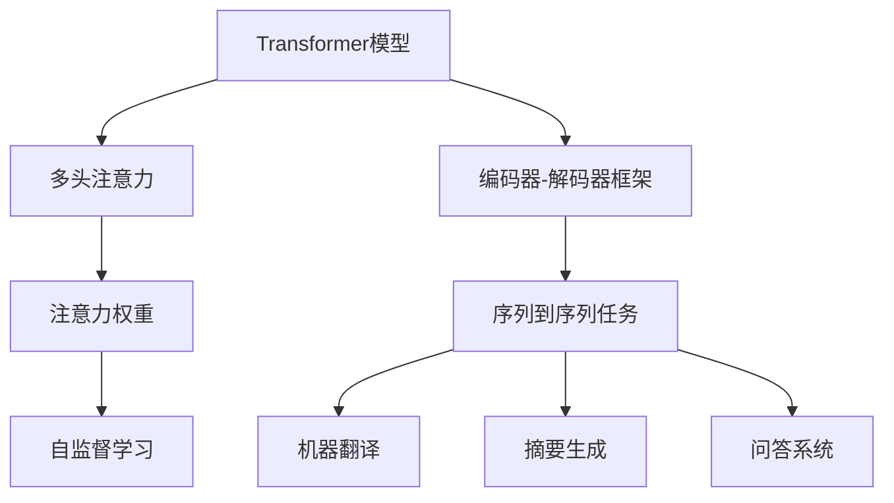

                 

# 自注意力机制的工作原理

> 关键词：自注意力机制, Transformer模型, 注意力机制, 多头注意力, 可并行计算, 深度学习, 自然语言处理

## 1. 背景介绍

自注意力机制（Self-Attention Mechanism）是一种突破性的计算技术，首次在2017年由Vaswani等人在论文《Attention is All You Need》中提出，并应用于Transformer模型中，极大地提升了自然语言处理（NLP）领域的处理效率和性能。自此之后，自注意力机制成为了深度学习领域的一项重要技术，被广泛应用在文本分类、机器翻译、问答系统、语音识别等众多领域。

### 1.1 问题由来

在传统的循环神经网络（RNN）和卷积神经网络（CNN）中，信息的传递顺序受限于网络结构，无法同时并行计算，导致计算效率较低。针对这一问题，Transformer模型提出了自注意力机制，允许模型在计算时同时考虑输入序列中的所有位置，从而提高了计算效率和模型性能。

### 1.2 问题核心关键点

自注意力机制的核心在于利用注意力权重，对输入序列中的各个位置进行加权求和，实现跨位置的信息交互。该机制通过计算模型自身的"注意力"，动态地决定哪些部分的信息更加重要，从而显著提升了模型的表达能力和泛化能力。

## 2. 核心概念与联系

### 2.1 核心概念概述

为更好地理解自注意力机制的工作原理，本节将介绍几个密切相关的核心概念：

- **Transformer模型**：一种基于自注意力机制的神经网络模型，由多头自注意力机制和前馈神经网络组成。Transformer通过自注意力机制并行处理输入序列中的所有位置，极大地提升了计算效率。

- **多头注意力**：自注意力机制通过并行计算多个头（heads），可以同时考虑输入序列的不同角度，提升模型对复杂语言结构的理解能力。

- **注意力权重**：在自注意力计算过程中，模型通过计算输入序列中各个位置的相似度，动态生成注意力权重，用于对输入序列进行加权求和。

- **自监督学习**：Transformer模型通过在大规模无标签文本数据上进行预训练，学习到通用的语言表示，通过自监督学习的方式提升模型性能。

- **编码器-解码器框架**：自注意力机制通常应用于编码器-解码器（Encoder-Decoder）框架中，如Transformer模型，用于处理序列到序列的任务，如机器翻译、摘要生成等。

这些核心概念之间的逻辑关系可以通过以下Mermaid流程图来展示：



这个流程图展示了几项核心概念之间的联系：

1. **Transformer模型**通过**多头注意力**实现跨位置的信息交互，提升了模型性能。
2. **注意力权重**决定了哪些部分的信息更加重要，是**多头注意力**的核心实现机制。
3. **自监督学习**通过在大规模无标签文本数据上进行预训练，使得Transformer模型具备较强的通用性。
4. **编码器-解码器框架**将Transformer模型应用于序列到序列任务，提升了任务的解决效率和准确性。

这些概念共同构成了Transformer模型的工作原理，使得模型能够高效地处理和理解自然语言。

## 3. 核心算法原理 & 具体操作步骤

### 3.1 算法原理概述

自注意力机制的核心思想是计算输入序列中各个位置之间的注意力权重，从而对输入序列进行加权求和，实现跨位置的信息交互。该机制通过计算模型自身的"注意力"，动态地决定哪些部分的信息更加重要，从而显著提升了模型的表达能力和泛化能力。

在具体计算过程中，自注意力机制分为以下几个步骤：

1. 计算输入序列中各个位置的查询向量（query vector）、键向量（key vector）和值向量（value vector）。
2. 计算各个位置之间的相似度，得到注意力权重。
3. 对输入序列进行加权求和，得到加权后的输出向量。

这些步骤可以通过矩阵乘法和softmax函数来实现，具有高度的可并行性。

### 3.2 算法步骤详解

以下是自注意力机制的具体计算步骤：

#### 3.2.1 计算查询向量、键向量和值向量

设输入序列的长度为 $N$，使用线性投影层（linear projection layer）将输入向量 $X \in \mathbb{R}^{N \times D}$ 转换为三个向量：

$$
Q = W_Q X \in \mathbb{R}^{N \times D_q}, \quad K = W_K X \in \mathbb{R}^{N \times D_k}, \quad V = W_V X \in \mathbb{R}^{N \times D_v}
$$

其中 $W_Q$、$W_K$ 和 $W_V$ 为投影矩阵，分别用于计算查询向量、键向量和值向量。

#### 3.2.2 计算注意力权重

利用查询向量 $Q$ 和键向量 $K$ 计算注意力权重 $A$，具体公式如下：

$$
A = \mathrm{softmax}\left(\frac{Q K^T}{\sqrt{D_k}}\right) \in \mathbb{R}^{N \times N}
$$

其中 $D_k$ 为键向量的维度。

#### 3.2.3 计算加权后的输出向量

利用注意力权重 $A$ 和值向量 $V$ 计算加权后的输出向量 $O$，具体公式如下：

$$
O = A V \in \mathbb{R}^{N \times D_v}
$$

最终输出向量 $O$ 就是输入序列中各个位置的信息的综合表示。

### 3.3 算法优缺点

自注意力机制具有以下优点：

- **并行计算**：自注意力机制可以并行计算输入序列中的所有位置，显著提高了计算效率。
- **跨位置信息交互**：自注意力机制通过动态的注意力权重，实现了跨位置的信息交互，提升了模型的表达能力。
- **高度可解释性**：自注意力机制的计算过程直观，易于理解和解释。

但该机制也存在一些局限性：

- **计算复杂度较高**：自注意力机制的计算过程中，需要计算和存储大量的注意力权重，计算复杂度较高。
- **模型复杂度较高**：自注意力机制通常需要额外的线性投影层，增加了模型的复杂度和计算量。
- **训练和推理效率较低**：自注意力机制的计算过程较为复杂，训练和推理效率较低。

### 3.4 算法应用领域

自注意力机制在NLP领域已经得到了广泛的应用，具体包括以下几个方面：

- **机器翻译**：利用自注意力机制，Transformer模型可以在不同语言之间进行高效的信息传递和转换，提升了机器翻译的精度和速度。
- **文本分类**：使用自注意力机制，Transformer模型可以对输入文本进行全面的语义理解，提升了文本分类的效果。
- **问答系统**：自注意力机制可以帮助问答系统理解自然语言查询，快速定位答案。
- **文本生成**：通过自注意力机制，Transformer模型可以生成语法正确、语义合理的文本。
- **语言模型**：自注意力机制使得语言模型可以捕捉到语言序列中的复杂依赖关系，提升了模型的预测能力。

此外，自注意力机制还被应用于推荐系统、图像处理、语音识别等领域，展示了其强大的通用性和适用性。

## 4. 数学模型和公式 & 详细讲解

### 4.1 数学模型构建

在数学上，自注意力机制的计算过程可以表示为一个线性投影和softmax函数的组合。

设输入序列为 $X \in \mathbb{R}^{N \times D}$，使用线性投影层分别计算查询向量 $Q \in \mathbb{R}^{N \times D_q}$、键向量 $K \in \mathbb{R}^{N \times D_k}$ 和值向量 $V \in \mathbb{R}^{N \times D_v}$。其中 $D_q$、$D_k$ 和 $D_v$ 分别为查询向量、键向量和值向量的维度。

利用查询向量 $Q$ 和键向量 $K$ 计算注意力权重 $A$，具体公式如下：

$$
A = \mathrm{softmax}\left(\frac{Q K^T}{\sqrt{D_k}}\right) \in \mathbb{R}^{N \times N}
$$

利用注意力权重 $A$ 和值向量 $V$ 计算加权后的输出向量 $O$，具体公式如下：

$$
O = A V \in \mathbb{R}^{N \times D_v}
$$

在训练过程中，目标函数通常为交叉熵损失函数，计算公式如下：

$$
L = -\frac{1}{N} \sum_{i=1}^N \sum_{j=1}^N \mathrm{log}\left(\mathrm{softmax}\left(\frac{Q_i K_j^T}{\sqrt{D_k}}\right)\right)
$$

其中 $Q_i$ 和 $K_j$ 分别为输入序列中第 $i$ 个位置和第 $j$ 个位置的查询向量和键向量。

### 4.2 公式推导过程

以自注意力机制在机器翻译任务中的应用为例，推导公式如下：

设输入序列为 $X \in \mathbb{R}^{N \times D}$，输出序列为 $Y \in \mathbb{R}^{T \times D}$。使用线性投影层分别计算查询向量 $Q \in \mathbb{R}^{N \times D_q}$、键向量 $K \in \mathbb{R}^{N \times D_k}$ 和值向量 $V \in \mathbb{R}^{N \times D_v}$。利用查询向量 $Q$ 和键向量 $K$ 计算注意力权重 $A$，具体公式如下：

$$
A = \mathrm{softmax}\left(\frac{Q K^T}{\sqrt{D_k}}\right) \in \mathbb{R}^{N \times N}
$$

利用注意力权重 $A$ 和值向量 $V$ 计算加权后的输出向量 $O$，具体公式如下：

$$
O = A V \in \mathbb{R}^{N \times D_v}
$$

在训练过程中，目标函数通常为交叉熵损失函数，计算公式如下：

$$
L = -\frac{1}{N} \sum_{i=1}^N \sum_{j=1}^T \mathrm{log}\left(\mathrm{softmax}\left(\frac{Q_i K_j^T}{\sqrt{D_k}}\right)\right)
$$

其中 $Q_i$ 和 $K_j$ 分别为输入序列中第 $i$ 个位置和输出序列中第 $j$ 个位置的查询向量和键向量。

通过上述推导过程，可以看出自注意力机制的计算过程具有高度的可并行性，能够显著提高计算效率。

### 4.3 案例分析与讲解

以自注意力机制在机器翻译任务中的应用为例，分析其在具体计算过程中的行为：

- **查询向量**：查询向量 $Q$ 用于表示输入序列中每个位置的信息，通过线性投影层计算得到。
- **键向量**：键向量 $K$ 用于计算输入序列中各个位置之间的相似度，也通过线性投影层计算得到。
- **值向量**：值向量 $V$ 用于生成输出序列中的每个位置，通过线性投影层计算得到。
- **注意力权重**：注意力权重 $A$ 用于对输入序列进行加权求和，生成输出序列中的每个位置。通过计算查询向量 $Q$ 和键向量 $K$ 的相似度，得到每个位置之间的注意力权重。
- **加权后的输出向量**：加权后的输出向量 $O$ 是输入序列中各个位置的信息的综合表示，通过注意力权重 $A$ 和值向量 $V$ 计算得到。

通过这样的计算过程，自注意力机制能够动态地决定输入序列中各个位置的重要性，从而实现了跨位置的信息交互，提升了模型的表达能力和泛化能力。

## 5. 项目实践：代码实例和详细解释说明

### 5.1 开发环境搭建

在进行自注意力机制的实践前，我们需要准备好开发环境。以下是使用PyTorch进行自注意力机制开发的Python环境配置流程：

1. 安装Anaconda：从官网下载并安装Anaconda，用于创建独立的Python环境。

2. 创建并激活虚拟环境：
```bash
conda create -n pytorch-env python=3.8 
conda activate pytorch-env
```

3. 安装PyTorch：根据CUDA版本，从官网获取对应的安装命令。例如：
```bash
conda install pytorch torchvision torchaudio cudatoolkit=11.1 -c pytorch -c conda-forge
```

4. 安装TensorBoard：用于可视化训练过程中的各种指标。
```bash
pip install tensorboard
```

5. 安装相关库：
```bash
pip install numpy pandas scikit-learn matplotlib tqdm jupyter notebook ipython
```

完成上述步骤后，即可在`pytorch-env`环境中开始自注意力机制的实践。

### 5.2 源代码详细实现

以下是使用PyTorch实现自注意力机制的代码示例：

```python
import torch
import torch.nn as nn
import torch.nn.functional as F

class SelfAttention(nn.Module):
    def __init__(self, d_model, num_heads):
        super(SelfAttention, self).__init__()
        self.d_model = d_model
        self.num_heads = num_heads
        self.head_dim = d_model // num_heads
        self.query = nn.Linear(d_model, d_model)
        self.key = nn.Linear(d_model, d_model)
        self.value = nn.Linear(d_model, d_model)
        self.fc = nn.Linear(d_model, d_model)

    def forward(self, x):
        batch_size, seq_len, _ = x.size()
        query = self.query(x).view(batch_size, seq_len, self.num_heads, self.head_dim)
        key = self.key(x).view(batch_size, seq_len, self.num_heads, self.head_dim)
        value = self.value(x).view(batch_size, seq_len, self.num_heads, self.head_dim)
        attn = torch.matmul(query, key.transpose(2, 3)) / torch.sqrt(torch.tensor(self.head_dim))
        attn = F.softmax(attn, dim=-1)
        x = torch.matmul(attn, value)
        x = x.transpose(1, 2).contiguous().view(batch_size, seq_len, self.d_model)
        x = self.fc(x)
        return x
```

上述代码实现了一个简单的自注意力机制，包括查询向量、键向量和值向量的计算，注意力权重和加权后的输出向量的计算。

### 5.3 代码解读与分析

让我们再详细解读一下关键代码的实现细节：

**SelfAttention类**：
- `__init__`方法：初始化查询、键、值线性投影层和全连接层。
- `forward`方法：实现自注意力机制的前向传播，计算查询向量、键向量、值向量、注意力权重和加权后的输出向量。

**查询向量、键向量和值向量**：
- 使用线性投影层将输入序列 $x$ 转换为查询向量、键向量和值向量。
- 查询向量、键向量和值向量的维度都为 $d_{model}$。

**注意力权重**：
- 利用查询向量 $query$ 和键向量 $key$ 计算注意力权重 $attn$。
- 将注意力权重 $attn$ 进行softmax归一化，得到每个位置之间的注意力权重。

**加权后的输出向量**：
- 利用注意力权重 $attn$ 和值向量 $value$ 计算加权后的输出向量 $x$。
- 将加权后的输出向量 $x$ 进行全连接层处理，得到最终的输出。

## 6. 实际应用场景

### 6.1 机器翻译

自注意力机制在机器翻译任务中得到了广泛应用。Transformer模型利用自注意力机制，可以在不同语言之间进行高效的信息传递和转换，提升了机器翻译的精度和速度。

### 6.2 文本分类

使用自注意力机制，Transformer模型可以对输入文本进行全面的语义理解，提升了文本分类的效果。

### 6.3 问答系统

自注意力机制可以帮助问答系统理解自然语言查询，快速定位答案。

### 6.4 文本生成

通过自注意力机制，Transformer模型可以生成语法正确、语义合理的文本。

### 6.5 语言模型

自注意力机制使得语言模型可以捕捉到语言序列中的复杂依赖关系，提升了模型的预测能力。

## 7. 工具和资源推荐

### 7.1 学习资源推荐

为了帮助开发者系统掌握自注意力机制的理论基础和实践技巧，这里推荐一些优质的学习资源：

1. 《Transformer从原理到实践》系列博文：由大模型技术专家撰写，深入浅出地介绍了Transformer原理、自注意力机制等前沿话题。

2. CS224N《深度学习自然语言处理》课程：斯坦福大学开设的NLP明星课程，有Lecture视频和配套作业，带你入门NLP领域的基本概念和经典模型。

3. 《Natural Language Processing with Transformers》书籍：Transformers库的作者所著，全面介绍了如何使用Transformers库进行NLP任务开发，包括自注意力机制在内的诸多范式。

4. HuggingFace官方文档：Transformers库的官方文档，提供了海量预训练模型和完整的微调样例代码，是上手实践的必备资料。

5. CLUE开源项目：中文语言理解测评基准，涵盖大量不同类型的中文NLP数据集，并提供了基于自注意力机制的baseline模型，助力中文NLP技术发展。

通过对这些资源的学习实践，相信你一定能够快速掌握自注意力机制的精髓，并用于解决实际的NLP问题。

### 7.2 开发工具推荐

高效的开发离不开优秀的工具支持。以下是几款用于自注意力机制开发的常用工具：

1. PyTorch：基于Python的开源深度学习框架，灵活动态的计算图，适合快速迭代研究。大部分预训练语言模型都有PyTorch版本的实现。

2. TensorFlow：由Google主导开发的开源深度学习框架，生产部署方便，适合大规模工程应用。同样有丰富的预训练语言模型资源。

3. Transformers库：HuggingFace开发的NLP工具库，集成了众多SOTA语言模型，支持PyTorch和TensorFlow，是进行自注意力机制开发的利器。

4. Weights & Biases：模型训练的实验跟踪工具，可以记录和可视化模型训练过程中的各项指标，方便对比和调优。与主流深度学习框架无缝集成。

5. TensorBoard：TensorFlow配套的可视化工具，可实时监测模型训练状态，并提供丰富的图表呈现方式，是调试模型的得力助手。

6. Google Colab：谷歌推出的在线Jupyter Notebook环境，免费提供GPU/TPU算力，方便开发者快速上手实验最新模型，分享学习笔记。

合理利用这些工具，可以显著提升自注意力机制的开发效率，加快创新迭代的步伐。

### 7.3 相关论文推荐

自注意力机制在NLP领域的发展源于学界的持续研究。以下是几篇奠基性的相关论文，推荐阅读：

1. Attention is All You Need（即Transformer原论文）：提出了Transformer结构，开启了NLP领域的自注意力机制时代。

2. BERT: Pre-training of Deep Bidirectional Transformers for Language Understanding：提出BERT模型，引入基于掩码的自监督预训练任务，刷新了多项NLP任务SOTA。

3. Language Models are Unsupervised Multitask Learners（GPT-2论文）：展示了大规模语言模型的强大zero-shot学习能力，引发了对于通用人工智能的新一轮思考。

4. Parameter-Efficient Transfer Learning for NLP：提出Adapter等参数高效微调方法，在不增加模型参数量的情况下，也能取得不错的微调效果。

5. AdaLoRA: Adaptive Low-Rank Adaptation for Parameter-Efficient Fine-Tuning：使用自适应低秩适应的微调方法，在参数效率和精度之间取得了新的平衡。

6. Self-Attention with Transformer-based Approaches：总结了自注意力机制在各种任务中的应用，展示了其强大的通用性和适用性。

这些论文代表了大注意力机制的发展脉络。通过学习这些前沿成果，可以帮助研究者把握学科前进方向，激发更多的创新灵感。

## 8. 总结：未来发展趋势与挑战

### 8.1 总结

本文对自注意力机制的工作原理进行了全面系统的介绍。首先阐述了自注意力机制的起源和重要性，明确了其在Transformer模型中的应用价值。其次，从原理到实践，详细讲解了自注意力机制的数学原理和关键步骤，给出了自注意力机制的代码实现。同时，本文还广泛探讨了自注意力机制在NLP领域的应用前景，展示了其强大的通用性和适用性。

通过本文的系统梳理，可以看到，自注意力机制已经成为深度学习领域的一项重要技术，在NLP领域得到了广泛的应用。随着深度学习模型的不断进步，自注意力机制也将在更多领域得到应用，为人工智能技术带来新的突破。

### 8.2 未来发展趋势

展望未来，自注意力机制将呈现以下几个发展趋势：

1. **自监督学习**：未来更多的大规模自监督数据将进一步提升自注意力机制的性能，使得模型能够更好地捕捉语言中的复杂依赖关系。

2. **多模态自注意力**：自注意力机制不仅仅局限于文本数据，未来将扩展到图像、视频、语音等多模态数据，提升多模态数据处理的能力。

3. **深度自注意力**：自注意力机制的深度将进一步提升，使得模型能够更好地处理长序列、复杂结构的数据。

4. **分布式自注意力**：自注意力机制的计算过程将进一步优化，以适应大规模分布式计算环境，提升计算效率和资源利用率。

5. **增强自注意力**：未来更多基于自注意力机制的增强学习算法将不断涌现，提升模型在特定任务上的性能。

以上趋势凸显了自注意力机制的广阔前景。这些方向的探索发展，必将进一步提升模型的性能和应用范围，为人工智能技术带来新的突破。

### 8.3 面临的挑战

尽管自注意力机制已经取得了瞩目成就，但在迈向更加智能化、普适化应用的过程中，它仍面临着诸多挑战：

1. **计算复杂度较高**：自注意力机制的计算过程较为复杂，计算复杂度较高，对硬件资源提出了很高的要求。

2. **模型复杂度较高**：自注意力机制通常需要额外的线性投影层，增加了模型的复杂度和计算量。

3. **训练和推理效率较低**：自注意力机制的计算过程较为复杂，训练和推理效率较低。

4. **数据依赖性较高**：自注意力机制的性能很大程度上依赖于数据的质量和数量，获取高质量数据成本较高。

5. **可解释性不足**：自注意力机制的计算过程较为复杂，模型的决策过程难以解释。

6. **模型鲁棒性不足**：自注意力机制面对域外数据时，泛化性能往往大打折扣，模型鲁棒性不足。

### 8.4 研究展望

面对自注意力机制面临的种种挑战，未来的研究需要在以下几个方面寻求新的突破：

1. **优化计算过程**：开发更加高效的计算算法，降低自注意力机制的计算复杂度，提升计算效率。

2. **减少参数量**：开发更加参数高效的自注意力机制，在不增加模型参数量的情况下，也能取得不错的微调效果。

3. **引入先验知识**：将符号化的先验知识，如知识图谱、逻辑规则等，与神经网络模型进行巧妙融合，提升模型在特定任务上的性能。

4. **多模态自注意力**：将自注意力机制扩展到图像、视频、语音等多模态数据，提升多模态数据处理的能力。

5. **自监督学习**：利用大规模自监督数据，提升自注意力机制的性能，使得模型能够更好地捕捉语言中的复杂依赖关系。

这些研究方向的探索，必将引领自注意力机制走向更高的台阶，为构建安全、可靠、可解释、可控的智能系统铺平道路。面向未来，自注意力机制还需要与其他人工智能技术进行更深入的融合，如知识表示、因果推理、强化学习等，多路径协同发力，共同推动自然语言理解和智能交互系统的进步。只有勇于创新、敢于突破，才能不断拓展自注意力机制的边界，让智能技术更好地造福人类社会。

## 9. 附录：常见问题与解答

**Q1：自注意力机制与传统的注意力机制有何不同？**

A: 传统的注意力机制通常用于计算输入序列中每个位置与其他位置的相似度，从而对输入序列进行加权求和。而自注意力机制则是在输入序列中计算每个位置与其他位置的相似度，从而实现跨位置的信息交互。自注意力机制的计算过程更加复杂，但能够处理更长的序列，并实现更好的信息交互。

**Q2：自注意力机制在机器翻译中的作用是什么？**

A: 在机器翻译任务中，自注意力机制可以帮助模型更好地理解输入序列中的上下文信息，并在输出序列中生成更加准确的翻译结果。通过动态计算每个位置与其他位置的相似度，自注意力机制能够捕捉输入序列中的长距离依赖关系，从而提升了机器翻译的效果。

**Q3：如何优化自注意力机制的计算过程？**

A: 优化自注意力机制的计算过程可以从以下几个方面入手：
1. 使用线性投影层代替全连接层，降低计算复杂度。
2. 使用并行计算，提升计算效率。
3. 使用硬件加速，如GPU/TPU等，提升计算速度。
4. 使用模型裁剪和量化技术，减少模型大小和计算量。

这些优化措施可以有效提升自注意力机制的计算效率和资源利用率，从而更好地适应大规模深度学习任务。

**Q4：自注意力机制的计算过程如何实现并行化？**

A: 自注意力机制的计算过程可以通过矩阵乘法和softmax函数实现并行化。具体来说，可以将输入序列分解为多个子序列，分别计算查询向量、键向量和值向量，并行计算注意力权重和加权后的输出向量。这样，每个子序列的计算过程都是独立的，可以并行执行，从而提升计算效率。

**Q5：自注意力机制在实际应用中需要注意哪些问题？**

A: 在实际应用中，自注意力机制需要注意以下几个问题：
1. 数据的质量和数量：自注意力机制的性能很大程度上依赖于数据的质量和数量，获取高质量数据成本较高。
2. 计算资源的需求：自注意力机制的计算过程较为复杂，对硬件资源提出了很高的要求。
3. 模型的可解释性：自注意力机制的计算过程较为复杂，模型的决策过程难以解释。
4. 模型的鲁棒性：自注意力机制面对域外数据时，泛化性能往往大打折扣，模型鲁棒性不足。

这些问题需要在实际应用中加以注意和解决，以确保自注意力机制能够充分发挥其优势，并取得良好的效果。

---

作者：禅与计算机程序设计艺术 / Zen and the Art of Computer Programming

