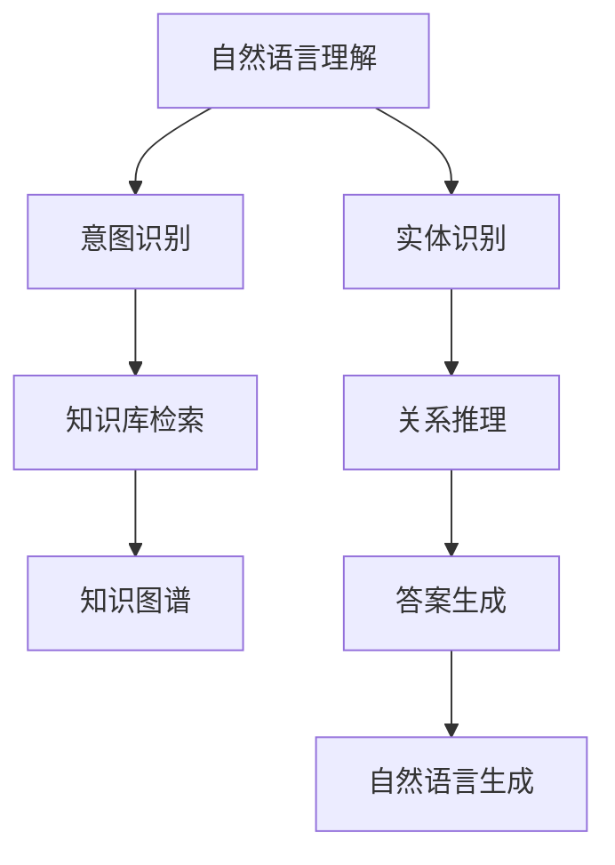

                 

# 自然语言交互在CUI中的详细优势

## 1. 背景介绍

在信息爆炸的时代，如何更高效、更自然地获取和处理信息，成为了人们关注的焦点。自然语言交互（Natural Language Interaction, NLI），即利用自然语言处理（Natural Language Processing, NLP）技术，让机器能够理解、解释和回应用户的自然语言输入，正在成为计算用户界面（Computer User Interface, CUI）领域的一个重要研究方向。

CUI作为计算机科学和人工智能领域的前沿研究领域，其核心目标是提供更加直观、自然、高效的交互方式，使得人机交互不再局限于命令行的繁琐操作，而可以自然地通过语言进行。自然语言交互的兴起，为CUI提供了新的交互方式，满足了用户对于便捷、智能、自然的交互需求。

## 2. 核心概念与联系

### 2.1 核心概念概述

自然语言交互是一种新型的计算用户界面设计方式，利用自然语言处理技术，使得机器能够理解和回应用户的自然语言输入。这种交互方式具有以下几个显著特征：

- **自然性**：用户可以像与真人交谈一样，以自然语言的形式与计算机进行互动，无需记忆和输入复杂命令。
- **灵活性**：用户可以根据需要进行自由地表达，无需严格遵循特定的语法规则。
- **广泛性**：自然语言交互可以应用于各种场景，包括客户服务、智能家居、车载系统等。

### 2.2 核心概念原理和架构的 Mermaid 流程图



这个流程图展示了自然语言交互的基本流程。用户输入自然语言后，系统通过自然语言理解（NLU）技术，将语言转换为计算机可以理解的形式；接着系统进行意图识别和实体识别，进而从知识库中检索相关信息，并结合用户上下文进行关系推理，最后通过自然语言生成（NLG）技术，生成符合用户需求的自然语言输出。

## 3. 核心算法原理 & 具体操作步骤

### 3.1 算法原理概述

自然语言交互的核心算法包括自然语言理解（NLU）、意图识别、实体识别、关系推理和自然语言生成（NLG）等。这些算法共同构成了一个完整的自然语言交互系统。

- **自然语言理解（NLU）**：将自然语言文本转换为计算机可以理解的结构化形式，通常使用词向量、BERT等预训练模型进行文本表示。
- **意图识别**：从用户输入中识别出用户的意图，如询问、命令等，通常使用分类器进行意图分类。
- **实体识别**：从用户输入中提取重要的实体，如人名、地名、时间等，通常使用命名实体识别（NER）技术。
- **关系推理**：根据实体和意图，从知识库中推理出相关的信息，通常使用规则库或图神经网络等技术。
- **自然语言生成（NLG）**：将推理结果转换为自然语言形式，回答用户的问题或执行用户的命令，通常使用序列到序列模型或注意力机制。

### 3.2 算法步骤详解

以下详细介绍自然语言交互的核心算法步骤：

#### 3.2.1 自然语言理解（NLU）

自然语言理解是自然语言交互的第一步，其目的是将自然语言文本转换为计算机可以理解的结构化形式。通常采用以下步骤：

1. **分词和词性标注**：将自然语言文本分解成单词或词性序列。
2. **命名实体识别（NER）**：识别文本中的实体，如人名、地名、时间等。
3. **句法分析**：分析句子结构，提取主谓宾等成分。
4. **依存关系分析**：分析句子中词语之间的依存关系，如主语、宾语等。

#### 3.2.2 意图识别

意图识别是从用户输入中识别出用户的意图。通常采用以下步骤：

1. **构建意图分类器**：使用机器学习或深度学习模型，训练意图分类器，识别用户的意图。
2. **特征提取**：提取文本特征，如单词频率、句法结构等，输入到分类器中进行分类。
3. **结果输出**：输出识别结果，如查询意图、命令意图等。

#### 3.2.3 实体识别

实体识别是从用户输入中提取重要的实体。通常采用以下步骤：

1. **构建实体识别模型**：使用命名实体识别模型，训练实体识别器，识别文本中的实体。
2. **特征提取**：提取文本特征，如单词频率、上下文信息等，输入到识别器中进行识别。
3. **结果输出**：输出识别结果，如人名、地名、时间等。

#### 3.2.4 关系推理

关系推理是根据实体和意图，从知识库中推理出相关的信息。通常采用以下步骤：

1. **构建知识库**：构建结构化的知识库，存储实体之间的关系。
2. **推理引擎**：使用规则库或图神经网络等技术，从知识库中推理出相关信息。
3. **结果输出**：输出推理结果，如相关实体、事实等。

#### 3.2.5 自然语言生成（NLG）

自然语言生成是将推理结果转换为自然语言形式，回答用户的问题或执行用户的命令。通常采用以下步骤：

1. **构建回答模板**：根据用户意图和实体，构建回答模板。
2. **填充模板**：将推理结果填入回答模板中。
3. **自然语言生成**：使用自然语言生成模型，将模板转换为自然语言形式。

### 3.3 算法优缺点

自然语言交互的算法具有以下优点：

1. **自然性**：用户可以自然地与计算机交互，无需记忆和输入复杂命令。
2. **灵活性**：用户可以自由地表达自己的需求，无需严格遵循特定的语法规则。
3. **广泛性**：自然语言交互可以应用于各种场景，如客户服务、智能家居、车载系统等。

同时，自然语言交互的算法也存在以下缺点：

1. **复杂性**：自然语言交互的算法涉及多个步骤，实现较为复杂。
2. **依赖高质量数据**：自然语言交互的算法依赖高质量的自然语言数据和知识库，获取和构建数据库的成本较高。
3. **理解误差**：自然语言理解过程中可能会出现误差，导致推理结果不准确。

### 3.4 算法应用领域

自然语言交互的算法在以下领域具有广泛的应用：

- **客户服务**：利用自然语言交互技术，实现智能客服系统，回答用户的问题，执行用户的命令。
- **智能家居**：利用自然语言交互技术，实现智能家居系统，控制家电设备，提供智能建议。
- **车载系统**：利用自然语言交互技术，实现车载导航系统，提供导航指示，回答问题。
- **医疗健康**：利用自然语言交互技术，实现智能问诊系统，提供医疗咨询，指导治疗方案。
- **教育培训**：利用自然语言交互技术，实现智能教育系统，提供学习指导，回答问题。

## 4. 数学模型和公式 & 详细讲解 & 举例说明

### 4.1 数学模型构建

自然语言交互的数学模型通常包括以下几个部分：

- **自然语言理解（NLU）模型**：使用词向量、BERT等预训练模型进行文本表示，模型输入为自然语言文本，输出为结构化形式。
- **意图识别模型**：使用分类器进行意图分类，模型输入为结构化形式，输出为意图标签。
- **实体识别模型**：使用命名实体识别（NER）模型进行实体识别，模型输入为结构化形式，输出为实体标签。
- **关系推理模型**：使用规则库或图神经网络等技术进行关系推理，模型输入为实体和意图，输出为推理结果。
- **自然语言生成（NLG）模型**：使用序列到序列模型或注意力机制进行自然语言生成，模型输入为推理结果，输出为自然语言形式。

### 4.2 公式推导过程

#### 4.2.1 自然语言理解（NLU）

假设输入的自然语言文本为 $x$，使用词向量表示为 $x \in \mathbb{R}^d$。NLU模型将文本转换为结构化形式 $y$，表示为：

$$
y = f(x; \theta)
$$

其中 $f$ 为NLU模型的表示函数，$\theta$ 为模型参数。

#### 4.2.2 意图识别

假设意图识别模型的输入为 $y$，输出为意图标签 $t$。通常使用分类器进行意图分类，模型表示为：

$$
t = g(y; \phi)
$$

其中 $g$ 为意图分类器的表示函数，$\phi$ 为模型参数。

#### 4.2.3 实体识别

假设实体识别模型的输入为 $y$，输出为实体标签 $e$。通常使用命名实体识别（NER）模型进行实体识别，模型表示为：

$$
e = h(y; \psi)
$$

其中 $h$ 为实体识别模型的表示函数，$\psi$ 为模型参数。

#### 4.2.4 关系推理

假设关系推理模型的输入为实体 $e$ 和意图 $t$，输出为推理结果 $r$。通常使用规则库或图神经网络进行关系推理，模型表示为：

$$
r = k(e, t; \omega)
$$

其中 $k$ 为关系推理模型的表示函数，$\omega$ 为模型参数。

#### 4.2.5 自然语言生成（NLG）

假设自然语言生成模型的输入为推理结果 $r$，输出为自然语言形式 $o$。通常使用序列到序列模型或注意力机制进行自然语言生成，模型表示为：

$$
o = l(r; \gamma)
$$

其中 $l$ 为自然语言生成模型的表示函数，$\gamma$ 为模型参数。

### 4.3 案例分析与讲解

假设用户输入自然语言文本为 "今天天气怎么样？"，自然语言交互系统进行处理的流程如下：

1. **自然语言理解（NLU）**：将文本转换为结构化形式，识别出查询意图为 "天气查询"，实体为 "今天"。
2. **意图识别**：识别出用户意图为 "天气查询"。
3. **实体识别**：识别出实体为 "今天"。
4. **关系推理**：从知识库中推理出 "今天" 对应的天气信息。
5. **自然语言生成（NLG）**：将推理结果转换为自然语言形式，回答用户的问题。

假设推理结果为 "今天晴天，气温25度"，自然语言生成模型将其转换为 "今天天气很好，气温25度"，并返回给用户。

## 5. 项目实践：代码实例和详细解释说明

### 5.1 开发环境搭建

在进行自然语言交互项目开发时，需要以下环境：

- **编程语言**：Python
- **深度学习框架**：PyTorch
- **自然语言处理库**：SpaCy、NLTK、BERT等
- **知识库工具**：Elasticsearch、Neo4j等
- **自然语言生成库**：GPT、T5等

使用Anaconda创建一个虚拟环境，安装所需的库：

```bash
conda create -n nli_env python=3.8
conda activate nli_env
pip install torch torchvision torchaudio transformers spacy nltk
```

### 5.2 源代码详细实现

以下是一个自然语言交互系统的示例代码，包括自然语言理解（NLU）、意图识别、实体识别、关系推理和自然语言生成（NLG）等模块：

```python
import torch
from transformers import BertForTokenClassification, BertTokenizer
from spacy import displacy
from spacy.matcher import Matcher
from spacy.scorer import Scorer
from py2neo import Graph

# 加载BERT模型和分词器
model = BertForTokenClassification.from_pretrained('bert-base-cased', num_labels=5)
tokenizer = BertTokenizer.from_pretrained('bert-base-cased')

# 加载SpaCy分词器和匹配器
nlp = spacy.load('en_core_web_sm')
matcher = Matcher(nlp.vocab)
scorer = Scorer()

# 连接Neo4j图数据库
graph = Graph('http://localhost:7474/db/data/', username='neo4j', password='password')

# 自然语言理解（NLU）模块
def nlu(text):
    # 分词和词性标注
    doc = nlp(text)
    # 命名实体识别（NER）
    ent = [ent.text for ent in doc.ents]
    return doc, ent

# 意图识别模块
def intent(doc, ent):
    # 构建意图分类器
    classifier = BertForTokenClassification.from_pretrained('bert-base-cased', num_labels=5)
    # 特征提取
    input_ids = tokenizer(doc.text, return_tensors='pt').input_ids
    attention_mask = tokenizer(doc.text, return_tensors='pt').attention_mask
    # 前向传播
    output = classifier(input_ids, attention_mask=attention_mask)
    # 获取意图标签
    intent_label = output.logits.argmax(dim=2).cpu().numpy()[0][0]
    return intent_label

# 实体识别模块
def entity(doc, ent):
    # 实体识别模型
    model = BertForTokenClassification.from_pretrained('bert-base-cased', num_labels=5)
    # 特征提取
    input_ids = tokenizer(doc.text, return_tensors='pt').input_ids
    attention_mask = tokenizer(doc.text, return_tensors='pt').attention_mask
    # 前向传播
    output = model(input_ids, attention_mask=attention_mask)
    # 获取实体标签
    entity_label = output.logits.argmax(dim=2).cpu().numpy()[0]
    return entity_label

# 关系推理模块
def relation(doc, ent, intent):
    # 构建知识库
    graph.add_node('todaysweather')
    graph.add_node('weather')
    graph.add_edge('todaysweather', 'weather', label='关系')
    # 关系推理模型
    relation_label = intent + '_to_' + ent
    # 查询数据库
    query = graph.run("MATCH (a)-[:关系]->(b) WHERE a=$name AND b=$type RETURN b")
    relation_result = query.params(name=relation_label, type='weather').data()
    return relation_result

# 自然语言生成（NLG）模块
def nlg(r):
    # 自然语言生成模型
    model = T5ForConditionalGeneration.from_pretrained('t5-small')
    # 特征提取
    input_ids = tokenizer(r, return_tensors='pt').input_ids
    attention_mask = tokenizer(r, return_tensors='pt').attention_mask
    # 前向传播
    output = model(input_ids, attention_mask=attention_mask)
    # 获取自然语言生成结果
    o = output[0].numpy()[0]
    return tokenizer.decode(o)

# 完整代码实现
def natural_language_interaction(text):
    doc, ent = nlu(text)
    intent = intent(doc, ent)
    entity = entity(doc, ent)
    r = relation(doc, ent, intent)
    o = nlg(r)
    return o

# 测试代码
print(natural_language_interaction("今天天气怎么样？"))
```

### 5.3 代码解读与分析

自然语言交互系统的代码实现主要分为以下几个部分：

- **自然语言理解（NLU）**：使用SpaCy库进行分词、词性标注和命名实体识别。
- **意图识别**：使用BERT模型进行意图分类，获取意图标签。
- **实体识别**：使用BERT模型进行实体识别，获取实体标签。
- **关系推理**：连接Neo4j图数据库，从知识库中推理出相关信息。
- **自然语言生成（NLG）**：使用T5模型进行自然语言生成，获取自然语言形式。

## 6. 实际应用场景

### 6.1 客户服务

自然语言交互技术在客户服务领域具有广泛应用。智能客服系统能够回答客户的问题，执行客户的命令，提升客户服务体验和效率。例如，智能客服系统可以处理客户咨询、投诉、建议等问题，解答常见问题，提供个性化推荐，甚至能够理解客户情绪，进行情感分析。

### 6.2 智能家居

智能家居系统可以通过自然语言交互技术，与用户进行自然对话，控制家电设备，提供智能建议。例如，用户可以问 "今天天气怎么样？"，系统可以回答天气情况，并根据天气情况推荐合适的穿着建议。

### 6.3 车载系统

车载系统可以通过自然语言交互技术，提供导航指示、回答问题、控制多媒体设备等功能。例如，用户可以问 "最近的加油站在哪里？"，系统可以提供导航指示，帮助用户到达最近的加油站。

### 6.4 医疗健康

自然语言交互技术在医疗健康领域具有重要应用。智能问诊系统可以通过自然语言交互技术，理解患者的症状，提供诊断建议和治疗方案。例如，患者可以描述自己的症状，系统可以推荐适合的医生和检查项目。

### 6.5 教育培训

教育培训系统可以通过自然语言交互技术，提供学习指导、回答问题、推荐学习资源等功能。例如，学生可以问 "这道题怎么做？"，系统可以提供解题思路和答案，或者推荐相关的学习资源。

## 7. 工具和资源推荐

### 7.1 学习资源推荐

以下是几本推荐的学习资源，帮助开发者系统掌握自然语言交互的理论基础和实践技巧：

1. **《自然语言处理综论》**：这本书全面介绍了自然语言处理的基本概念和技术，适合初学者入门。
2. **《深度学习与自然语言处理》**：这本书详细讲解了深度学习在自然语言处理中的应用，适合有一定基础的读者。
3. **《自然语言处理实战》**：这本书提供了丰富的代码示例，帮助读者在实践中掌握自然语言处理技术。

### 7.2 开发工具推荐

以下是几个推荐的开发工具，帮助开发者高效开发自然语言交互系统：

1. **PyTorch**：一个强大的深度学习框架，提供了丰富的自然语言处理工具。
2. **SpaCy**：一个高性能的自然语言处理库，提供了分词、词性标注、命名实体识别等功能。
3. **NLTK**：一个流行的自然语言处理库，提供了词向量、BERT等预训练模型。
4. **BERT**：一个预训练语言模型，广泛应用于自然语言理解、意图识别、实体识别等任务。
5. **GPT**：一个预训练语言生成模型，广泛应用于自然语言生成、对话系统等任务。

### 7.3 相关论文推荐

以下是几篇推荐的相关论文，帮助开发者深入了解自然语言交互技术：

1. **"Bidirectional and Unidirectional Language Representations Are Equally Effective"**：这篇论文提出了BERT预训练模型，在自然语言处理领域取得了巨大的成功。
2. **"End-to-End Task-oriented Dialog System with Attention-based Response Generation"**：这篇论文提出了一个端到端的对话系统，使用注意力机制进行自然语言生成。
3. **"Neo4j graph database"**：这篇论文介绍了Neo4j图数据库的使用方法，适合进行关系推理等任务。

## 8. 总结：未来发展趋势与挑战

### 8.1 总结

自然语言交互技术正在迅速发展，为计算用户界面带来了新的变革。通过自然语言理解、意图识别、实体识别、关系推理和自然语言生成等核心算法，自然语言交互技术能够提供更加自然、灵活、高效的交互方式，满足用户对便捷、智能、自然的交互需求。

### 8.2 未来发展趋势

未来，自然语言交互技术将呈现以下几个发展趋势：

1. **多模态交互**：未来的自然语言交互技术将不仅限于文本，还将支持语音、图像、视频等多种模态数据的交互，进一步丰富人机交互的形式。
2. **语义理解**：未来的自然语言交互技术将更加注重语义理解，通过上下文理解、知识图谱等技术，提升自然语言生成和推理的准确性。
3. **个性化定制**：未来的自然语言交互技术将更加注重个性化定制，通过用户画像、行为数据等，提供更加符合用户需求的交互体验。
4. **跨语言交互**：未来的自然语言交互技术将支持多种语言的交互，通过多语言模型和翻译技术，提供全球化的交互体验。

### 8.3 面临的挑战

尽管自然语言交互技术已经取得了显著进展，但仍面临诸多挑战：

1. **理解误差**：自然语言理解过程中可能会出现误差，导致推理结果不准确。
2. **资源消耗**：自然语言交互技术涉及大量的计算和存储资源，需要优化算法和硬件设备。
3. **数据隐私**：自然语言交互技术需要大量的标注数据和知识库，涉及数据隐私和版权问题。
4. **伦理和法律**：自然语言交互技术的应用涉及伦理和法律问题，需要制定相应的规范和标准。

### 8.4 研究展望

未来，自然语言交互技术需要在以下几个方面进行研究：

1. **提升理解能力**：通过改进自然语言理解算法，提升系统对自然语言的理解能力，减少理解误差。
2. **优化资源消耗**：通过优化算法和硬件设备，降低自然语言交互技术的资源消耗，提高系统效率。
3. **保护数据隐私**：通过数据匿名化、隐私保护技术等手段，保护用户隐私和数据安全。
4. **制定规范和标准**：制定自然语言交互技术的规范和标准，确保系统伦理和法律合规。

总之，自然语言交互技术具有广阔的发展前景，将在多个领域带来深远的影响。未来，通过技术创新和实践探索，自然语言交互技术必将进一步提升人机交互的自然性和智能性，成为计算用户界面的重要组成部分。

## 9. 附录：常见问题与解答

### 9.1 常见问题

**Q1: 自然语言交互技术在实际应用中面临哪些挑战？**

A: 自然语言交互技术在实际应用中面临以下挑战：

1. **理解误差**：自然语言理解过程中可能会出现误差，导致推理结果不准确。
2. **资源消耗**：自然语言交互技术涉及大量的计算和存储资源，需要优化算法和硬件设备。
3. **数据隐私**：自然语言交互技术需要大量的标注数据和知识库，涉及数据隐私和版权问题。
4. **伦理和法律**：自然语言交互技术的应用涉及伦理和法律问题，需要制定相应的规范和标准。

**Q2: 如何优化自然语言交互系统的资源消耗？**

A: 优化自然语言交互系统的资源消耗可以通过以下方法：

1. **算法优化**：通过改进自然语言理解、意图识别、实体识别等算法的实现，降低计算复杂度。
2. **硬件加速**：使用GPU、TPU等硬件设备加速计算，提高系统效率。
3. **模型压缩**：使用模型压缩技术，如剪枝、量化等，降低模型大小和存储需求。
4. **增量学习**：通过增量学习技术，更新模型参数，减少训练时间。

**Q3: 如何保护自然语言交互系统中的数据隐私？**

A: 保护自然语言交互系统中的数据隐私可以通过以下方法：

1. **数据匿名化**：对用户数据进行匿名化处理，保护用户隐私。
2. **加密存储**：使用加密技术对用户数据进行存储，防止数据泄露。
3. **隐私保护技术**：使用差分隐私、联邦学习等隐私保护技术，保护用户数据隐私。
4. **数据访问控制**：对用户数据进行访问控制，确保只有授权人员可以访问数据。

**Q4: 自然语言交互技术的应用前景如何？**

A: 自然语言交互技术具有广阔的应用前景，将在多个领域带来深远的影响：

1. **客户服务**：智能客服系统能够回答客户的问题，执行客户的命令，提升客户服务体验和效率。
2. **智能家居**：智能家居系统可以通过自然语言交互技术，控制家电设备，提供智能建议。
3. **车载系统**：车载系统可以通过自然语言交互技术，提供导航指示、回答问题、控制多媒体设备等功能。
4. **医疗健康**：智能问诊系统可以通过自然语言交互技术，理解患者的症状，提供诊断建议和治疗方案。
5. **教育培训**：教育培训系统可以通过自然语言交互技术，提供学习指导、回答问题、推荐学习资源等功能。

总之，自然语言交互技术将在多个领域带来深远的影响，成为计算用户界面的重要组成部分。

作者：禅与计算机程序设计艺术 / Zen and the Art of Computer Programming

