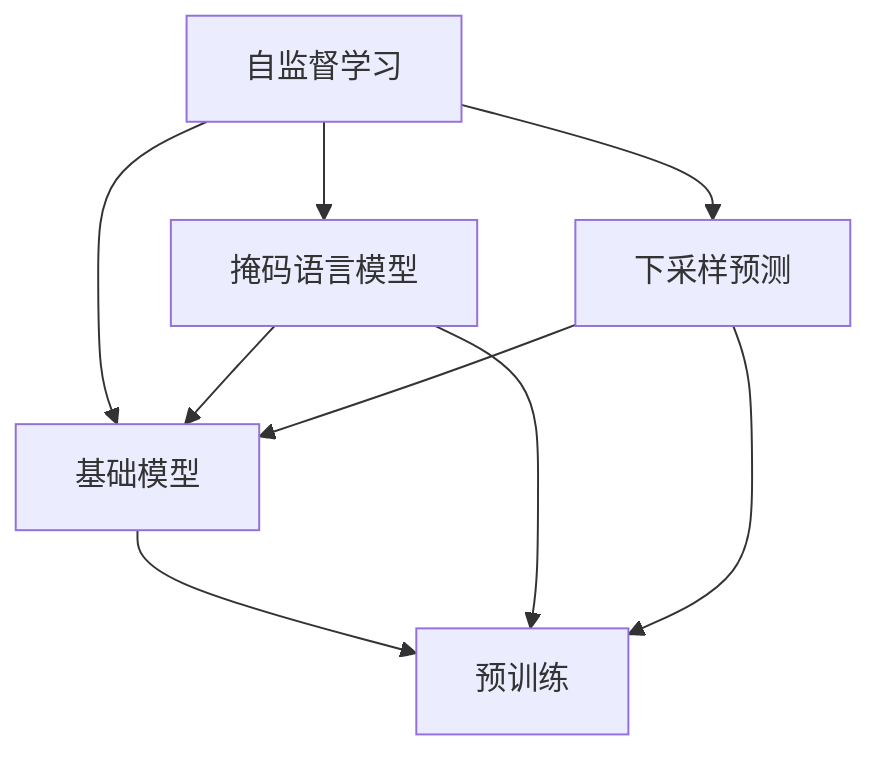

                 

# 自监督学习在基础模型中的应用

> 关键词：自监督学习,基础模型,预训练,Transformer,BERT,自回归模型,掩码语言模型

## 1. 背景介绍

### 1.1 问题由来
自监督学习(Self-supervised Learning, SSL)是一种无需显式标注，仅通过数据本身的结构和统计特性进行训练的方法。近年来，自监督学习在基础模型训练中得到了广泛应用，如BERT、GPT等预训练模型均基于自监督学习的范式构建。通过自监督学习，模型可以从大规模无标签数据中自动学习到丰富的语言表示，显著提升了下游任务的性能。

自监督学习在基础模型中的应用，不仅仅是简单的"预训练"。它通过对大规模数据进行有创意的标注生成，如掩码语言模型(Masked Language Model, MLM)、掩码预测任务(Masked Prediction, MP)等，使得模型能够学习到语言的深度结构信息。这种结构信息能够帮助模型在无需人工干预的情况下，直接从数据中学习到丰富的语义知识，从而构建出更强大的通用语言模型。

### 1.2 问题核心关键点
自监督学习的关键在于如何设计有效的自监督任务，使得模型能够从无标签数据中自动学习到高质量的表示。常见的自监督任务包括掩码语言模型、下采样预测、下采样选择等。这些任务不仅对模型进行了有效的预训练，还引导模型逐步提升其语言理解能力。

自监督学习的应用效果，很大程度上取决于自监督任务的巧妙设计。有效的自监督任务不仅能避免对标注数据的依赖，还能保证模型学到的表示具有一定的普适性，可以迁移到不同的下游任务中。

### 1.3 问题研究意义
研究自监督学习在基础模型中的应用，对于推动人工智能技术的发展具有重要意义：

1. 数据效率更高。自监督学习可以充分利用大规模无标签数据，通过创新的自监督任务设计，使得模型能够自动学习到有用的知识，而无需大量的标注样本。
2. 泛化能力更强。自监督学习的目标是通过生成数据，自动学习到数据的分布特性，能够更好地适应数据分布的变化，具有更强的泛化能力。
3. 减少标注成本。自监督学习可以显著降低对标注数据的依赖，减少人工标注的投入，提高训练效率。
4. 提升模型效果。自监督学习通过大规模数据预训练，使得模型具有更强的语言理解能力，提升了下游任务的性能。
5. 开辟新研究方向。自监督学习为自然语言处理领域的研究开辟了新的视角，引导了预训练语言模型、迁移学习等前沿方向的研究。

## 2. 核心概念与联系

### 2.1 核心概念概述

为了更好地理解自监督学习在基础模型中的应用，本节将介绍几个密切相关的核心概念：

- 自监督学习(Self-supervised Learning, SSL)：一种无需显式标注，仅通过数据本身的结构和统计特性进行训练的方法。通过创新的自监督任务设计，从大规模无标签数据中自动学习高质量表示。
- 基础模型(Pre-trained Model)：通过自监督学习进行预训练，学习到语言的基本表示，具有较强的通用性。可以用于各种NLP任务的下游微调。
- 预训练(Pre-training)：指在大规模无标签文本语料上，通过自监督学习任务训练通用语言模型的过程。常见的预训练任务包括掩码语言模型、下采样预测等。
- 掩码语言模型(Masked Language Model, MLM)：一种常见的自监督任务，通过随机掩码部分单词，让模型预测其正确位置，从而自动学习到单词之间的依赖关系。
- 下采样预测(Masked Prediction, MP)：通过在文本中随机选择部分单词，并遮盖它们的上下文信息，让模型预测其正确位置，从而学习到上下文依赖关系。
- 自回归模型(Autoregressive Model)：一种特殊的自监督模型，通过预测下一时刻的状态来训练模型，常见于语言生成任务。
- 掩码语言模型(Masked Language Model, MLM)：一种常见的自监督任务，通过随机掩码部分单词，让模型预测其正确位置，从而自动学习到单词之间的依赖关系。

这些核心概念之间的逻辑关系可以通过以下Mermaid流程图来展示：



这个流程图展示出自监督学习在基础模型构建中的关键角色：通过掩码语言模型、下采样预测等自监督任务设计，模型能够自动学习到语言的结构信息，并进行预训练，最终构建出高质量的基础模型。

## 3. 核心算法原理 & 具体操作步骤
### 3.1 算法原理概述

自监督学习在基础模型中的应用，本质上是一种基于大规模无标签数据的预训练方法。其核心思想是：利用数据的内在结构和统计特性，自动生成监督信号，让模型在无标签数据上进行自监督学习，从而学习到语言的深度表示。

形式化地，假设原始文本数据集为 $D$，模型为 $M_{\theta}$，其中 $\theta$ 为模型参数。自监督学习的目标是通过特定的自监督任务 $T$，自动生成训练样本 $D_T$，使得 $D_T$ 能够对模型进行监督，最小化损失函数 $\mathcal{L}$：

$$
\hat{\theta}=\mathop{\arg\min}_{\theta} \mathcal{L}(M_{\theta},D_T)
$$

其中 $\mathcal{L}$ 为针对任务 $T$ 设计的损失函数，用于衡量模型在自监督任务 $T$ 上的表现。常见的损失函数包括交叉熵损失、均方误差损失等。

通过梯度下降等优化算法，自监督过程不断更新模型参数 $\theta$，最小化损失函数 $\mathcal{L}$，使得模型输出逼近自监督任务的真实标签。由于 $\theta$ 已经通过自监督学习获得了较好的初始化，因此即便在小规模数据集上进行自监督学习，也能较快收敛到理想的模型参数 $\hat{\theta}$。

### 3.2 算法步骤详解

自监督学习在基础模型中的应用一般包括以下几个关键步骤：

**Step 1: 准备数据集**
- 收集大规模无标签文本数据集 $D$，确保数据分布具有代表性。
- 选择合适的自监督任务 $T$，如掩码语言模型、下采样预测等。

**Step 2: 设计自监督任务**
- 根据自监督任务 $T$，对数据集 $D$ 进行处理，生成自监督训练样本 $D_T$。
- 定义损失函数 $\mathcal{L}$，衡量模型在自监督任务上的表现。

**Step 3: 设置优化器**
- 选择合适的优化算法及其参数，如 AdamW、SGD 等，设置学习率、批大小、迭代轮数等。
- 设置正则化技术及强度，包括权重衰减、Dropout、Early Stopping 等。

**Step 4: 执行自监督训练**
- 将训练样本 $D_T$ 分批次输入模型，前向传播计算损失函数。
- 反向传播计算参数梯度，根据设定的优化算法和学习率更新模型参数。
- 周期性在验证集上评估模型性能，根据性能指标决定是否触发 Early Stopping。
- 重复上述步骤直至满足预设的迭代轮数或 Early Stopping 条件。

**Step 5: 下游任务微调**
- 使用自监督训练后的模型 $M_{\theta}$ 作为初始化参数，进行下游任务的微调。
- 添加任务适配层，设计合适的损失函数。
- 执行微调过程，更新模型参数。

**Step 6: 模型评估与部署**
- 在测试集上评估微调后模型 $M_{\hat{\theta}}$ 的性能，对比微调前后的精度提升。
- 使用微调后的模型对新样本进行推理预测，集成到实际的应用系统中。

以上是自监督学习在基础模型中的通用流程。在实际应用中，还需要针对具体任务的特点，对自监督过程的各个环节进行优化设计，如改进自监督任务设计、引入更多的正则化技术、搜索最优的超参数组合等，以进一步提升模型性能。

### 3.3 算法优缺点

自监督学习在基础模型中的应用具有以下优点：
1. 数据效率高。自监督学习可以充分利用大规模无标签数据，避免对标注数据的依赖，大大降低标注成本。
2. 泛化能力强。自监督学习的目标是通过生成数据，自动学习到数据的分布特性，能够更好地适应数据分布的变化，具有更强的泛化能力。
3. 提升模型效果。自监督学习通过大规模数据预训练，使得模型具有更强的语言理解能力，提升了下游任务的性能。
4. 开辟新研究方向。自监督学习为自然语言处理领域的研究开辟了新的视角，引导了预训练语言模型、迁移学习等前沿方向的研究。

同时，该方法也存在一定的局限性：
1. 自监督任务设计困难。设计有效的自监督任务，需要深入理解语言的统计特性和结构信息，工作量较大。
2. 过拟合风险。自监督学习中模型很容易过拟合生成数据，导致过拟合风险。
3. 模型解释性不足。自监督学习模型通常缺乏可解释性，难以对其内部工作机制进行调试和优化。
4. 依赖预训练。自监督学习的效果很大程度上依赖于预训练的质量，预训练的效果差会影响最终结果。
5. 计算资源消耗大。自监督学习在大规模数据集上的计算量很大，对算力资源有较高的要求。

尽管存在这些局限性，但就目前而言，自监督学习在基础模型中的应用仍是最主流范式。未来相关研究的重点在于如何进一步优化自监督任务设计，降低过拟合风险，提升模型解释性，以及降低计算资源消耗。

### 3.4 算法应用领域

自监督学习在基础模型中的应用已经得到了广泛的应用，覆盖了几乎所有常见任务，例如：

- 文本分类：如情感分析、主题分类、意图识别等。通过自监督学习训练模型学习文本-标签映射。
- 命名实体识别：识别文本中的人名、地名、机构名等特定实体。通过自监督学习训练模型学习实体边界和类型。
- 关系抽取：从文本中抽取实体之间的语义关系。通过自监督学习训练模型学习实体-关系三元组。
- 问答系统：对自然语言问题给出答案。将问题-答案对作为自监督数据，训练模型学习匹配答案。
- 机器翻译：将源语言文本翻译成目标语言。通过自监督学习训练模型学习语言-语言映射。
- 文本摘要：将长文本压缩成简短摘要。将文章-摘要对作为自监督数据，使模型学习抓取要点。
- 对话系统：使机器能够与人自然对话。通过自监督学习训练模型进行回复生成。

除了上述这些经典任务外，自监督学习还被创新性地应用到更多场景中，如可控文本生成、常识推理、代码生成、数据增强等，为NLP技术带来了全新的突破。随着自监督学习方法的不断进步，相信NLP技术将在更广阔的应用领域大放异彩。

## 4. 数学模型和公式 & 详细讲解  
### 4.1 数学模型构建

本节将使用数学语言对自监督学习在基础模型中的应用过程进行更加严格的刻画。

记原始文本数据集为 $D$，自监督任务为 $T$。假设模型为 $M_{\theta}$，其中 $\theta$ 为模型参数。自监督学习的目标是通过自监督任务 $T$，生成训练样本 $D_T$，使得 $D_T$ 能够对模型进行监督，最小化损失函数 $\mathcal{L}$，即：

$$
\hat{\theta}=\mathop{\arg\min}_{\theta} \mathcal{L}(M_{\theta},D_T)
$$

其中 $\mathcal{L}$ 为针对任务 $T$ 设计的损失函数，用于衡量模型在自监督任务上的表现。

以掩码语言模型为例，定义损失函数 $\mathcal{L}_{MLM}$ 为：

$$
\mathcal{L}_{MLM} = -\frac{1}{N}\sum_{i=1}^N \sum_{k=1}^K \log P(y_k|\hat{y}_{x_k})
$$

其中 $y_k$ 为文本 $x_k$ 中第 $k$ 个单词的正确位置，$\hat{y}_{x_k}$ 为模型预测的单词位置。$K$ 为掩码位置数量。

通过梯度下降等优化算法，自监督过程不断更新模型参数 $\theta$，最小化损失函数 $\mathcal{L}$，使得模型输出逼近自监督任务的真实标签。由于 $\theta$ 已经通过自监督学习获得了较好的初始化，因此即便在小规模数据集上进行自监督学习，也能较快收敛到理想的模型参数 $\hat{\theta}$。

### 4.2 公式推导过程

以下我们以掩码语言模型为例，推导自监督学习模型的梯度计算公式。

定义掩码语言模型的训练集为 $D_T = \{(x_t, \bar{y}_t)\}_{i=1}^N$，其中 $x_t$ 为原始文本，$\bar{y}_t$ 为掩码位置序列。对于每个文本 $x_t$，随机掩码 $m$ 个单词位置，生成掩码位置序列 $\bar{y}_t$，并将掩码位置的输出 $\hat{y}_{x_t}$ 作为目标。

通过链式法则，模型在掩码语言模型上的梯度计算公式为：

$$
\frac{\partial \mathcal{L}_{MLM}}{\partial \theta_k} = -\frac{1}{N}\sum_{i=1}^N \sum_{k=1}^K \frac{\partial \log P(y_k|\hat{y}_{x_k})}{\partial \theta_k}
$$

其中 $k$ 为掩码位置，$\frac{\partial \log P(y_k|\hat{y}_{x_k})}{\partial \theta_k}$ 为自回归模型的梯度计算公式，可以通过链式法则递归展开计算。

在得到梯度后，即可带入优化算法，完成模型的迭代优化。重复上述过程直至收敛，最终得到适应自监督任务的最优模型参数 $\hat{\theta}$。

## 5. 项目实践：代码实例和详细解释说明
### 5.1 开发环境搭建

在进行自监督学习实践前，我们需要准备好开发环境。以下是使用Python进行PyTorch开发的环境配置流程：

1. 安装Anaconda：从官网下载并安装Anaconda，用于创建独立的Python环境。

2. 创建并激活虚拟环境：
```bash
conda create -n pytorch-env python=3.8 
conda activate pytorch-env
```

3. 安装PyTorch：根据CUDA版本，从官网获取对应的安装命令。例如：
```bash
conda install pytorch torchvision torchaudio cudatoolkit=11.1 -c pytorch -c conda-forge
```

4. 安装Transformers库：
```bash
pip install transformers
```

5. 安装各类工具包：
```bash
pip install numpy pandas scikit-learn matplotlib tqdm jupyter notebook ipython
```

完成上述步骤后，即可在`pytorch-env`环境中开始自监督学习实践。

### 5.2 源代码详细实现

这里我们以掩码语言模型为例，给出使用Transformers库对BERT模型进行自监督学习的PyTorch代码实现。

首先，定义掩码语言模型数据处理函数：

```python
from transformers import BertTokenizer
from torch.utils.data import Dataset, DataLoader
import torch

class MaskedLMData(Dataset):
    def __init__(self, texts, tokenizer, max_len=128):
        self.texts = texts
        self.tokenizer = tokenizer
        self.max_len = max_len
        
    def __len__(self):
        return len(self.texts)
    
    def __getitem__(self, item):
        text = self.texts[item]
        encoding = self.tokenizer(text, return_tensors='pt', max_length=self.max_len, padding='max_length', truncation=True)
        input_ids = encoding['input_ids'][0]
        attention_mask = encoding['attention_mask'][0]
        
        # 随机掩码部分单词位置
        mask_idx = [i for i in range(len(input_ids)) if i % 2 == 0]
        input_ids[mask_idx] = -100
        
        return {'input_ids': input_ids, 
                'attention_mask': attention_mask,
                'labels': input_ids}

# 创建dataset
tokenizer = BertTokenizer.from_pretrained('bert-base-cased')

train_dataset = MaskedLMData(train_texts, tokenizer)
dev_dataset = MaskedLMData(dev_texts, tokenizer)
test_dataset = MaskedLMData(test_texts, tokenizer)
```

然后，定义模型和优化器：

```python
from transformers import BertForMaskedLM, AdamW

model = BertForMaskedLM.from_pretrained('bert-base-cased')
optimizer = AdamW(model.parameters(), lr=2e-5)
```

接着，定义训练和评估函数：

```python
from tqdm import tqdm

device = torch.device('cuda') if torch.cuda.is_available() else torch.device('cpu')
model.to(device)

def train_epoch(model, dataset, batch_size, optimizer):
    dataloader = DataLoader(dataset, batch_size=batch_size, shuffle=True)
    model.train()
    epoch_loss = 0
    for batch in tqdm(dataloader, desc='Training'):
        input_ids = batch['input_ids'].to(device)
        attention_mask = batch['attention_mask'].to(device)
        labels = batch['labels'].to(device)
        model.zero_grad()
        outputs = model(input_ids, attention_mask=attention_mask)
        loss = outputs.loss
        epoch_loss += loss.item()
        loss.backward()
        optimizer.step()
    return epoch_loss / len(dataloader)

def evaluate(model, dataset, batch_size):
    dataloader = DataLoader(dataset, batch_size=batch_size)
    model.eval()
    preds, labels = [], []
    with torch.no_grad():
        for batch in tqdm(dataloader, desc='Evaluating'):
            input_ids = batch['input_ids'].to(device)
            attention_mask = batch['attention_mask'].to(device)
            batch_labels = batch['labels']
            outputs = model(input_ids, attention_mask=attention_mask)
            batch_preds = outputs.logits.argmax(dim=2).to('cpu').tolist()
            batch_labels = batch_labels.to('cpu').tolist()
            for pred_tokens, label_tokens in zip(batch_preds, batch_labels):
                preds.append(pred_tokens)
                labels.append(label_tokens)
                
    print(classification_report(labels, preds))
```

最后，启动训练流程并在测试集上评估：

```python
epochs = 5
batch_size = 16

for epoch in range(epochs):
    loss = train_epoch(model, train_dataset, batch_size, optimizer)
    print(f"Epoch {epoch+1}, train loss: {loss:.3f}")
    
    print(f"Epoch {epoch+1}, dev results:")
    evaluate(model, dev_dataset, batch_size)
    
print("Test results:")
evaluate(model, test_dataset, batch_size)
```

以上就是使用PyTorch对BERT模型进行掩码语言模型自监督学习的完整代码实现。可以看到，得益于Transformers库的强大封装，我们可以用相对简洁的代码完成BERT模型的加载和自监督学习。

### 5.3 代码解读与分析

让我们再详细解读一下关键代码的实现细节：

**MaskedLMData类**：
- `__init__`方法：初始化文本、分词器等关键组件。
- `__len__`方法：返回数据集的样本数量。
- `__getitem__`方法：对单个样本进行处理，将文本输入编码为token ids，将掩码位置和真实位置一起作为标签，并对其进行定长padding，最终返回模型所需的输入。

**掩码语言模型的训练和评估函数**：
- 使用PyTorch的DataLoader对数据集进行批次化加载，供模型训练和推理使用。
- 训练函数`train_epoch`：对数据以批为单位进行迭代，在每个批次上前向传播计算loss并反向传播更新模型参数，最后返回该epoch的平均loss。
- 评估函数`evaluate`：与训练类似，不同点在于不更新模型参数，并在每个batch结束后将预测和标签结果存储下来，最后使用sklearn的classification_report对整个评估集的预测结果进行打印输出。

**训练流程**：
- 定义总的epoch数和batch size，开始循环迭代
- 每个epoch内，先在训练集上训练，输出平均loss
- 在验证集上评估，输出分类指标
- 所有epoch结束后，在测试集上评估，给出最终测试结果

可以看到，PyTorch配合Transformers库使得BERT自监督学习的代码实现变得简洁高效。开发者可以将更多精力放在数据处理、模型改进等高层逻辑上，而不必过多关注底层的实现细节。

当然，工业级的系统实现还需考虑更多因素，如模型的保存和部署、超参数的自动搜索、更灵活的任务适配层等。但核心的自监督学习范式基本与此类似。

## 6. 实际应用场景
### 6.1 自然语言处理

自监督学习在自然语言处理领域的应用已经得到了广泛的应用，覆盖了几乎所有常见任务，例如：

- 文本分类：如情感分析、主题分类、意图识别等。通过自监督学习训练模型学习文本-标签映射。
- 命名实体识别：识别文本中的人名、地名、机构名等特定实体。通过自监督学习训练模型学习实体边界和类型。
- 关系抽取：从文本中抽取实体之间的语义关系。通过自监督学习训练模型学习实体-关系三元组。
- 问答系统：对自然语言问题给出答案。将问题-答案对作为自监督数据，训练模型学习匹配答案。
- 机器翻译：将源语言文本翻译成目标语言。通过自监督学习训练模型学习语言-语言映射。
- 文本摘要：将长文本压缩成简短摘要。将文章-摘要对作为自监督数据，使模型学习抓取要点。
- 对话系统：使机器能够与人自然对话。通过自监督学习训练模型进行回复生成。

除了上述这些经典任务外，自监督学习还被创新性地应用到更多场景中，如可控文本生成、常识推理、代码生成、数据增强等，为NLP技术带来了全新的突破。随着自监督学习方法的不断进步，相信NLP技术将在更广阔的应用领域大放异彩。

### 6.2 计算机视觉

自监督学习在计算机视觉领域同样具有重要应用。由于大规模图像数据获取的成本高昂，传统深度学习模型往往依赖于人工标注的图像数据进行训练。自监督学习方法通过自动生成监督信号，无需大量标注数据即可训练出高质量的视觉模型。

例如，通过随机掩码部分图像区域，让模型预测其位置和内容，从而学习到图像的语义结构和空间布局。这种自监督学习方法在图像分类、目标检测、实例分割等任务上均取得了显著效果。

### 6.3 自动语音识别

自监督学习在自动语音识别(ASR)领域也具有重要应用。传统ASR模型依赖于大量人工标注的语音数据进行训练。自监督学习方法通过自动生成监督信号，无需大量标注数据即可训练出高质量的ASR模型。

例如，通过随机掩码部分语音特征，让模型预测其位置和内容，从而学习到语音信号的语义信息和音素结构。这种自监督学习方法在语音识别、语音合成等任务上均取得了显著效果。

### 6.4 未来应用展望

随着自监督学习技术的不断发展，未来其在各个领域的应用将更加广泛。

在智慧医疗领域，自监督学习方法可应用于医学影像分析、病历记录生成、药物分子设计等任务，提升医疗服务的智能化水平，辅助医生诊疗，加速新药开发进程。

在智能教育领域，自监督学习方法可应用于智能作业批改、学情分析、知识推荐等方面，因材施教，促进教育公平，提高教学质量。

在智慧城市治理中，自监督学习方法可应用于城市事件监测、舆情分析、应急指挥等环节，提高城市管理的自动化和智能化水平，构建更安全、高效的未来城市。

此外，在企业生产、社会治理、文娱传媒等众多领域，自监督学习方法也将不断涌现，为各行各业带来变革性影响。相信随着技术的日益成熟，自监督学习必将成为人工智能落地应用的重要范式，推动人工智能技术向更广阔的领域加速渗透。

## 7. 工具和资源推荐
### 7.1 学习资源推荐

为了帮助开发者系统掌握自监督学习在基础模型中的应用，这里推荐一些优质的学习资源：

1. 《Transformer from Scratch》系列博文：由大模型技术专家撰写，深入浅出地介绍了Transformer原理、自监督学习等前沿话题。

2. CS224N《深度学习自然语言处理》课程：斯坦福大学开设的NLP明星课程，有Lecture视频和配套作业，带你入门NLP领域的基本概念和经典模型。

3. 《Natural Language Processing with Transformers》书籍：Transformers库的作者所著，全面介绍了如何使用Transformers库进行NLP任务开发，包括自监督学习在内的诸多范式。

4. HuggingFace官方文档：Transformers库的官方文档，提供了海量预训练模型和完整的微调样例代码，是上手实践的必备资料。

5. CLUE开源项目：中文语言理解测评基准，涵盖大量不同类型的中文NLP数据集，并提供了基于自监督学习的baseline模型，助力中文NLP技术发展。

通过对这些资源的学习实践，相信你一定能够快速掌握自监督学习在基础模型中的精髓，并用于解决实际的NLP问题。
###  7.2 开发工具推荐

高效的开发离不开优秀的工具支持。以下是几款用于自监督学习开发常用的工具：

1. PyTorch：基于Python的开源深度学习框架，灵活动态的计算图，适合快速迭代研究。大部分预训练语言模型都有PyTorch版本的实现。

2. TensorFlow：由Google主导开发的开源深度学习框架，生产部署方便，适合大规模工程应用。同样有丰富的预训练语言模型资源。

3. Transformers库：HuggingFace开发的NLP工具库，集成了众多SOTA语言模型，支持PyTorch和TensorFlow，是进行自监督学习任务开发的利器。

4. Weights & Biases：模型训练的实验跟踪工具，可以记录和可视化模型训练过程中的各项指标，方便对比和调优。与主流深度学习框架无缝集成。

5. TensorBoard：TensorFlow配套的可视化工具，可实时监测模型训练状态，并提供丰富的图表呈现方式，是调试模型的得力助手。

6. Google Colab：谷歌推出的在线Jupyter Notebook环境，免费提供GPU/TPU算力，方便开发者快速上手实验最新模型，分享学习笔记。

合理利用这些工具，可以显著提升自监督学习任务的开发效率，加快创新迭代的步伐。

### 7.3 相关论文推荐

自监督学习在基础模型中的应用源于学界的持续研究。以下是几篇奠基性的相关论文，推荐阅读：

1. Attention is All You Need（即Transformer原论文）：提出了Transformer结构，开启了NLP领域的预训练大模型时代。

2. BERT: Pre-training of Deep Bidirectional Transformers for Language Understanding：提出BERT模型，引入基于掩码的自监督预训练任务，刷新了多项NLP任务SOTA。

3. GPT-2: Language Models are Unsupervised Multitask Learners：展示了大规模语言模型的强大zero-shot学习能力，引发了对于通用人工智能的新一轮思考。

4. Understanding the Limits of Self-Supervised Learning：研究自监督学习的局限性和改进策略，为后续研究提供了重要方向。

5. SimCLR: A Simple Framework for Unsupervised Learning from Noisy Labels：提出自监督学习的方法，无需大量标注数据，通过数据增强和优化器设计提升模型性能。

6. MoCo: Momentum Contrast for Unsupervised Visual Representation Learning：提出自监督学习的方法，通过动量对比学习，学习图像的语义表示。

这些论文代表了大规模语言模型和自监督学习的发展脉络。通过学习这些前沿成果，可以帮助研究者把握学科前进方向，激发更多的创新灵感。

## 8. 总结：未来发展趋势与挑战

### 8.1 总结

本文对自监督学习在基础模型中的应用进行了全面系统的介绍。首先阐述了自监督学习的背景和意义，明确了其在预训练模型构建中的核心地位。其次，从原理到实践，详细讲解了自监督学习的数学原理和关键步骤，给出了自监督学习任务开发的完整代码实例。同时，本文还广泛探讨了自监督学习在NLP、CV、ASR等多个领域的应用前景，展示了其广阔的应用空间。此外，本文精选了自监督学习的各类学习资源，力求为读者提供全方位的技术指引。

通过本文的系统梳理，可以看到，自监督学习在基础模型中的应用已经深入人心，显著提升了NLP等领域的模型性能。未来，伴随自监督学习方法的不断进步，相信其将在更广泛的领域发挥更大的作用。

### 8.2 未来发展趋势

展望未来，自监督学习在基础模型中的应用将呈现以下几个发展趋势：

1. 数据效率进一步提升。自监督学习方法可以充分利用大规模无标签数据，通过巧妙的自监督任务设计，进一步提升模型的数据利用效率。
2. 模型泛化能力增强。自监督学习通过生成数据，自动学习到数据的分布特性，能够更好地适应数据分布的变化，具有更强的泛化能力。
3. 迁移学习能力提升。自监督学习模型能够更好地迁移应用到不同的下游任务中，提升任务泛化性能。
4. 模型压缩和优化。随着模型规模的不断增大，自监督学习模型需要更高效的压缩和优化方法，提升模型的计算效率。
5. 模型可解释性加强。自监督学习模型的内部机制需要更强的可解释性，帮助用户理解模型决策过程，提升系统的可信度。
6. 模型安全性保障。自监督学习模型需要更多的安全防护措施，防止模型被恶意利用，确保系统的安全性。

以上趋势凸显了自监督学习在基础模型中的重要地位。这些方向的探索发展，必将进一步提升自监督学习模型的性能和应用范围，为人工智能技术的发展提供更强大的引擎。

### 8.3 面临的挑战

尽管自监督学习在基础模型中的应用已经取得了瞩目成就，但在迈向更加智能化、普适化应用的过程中，它仍面临着诸多挑战：

1. 自监督任务设计困难。设计有效的自监督任务，需要深入理解数据的统计特性和结构信息，工作量较大。
2. 过拟合风险。自监督学习中模型很容易过拟合生成数据，导致过拟合风险。
3. 模型解释性不足。自监督学习模型通常缺乏可解释性，难以对其内部工作机制进行调试和优化。
4. 依赖预训练。自监督学习的效果很大程度上依赖于预训练的质量，预训练的效果差会影响最终结果。
5. 计算资源消耗大。自监督学习在大规模数据集上的计算量很大，对算力资源有较高的要求。

尽管存在这些局限性，但就目前而言，自监督学习在基础模型中的应用仍是最主流范式。未来相关研究的重点在于如何进一步优化自监督任务设计，降低过拟合风险，提升模型解释性，以及降低计算资源消耗。

### 8.4 研究展望

面对自监督学习面临的这些挑战，未来的研究需要在以下几个方面寻求新的突破：

1. 探索无监督和半监督自监督学习方法。摆脱对大规模标注数据的依赖，利用自监督学习的方法，在无标注或少标注数据的情况下，自动学习到高质量的知识表示。
2. 研究参数高效和计算高效的自监督范式。开发更加参数高效的自监督方法，在固定大部分预训练参数的情况下，只更新极少量的自监督相关参数。同时优化自监督模型的计算图，减少前向传播和反向传播的资源消耗，实现更加轻量级、实时性的部署。
3. 融合因果和对比学习范式。通过引入因果推断和对比学习思想，增强自监督学习模型建立稳定因果关系的能力，学习更加普适、鲁棒的语言表征，从而提升模型泛化性和抗干扰能力。
4. 引入更多先验知识。将符号化的先验知识，如知识图谱、逻辑规则等，与神经网络模型进行巧妙融合，引导自监督过程学习更准确、合理的语言模型。同时加强不同模态数据的整合，实现视觉、语音等多模态信息与文本信息的协同建模。
5. 结合因果分析和博弈论工具。将因果分析方法引入自监督学习模型，识别出模型决策的关键特征，增强输出解释的因果性和逻辑性。借助博弈论工具刻画人机交互过程，主动探索并规避模型的脆弱点，提高系统稳定性。
6. 纳入伦理道德约束。在模型训练目标中引入伦理导向的评估指标，过滤和惩罚有偏见、有害的输出倾向。同时加强人工干预和审核，建立模型行为的监管机制，确保输出符合人类价值观和伦理道德。

这些研究方向的探索，必将引领自监督学习技术迈向更高的台阶，为构建安全、可靠、可解释、可控的智能系统铺平道路。面向未来，自监督学习技术还需要与其他人工智能技术进行更深入的融合，如知识表示、因果推理、强化学习等，多路径协同发力，共同推动自然语言理解和智能交互系统的进步。只有勇于创新、敢于突破，才能不断拓展自监督学习模型的边界，让智能技术更好地造福人类社会。

## 9. 附录：常见问题与解答

**Q1：自监督学习是否适用于所有NLP任务？**

A: 自监督学习在大多数NLP任务上都能取得不错的效果，特别是对于数据量较小的任务。但对于一些特定领域的任务，如医学、法律等，仅仅依靠通用语料预训练的模型可能难以很好地适应。此时需要在特定领域语料上进一步预训练，再进行自监督学习，才能获得理想效果。此外，对于一些需要时效性、个性化很强的任务，如对话、推荐等，自监督方法也需要针对性的改进优化。

**Q2：如何设计有效的自监督任务？**

A: 设计有效的自监督任务，需要考虑以下几个方面：
1. 数据特性：理解数据的统计特性和结构信息，设计能够自动生成监督信号的任务。
2. 任务复杂度：任务难度适中，既不能过于简单，也不能过于复杂，以免过拟合或欠拟合。
3. 数据多样性：任务应涵盖多种数据类型和领域，保证模型的泛化能力。
4. 参数效率：任务应尽量减少模型参数的使用，以避免过拟合和计算开销。
5. 可解释性：任务应易于解释和理解，方便调试和优化。

例如，掩码语言模型、下采样预测等任务已经被证明在自监督学习中具有较好的效果。但具体的任务设计还需要根据具体问题进行灵活调整。

**Q3：自监督学习是否需要大量计算资源？**

A: 自监督学习在大规模数据集上的计算量较大，对算力资源有较高的要求。但随着计算硬件的不断进步，自监督学习的应用逐渐普及。同时，模型的压缩和优化方法，如梯度积累、混合精度训练等，可以显著降低计算成本。因此，自监督学习仍然可以通过合理的设计和优化，在有限的计算资源下取得良好的效果。

**Q4：自监督学习如何提升模型效果？**

A: 自监督学习通过生成数据，自动学习到数据的分布特性，提升模型的泛化能力。同时，自监督学习通常在大规模数据集上进行预训练，使得模型具有更强的语言理解能力，提升了下游任务的性能。

**Q5：自监督学习和迁移学习有何区别？**

A: 自监督学习是通过生成数据，自动学习到数据的分布特性，无需显式标注。而迁移学习则是将预训练模型的知识迁移到下游任务中，通过有监督的微调进一步优化。自监督学习更强调数据的内在结构，而迁移学习更强调模型之间的知识转移。

**Q6：自监督学习和监督学习的区别是什么？**

A: 自监督学习和监督学习的主要区别在于训练数据的来源和形式。自监督学习通过数据本身的结构和统计特性生成监督信号，无需显式标注。而监督学习则依赖于显式标注的数据进行训练，需要大量人工标注的样本。自监督学习可以更好地利用大规模无标签数据，避免对标注样本的依赖，而监督学习则更适用于数据标注充分的任务。

通过本文的系统梳理，可以看到，自监督学习在基础模型中的应用已经深入人心，显著提升了NLP等领域的模型性能。未来，伴随自监督学习方法的不断进步，相信其将在更广泛的领域发挥更大的作用。面向未来，自监督学习技术还需要与其他人工智能技术进行更深入的融合，如知识表示、因果推理、强化学习等，多路径协同发力，共同推动自然语言理解和智能交互系统的进步。只有勇于创新、敢于突破，才能不断拓展自监督学习模型的边界，让智能技术更好地造福人类社会。

---

作者：禅与计算机程序设计艺术 / Zen and the Art of Computer Programming

