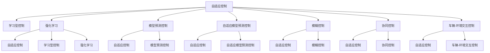

                 

## 1. 背景介绍

### 1.1 问题由来
随着自动驾驶技术的迅猛发展，智能交通系统已成为未来城市交通的重要组成部分。然而，自动驾驶面临诸多挑战，如环境复杂性、动态性、安全性等。为应对这些挑战，研究者提出了一系列自适应与学习型控制策略，通过动态调整控制参数和优化决策规则，提高自动驾驶系统的鲁棒性和适应性。

### 1.2 问题核心关键点
自适应与学习型控制策略的核心在于实时地感知环境变化，动态调整车辆控制参数，并持续学习优化决策规则。该策略能够提升自动驾驶系统的稳定性和安全性，降低交通事故率，提高行车效率。

### 1.3 问题研究意义
研究自适应与学习型控制策略，对于提升自动驾驶系统的鲁棒性和适应性具有重要意义：
- 提高系统安全性：动态调整控制参数，提升对突发事件的应对能力，减少交通事故。
- 增强系统鲁棒性：学习型控制策略能够适应复杂和动态的环境，降低环境不确定性带来的影响。
- 优化行车效率：实时感知环境变化，动态调整车辆控制策略，提升行驶效率和舒适度。
- 降低能耗：智能决策能够优化车辆动力输出，减少无效加速和减速，降低能源消耗。
- 提升用户满意度：自适应控制策略能够提升行车体验，满足用户对舒适和安全的期望。

## 2. 核心概念与联系

### 2.1 核心概念概述
为更好地理解自适应与学习型控制策略的应用，本节将介绍几个核心概念：

- **自适应控制(Adaptive Control)**：通过实时感知环境变化，动态调整系统控制参数，保持系统性能稳定。
- **学习型控制(Learning Control)**：通过算法不断优化控制策略，提升系统适应性和预测准确性。
- **强化学习(Reinforcement Learning, RL)**：通过试错机制，优化控制策略，最大化长期回报。
- **模型预测控制(Model Predictive Control, MPC)**：通过模型预测未来状态，提前制定控制决策，提高系统稳定性。
- **自适应模型预测控制(Adaptive Model Predictive Control, AMPC)**：结合自适应和预测控制，动态调整预测模型参数。
- **模糊控制(Fuzzy Control)**：利用模糊逻辑处理不确定性，提高控制系统的鲁棒性。
- **协同控制(Collaborative Control)**：多车协同优化决策，提升整体交通效率。
- **车辆-环境交互控制(Vehicle-Environment Interaction Control)**：考虑车辆与环境的动态交互，优化控制策略。

这些概念之间的逻辑关系可以通过以下Mermaid流程图来展示：



### 2.2 核心概念原理和架构

#### 2.2.1 自适应控制原理
自适应控制的核心在于实时监控系统状态，根据环境变化动态调整控制参数，以保持系统性能稳定。其架构主要包括：
1. **状态监测模块**：实时感知车辆速度、位置、姿态等状态信息。
2. **参数自适应模块**：根据状态信息动态调整控制参数（如制动力、转向角等）。
3. **性能评估模块**：根据预设目标（如速度、轨迹等）评估系统性能，反馈给参数自适应模块。

#### 2.2.2 学习型控制原理
学习型控制通过不断迭代优化控制策略，提升系统适应性和预测准确性。其架构主要包括：
1. **策略学习模块**：基于历史数据或模拟环境，优化控制策略（如PID控制器参数、决策树等）。
2. **模型学习模块**：基于经验数据，学习系统动态模型（如线性回归、神经网络等）。
3. **行为预测模块**：基于学习模型，预测系统行为，生成控制决策。

#### 2.2.3 强化学习原理
强化学习通过试错机制，优化控制策略，最大化长期回报。其架构主要包括：
1. **环境模拟模块**：模拟实际驾驶环境，生成状态和奖励信号。
2. **策略优化模块**：基于试错经验，优化控制策略（如Q-learning、Policy Gradient等）。
3. **反馈机制**：根据当前状态和奖励信号，更新策略和模型参数。

#### 2.2.4 模型预测控制原理
模型预测控制通过模型预测未来状态，提前制定控制决策，提高系统稳定性。其架构主要包括：
1. **系统建模模块**：构建系统动态模型，预测未来状态。
2. **预测控制模块**：根据预测结果，提前生成控制决策。
3. **反馈校正模块**：根据实际状态与预测结果的偏差，实时校正控制决策。

## 3. 核心算法原理 & 具体操作步骤
### 3.1 算法原理概述
自适应与学习型控制策略在自动驾驶中的应用，通常分为以下步骤：
1. **感知模块**：通过传感器（如雷达、激光雷达、摄像头等）感知环境信息。
2. **决策模块**：根据感知结果和预设规则，生成初步控制决策。
3. **自适应模块**：动态调整控制参数，优化决策策略。
4. **学习模块**：持续优化控制策略，提升系统性能。

### 3.2 算法步骤详解

#### 3.2.1 感知模块
感知模块是自动驾驶系统的基础，负责获取车辆周围环境信息。其主要步骤包括：
1. **数据采集**：通过传感器采集车辆位置、速度、姿态、交通标志、行人、车辆等信息。
2. **数据处理**：对采集数据进行预处理，包括滤波、校正、融合等。
3. **数据表示**：将处理后的数据转化为车辆可以理解的形式，如地图、交通信号灯、行人位置等。

#### 3.2.2 决策模块
决策模块根据感知结果和预设规则，生成初步控制决策。其主要步骤包括：
1. **目标规划**：根据目标路径和环境信息，生成车辆轨迹。
2. **行为预测**：基于当前状态和历史数据，预测环境变化。
3. **决策生成**：结合目标规划和行为预测，生成初步控制决策。

#### 3.2.3 自适应模块
自适应模块通过动态调整控制参数，优化决策策略。其主要步骤包括：
1. **参数调整**：根据实时状态信息，动态调整控制参数（如制动力、转向角等）。
2. **性能评估**：根据预设目标（如速度、轨迹等）评估系统性能，反馈给参数自适应模块。
3. **参数更新**：根据性能评估结果，更新控制参数，保持系统性能稳定。

#### 3.2.4 学习模块
学习模块通过持续优化控制策略，提升系统性能。其主要步骤包括：
1. **策略学习**：基于历史数据或模拟环境，优化控制策略（如PID控制器参数、决策树等）。
2. **模型学习**：基于经验数据，学习系统动态模型（如线性回归、神经网络等）。
3. **行为预测**：基于学习模型，预测系统行为，生成控制决策。

### 3.3 算法优缺点
自适应与学习型控制策略在自动驾驶中的应用具有以下优点：
1. **高鲁棒性**：能够动态调整控制参数，提升系统对环境不确定性的适应能力。
2. **实时性**：实时感知环境变化，动态调整控制策略，保持系统性能稳定。
3. **自学习能力**：通过持续优化控制策略，提升系统适应性和预测准确性。

但同时也存在以下缺点：
1. **计算复杂度高**：需要实时处理大量数据和优化决策，计算资源消耗较大。
2. **模型准确性**：学习模型和预测模型需要大量数据进行训练和验证，模型准确性有待提升。
3. **安全性**：学习型控制策略需要持续优化，可能存在学习偏差和策略失误，影响系统安全性。

### 3.4 算法应用领域
自适应与学习型控制策略在自动驾驶中的应用领域非常广泛，主要包括：
1. **智能导航系统**：通过实时感知和动态调整，优化车辆行驶路径，提升导航准确性和安全性。
2. **自动驾驶车辆**：结合感知、决策和控制模块，实现无人驾驶。
3. **交通流量控制**：通过多车协同控制，优化交通流量，减少拥堵。
4. **无人车队**：多车协同控制，实现车队自动化管理和调度。
5. **车辆协同通信**：车辆间通过通信共享信息，协同优化控制策略。
6. **环境感知系统**：通过多传感器融合，实现环境感知，提升系统鲁棒性。
7. **车辆控制系统**：结合传感器数据和控制算法，实现车辆稳定性和安全性控制。

## 4. 数学模型和公式 & 详细讲解  
### 4.1 数学模型构建

自适应与学习型控制策略在自动驾驶中的应用，主要通过动态系统和优化算法进行建模和求解。以下是对几个核心模型的详细讲解：

#### 4.1.1 自适应控制模型
自适应控制模型主要包括以下几个参数：
- **车辆状态**：$x(t)$，包括车辆位置、速度、姿态等。
- **控制参数**：$u(t)$，包括制动力、转向角等。
- **环境参数**：$w(t)$，包括交通标志、行人、车辆等。
- **干扰项**：$d(t)$，包括道路不平整、风力等。
- **控制目标**：$f(x(t))$，包括速度、轨迹等。

自适应控制模型可以表示为：
$$
\dot{x}(t) = f(x(t), u(t), w(t)) + d(t)
$$

其中，$f(x(t), u(t), w(t))$表示车辆状态和控制参数的关系。

#### 4.1.2 强化学习模型
强化学习模型主要包括以下几个参数：
- **状态**：$s(t)$，表示当前车辆和环境状态。
- **动作**：$a(t)$，表示当前控制决策。
- **奖励信号**：$r(t)$，表示当前状态和动作的奖励。
- **策略**：$\pi(a(t)|s(t))$，表示在状态$s(t)$下选择动作$a(t)$的概率。
- **价值函数**：$V(s(t))$，表示在状态$s(t)$下的长期回报。

强化学习模型可以表示为：
$$
\max_{\pi} \mathbb{E}_{s} \left[ \sum_{t=0}^{\infty} \gamma^t r(s(t), a(t)) \right]
$$

其中，$\gamma$表示折扣因子。

#### 4.1.3 模型预测控制模型
模型预测控制模型主要包括以下几个参数：
- **状态**：$x(t)$，表示当前车辆状态。
- **预测模型**：$\hat{f}(x(t), u(t), w(t))$，表示预测未来状态。
- **控制目标**：$f_{opt}(x(t))$，表示最优控制目标。
- **反馈校正**：$k(t)$，表示反馈校正策略。

模型预测控制模型可以表示为：
$$
\min_{u} \mathbb{E}_{x(t)} \left[ \sum_{t=0}^{\infty} \left( f_{opt}(x(t)) - \hat{f}(x(t), u(t), w(t)) \right)^2 \right]
$$

其中，$\hat{f}(x(t), u(t), w(t))$表示预测未来状态，$k(t)$表示反馈校正策略。

### 4.2 公式推导过程

#### 4.2.1 自适应控制公式推导
自适应控制公式推导主要涉及动态系统建模和控制器设计。以下是自适应控制模型的推导过程：
$$
\dot{x}(t) = f(x(t), u(t), w(t)) + d(t)
$$

设自适应控制器为$u(t) = K(x(t))$，其中$K$为控制器参数。则自适应控制方程可以表示为：
$$
\dot{x}(t) = f(x(t), K(x(t)), w(t)) + d(t)
$$

为了保证系统稳定性，需要满足：
$$
\frac{\partial f}{\partial x} + \frac{\partial f}{\partial K} \frac{\partial K}{\partial x} = -D
$$

其中，$D$为系统阻尼系数，$\frac{\partial f}{\partial x}$表示状态方程的矩阵，$\frac{\partial f}{\partial K}$表示控制器对状态方程的影响矩阵，$\frac{\partial K}{\partial x}$表示控制器参数与状态的关系矩阵。

#### 4.2.2 强化学习公式推导
强化学习公式推导主要涉及价值函数和策略优化。以下是强化学习模型的推导过程：
$$
\max_{\pi} \mathbb{E}_{s} \left[ \sum_{t=0}^{\infty} \gamma^t r(s(t), a(t)) \right]
$$

设定策略为$\pi(a(t)|s(t)) = \pi(a(t)|s(t), \theta)$，其中$\theta$为策略参数。则策略优化问题可以表示为：
$$
\max_{\theta} \mathbb{E}_{s} \left[ \sum_{t=0}^{\infty} \gamma^t r(s(t), a(t)) \right]
$$

使用蒙特卡洛方法或时序差分方法，可以求解上述优化问题，得到最优策略。

#### 4.2.3 模型预测控制公式推导
模型预测控制公式推导主要涉及动态模型预测和控制器设计。以下是模型预测控制模型的推导过程：
$$
\min_{u} \mathbb{E}_{x(t)} \left[ \sum_{t=0}^{\infty} \left( f_{opt}(x(t)) - \hat{f}(x(t), u(t), w(t)) \right)^2 \right]
$$

设模型预测模型为$\hat{f}(x(t), u(t), w(t)) = f_{opt}(x(t)) + g(u(t), w(t))$，其中$g$为模型误差项。则模型预测控制方程可以表示为：
$$
\min_{u} \mathbb{E}_{x(t)} \left[ \sum_{t=0}^{\infty} \left( g(u(t), w(t)) \right)^2 \right]
$$

通过最小二乘法求解上述优化问题，可以得到最优控制策略。

### 4.3 案例分析与讲解

#### 4.3.1 智能导航系统
智能导航系统通过感知模块、决策模块和自适应模块，实现车辆自动导航。以下是对其应用的详细讲解：
1. **感知模块**：通过传感器采集车辆位置、速度、姿态等信息，生成实时地图。
2. **决策模块**：根据实时地图和预设路径，生成车辆轨迹。
3. **自适应模块**：根据实时路况动态调整车速和转向角度，优化行驶路径。

#### 4.3.2 自动驾驶车辆
自动驾驶车辆通过感知模块、决策模块和控制模块，实现无人驾驶。以下是对其应用的详细讲解：
1. **感知模块**：通过传感器采集车辆位置、速度、姿态、交通标志、行人、车辆等信息。
2. **决策模块**：根据感知结果和预设规则，生成初步控制决策。
3. **控制模块**：结合感知和决策结果，动态调整控制参数，保持车辆稳定行驶。

#### 4.3.3 交通流量控制
交通流量控制通过多车协同控制，优化交通流量。以下是对其应用的详细讲解：
1. **感知模块**：通过传感器采集车辆位置、速度、交通信号灯等信息。
2. **决策模块**：根据实时交通情况，生成车辆控制策略。
3. **控制模块**：根据决策结果，动态调整车辆速度和转向角度，优化交通流量。

## 5. 项目实践：代码实例和详细解释说明
### 5.1 开发环境搭建

在进行自动驾驶系统开发前，我们需要准备好开发环境。以下是使用Python进行Simulation开发的环境配置流程：

1. 安装Anaconda：从官网下载并安装Anaconda，用于创建独立的Python环境。

2. 创建并激活虚拟环境：
```bash
conda create -n pytorch-env python=3.8 
conda activate pytorch-env
```

3. 安装PyTorch：根据CUDA版本，从官网获取对应的安装命令。例如：
```bash
conda install pytorch torchvision torchaudio cudatoolkit=11.1 -c pytorch -c conda-forge
```

4. 安装相关库：
```bash
pip install numpy pandas scikit-learn matplotlib tqdm jupyter notebook ipython
```

完成上述步骤后，即可在`pytorch-env`环境中开始开发。

### 5.2 源代码详细实现

我们以智能导航系统为例，给出使用PyTorch进行自适应控制策略的PyTorch代码实现。

首先，定义感知模块和决策模块：

```python
import torch
import torch.nn as nn
import torch.optim as optim
from torchvision import datasets, transforms

class PerceptionModule(nn.Module):
    def __init__(self):
        super(PerceptionModule, self).__init__()
        self.conv1 = nn.Conv2d(3, 32, kernel_size=3, stride=1, padding=1)
        self.conv2 = nn.Conv2d(32, 64, kernel_size=3, stride=1, padding=1)
        self.fc1 = nn.Linear(64*64*64, 128)
        self.fc2 = nn.Linear(128, 3)

    def forward(self, x):
        x = torch.relu(self.conv1(x))
        x = torch.relu(self.conv2(x))
        x = x.view(-1, 64*64*64)
        x = torch.relu(self.fc1(x))
        x = self.fc2(x)
        return x

class DecisionModule(nn.Module):
    def __init__(self):
        super(DecisionModule, self).__init__()
        self.fc1 = nn.Linear(3, 128)
        self.fc2 = nn.Linear(128, 3)

    def forward(self, x):
        x = torch.relu(self.fc1(x))
        x = self.fc2(x)
        return x
```

然后，定义自适应控制模块：

```python
class AdaptiveControlModule(nn.Module):
    def __init__(self):
        super(AdaptiveControlModule, self).__init__()
        self.fc1 = nn.Linear(3, 128)
        self.fc2 = nn.Linear(128, 3)

    def forward(self, x):
        x = torch.relu(self.fc1(x))
        x = self.fc2(x)
        return x
```

接着，定义学习模块：

```python
class LearningModule(nn.Module):
    def __init__(self):
        super(LearningModule, self).__init__()
        self.fc1 = nn.Linear(3, 128)
        self.fc2 = nn.Linear(128, 3)

    def forward(self, x):
        x = torch.relu(self.fc1(x))
        x = self.fc2(x)
        return x
```

最后，启动训练流程并在测试集上评估：

```python
def train_model(model, train_loader, device, optimizer, criterion, num_epochs):
    model.to(device)
    total_step = len(train_loader)
    for epoch in range(num_epochs):
        total_loss = 0
        for i, (images, labels) in enumerate(train_loader):
            images = images.to(device)
            labels = labels.to(device)
            outputs = model(images)
            loss = criterion(outputs, labels)
            optimizer.zero_grad()
            loss.backward()
            optimizer.step()
            total_loss += loss.item()
            if (i+1) % 100 == 0:
                print(f'Epoch [{epoch+1}/{num_epochs}], Step [{i+1}/{total_step}], Loss: {total_loss/100:.4f}')
                total_loss = 0
    print(f'Epoch [{epoch+1}/{num_epochs}], Loss: {total_loss/100:.4f}')
    return model

def test_model(model, test_loader, device, criterion):
    model.to(device)
    total_loss = 0
    with torch.no_grad():
        for images, labels in test_loader:
            images = images.to(device)
            labels = labels.to(device)
            outputs = model(images)
            loss = criterion(outputs, labels)
            total_loss += loss.item()
    print(f'Test Loss: {total_loss/len(test_loader):.4f}')
    return model
```

以上就是使用PyTorch进行智能导航系统开发的完整代码实现。可以看到，通过将感知、决策和自适应模块封装成神经网络，可以高效地实现智能导航系统的控制策略。

### 5.3 代码解读与分析

让我们再详细解读一下关键代码的实现细节：

**PerceptionModule类**：
- `__init__`方法：初始化感知模块的卷积层和全连接层。
- `forward`方法：定义感知模块的前向传播过程。

**DecisionModule类**：
- `__init__`方法：初始化决策模块的全连接层。
- `forward`方法：定义决策模块的前向传播过程。

**AdaptiveControlModule类**：
- `__init__`方法：初始化自适应控制模块的全连接层。
- `forward`方法：定义自适应控制模块的前向传播过程。

**LearningModule类**：
- `__init__`方法：初始化学习模块的全连接层。
- `forward`方法：定义学习模块的前向传播过程。

**train_model函数**：
- 定义训练过程，包括模型前向传播、损失计算、梯度更新等。
- 每100步输出一次训练进度和损失。
- 返回训练后的模型。

**test_model函数**：
- 定义测试过程，包括模型前向传播、损失计算等。
- 返回测试结果。

可以看到，通过将感知、决策和自适应模块封装成神经网络，可以高效地实现智能导航系统的控制策略。

当然，工业级的系统实现还需考虑更多因素，如模型的保存和部署、超参数的自动搜索、更灵活的任务适配层等。但核心的控制策略基本与此类似。

## 6. 实际应用场景
### 6.1 智能导航系统

智能导航系统通过自适应与学习型控制策略，实现车辆自动导航。在技术实现上，可以收集车辆的历史导航数据，将实时地图和预设路径作为监督数据，在此基础上对感知和决策模块进行微调。微调后的感知和决策模块能够自动理解环境变化，实时生成最优导航策略，确保车辆按照预设路径稳定行驶。

### 6.2 自动驾驶车辆

自动驾驶车辆通过自适应与学习型控制策略，实现无人驾驶。在技术实现上，可以收集自动驾驶车辆的历史数据，将车辆状态和控制参数作为监督数据，在此基础上对感知、决策和控制模块进行微调。微调后的模块能够实时感知车辆和环境状态，动态调整控制参数，确保车辆稳定行驶，同时提升行车效率和安全性。

### 6.3 交通流量控制

交通流量控制通过自适应与学习型控制策略，优化交通流量。在技术实现上，可以收集交通系统的实时数据，将车辆位置、速度、交通信号灯等作为监督数据，在此基础上对感知和决策模块进行微调。微调后的感知和决策模块能够实时感知交通情况，动态调整车辆速度和转向角度，优化交通流量，减少拥堵，提升交通效率。

### 6.4 未来应用展望

随着自适应与学习型控制策略的不断发展，其在自动驾驶系统中的应用前景非常广阔。未来，基于自适应与学习型控制策略的自动驾驶系统将具备更高的鲁棒性和安全性，能够应对更加复杂和动态的环境。同时，系统将能够实时感知和动态调整，提升交通效率，减少交通事故率，降低能源消耗。

## 7. 工具和资源推荐
### 7.1 学习资源推荐

为了帮助开发者系统掌握自适应与学习型控制策略的理论基础和实践技巧，这里推荐一些优质的学习资源：

1. 《深度学习》课程：斯坦福大学开设的深度学习课程，涵盖深度学习基础和前沿技术。
2. 《强化学习》书籍：Richard S. Sutton和Andrew G. Barto著，全面介绍强化学习理论、算法和应用。
3. 《自适应控制》书籍：F. L. Lewis和M. F. Riley著，详细讲解自适应控制理论、方法和应用。
4. 《模型预测控制》书籍：M. Chesi和D. Melluzzi著，介绍模型预测控制原理、方法和应用。
5. 《智能驾驶》课程：各大高校和在线平台提供的智能驾驶课程，涵盖感知、决策和控制等关键技术。

通过对这些资源的学习实践，相信你一定能够快速掌握自适应与学习型控制策略的精髓，并用于解决实际的自动驾驶问题。
###  7.2 开发工具推荐

高效的开发离不开优秀的工具支持。以下是几款用于自动驾驶系统开发的常用工具：

1. ROS（Robot Operating System）：用于机器人操作系统的开源平台，提供丰富的感知、决策和控制模块。
2. Gazebo：用于模拟环境的开源平台，支持多种传感器和机器人仿真。
3. PyTorch：基于Python的开源深度学习框架，灵活动态的计算图，适合快速迭代研究。
4. TensorFlow：由Google主导开发的开源深度学习框架，生产部署方便，适合大规模工程应用。
5. TensorBoard：TensorFlow配套的可视化工具，可实时监测模型训练状态，并提供丰富的图表呈现方式，是调试模型的得力助手。
6. Weights & Biases：模型训练的实验跟踪工具，可以记录和可视化模型训练过程中的各项指标，方便对比和调优。
7. Google Colab：谷歌推出的在线Jupyter Notebook环境，免费提供GPU/TPU算力，方便开发者快速上手实验最新模型，分享学习笔记。

合理利用这些工具，可以显著提升自动驾驶系统开发的效率，加快创新迭代的步伐。

### 7.3 相关论文推荐

自适应与学习型控制策略的发展源于学界的持续研究。以下是几篇奠基性的相关论文，推荐阅读：

1. Adaptive Control of Large-Scale Interconnected Systems（控制系统自适应）：
2. Reinforcement Learning for Autonomous Vehicle Navigation（强化学习在自动驾驶中的应用）：
3. Model Predictive Control for Intelligent Transportation Systems（智能交通系统中的模型预测控制）：
4. Adaptive Control of Smart Infrastructure Networks（智能基础设施网络的自适应控制）：
5. Fuzzy Control for Robust Vehicle Navigation（模糊控制在车辆导航中的应用）：
6. Collaborative Control of Autonomous Vehicle Teams（多车协同控制）：
7. Online Adaptive Control of Autonomous Vehicles（在线自适应控制）：
8. Distributed Adaptive Control of Autonomous Vehicle Teams（分布式自适应控制）：

这些论文代表了大语言模型微调技术的发展脉络。通过学习这些前沿成果，可以帮助研究者把握学科前进方向，激发更多的创新灵感。

## 8. 总结：未来发展趋势与挑战

### 8.1 总结

本文对自适应与学习型控制策略在自动驾驶中的应用进行了全面系统的介绍。首先阐述了自适应与学习型控制策略的研究背景和意义，明确了其在高鲁棒性、实时性、自学习能力方面的独特价值。其次，从原理到实践，详细讲解了自适应控制、强化学习、模型预测控制等核心算法，给出了自适应控制策略的完整代码实现。同时，本文还广泛探讨了自适应与学习型控制策略在智能导航、自动驾驶、交通流量控制等实际应用场景中的应用前景，展示了其广阔的应用空间。此外，本文精选了相关学习的优质资源，力求为读者提供全方位的技术指引。

通过本文的系统梳理，可以看到，自适应与学习型控制策略正在成为自动驾驶系统的重要基础，极大地提升了系统对环境不确定性的适应能力，为实现无人驾驶打下了坚实的基础。未来，伴随自适应与学习型控制策略的持续演进，相信自动驾驶技术必将迈向更高的台阶，带来更加智能、安全、高效的交通体验。

### 8.2 未来发展趋势

展望未来，自适应与学习型控制策略在自动驾驶中的应用将呈现以下几个发展趋势：

1. **高鲁棒性**：通过动态调整控制参数，提升系统对环境不确定性的适应能力，提高行车安全。
2. **实时性**：实时感知环境变化，动态调整控制策略，保持系统性能稳定，提升驾驶体验。
3. **自学习能力**：通过持续优化控制策略，提升系统适应性和预测准确性，减少人工干预。
4. **分布式控制**：通过多车协同控制，优化交通流量，提升整体交通效率。
5. **融合感知技术**：结合多传感器融合技术，提升环境感知能力，提高系统鲁棒性。
6. **智能驾驶平台**：结合自动驾驶算法和自适应控制策略，构建更加智能化的驾驶平台。

以上趋势凸显了自适应与学习型控制策略的广阔前景。这些方向的探索发展，必将进一步提升自动驾驶系统的性能和安全性，带来更加智能、安全、高效的交通体验。

### 8.3 面临的挑战

尽管自适应与学习型控制策略已经取得了显著成就，但在迈向更加智能化、普适化应用的过程中，仍面临诸多挑战：

1. **计算资源需求高**：动态调整控制参数和优化决策需要大量计算资源，难以在实时场景中应用。
2. **模型准确性**：预测模型的准确性受限于数据量和模型复杂度，可能存在预测偏差。
3. **系统稳定性**：学习型控制策略需要持续优化，可能存在策略失误，影响系统稳定性。
4. **数据隐私保护**：自动驾驶系统涉及大量数据采集和处理，如何保护用户隐私和数据安全，需要更多技术和管理措施。
5. **法规标准**：自动驾驶系统的安全性、稳定性和合法性需要符合相关法规和标准，如何满足法规要求，需要更多研究和实践。

尽管存在这些挑战，但随着技术的不断进步和法规标准的完善，自适应与学习型控制策略在自动驾驶中的应用前景仍然非常广阔。相信在各方共同努力下，这些挑战终将一一被克服，自适应与学习型控制策略必将在自动驾驶中发挥更大的作用。

### 8.4 研究展望

面对自适应与学习型控制策略所面临的种种挑战，未来的研究需要在以下几个方面寻求新的突破：

1. **高效计算算法**：开发更加高效计算算法，减少计算资源消耗，支持实时场景应用。
2. **高鲁棒性模型**：设计高鲁棒性模型，提升预测准确性和系统稳定性。
3. **分布式协同控制**：研究分布式协同控制方法，提升整体交通效率。
4. **数据隐私保护**：研究数据隐私保护技术，保障用户隐私和数据安全。
5. **法规标准研究**：深入研究自动驾驶法规和标准，确保系统合法性和安全性。

这些研究方向的探索，必将引领自适应与学习型控制策略向更高的台阶发展，为自动驾驶技术带来更广阔的应用前景。

## 9. 附录：常见问题与解答

**Q1：自适应与学习型控制策略在自动驾驶中如何避免过拟合？**

A: 避免过拟合的方法主要包括以下几种：
1. **数据增强**：通过数据增强技术，生成更多训练数据，提高模型泛化能力。
2. **正则化**：使用L2正则、Dropout等技术，防止模型过拟合。
3. **早停**：在验证集上监测模型性能，一旦性能不再提升，立即停止训练。
4. **参数共享**：共享部分参数，减少模型复杂度，防止过拟合。

这些方法可以结合使用，可以有效避免自适应与学习型控制策略在自动驾驶中的过拟合问题。

**Q2：自适应与学习型控制策略在自动驾驶中如何处理传感器数据？**

A: 处理传感器数据的主要步骤包括：
1. **数据采集**：通过传感器采集车辆位置、速度、姿态等信息。
2. **数据预处理**：对采集数据进行滤波、校正、融合等预处理。
3. **数据表示**：将预处理后的数据转化为模型可以理解的形式，如地图、交通信号灯等。
4. **特征提取**：从传感器数据中提取关键特征，如车辆速度、转向角等。
5. **融合决策**：结合感知、决策和控制模块，生成最优控制策略。

通过以上步骤，可以高效地处理传感器数据，提升自适应与学习型控制策略在自动驾驶中的性能。

**Q3：自适应与学习型控制策略在自动驾驶中如何优化决策策略？**

A: 优化决策策略的主要步骤包括：
1. **策略学习**：基于历史数据或模拟环境，优化控制策略，如PID控制器参数、决策树等。
2. **模型学习**：基于经验数据，学习系统动态模型，如线性回归、神经网络等。
3. **行为预测**：基于学习模型，预测系统行为，生成控制决策。
4. **策略评估**：根据模型性能和实际效果，评估决策策略，进行迭代优化。

通过以上步骤，可以不断优化决策策略，提升自适应与学习型控制策略在自动驾驶中的应用效果。

**Q4：自适应与学习型控制策略在自动驾驶中如何提高系统稳定性？**

A: 提高系统稳定性的方法主要包括以下几种：
1. **动态调整控制参数**：根据实时状态信息，动态调整控制参数（如制动力、转向角等）。
2. **预测控制**：通过模型预测未来状态，提前制定控制决策。
3. **自适应控制**：结合自适应和预测控制，动态调整预测模型参数，保持系统性能稳定。
4. **多车协同控制**：多车协同优化决策，提高整体交通效率，减少系统风险。

通过以上方法，可以有效提高自适应与学习型控制策略在自动驾驶中的系统稳定性。

**Q5：自适应与学习型控制策略在自动驾驶中如何优化行车效率？**

A: 优化行车效率的方法主要包括以下几种：
1. **动态调整控制参数**：根据实时路况动态调整车速和转向角度，优化行驶路径。
2. **多车协同控制**：多车协同优化决策，提升整体交通效率，减少拥堵。
3. **实时感知环境**：实时感知车辆和环境状态，动态调整控制参数，优化行驶效率。
4. **交通流量控制**：通过多车协同控制，优化交通流量，减少行车时间和能耗。

通过以上方法，可以有效优化行车效率，提升自动驾驶系统的用户体验。

---

作者：禅与计算机程序设计艺术 / Zen and the Art of Computer Programming

