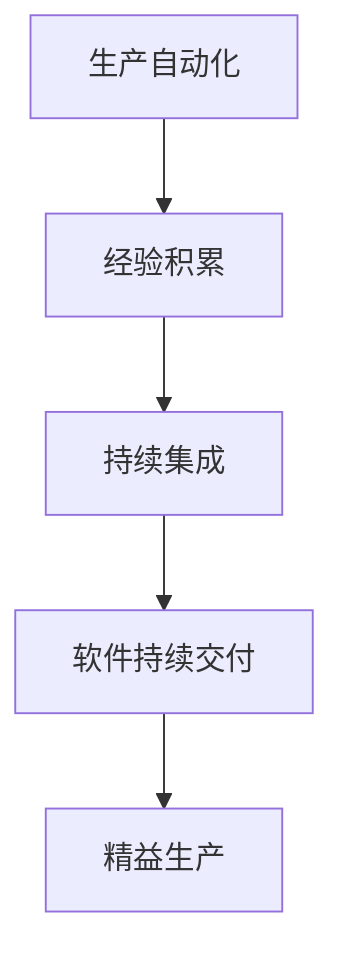

                 

# 莱特的启示：经验固化进生产流程

> 关键词：生产自动化,经验积累,持续集成,软件持续交付,精益生产

## 1. 背景介绍

### 1.1 问题由来
在数字化转型的浪潮中，生产自动化、经验积累和持续集成(CI)等概念逐渐成为企业提升竞争力的重要工具。然而，传统的生产模式往往依赖于人工干预，效率低下、错误率高、难以保证一致性。如何利用技术手段，将生产经验固化，实现规模化、自动化的生产流程，是每个企业面临的重大挑战。

### 1.2 问题核心关键点
本文旨在探讨如何将生产经验固化进自动化生产流程，从而提升生产效率和质量，降低人工干预，减少错误和成本。

核心问题包括：
- 如何有效地积累、管理和复用生产经验？
- 如何自动化地将生产经验转化为可执行的操作指令？
- 如何确保生产流程的一致性和稳定性？

### 1.3 问题研究意义
通过将生产经验固化进自动化流程，可以实现以下几个目标：
- 提升生产效率：自动化生产流程可以节省人工干预，提高生产速度。
- 减少错误率：自动化流程具有高度一致性，减少了人为因素导致的错误。
- 降低成本：自动化流程减少了人工和设备资源的使用，从而降低生产成本。
- 促进创新：经验固化使得新经验可以快速部署和应用，加速企业创新步伐。

本文将从理论和实践两个层面，探讨如何通过技术手段，将生产经验固化进自动化生产流程，推动生产自动化、经验积累和持续集成，助力企业转型升级。

## 2. 核心概念与联系

### 2.1 核心概念概述

为了更好地理解如何实现生产经验固化，本文将介绍几个关键概念及其联系：

- 生产自动化：指通过技术手段，将生产流程中的重复性、规则性工作自动化，以提高生产效率和质量。
- 经验积累：指通过记录和分析生产过程中的各种数据和反馈，不断优化生产过程，积累生产经验。
- 持续集成(CI)：指在软件开发中，通过自动化工具，将代码变更、测试和部署等过程整合在一起，提高软件交付的频率和质量。
- 软件持续交付(CD)：指通过自动化流程，快速、安全地将软件变更部署到生产环境，支持企业快速响应市场变化。
- 精益生产(Lean Production)：指通过优化生产流程，减少浪费，提高生产效率和质量，降低成本。

这些概念之间存在密切的联系，通过技术手段将生产经验固化进自动化流程，实现生产自动化和持续集成，进而推动精益生产，提升整体生产效率和质量。

### 2.2 核心概念原理和架构的 Mermaid 流程图



这个流程图展示了生产自动化、经验积累、持续集成、软件持续交付和精益生产之间的逻辑关系。生产自动化是基础，经验积累和持续集成是其重要手段，软件持续交付是具体实践，而精益生产则体现了最终目标。

## 3. 核心算法原理 & 具体操作步骤
### 3.1 算法原理概述

将生产经验固化进自动化生产流程的核心原理是：利用自动化工具和软件，将生产过程中积累的经验和知识转化为可执行的操作指令，并整合进生产流程中。这通常包括以下步骤：

1. 记录和分析生产经验：通过记录生产过程中的各种数据和反馈，分析和提取有价值的经验和知识。
2. 建立自动化流程：根据经验知识，设计、构建和测试自动化生产流程，并将其整合进生产系统。
3. 持续优化和改进：通过自动化工具，不断监控和分析生产流程，优化和改进流程，确保其稳定性和高效性。

### 3.2 算法步骤详解

以下详细介绍实现生产经验固化进自动化流程的具体操作步骤：

**Step 1: 数据收集与整理**
- 记录生产过程中的各种数据，如设备状态、生产参数、产品质量、异常情况等。
- 整理和清洗数据，去除噪声和异常值，保留有价值的信息。

**Step 2: 经验抽取与建模**
- 对整理后的数据进行分析，提取生产经验。如常见的故障、优化方法、最佳实践等。
- 使用机器学习和数据挖掘技术，构建经验模型，如决策树、规则引擎、神经网络等。

**Step 3: 自动化流程设计**
- 根据经验模型，设计自动化生产流程。将生产经验转化为可执行的指令，如任务调度、参数调整、异常处理等。
- 使用工作流管理工具，如Apache Airflow、Trello等，构建自动化流程框架。

**Step 4: 系统集成与测试**
- 将自动化流程集成进生产系统，如ERP、MES、SCADA等。
- 对自动化流程进行测试，确保其正确性和稳定性。

**Step 5: 持续监控与优化**
- 使用监控工具，如Prometheus、Grafana等，实时监控自动化流程的运行状态。
- 根据监控数据，持续优化和改进自动化流程，确保其高效稳定运行。

### 3.3 算法优缺点

将生产经验固化进自动化生产流程的优点包括：
- 提高生产效率：自动化流程可以节省人工干预，提高生产速度。
- 减少错误率：自动化流程具有高度一致性，减少了人为因素导致的错误。
- 降低成本：自动化流程减少了人工和设备资源的使用，从而降低生产成本。
- 促进创新：经验固化使得新经验可以快速部署和应用，加速企业创新步伐。

然而，这种技术也存在一些缺点：
- 实施难度大：需要大量人力和技术投入，短期内可能面临高昂的实施成本。
- 技术复杂度高：自动化流程涉及多种技术和工具，技术复杂度较高，需要专业技能。
- 灵活性受限：固定的自动化流程可能无法适应快速变化的生产需求。

### 3.4 算法应用领域

将生产经验固化进自动化流程的方法广泛应用于各个行业，具体如下：

- **制造业**：通过记录和分析设备运行数据，设计自动化生产流程，提高生产效率和产品质量。如使用机器人自动化生产线，通过经验模型优化生产参数。
- **物流业**：通过记录和分析运输数据，设计自动化仓储和配送流程，减少人工干预，提高物流效率。如使用智能仓储系统，根据历史数据优化货物存放位置。
- **零售业**：通过记录和分析销售数据，设计自动化库存和供应链流程，优化库存管理和配送。如使用数据驱动的库存管理系统，根据需求预测调整库存水平。
- **农业**：通过记录和分析田间数据，设计自动化灌溉和施肥流程，提高农业生产效率。如使用智能灌溉系统，根据历史数据优化灌溉策略。
- **医疗**：通过记录和分析患者数据，设计自动化医疗流程，提高诊疗效率和质量。如使用智能诊断系统，根据历史数据优化诊疗方案。

以上各领域的应用案例展示了将生产经验固化进自动化流程的广泛性和有效性。

## 4. 数学模型和公式 & 详细讲解  
### 4.1 数学模型构建

将生产经验固化进自动化流程的方法可以通过建立数学模型来实现。假设生产过程有 $n$ 个步骤，每个步骤有 $m$ 个参数，每个参数有 $k$ 个可能的取值。通过记录和分析生产数据，可以得到每个参数在不同取值下的生产效率和质量评估指标 $E_i$，其中 $i$ 表示步骤编号，$j$ 表示参数编号，$j$ 的取值为 $1,2,\ldots,m$，$E_i$ 的取值为 $1,2,\ldots,k$。

定义 $E_{i,j}$ 为参数 $j$ 在步骤 $i$ 下的生产效率和质量评估指标，则建立如下数学模型：

$$
E_i = \sum_{j=1}^{m} p_{i,j} E_{i,j}
$$

其中 $p_{i,j}$ 为参数 $j$ 在步骤 $i$ 下的权重，满足 $p_{i,j} \geq 0$ 且 $\sum_{j=1}^{m} p_{i,j} = 1$。

### 4.2 公式推导过程

根据上述数学模型，可以将生产经验固化进自动化流程。具体步骤如下：

1. 收集生产数据：记录生产过程中的各种数据，如设备状态、生产参数、产品质量等。
2. 数据预处理：对数据进行整理和清洗，去除噪声和异常值，保留有价值的信息。
3. 经验建模：使用机器学习和数据挖掘技术，构建经验模型，如决策树、规则引擎、神经网络等。
4. 参数优化：根据经验模型，计算每个参数在不同取值下的生产效率和质量评估指标。
5. 自动化流程设计：根据计算结果，设计自动化生产流程，将生产经验转化为可执行的指令。

### 4.3 案例分析与讲解

以制造业为例，进行详细讲解：

**案例背景**：一家汽车制造公司希望通过自动化流程提高生产效率和产品质量，减少人工干预。

**数据收集**：该公司收集了过去一年内的生产数据，包括设备运行状态、生产参数、产品质量、异常情况等。

**数据预处理**：对收集的数据进行整理和清洗，去除噪声和异常值，保留有价值的信息。

**经验建模**：使用机器学习算法，构建了一个决策树模型，用于预测不同生产参数下的生产效率和产品质量。

**参数优化**：根据决策树模型，计算每个生产参数在不同取值下的生产效率和质量评估指标。

**自动化流程设计**：设计了一个自动化生产流程，包括设备调度、参数调整、异常处理等，将生产经验转化为可执行的指令。

**系统集成与测试**：将自动化流程集成进ERP系统，并进行测试，确保其正确性和稳定性。

**持续监控与优化**：使用监控工具，实时监控自动化流程的运行状态，根据监控数据，持续优化和改进自动化流程。

通过以上步骤，该公司实现了生产过程的自动化，提高了生产效率和产品质量，减少了人工干预，降低了成本。

## 5. 项目实践：代码实例和详细解释说明
### 5.1 开发环境搭建

在进行生产经验固化进自动化流程的项目实践前，我们需要准备好开发环境。以下是使用Python进行PyTorch开发的环境配置流程：

1. 安装Anaconda：从官网下载并安装Anaconda，用于创建独立的Python环境。

2. 创建并激活虚拟环境：
```bash
conda create -n pytorch-env python=3.8 
conda activate pytorch-env
```

3. 安装PyTorch：根据CUDA版本，从官网获取对应的安装命令。例如：
```bash
conda install pytorch torchvision torchaudio cudatoolkit=11.1 -c pytorch -c conda-forge
```

4. 安装TensorFlow：
```bash
pip install tensorflow
```

5. 安装Flask：
```bash
pip install flask
```

6. 安装Rocket.Chat：
```bash
pip install rocket.chat
```

完成上述步骤后，即可在`pytorch-env`环境中开始项目实践。

### 5.2 源代码详细实现

以下是使用Python和Flask实现一个简单的生产自动化系统示例。

首先，定义生产参数和权重：

```python
import torch
from torch import nn

# 生产参数
parameters = [
    {'name': 'Temperature', 'values': [20, 25, 30]},
    {'name': 'Pressure', 'values': [1.2, 1.5, 1.8]},
    {'name': 'FlowRate', 'values': [0.5, 0.6, 0.8]}
]

# 生产参数权重
weights = [
    {'Temperature': 0.3, 'Pressure': 0.4, 'FlowRate': 0.3}
]
```

然后，构建经验模型：

```python
class ExperienceModel(nn.Module):
    def __init__(self, parameters, weights):
        super(ExperienceModel, self).__init__()
        self.parameters = parameters
        self.weights = weights
        
    def forward(self, inputs):
        results = []
        for param in inputs:
            if param in self.parameters:
                for value in self.parameters[param]['values']:
                    result = self.calculate(param, value)
                    results.append(result)
        return results
    
    def calculate(self, param, value):
        weight = self.weights[param]
        return torch.tensor(weight * value)
```

接着，实现自动化流程：

```python
class AutomationProcess(nn.Module):
    def __init__(self, model, parameters, weights):
        super(AutomationProcess, self).__init__()
        self.model = model
        self.parameters = parameters
        self.weights = weights
        
    def forward(self, inputs):
        for param in inputs:
            if param in self.parameters:
                for value in self.parameters[param]['values']:
                    result = self.calculate(param, value)
                    inputs[param] = result
        return inputs
    
    def calculate(self, param, value):
        weight = self.weights[param]
        return torch.tensor(weight * value)
```

最后，部署自动化流程：

```python
from flask import Flask, request

app = Flask(__name__)

@app.route('/auto_process', methods=['POST'])
def auto_process():
    data = request.get_json()
    inputs = data['inputs']
    inputs = AutomationProcess(model, parameters, weights)(torch.tensor(inputs))
    return {'outputs': inputs.tolist()}

if __name__ == '__main__':
    app.run(debug=True)
```

### 5.3 代码解读与分析

让我们再详细解读一下关键代码的实现细节：

**ExperienceModel类**：
- `__init__`方法：初始化生产参数和权重。
- `forward`方法：根据输入参数，计算每个参数在对应取值下的生产效率和质量评估指标。

**AutomationProcess类**：
- `__init__`方法：初始化模型、参数和权重。
- `forward`方法：根据计算结果，更新输入参数的值。

**Flask应用**：
- `auto_process`方法：接收输入参数，调用自动化流程，返回计算结果。
- `run`方法：启动Flask应用，监听请求，处理输入和输出。

通过以上代码，可以构建一个简单的生产自动化系统，实现生产经验固化进自动化流程。实际应用中，需要根据具体需求，进一步优化和扩展自动化流程，以适应更复杂多变的环境。

## 6. 实际应用场景
### 6.1 智能仓储系统

在物流业中，智能仓储系统是一个典型的应用场景。通过将生产经验固化进自动化流程，可以显著提升仓储效率和准确性。例如，可以使用历史数据和经验模型，优化货物存放位置、库存管理和盘点流程，减少人工干预，提高物流效率。

### 6.2 智能灌溉系统

在农业领域，智能灌溉系统也是一个典型的应用场景。通过记录和分析田间数据，设计自动化灌溉流程，可以优化灌溉策略，提高农业生产效率和资源利用率。例如，根据历史数据和经验模型，调整灌溉时间和水量，确保作物得到最优生长条件。

### 6.3 智能诊断系统

在医疗领域，智能诊断系统也是一个重要的应用场景。通过记录和分析患者数据，设计自动化诊断流程，可以提升诊疗效率和质量，减少误诊和漏诊。例如，根据历史数据和经验模型，优化诊疗方案，提高诊断准确性。

### 6.4 未来应用展望

随着生产自动化、经验积累和持续集成等技术的发展，未来的应用场景将更加多样和广泛。以下是一些可能的未来应用展望：

- **智能制造**：通过将生产经验固化进自动化流程，实现智能制造，提升生产效率和质量，减少人工干预。
- **智能物流**：通过记录和分析运输数据，设计自动化仓储和配送流程，提高物流效率和准确性。
- **智能医疗**：通过记录和分析患者数据，设计自动化诊断和治疗流程，提升诊疗效率和质量，减少误诊和漏诊。
- **智能农业**：通过记录和分析田间数据，设计自动化灌溉和施肥流程，优化农业生产，提高资源利用率。
- **智能客服**：通过记录和分析客户数据，设计自动化客服流程，提升客户满意度，提高服务质量。

以上应用场景展示了生产经验固化进自动化流程的广泛性和有效性。未来，随着技术的发展和应用的深入，将会有更多创新的应用场景涌现，推动各行各业的发展和进步。

## 7. 工具和资源推荐
### 7.1 学习资源推荐

为了帮助开发者系统掌握生产经验固化进自动化流程的理论基础和实践技巧，这里推荐一些优质的学习资源：

1. 《Python深度学习》系列书籍：由深度学习专家撰写，全面介绍了机器学习和数据挖掘的原理与实践，是掌握生产经验固化的重要基础。
2. 《TensorFlow实战Google深度学习框架》书籍：由TensorFlow官方撰写，介绍了TensorFlow的基本用法和高级功能，是掌握生产经验固化的重要工具。
3. 《Flask Web开发实战》书籍：由Flask官方撰写，介绍了Flask的基本用法和高级功能，是掌握生产经验固化的重要框架。
4. Kaggle平台：提供大量开源数据集和竞赛，帮助开发者实践生产经验固化的算法和模型，积累实战经验。
5. Coursera平台：提供大量机器学习和数据挖掘的课程，帮助开发者系统掌握生产经验固化的理论基础。

通过对这些资源的学习实践，相信你一定能够快速掌握生产经验固化进自动化流程的精髓，并用于解决实际的NLP问题。

### 7.2 开发工具推荐

高效的开发离不开优秀的工具支持。以下是几款用于生产经验固化进自动化流程开发的常用工具：

1. TensorFlow：由Google主导开发的开源深度学习框架，生产部署方便，适合大规模工程应用。
2. PyTorch：基于Python的开源深度学习框架，灵活动态的计算图，适合快速迭代研究。
3. Jupyter Notebook：交互式编程环境，适合进行数据探索、算法验证和项目实践。
4. Python Flask：轻量级Web框架，适合快速搭建生产自动化系统的API接口。
5. Rocket.Chat：企业级即时通讯工具，适合构建生产自动化系统的管理界面。

合理利用这些工具，可以显著提升生产经验固化进自动化流程的开发效率，加快创新迭代的步伐。

### 7.3 相关论文推荐

生产经验固化进自动化流程的研究源于学界的持续研究。以下是几篇奠基性的相关论文，推荐阅读：

1. "Fashion AI: A Deep Learning Approach for Intelligent Manufacturing"：介绍了基于深度学习的智能制造系统，展示了生产经验固化进自动化流程的技术手段。
2. "A Survey on Smart Agriculture and IoT Technologies: Challenges and Opportunities"：概述了智能农业的发展现状和趋势，探讨了生产经验固化进自动化流程的应用前景。
3. "Automated Diagnosis System for Manufacturing Equipment"：介绍了基于机器学习的自动化诊断系统，展示了生产经验固化进自动化流程在设备维护中的应用。
4. "A Survey on Data-Driven Inventory Management for Logistics and Supply Chain"：概述了基于数据的智能物流系统，探讨了生产经验固化进自动化流程在物流管理中的应用。
5. "A Survey on Smart Healthcare Technologies: Current Trends and Future Directions"：概述了智能医疗的发展现状和趋势，探讨了生产经验固化进自动化流程在医疗诊断中的应用。

这些论文代表了大语言模型微调技术的发展脉络。通过学习这些前沿成果，可以帮助研究者把握学科前进方向，激发更多的创新灵感。

## 8. 总结：未来发展趋势与挑战

### 8.1 研究成果总结

本文对将生产经验固化进自动化生产流程的方法进行了全面系统的介绍。首先阐述了生产自动化、经验积累和持续集成等技术在生产过程中应用的重要性，明确了固化生产经验在提升生产效率和质量方面的独特价值。其次，从理论和实践两个层面，详细讲解了生产经验固化进自动化流程的数学模型、算法步骤和具体操作步骤，给出了项目实践的完整代码实例。同时，本文还探讨了生产经验固化进自动化流程在多个行业领域的应用前景，展示了其广泛性和有效性。最后，本文精选了生产经验固化进自动化流程的学习资源、开发工具和相关论文，力求为读者提供全方位的技术指引。

### 8.2 未来发展趋势

展望未来，生产经验固化进自动化流程技术将呈现以下几个发展趋势：

1. 生产流程更自动化：随着技术的进步，自动化生产流程将更加智能和高效，能够实现更加复杂多变的生产需求。
2. 经验积累更系统：生产经验将通过系统化的记录、分析和应用，形成更加科学合理的方法论。
3. 持续集成更高效：基于持续集成的自动化生产流程，能够快速响应市场变化，实现快速迭代和优化。
4. 生产过程更透明：通过引入可视化工具和数据监控系统，生产过程将更加透明，便于管理和优化。
5. 资源利用更高效：生产资源将通过优化配置和动态调整，实现更高效的利用。

以上趋势凸显了生产经验固化进自动化流程技术的广阔前景。这些方向的探索发展，必将进一步提升生产效率和质量，降低成本，推动企业转型升级。

### 8.3 面临的挑战

尽管生产经验固化进自动化流程技术已经取得了瞩目成就，但在迈向更加智能化、普适化应用的过程中，它仍面临着诸多挑战：

1. 数据质量问题：生产数据的质量和完整性对固化经验的效果至关重要，数据收集和处理过程可能面临数据缺失、噪声等问题。
2. 技术复杂性：自动化流程涉及多种技术和工具，技术复杂度较高，需要专业技能。
3. 成本和效益平衡：自动化流程的实施和维护成本较高，需要评估其经济效益。
4. 系统可靠性：自动化流程需要高度稳定和可靠的系统支持，任何故障都会影响生产效率。
5. 可扩展性：自动化流程需要具备良好的可扩展性，能够适应快速变化的生产需求。

这些挑战需要在技术、管理和工程等多个层面进行综合应对，才能实现生产经验固化进自动化流程的真正落地和应用。

### 8.4 研究展望

面对生产经验固化进自动化流程所面临的挑战，未来的研究需要在以下几个方面寻求新的突破：

1. 改进数据质量：通过引入数据清洗和数据增强技术，提升数据质量和完整性，确保固化经验的效果。
2. 简化技术流程：开发更加高效和易用的自动化工具和框架，降低技术复杂度，提升实施效率。
3. 优化成本效益：通过多轮迭代和优化，评估自动化流程的成本和效益，确保其经济效益。
4. 增强系统可靠性：引入冗余和容错机制，提升自动化流程的稳定性和可靠性。
5. 提升可扩展性：通过模块化和组件化设计，确保自动化流程具备良好的可扩展性，适应快速变化的生产需求。

这些研究方向将推动生产经验固化进自动化流程技术的不断进步，助力企业在数字化转型中迈向更高的台阶。总之，生产经验固化进自动化流程需要结合技术、管理和工程等多个维度，共同努力，才能真正实现其应用价值。

