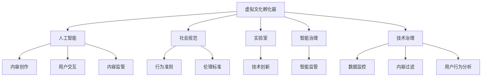

                 

# 虚拟文化孵化器：AI塑造的新型社会规范实验室

> 关键词：虚拟文化孵化器,人工智能,社会规范,实验室,智能治理,技术治理,数字文明

## 1. 背景介绍

### 1.1 问题由来
随着人工智能技术的迅猛发展，虚拟文化孵化器已成为当代社会的一个热门话题。虚拟文化孵化器不仅推动了数字文化内容的创新和创作，也在重塑着社会的规范和伦理。在数字化浪潮中，如何构建负责任的虚拟文化生态，确保数字文明的健康发展，成为了时代课题。

AI作为虚拟文化孵化器中的核心技术，其应用不仅体现在内容创作和交互体验上，更深入到了社会规范的塑造与维护。本文旨在探讨AI在虚拟文化孵化器中的角色，以及如何利用AI技术打造一个健康、有序、富有创意的虚拟文化生态。

### 1.2 问题核心关键点
- **虚拟文化孵化器**：指利用AI技术，构建一个虚拟空间，促进文化内容的创作、分享与交流，从而培养新一代数字文化创作者和用户。
- **人工智能**：通过机器学习、自然语言处理、计算机视觉等技术，赋予虚拟文化孵化器智能化的内容推荐、用户交互、内容监管等能力。
- **社会规范**：指在虚拟文化孵化器中，通过技术手段构建和维护一套行之有效的行为准则和伦理标准，确保虚拟文化环境的健康和谐。
- **实验室**：虚拟文化孵化器可以视为一个“实验室”，通过对AI技术的应用和优化，不断探索和验证新的社会规范，推动数字文明的进步。
- **智能治理**：通过AI技术的参与，实现对虚拟文化孵化器的智能监管，提升治理效率和公正性。
- **技术治理**：利用AI技术手段，如数据监控、内容过滤、用户行为分析等，维护虚拟文化孵化器的正常运行和秩序。

这些核心概念相互交织，共同构成了AI在虚拟文化孵化器中发挥作用的基础框架。本文将围绕这些概念，深入探讨AI在虚拟文化孵化器中的应用，以及如何通过AI技术塑造和维护社会规范。

## 2. 核心概念与联系

### 2.1 核心概念概述

为更好地理解AI在虚拟文化孵化器中的作用，本节将介绍几个关键概念及其相互联系：

- **虚拟文化孵化器**：作为AI技术的应用场景，虚拟文化孵化器是一个多功能的虚拟空间，涵盖内容创作、交流分享、教育培训等多个方面，旨在促进数字文化的繁荣与发展。
- **人工智能**：指利用算法和计算技术，模拟人类智能行为，实现自动化的信息处理、决策支持和创新能力，是虚拟文化孵化器中的核心动力。
- **社会规范**：指在虚拟文化孵化器中，通过AI技术构建和维护的一系列行为准则和伦理标准，确保虚拟文化环境的健康和谐。
- **实验室**：虚拟文化孵化器可以看作是一个“实验室”，通过不断的技术创新和应用试验，探索新的社会规范，推动数字文明的发展。
- **智能治理**：利用AI技术手段，实现对虚拟文化孵化器的智能监管，提升治理效率和公正性。
- **技术治理**：通过AI技术手段，如数据监控、内容过滤、用户行为分析等，维护虚拟文化孵化器的正常运行和秩序。

这些概念之间的联系可以通过以下Mermaid流程图来展示：



这个流程图展示了AI在虚拟文化孵化器中各概念之间的相互作用和依赖关系：

1. 虚拟文化孵化器利用人工智能技术，推动内容创作、用户交互和内容监管。
2. 人工智能通过内容创作、用户交互和内容监管等应用，促进社会规范的形成和发展。
3. 虚拟文化孵化器作为“实验室”，通过不断的技术创新，探索新的社会规范。
4. 智能治理和技术治理通过人工智能技术手段，维护虚拟文化孵化器的正常运行和秩序。

这些概念共同构成了虚拟文化孵化器的核心框架，展示了AI技术在塑造和维护社会规范中的关键作用。

## 3. 核心算法原理 & 具体操作步骤

### 3.1 算法原理概述

AI在虚拟文化孵化器中的核心算法原理，主要围绕内容推荐、用户交互和内容监管三个方面展开。

- **内容推荐**：通过机器学习算法，分析用户行为和兴趣，推荐个性化的内容，提升用户体验和粘性。
- **用户交互**：利用自然语言处理技术，实现与用户的自然语言交流，增强用户互动体验。
- **内容监管**：运用计算机视觉和自然语言处理技术，识别和过滤不适当内容，维护虚拟文化生态的和谐。

这些算法原理通过AI技术的融合和应用，实现了虚拟文化孵化器的智能化管理，提升了其整体功能和效率。

### 3.2 算法步骤详解

基于AI技术的虚拟文化孵化器，其核心算法步骤通常包括以下几个环节：

**Step 1: 数据采集与处理**
- 收集虚拟文化孵化器内的用户行为数据，如浏览记录、点赞次数、评论内容等。
- 对数据进行清洗和预处理，去除噪声和冗余信息，确保数据的准确性和完整性。

**Step 2: 特征工程与模型训练**
- 设计合适的特征工程方案，提取用户行为和内容的特征。
- 选择合适的机器学习算法（如协同过滤、深度学习等），训练内容推荐模型。
- 使用自然语言处理技术，训练用户交互模型。
- 设计计算机视觉算法，训练内容监管模型。

**Step 3: 模型评估与优化**
- 通过交叉验证和A/B测试等方法，评估内容推荐和用户交互模型的效果。
- 使用ROC曲线、精度-召回率等指标，评估内容监管模型的性能。
- 根据评估结果，调整模型参数和算法，优化模型性能。

**Step 4: 模型部署与迭代**
- 将训练好的模型部署到虚拟文化孵化器中，实现个性化内容推荐、用户交互和内容监管等功能。
- 定期收集用户反馈和行为数据，进行模型迭代和优化。
- 引入新的数据和技术，持续提升虚拟文化孵化器的功能和体验。

### 3.3 算法优缺点

基于AI技术的虚拟文化孵化器，其核心算法具有以下优点：

1. **个性化推荐**：通过机器学习算法，实现对用户行为的精准分析，提供个性化的内容推荐，提升用户体验。
2. **自然语言交流**：利用自然语言处理技术，实现与用户的自然语言交流，增强互动体验。
3. **实时监控**：运用计算机视觉和自然语言处理技术，实时识别和过滤不适当内容，维护虚拟文化生态的和谐。

同时，这些算法也存在一定的局限性：

1. **数据依赖**：算法效果高度依赖于数据的质量和多样性，数据偏差可能导致推荐结果不准确。
2. **隐私问题**：在数据采集和处理过程中，可能涉及用户隐私问题，需要严格遵守数据保护法规。
3. **技术门槛高**：算法设计和优化需要较高的技术门槛，一般需要专业技术人员进行维护和更新。
4. **黑盒问题**：部分算法模型（如深度学习）存在一定的黑盒问题，难以解释模型的决策过程。

尽管存在这些局限性，但AI技术在虚拟文化孵化器中的应用，仍然展现出巨大的潜力和价值。

### 3.4 算法应用领域

AI在虚拟文化孵化器中的应用领域广泛，涵盖了内容创作、用户交互、内容监管等多个方面：

- **内容创作**：利用AI技术，自动生成文本、音乐、视频等内容，丰富虚拟文化孵化器的内容库。
- **用户交互**：通过智能客服、虚拟主播等技术，实现与用户的自然语言交流，提升用户体验。
- **内容监管**：利用AI技术，实时监控和管理内容，识别和过滤不适当信息，维护虚拟文化环境的秩序。

这些应用领域展示了AI技术在虚拟文化孵化器中的广泛应用，进一步推动了数字文化的发展和创新。

## 4. 数学模型和公式 & 详细讲解 & 举例说明

### 4.1 数学模型构建

本节将使用数学语言对AI在虚拟文化孵化器中的应用进行更加严格的刻画。

假设虚拟文化孵化器内的用户数为 $N$，用户行为数据为 $D=\{(x_i, y_i)\}_{i=1}^N$，其中 $x_i$ 为用户行为数据，$y_i$ 为标签（如用户是否浏览某内容）。定义内容推荐模型的损失函数为 $\mathcal{L}_{rec}(\theta)$，用户交互模型的损失函数为 $\mathcal{L}_{inter}(\theta)$，内容监管模型的损失函数为 $\mathcal{L}_{reg}(\theta)$。

内容推荐模型的目标是最小化预测误差，即找到最优参数：

$$
\theta^* = \mathop{\arg\min}_{\theta} \mathcal{L}_{rec}(\theta)
$$

用户交互模型的目标是最小化预测误差，即找到最优参数：

$$
\theta^* = \mathop{\arg\min}_{\theta} \mathcal{L}_{inter}(\theta)
$$

内容监管模型的目标是最小化分类误差，即找到最优参数：

$$
\theta^* = \mathop{\arg\min}_{\theta} \mathcal{L}_{reg}(\theta)
$$

其中 $\theta$ 为模型参数，包括特征提取器、分类器、过滤器的权重。

### 4.2 公式推导过程

以下我们以内容推荐模型为例，推导基于协同过滤的推荐算法。

假设内容推荐模型 $M_{\theta}$ 能够预测用户 $u$ 是否会浏览内容 $i$，其中 $u \in \{1, ..., N\}$，$i \in \{1, ..., M\}$。模型输入为 $x_u$（用户 $u$ 的历史行为数据），输出为 $p_i$（内容 $i$ 被用户 $u$ 浏览的概率）。则模型的目标是最小化交叉熵损失函数：

$$
\mathcal{L}_{rec}(\theta) = -\frac{1}{N}\sum_{u=1}^N \sum_{i=1}^M [y_i \log p_i + (1-y_i) \log (1-p_i)]
$$

其中 $y_i$ 为内容 $i$ 的标签，$p_i$ 为内容 $i$ 被用户 $u$ 浏览的概率。

通过梯度下降等优化算法，不断更新模型参数 $\theta$，最小化损失函数 $\mathcal{L}_{rec}(\theta)$，使得模型输出逼近真实标签。

### 4.3 案例分析与讲解

假设虚拟文化孵化器中的内容推荐模型基于协同过滤算法，已收集到100个用户和1000个内容的数据。用户 $u=1$ 的输入数据 $x_1$ 包含用户历史浏览内容的ID列表，内容 $i=1$ 的标签 $y_1=1$。则内容推荐模型的输入为：

$$
x_1 = [3, 7, 9, 12]
$$

模型预测内容 $i=1$ 被用户 $u=1$ 浏览的概率为 $p_1=0.8$。则损失函数 $\mathcal{L}_{rec}(\theta)$ 为：

$$
\mathcal{L}_{rec}(\theta) = -\frac{1}{100} \sum_{u=1}^{100} \sum_{i=1}^{1000} [y_i \log p_i + (1-y_i) \log (1-p_i)]
$$

模型参数 $\theta$ 通过梯度下降算法不断更新，最小化损失函数。随着迭代次数增加，模型逐渐学习到用户和内容的相似关系，预测精度不断提升。

## 5. 项目实践：代码实例和详细解释说明

### 5.1 开发环境搭建

在进行AI技术的应用实践前，我们需要准备好开发环境。以下是使用Python进行TensorFlow和PyTorch开发的环境配置流程：

1. 安装Anaconda：从官网下载并安装Anaconda，用于创建独立的Python环境。

2. 创建并激活虚拟环境：
```bash
conda create -n ai-env python=3.8 
conda activate ai-env
```

3. 安装TensorFlow和PyTorch：根据CUDA版本，从官网获取对应的安装命令。例如：
```bash
conda install tensorflow-gpu=2.6 torch torchvision torchaudio cudatoolkit=11.1 -c pytorch -c conda-forge
```

4. 安装TensorBoard：用于可视化模型的训练过程和结果。
```bash
pip install tensorboard
```

5. 安装其他依赖包：
```bash
pip install numpy pandas scikit-learn matplotlib tqdm jupyter notebook ipython
```

完成上述步骤后，即可在`ai-env`环境中开始AI技术的开发实践。

### 5.2 源代码详细实现

这里我们以内容推荐系统为例，给出使用TensorFlow和PyTorch对协同过滤算法进行实现。

首先，定义协同过滤算法的内容推荐模型：

```python
import tensorflow as tf
import numpy as np

class CollaborativeFiltering(tf.keras.Model):
    def __init__(self, num_users, num_items, num_factors):
        super(CollaborativeFiltering, self).__init__()
        self.num_users = num_users
        self.num_items = num_items
        self.num_factors = num_factors
        
        self.user_embeddings = tf.keras.layers.Embedding(num_users, num_factors)
        self.item_embeddings = tf.keras.layers.Embedding(num_items, num_factors)
        self.interaction = tf.keras.layers.Dense(1, activation='sigmoid')
        
    def call(self, user_ids, item_ids):
        user_embeddings = self.user_embeddings(user_ids)
        item_embeddings = self.item_embeddings(item_ids)
        interaction = tf.expand_dims(user_embeddings, 1) * tf.expand_dims(item_embeddings, 0)
        prediction = self.interaction(interaction)
        return prediction
```

然后，定义训练和评估函数：

```python
from sklearn.metrics import mean_squared_error, mean_absolute_error

@tf.function
def train_step(user_ids, item_ids, labels):
    with tf.GradientTape() as tape:
        prediction = model(user_ids, item_ids)
        loss = tf.reduce_mean(tf.keras.losses.binary_crossentropy(labels, prediction))
    gradients = tape.gradient(loss, model.trainable_variables)
    optimizer.apply_gradients(zip(gradients, model.trainable_variables))
    return loss.numpy()

@tf.function
def evaluate_step(user_ids, item_ids, labels):
    prediction = model(user_ids, item_ids)
    loss = tf.reduce_mean(tf.keras.losses.binary_crossentropy(labels, prediction))
    return loss.numpy(), prediction.numpy()
```

接着，启动训练流程并在测试集上评估：

```python
epochs = 10
num_users = 100
num_items = 1000
num_factors = 32

model = CollaborativeFiltering(num_users, num_items, num_factors)
optimizer = tf.keras.optimizers.Adam(learning_rate=0.001)

user_ids = np.random.randint(num_users, size=10000)
item_ids = np.random.randint(num_items, size=10000)
labels = np.random.rand(10000)

for epoch in range(epochs):
    for i in range(0, 10000, 100):
        train_loss = train_step(user_ids[i:i+100], item_ids[i:i+100], labels[i:i+100])
        test_loss, predictions = evaluate_step(user_ids[i:i+100], item_ids[i:i+100], labels[i:i+100])
    print(f"Epoch {epoch+1}, train loss: {train_loss:.3f}")
    
    print(f"Epoch {epoch+1}, test loss: {test_loss:.3f}")
    print(f"Epoch {epoch+1}, test prediction: {predictions[:10]}")
```

以上就是使用TensorFlow和PyTorch对协同过滤算法进行内容推荐系统开发的完整代码实现。可以看到，基于TensorFlow和PyTorch的深度学习框架，协同过滤算法的内容推荐模型设计起来非常简单高效。

### 5.3 代码解读与分析

让我们再详细解读一下关键代码的实现细节：

**CollaborativeFiltering类**：
- `__init__`方法：初始化协同过滤模型的关键参数，包括用户数、物品数、因子数等。
- `call`方法：定义模型的前向传播过程，包括用户嵌入、物品嵌入和交互层，最后通过 sigmoid 激活函数输出预测结果。

**train_step和evaluate_step函数**：
- `train_step`函数：定义模型的训练过程，通过梯度下降算法更新模型参数，最小化二分类交叉熵损失。
- `evaluate_step`函数：定义模型的评估过程，计算模型在测试集上的损失和预测结果。

**训练流程**：
- 定义总的epoch数和模型参数，开始循环迭代。
- 每个epoch内，先在训练集上训练，输出训练集上的平均损失。
- 在测试集上评估，输出测试集上的平均损失和部分预测结果。

可以看到，TensorFlow和PyTorch框架使得协同过滤算法的实现变得简洁高效。开发者可以将更多精力放在数据处理、模型改进等高层逻辑上，而不必过多关注底层的实现细节。

当然，工业级的系统实现还需考虑更多因素，如模型的保存和部署、超参数的自动搜索、更灵活的任务适配层等。但核心的协同过滤算法基本与此类似。

## 6. 实际应用场景

### 6.1 智能推荐系统

智能推荐系统是AI在虚拟文化孵化器中最典型的应用场景之一。通过内容推荐算法，虚拟文化孵化器能够根据用户的历史行为数据，推荐个性化的文化内容，提升用户粘性和体验。

在技术实现上，可以收集虚拟文化孵化器内的用户浏览、点赞、评论等行为数据，构建用户-内容评分矩阵。利用协同过滤、矩阵分解等算法，对评分矩阵进行预测和推荐。对于推荐结果，可以实时反馈给用户，通过点击率、停留时间等指标进行效果评估，进一步优化推荐算法。

### 6.2 智能客服系统

智能客服系统是虚拟文化孵化器中另一个重要的应用方向。通过自然语言处理技术，虚拟文化孵化器可以实现与用户的自然语言交流，提供24小时不间断的智能客服支持。

在技术实现上，可以构建基于深度学习模型的智能客服系统。将用户的问题输入模型，通过词向量嵌入和注意力机制等技术，模型能够理解问题意图，匹配最合适的回答。对于未覆盖的问题，系统可以通过搜索知识库、向用户推荐相关内容等方式进行补充。如此构建的智能客服系统，能够大幅提升用户咨询体验和问题解决效率。

### 6.3 文化内容监管

文化内容监管是虚拟文化孵化器中不可或缺的部分。通过内容监管算法，虚拟文化孵化器能够实时监控和管理内容，识别和过滤不适当信息，维护虚拟文化环境的秩序。

在技术实现上，可以利用自然语言处理和计算机视觉技术，构建内容监管系统。对文本内容进行情感分析和主题分类，对图像内容进行图像识别和分类。对于不适当的内容，系统可以自动标记、警告或删除，同时生成监管报告，便于管理员进行人工审核和处理。

### 6.4 未来应用展望

随着AI技术的不断发展，虚拟文化孵化器在未来的应用前景将更加广阔。以下列举几个可能的方向：

1. **虚拟现实与增强现实**：结合虚拟现实和增强现实技术，打造沉浸式的文化体验。虚拟文化孵化器可以成为虚拟旅游、虚拟展览的重要平台，提升用户体验和沉浸感。
2. **多模态交互**：结合视觉、听觉、触觉等多模态信息，提升用户交互的丰富性和真实性。虚拟文化孵化器可以通过增强现实眼镜、虚拟主播等方式，实现多模态交互，提升用户的沉浸感和体验。
3. **跨文化交流**：虚拟文化孵化器可以成为跨文化交流的平台，通过虚拟展览、虚拟会议等方式，促进不同文化背景的人们进行交流和互动。
4. **智能创作工具**：通过AI技术，提升文化创作者的创作效率和创作质量。虚拟文化孵化器可以提供智能创作工具，如文本自动生成、图像自动编辑等功能，辅助创作者进行创作。

这些应用方向展示了AI技术在虚拟文化孵化器中的巨大潜力和广泛应用，进一步推动了数字文化的创新与发展。

## 7. 工具和资源推荐

### 7.1 学习资源推荐

为了帮助开发者系统掌握AI在虚拟文化孵化器中的应用，这里推荐一些优质的学习资源：

1. **TensorFlow官方文档**：详细介绍了TensorFlow框架的使用方法，包括模型构建、训练和部署等环节，是学习AI技术的必备资源。

2. **PyTorch官方文档**：介绍了PyTorch框架的高级特性和深度学习模型的实现方法，提供了丰富的样例代码和文档。

3. **机器学习课程**：如斯坦福大学的《Machine Learning》课程，系统讲解了机器学习的基本概念和常用算法，是学习AI技术的基础课程。

4. **自然语言处理课程**：如斯坦福大学的《Natural Language Processing with Deep Learning》课程，深入讲解了自然语言处理技术，包括文本分类、命名实体识别、机器翻译等任务。

5. **深度学习框架比较**：比较主流深度学习框架如TensorFlow、PyTorch、Keras等，帮助开发者选择最适合自己的框架。

通过对这些资源的学习实践，相信你一定能够快速掌握AI在虚拟文化孵化器中的应用，并用于解决实际的AI问题。

### 7.2 开发工具推荐

高效的开发离不开优秀的工具支持。以下是几款用于AI技术开发和应用的常用工具：

1. Jupyter Notebook：开源的交互式计算环境，支持Python、R、Julia等多种编程语言，方便开发者进行模型训练和实验。

2. Google Colab：谷歌提供的免费Jupyter Notebook环境，支持GPU计算，方便开发者进行模型训练和调试。

3. TensorBoard：用于可视化模型训练过程和结果，帮助开发者实时监测模型性能和调试。

4. Weights & Biases：模型训练的实验跟踪工具，可以记录和可视化模型训练过程中的各项指标，方便对比和调优。

5. NVIDIA Deep Learning SDK：包含深度学习库和工具，支持CUDA、C++等多种编程语言，方便开发者进行高性能计算。

合理利用这些工具，可以显著提升AI技术开发和应用的效率，加快创新迭代的步伐。

### 7.3 相关论文推荐

AI在虚拟文化孵化器中的应用涉及多方面的理论和技术，以下列举几篇经典的学术论文，推荐阅读：

1. **《Collaborative Filtering for Implicit Feedback Datasets》**：提出了协同过滤算法的基本框架，介绍了矩阵分解和梯度下降等核心技术，是内容推荐系统的经典论文。

2. **《Attention is All You Need》**：提出了Transformer结构，是深度学习模型在自然语言处理领域的里程碑之作。

3. **《Language Models are Unsupervised Multitask Learners》**：展示了大型语言模型的强大自监督学习能力，推动了自然语言处理技术的发展。

4. **《BERT: Pre-training of Deep Bidirectional Transformers for Language Understanding》**：提出BERT模型，通过掩码语言模型等自监督任务，极大地提升了自然语言理解的效果。

5. **《Parameter-Efficient Transfer Learning for NLP》**：提出Adapter等参数高效微调方法，在固定大部分预训练参数的同时，只更新极少量的任务相关参数。

这些论文代表了大语言模型在虚拟文化孵化器中的应用方向和技术发展，通过学习这些前沿成果，可以帮助研究者把握学科前进方向，激发更多的创新灵感。

## 8. 总结：未来发展趋势与挑战

### 8.1 研究成果总结

本文详细介绍了AI在虚拟文化孵化器中的核心概念、算法原理和具体操作步骤，并通过代码实例展示了协同过滤算法的内容推荐系统。同时，本文还探讨了AI在虚拟文化孵化器中的实际应用场景和未来发展趋势，为开发者提供了全面的技术指引。

通过本文的系统梳理，可以看到，AI技术在虚拟文化孵化器中的广泛应用，推动了数字文化的创新与发展。未来，随着AI技术的不断进步，虚拟文化孵化器将在更多领域得到应用，为人类社会带来新的变革。

### 8.2 未来发展趋势

展望未来，AI在虚拟文化孵化器中的应用将呈现以下几个发展趋势：

1. **多模态交互**：结合视觉、听觉、触觉等多模态信息，提升用户交互的丰富性和真实性。
2. **智能创作工具**：通过AI技术，提升文化创作者的创作效率和创作质量。
3. **跨文化交流**：虚拟文化孵化器可以成为跨文化交流的平台，通过虚拟展览、虚拟会议等方式，促进不同文化背景的人们进行交流和互动。
4. **虚拟现实与增强现实**：结合虚拟现实和增强现实技术，打造沉浸式的文化体验。
5. **深度学习模型的融合**：结合深度学习模型的多样性和优势，实现更加高效和准确的推荐、监管和交互。

这些趋势展示了AI技术在虚拟文化孵化器中的巨大潜力和广泛应用，进一步推动了数字文化的创新与发展。

### 8.3 面临的挑战

尽管AI在虚拟文化孵化器中的应用已经取得了显著的成果，但在迈向更加智能化、普适化应用的过程中，仍然面临着诸多挑战：

1. **数据隐私问题**：用户行为数据的收集和使用涉及隐私问题，需要严格遵守数据保护法规。
2. **技术门槛高**：AI技术的实现需要较高的技术门槛，一般需要专业技术人员进行维护和更新。
3. **模型黑盒问题**：部分AI模型（如深度学习）存在一定的黑盒问题，难以解释模型的决策过程。
4. **跨文化差异**：不同文化背景下的用户行为和偏好差异较大，单一的AI模型难以满足全球用户的普遍需求。
5. **内容监管的复杂性**：虚拟文化孵化器中内容的多样性和复杂性，增加了内容监管的难度。

尽管存在这些挑战，但通过不断的技术创新和实践探索，AI在虚拟文化孵化器中的应用将越来越广泛，为数字文明的发展提供更多的可能性和机遇。

### 8.4 研究展望

未来，AI在虚拟文化孵化器中的应用将在以下几个方向寻求新的突破：

1. **跨文化适应性**：开发能够适应不同文化背景的AI模型，提升模型的跨文化适应性。
2. **隐私保护技术**：结合隐私计算等技术，实现数据保护与模型训练的双赢。
3. **多模态交互技术**：结合多模态交互技术，提升用户交互的自然性和真实感。
4. **智能创作工具的优化**：通过AI技术，提升文化创作者的创作效率和创作质量。
5. **内容监管的智能化**：结合自然语言处理和计算机视觉技术，提升内容监管的智能化和准确性。

这些研究方向将进一步推动AI技术在虚拟文化孵化器中的应用，为数字文化的发展带来新的机遇和挑战。相信随着学界和产业界的共同努力，AI技术将在虚拟文化孵化器中发挥更大的作用，推动数字文明的发展和创新。

## 9. 附录：常见问题与解答

**Q1：AI在虚拟文化孵化器中的应用主要有哪些？**

A: AI在虚拟文化孵化器中的应用主要包括以下几个方面：

1. **内容推荐**：利用协同过滤、深度学习等算法，根据用户行为数据推荐个性化的内容，提升用户体验和粘性。
2. **智能客服**：通过自然语言处理技术，实现与用户的自然语言交流，提供24小时不间断的智能客服支持。
3. **内容监管**：利用自然语言处理和计算机视觉技术，识别和过滤不适当内容，维护虚拟文化环境的秩序。

这些应用展示了AI技术在虚拟文化孵化器中的广泛应用，进一步推动了数字文化的创新与发展。

**Q2：AI在虚拟文化孵化器中的数据依赖有哪些？**

A: AI在虚拟文化孵化器中的应用高度依赖于数据的质量和多样性。具体来说，数据依赖主要包括以下几个方面：

1. **用户行为数据**：用于训练推荐模型和智能客服模型，数据量越大、多样性越高，模型的效果越好。
2. **内容数据**：用于训练内容监管模型，数据量越大、多样性越高，模型的鲁棒性和准确性越高。
3. **标注数据**：用于模型训练和评估，标注数据的质量直接影响模型的性能。

数据依赖是AI在虚拟文化孵化器中面临的重要挑战，需要通过数据采集、清洗、标注等环节，确保数据的质量和多样性。

**Q3：AI在虚拟文化孵化器中的技术门槛有哪些？**

A: AI在虚拟文化孵化器中的应用涉及多个技术领域，技术门槛较高，主要包括以下几个方面：

1. **深度学习模型**：需要掌握深度学习框架如TensorFlow、PyTorch等，设计并优化深度学习模型。
2. **自然语言处理**：需要掌握自然语言处理技术，包括词向量嵌入、情感分析、命名实体识别等。
3. **计算机视觉**：需要掌握计算机视觉技术，包括图像识别、分类等。
4. **数据处理**：需要掌握数据处理技术，包括数据采集、清洗、标注等。
5. **模型训练和优化**：需要掌握模型训练和优化技术，包括交叉验证、超参数调优等。

这些技术门槛要求开发者具备较高的技术能力和经验，是AI技术在虚拟文化孵化器中应用的关键。

**Q4：AI在虚拟文化孵化器中的模型黑盒问题有哪些？**

A: AI在虚拟文化孵化器中的应用涉及多个技术领域，模型黑盒问题主要包括以下几个方面：

1. **深度学习模型**：深度学习模型通常存在黑盒问题，难以解释模型的决策过程。
2. **自然语言处理**：自然语言处理模型通常也存在黑盒问题，难以解释模型的推理逻辑。
3. **内容监管模型**：内容监管模型通常存在黑盒问题，难以解释模型的决策依据。

模型黑盒问题在AI应用中较为常见，需要通过模型解释技术、可视化工具等手段，提升模型的可解释性和透明度。

**Q5：AI在虚拟文化孵化器中的跨文化适应性有哪些挑战？**

A: AI在虚拟文化孵化器中的跨文化适应性面临以下挑战：

1. **文化差异**：不同文化背景下的用户行为和偏好差异较大，单一的AI模型难以满足全球用户的普遍需求。
2. **数据分布不均**：不同文化背景下的数据分布不均，可能导致模型在不同文化下的性能差异较大。
3. **语言障碍**：不同语言之间的语义差异较大，可能导致模型的翻译效果和理解能力有限。
4. **文化差异**：不同文化背景下的行为准则和伦理标准差异较大，可能导致模型的行为规范和道德判断不足。

这些挑战需要通过跨文化适应性技术、多语言翻译技术、文化差异理解技术等手段进行应对，提升AI模型的跨文化适应性和普遍性。

---

作者：禅与计算机程序设计艺术 / Zen and the Art of Computer Programming

