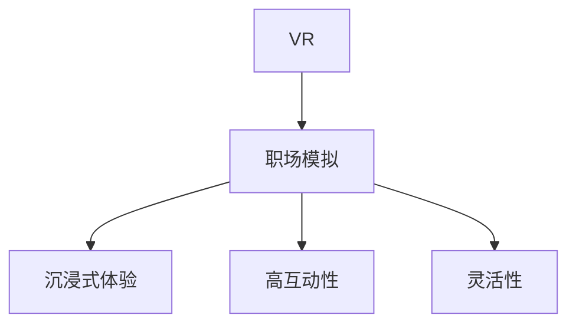

                 

# 虚拟现实职场模拟创业：沉浸式职业培训

## 1. 背景介绍

随着数字经济的蓬勃发展，职业培训需求日益增长。传统的课堂教学难以满足企业对于员工技能、知识和职业素养的全方位培养需求。在这样的背景下，虚拟现实(VR)职场模拟应运而生，以其沉浸式体验、高互动性、灵活性等优势，为职业培训提供了全新的解决路径。本文将聚焦于虚拟现实职场模拟创业，介绍其技术原理和应用实践，帮助创业者理解这一领域的发展潜力和前景。

### 1.1 问题由来

当前，全球经济正经历深刻变革，技术创新和新产业不断涌现。企业对于高素质人才的需求愈发迫切，而传统职业培训方式已经难以满足现代企业的人才培养需求。加之疫情带来的远程办公普及，更加剧了对灵活、安全、互动性强的职业培训技术的需求。在这样的背景下，虚拟现实技术逐渐成为职业培训的新宠，被寄予厚望。

### 1.2 问题核心关键点

虚拟现实职场模拟的核心理念是通过构建仿真场景，让学员沉浸其中，通过模拟真实工作场景，提升其职业技能和应对突发状况的能力。相较于传统的面对面或远程授课，VR职场模拟的优势在于：

- **沉浸式体验**：通过三维建模和实时渲染，学员能够深入体验真实的职场环境，如同亲临其境。
- **高互动性**：通过交互式设计，学员可以与虚拟环境互动，完成工作任务，模拟真实决策。
- **灵活性**：可以按需定制模拟场景，适应不同岗位和业务流程的需要。

这些特性使得VR职场模拟在职业技能培训、应急演练、团队协作训练等领域具备广阔的应用前景。

## 2. 核心概念与联系

### 2.1 核心概念概述

为了更好地理解虚拟现实职场模拟的创业过程，本节将介绍几个关键核心概念及其相互联系：

- **虚拟现实(VR)**：通过计算机生成仿真的三维环境，使用户通过特定的头盔、手柄等设备，进入一个沉浸式的视觉、听觉、触觉体验空间。
- **职场模拟**：基于真实职业场景，通过虚拟现实技术构建的模拟工作环境，让学员在安全、可控的环境中，通过反复练习，提升职业技能和应急处理能力。
- **沉浸式体验**：通过虚拟现实技术，构建一个尽可能接近真实场景的仿真环境，让用户能够身临其境，感受和操作模拟环境。
- **高互动性**：通过交互式设计，实现与虚拟环境、同事、客户等实体的互动，提升用户的沉浸感和真实感。
- **灵活性**：可以按需定制模拟场景，适应不同岗位、不同业务流程和培训需求。

这些概念之间的逻辑关系可以通过以下Mermaid流程图来展示：



这个流程图展示了虚拟现实职场模拟的核心概念及其之间的联系：

1. VR技术提供了沉浸式的体验空间。
2. 职场模拟通过VR技术，实现了逼真的工作场景。
3. 高互动性是VR职场模拟的灵魂，通过交互式设计提升用户的沉浸感。
4. 灵活性使VR职场模拟可以按需定制，适应不同培训需求。

这些概念共同构成了虚拟现实职场模拟的技术框架，为其在职业培训中的应用提供了坚实的基础。

## 3. 核心算法原理 & 具体操作步骤

### 3.1 算法原理概述

虚拟现实职场模拟的核心算法原理主要涉及以下几个方面：

- **三维建模**：通过计算机生成逼真的三维模型，包括场景、角色、物体等，为用户提供沉浸式的视觉体验。
- **物理引擎**：实现物体之间的相互作用和动态效果，如碰撞检测、重力、摩擦等，提升模拟的真实感。
- **实时渲染**：使用高性能图形处理器(GPU)，实时渲染场景和对象，确保用户体验的流畅性。
- **交互式设计**：设计交互式界面，实现与虚拟环境、同事、客户等的互动，增强用户体验的真实感。
- **仿真与训练**：通过仿真技术，模拟真实的工作场景和突发状况，进行技能训练和应急演练。

这些算法和技术共同构建了虚拟现实职场模拟的完整框架，为其在职业培训中的应用提供了技术支持。

### 3.2 算法步骤详解

虚拟现实职场模拟的核心步骤包括：

1. **需求分析**：根据目标职业和培训需求，确定模拟场景的主题、工作流程、技能点等，制定详细的培训方案。
2. **场景设计**：基于设计方案，构建三维场景和角色，设计交互式界面，实现虚拟环境的搭建。
3. **内容制作**：制作逼真的场景元素，如建筑物、设备、道具等，并进行动画和特效设计，提升模拟的真实感。
4. **系统集成**：将三维场景、物理引擎、实时渲染、交互式设计和仿真训练等模块集成到一个完整的虚拟现实系统中。
5. **测试优化**：在模拟环境中进行测试，收集用户反馈，不断优化和改进系统，提升用户体验。

### 3.3 算法优缺点

虚拟现实职场模拟在职业培训中的应用，具有以下优点：

- **沉浸式体验**：通过虚拟现实技术，提供高度沉浸式的学习环境，提升学习效率和效果。
- **高互动性**：通过交互式设计，增强学习者的主动性和参与感，提升学习兴趣。
- **灵活性**：可以根据不同职业和培训需求，按需定制模拟场景，提高培训的针对性和实用性。
- **安全性**：在安全环境中进行技能训练和应急演练，减少现实中的风险和成本。

同时，也存在一些局限性：

- **技术门槛高**：虚拟现实职场模拟涉及三维建模、物理引擎、实时渲染等技术，需要较高的技术投入和人才储备。
- **硬件设备成本高**：头盔、手柄等VR设备成本较高，普及度有待提升。
- **内容开发周期长**：每个职业和场景都需要单独设计和制作，开发周期较长。
- **交互设计复杂**：交互式设计需要深入理解用户的实际工作流程和需求，设计难度较大。

### 3.4 算法应用领域

虚拟现实职场模拟在职业培训中的应用，涵盖了多个领域：

- **医疗健康**：通过模拟手术、急救、护理等场景，提升医护人员的实操能力和应急处理能力。
- **金融保险**：通过模拟金融交易、风险评估、客户服务等场景，提升员工的业务技能和客户服务水平。
- **制造业**：通过模拟生产线、设备操作、安全演练等场景，提升员工的职业技能和安全生产意识。
- **物流运输**：通过模拟仓储管理、配送调度、应急处理等场景，提升物流从业人员的效率和应对突发事件的能力。
- **教育培训**：通过模拟教学场景、实验操作、课程演练等场景，提升学生的学习效果和实践能力。

这些应用领域展示了虚拟现实职场模拟在职业培训中的广泛应用前景。

## 4. 数学模型和公式 & 详细讲解 & 举例说明

### 4.1 数学模型构建

在虚拟现实职场模拟中，数学模型主要用于场景设计和仿真训练。下面以医疗健康领域的手术模拟为例，介绍数学模型的构建过程。

1. **三维建模**：
   - 使用计算机图形学中的三维建模技术，生成逼真的手术场景，包括手术室、手术台、器械等。
   - 场景建模通常采用三角网格模型，使用3DMax、Maya等软件进行建模。

2. **物理引擎**：
   - 使用物理引擎实现手术器械和人体模型的碰撞检测、运动仿真和动态效果。
   - 常用的物理引擎包括Oculus Physics、Unity Physics等。

3. **实时渲染**：
   - 使用高性能GPU进行实时渲染，将场景和模型渲染成逼真的三维图像。
   - 常用的渲染技术包括光线追踪、片元着色等。

### 4.2 公式推导过程

以手术模拟为例，其数学模型可以表示为：

$$
\mathcal{M} = \mathcal{G} \times \mathcal{P} \times \mathcal{R}
$$

其中：
- $\mathcal{G}$：三维场景几何模型
- $\mathcal{P}$：物理引擎，实现动态效果
- $\mathcal{R}$：实时渲染引擎，生成三维图像

### 4.3 案例分析与讲解

以医疗健康领域的手术模拟为例，其数学模型构建和仿真训练过程如下：

1. **三维场景建模**：
   - 使用3DMax建模手术室、手术台、器械等，生成几何模型。
   - 使用Maya进行场景的灯光、材质、纹理等设置。

2. **物理引擎仿真**：
   - 在Unity中导入几何模型和材质，使用Oculus Physics实现手术器械和人体模型的碰撞检测、运动仿真和动态效果。
   - 设置手术器械的物理属性，如重量、摩擦、弹性等。

3. **实时渲染**：
   - 使用Unity的实时渲染引擎，将场景渲染成三维图像。
   - 设置光源和阴影，提升渲染效果。

## 5. 项目实践：代码实例和详细解释说明

### 5.1 开发环境搭建

在进行虚拟现实职场模拟开发前，需要准备好开发环境。以下是使用Unity和Oculus设备进行开发的配置步骤：

1. 安装Unity：从官网下载Unity编辑器，安装到本地电脑中。
2. 安装Oculus SDK：从Oculus官网下载并安装Oculus SDK，包括SDK、Runtime和SDK Manager。
3. 配置开发环境：安装Unity的Oculus插件，配置Unity与Oculus设备的连接方式。
4. 配置VR设备：连接Oculus设备到计算机，进行设备检测和配置。

### 5.2 源代码详细实现

下面以医疗健康领域的手术模拟为例，给出使用Unity和Oculus设备进行开发的源代码实现。

1. **三维场景建模**：
   - 在Unity中，使用3DMax或Maya导入手术室、手术台、器械等几何模型。
   - 设置场景的灯光、材质、纹理等，提升渲染效果。

2. **物理引擎仿真**：
   - 在Unity中，使用Oculus Physics实现手术器械和人体模型的碰撞检测、运动仿真和动态效果。
   - 设置手术器械的物理属性，如重量、摩擦、弹性等。

3. **实时渲染**：
   - 使用Unity的实时渲染引擎，将场景渲染成三维图像。
   - 设置光源和阴影，提升渲染效果。

```csharp
using UnityEngine;
using UnityEditor;
using OculusXR;

public class SurgeonSimulation : MonoBehaviour
{
    public GameObject surgeonObject;
    public GameObject patientObject;
    public GameObject scalpelObject;

    // 设置手术器械的物理属性
    void Start()
    {
        surgeonObject.GetComponent<OculusPhysicsBody>().AddRigidbody();
        scalpelObject.GetComponent<OculusPhysicsBody>().AddRigidbody();
        patientObject.GetComponent<OculusPhysicsBody>().AddRigidbody();
    }

    // 实现手术器械和人体模型的碰撞检测
    void Update()
    {
        OculusPhysicsCheckCollision();
    }

    // 实现手术器械和人体模型的运动仿真
    void FixedUpdate()
    {
        OculusPhysicsSimulate();
    }

    // 实现手术器械和人体模型的动态效果
    void OnCollisionEnter(Collision collision)
    {
        OculusPhysicsAddImpulse(collision.object1, 10f);
    }
}
```

### 5.3 代码解读与分析

让我们再详细解读一下关键代码的实现细节：

**SurgeonSimulation类**：
- `Start`方法：在场景初始化时，为手术器械、人体模型添加物理引擎，使其可以进行碰撞检测、运动仿真和动态效果。
- `Update`方法：实现手术器械和人体模型的碰撞检测，及时响应碰撞事件。
- `FixedUpdate`方法：实现手术器械和人体模型的运动仿真，保证模拟的真实性。
- `OnCollisionEnter`方法：在发生碰撞时，为碰撞物体施加冲击力，实现动态效果。

**三维场景建模和物理引擎仿真**：
- 通过Unity的3DMax或Maya插件导入几何模型，并使用Oculus Physics实现碰撞检测、运动仿真和动态效果。
- 设置手术器械的物理属性，如重量、摩擦、弹性等，提升模拟的真实性。

**实时渲染**：
- 使用Unity的实时渲染引擎，将场景渲染成三维图像。
- 设置光源和阴影，提升渲染效果。

## 6. 实际应用场景

### 6.1 智能制造

在智能制造领域，虚拟现实职场模拟可以用于生产线的操作培训和应急演练。通过模拟真实生产线的工作流程和突发状况，提升员工的操作技能和应急处理能力。

### 6.2 航空航天

在航空航天领域，虚拟现实职场模拟可以用于飞行员的飞行训练和应急处置。通过模拟不同天气条件、飞行任务等场景，提升飞行员的操作技能和应对突发事件的能力。

### 6.3 消防救援

在消防救援领域，虚拟现实职场模拟可以用于消防员的培训和演练。通过模拟火灾现场、疏散逃生等场景，提升消防员的操作技能和应急处理能力。

### 6.4 未来应用展望

随着技术的不断发展，虚拟现实职场模拟在职业培训中的应用将更加广泛和深入。未来，虚拟现实职场模拟可能具备以下趋势：

1. **更加逼真的场景设计**：通过高精度的三维建模和实时渲染技术，构建更加真实、逼真的虚拟场景。
2. **更灵活的内容定制**：支持用户按需定制虚拟场景和交互界面，适应不同职业和培训需求。
3. **更高效的内容制作**：采用自动化内容生成和优化技术，缩短内容制作周期，提升内容质量。
4. **更高的互动性和沉浸感**：引入更多的交互式设计和AI技术，提升用户的沉浸感和参与感。
5. **更加广泛的行业应用**：拓展到更多领域，如医疗健康、金融保险、教育培训等，满足不同行业的职业培训需求。

## 7. 工具和资源推荐

### 7.1 学习资源推荐

为了帮助开发者系统掌握虚拟现实职场模拟的技术和应用，这里推荐一些优质的学习资源：

1. **Unity官方文档**：提供全面的Unity开发文档和教程，包括3D建模、物理引擎、实时渲染等内容。
2. **Oculus SDK文档**：提供Oculus SDK的详细文档和示例代码，帮助开发者了解Oculus设备的开发和使用。
3. **VR职场模拟论文**：阅读相关论文，了解最新的研究成果和应用案例，如《Virtual Reality Simulations in Medical Training》等。
4. **VR职场模拟课程**：参加相关课程，学习虚拟现实职场模拟的开发和应用，如Coursera的《Virtual Reality Development》课程。

### 7.2 开发工具推荐

高效的开发离不开优秀的工具支持。以下是几款用于虚拟现实职场模拟开发的常用工具：

1. **Unity**：提供强大的3D游戏和虚拟现实开发能力，支持3D建模、物理引擎、实时渲染等。
2. **Oculus SDK**：提供Oculus设备的开发支持，包括SDK、Runtime和SDK Manager等。
3. **Maya**：提供高精度的三维建模工具，支持复杂场景的构建和动画设计。
4. **3DMax**：提供专业的3D建模和渲染工具，支持复杂场景的构建和灯光、材质、纹理等设置。
5. **Oculus Physics**：提供Oculus设备的物理引擎支持，实现逼真的碰撞检测和运动仿真。

### 7.3 相关论文推荐

虚拟现实职场模拟在职业培训中的应用，源于学界的持续研究。以下是几篇奠基性的相关论文，推荐阅读：

1. **Virtual Reality Training in Surgical Skills**：探讨虚拟现实在手术技能培训中的应用，提升手术操作技能和应急处理能力。
2. **A Comparison of Virtual Reality Training and Real-World Training in Emergency Care**：对比虚拟现实和现实世界在急诊护理培训中的应用效果，证明虚拟现实培训的有效性。
3. **Virtual Reality for the Improvement of Cognitive Skills**：探讨虚拟现实在认知技能培训中的应用，提升学习者的认知能力和应用能力。

## 8. 总结：未来发展趋势与挑战

### 8.1 研究成果总结

本文介绍了虚拟现实职场模拟的原理和应用实践，详细讲解了虚拟现实职场模拟的技术框架和具体实现方法。通过具体的案例分析，展示了虚拟现实职场模拟在职业培训中的应用效果和潜力。

### 8.2 未来发展趋势

展望未来，虚拟现实职场模拟在职业培训中的应用将呈现以下几个发展趋势：

1. **更加逼真的场景设计**：通过高精度的三维建模和实时渲染技术，构建更加真实、逼真的虚拟场景。
2. **更灵活的内容定制**：支持用户按需定制虚拟场景和交互界面，适应不同职业和培训需求。
3. **更高效的内容制作**：采用自动化内容生成和优化技术，缩短内容制作周期，提升内容质量。
4. **更高的互动性和沉浸感**：引入更多的交互式设计和AI技术，提升用户的沉浸感和参与感。
5. **更加广泛的行业应用**：拓展到更多领域，如医疗健康、金融保险、教育培训等，满足不同行业的职业培训需求。

### 8.3 面临的挑战

尽管虚拟现实职场模拟在职业培训中具备广阔的应用前景，但在实际落地过程中，仍面临一些挑战：

1. **技术门槛高**：虚拟现实职场模拟涉及三维建模、物理引擎、实时渲染等技术，需要较高的技术投入和人才储备。
2. **硬件设备成本高**：头盔、手柄等VR设备成本较高，普及度有待提升。
3. **内容开发周期长**：每个职业和场景都需要单独设计和制作，开发周期较长。
4. **交互设计复杂**：交互式设计需要深入理解用户的实际工作流程和需求，设计难度较大。
5. **用户体验问题**：虚拟现实职场模拟的效果和用户体验仍需进一步提升，避免用户的疲劳和不适。

### 8.4 研究展望

面对虚拟现实职场模拟所面临的挑战，未来的研究需要在以下几个方面寻求新的突破：

1. **提高内容的定制化程度**：通过智能推荐系统，用户可以根据自身需求，快速定制虚拟场景和交互界面。
2. **优化内容的自动化生成**：采用自动化内容生成和优化技术，减少内容制作周期，提升内容质量。
3. **提升用户体验**：通过增强现实(AR)等技术，提升虚拟现实职场模拟的交互性和沉浸感。
4. **降低硬件设备成本**：研发低成本、易携带的VR设备，提升虚拟现实职场模拟的普及度和应用范围。
5. **提升交互设计水平**：通过用户体验研究，提升交互式设计的水平，增强虚拟现实职场模拟的易用性和实用性。

这些研究方向的探索，必将引领虚拟现实职场模拟技术迈向更高的台阶，为职业培训带来新的突破。

## 9. 附录：常见问题与解答

**Q1：虚拟现实职场模拟的开发流程有哪些关键步骤？**

A: 虚拟现实职场模拟的开发流程包括：需求分析、场景设计、内容制作、系统集成和测试优化。具体来说：

1. **需求分析**：根据目标职业和培训需求，确定模拟场景的主题、工作流程、技能点等，制定详细的培训方案。
2. **场景设计**：基于设计方案，构建三维场景和角色，设计交互式界面，实现虚拟环境的搭建。
3. **内容制作**：制作逼真的场景元素，如建筑物、设备、道具等，并进行动画和特效设计，提升模拟的真实感。
4. **系统集成**：将三维场景、物理引擎、实时渲染、交互式设计和仿真训练等模块集成到一个完整的虚拟现实系统中。
5. **测试优化**：在模拟环境中进行测试，收集用户反馈，不断优化和改进系统，提升用户体验。

**Q2：虚拟现实职场模拟的硬件设备成本高，有哪些降低成本的方案？**

A: 虚拟现实职场模拟的硬件设备成本较高，可以采用以下方案降低成本：

1. **开源硬件**：选择开源硬件平台，如OpenXR、WebXR等，开发跨平台的虚拟现实应用。
2. **硬件租赁**：通过VR设备的租赁服务，降低单个设备的使用成本。
3. **低成本设备**：选择低成本的VR设备，如Google Cardboard、Oculus Quest 2等，降低设备采购成本。
4. **设备共享**：建立设备共享平台，提高设备利用率，降低单个设备的使用成本。

**Q3：虚拟现实职场模拟的交互设计有哪些技巧？**

A: 虚拟现实职场模拟的交互设计需要考虑以下几个技巧：

1. **简洁明了**：交互界面设计应简洁明了，避免用户操作复杂，降低学习曲线。
2. **实时反馈**：在用户操作后，及时提供实时反馈，提升用户体验。
3. **自然互动**：设计自然、逼真的互动方式，增强用户的沉浸感和真实感。
4. **多通道输入**：采用多通道输入方式，如手柄、鼠标、键盘等，提高交互的灵活性。
5. **情境化设计**：根据不同的职业场景和任务需求，设计情境化的交互方式，提升交互的针对性。

**Q4：虚拟现实职场模拟在职业培训中的应用前景如何？**

A: 虚拟现实职场模拟在职业培训中的应用前景广阔：

1. **沉浸式体验**：通过虚拟现实技术，提供高度沉浸式的学习环境，提升学习效率和效果。
2. **高互动性**：通过交互式设计，增强学习者的主动性和参与感，提升学习兴趣。
3. **灵活性**：可以根据不同职业和培训需求，按需定制模拟场景，提高培训的针对性和实用性。
4. **安全性**：在安全环境中进行技能训练和应急演练，减少现实中的风险和成本。
5. **广泛应用**：在医疗健康、金融保险、制造、物流、教育等多个领域，具有广泛的应用前景。

**Q5：虚拟现实职场模拟的开发难度大吗？**

A: 虚拟现实职场模拟的开发难度较大，主要体现在以下几个方面：

1. **技术门槛高**：虚拟现实职场模拟涉及三维建模、物理引擎、实时渲染等技术，需要较高的技术投入和人才储备。
2. **交互设计复杂**：交互式设计需要深入理解用户的实际工作流程和需求，设计难度较大。
3. **内容制作周期长**：每个职业和场景都需要单独设计和制作，开发周期较长。
4. **硬件设备成本高**：头盔、手柄等VR设备成本较高，普及度有待提升。

## 附录：常见问题与解答

---

作者：禅与计算机程序设计艺术 / Zen and the Art of Computer Programming

